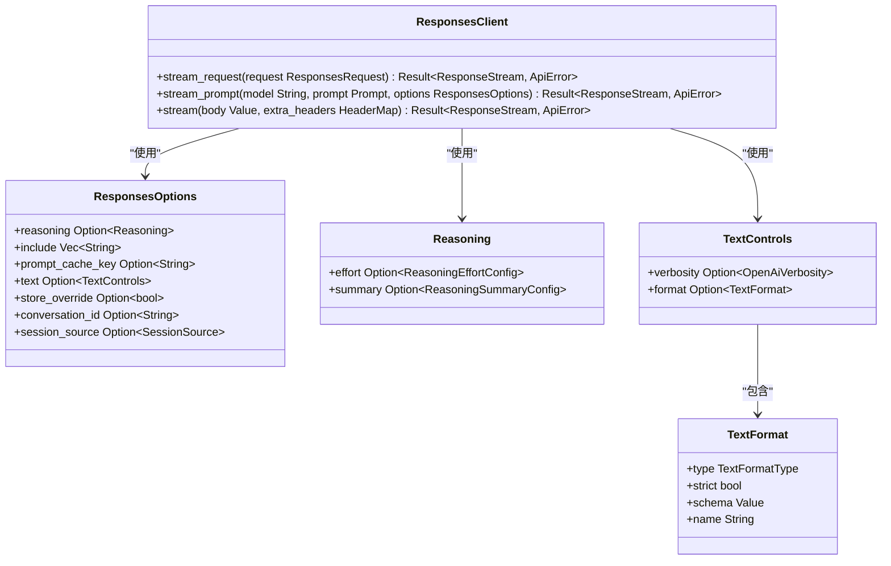
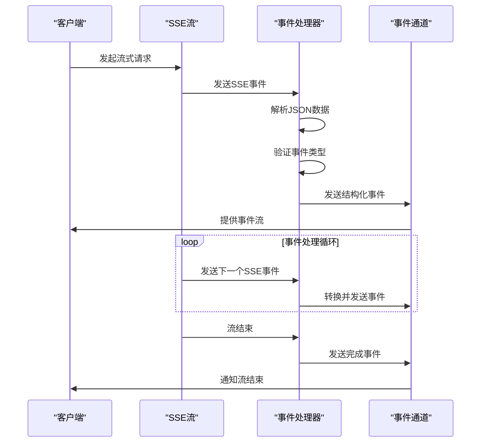
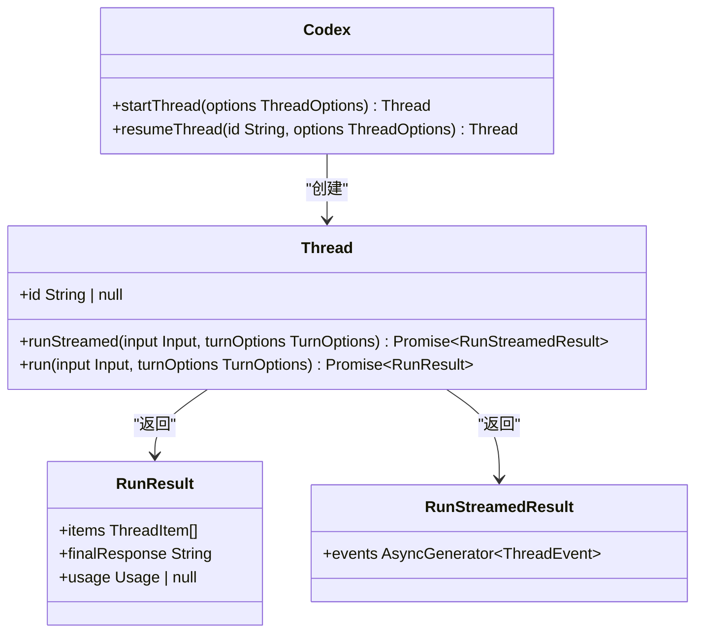
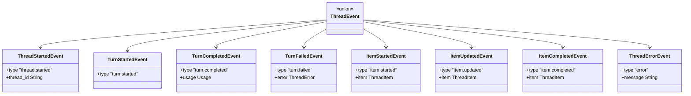
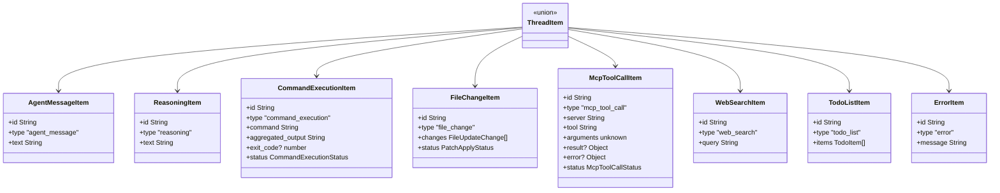
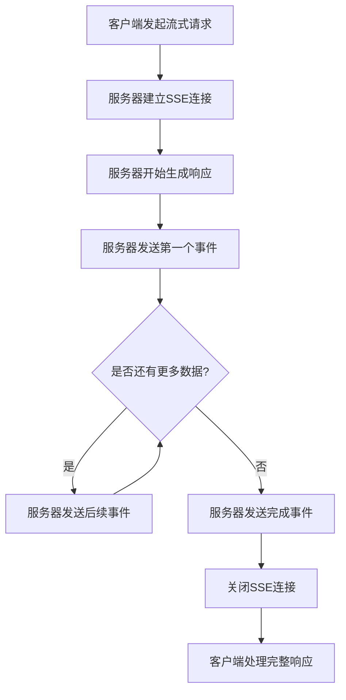
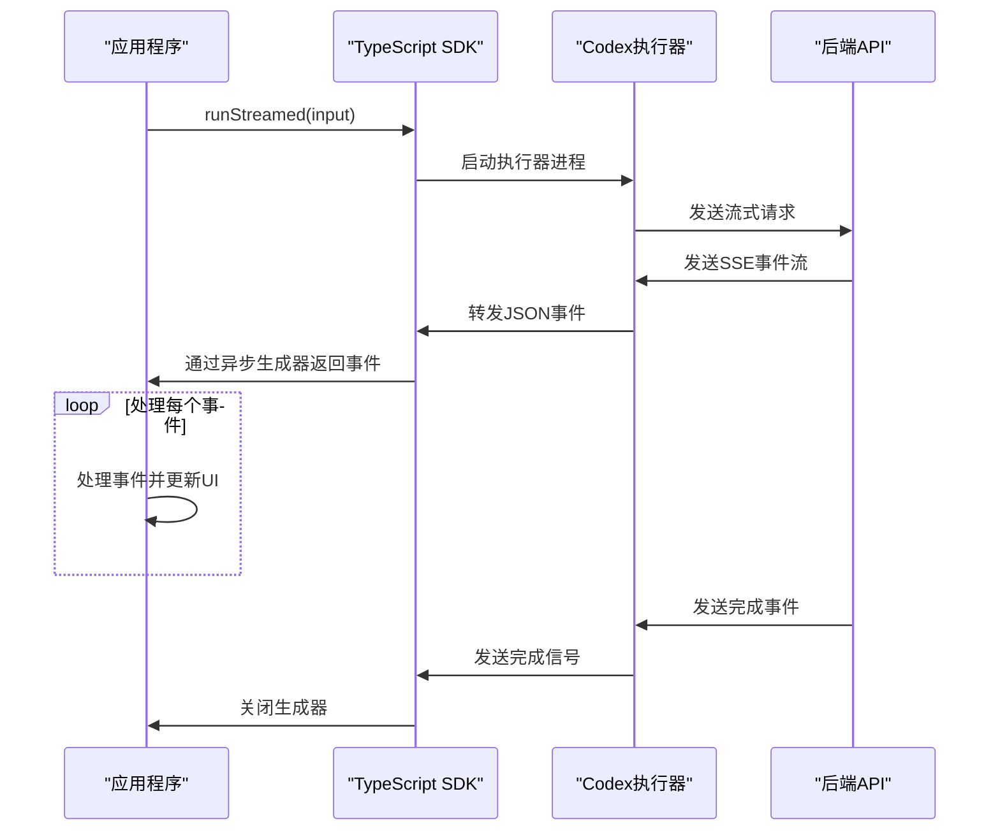
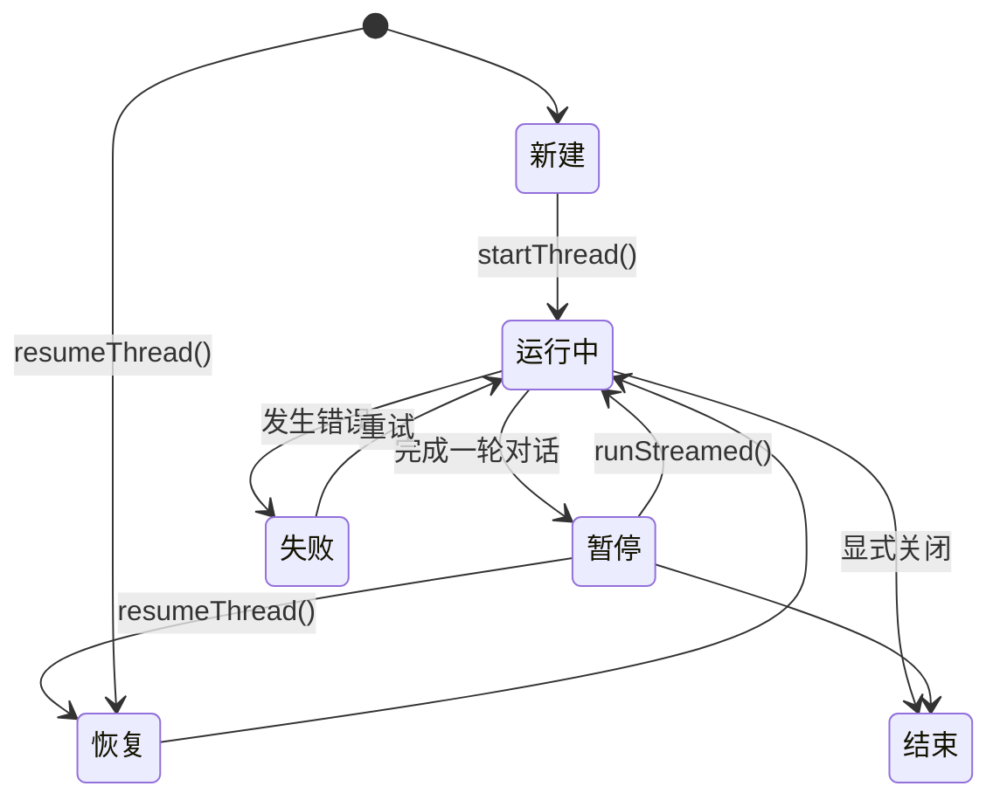
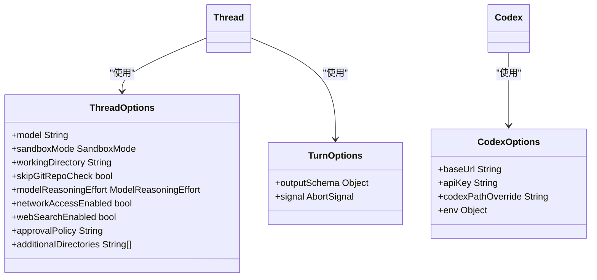
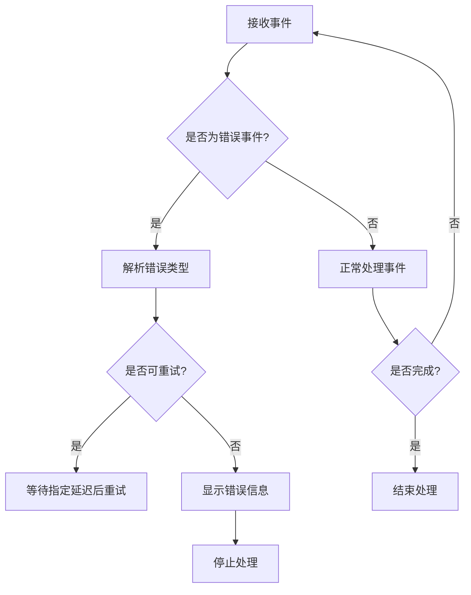

# API文档

<cite>
**本文档中引用的文件**  
- [lib.rs](file://codex-rs/codex-api/src/lib.rs)
- [chat.rs](file://codex-rs/codex-api/src/endpoint/chat.rs)
- [responses.rs](file://codex-rs/codex-api/src/endpoint/responses.rs)
- [common.rs](file://codex-rs/codex-api/src/common.rs)
- [sse/chat.rs](file://codex-rs/codex-api/src/sse/chat.rs)
- [sse/responses.rs](file://codex-rs/codex-api/src/sse/responses.rs)
- [requests/chat.rs](file://codex-rs/codex-api/src/requests/chat.rs)
- [requests/responses.rs](file://codex-rs/codex-api/src/requests/responses.rs)
- [codex.ts](file://sdk/typescript/src/codex.ts)
- [thread.ts](file://sdk/typescript/src/thread.ts)
- [events.ts](file://sdk/typescript/src/events.ts)
- [items.ts](file://sdk/typescript/src/items.ts)
- [package.json](file://sdk/typescript/package.json)
</cite>

## 目录
1. [简介](#简介)
2. [Rust后端API](#rust后端api)
3. [TypeScript SDK](#typescript-sdk)
4. [流式响应处理](#流式响应处理)
5. [任务管理](#任务管理)
6. [错误处理](#错误处理)
7. [使用示例](#使用示例)

## 简介
本文档详细说明Codex系统的API架构，包括Rust后端的内部RESTful和流式API端点，以及公开的TypeScript SDK。文档清晰区分了内部API和公共SDK API，为开发者提供完整的集成指南。

## Rust后端API
Codex的Rust后端`codex-api`模块提供了处理AI对话的核心功能，主要通过流式API端点实现高效的实时通信。

### 聊天端点
聊天端点提供流式响应功能，支持实时接收模型生成的文本片段。

```mermaid
classDiagram
class ChatClient {
+stream_request(request ChatRequest) Result~ResponseStream, ApiError~
+stream_prompt(model String, prompt Prompt, conversation_id Option~String~) Result~ResponseStream, ApiError~
+stream(body Value, extra_headers HeaderMap) Result~ResponseStream, ApiError~
}
class ChatRequest {
+body Value
+headers HeaderMap
}
class Prompt {
+instructions String
+input Vec~ResponseItem~
+tools Vec~Value~
+parallel_tool_calls bool
+output_schema Option~Value~
}
class ResponseEvent {
+Created
+OutputItemDone(ResponseItem)
+OutputItemAdded(ResponseItem)
+Completed{response_id String, token_usage Option~TokenUsage~}
+OutputTextDelta(String)
+ReasoningContentDelta{delta String, content_index i64}
+RateLimits(RateLimitSnapshot)
}
ChatClient --> ChatRequest : "使用"
ChatClient --> Prompt : "使用"
ChatClient --> ResponseEvent : "产生"
```

**图源**
- [chat.rs](file://codex-rs/codex-api/src/endpoint/chat.rs#L27-L86)
- [common.rs](file://codex-rs/codex-api/src/common.rs#L40-L62)
- [requests/chat.rs](file://codex-rs/codex-api/src/requests/chat.rs)

**节源**
- [chat.rs](file://codex-rs/codex-api/src/endpoint/chat.rs#L27-L86)
- [common.rs](file://codex-rs/codex-api/src/common.rs#L16-L30)

### 响应端点
响应端点提供更丰富的配置选项，支持推理控制、包含选项和缓存等功能。



**图源**
- [responses.rs](file://codex-rs/codex-api/src/endpoint/responses.rs#L22-L108)
- [common.rs](file://codex-rs/codex-api/src/common.rs#L64-L108)

**节源**
- [responses.rs](file://codex-rs/codex-api/src/endpoint/responses.rs#L22-L108)
- [common.rs](file://codex-rs/codex-api/src/common.rs#L64-L108)

### 流式处理机制
流式处理机制负责解析服务器发送的SSE（Server-Sent Events）数据流，将其转换为结构化的事件流。



**图源**
- [sse/chat.rs](file://codex-rs/codex-api/src/sse/chat.rs#L21-L34)
- [sse/responses.rs](file://codex-rs/codex-api/src/sse/responses.rs#L48-L63)

**节源**
- [sse/chat.rs](file://codex-rs/codex-api/src/sse/chat.rs#L21-L34)
- [sse/responses.rs](file://codex-rs/codex-api/src/sse/responses.rs#L48-L63)

## TypeScript SDK
TypeScript SDK为开发者提供了简洁的接口来与Codex系统交互，封装了底层API的复杂性。

### 核心类结构
SDK的核心类结构提供了与Codex代理交互的主要入口点。



**图源**
- [codex.ts](file://sdk/typescript/src/codex.ts#L11-L38)
- [thread.ts](file://sdk/typescript/src/thread.ts#L40-L137)

**节源**
- [codex.ts](file://sdk/typescript/src/codex.ts#L11-L38)
- [thread.ts](file://sdk/typescript/src/thread.ts#L40-L137)

### 事件系统
事件系统定义了SDK与Codex代理通信时产生的各种事件类型。



**图源**
- [events.ts](file://sdk/typescript/src/events.ts#L6-L80)

**节源**
- [events.ts](file://sdk/typescript/src/events.ts#L6-L80)

### 项目类型
项目类型定义了代理在处理请求时生成的各种内容项。



**图源**
- [items.ts](file://sdk/typescript/src/items.ts#L9-L127)

**节源**
- [items.ts](file://sdk/typescript/src/items.ts#L9-L127)

## 流式响应处理
流式响应处理是Codex系统的核心特性，允许客户端实时接收和处理模型生成的内容。

### 流式API工作流程
流式API通过SSE协议实现服务器到客户端的单向实时通信。



**图源**
- [sse/chat.rs](file://codex-rs/codex-api/src/sse/chat.rs#L21-L34)
- [sse/responses.rs](file://codex-rs/codex-api/src/sse/responses.rs#L48-L63)

**节源**
- [sse/chat.rs](file://codex-rs/codex-api/src/sse/chat.rs#L21-L34)
- [sse/responses.rs](file://codex-rs/codex-api/src/sse/responses.rs#L48-L63)

### SDK流式处理
SDK封装了底层的流式处理逻辑，为开发者提供简洁的异步生成器接口。



**图源**
- [thread.ts](file://sdk/typescript/src/thread.ts#L65-L110)
- [exec.ts](file://sdk/typescript/src/exec.ts)

**节源**
- [thread.ts](file://sdk/typescript/src/thread.ts#L65-L110)

## 任务管理
Codex系统提供了完整的任务管理功能，支持会话的创建、恢复和状态跟踪。

### 会话生命周期
会话生命周期管理确保用户能够持续与代理交互，即使在应用程序重启后也能恢复上下文。



**图源**
- [codex.ts](file://sdk/typescript/src/codex.ts#L24-L36)
- [thread.ts](file://sdk/typescript/src/thread.ts#L47-L50)

**节源**
- [codex.ts](file://sdk/typescript/src/codex.ts#L24-L36)
- [thread.ts](file://sdk/typescript/src/thread.ts#L47-L50)

### 线程选项配置
线程选项允许开发者自定义代理的行为，包括模型选择、沙箱模式和网络访问等。



**图源**
- [threadOptions.ts](file://sdk/typescript/src/threadOptions.ts)
- [turnOptions.ts](file://sdk/typescript/src/turnOptions.ts)
- [codexOptions.ts](file://sdk/typescript/src/codexOptions.ts)

**节源**
- [threadOptions.ts](file://sdk/typescript/src/threadOptions.ts)
- [turnOptions.ts](file://sdk/typescript/src/turnOptions.ts)
- [codexOptions.ts](file://sdk/typescript/src/codexOptions.ts)

## 错误处理
Codex系统提供了全面的错误处理机制，确保客户端能够正确处理各种异常情况。

### 错误类型分类
系统定义了多种错误类型，帮助开发者识别和处理不同场景下的问题。

```mermaid
classDiagram
class ApiError {
<<enum>>
+Stream(String)
+ContextWindowExceeded
+QuotaExceeded
+UsageNotIncluded
+Retryable{message String, delay Option~Duration~}
}
class ThreadError {
+message String
}
class ThreadErrorEvent {
+type "error"
+message String
}
class TurnFailedEvent {
+type "turn.failed"
+error ThreadError
}
ApiError --> ThreadError : "映射"
ThreadError --> ThreadErrorEvent : "包含"
ThreadError --> TurnFailedEvent : "包含"
```

**图源**
- [error.rs](file://codex-rs/codex-api/src/error.rs)
- [events.ts](file://sdk/typescript/src/events.ts#L60-L69)

**节源**
- [error.rs](file://codex-rs/codex-api/src/error.rs)
- [events.ts](file://sdk/typescript/src/events.ts#L60-L69)

### 错误处理流程
错误处理流程确保客户端能够优雅地处理各种错误情况，提供适当的用户反馈。



**图源**
- [sse/responses.rs](file://codex-rs/codex-api/src/sse/responses.rs#L239-L257)
- [thread.ts](file://sdk/typescript/src/thread.ts#L119-L135)

**节源**
- [sse/responses.rs](file://codex-rs/codex-api/src/sse/responses.rs#L239-L257)
- [thread.ts](file://sdk/typescript/src/thread.ts#L119-L135)

## 使用示例
以下示例展示了如何使用TypeScript SDK与Codex系统进行交互。

### 基本流式调用
```typescript
import { Codex } from "@openai/codex-sdk";

// 创建Codex实例
const codex = new Codex({
  apiKey: "your-api-key",
  baseUrl: "https://api.example.com"
});

// 创建新会话
const thread = codex.startThread({
  model: "gpt-5.1",
  sandboxMode: "auto"
});

// 流式处理响应
const { events } = await thread.runStreamed("Hello, how are you?");

for await (const event of events) {
  if (event.type === "item.completed") {
    if (event.item.type === "agent_message") {
      console.log("AI:", event.item.text);
    }
  }
}
```

**节源**
- [basic_streaming.ts](file://sdk/typescript/samples/basic_streaming.ts)

### 结构化输出
```typescript
import { Codex } from "@openai/codex-sdk";
import { z } from "zod";

// 定义输出模式
const schema = z.object({
  summary: z.string(),
  keywords: z.array(z.string()),
  sentiment: z.enum(["positive", "negative", "neutral"])
});

// 创建带有结构化输出的会话
const codex = new Codex();
const thread = codex.startThread();

// 运行并获取结构化结果
const result = await thread.run("Analyze this text: 'The weather is great today!'", {
  outputSchema: schema
});

// 使用结构化数据
console.log("Summary:", result.items[0].text);
```

**节源**
- [structured_output.ts](file://sdk/typescript/samples/structured_output.ts)
- [structured_output_zod.ts](file://sdk/typescript/samples/structured_output_zod.ts)

### 任务管理
```typescript
import { Codex } from "@openai/codex-sdk";

const codex = new Codex();

// 创建新会话并获取ID
const newThread = codex.startThread();
const { events } = await newThread.runStreamed("Write a Python function to calculate factorial");
const threadId = newThread.id;

// 保存ID以便后续恢复

// 恢复之前的会话
const resumedThread = codex.resumeThread(threadId!);
const { events: resumedEvents } = await resumedThread.runStreamed("Add error handling to this function");
```

**节源**
- [codex.ts](file://sdk/typescript/src/codex.ts#L34-L36)
- [thread.ts](file://sdk/typescript/src/thread.ts#L47-L50)

### 错误处理
```typescript
import { Codex } from "@openai/codex-sdk";

const codex = new Codex();

try {
  const thread = codex.startThread();
  const result = await thread.run("This might cause an error");
  console.log("Success:", result.finalResponse);
} catch (error) {
  if (error instanceof Error) {
    console.error("Request failed:", error.message);
    // 根据错误类型采取相应措施
  }
}

// 处理流式响应中的错误
const thread = codex.startThread();
const { events } = await thread.runStreamed("Some input");

for await (const event of events) {
  if (event.type === "turn.failed") {
    console.error("Turn failed:", event.error.message);
    break;
  }
  // 处理其他事件
}
```

**节源**
- [run.test.ts](file://sdk/typescript/tests/run.test.ts)
- [runStreamed.test.ts](file://sdk/typescript/tests/runStreamed.test.ts)