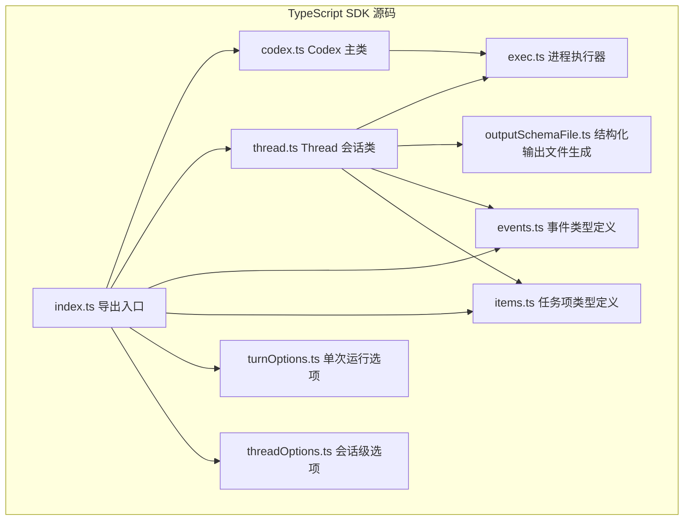
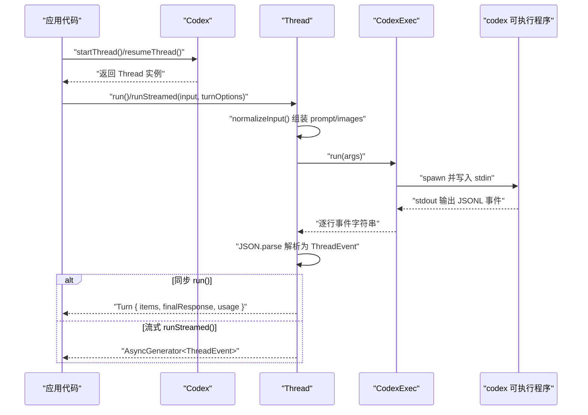
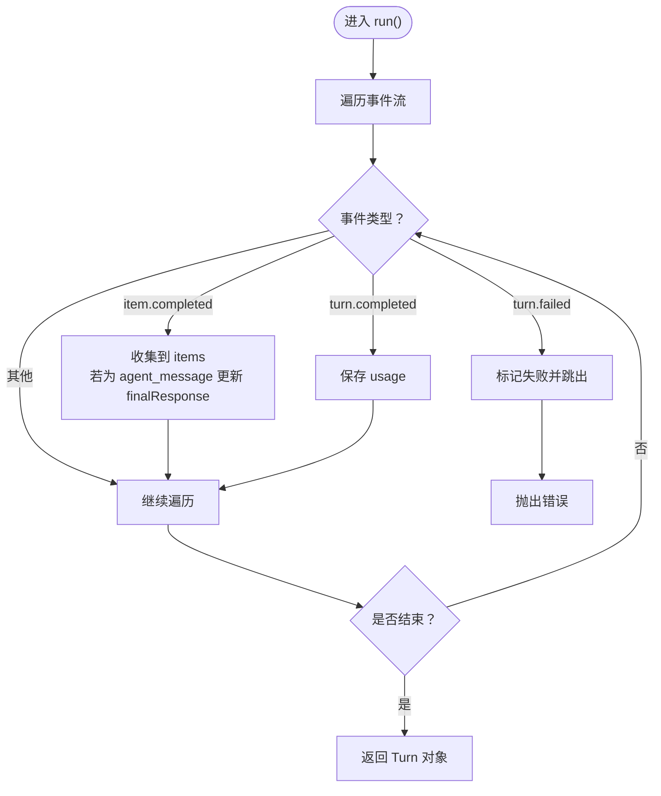
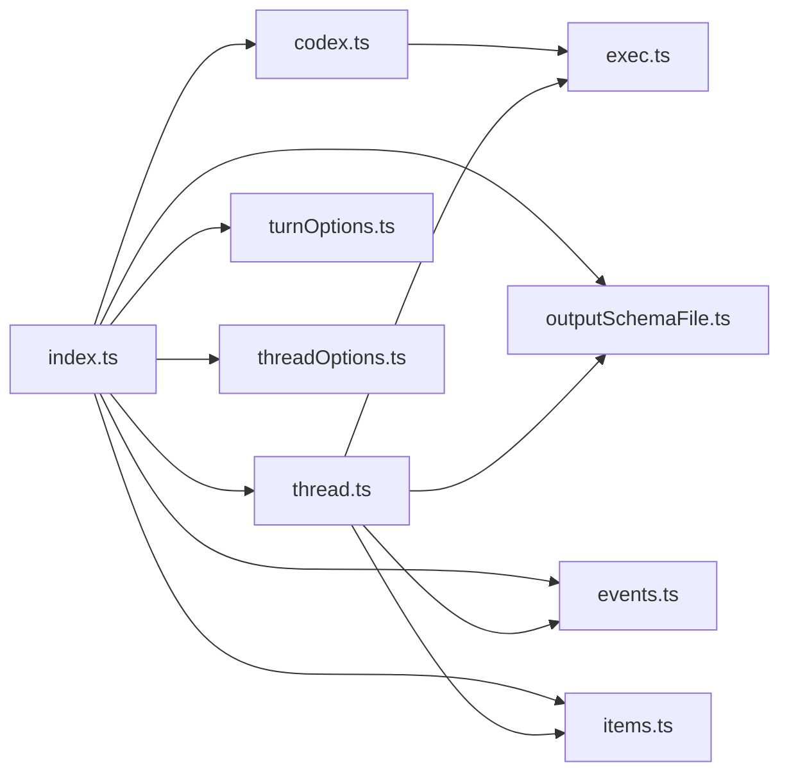

# TypeScript SDK文档

<cite>
**本文引用的文件**
- [sdk/typescript/src/index.ts](file://sdk/typescript/src/index.ts)
- [sdk/typescript/src/codex.ts](file://sdk/typescript/src/codex.ts)
- [sdk/typescript/src/thread.ts](file://sdk/typescript/src/thread.ts)
- [sdk/typescript/src/exec.ts](file://sdk/typescript/src/exec.ts)
- [sdk/typescript/src/events.ts](file://sdk/typescript/src/events.ts)
- [sdk/typescript/src/items.ts](file://sdk/typescript/src/items.ts)
- [sdk/typescript/src/threadOptions.ts](file://sdk/typescript/src/threadOptions.ts)
- [sdk/typescript/src/turnOptions.ts](file://sdk/typescript/src/turnOptions.ts)
- [sdk/typescript/src/outputSchemaFile.ts](file://sdk/typescript/src/outputSchemaFile.ts)
- [sdk/typescript/samples/basic_streaming.ts](file://sdk/typescript/samples/basic_streaming.ts)
- [sdk/typescript/samples/structured_output.ts](file://sdk/typescript/samples/structured_output.ts)
- [sdk/typescript/README.md](file://sdk/typescript/README.md)
- [sdk/typescript/package.json](file://sdk/typescript/package.json)
- [sdk/typescript/tests/run.test.ts](file://sdk/typescript/tests/run.test.ts)
- [sdk/typescript/tests/runStreamed.test.ts](file://sdk/typescript/tests/runStreamed.test.ts)
</cite>

## 目录
1. [简介](#简介)
2. [项目结构](#项目结构)
3. [核心组件](#核心组件)
4. [架构总览](#架构总览)
5. [详细组件分析](#详细组件分析)
6. [依赖关系分析](#依赖关系分析)
7. [性能与并发特性](#性能与并发特性)
8. [故障排查指南](#故障排查指南)
9. [结论](#结论)
10. [附录：示例与最佳实践](#附录示例与最佳实践)

## 简介
本文件为 Codex TypeScript SDK 的全面技术文档，面向前端与 Node.js 开发者，帮助快速理解并正确集成 SDK。文档聚焦以下主题：
- CodexClient 类的公共接口与行为（startThread/resumeThread）
- Thread 类的核心方法 run()/runStreamed() 的参数、返回值与事件流
- 事件系统 events.ts 的使用与监听（turnStarted、turnCompleted、item.* 等）
- 结构化输出 outputSchema 的生成与传递（outputSchemaFile.ts）
- 任务项 items.ts 的类型定义与在任务管理中的作用
- turnOptions.ts 与 threadOptions.ts 在运行时控制中的职责
- 完整的使用示例与错误处理建议

## 项目结构
TypeScript SDK 模块位于 sdk/typescript，核心源码集中在 src 目录，samples 提供示例，tests 提供行为验证。

图表来源
- [sdk/typescript/src/index.ts](file://sdk/typescript/src/index.ts#L1-L40)
- [sdk/typescript/src/codex.ts](file://sdk/typescript/src/codex.ts#L1-L39)
- [sdk/typescript/src/thread.ts](file://sdk/typescript/src/thread.ts#L1-L155)
- [sdk/typescript/src/exec.ts](file://sdk/typescript/src/exec.ts#L1-L254)
- [sdk/typescript/src/events.ts](file://sdk/typescript/src/events.ts#L1-L81)
- [sdk/typescript/src/items.ts](file://sdk/typescript/src/items.ts#L1-L128)
- [sdk/typescript/src/threadOptions.ts](file://sdk/typescript/src/threadOptions.ts#L1-L18)
- [sdk/typescript/src/turnOptions.ts](file://sdk/typescript/src/turnOptions.ts#L1-L7)
- [sdk/typescript/src/outputSchemaFile.ts](file://sdk/typescript/src/outputSchemaFile.ts#L1-L41)

章节来源
- [sdk/typescript/src/index.ts](file://sdk/typescript/src/index.ts#L1-L40)
- [sdk/typescript/package.json](file://sdk/typescript/package.json#L1-L67)

## 核心组件
- Codex：主客户端，负责创建/恢复 Thread 会话。
- Thread：单次对话的载体，支持同步 run() 与流式 runStreamed()。
- CodexExec：封装底层 codex 可执行程序的调用，负责参数拼装、环境变量注入与子进程生命周期管理。
- 事件系统 events.ts：定义线程/回合/任务项的事件类型与负载。
- 任务项 items.ts：定义 agent_message、command_execution、file_change、mcp_tool_call、web_search、todo_list、error 等任务项类型。
- 结构化输出 outputSchemaFile.ts：将传入的 JSON Schema 写入临时文件，并在执行时通过 --output-schema 传递给 CLI。
- 选项类型：
  - threadOptions.ts：模型、沙箱模式、工作目录、网络访问、Web 搜索、审批策略、附加目录等。
  - turnOptions.ts：单次运行的输出结构化 Schema 与取消信号。

章节来源
- [sdk/typescript/src/codex.ts](file://sdk/typescript/src/codex.ts#L1-L39)
- [sdk/typescript/src/thread.ts](file://sdk/typescript/src/thread.ts#L1-L155)
- [sdk/typescript/src/exec.ts](file://sdk/typescript/src/exec.ts#L1-L254)
- [sdk/typescript/src/events.ts](file://sdk/typescript/src/events.ts#L1-L81)
- [sdk/typescript/src/items.ts](file://sdk/typescript/src/items.ts#L1-L128)
- [sdk/typescript/src/outputSchemaFile.ts](file://sdk/typescript/src/outputSchemaFile.ts#L1-L41)
- [sdk/typescript/src/threadOptions.ts](file://sdk/typescript/src/threadOptions.ts#L1-L18)
- [sdk/typescript/src/turnOptions.ts](file://sdk/typescript/src/turnOptions.ts#L1-L7)

## 架构总览
SDK 通过 Codex 创建 Thread，Thread 将输入与选项交给 CodexExec，后者以 JSONL 事件的形式从 codex 可执行程序的标准输出中读取事件流。Thread 对事件进行解析与聚合，最终向调用方暴露同步结果或异步事件流。

图表来源
- [sdk/typescript/src/codex.ts](file://sdk/typescript/src/codex.ts#L1-L39)
- [sdk/typescript/src/thread.ts](file://sdk/typescript/src/thread.ts#L65-L138)
- [sdk/typescript/src/exec.ts](file://sdk/typescript/src/exec.ts#L51-L191)

## 详细组件分析

### Codex 类
- 职责：持有 CodexExec 与全局配置；提供 startThread()/resumeThread() 创建/恢复会话。
- 关键点：
  - 构造函数接收 CodexOptions，内部实例化 CodexExec。
  - startThread(options) 返回新的 Thread 实例。
  - resumeThread(id, options) 基于已保存的 threadId 恢复 Thread。

章节来源
- [sdk/typescript/src/codex.ts](file://sdk/typescript/src/codex.ts#L1-L39)

### Thread 类
- 职责：承载一次或多轮对话，提供 run()/runStreamed() 两种交互方式。
- run(input, turnOptions)：
  - 返回 Turn 对象，包含 items、finalResponse、usage。
  - 内部消费 runStreamedInternal 的事件流，收集 item.completed 作为 items，提取 agent_message 作为 finalResponse，记录 turn.completed 的 usage。
  - 若遇到 turn.failed，则抛出错误。
- runStreamed(input, turnOptions)：
  - 返回 { events: AsyncGenerator<ThreadEvent> }。
  - 内部通过 createOutputSchemaFile 生成临时 Schema 文件并在 finally 中清理。
  - 将 ThreadOptions 与 TurnOptions 合并为 CodexExecArgs，交由 CodexExec.run() 执行。
  - 遍历事件流，解析 JSONL 行为 ThreadEvent，遇到 thread.started 时设置 threadId。
- normalizeInput(input)：
  - 支持字符串或结构化输入数组，将文本段连接为 prompt，本地图片路径收集为 images 列表。

图表来源
- [sdk/typescript/src/thread.ts](file://sdk/typescript/src/thread.ts#L113-L138)

章节来源
- [sdk/typescript/src/thread.ts](file://sdk/typescript/src/thread.ts#L1-L155)

### CodexExec 类
- 职责：将 Thread 的运行参数转换为 codex CLI 的命令行参数，注入必要环境变量，启动子进程并读取 stdout 的 JSONL 事件。
- 关键点：
  - 参数映射：--model、--sandbox、--cd、--add-dir、--skip-git-repo-check、--output-schema、--config（含 model_reasoning_effort、network_access、web_search_request、approval_policy）、--image、resume <threadId>。
  - 环境变量：默认继承 process.env，可被 CodexOptions.env 完全覆盖；SDK 注入 OPENAI_BASE_URL、CODEX_API_KEY、CODEX_INTERNAL_ORIGINATOR_OVERRIDE。
  - 输入输出：stdin 写入 input 文本，stdout 逐行读取 JSONL；stderr 汇集用于错误信息。
  - 退出处理：非零退出码时根据 stderr 抛出错误；finally 清理资源。

章节来源
- [sdk/typescript/src/exec.ts](file://sdk/typescript/src/exec.ts#L1-L254)

### 事件系统 events.ts
- 定义了线程/回合/任务项的事件类型：
  - ThreadStartedEvent：首次事件，携带 thread_id。
  - TurnStartedEvent/TurnCompletedEvent/TurnFailedEvent：回合生命周期事件，Completed 包含 Usage。
  - ItemStartedEvent/ItemUpdatedEvent/ItemCompletedEvent：任务项生命周期事件，Completed 携带 ThreadItem。
  - ThreadErrorEvent：致命错误事件。
- 使用建议：
  - 流式场景优先监听 item.started/updated/completed 以实现进度反馈。
  - 监听 turn.completed 获取 token 使用统计。
  - 监听 turn.failed 处理错误。

章节来源
- [sdk/typescript/src/events.ts](file://sdk/typescript/src/events.ts#L1-L81)

### 任务项 items.ts
- 定义了多种 ThreadItem 类型：
  - AgentMessageItem：助手消息（文本或结构化 JSON）。
  - ReasoningItem：推理摘要。
  - CommandExecutionItem：命令执行（状态、退出码、聚合输出）。
  - FileChangeItem：文件变更集合（增删改）。
  - McpToolCallItem：MCP 工具调用（服务器、工具名、参数、结果/错误、状态）。
  - WebSearchItem：Web 搜索请求。
  - TodoListItem：待办清单。
  - ErrorItem：非致命错误项。
- 作用：
  - 作为 ThreadEvent.item 的具体类型，用于在 UI 或业务逻辑中区分不同任务项并做相应处理。

章节来源
- [sdk/typescript/src/items.ts](file://sdk/typescript/src/items.ts#L1-L128)

### 结构化输出 outputSchemaFile.ts
- 功能：当 TurnOptions.outputSchema 存在且为对象时，创建临时目录与 schema.json 文件，返回 { schemaPath, cleanup }。
- 用法：Thread.runStreamedInternal 在执行前调用 createOutputSchemaFile，执行结束后 finally 中清理临时文件。
- 约束：outputSchema 必须为“纯对象”（非数组、非 null），否则抛错。

章节来源
- [sdk/typescript/src/outputSchemaFile.ts](file://sdk/typescript/src/outputSchemaFile.ts#L1-L41)
- [sdk/typescript/src/thread.ts](file://sdk/typescript/src/thread.ts#L70-L111)

### 选项类型：threadOptions.ts 与 turnOptions.ts
- ThreadOptions（会话级）：
  - model、sandboxMode、workingDirectory、skipGitRepoCheck、modelReasoningEffort、networkAccessEnabled、webSearchEnabled、approvalPolicy、additionalDirectories。
- TurnOptions（单次运行）：
  - outputSchema（JSON Schema）、signal（AbortSignal）。

章节来源
- [sdk/typescript/src/threadOptions.ts](file://sdk/typescript/src/threadOptions.ts#L1-L18)
- [sdk/typescript/src/turnOptions.ts](file://sdk/typescript/src/turnOptions.ts#L1-L7)

## 依赖关系分析
- 导出入口 index.ts 汇聚所有公共类型与类，便于用户按需导入。
- Thread 依赖：
  - exec.ts：执行底层 CLI。
  - outputSchemaFile.ts：生成结构化输出 Schema 文件。
  - events.ts/items.ts：解析与聚合事件/任务项。
- Codex 依赖 exec.ts 与 thread.ts，对外提供 startThread/resumeThread。
- tests 通过 spy 方式验证参数透传、环境变量注入、Schema 文件生成与清理等行为。

图表来源
- [sdk/typescript/src/index.ts](file://sdk/typescript/src/index.ts#L1-L40)
- [sdk/typescript/src/codex.ts](file://sdk/typescript/src/codex.ts#L1-L39)
- [sdk/typescript/src/thread.ts](file://sdk/typescript/src/thread.ts#L1-L155)
- [sdk/typescript/src/exec.ts](file://sdk/typescript/src/exec.ts#L1-L254)
- [sdk/typescript/src/events.ts](file://sdk/typescript/src/events.ts#L1-L81)
- [sdk/typescript/src/items.ts](file://sdk/typescript/src/items.ts#L1-L128)
- [sdk/typescript/src/threadOptions.ts](file://sdk/typescript/src/threadOptions.ts#L1-L18)
- [sdk/typescript/src/turnOptions.ts](file://sdk/typescript/src/turnOptions.ts#L1-L7)
- [sdk/typescript/src/outputSchemaFile.ts](file://sdk/typescript/src/outputSchemaFile.ts#L1-L41)

章节来源
- [sdk/typescript/src/index.ts](file://sdk/typescript/src/index.ts#L1-L40)

## 性能与并发特性
- 流式处理：runStreamed() 以 AsyncGenerator 形式逐条产出事件，避免一次性缓冲全部数据，适合长耗时任务的实时反馈。
- 并发与取消：通过 AbortSignal（TurnOptions.signal）在 CodexExec 层面传递给子进程，支持主动取消。
- I/O 与资源：CodexExec 在 finally 中关闭 readline、移除监听器并尝试杀死子进程，避免资源泄漏。
- Schema 文件：临时文件在执行完成后立即清理，减少磁盘占用。

章节来源
- [sdk/typescript/src/thread.ts](file://sdk/typescript/src/thread.ts#L65-L138)
- [sdk/typescript/src/exec.ts](file://sdk/typescript/src/exec.ts#L129-L191)
- [sdk/typescript/src/outputSchemaFile.ts](file://sdk/typescript/src/outputSchemaFile.ts#L19-L36)

## 故障排查指南
- 工作目录校验失败：
  - 当未提供 skipGitRepoCheck 且工作目录不是受信任仓库时，会抛出“不在受信任目录”的错误。
  - 解决：提供 workingDirectory 并设置 skipGitRepoCheck=true，或确保工作目录为 Git 仓库。
- 输出 Schema 校验失败：
  - outputSchema 必须为“纯对象”，否则抛错。
  - 解决：确保传入的对象字面量，不要是数组或 null。
- CLI 退出码异常：
  - CodexExec 在非零退出码时读取 stderr 并抛出错误，包含退出码与错误信息。
  - 解决：检查 CLI 参数、网络访问、API Key、模型名称等。
- 事件解析失败：
  - runStreamedInternal 对每行 JSONL 进行 JSON.parse，解析失败会抛出“无法解析事件”的错误。
  - 解决：确认 CLI 输出格式正确，或升级 CLI 版本。
- 取消无效：
  - 确保在调用 run()/runStreamed() 时传入 AbortSignal，并在外部触发取消。
  - 解决：在上层逻辑中调用 controller.abort()。

章节来源
- [sdk/typescript/src/thread.ts](file://sdk/typescript/src/thread.ts#L113-L138)
- [sdk/typescript/src/exec.ts](file://sdk/typescript/src/exec.ts#L161-L191)
- [sdk/typescript/src/outputSchemaFile.ts](file://sdk/typescript/src/outputSchemaFile.ts#L15-L17)
- [sdk/typescript/tests/run.test.ts](file://sdk/typescript/tests/run.test.ts#L604-L633)

## 结论
Codex TypeScript SDK 通过简洁的 API（Codex.startThread/resumeThread、Thread.run/runStreamed）与完善的事件系统，为前端与 Node.js 应用提供了强大的代理交互能力。结合结构化输出、流式事件与可选的取消机制，开发者可以构建从简单问答到复杂任务编排的多样化场景。建议在生产环境中：
- 使用 runStreamed() 实现进度反馈；
- 通过 TurnOptions.outputSchema 保证结构化输出；
- 正确设置 ThreadOptions 以满足安全与合规要求；
- 使用 AbortSignal 实现可控的中断。

## 附录：示例与最佳实践

### 初始化客户端与发起对话
- 基础用法参考：[quickstart 示例](file://sdk/typescript/README.md#L15-L33)
- 流式对话示例：[basic_streaming.ts](file://sdk/typescript/samples/basic_streaming.ts#L1-L91)
- 结构化输出示例：[structured_output.ts](file://sdk/typescript/samples/structured_output.ts#L1-L23)

### 监听事件与处理结构化输出
- 事件监听要点：
  - 监听 item.started/updated/completed 以更新 UI。
  - 监听 turn.completed 获取 token 使用统计。
  - 监听 turn.failed 处理错误。
- 结构化输出：
  - 通过 TurnOptions.outputSchema 传入 JSON Schema，SDK 自动写入临时文件并通过 CLI 参数传递。
  - 使用 Zod Schema 时，可借助 zod-to-json-schema 生成 OpenAI 兼容的 Schema。

章节来源
- [sdk/typescript/src/thread.ts](file://sdk/typescript/src/thread.ts#L65-L138)
- [sdk/typescript/src/outputSchemaFile.ts](file://sdk/typescript/src/outputSchemaFile.ts#L1-L41)
- [sdk/typescript/README.md](file://sdk/typescript/README.md#L53-L84)
- [sdk/typescript/samples/basic_streaming.ts](file://sdk/typescript/samples/basic_streaming.ts#L1-L91)
- [sdk/typescript/samples/structured_output.ts](file://sdk/typescript/samples/structured_output.ts#L1-L23)

### 错误处理与取消
- 取消：在调用 run()/runStreamed() 时传入 AbortSignal，SDK 会在子进程中生效。
- 错误：run() 在 turn.failed 时抛出错误；runStreamed() 在事件流中抛出解析或 CLI 退出错误。
- 参考测试：
  - [run.test.ts](file://sdk/typescript/tests/run.test.ts#L658-L677)
  - [runStreamed.test.ts](file://sdk/typescript/tests/runStreamed.test.ts#L1-L212)

章节来源
- [sdk/typescript/src/thread.ts](file://sdk/typescript/src/thread.ts#L113-L138)
- [sdk/typescript/src/exec.ts](file://sdk/typescript/src/exec.ts#L129-L191)
- [sdk/typescript/tests/run.test.ts](file://sdk/typescript/tests/run.test.ts#L658-L677)
- [sdk/typescript/tests/runStreamed.test.ts](file://sdk/typescript/tests/runStreamed.test.ts#L1-L212)