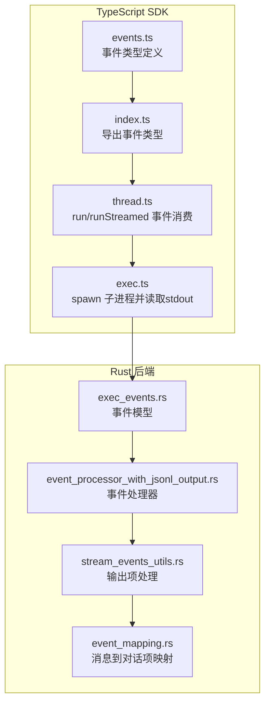
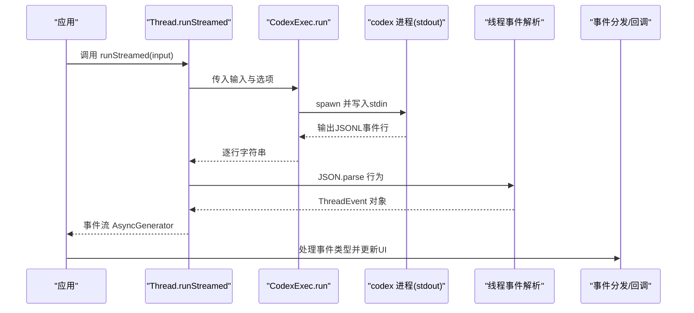
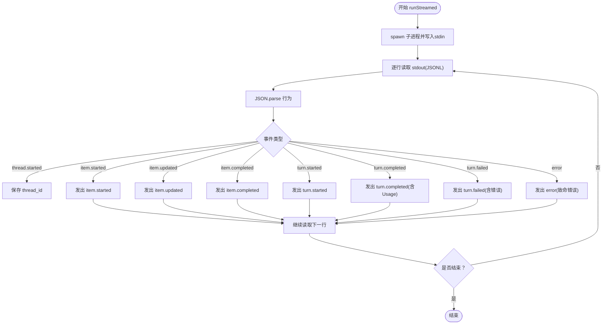
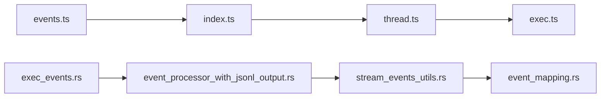

# 事件系统

<cite>
**本文引用的文件**
- [events.ts](file://sdk/typescript/src/events.ts)
- [index.ts](file://sdk/typescript/src/index.ts)
- [thread.ts](file://sdk/typescript/src/thread.ts)
- [exec.ts](file://sdk/typescript/src/exec.ts)
- [basic_streaming.ts](file://sdk/typescript/samples/basic_streaming.ts)
- [runStreamed.test.ts](file://sdk/typescript/tests/runStreamed.test.ts)
- [README.md](file://sdk/typescript/README.md)
- [exec_events.rs](file://codex-rs/exec/src/exec_events.rs)
- [event_processor_with_jsonl_output.rs](file://codex-rs/exec/src/event_processor_with_jsonl_output.rs)
- [stream_events_utils.rs](file://codex-rs/core/src/stream_events_utils.rs)
- [event_mapping.rs](file://codex-rs/core/src/event_mapping.rs)
</cite>

## 目录
1. [简介](#简介)
2. [项目结构](#项目结构)
3. [核心组件](#核心组件)
4. [架构总览](#架构总览)
5. [详细组件分析](#详细组件分析)
6. [依赖关系分析](#依赖关系分析)
7. [性能考量](#性能考量)
8. [故障排查指南](#故障排查指南)
9. [结论](#结论)
10. [附录](#附录)

## 简介
本文件面向Codex TypeScript SDK的“事件系统”，系统性说明events模块如何工作、可监听的事件类型与数据结构、事件流的产生与消费路径，以及如何在UI中基于事件进行响应式更新。文档特别聚焦以下事件类型：
- thread.started：线程开始
- turn.started：回合开始
- turn.completed：回合完成（包含token用量）
- turn.failed：回合失败（包含错误信息）
- item.started / item.updated / item.completed：对话项生命周期事件
- error：致命错误事件

同时，文档提供使用示例与最佳实践，帮助开发者在构建响应式与实时应用时充分利用事件系统。

## 项目结构
事件系统主要由TypeScript侧的事件定义、线程运行器与执行器构成，并通过底层Rust实现的事件处理器将CLI输出转换为JSONL事件流。关键文件如下：
- TypeScript侧事件定义与导出：events.ts、index.ts
- 线程运行与事件消费：thread.ts
- 执行器与子进程交互：exec.ts
- 示例与测试：samples/basic_streaming.ts、tests/runStreamed.test.ts
- Rust侧事件模型与事件处理器：exec_events.rs、event_processor_with_jsonl_output.rs
- 核心事件映射与工具：stream_events_utils.rs、event_mapping.rs

图表来源
- [events.ts](file://sdk/typescript/src/events.ts#L1-L81)
- [index.ts](file://sdk/typescript/src/index.ts#L1-L40)
- [thread.ts](file://sdk/typescript/src/thread.ts#L1-L155)
- [exec.ts](file://sdk/typescript/src/exec.ts#L1-L254)
- [exec_events.rs](file://codex-rs/exec/src/exec_events.rs#L38-L82)
- [event_processor_with_jsonl_output.rs](file://codex-rs/exec/src/event_processor_with_jsonl_output.rs#L419-L497)
- [stream_events_utils.rs](file://codex-rs/core/src/stream_events_utils.rs#L1-L219)
- [event_mapping.rs](file://codex-rs/core/src/event_mapping.rs#L1-L335)

章节来源
- [events.ts](file://sdk/typescript/src/events.ts#L1-L81)
- [index.ts](file://sdk/typescript/src/index.ts#L1-L40)
- [thread.ts](file://sdk/typescript/src/thread.ts#L1-L155)
- [exec.ts](file://sdk/typescript/src/exec.ts#L1-L254)
- [exec_events.rs](file://codex-rs/exec/src/exec_events.rs#L38-L82)
- [event_processor_with_jsonl_output.rs](file://codex-rs/exec/src/event_processor_with_jsonl_output.rs#L419-L497)
- [stream_events_utils.rs](file://codex-rs/core/src/stream_events_utils.rs#L1-L219)
- [event_mapping.rs](file://codex-rs/core/src/event_mapping.rs#L1-L335)

## 核心组件
- 事件类型定义：events.ts中定义了完整的ThreadEvent联合类型，覆盖线程、回合、对话项与错误等事件。
- 线程运行器：thread.ts提供run与runStreamed方法，后者返回AsyncGenerator<ThreadEvent>，用于逐条消费事件。
- 执行器：exec.ts通过spawn子进程与stdin/stdout交换JSONL事件，供线程运行器解析。
- 导出入口：index.ts统一导出事件类型，便于外部使用。

章节来源
- [events.ts](file://sdk/typescript/src/events.ts#L1-L81)
- [index.ts](file://sdk/typescript/src/index.ts#L1-L40)
- [thread.ts](file://sdk/typescript/src/thread.ts#L1-L155)
- [exec.ts](file://sdk/typescript/src/exec.ts#L1-L254)

## 架构总览
事件从后端Rust生成，经事件处理器转换为标准化的JSONL事件，再由TypeScript侧的执行器读取并交由线程运行器解析，最终以事件对象的形式暴露给调用方。

图表来源
- [thread.ts](file://sdk/typescript/src/thread.ts#L65-L111)
- [exec.ts](file://sdk/typescript/src/exec.ts#L51-L191)
- [README.md](file://sdk/typescript/README.md#L34-L51)

章节来源
- [thread.ts](file://sdk/typescript/src/thread.ts#L65-L111)
- [exec.ts](file://sdk/typescript/src/exec.ts#L51-L191)
- [README.md](file://sdk/typescript/README.md#L34-L51)

## 详细组件分析

### 事件类型与数据结构
- 线程事件
  - thread.started：包含thread_id，用于后续恢复会话。
  - turn.started：回合开始。
  - turn.completed：回合完成，携带Usage。
  - turn.failed：回合失败，携带ThreadError。
  - error：致命错误事件，message为错误文本。
- 对话项事件
  - item.started：新增对话项（初始状态通常为“进行中”）。
  - item.updated：对话项被更新。
  - item.completed：对话项达到终止态（成功或失败）。
- 数据结构
  - Usage：input_tokens、cached_input_tokens、output_tokens。
  - ThreadError：message。
  - ThreadItem：由后端Rust映射，包含多种类型（如agent_message、reasoning、command_execution、file_change、web_search、todo_list、error等），具体字段由items.ts定义。

章节来源
- [events.ts](file://sdk/typescript/src/events.ts#L1-L81)
- [exec_events.rs](file://codex-rs/exec/src/exec_events.rs#L38-L82)
- [event_processor_with_jsonl_output.rs](file://codex-rs/exec/src/event_processor_with_jsonl_output.rs#L419-L497)
- [stream_events_utils.rs](file://codex-rs/core/src/stream_events_utils.rs#L1-L219)
- [event_mapping.rs](file://codex-rs/core/src/event_mapping.rs#L1-L335)

### 事件流的产生与消费
- 产生路径（Rust后端）
  - 事件模型：exec_events.rs定义了ThreadStartedEvent、TurnStartedEvent、TurnCompletedEvent、TurnFailedEvent、ItemStartedEvent、ItemUpdatedEvent、ItemCompletedEvent等。
  - 事件处理器：event_processor_with_jsonl_output.rs将内部事件转换为标准化ThreadEvent，并在回合结束时聚合Usage。
  - 输出项处理：stream_events_utils.rs负责将模型输出项转换为对话项并发出item.started/item.completed等事件。
  - 消息映射：event_mapping.rs将ResponseItem映射为TurnItem，确保事件payload一致。
- 消费路径（TypeScript SDK）
  - exec.ts通过spawn子进程读取stdout，逐行产出字符串。
  - thread.ts在runStreamed中对每行进行JSON.parse，识别事件类型并按顺序yield。
  - 应用层遍历事件流，根据事件类型更新UI或记录日志。

图表来源
- [thread.ts](file://sdk/typescript/src/thread.ts#L65-L111)
- [exec.ts](file://sdk/typescript/src/exec.ts#L129-L191)
- [exec_events.rs](file://codex-rs/exec/src/exec_events.rs#L38-L82)
- [event_processor_with_jsonl_output.rs](file://codex-rs/exec/src/event_processor_with_jsonl_output.rs#L419-L497)
- [stream_events_utils.rs](file://codex-rs/core/src/stream_events_utils.rs#L1-L219)
- [event_mapping.rs](file://codex-rs/core/src/event_mapping.rs#L1-L335)

章节来源
- [thread.ts](file://sdk/typescript/src/thread.ts#L65-L111)
- [exec.ts](file://sdk/typescript/src/exec.ts#L129-L191)
- [exec_events.rs](file://codex-rs/exec/src/exec_events.rs#L38-L82)
- [event_processor_with_jsonl_output.rs](file://codex-rs/exec/src/event_processor_with_jsonl_output.rs#L419-L497)
- [stream_events_utils.rs](file://codex-rs/core/src/stream_events_utils.rs#L1-L219)
- [event_mapping.rs](file://codex-rs/core/src/event_mapping.rs#L1-L335)

### 如何订阅与使用事件
- 订阅方式
  - 使用Thread.runStreamed获取AsyncGenerator<ThreadEvent>，在for await循环中逐个处理事件。
  - 可结合AbortSignal在UI中取消当前回合。
- 常见用途
  - 显示加载指示器：在收到turn.started时显示；在turn.completed或turn.failed时隐藏。
  - 记录日志：在item.started/item.updated/item.completed时打印或持久化。
  - 更新UI：根据事件类型切换视图（如显示命令执行结果、文件变更列表、待办清单等）。
  - 终止条件：在turn.failed时提示错误并在UI上禁用输入。
- 示例参考
  - 基础流式示例：samples/basic_streaming.ts展示了如何处理item.completed、item.updated、turn.completed与turn.failed。
  - 单元测试：tests/runStreamed.test.ts验证了thread.started、turn.started、item.completed、turn.completed等事件序列。

章节来源
- [README.md](file://sdk/typescript/README.md#L34-L51)
- [basic_streaming.ts](file://sdk/typescript/samples/basic_streaming.ts#L1-L91)
- [runStreamed.test.ts](file://sdk/typescript/tests/runStreamed.test.ts#L1-L212)

### 事件类型与有效载荷对照表
- thread.started
  - 类型：thread.started
  - 载荷：thread_id（字符串）
  - 作用：保存thread_id以便后续resumeThread
- turn.started
  - 类型：turn.started
  - 载荷：无
  - 作用：回合开始，可显示加载指示器
- turn.completed
  - 类型：turn.completed
  - 载荷：usage（Usage）
  - 作用：回合完成，显示token用量
- turn.failed
  - 类型：turn.failed
  - 载荷：error（ThreadError）
  - 作用：回合失败，显示错误并禁用输入
- item.started
  - 类型：item.started
  - 载荷：item（ThreadItem）
  - 作用：新增对话项（初始状态为“进行中”）
- item.updated
  - 类型：item.updated
  - 载荷：item（ThreadItem）
  - 作用：对话项更新（如待办列表进度变化）
- item.completed
  - 类型：item.completed
  - 载荷：item（ThreadItem）
  - 作用：对话项终止（成功或失败）
- error
  - 类型：error
  - 载荷：message（字符串）
  - 作用：致命错误，应立即停止并提示用户

章节来源
- [events.ts](file://sdk/typescript/src/events.ts#L1-L81)
- [exec_events.rs](file://codex-rs/exec/src/exec_events.rs#L38-L82)
- [event_processor_with_jsonl_output.rs](file://codex-rs/exec/src/event_processor_with_jsonl_output.rs#L419-L497)

## 依赖关系分析
- TypeScript侧
  - events.ts定义事件类型，index.ts导出类型，thread.ts消费事件，exec.ts驱动子进程。
- Rust侧
  - exec_events.rs定义事件模型，event_processor_with_jsonl_output.rs将内部事件映射为ThreadEvent，stream_events_utils.rs与event_mapping.rs负责消息到对话项的转换。

图表来源
- [events.ts](file://sdk/typescript/src/events.ts#L1-L81)
- [index.ts](file://sdk/typescript/src/index.ts#L1-L40)
- [thread.ts](file://sdk/typescript/src/thread.ts#L1-L155)
- [exec.ts](file://sdk/typescript/src/exec.ts#L1-L254)
- [exec_events.rs](file://codex-rs/exec/src/exec_events.rs#L38-L82)
- [event_processor_with_jsonl_output.rs](file://codex-rs/exec/src/event_processor_with_jsonl_output.rs#L419-L497)
- [stream_events_utils.rs](file://codex-rs/core/src/stream_events_utils.rs#L1-L219)
- [event_mapping.rs](file://codex-rs/core/src/event_mapping.rs#L1-L335)

章节来源
- [events.ts](file://sdk/typescript/src/events.ts#L1-L81)
- [index.ts](file://sdk/typescript/src/index.ts#L1-L40)
- [thread.ts](file://sdk/typescript/src/thread.ts#L1-L155)
- [exec.ts](file://sdk/typescript/src/exec.ts#L1-L254)
- [exec_events.rs](file://codex-rs/exec/src/exec_events.rs#L38-L82)
- [event_processor_with_jsonl_output.rs](file://codex-rs/exec/src/event_processor_with_jsonl_output.rs#L419-L497)
- [stream_events_utils.rs](file://codex-rs/core/src/stream_events_utils.rs#L1-L219)
- [event_mapping.rs](file://codex-rs/core/src/event_mapping.rs#L1-L335)

## 性能考量
- 流式消费优于一次性缓冲：runStreamed逐条事件消费，避免等待整回合完成，提升UI响应速度。
- 事件解析开销：JSON.parse发生在主线程，建议在UI层尽快渲染，避免阻塞事件流。
- 子进程I/O：exec.ts通过readline逐行读取stdout，注意stderr错误收集与退出码处理。
- 取消与中断：使用AbortSignal在UI中取消当前回合，减少无效事件与资源占用。

章节来源
- [README.md](file://sdk/typescript/README.md#L34-L51)
- [thread.ts](file://sdk/typescript/src/thread.ts#L65-L111)
- [exec.ts](file://sdk/typescript/src/exec.ts#L129-L191)

## 故障排查指南
- 无法解析事件行
  - 现象：JSON.parse抛错或抛出“Failed to parse item”异常。
  - 排查：确认后端输出格式为标准JSONL；检查子进程stderr是否有非JSON内容。
- 回合未完成或UI卡住
  - 现象：只收到thread.started、turn.started，未见item.completed或turn.completed。
  - 排查：确认输入正确、网络访问与模型可用；查看turn.failed事件定位问题。
- 错误事件频繁出现
  - 现象：error事件持续触发。
  - 排查：检查环境变量（OPENAI_BASE_URL、CODEX_API_KEY）、工作目录与沙箱配置；查看stderr输出。
- 事件顺序异常
  - 现象：item.completed先于item.started出现。
  - 排查：核对后端事件处理器逻辑与映射规则；确保事件序列完整。

章节来源
- [thread.ts](file://sdk/typescript/src/thread.ts#L96-L110)
- [exec.ts](file://sdk/typescript/src/exec.ts#L148-L191)
- [runStreamed.test.ts](file://sdk/typescript/tests/runStreamed.test.ts#L1-L212)

## 结论
Codex TypeScript SDK的事件系统通过标准化的JSONL事件模型，将Rust后端的复杂状态转换为清晰的前端事件流。开发者可基于thread.started、turn.started、turn.completed、turn.failed、item.*系列事件与error事件，构建高度响应式的UI与交互体验。配合AbortSignal与流式消费，可在保证用户体验的同时降低延迟与资源消耗。

## 附录
- 快速开始与流式示例：参见samples/basic_streaming.ts与README中的流式说明。
- 单元测试验证：tests/runStreamed.test.ts覆盖了典型事件序列，可作为行为参考。

章节来源
- [README.md](file://sdk/typescript/README.md#L34-L51)
- [basic_streaming.ts](file://sdk/typescript/samples/basic_streaming.ts#L1-L91)
- [runStreamed.test.ts](file://sdk/typescript/tests/runStreamed.test.ts#L1-L212)