# 会话管理

<cite>
**本文档中引用的文件**  
- [thread.ts](file://sdk/typescript/src/thread.ts)
- [threadOptions.ts](file://sdk/typescript/src/threadOptions.ts)
- [codex.ts](file://sdk/typescript/src/codex.ts)
- [exec.ts](file://sdk/typescript/src/exec.ts)
- [events.ts](file://sdk/typescript/src/events.ts)
- [items.ts](file://sdk/typescript/src/items.ts)
- [basic_streaming.ts](file://sdk/typescript/samples/basic_streaming.ts)
- [run.test.ts](file://sdk/typescript/tests/run.test.ts)
- [runStreamed.test.ts](file://sdk/typescript/tests/runStreamed.test.ts)
</cite>

## 目录
1. [简介](#简介)
2. [会话创建与启动](#会话创建与启动)
3. [ThreadOptions 配置](#threadoptions-配置)
4. [消息管理与会话历史](#消息管理与会话历史)
5. [会话状态管理](#会话状态管理)
6. [会话生命周期管理](#会话生命周期管理)
7. [实际应用示例](#实际应用示例)
8. [事件处理机制](#事件处理机制)

## 简介
Codex TypeScript SDK 提供了强大的会话管理功能，允许开发者创建、管理和操作与 AI 代理的对话会话。本文档详细解释了 `Thread` 类的创建、管理和操作，包括如何使用 `createThread()` 方法启动新会话，以及 `ThreadOptions` 中与会话相关的配置。文档还描述了如何向现有会话添加消息、检索会话历史记录以及管理会话状态，并提供实际示例展示如何在应用中持久化会话 ID、恢复之前的对话以及处理会话生命周期。

**Section sources**
- [codex.ts](file://sdk/typescript/src/codex.ts#L6-L10)

## 会话创建与启动

### Thread 类的创建
在 Codex TypeScript SDK 中，会话通过 `Thread` 类来表示。`Thread` 类代表与 AI 代理的一系列对话，一个会话可以包含多个连续的回合（turn）。会话的创建主要通过 `Codex` 类的 `startThread()` 方法完成。

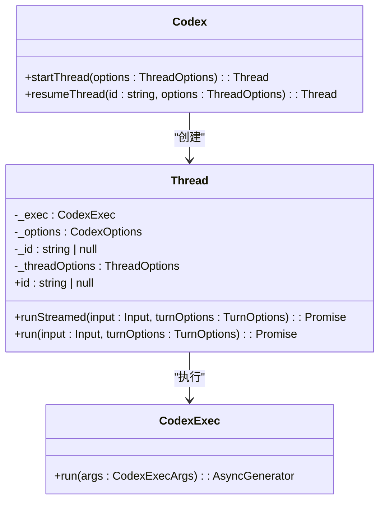

**Diagram sources**
- [codex.ts](file://sdk/typescript/src/codex.ts#L11-L39)
- [thread.ts](file://sdk/typescript/src/thread.ts#L41-L138)
- [exec.ts](file://sdk/typescript/src/exec.ts#L42-L192)

### 启动新会话
要启动一个新会话，首先需要创建 `Codex` 实例，然后调用其 `startThread()` 方法。该方法返回一个 `Thread` 实例，可用于与 AI 代理进行交互。

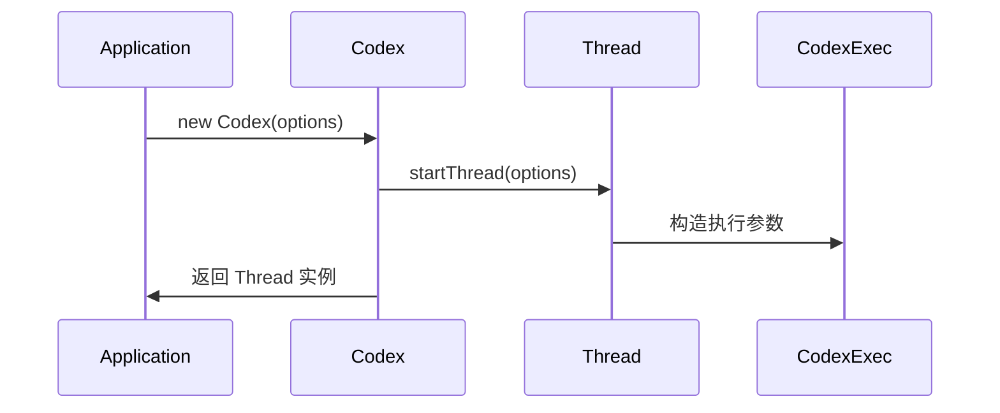

**Diagram sources**
- [codex.ts](file://sdk/typescript/src/codex.ts#L15-L26)
- [thread.ts](file://sdk/typescript/src/thread.ts#L53-L63)

**Section sources**
- [codex.ts](file://sdk/typescript/src/codex.ts#L20-L26)
- [thread.ts](file://sdk/typescript/src/thread.ts#L53-L63)

## ThreadOptions 配置

### 会话配置选项
`ThreadOptions` 接口定义了会话的各种配置选项，允许开发者根据具体需求定制会话行为。这些选项在创建会话时通过 `startThread()` 或 `resumeThread()` 方法传递。

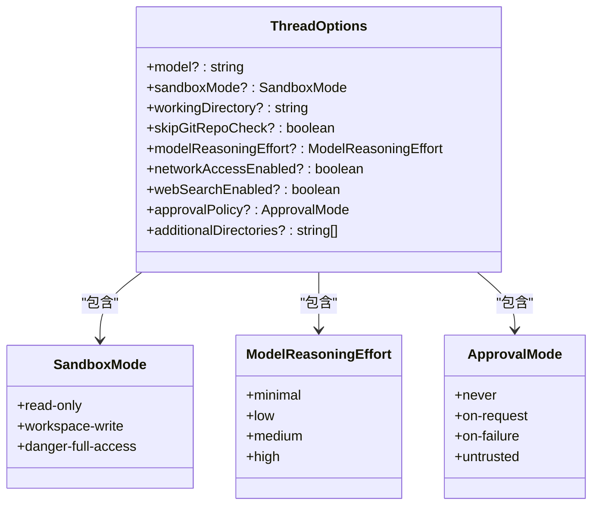

**Diagram sources**
- [threadOptions.ts](file://sdk/typescript/src/threadOptions.ts#L7-L17)

### 配置选项详解
`ThreadOptions` 中的每个配置选项都有特定的用途：

- **model**: 指定使用的 AI 模型名称
- **sandboxMode**: 定义沙箱模式，控制代理的执行权限
- **workingDirectory**: 设置工作目录
- **skipGitRepoCheck**: 是否跳过 Git 仓库检查
- **modelReasoningEffort**: 控制模型推理努力程度
- **networkAccessEnabled**: 是否启用网络访问
- **webSearchEnabled**: 是否启用网络搜索
- **approvalPolicy**: 定义审批策略
- **additionalDirectories**: 指定额外的目录访问权限

这些配置选项在会话创建时被传递给底层的 `CodexExec` 实例，并最终转换为命令行参数传递给核心执行程序。

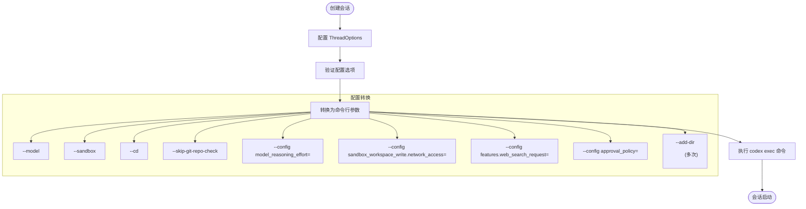

**Diagram sources**
- [exec.ts](file://sdk/typescript/src/exec.ts#L8-L37)
- [threadOptions.ts](file://sdk/typescript/src/threadOptions.ts#L7-L17)

**Section sources**
- [threadOptions.ts](file://sdk/typescript/src/threadOptions.ts#L7-L17)
- [exec.ts](file://sdk/typescript/src/exec.ts#L51-L108)

## 消息管理与会话历史

### 添加消息到会话
向会话添加消息是通过 `Thread` 类的 `run()` 和 `runStreamed()` 方法实现的。这两个方法都接受输入内容并将其发送给 AI 代理进行处理。

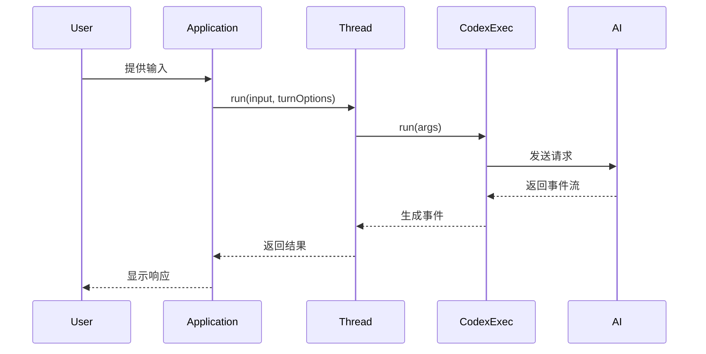

**Diagram sources**
- [thread.ts](file://sdk/typescript/src/thread.ts#L66-L137)
- [exec.ts](file://sdk/typescript/src/exec.ts#L51-L192)

### 输入类型处理
SDK 支持多种输入类型，包括纯文本和本地图片。`Input` 类型定义了可以传递给 `run()` 和 `runStreamed()` 方法的输入格式。

```mermaid
classDiagram
class Input {
<<union>>
}
class UserInput {
<<union>>
}
class TextInput {
+type : "text"
+text : string
}
class ImageInput {
+type : "local_image"
+path : string
}
Input --> string : "字符串"
Input --> UserInput[] : "用户输入数组"
UserInput --> TextInput : "文本输入"
UserInput --> ImageInput : "图片输入"
```

**Diagram sources**
- [thread.ts](file://sdk/typescript/src/thread.ts#L28-L38)
- [thread.ts](file://sdk/typescript/src/thread.ts#L140-L154)

### 会话历史检索
会话历史通过事件流的形式提供。每次调用 `run()` 或 `runStreamed()` 方法时，SDK 都会生成一系列事件，这些事件构成了会话的历史记录。

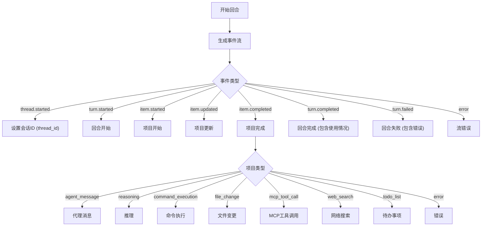

**Diagram sources**
- [events.ts](file://sdk/typescript/src/events.ts#L6-L81)
- [items.ts](file://sdk/typescript/src/items.ts#L9-L128)

**Section sources**
- [events.ts](file://sdk/typescript/src/events.ts#L6-L81)
- [items.ts](file://sdk/typescript/src/items.ts#L9-L128)

## 会话状态管理

### 会话ID管理
会话ID是会话的核心标识符，用于在不同时间点恢复和继续会话。会话ID在第一个回合开始时由系统生成，并通过 `thread.started` 事件提供。

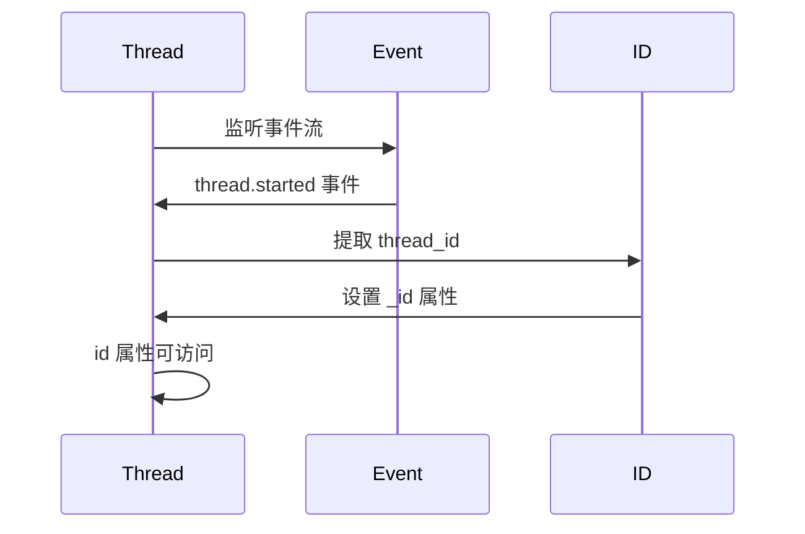

**Diagram sources**
- [thread.ts](file://sdk/typescript/src/thread.ts#L103-L105)

### 状态转换
会话在其生命周期中会经历多种状态转换，这些状态通过不同的事件类型来表示。

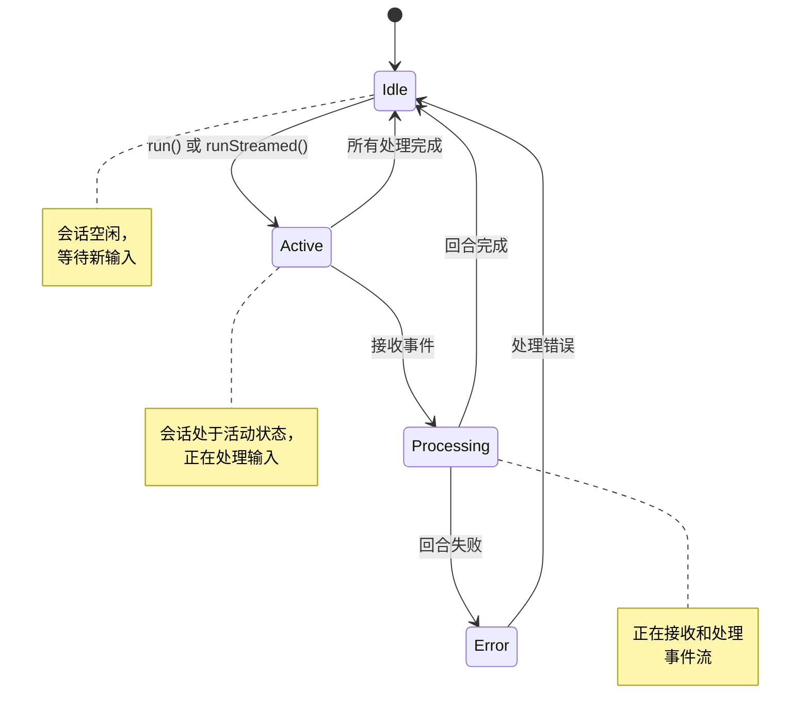

**Diagram sources**
- [thread.ts](file://sdk/typescript/src/thread.ts#L66-L137)

**Section sources**
- [thread.ts](file://sdk/typescript/src/thread.ts#L47-L50)
- [events.ts](file://sdk/typescript/src/events.ts#L6-L81)

## 会话生命周期管理

### 会话持久化
会话在本地文件系统中持久化存储，允许在应用程序重启后恢复之前的对话。会话数据存储在用户主目录下的 `~/.codex/sessions` 目录中。

```mermaid
flowchart TD
A[创建会话] --> B[生成会话ID]
B --> C[开始第一个回合]
C --> D[接收 thread.started 事件]
D --> E[存储会话元数据]
E --> F[写入 ~/.codex/sessions/ 目录]
F --> G[会话持久化完成]
H[恢复会话] --> I[提供会话ID]
I --> J[调用 resumeThread()]
J --> K[传递会话ID给 exec]
K --> L[exec 恢复会话状态]
L --> M[会话恢复完成]
```

**Diagram sources**
- [codex.ts](file://sdk/typescript/src/codex.ts#L30-L37)
- [exec.ts](file://sdk/typescript/src/exec.ts#L105-L107)

### 会话恢复
通过 `Codex` 类的 `resumeThread()` 方法可以恢复之前的会话。该方法接受会话ID作为参数，并创建一个与指定会话关联的 `Thread` 实例。

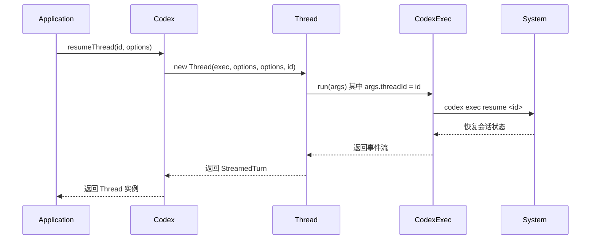

**Diagram sources**
- [codex.ts](file://sdk/typescript/src/codex.ts#L35-L37)
- [exec.ts](file://sdk/typescript/src/exec.ts#L105-L107)

### 会话关闭与删除
虽然 SDK 本身不提供显式的会话关闭或删除方法，但会话的生命周期管理通过底层系统的会话管理机制实现。会话在长时间不活动后可能会被系统自动清理。

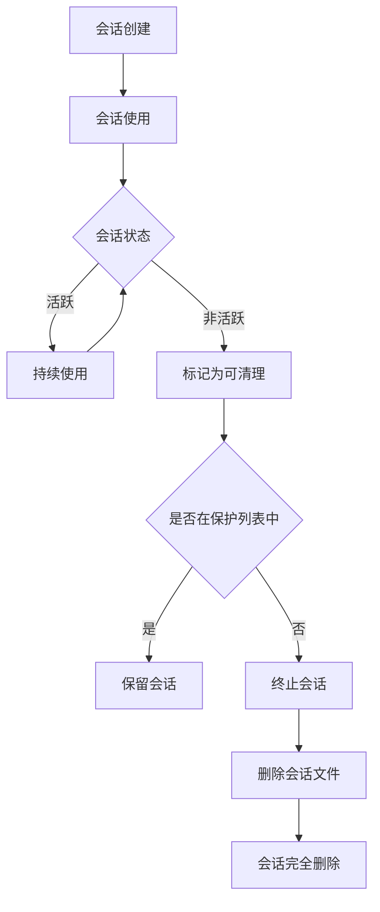

**Diagram sources**
- [session_manager.rs](file://codex-rs/core/src/unified_exec/session_manager.rs#L601-L646)

**Section sources**
- [codex.ts](file://sdk/typescript/src/codex.ts#L35-L37)
- [exec.ts](file://sdk/typescript/src/exec.ts#L105-L107)

## 实际应用示例

### 基本会话流程
以下示例展示了如何使用 Codex TypeScript SDK 创建和管理会话的基本流程。

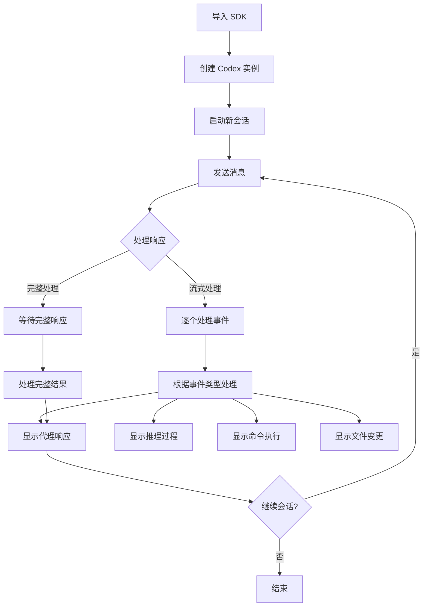

**Section sources**
- [basic_streaming.ts](file://sdk/typescript/samples/basic_streaming.ts#L1-L91)

### 会话恢复示例
以下示例展示了如何持久化会话ID并在后续恢复会话。

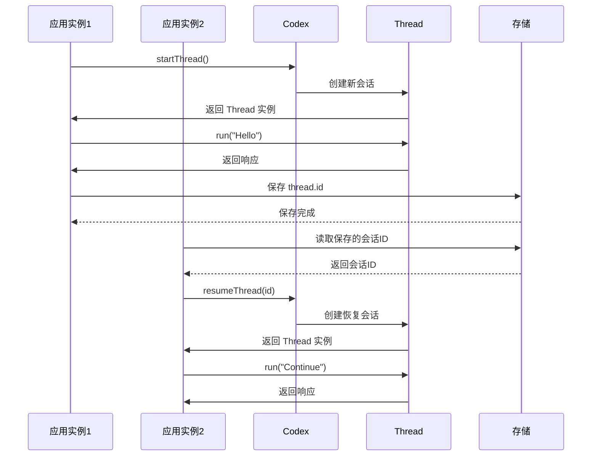

**Section sources**
- [run.test.ts](file://sdk/typescript/tests/run.test.ts#L141-L185)
- [runStreamed.test.ts](file://sdk/typescript/tests/runStreamed.test.ts#L113-L158)

## 事件处理机制

### 事件类型
SDK 定义了多种事件类型，用于表示会话中的不同状态和操作。

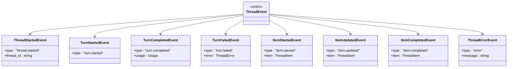

**Diagram sources**
- [events.ts](file://sdk/typescript/src/events.ts#L6-L81)

### 项目类型
事件中的项目可以是多种类型，每种类型代表不同的操作或响应。

```mermaid
classDiagram
class ThreadItem {
<<union>>
}
class AgentMessageItem {
+id : string
+type : "agent_message"
+text : string
}
class ReasoningItem {
+id : string
+type : "reasoning"
+text : string
}
class CommandExecutionItem {
+id : string
+type : "command_execution"
+command : string
+aggregated_output : string
+exit_code? : number
+status : CommandExecutionStatus
}
class FileChangeItem {
+id : string
+type : "file_change"
+changes : FileUpdateChange[]
+status : PatchApplyStatus
}
class McpToolCallItem {
+id : string
+type : "mcp_tool_call"
+server : string
+tool : string
+arguments : unknown
+result? : {content : McpContentBlock[], structured_content : unknown}
+error? : {message : string}
+status : McpToolCallStatus
}
class WebSearchItem {
+id : string
+type : "web_search"
+query : string
}
class TodoListItem {
+id : string
+type : "todo_list"
+items : TodoItem[]
}
class ErrorItem {
+id : string
+type : "error"
+message : string
}
ThreadItem --> AgentMessageItem
ThreadItem --> ReasoningItem
ThreadItem --> CommandExecutionItem
ThreadItem --> FileChangeItem
ThreadItem --> McpToolCallItem
ThreadItem --> WebSearchItem
ThreadItem --> TodoListItem
ThreadItem --> ErrorItem
```

**Diagram sources**
- [items.ts](file://sdk/typescript/src/items.ts#L9-L128)

**Section sources**
- [events.ts](file://sdk/typescript/src/events.ts#L6-L81)
- [items.ts](file://sdk/typescript/src/items.ts#L9-L128)