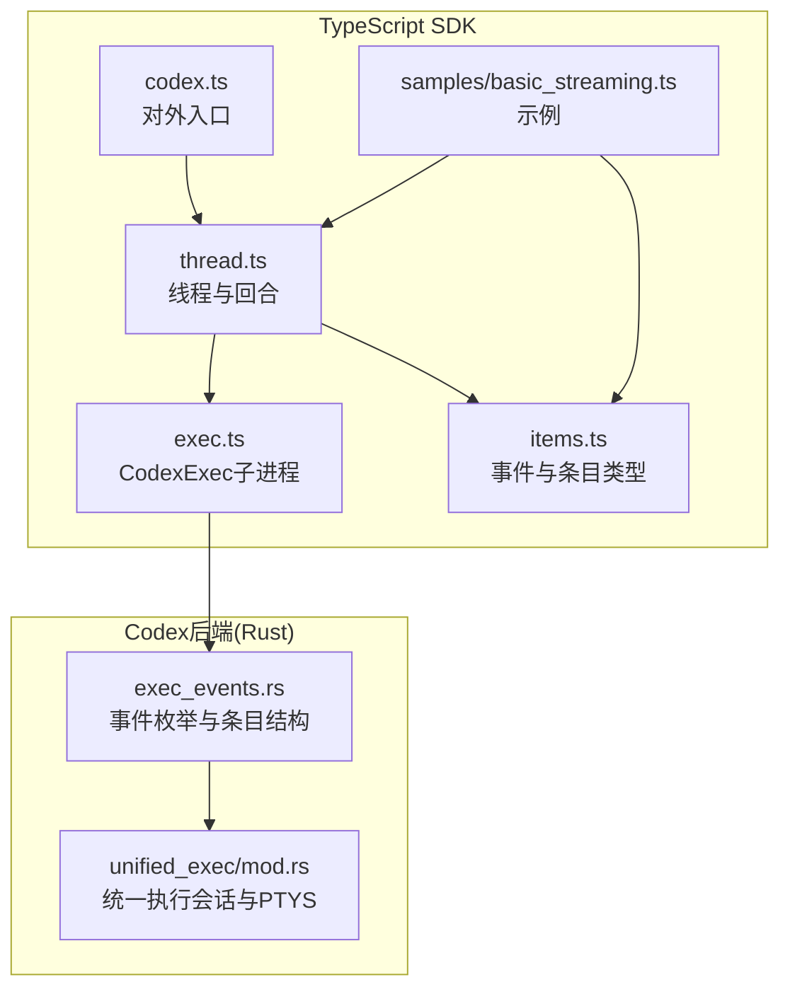
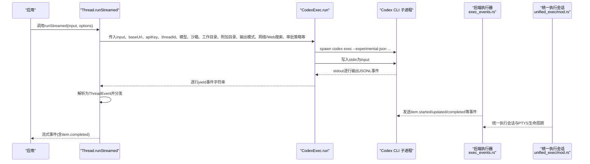
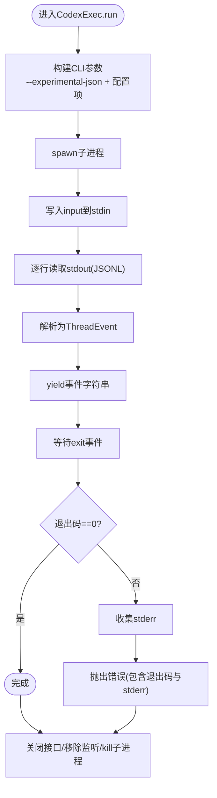
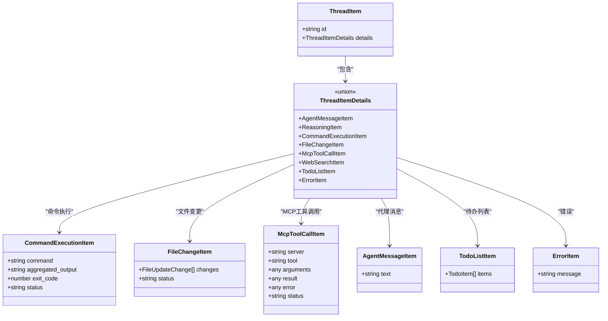
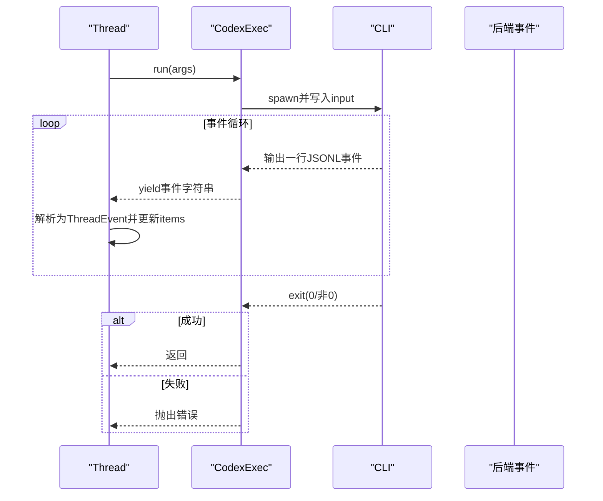
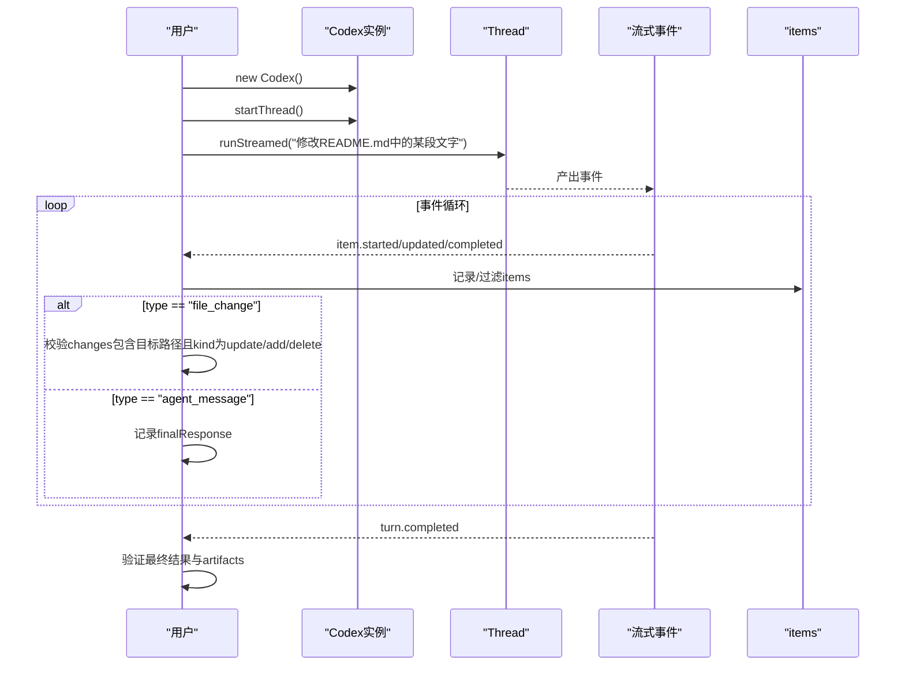
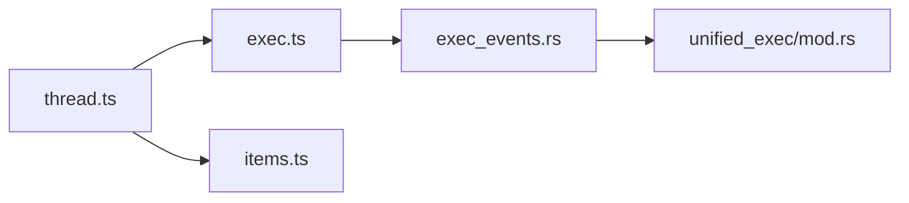

# 执行功能

<cite>
**本文引用的文件**
- [exec.ts](file://sdk/typescript/src/exec.ts)
- [items.ts](file://sdk/typescript/src/items.ts)
- [thread.ts](file://sdk/typescript/src/thread.ts)
- [codex.ts](file://sdk/typescript/src/codex.ts)
- [README.md](file://sdk/typescript/README.md)
- [basic_streaming.ts](file://sdk/typescript/samples/basic_streaming.ts)
- [helpers.ts](file://sdk/typescript/samples/helpers.ts)
- [exec_events.rs](file://codex-rs/exec/src/exec_events.rs)
- [unified_exec/mod.rs](file://codex-rs/core/src/unified_exec/mod.rs)
</cite>

## 目录
1. [简介](#简介)
2. [项目结构](#项目结构)
3. [核心组件](#核心组件)
4. [架构总览](#架构总览)
5. [详细组件分析](#详细组件分析)
6. [依赖关系分析](#依赖关系分析)
7. [性能考量](#性能考量)
8. [故障排查指南](#故障排查指南)
9. [结论](#结论)
10. [附录](#附录)

## 简介
本文件聚焦于Codex TypeScript SDK的“执行功能”，系统性阐述如何通过SDK触发Codex执行代码或系统命令，并围绕以下关键点展开：
- exec()方法与CodexExec类的关系，以及如何通过CLI子进程与Codex二进制交互
- 参数体系，尤其是输入参数与工作目录、沙箱模式、网络访问、Web搜索等配置项
- items结构与事件流：如何在运行过程中观察命令执行、文件变更、工具调用等“条目”（items）
- 任务生命周期：从启动、轮询事件、到完成或失败，再到最终产物（artifacts）的获取
- 结合items.ts中的类型定义，给出一个端到端示例：请求Codex修改特定文件并验证结果

## 项目结构
TypeScript SDK位于sdk/typescript目录，核心文件包括：
- exec.ts：封装Codex CLI子进程调用，负责将用户输入写入stdin并逐行解析stdout输出为JSONL事件
- items.ts：定义线程事件与条目（items）的类型，涵盖命令执行、文件变更、MCP工具调用、代理消息等
- thread.ts：线程管理与回合（turn）处理，将exec.ts的事件流转换为items数组与最终响应
- codex.ts：对外入口，提供startThread/resumeThread等能力
- samples/basic_streaming.ts：演示如何流式消费事件并处理不同类型的items
- README.md：SDK使用说明与示例

图表来源
- [codex.ts](file://sdk/typescript/src/codex.ts#L1-L39)
- [thread.ts](file://sdk/typescript/src/thread.ts#L1-L155)
- [exec.ts](file://sdk/typescript/src/exec.ts#L1-L192)
- [items.ts](file://sdk/typescript/src/items.ts#L1-L128)
- [exec_events.rs](file://codex-rs/exec/src/exec_events.rs#L1-L200)
- [unified_exec/mod.rs](file://codex-rs/core/src/unified_exec/mod.rs#L1-L120)

章节来源
- [README.md](file://sdk/typescript/README.md#L1-L134)

## 核心组件
- CodexExec：封装对Codex CLI的子进程调用，将输入写入stdin，按行读取stdout作为JSONL事件流，处理stderr错误并在退出码非0时抛出异常
- Thread：管理对话线程，将exec.ts的事件流转换为items数组与最终响应文本；支持流式runStreamed与一次性run
- items.ts：定义线程条目类型，包括命令执行、文件变更、MCP工具调用、代理消息、待办列表、错误等
- codex.ts：对外暴露Codex类，提供startThread/resumeThread等API

章节来源
- [exec.ts](file://sdk/typescript/src/exec.ts#L1-L192)
- [thread.ts](file://sdk/typescript/src/thread.ts#L1-L155)
- [items.ts](file://sdk/typescript/src/items.ts#L1-L128)
- [codex.ts](file://sdk/typescript/src/codex.ts#L1-L39)

## 架构总览
下图展示了从应用层到CLI再到后端执行器的整体流程，以及事件流如何在各层之间传递。

图表来源
- [thread.ts](file://sdk/typescript/src/thread.ts#L65-L111)
- [exec.ts](file://sdk/typescript/src/exec.ts#L51-L191)
- [exec_events.rs](file://codex-rs/exec/src/exec_events.rs#L1-L120)
- [unified_exec/mod.rs](file://codex-rs/core/src/unified_exec/mod.rs#L1-L120)

## 详细组件分析

### exec()方法与CodexExec类
- 触发方式：Thread.runStreamed内部调用CodexExec.run(args)，后者构建CLI参数并spawn子进程
- 输入与环境：
  - input：发送给CLI的标准输入
  - baseUrl/apiKey：注入到子进程环境变量中，影响后端认证与基地址
  - threadId：可选，用于恢复已有线程
  - images：本地图片路径数组，通过CLI参数传递
  - 模型、沙箱模式、工作目录、附加目录、跳过Git仓库检查、输出模式、推理强度、网络访问、Web搜索、审批策略等均映射为CLI参数
- 事件消费：子进程stdout按行读取，每行是一个JSONL事件字符串；遇到错误或退出码非0时抛出异常
- 退出处理：等待exit事件，若非0则将stderr拼接为错误信息抛出；最后清理监听器与子进程

图表来源
- [exec.ts](file://sdk/typescript/src/exec.ts#L51-L191)

章节来源
- [exec.ts](file://sdk/typescript/src/exec.ts#L1-L192)
- [thread.ts](file://sdk/typescript/src/thread.ts#L65-L111)

### items结构与事件流
items.ts定义了线程条目的联合类型，其中与执行密切相关的有：
- 命令执行：CommandExecutionItem，包含命令、聚合输出、退出码、状态
- 文件变更：FileChangeItem，包含变更集合（路径、变更类型）、最终状态
- MCP工具调用：McpToolCallItem，包含服务器、工具名、参数、结果或错误、状态
- 代理消息：AgentMessageItem，最终响应文本
- 待办列表：TodoListItem，运行中的步骤清单
- 错误：ErrorItem，非致命错误

这些条目在后端通过exec_events.rs的ThreadItemDetails进行序列化与传输，前端在thread.ts中解析为items数组。

图表来源
- [items.ts](file://sdk/typescript/src/items.ts#L1-L128)
- [exec_events.rs](file://codex-rs/exec/src/exec_events.rs#L90-L200)

章节来源
- [items.ts](file://sdk/typescript/src/items.ts#L1-L128)
- [exec_events.rs](file://codex-rs/exec/src/exec_events.rs#L1-L200)

### 任务生命周期与轮询
- 启动：Thread.runStreamed内部调用CodexExec.run，开始接收JSONL事件
- 轮询：SDK逐行解析事件，根据事件类型更新items数组与最终响应
- 完成/失败：当收到turn.completed或turn.failed时，run()返回；runStreamed()直接流式产出事件
- artifacts：items中可能包含命令执行结果、文件变更详情、MCP工具调用结果等，均可作为产物使用

图表来源
- [thread.ts](file://sdk/typescript/src/thread.ts#L65-L138)
- [exec.ts](file://sdk/typescript/src/exec.ts#L51-L191)

章节来源
- [thread.ts](file://sdk/typescript/src/thread.ts#L65-L138)
- [exec.ts](file://sdk/typescript/src/exec.ts#L51-L191)

### 端到端示例：请求Codex修改特定文件并验证结果
以下示例基于samples/basic_streaming.ts的思路，展示如何：
- 使用Codex类创建线程
- 通过runStreamed发送输入，流式消费事件
- 在事件中识别“文件变更”条目，确认目标文件被修改
- 获取最终代理消息作为总结

步骤要点：
- 创建Codex实例并启动线程
- 调用runStreamed，传入要执行的指令（例如“请修改README.md中的某段文字”）
- 在事件循环中监听item.completed，识别type为“file_change”的条目，检查changes数组中的路径与变更类型
- 当收到turn.completed时，从items中提取最终代理消息作为结果摘要

图表来源
- [basic_streaming.ts](file://sdk/typescript/samples/basic_streaming.ts#L1-L91)
- [thread.ts](file://sdk/typescript/src/thread.ts#L65-L138)
- [items.ts](file://sdk/typescript/src/items.ts#L1-L128)

章节来源
- [basic_streaming.ts](file://sdk/typescript/samples/basic_streaming.ts#L1-L91)
- [thread.ts](file://sdk/typescript/src/thread.ts#L65-L138)
- [items.ts](file://sdk/typescript/src/items.ts#L1-L128)

## 依赖关系分析
- Thread依赖CodexExec进行子进程调用，并将事件解析为items
- CodexExec依赖平台检测与二进制路径定位，将输入写入CLI并读取事件
- items.ts与exec_events.rs保持类型一致性，确保前后端事件结构匹配
- unified_exec/mod.rs负责后端统一执行会话与PTYS生命周期，支撑命令执行与文件变更等能力

图表来源
- [thread.ts](file://sdk/typescript/src/thread.ts#L1-L155)
- [exec.ts](file://sdk/typescript/src/exec.ts#L1-L192)
- [items.ts](file://sdk/typescript/src/items.ts#L1-L128)
- [exec_events.rs](file://codex-rs/exec/src/exec_events.rs#L1-L200)
- [unified_exec/mod.rs](file://codex-rs/core/src/unified_exec/mod.rs#L1-L120)

章节来源
- [thread.ts](file://sdk/typescript/src/thread.ts#L1-L155)
- [exec.ts](file://sdk/typescript/src/exec.ts#L1-L192)
- [items.ts](file://sdk/typescript/src/items.ts#L1-L128)
- [exec_events.rs](file://codex-rs/exec/src/exec_events.rs#L1-L200)
- [unified_exec/mod.rs](file://codex-rs/core/src/unified_exec/mod.rs#L1-L120)

## 性能考量
- 事件流按行解析，避免一次性缓冲大量数据
- 子进程stdin一次性写入input后结束，减少阻塞
- 退出码非0时立即抛错，避免无谓等待
- 对于长时间运行的命令，建议合理设置超时与输出截断策略（由后端统一执行模块控制）

## 故障排查指南
- 子进程无stdin/stdout：在spawn后检查是否存在stdin/stdout，不存在则立即终止并抛错
- 退出码非0：收集stderr并将其作为错误信息的一部分抛出
- 事件解析失败：当某行无法解析为JSON时，抛出解析错误并附带原始行内容
- 线程恢复：若传入threadId，CLI会以“resume”方式继续之前的会话

章节来源
- [exec.ts](file://sdk/typescript/src/exec.ts#L134-L191)
- [thread.ts](file://sdk/typescript/src/thread.ts#L96-L111)

## 结论
Codex TypeScript SDK通过CodexExec将用户输入交给Codex CLI执行，并以JSONL事件的形式实时反馈执行过程。items.ts与exec_events.rs共同定义了事件与条目的结构，使开发者能够清晰地感知命令执行、文件变更、工具调用等关键动作。借助runStreamed与items数组，可以完整追踪任务生命周期并提取artifacts，从而实现从触发到验证的端到端闭环。

## 附录
- 平台二进制定位：CodexExec在未显式指定路径时，会根据当前平台与架构自动定位vendor目录下的codex二进制
- 示例脚本：samples/basic_streaming.ts展示了如何流式消费事件并处理不同类型的items
- 环境变量：SDK会在必要时注入OPENAI_BASE_URL与CODEX_API_KEY，同时保留用户自定义env

章节来源
- [exec.ts](file://sdk/typescript/src/exec.ts#L194-L254)
- [basic_streaming.ts](file://sdk/typescript/samples/basic_streaming.ts#L1-L91)
- [README.md](file://sdk/typescript/README.md#L120-L134)