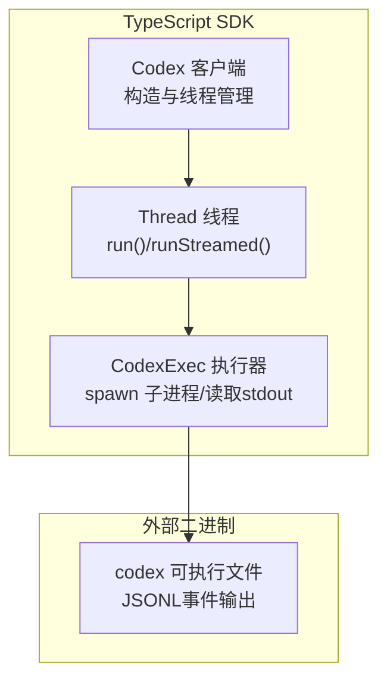
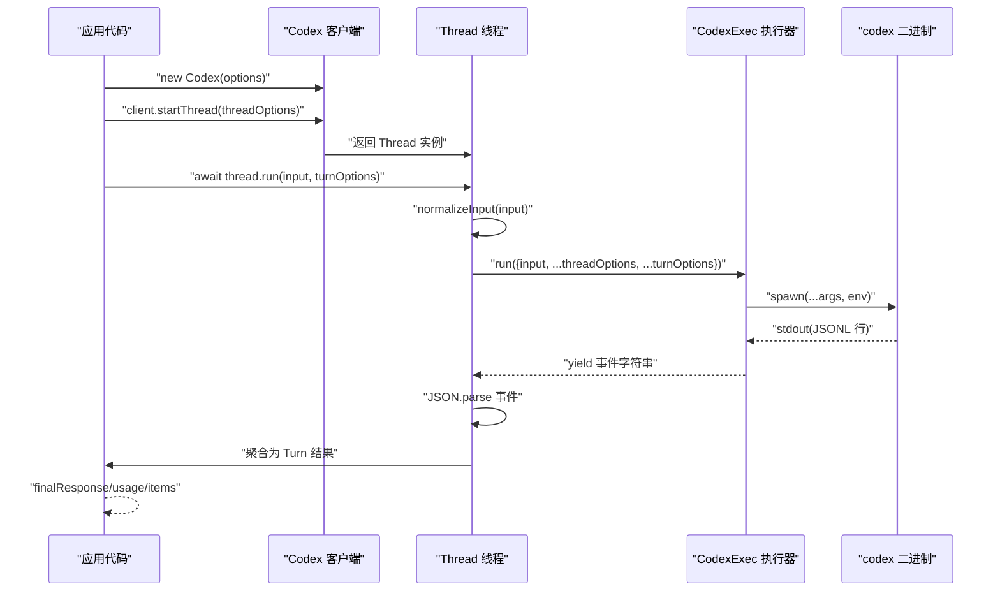
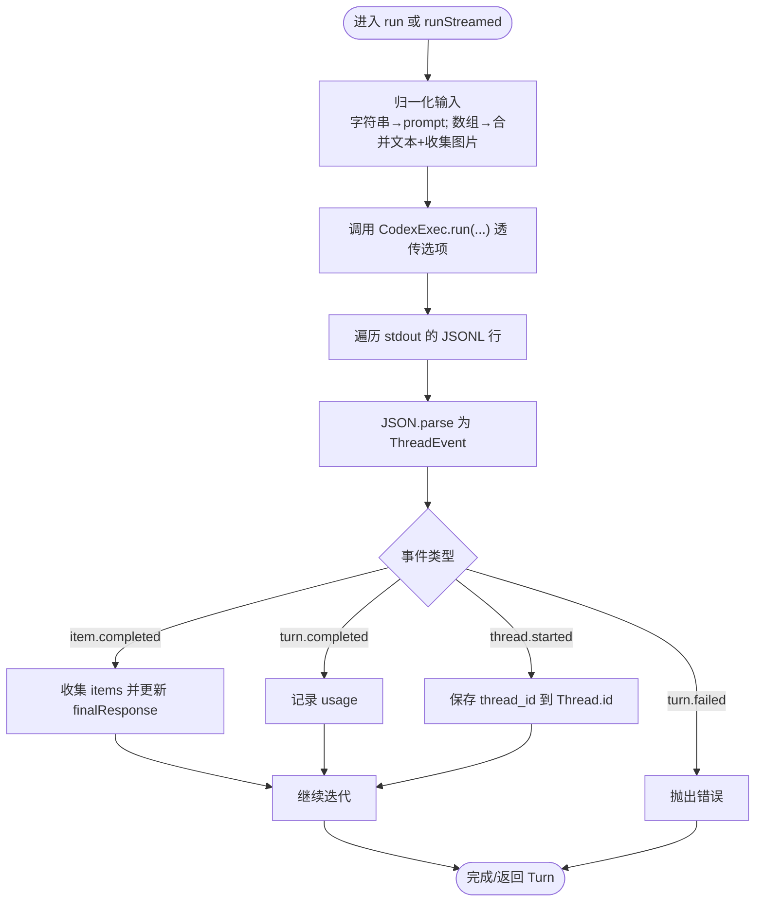
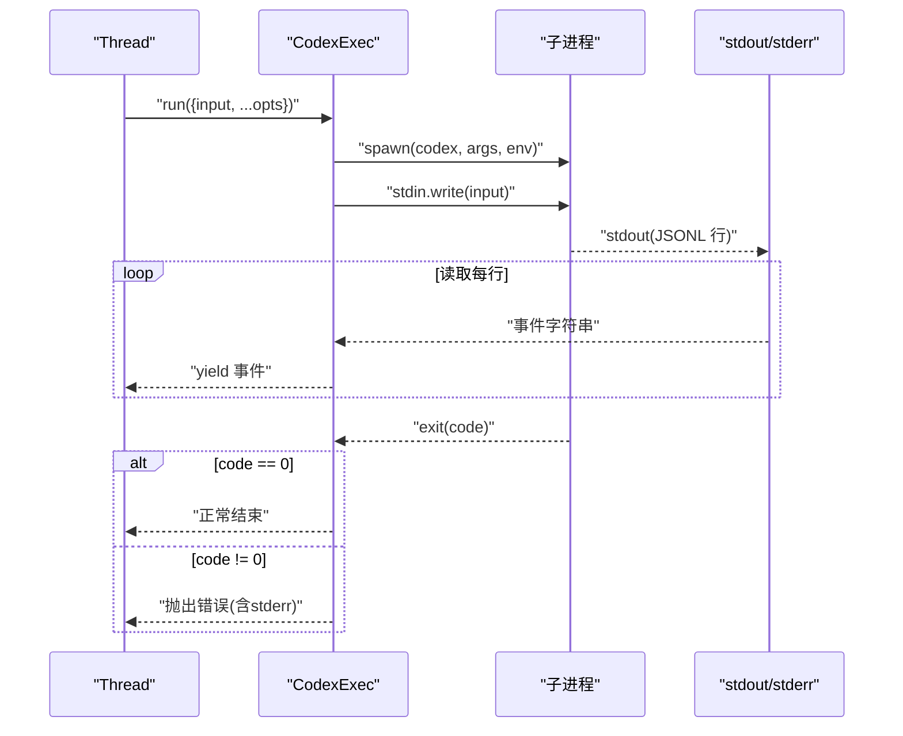
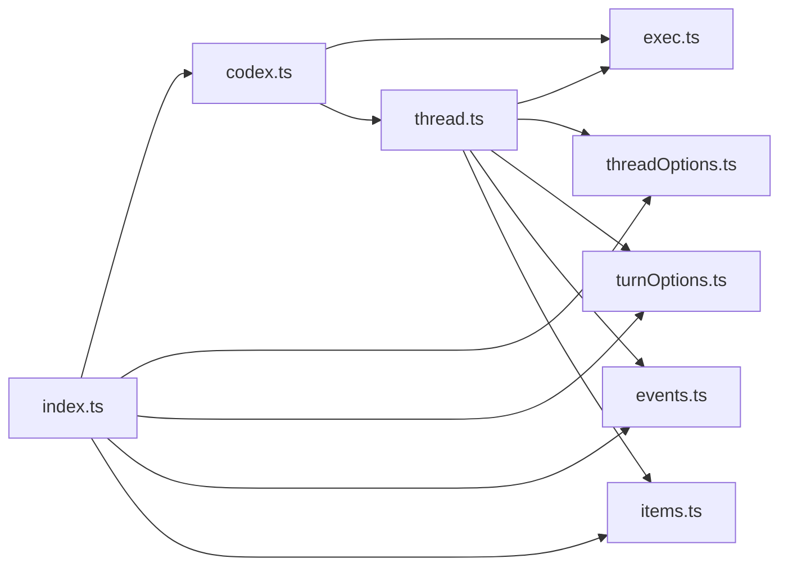

# 核心客户端

<cite>
**本文引用的文件**
- [codex.ts](file://sdk/typescript/src/codex.ts)
- [codexOptions.ts](file://sdk/typescript/src/codexOptions.ts)
- [thread.ts](file://sdk/typescript/src/thread.ts)
- [exec.ts](file://sdk/typescript/src/exec.ts)
- [threadOptions.ts](file://sdk/typescript/src/threadOptions.ts)
- [turnOptions.ts](file://sdk/typescript/src/turnOptions.ts)
- [events.ts](file://sdk/typescript/src/events.ts)
- [items.ts](file://sdk/typescript/src/items.ts)
- [index.ts](file://sdk/typescript/src/index.ts)
- [README.md](file://sdk/typescript/README.md)
- [package.json](file://sdk/typescript/package.json)
- [basic_streaming.ts](file://sdk/typescript/samples/basic_streaming.ts)
- [run.test.ts](file://sdk/typescript/tests/run.test.ts)
- [runStreamed.test.ts](file://sdk/typescript/tests/runStreamed.test.ts)
</cite>

## 目录
1. [简介](#简介)
2. [项目结构](#项目结构)
3. [核心组件](#核心组件)
4. [架构总览](#架构总览)
5. [详细组件分析](#详细组件分析)
6. [依赖关系分析](#依赖关系分析)
7. [性能与并发特性](#性能与并发特性)
8. [故障排查指南](#故障排查指南)
9. [结论](#结论)
10. [附录：使用示例与最佳实践](#附录使用示例与最佳实践)

## 简介
本文件面向Codex TypeScript SDK的核心客户端，系统性梳理并解释以下关键点：
- CodexClient（即Codex类）的构造函数与初始化流程
- CodexOptions配置对象的全部属性及默认行为
- Thread的run()与runStreamed()方法实现细节，包括如何发送用户指令、如何消费事件流、如何解析增量更新
- 在Node.js与浏览器环境中的正确配置与注意事项
- 错误处理策略与常见问题定位

该文档旨在帮助开发者快速上手并深入理解SDK内部机制，同时提供可操作的示例路径与最佳实践建议。

## 项目结构
SDK位于sdk/typescript目录下，核心模块围绕“客户端-线程-执行器”三层组织：
- 客户端层：Codex类负责实例化与线程生命周期管理
- 线程层：Thread类封装一次或多次对话（多轮对话）
- 执行层：CodexExec通过子进程调用本地codex二进制，以JSONL事件形式与CLI交互

图表来源
- [codex.ts](file://sdk/typescript/src/codex.ts#L1-L39)
- [thread.ts](file://sdk/typescript/src/thread.ts#L1-L155)
- [exec.ts](file://sdk/typescript/src/exec.ts#L1-L192)

章节来源
- [index.ts](file://sdk/typescript/src/index.ts#L1-L40)
- [package.json](file://sdk/typescript/package.json#L1-L67)

## 核心组件
- Codex：SDK入口，负责创建Thread实例，并将配置传递给Thread与底层执行器。
- Thread：封装一次或多轮对话，提供阻塞式run()与流式runStreamed()两种交互模式。
- CodexExec：负责拼装CLI参数、注入环境变量、启动子进程、逐行读取stdout并产出事件流。
- 配置类型：CodexOptions、ThreadOptions、TurnOptions；事件与线程项类型：ThreadEvent、ThreadItem。

章节来源
- [codex.ts](file://sdk/typescript/src/codex.ts#L1-L39)
- [thread.ts](file://sdk/typescript/src/thread.ts#L1-L155)
- [exec.ts](file://sdk/typescript/src/exec.ts#L1-L192)
- [codexOptions.ts](file://sdk/typescript/src/codexOptions.ts#L1-L11)
- [threadOptions.ts](file://sdk/typescript/src/threadOptions.ts#L1-L18)
- [turnOptions.ts](file://sdk/typescript/src/turnOptions.ts#L1-L7)
- [events.ts](file://sdk/typescript/src/events.ts#L1-L81)
- [items.ts](file://sdk/typescript/src/items.ts#L1-L128)

## 架构总览
下面的序列图展示了从客户端到CLI的完整调用链路，包括参数透传、事件解析与结果聚合。

图表来源
- [codex.ts](file://sdk/typescript/src/codex.ts#L1-L39)
- [thread.ts](file://sdk/typescript/src/thread.ts#L65-L138)
- [exec.ts](file://sdk/typescript/src/exec.ts#L51-L191)

## 详细组件分析

### Codex 类与构造函数
- 职责
  - 接收CodexOptions并保存
  - 基于options.codexPathOverride与options.env初始化CodexExec
  - 提供startThread与resumeThread两个入口，用于创建或恢复会话
- 初始化要点
  - 若未提供codexPathOverride，则自动定位本地二进制路径（按平台与架构选择）
  - 若提供了env，则完全覆盖默认继承自process.env的行为
  - 将baseUrl与apiKey转换为环境变量传递给CLI（OPENAI_BASE_URL与CODEX_API_KEY）

章节来源
- [codex.ts](file://sdk/typescript/src/codex.ts#L1-L39)
- [exec.ts](file://sdk/typescript/src/exec.ts#L197-L254)
- [codexOptions.ts](file://sdk/typescript/src/codexOptions.ts#L1-L11)

### CodexOptions 配置对象
- 属性
  - codexPathOverride?: string
    - 指定codex二进制路径；若未提供则按平台/架构自动查找
  - baseUrl?: string
    - 透传至CLI环境变量OPENAI_BASE_URL
  - apiKey?: string
    - 透传至CLI环境变量CODEX_API_KEY
  - env?: Record<string, string>
    - 完全控制CLI进程的环境变量；不继承process.env
- 默认值
  - 所有字段均为可选；未提供时采用默认行为（自动定位二进制、继承环境、不透传API信息）

章节来源
- [codexOptions.ts](file://sdk/typescript/src/codexOptions.ts#L1-L11)
- [exec.ts](file://sdk/typescript/src/exec.ts#L109-L131)

### Thread 类与 run()/runStreamed() 方法
- run(input, turnOptions)
  - 使用runStreamedInternal生成事件流
  - 迭代事件，收集items、提取finalResponse、记录usage
  - 若遇到turn.failed，抛出错误
  - 返回Turn结构（items、finalResponse、usage）
- runStreamed(input, turnOptions)
  - 同样基于runStreamedInternal，但直接返回包含AsyncGenerator的结构
  - 事件流逐条解析为ThreadEvent
  - 首个thread.started事件会更新Thread.id
- 输入归一化
  - 支持字符串或数组输入
  - 文本段会被连接为最终prompt；本地图片路径会被收集并透传给CLI

图表来源
- [thread.ts](file://sdk/typescript/src/thread.ts#L65-L138)

章节来源
- [thread.ts](file://sdk/typescript/src/thread.ts#L1-L155)

### CodexExec 执行器与子进程交互
- 参数组装
  - 通过命令行参数透传模型、沙箱模式、工作目录、附加目录、推理努力度、网络访问开关、Web搜索开关、审批策略、图片路径、线程ID等
- 环境变量注入
  - 优先使用构造时提供的env；否则继承process.env
  - 强制注入内部originator标记，以及根据baseUrl/apiKey设置OPENAI_BASE_URL/CODEX_API_KEY
- 子进程生命周期
  - 写入stdin为输入文本，结束后关闭stdin
  - 逐行读取stdout，逐行产出事件字符串
  - 监听stderr累积错误信息；退出码非0时抛错
  - 清理资源：关闭readline、移除监听、尝试杀死子进程

图表来源
- [exec.ts](file://sdk/typescript/src/exec.ts#L51-L191)

章节来源
- [exec.ts](file://sdk/typescript/src/exec.ts#L1-L192)

### 事件与线程项类型
- ThreadEvent
  - 包括thread.started、turn.started、turn.completed、turn.failed、item.started、item.updated、item.completed、error
- ThreadItem
  - 包括agent_message、reasoning、command_execution、file_change、mcp_tool_call、web_search、todo_list、error
- 用途
  - runStreamed()逐条产出事件，供应用实时渲染
  - run()聚合为Turn结构，便于一次性消费

章节来源
- [events.ts](file://sdk/typescript/src/events.ts#L1-L81)
- [items.ts](file://sdk/typescript/src/items.ts#L1-L128)

## 依赖关系分析
- 导出入口
  - index.ts导出Codex、Thread、事件与线程项类型，以及ThreadOptions/TurnOptions
- 内部依赖
  - Codex依赖CodexExec与ThreadOptions
  - Thread依赖CodexExec、ThreadOptions、TurnOptions、事件与线程项类型
  - CodexExec依赖平台信息与二进制路径解析逻辑

图表来源
- [index.ts](file://sdk/typescript/src/index.ts#L1-L40)
- [codex.ts](file://sdk/typescript/src/codex.ts#L1-L39)
- [thread.ts](file://sdk/typescript/src/thread.ts#L1-L155)
- [exec.ts](file://sdk/typescript/src/exec.ts#L1-L192)
- [threadOptions.ts](file://sdk/typescript/src/threadOptions.ts#L1-L18)
- [turnOptions.ts](file://sdk/typescript/src/turnOptions.ts#L1-L7)
- [events.ts](file://sdk/typescript/src/events.ts#L1-L81)
- [items.ts](file://sdk/typescript/src/items.ts#L1-L128)

章节来源
- [index.ts](file://sdk/typescript/src/index.ts#L1-L40)

## 性能与并发特性
- 流式消费
  - runStreamed()以AsyncGenerator逐行产出事件，避免等待整次对话完成，适合长耗时任务的实时反馈
- 资源清理
  - 执行器在finally中关闭readline、移除监听并尝试杀死子进程，防止资源泄漏
- 并发与取消
  - 通过AbortSignal支持取消当前turn；测试用例验证了取消信号的传递
- I/O开销
  - 逐行读取stdout，解析JSONL，内存占用与事件数量线性相关

章节来源
- [thread.ts](file://sdk/typescript/src/thread.ts#L65-L138)
- [exec.ts](file://sdk/typescript/src/exec.ts#L134-L191)
- [run.test.ts](file://sdk/typescript/tests/run.test.ts#L1-L688)
- [runStreamed.test.ts](file://sdk/typescript/tests/runStreamed.test.ts#L1-L212)

## 故障排查指南
- 常见错误场景
  - 二进制不可用或平台不支持：自动定位失败会抛出错误
  - 工作目录不在受信目录且未跳过校验：会触发“不在可信目录”的错误
  - CLI退出码非0：会携带stderr内容抛错
  - 事件解析失败：单行JSON解析异常会抛错
  - turn.failed：run()会将错误消息抛出
- 定位手段
  - 查看stderr内容与退出码
  - 检查是否正确设置了baseUrl/apiKey与env
  - 确认工作目录与Git仓库检查策略
  - 使用runStreamed()逐事件观察，定位具体失败阶段

章节来源
- [exec.ts](file://sdk/typescript/src/exec.ts#L144-L191)
- [thread.ts](file://sdk/typescript/src/thread.ts#L113-L138)
- [run.test.ts](file://sdk/typescript/tests/run.test.ts#L604-L633)

## 结论
Codex TypeScript SDK通过清晰的分层设计与严格的事件驱动模型，实现了对本地codex二进制的可靠封装。CodexOptions提供了灵活的配置能力，Thread的run()/runStreamed()满足从简单阻塞到复杂流式交互的多种需求。配合完善的测试用例与示例，开发者可以快速集成并稳定运行。

## 附录：使用示例与最佳实践

### 基本调用（阻塞式）
- 示例路径
  - [README.md](file://sdk/typescript/README.md#L17-L26)
  - [run.test.ts](file://sdk/typescript/tests/run.test.ts#L23-L52)

### 流式响应（推荐）
- 示例路径
  - [README.md](file://sdk/typescript/README.md#L34-L51)
  - [basic_streaming.ts](file://sdk/typescript/samples/basic_streaming.ts#L1-L91)
  - [runStreamed.test.ts](file://sdk/typescript/tests/runStreamed.test.ts#L18-L65)

### 结构化输出（JSON Schema）
- 示例路径
  - [README.md](file://sdk/typescript/README.md#L53-L84)
  - [run.test.ts](file://sdk/typescript/tests/run.test.ts#L436-L491)

### 附着图片输入
- 示例路径
  - [README.md](file://sdk/typescript/README.md#L86-L97)
  - [run.test.ts](file://sdk/typescript/tests/run.test.ts#L521-L567)

### 恢复线程
- 示例路径
  - [README.md](file://sdk/typescript/README.md#L98-L107)
  - [run.test.ts](file://sdk/typescript/tests/run.test.ts#L141-L186)

### 工作目录与Git校验
- 示例路径
  - [README.md](file://sdk/typescript/README.md#L108-L118)
  - [run.test.ts](file://sdk/typescript/tests/run.test.ts#L568-L602)
  - [run.test.ts](file://sdk/typescript/tests/run.test.ts#L604-L633)

### 控制CLI环境变量
- 示例路径
  - [README.md](file://sdk/typescript/README.md#L119-L134)
  - [run.test.ts](file://sdk/typescript/tests/run.test.ts#L351-L392)

### Node.js与浏览器环境注意事项
- Node.js
  - SDK要求Node.js 18+，通过child_process与readline进行I/O
  - 可通过env精确控制CLI环境变量
- 浏览器
  - SDK基于Node.js API（child_process/readline），无法在浏览器直接运行
  - 如需在浏览器中使用，请通过后端服务代理调用本地codex二进制

章节来源
- [package.json](file://sdk/typescript/package.json#L19-L21)
- [README.md](file://sdk/typescript/README.md#L1-L134)
- [exec.ts](file://sdk/typescript/src/exec.ts#L1-L192)