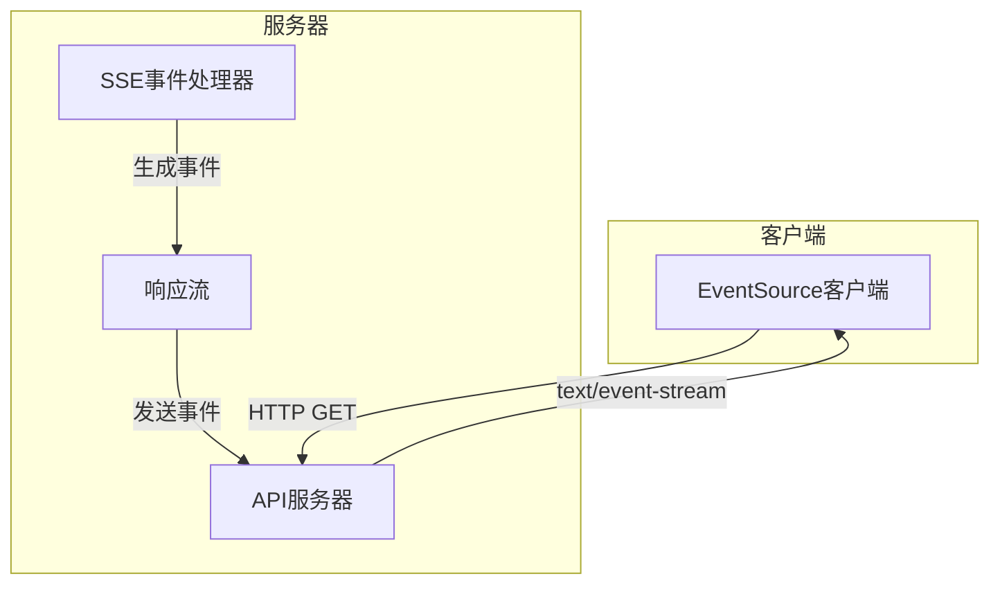
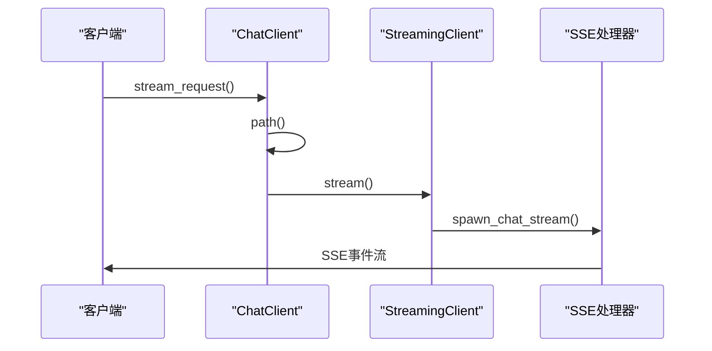
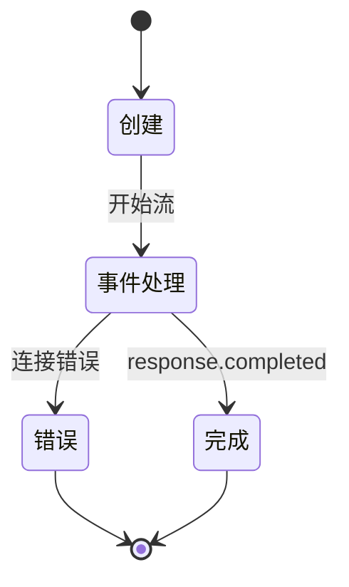
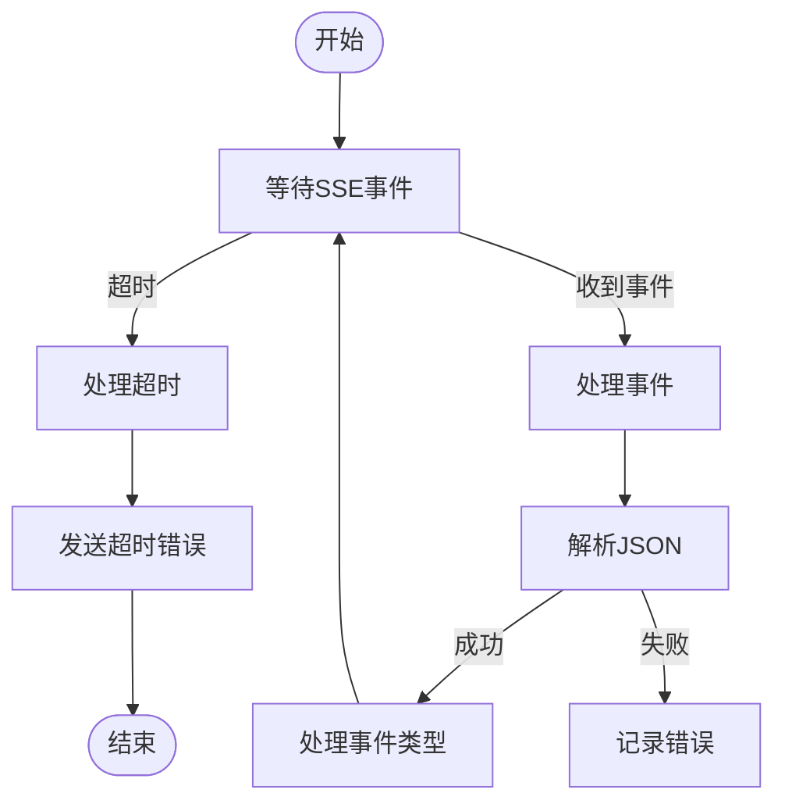
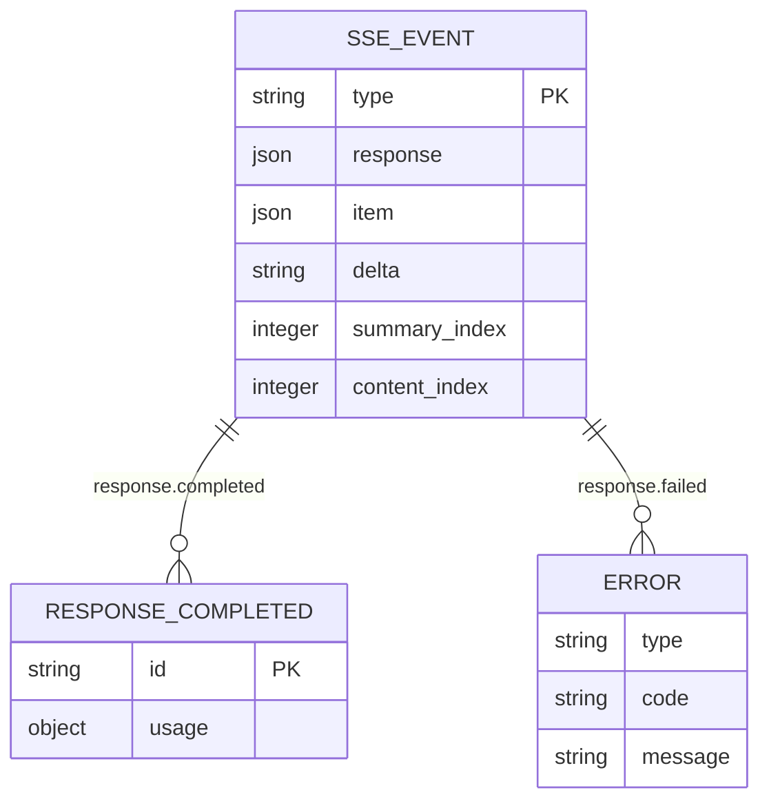
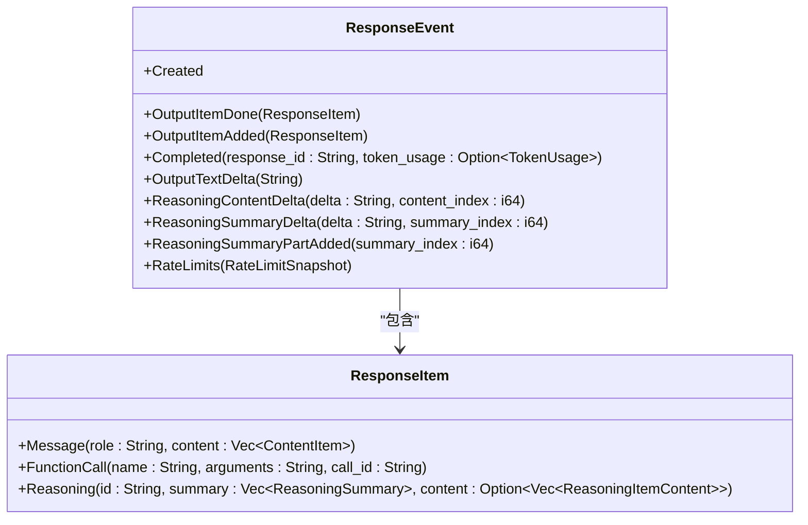
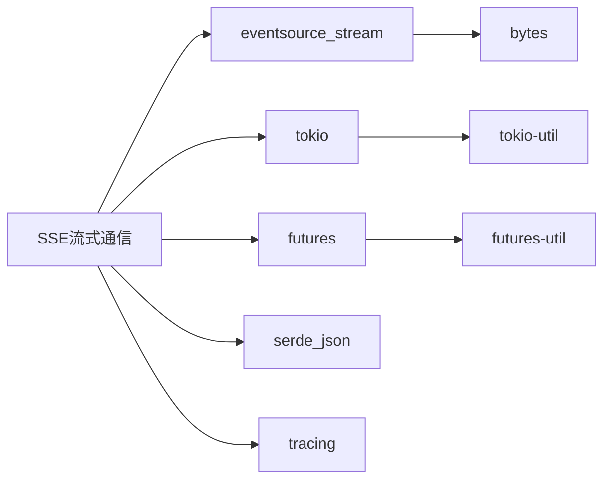

# SSE流式通信

<cite>
**本文档引用的文件**
- [chat.rs](file://codex-rs/codex-api/src/endpoint/chat.rs)
- [chat.rs](file://codex-rs/codex-api/src/sse/chat.rs)
- [responses.rs](file://codex-rs/codex-api/src/sse/responses.rs)
- [common.rs](file://codex-rs/codex-api/src/common.rs)
- [sse.rs](file://codex-rs/codex-client/src/sse.rs)
- [basic_streaming.ts](file://sdk/typescript/samples/basic_streaming.ts)
- [sse_end_to_end.rs](file://codex-rs/codex-api/tests/sse_end_to_end.rs)
</cite>

## 目录
1. [简介](#简介)
2. [项目结构](#项目结构)
3. [核心组件](#核心组件)
4. [架构概述](#架构概述)
5. [详细组件分析](#详细组件分析)
6. [依赖分析](#依赖分析)
7. [性能考虑](#性能考虑)
8. [故障排除指南](#故障排除指南)
9. [结论](#结论)

## 简介
本文档详细描述了Codex内部API的SSE（Server-Sent Events）流式通信机制，重点介绍`/streaming/chat`端点的工作原理。文档涵盖了持久连接的建立、事件流的生命周期管理、连接超时处理、事件类型定义、数据帧格式以及客户端实现示例。

## 项目结构
Codex项目的SSE流式通信功能主要分布在`codex-rs`和`sdk/typescript`目录中。核心实现位于`codex-rs/codex-api/src/sse/`目录下，包括`chat.rs`和`responses.rs`文件，而客户端示例则位于`sdk/typescript/samples/`目录中。

**Section sources**
- [chat.rs](file://codex-rs/codex-api/src/endpoint/chat.rs)
- [chat.rs](file://codex-rs/codex-api/src/sse/chat.rs)
- [responses.rs](file://codex-rs/codex-api/src/sse/responses.rs)

## 核心组件
SSE流式通信的核心组件包括`ChatClient`、`spawn_chat_stream`、`process_sse`和`ResponseStream`等。这些组件共同实现了从服务器到客户端的实时事件流传输。

**Section sources**
- [chat.rs](file://codex-rs/codex-api/src/endpoint/chat.rs)
- [chat.rs](file://codex-rs/codex-api/src/sse/chat.rs)
- [responses.rs](file://codex-rs/codex-api/src/sse/responses.rs)

## 架构概述
SSE流式通信架构基于HTTP长连接，服务器通过`text/event-stream`内容类型向客户端持续发送事件。客户端使用`EventSource` API接收并处理这些事件，实现低延迟的实时通信。



**Diagram sources**
- [chat.rs](file://codex-rs/codex-api/src/endpoint/chat.rs)
- [responses.rs](file://codex-rs/codex-api/src/sse/responses.rs)

## 详细组件分析

### `/streaming/chat`端点工作机制
`/streaming/chat`端点通过`ChatClient`的`stream`方法实现流式通信。该方法根据`WireApi`类型选择不同的路径（`chat/completions`或`responses`），并使用`spawn_chat_stream`函数启动响应流。



**Diagram sources**
- [chat.rs](file://codex-rs/codex-api/src/endpoint/chat.rs)
- [chat.rs](file://codex-rs/codex-api/src/sse/chat.rs)

### 事件流生命周期管理
事件流的生命周期由`ResponseStream`结构管理，它封装了一个`mpsc::Receiver`通道，用于接收处理后的事件。流的生命周期包括创建、事件处理和完成三个阶段。



**Diagram sources**
- [responses.rs](file://codex-rs/codex-api/src/sse/responses.rs)
- [common.rs](file://codex-rs/codex-api/src/common.rs)

### 连接超时处理
连接超时处理在`process_sse`函数中实现，使用`tokio::time::timeout`来监控空闲超时。如果在指定时间内没有收到新的SSE事件，连接将被关闭。



**Diagram sources**
- [responses.rs](file://codex-rs/codex-api/src/sse/responses.rs)
- [chat.rs](file://codex-rs/codex-api/src/sse/chat.rs)

### 事件类型和数据帧格式
SSE事件类型在`common.rs`中定义，主要包括`chunk`、`complete`和`error`等类型。每个事件都包含一个`type`字段来标识事件类型，以及相应的数据载荷。



**Diagram sources**
- [common.rs](file://codex-rs/codex-api/src/common.rs)
- [responses.rs](file://codex-rs/codex-api/src/sse/responses.rs)

### 流式响应数据结构
流式响应的数据结构在`responses.rs`中定义，通过`ResponseEvent`枚举类型表示不同的响应事件。`OutputTextDelta`用于表示文本块，`Completed`表示响应完成。



**Diagram sources**
- [common.rs](file://codex-rs/codex-api/src/common.rs)
- [responses.rs](file://codex-rs/codex-api/src/sse/responses.rs)

### JavaScript客户端示例
以下是一个完整的JavaScript客户端示例，展示如何使用`EventSource` API消费SSE流式响应：

```javascript
const eventSource = new EventSource('/streaming/chat');

eventSource.onmessage = function(event) {
    const data = JSON.parse(event.data);
    switch(data.type) {
        case 'response.output_text.delta':
            console.log('文本块:', data.delta);
            break;
        case 'response.completed':
            console.log('响应完成:', data.response.id);
            eventSource.close();
            break;
        case 'response.failed':
            console.error('请求失败:', data.response.error);
            eventSource.close();
            break;
    }
};

eventSource.onerror = function(error) {
    console.error('SSE连接错误:', error);
    eventSource.close();
};
```

**Section sources**
- [basic_streaming.ts](file://sdk/typescript/samples/basic_streaming.ts)

## 依赖分析
SSE流式通信功能依赖于多个Rust crate，包括`eventsource_stream`用于SSE解析，`tokio`用于异步处理，`futures`用于流处理，以及`serde_json`用于JSON序列化。



**Diagram sources**
- [chat.rs](file://codex-rs/codex-api/src/sse/chat.rs)
- [responses.rs](file://codex-rs/codex-api/src/sse/responses.rs)

## 性能考虑
SSE流式传输相比传统的请求-响应模式具有显著的性能优势，主要体现在：
- **低延迟**: 服务器可以立即发送生成的文本块，无需等待整个响应完成
- **内存效率**: 客户端可以边接收边处理数据，减少内存占用
- **网络效率**: 避免了频繁的HTTP连接建立和关闭开销

潜在的网络问题包括：
- **连接中断**: 长时间连接可能因网络不稳定而中断
- **防火墙限制**: 某些防火墙可能限制长时间的HTTP连接
- **代理问题**: 中间代理可能缓冲SSE响应，导致延迟增加

**Section sources**
- [chat.rs](file://codex-rs/codex-api/src/sse/chat.rs)
- [responses.rs](file://codex-rs/codex-api/src/sse/responses.rs)

## 故障排除指南
常见问题及解决方案：
- **连接超时**: 检查`stream_idle_timeout`配置，适当增加超时时间
- **事件解析失败**: 确保服务器发送的JSON格式正确，避免无效UTF-8字符
- **内存泄漏**: 确保客户端正确处理`response.completed`事件并关闭连接
- **跨域问题**: 配置正确的CORS头，允许客户端域名访问SSE端点

**Section sources**
- [responses.rs](file://codex-rs/codex-api/src/sse/responses.rs)
- [sse_end_to_end.rs](file://codex-rs/codex-api/tests/sse_end_to_end.rs)

## 结论
Codex的SSE流式通信机制提供了一种高效、实时的服务器到客户端通信方式。通过合理的事件类型设计和生命周期管理，实现了流畅的AI生成文本流式传输体验。客户端可以实时接收和处理文本块，显著提升了用户体验。