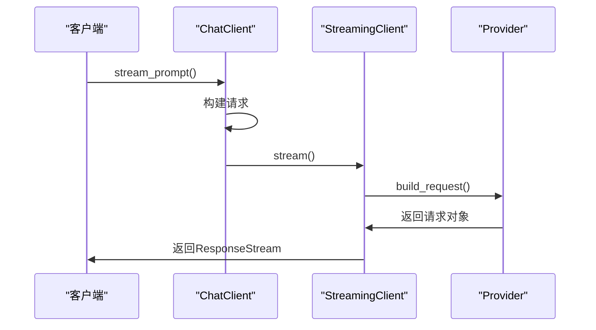
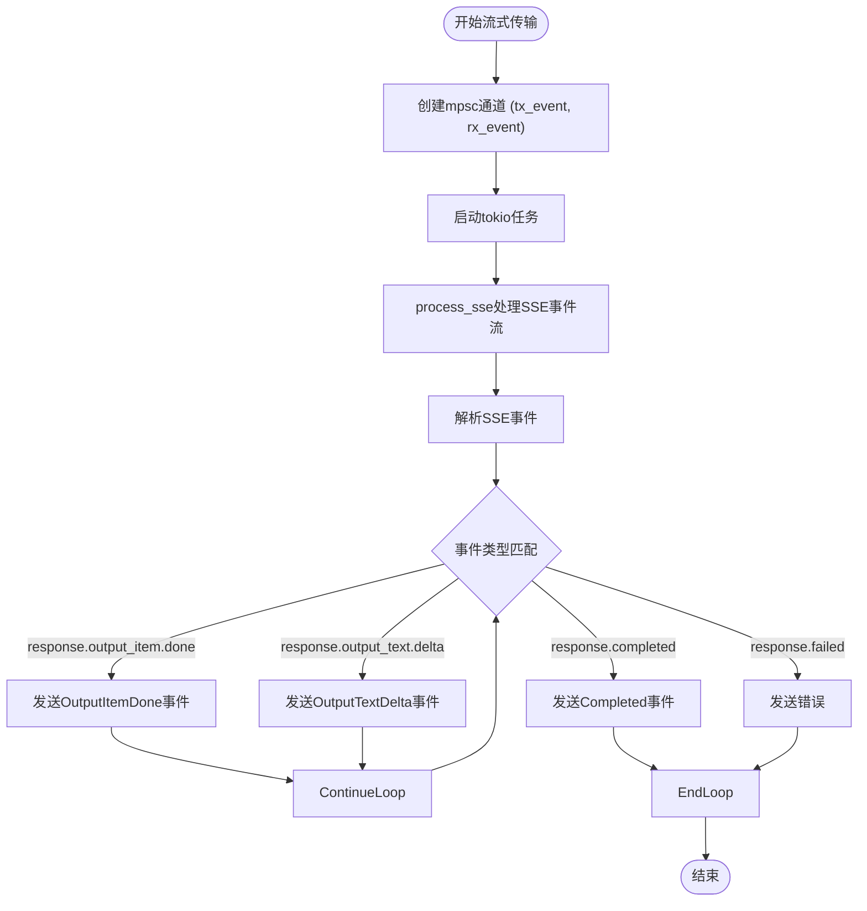
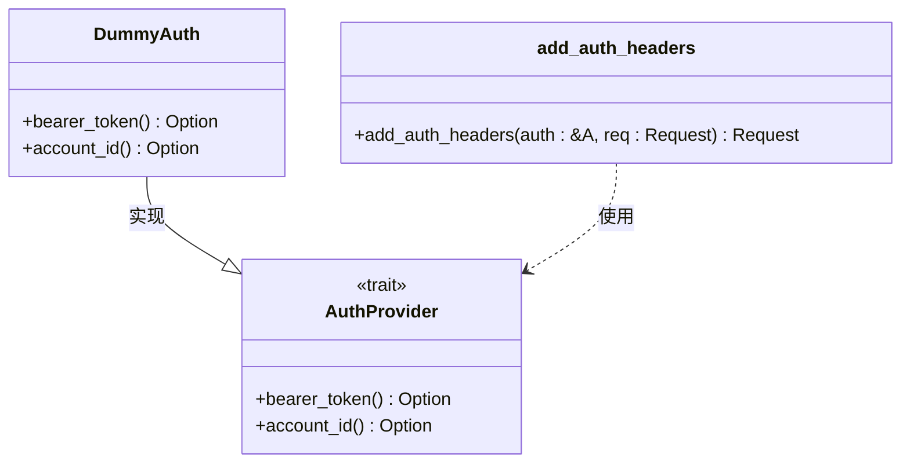
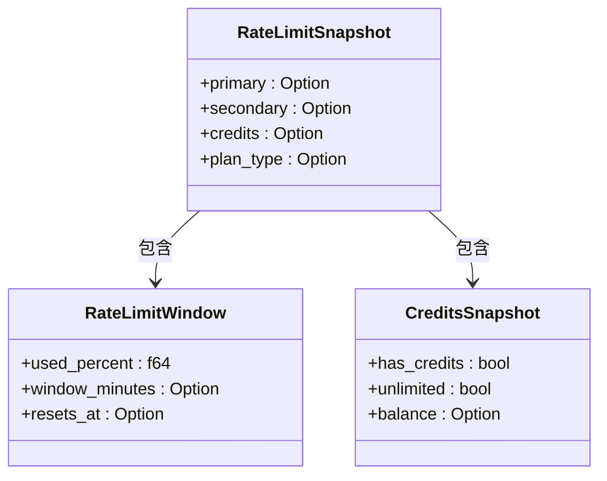
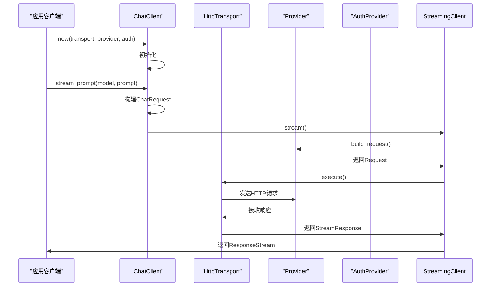
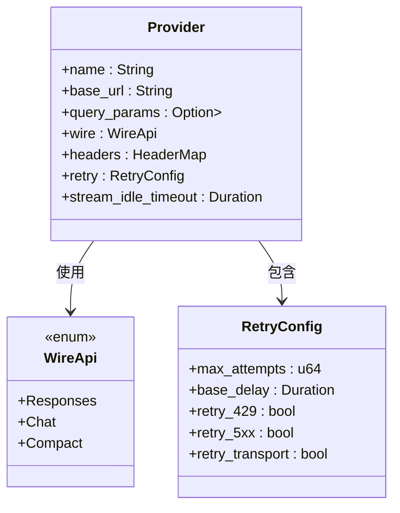

# 内部API文档

<cite>
**本文档中引用的文件**   
- [lib.rs](file://codex-rs/codex-api/src/lib.rs)
- [common.rs](file://codex-rs/codex-api/src/common.rs)
- [error.rs](file://codex-rs/codex-api/src/error.rs)
- [provider.rs](file://codex-rs/codex-api/src/provider.rs)
- [auth.rs](file://codex-rs/codex-api/src/auth.rs)
- [rate_limits.rs](file://codex-rs/codex-api/src/rate_limits.rs)
- [chat.rs](file://codex-rs/codex-api/src/endpoint/chat.rs)
- [compact.rs](file://codex-rs/codex-api/src/endpoint/compact.rs)
- [streaming.rs](file://codex-rs/codex-api/src/endpoint/streaming.rs)
- [responses.rs](file://codex-rs/codex-api/src/sse/responses.rs)
- [chat.rs](file://codex-rs/codex-api/src/sse/chat.rs)
- [requests/chat.rs](file://codex-rs/codex-api/src/requests/chat.rs)
- [requests/responses.rs](file://codex-rs/codex-api/src/requests/responses.rs)
</cite>

## 目录
1. [简介](#简介)
2. [核心端点](#核心端点)
3. [SSE流式传输实现](#sse流式传输实现)
4. [认证机制](#认证机制)
5. [速率限制策略](#速率限制策略)
6. [错误处理](#错误处理)
7. [客户端调用示例](#客户端调用示例)
8. [模型提供商集成](#模型提供商集成)
9. [共享数据结构](#共享数据结构)

## 简介
Codex后端`codex-api`模块提供了一套RESTful和SSE（Server-Sent Events）流式API，用于与AI模型进行交互。该API模块设计用于支持聊天、内容压缩和流式响应等核心功能。API客户端通过`codex-client`库与后端服务通信，支持重试策略、请求遥测和流式传输超时等功能。该模块通过`Provider`结构配置不同的模型提供商，并使用`AuthProvider`处理身份验证。

## 核心端点

`codex-api`模块提供了三个核心端点：`/chat`、`/compact`和`/streaming`，分别用于聊天交互、内容压缩和流式响应。这些端点通过`ChatClient`、`CompactClient`和`StreamingClient`类进行访问，支持异步操作和流式数据传输。

**Section sources**
- [chat.rs](file://codex-rs/codex-api/src/endpoint/chat.rs#L27-L86)
- [compact.rs](file://codex-rs/codex-api/src/endpoint/compact.rs#L17-L82)
- [streaming.rs](file://codex-rs/codex-api/src/endpoint/streaming.rs#L17-L83)

### 聊天端点 (/chat)
聊天端点`/chat`用于与AI模型进行交互式对话。该端点支持流式传输，可以实时接收模型的响应。`ChatClient`类提供了`stream_request`和`stream_prompt`方法来发起聊天请求。请求体包含模型名称、提示信息、对话历史和工具定义等。



**Diagram sources**
- [chat.rs](file://codex-rs/codex-api/src/endpoint/chat.rs#L48-L85)
- [streaming.rs](file://codex-rs/codex-api/src/endpoint/streaming.rs#L50-L81)

### 内容压缩端点 (/compact)
内容压缩端点`/compact`用于将长对话历史压缩为更紧凑的形式，以适应模型的上下文窗口限制。`CompactClient`类提供了`compact`和`compact_input`方法来执行压缩操作。该端点要求使用`Responses` wire API，不支持`Chat` wire API。

**Section sources**
- [compact.rs](file://codex-rs/codex-api/src/endpoint/compact.rs#L48-L81)

### 流式端点 (/streaming)
流式端点`/streaming`是SSE流式传输的基础实现。`StreamingClient`类负责处理流式请求的底层细节，包括构建请求、添加认证头、处理重试策略和管理流式连接。该客户端被`ChatClient`和其他流式客户端所使用。

**Section sources**
- [streaming.rs](file://codex-rs/codex-api/src/endpoint/streaming.rs#L50-L81)

## SSE流式传输实现

SSE（Server-Sent Events）流式传输是`codex-api`模块的核心特性，允许服务器向客户端实时推送数据。该实现基于`eventsource_stream`库，通过`spawn_response_stream`和`spawn_chat_stream`函数启动流式处理任务。



**Diagram sources**
- [responses.rs](file://codex-rs/codex-api/src/sse/responses.rs#L131-L298)
- [chat.rs](file://codex-rs/codex-api/src/sse/chat.rs#L33-L41)

### 事件类型和数据帧格式
SSE流式传输支持多种事件类型，每种类型对应不同的数据帧格式：

- `response.created`: 表示响应已创建
- `response.output_item.done`: 表示一个输出项已完成
- `response.output_text.delta`: 表示文本输出的增量更新
- `response.reasoning_text.delta`: 表示推理文本的增量更新
- `response.completed`: 表示响应已完成
- `response.failed`: 表示请求失败

### 连接管理
流式连接由`ResponseStream`结构管理，它包装了一个`mpsc::Receiver`，用于接收`ResponseEvent`。连接的空闲超时由`Provider`配置中的`stream_idle_timeout`参数控制。如果在指定时间内没有收到任何事件，连接将被关闭。

**Section sources**
- [responses.rs](file://codex-rs/codex-api/src/sse/responses.rs#L131-L298)
- [chat.rs](file://codex-rs/codex-api/src/sse/chat.rs#L33-L41)

## 认证机制

`codex-api`模块使用OAuth/Bearer Token机制进行认证。`AuthProvider` trait定义了认证提供者接口，要求实现`bearer_token`和`account_id`方法。`add_auth_headers`函数负责将认证信息添加到HTTP请求头中。



**Diagram sources**
- [auth.rs](file://codex-rs/codex-api/src/auth.rs#L8-L28)

当`bearer_token`方法返回一个有效的令牌时，`add_auth_headers`函数会将其添加到`Authorization`头中，格式为`Bearer {token}`。同时，`account_id`会被添加到`ChatGPT-Account-ID`头中。

**Section sources**
- [auth.rs](file://codex-rs/codex-api/src/auth.rs#L8-L28)

## 速率限制策略

`codex-api`模块实现了基于HTTP头的速率限制策略。`rate_limits.rs`文件中的`parse_rate_limit`函数负责解析特定的速率限制头信息，包括`x-codex-primary-used-percent`、`x-codex-secondary-used-percent`等。这些头信息提供了关于当前使用率、窗口分钟数和重置时间的详细信息。



**Diagram sources**
- [rate_limits.rs](file://codex-rs/codex-api/src/rate_limits.rs#L19-L42)

`Provider`结构中的`RetryConfig`配置了重试策略，包括最大尝试次数、基础延迟、是否重试429状态码等。这些配置被转换为`RetryPolicy`并用于驱动传输层的重试。

**Section sources**
- [rate_limits.rs](file://codex-rs/codex-api/src/rate_limits.rs#L19-L42)
- [provider.rs](file://codex-rs/codex-api/src/provider.rs#L22-L42)

## 错误处理

错误处理在`error.rs`文件中定义，使用`thiserror`库创建了`ApiError`枚举。该枚举包含了多种错误类型，如`Transport`、`Api`、`Stream`、`ContextWindowExceeded`、`QuotaExceeded`等。`ApiError`实现了`From<RateLimitError>`，允许将速率限制错误转换为API错误。

```mermaid
classDiagram
class ApiError {
<<enum>>
+Transport(TransportError)
+Api { status : StatusCode, message : String }
+Stream(String)
+ContextWindowExceeded
+QuotaExceeded
+UsageNotIncluded
+Retryable { message : String, delay : Option<Duration> }
+RateLimit(String)
}
class RateLimitError {
+message : String
}
ApiError <|-- RateLimitError : 转换
```

**Diagram sources**
- [error.rs](file://codex-rs/codex-api/src/error.rs#L8-L28)

在SSE流式传输中，`response.failed`事件会触发错误处理。`process_sse`函数会解析错误信息，并根据错误代码将其转换为相应的`ApiError`类型，如`ContextWindowExceeded`或`QuotaExceeded`。

**Section sources**
- [error.rs](file://codex-rs/codex-api/src/error.rs#L8-L28)
- [responses.rs](file://codex-rs/codex-api/src/sse/responses.rs#L239-L258)

## 客户端调用示例

以下示例展示了如何使用`reqwest`或类似客户端调用`codex-api`的内部API：



**Diagram sources**
- [chat.rs](file://codex-rs/codex-api/src/endpoint/chat.rs#L48-L85)
- [streaming.rs](file://codex-rs/codex-api/src/endpoint/streaming.rs#L50-L81)

**Section sources**
- [chat.rs](file://codex-rs/codex-api/src/endpoint/chat.rs#L48-L85)
- [streaming.rs](file://codex-rs/codex-api/src/endpoint/streaming.rs#L50-L81)

## 模型提供商集成

`provider.rs`文件定义了`Provider`结构和`WireApi`枚举，用于与不同模型提供商集成。`Provider`结构包含了基础URL、查询参数、头信息、重试配置等信息。`WireApi`枚举定义了支持的线级API，包括`Responses`、`Chat`和`Compact`。



**Diagram sources**
- [provider.rs](file://codex-rs/codex-api/src/provider.rs#L49-L57)

`is_azure_responses_endpoint`函数用于检测是否为Azure Responses端点，通过检查基础URL是否包含特定标记来实现。

**Section sources**
- [provider.rs](file://codex-rs/codex-api/src/provider.rs#L94-L105)

## 共享数据结构

`common.rs`文件定义了多个共享数据结构，这些结构在多个端点之间共享使用：

- `Prompt`: 聊天和响应端点的标准提示输入
- `CompactionInput`: 压缩端点的标准输入负载
- `ResponseEvent`: SSE流式传输的事件枚举
- `ResponseStream`: 响应流包装器
- `Reasoning`: 推理控制参数
- `TextControls`: 文本输出控制参数

```mermaid
classDiagram
class Prompt {
+instructions : String
+input : Vec<ResponseItem>
+tools : Vec<Value>
+parallel_tool_calls : bool
+output_schema : Option<Value>
}
class CompactionInput {
+model : &'a str
+input : &'a [ResponseItem]
+instructions : &'a str
}
class ResponseEvent {
<<enum>>
+Created
+OutputItemDone(ResponseItem)
+OutputItemAdded(ResponseItem)
+Completed { response_id : String, token_usage : Option<TokenUsage> }
+OutputTextDelta(String)
+ReasoningSummaryDelta { delta : String, summary_index : i64 }
+ReasoningContentDelta { delta : String, content_index : i64 }
+ReasoningSummaryPartAdded { summary_index : i64 }
+RateLimits(RateLimitSnapshot)
}
class ResponseStream {
+rx_event : mpsc : : Receiver<Result<ResponseEvent, ApiError>>
}
class Reasoning {
+effort : Option<ReasoningEffortConfig>
+summary : Option<ReasoningSummaryConfig>
}
class TextControls {
+verbosity : Option<OpenAiVerbosity>
+format : Option<TextFormat>
}
class TextFormat {
+r#type : TextFormatType
+strict : bool
+schema : Value
+name : String
}
class TextFormatType {
<<enum>>
+JsonSchema
}
class OpenAiVerbosity {
<<enum>>
+Low
+Medium
+High
}
ResponseStream --> ResponseEvent : 流式传输
TextControls --> TextFormat : 包含
TextFormat --> TextFormatType : 引用
```

**Diagram sources**
- [common.rs](file://codex-rs/codex-api/src/common.rs#L18-L168)

`create_text_param_for_request`函数根据`verbosity`和`output_schema`创建`TextControls`参数，用于控制文本输出的详细程度和格式。

**Section sources**
- [common.rs](file://codex-rs/codex-api/src/common.rs#L138-L155)