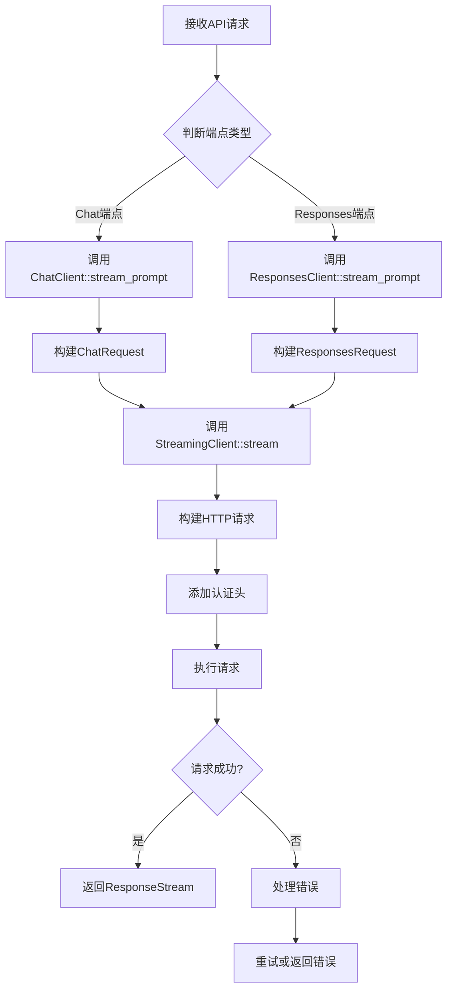

# 模型与请求模型

<cite>
**本文档引用的文件**   
- [provider.rs](file://codex-rs/codex-api/src/provider.rs)
- [common.rs](file://codex-rs/codex-api/src/common.rs)
- [requests/mod.rs](file://codex-rs/codex-api/src/requests/mod.rs)
- [requests/headers.rs](file://codex-rs/codex-api/src/requests/headers.rs)
- [requests/chat.rs](file://codex-rs/codex-api/src/requests/chat.rs)
- [requests/responses.rs](file://codex-rs/codex-api/src/requests/responses.rs)
- [endpoint/chat.rs](file://codex-rs/codex-api/src/endpoint/chat.rs)
- [endpoint/responses.rs](file://codex-rs/codex-api/src/endpoint/responses.rs)
- [endpoint/streaming.rs](file://codex-rs/codex-api/src/endpoint/streaming.rs)
- [error.rs](file://codex-rs/codex-api/src/error.rs)
- [protocol/common.rs](file://codex-rs/app-server-protocol/src/protocol/common.rs)
- [models.rs](file://codex-rs/protocol/src/models.rs)
</cite>

## 目录
1. [引言](#引言)
2. [Provider抽象层](#provider抽象层)
3. [共享数据结构](#共享数据结构)
4. [请求验证与HTTP头处理](#请求验证与http头处理)
5. [端点实现与请求处理](#端点实现与请求处理)
6. [请求处理流程](#请求处理流程)
7. [错误处理](#错误处理)
8. [结论](#结论)

## 引言
Codex内部API通过`provider.rs`中的`Provider`结构体作为抽象层，将内部API请求路由到不同的后端模型提供商（如OpenAI、Ollama）。该文档详细解释了`Provider`如何处理模型提供商的特定API差异，实现统一的接口。同时，文档描述了`common.rs`中定义的共享数据结构（如`ModelId`, `ChatMessage`），这些结构被多个端点复用。此外，文档还详细说明了`requests/mod.rs`和`headers.rs`中定义的请求验证逻辑和HTTP头处理，包括自定义头的解析和注入。

## Provider抽象层

`Provider`结构体是Codex内部API的核心抽象层，负责将内部API请求路由到不同的后端模型提供商。`Provider`结构体包含以下字段：

- `name`: 提供商的名称
- `base_url`: 基础URL
- `query_params`: 查询参数
- `wire`: 线级API
- `headers`: HTTP头
- `retry`: 重试配置
- `stream_idle_timeout`: 流空闲超时

`Provider`结构体通过`build_request`方法构建HTTP请求，该方法接受HTTP方法和路径作为参数，并返回一个`Request`对象。`Provider`还通过`url_for_path`方法生成完整的URL，该方法将基础URL和路径拼接在一起，并添加查询参数。

`Provider`结构体还包含一个`is_azure_responses_endpoint`方法，用于判断是否为Azure Responses端点。该方法通过检查提供商名称和基础URL来确定是否为Azure Responses端点。

**Section sources**
- [provider.rs](file://codex-rs/codex-api/src/provider.rs#L1-L119)

## 共享数据结构

`common.rs`文件中定义了多个共享数据结构，这些结构被多个端点复用。主要的数据结构包括：

- `Prompt`: 用于Chat和Responses端点的规范提示输入
- `CompactionInput`: 用于压缩端点的规范输入负载
- `ResponseEvent`: 响应事件枚举
- `Reasoning`: 推理配置
- `TextFormatType`: 文本格式类型
- `TextFormat`: 文本格式
- `TextControls`: 文本控制
- `OpenAiVerbosity`: OpenAI详细程度
- `ResponsesApiRequest`: Responses API请求
- `ResponseStream`: 响应流

这些数据结构通过`serde`库进行序列化和反序列化，确保了数据的一致性和可移植性。

**Section sources**
- [common.rs](file://codex-rs/codex-api/src/common.rs#L1-L168)

## 请求验证与HTTP头处理

`requests/mod.rs`文件中定义了请求验证逻辑和HTTP头处理。`headers.rs`文件中定义了以下函数：

- `build_conversation_headers`: 构建会话头
- `subagent_header`: 子代理头
- `insert_header`: 插入头

`build_conversation_headers`函数用于构建会话头，该函数接受一个可选的会话ID，并返回一个`HeaderMap`对象。`subagent_header`函数用于生成子代理头，该函数接受一个`SessionSource`对象，并返回一个可选的字符串。`insert_header`函数用于插入头，该函数接受一个`HeaderMap`对象、头名称和值，并将头插入到`HeaderMap`中。

`chat.rs`和`responses.rs`文件中定义了`ChatRequestBuilder`和`ResponsesRequestBuilder`结构体，这些结构体用于构建请求。`ChatRequestBuilder`和`ResponsesRequestBuilder`结构体通过链式调用方法来设置请求参数，并最终通过`build`方法生成请求。

**Section sources**
- [requests/mod.rs](file://codex-rs/codex-api/src/requests/mod.rs#L1-L9)
- [requests/headers.rs](file://codex-rs/codex-api/src/requests/headers.rs#L1-L37)
- [requests/chat.rs](file://codex-rs/codex-api/src/requests/chat.rs#L1-L389)
- [requests/responses.rs](file://codex-rs/codex-api/src/requests/responses.rs#L1-L248)

## 端点实现与请求处理

`endpoint/chat.rs`和`endpoint/responses.rs`文件中定义了端点实现和请求处理逻辑。`ChatClient`和`ResponsesClient`结构体用于处理Chat和Responses端点的请求。这些结构体通过`stream_request`和`stream_prompt`方法处理请求，并返回一个`ResponseStream`对象。

`StreamingClient`结构体是请求处理的核心，它负责处理流式请求。`StreamingClient`结构体通过`stream`方法处理请求，该方法接受路径、请求体、额外头和流生成器作为参数，并返回一个`ResponseStream`对象。`stream`方法通过`run_with_request_telemetry`函数执行请求，并处理重试逻辑。

**Diagram sources **
- [endpoint/chat.rs](file://codex-rs/codex-api/src/endpoint/chat.rs#L1-L267)
- [endpoint/responses.rs](file://codex-rs/codex-api/src/endpoint/responses.rs#L1-L110)
- [endpoint/streaming.rs](file://codex-rs/codex-api/src/endpoint/streaming.rs#L1-L83)

**Section sources**
- [endpoint/chat.rs](file://codex-rs/codex-api/src/endpoint/chat.rs#L1-L267)
- [endpoint/responses.rs](file://codex-rs/codex-api/src/endpoint/responses.rs#L1-L110)
- [endpoint/streaming.rs](file://codex-rs/codex-api/src/endpoint/streaming.rs#L1-L83)

## 请求处理流程

从接收到API请求到最终调用外部模型提供商的完整数据流如下：

1. 接收API请求
2. 判断端点类型（Chat或Responses）
3. 调用相应的客户端（`ChatClient`或`ResponsesClient`）
4. 构建请求（`ChatRequest`或`ResponsesRequest`）
5. 调用`StreamingClient::stream`方法
6. 构建HTTP请求
7. 添加认证头
8. 执行请求
9. 处理响应
10. 返回`ResponseStream`

该流程通过`StreamingClient`结构体实现，确保了请求处理的一致性和可靠性。

**Section sources**
- [endpoint/chat.rs](file://codex-rs/codex-api/src/endpoint/chat.rs#L1-L267)
- [endpoint/responses.rs](file://codex-rs/codex-api/src/endpoint/responses.rs#L1-L110)
- [endpoint/streaming.rs](file://codex-rs/codex-api/src/endpoint/streaming.rs#L1-L83)

## 错误处理

`error.rs`文件中定义了错误处理逻辑。`ApiError`枚举定义了多种错误类型，包括传输错误、API错误、流错误、上下文窗口超出、配额超出、使用未包含、可重试错误和速率限制错误。`ApiError`枚举通过`thiserror`库实现，确保了错误信息的清晰和一致。

`ApiError`枚举还实现了`From<RateLimitError>` trait，允许将`RateLimitError`转换为`ApiError`。这使得错误处理更加灵活和统一。

**Section sources**
- [error.rs](file://codex-rs/codex-api/src/error.rs#L1-L35)

## 结论
Codex内部API通过`provider.rs`中的`Provider`结构体作为抽象层，将内部API请求路由到不同的后端模型提供商。`common.rs`中定义的共享数据结构被多个端点复用，确保了数据的一致性和可移植性。`requests/mod.rs`和`headers.rs`中定义的请求验证逻辑和HTTP头处理，包括自定义头的解析和注入，确保了请求的正确性和安全性。`endpoint/chat.rs`和`endpoint/responses.rs`中定义的端点实现和请求处理逻辑，通过`StreamingClient`结构体实现，确保了请求处理的一致性和可靠性。错误处理逻辑通过`ApiError`枚举实现，确保了错误信息的清晰和一致。