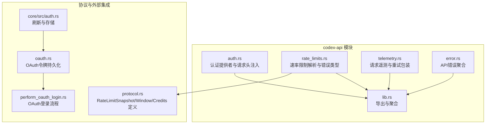
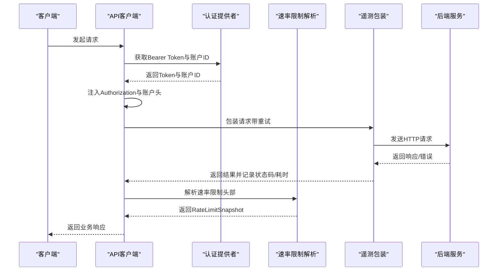
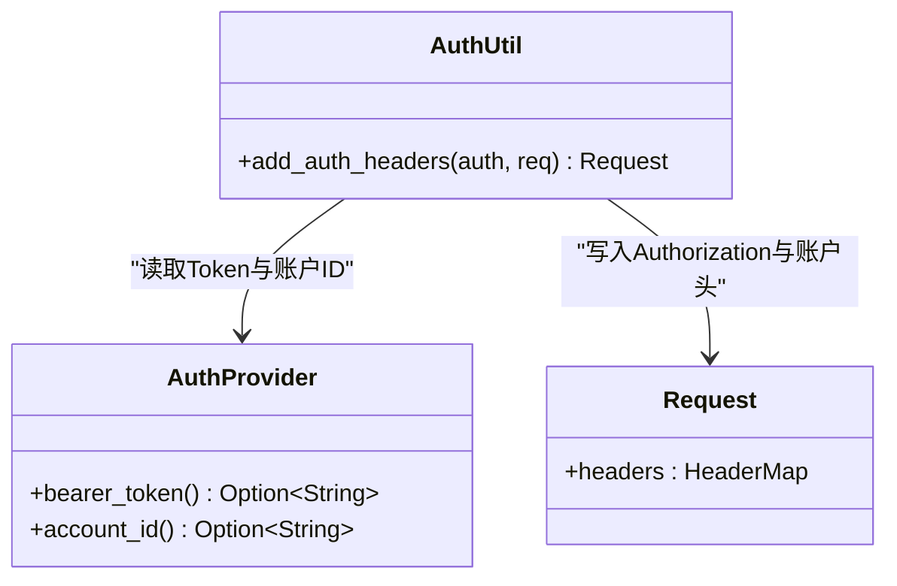
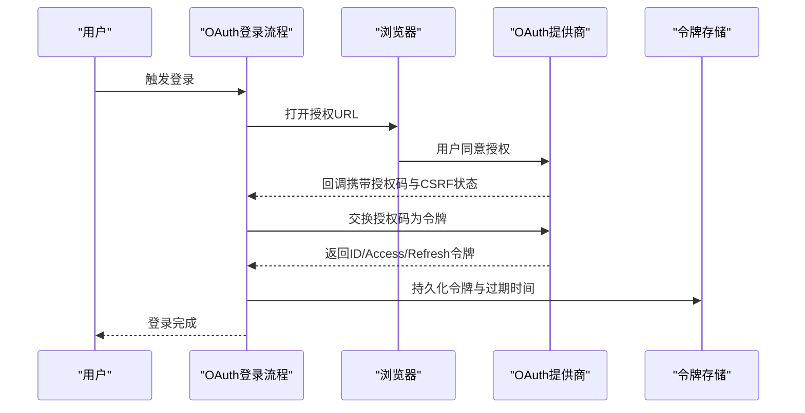
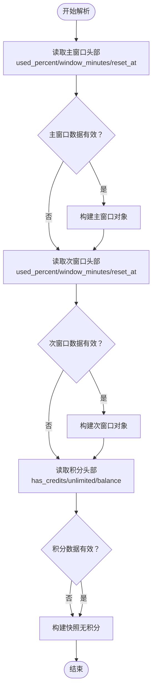
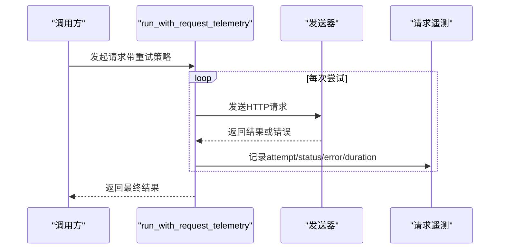
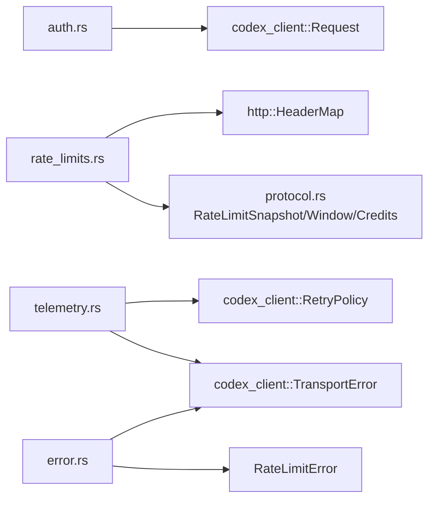

# 认证与安全

<cite>
**本文引用的文件**
- [auth.rs](file://codex-rs/codex-api/src/auth.rs)
- [rate_limits.rs](file://codex-rs/codex-api/src/rate_limits.rs)
- [telemetry.rs](file://codex-rs/codex-api/src/telemetry.rs)
- [lib.rs](file://codex-rs/codex-api/src/lib.rs)
- [error.rs](file://codex-rs/codex-api/src/error.rs)
- [protocol.rs](file://codex-rs/protocol/src/protocol.rs)
- [oauth.rs](file://codex-rs/rmcp-client/src/oauth.rs)
- [perform_oauth_login.rs](file://codex-rs/rmcp-client/src/perform_oauth_login.rs)
- [auth.rs](file://codex-rs/core/src/auth.rs)
</cite>

## 目录
1. [简介](#简介)
2. [项目结构](#项目结构)
3. [核心组件](#核心组件)
4. [架构总览](#架构总览)
5. [详细组件分析](#详细组件分析)
6. [依赖关系分析](#依赖关系分析)
7. [性能考量](#性能考量)
8. [故障排查指南](#故障排查指南)
9. [结论](#结论)
10. [附录](#附录)

## 简介
本文件聚焦于Codex内部API的认证与安全机制，围绕以下目标展开：
- 阐述auth.rs中实现的认证流程，重点覆盖Bearer Token的注入与账户标识头的附加。
- 解释rate_limits.rs中的速率限制策略与解析逻辑，包括基于窗口百分比、窗口时长与重置时间的指标，以及如何通过自定义头部向客户端传达限制信息。
- 说明telemetry.rs如何记录API调用日志，用于安全审计与监控。
- 提供认证失败与速率限制错误的响应示例及其含义解读。
- 讨论认证凭据的安全存储与传输方式。

## 项目结构
与认证与安全相关的核心代码位于codex-rs/codex-api模块中，同时涉及协议定义与OAuth登录流程的实现。

图表来源
- [auth.rs](file://codex-rs/codex-api/src/auth.rs#L1-L28)
- [rate_limits.rs](file://codex-rs/codex-api/src/rate_limits.rs#L1-L107)
- [telemetry.rs](file://codex-rs/codex-api/src/telemetry.rs#L1-L85)
- [error.rs](file://codex-rs/codex-api/src/error.rs#L1-L35)
- [lib.rs](file://codex-rs/codex-api/src/lib.rs#L1-L37)
- [protocol.rs](file://codex-rs/protocol/src/protocol.rs#L884-L909)
- [oauth.rs](file://codex-rs/rmcp-client/src/oauth.rs#L279-L481)
- [perform_oauth_login.rs](file://codex-rs/rmcp-client/src/perform_oauth_login.rs#L1-L289)
- [auth.rs](file://codex-rs/core/src/auth.rs#L100-L133)

章节来源
- [lib.rs](file://codex-rs/codex-api/src/lib.rs#L1-L37)

## 核心组件
- 认证提供者与请求头注入：在auth.rs中定义了认证提供者接口与将Bearer Token与账户标识头注入到请求的工具函数。
- 速率限制解析：在rate_limits.rs中定义了速率限制错误类型与从HTTP头部解析速率限制快照的函数。
- 请求遥测：在telemetry.rs中封装了带重试的请求执行，并记录状态码、错误与耗时，便于审计与监控。
- 错误聚合：在error.rs中将速率限制错误映射为统一的API错误类型。
- 协议数据结构：在protocol.rs中定义了速率限制快照、窗口与积分等数据结构。

章节来源
- [auth.rs](file://codex-rs/codex-api/src/auth.rs#L1-L28)
- [rate_limits.rs](file://codex-rs/codex-api/src/rate_limits.rs#L1-L107)
- [telemetry.rs](file://codex-rs/codex-api/src/telemetry.rs#L1-L85)
- [error.rs](file://codex-rs/codex-api/src/error.rs#L1-L35)
- [protocol.rs](file://codex-rs/protocol/src/protocol.rs#L884-L909)

## 架构总览
下图展示了认证、速率限制与遥测在API调用链中的交互关系。

图表来源
- [auth.rs](file://codex-rs/codex-api/src/auth.rs#L15-L27)
- [rate_limits.rs](file://codex-rs/codex-api/src/rate_limits.rs#L18-L42)
- [telemetry.rs](file://codex-rs/codex-api/src/telemetry.rs#L54-L84)
- [error.rs](file://codex-rs/codex-api/src/error.rs#L26-L35)

## 详细组件分析

### 认证提供者与请求头注入（auth.rs）
- 认证提供者接口：定义了可选的Bearer Token与账户ID获取方法，要求实现是线程安全且非阻塞的。
- 头部注入逻辑：将Bearer Token注入Authorization头；将账户ID注入特定的账户标识头。该逻辑仅在存在有效值时才写入对应头部，避免无效头污染。

图表来源
- [auth.rs](file://codex-rs/codex-api/src/auth.rs#L8-L27)

章节来源
- [auth.rs](file://codex-rs/codex-api/src/auth.rs#L8-L27)

### OAuth 2.0与Bearer Token验证
- OAuth登录流程：perform_oauth_login.rs实现了浏览器授权、回调接收与令牌交换的完整流程，支持超时控制与任务完成通知。
- OAuth令牌持久化：oauth.rs负责将OAuth令牌写入持久化存储，并维护过期时间与刷新令牌。
- 刷新与存储：core/src/auth.rs提供了刷新访问令牌的逻辑，更新存储中的令牌并返回新的访问令牌。

图表来源
- [perform_oauth_login.rs](file://codex-rs/rmcp-client/src/perform_oauth_login.rs#L40-L177)
- [oauth.rs](file://codex-rs/rmcp-client/src/oauth.rs#L279-L481)
- [auth.rs](file://codex-rs/core/src/auth.rs#L100-L133)

章节来源
- [perform_oauth_login.rs](file://codex-rs/rmcp-client/src/perform_oauth_login.rs#L40-L177)
- [oauth.rs](file://codex-rs/rmcp-client/src/oauth.rs#L279-L481)
- [auth.rs](file://codex-rs/core/src/auth.rs#L100-L133)

### 速率限制策略与解析（rate_limits.rs）
- 速率限制错误类型：定义了RateLimitError，用于表示速率限制相关的错误。
- 自定义头部解析：从HTTP头部解析主/次窗口的使用百分比、窗口时长（分钟）、重置时间（秒），以及积分状态（是否拥有、是否无限、余额）。
- 数据结构来源：速率限制快照、窗口与积分在protocol.rs中定义，包含序列化与类型标注。

图表来源
- [rate_limits.rs](file://codex-rs/codex-api/src/rate_limits.rs#L18-L107)
- [protocol.rs](file://codex-rs/protocol/src/protocol.rs#L884-L909)

章节来源
- [rate_limits.rs](file://codex-rs/codex-api/src/rate_limits.rs#L1-L107)
- [protocol.rs](file://codex-rs/protocol/src/protocol.rs#L884-L909)

### 遥测与审计（telemetry.rs）
- 请求重试包装：run_with_request_telemetry对每次尝试记录状态码、错误与耗时，便于后续审计与监控。
- SSE遥测：SseTelemetry接口允许订阅SSE轮询事件的耗时与错误，便于流式场景的可观测性。

图表来源
- [telemetry.rs](file://codex-rs/codex-api/src/telemetry.rs#L54-L84)

章节来源
- [telemetry.rs](file://codex-rs/codex-api/src/telemetry.rs#L1-L85)

### 错误类型与映射（error.rs）
- API错误聚合：将传输层错误、业务错误、上下文窗口超限、配额不足、使用未包含、可重试错误与速率限制错误统一为ApiError。
- 速率限制错误映射：RateLimitError被转换为ApiError::RateLimit，便于上层统一处理。

章节来源
- [error.rs](file://codex-rs/codex-api/src/error.rs#L1-L35)

## 依赖关系分析
- 认证依赖：auth.rs依赖codex_client的Request类型，用于注入头字段。
- 速率限制依赖：rate_limits.rs依赖http::HeaderMap与protocol.rs中的速率限制数据结构。
- 遥测依赖：telemetry.rs依赖codex_client的重试策略与传输错误类型。
- 错误聚合：error.rs依赖rate_limits.rs中的RateLimitError与codex_client的TransportError。

图表来源
- [auth.rs](file://codex-rs/codex-api/src/auth.rs#L1-L28)
- [rate_limits.rs](file://codex-rs/codex-api/src/rate_limits.rs#L1-L107)
- [telemetry.rs](file://codex-rs/codex-api/src/telemetry.rs#L1-L85)
- [error.rs](file://codex-rs/codex-api/src/error.rs#L1-L35)
- [protocol.rs](file://codex-rs/protocol/src/protocol.rs#L884-L909)

章节来源
- [lib.rs](file://codex-rs/codex-api/src/lib.rs#L1-L37)

## 性能考量
- 认证注入成本低：auth.rs的注入逻辑为常量时间操作，避免额外I/O与异步刷新，确保在高并发场景下的低延迟。
- 速率限制解析轻量：解析过程仅读取与转换头部字符串，复杂度为O(n)，其中n为头部数量。
- 遥测开销可控：run_with_request_telemetry按尝试次数记录，建议在生产环境合理设置重试次数与超时，避免过度重试带来的资源消耗。

## 故障排查指南
- 认证失败
  - 现象：请求未附带Authorization头或账户标识头缺失。
  - 排查要点：确认AuthProvider.bearer_token与account_id返回值；检查请求头是否成功写入。
  - 参考路径：[auth.rs](file://codex-rs/codex-api/src/auth.rs#L15-L27)
- OAuth登录异常
  - 现象：浏览器回调未收到授权码、CSRF状态不匹配或令牌交换失败。
  - 排查要点：检查回调服务器地址、超时配置与提供商返回参数；确认令牌持久化是否成功。
  - 参考路径：[perform_oauth_login.rs](file://codex-rs/rmcp-client/src/perform_oauth_login.rs#L120-L177), [oauth.rs](file://codex-rs/rmcp-client/src/oauth.rs#L279-L481)
- 速率限制错误
  - 现象：ApiError::RateLimit出现，通常由RateLimitError转换而来。
  - 排查要点：检查自定义头部解析是否成功；确认主/次窗口与积分状态是否正确；关注重置时间与窗口时长。
  - 参考路径：[rate_limits.rs](file://codex-rs/codex-api/src/rate_limits.rs#L1-L107), [error.rs](file://codex-rs/codex-api/src/error.rs#L26-L35)
- 遥测与监控
  - 现象：无法记录状态码或耗时。
  - 排查要点：确认run_with_request_telemetry是否包裹请求；检查SseTelemetry回调是否触发。
  - 参考路径：[telemetry.rs](file://codex-rs/codex-api/src/telemetry.rs#L54-L84)

章节来源
- [auth.rs](file://codex-rs/codex-api/src/auth.rs#L15-L27)
- [perform_oauth_login.rs](file://codex-rs/rmcp-client/src/perform_oauth_login.rs#L120-L177)
- [oauth.rs](file://codex-rs/rmcp-client/src/oauth.rs#L279-L481)
- [rate_limits.rs](file://codex-rs/codex-api/src/rate_limits.rs#L1-L107)
- [error.rs](file://codex-rs/codex-api/src/error.rs#L26-L35)
- [telemetry.rs](file://codex-rs/codex-api/src/telemetry.rs#L54-L84)

## 结论
- 认证方面：通过AuthProvider接口与请求头注入，确保Bearer Token与账户标识头在请求生命周期内正确附加，满足后端鉴权需求。
- 速率限制方面：通过自定义头部解析速率限制快照，结合主/次窗口与积分状态，为客户端提供清晰的限额与重置信息。
- 遥测方面：通过run_with_request_telemetry与SseTelemetry，实现对请求的可观测性，便于安全审计与性能优化。
- 安全方面：OAuth登录流程与令牌持久化保障了凭据的安全流转；刷新与存储逻辑确保令牌的持续有效性与最小暴露面。

## 附录

### 认证失败与速率限制错误响应示例与含义
- 认证失败示例
  - 场景：缺少Bearer Token或账户ID导致后端拒绝请求。
  - 表现：后端返回未授权或需要认证的状态码；客户端收到ApiError::Transport或ApiError::Api。
  - 建议：确认AuthProvider.bearer_token与account_id返回值；检查网络代理与证书配置。
  - 参考路径：[auth.rs](file://codex-rs/codex-api/src/auth.rs#L15-L27), [error.rs](file://codex-rs/codex-api/src/error.rs#L10-L14)
- 速率限制错误示例
  - 场景：达到主/次窗口上限或积分不足。
  - 表现：ApiError::RateLimit；客户端可通过解析自定义头部获取主/次窗口使用百分比、窗口时长与重置时间，以及积分状态。
  - 建议：根据重置时间等待或调整请求频率；若为积分不足，检查账户余额与计划类型。
  - 参考路径：[rate_limits.rs](file://codex-rs/codex-api/src/rate_limits.rs#L18-L107), [error.rs](file://codex-rs/codex-api/src/error.rs#L26-L35), [protocol.rs](file://codex-rs/protocol/src/protocol.rs#L884-L909)

### 认证凭据的安全存储与传输
- 存储
  - OAuth令牌持久化：令牌与过期时间写入本地存储，避免明文泄露；删除时同步清理。
  - 参考路径：[oauth.rs](file://codex-rs/rmcp-client/src/oauth.rs#L279-L481)
- 传输
  - 使用HTTPS与受信CA；Bearer Token通过Authorization头传输，避免日志与URL泄露。
  - 参考路径：[auth.rs](file://codex-rs/codex-api/src/auth.rs#L15-L27)
- 刷新
  - 刷新访问令牌并更新存储，确保最小化令牌暴露窗口。
  - 参考路径：[auth.rs](file://codex-rs/core/src/auth.rs#L100-L133)