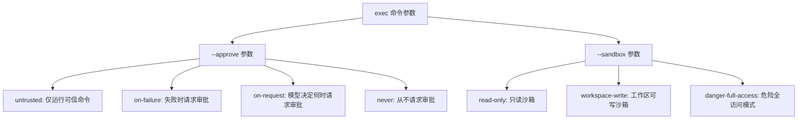
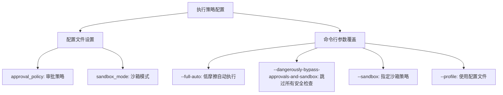
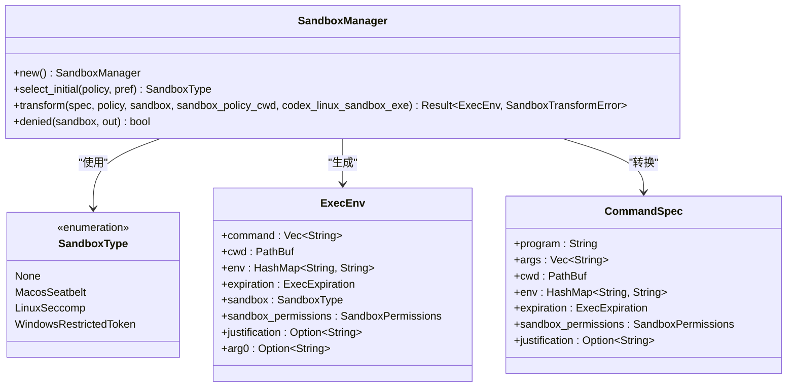
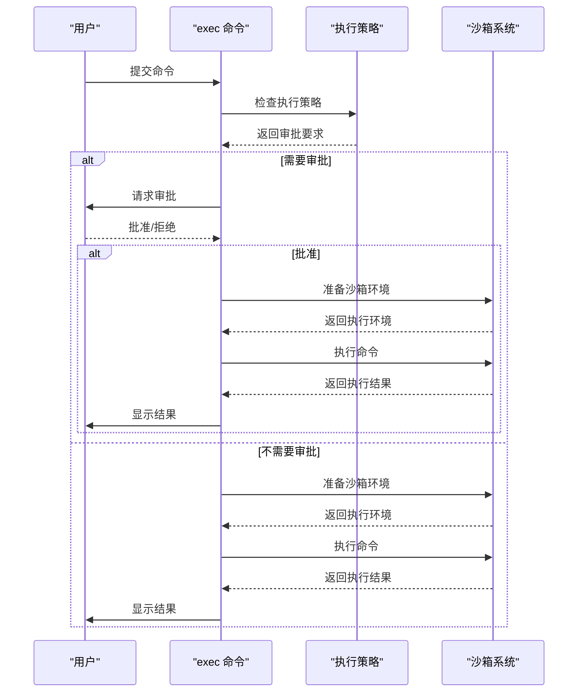
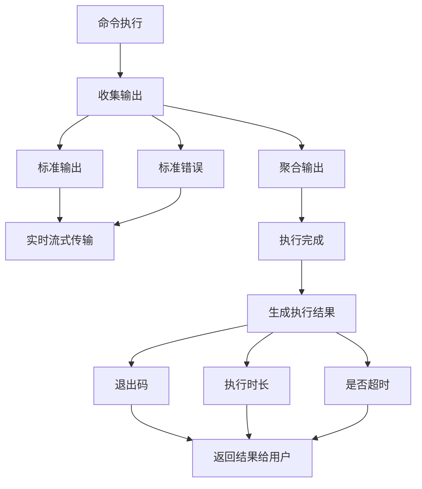
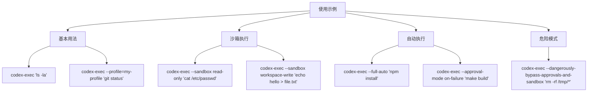
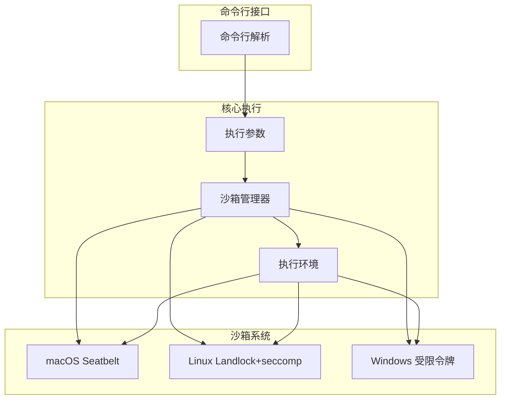

# exec 命令

<cite>
**本文档引用的文件**   
- [cli.rs](file://codex-rs/exec/src/cli.rs)
- [lib.rs](file://codex-rs/exec/src/lib.rs)
- [main.rs](file://codex-rs/exec/src/main.rs)
- [exec.rs](file://codex-rs/core/src/exec.rs)
- [sandboxing/mod.rs](file://codex-rs/core/src/sandboxing/mod.rs)
- [exec_policy.rs](file://codex-rs/core/src/exec_policy.rs)
- [unified_exec/mod.rs](file://codex-rs/core/src/unified_exec/mod.rs)
- [shell.rs](file://codex-rs/core/src/tools/runtimes/shell.rs)
- [sandbox_mode_cli_arg.rs](file://codex-rs/common/src/sandbox_mode_cli_arg.rs)
- [approval_mode_cli_arg.rs](file://codex-rs/common/src/approval_mode_cli_arg.rs)
</cite>

## 目录
1. [简介](#简介)
2. [核心功能](#核心功能)
3. [参数详解](#参数详解)
4. [执行策略配置](#执行策略配置)
5. [沙箱系统集成](#沙箱系统集成)
6. [命令审批机制](#命令审批机制)
7. [结果反馈机制](#结果反馈机制)
8. [使用示例](#使用示例)
9. [架构概述](#架构概述)
10. [结论](#结论)

## 简介
`exec` 命令是 Codex 系统中用于安全执行用户指令或自动化任务的核心组件。该命令通过严格的命令审批、沙箱执行和结果反馈机制，确保在受控环境中安全地运行 shell 命令。`exec` 命令的设计旨在平衡自动化效率与系统安全性，为用户提供一个既强大又安全的执行环境。

**Section sources**
- [lib.rs](file://codex-rs/exec/src/lib.rs#L1-L649)
- [main.rs](file://codex-rs/exec/src/main.rs#L1-L41)

## 核心功能
`exec` 命令的核心功能是安全地执行用户提供的指令或自动化任务。它通过三个主要机制实现这一目标：命令审批、沙箱执行和结果反馈。命令审批机制确保只有经过验证的命令才能被执行；沙箱执行机制在隔离环境中运行命令，防止对主系统造成意外影响；结果反馈机制则提供详细的执行结果，便于用户了解命令执行情况。

**Section sources**
- [exec.rs](file://codex-rs/core/src/exec.rs#L1-L966)
- [unified_exec/mod.rs](file://codex-rs/core/src/unified_exec/mod.rs#L1-L479)

## 参数详解
`exec` 命令提供了多个参数来控制其行为，其中最重要的两个参数是 `--approve` 和 `--sandbox`。

`--approve` 参数用于控制命令审批策略。它有四种模式：`untrusted`（仅运行可信命令）、`on-failure`（失败时请求审批）、`on-request`（由模型决定何时请求审批）和 `never`（从不请求审批）。这些模式允许用户根据安全需求调整审批严格程度。

`--sandbox` 参数用于指定沙箱策略，有三种模式：`read-only`（只读沙箱）、`workspace-write`（工作区可写沙箱）和 `danger-full-access`（危险全访问模式）。这些模式定义了命令在执行时对文件系统的访问权限。

**Diagram sources**
- [cli.rs](file://codex-rs/exec/src/cli.rs#L1-L158)
- [sandbox_mode_cli_arg.rs](file://codex-rs/common/src/sandbox_mode_cli_arg.rs#L1-L29)
- [approval_mode_cli_arg.rs](file://codex-rs/common/src/approval_mode_cli_arg.rs#L1-L39)

## 执行策略配置
执行策略配置是 `exec` 命令的重要组成部分，它决定了命令的执行方式和安全级别。执行策略主要通过配置文件和命令行参数进行设置。配置文件中的 `approval_policy` 和 `sandbox_mode` 字段定义了默认的审批策略和沙箱模式。

当用户通过命令行参数覆盖这些设置时，系统会优先使用命令行参数。例如，使用 `--full-auto` 参数会自动设置低摩擦的沙箱化自动执行模式（等同于 `-a on-request` 和 `--sandbox workspace-write`），而 `--dangerously-bypass-approvals-and-sandbox` 参数则会跳过所有确认提示并以无沙箱方式执行命令，这在外部沙箱环境中使用时非常危险。

**Diagram sources**
- [lib.rs](file://codex-rs/exec/src/lib.rs#L69-L464)
- [config/mod.rs](file://codex-rs/core/src/config/mod.rs#L993-L1024)

## 沙箱系统集成
`exec` 命令与沙箱系统的集成是其安全性的关键。系统根据平台类型选择不同的沙箱技术：在 macOS 上使用 Seatbelt，在 Linux 上使用 Landlock + seccomp，在 Windows 上使用受限令牌。`SandboxManager` 负责管理这些沙箱技术的选择和配置。

当执行命令时，`SandboxManager` 会根据当前的沙箱策略和平台类型选择合适的沙箱类型。对于 `DangerFullAccess` 策略，系统不使用任何沙箱；对于其他策略，系统会根据平台选择相应的沙箱技术。沙箱配置包括文件系统访问权限、网络访问控制等，确保命令在受限环境中执行。

**Diagram sources**
- [sandboxing/mod.rs](file://codex-rs/core/src/sandboxing/mod.rs#L1-L179)
- [exec.rs](file://codex-rs/core/src/exec.rs#L53-L800)

## 命令审批机制
命令审批机制是 `exec` 命令安全性的另一重要组成部分。系统通过 `create_exec_approval_requirement_for_command` 函数来确定是否需要用户审批。该函数结合执行策略、功能标志、命令内容、审批策略、沙箱策略和沙箱权限来决定审批要求。

审批决策基于多个因素：命令是否在已知安全命令列表中、执行策略模式、沙箱策略和命令的潜在危险性。对于多命令脚本，系统会分析脚本内容并可能建议执行策略修正。如果命令被策略规则明确禁止，则直接拒绝执行；如果需要审批，则会向用户请求批准。

**Diagram sources**
- [exec_policy.rs](file://codex-rs/core/src/exec_policy.rs#L209-L809)
- [is_dangerous_command.rs](file://codex-rs/core/src/command_safety/is_dangerous_command.rs#L1-L39)

## 结果反馈机制
`exec` 命令的结果反馈机制提供了详细的执行信息，包括退出码、标准输出、标准错误和聚合输出。系统通过 `ExecToolCallOutput` 结构体来封装这些信息，并在执行完成后返回给用户。

对于长时间运行的命令，系统会通过 `ExecCommandOutputDeltaEvent` 事件实时流式传输输出，确保用户能够及时了解命令执行进度。如果命令超时或被中断，系统会相应地设置退出码和超时标志，以便用户识别执行状态。

**Diagram sources**
- [exec.rs](file://codex-rs/core/src/exec.rs#L494-L515)
- [exec.rs](file://codex-rs/core/src/exec.rs#L679-L732)

## 使用示例
以下是一些 `exec` 命令的使用示例，展示了如何在受控环境中运行 shell 命令：

**Diagram sources**
- [lib.rs](file://codex-rs/exec/src/lib.rs#L69-L464)
- [cli.rs](file://codex-rs/exec/src/cli.rs#L1-L158)

## 架构概述
`exec` 命令的架构由多个组件协同工作，包括命令行接口、执行参数、沙箱管理器和执行环境。命令行接口负责解析用户输入，执行参数封装了命令执行所需的所有信息，沙箱管理器负责创建和管理沙箱环境，执行环境则包含了实际执行命令所需的所有配置。

**Diagram sources**
- [lib.rs](file://codex-rs/exec/src/lib.rs#L1-L649)
- [exec.rs](file://codex-rs/core/src/exec.rs#L1-L966)
- [sandboxing/mod.rs](file://codex-rs/core/src/sandboxing/mod.rs#L1-L179)

## 结论
`exec` 命令通过其完善的命令审批、沙箱执行和结果反馈机制，为用户提供了一个安全可靠的命令执行环境。其灵活的参数配置和强大的执行策略使得用户能够在不同安全级别下执行各种任务。通过与沙箱系统的深度集成，`exec` 命令确保了即使在执行潜在危险命令时也能最大限度地保护系统安全。