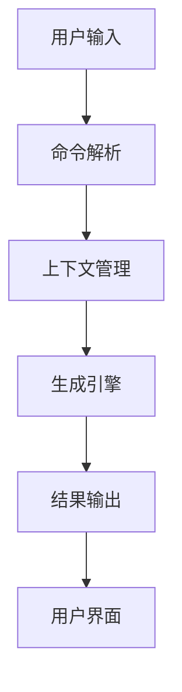
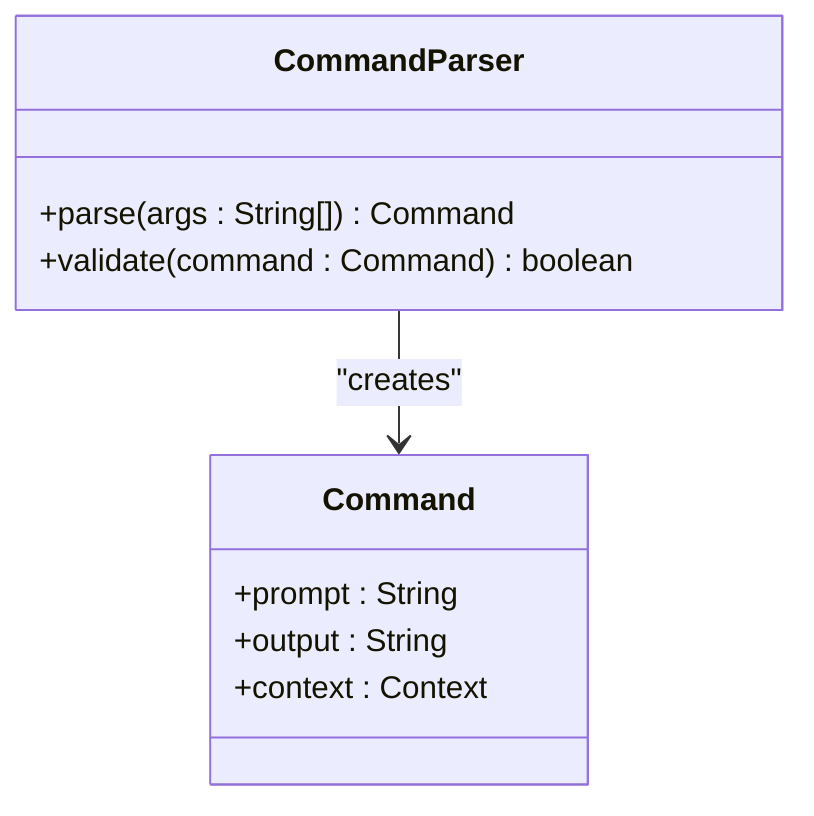
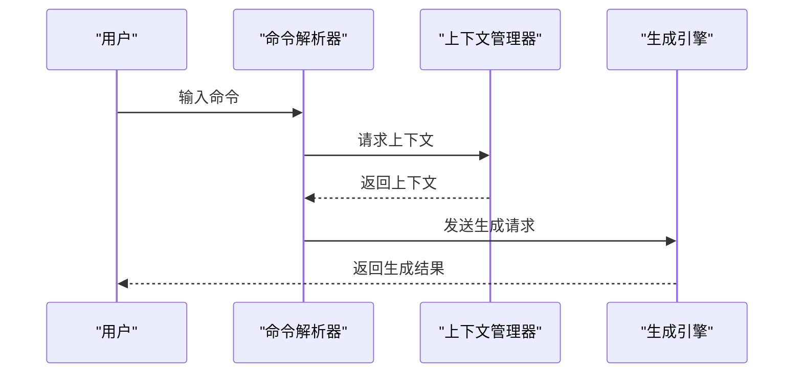
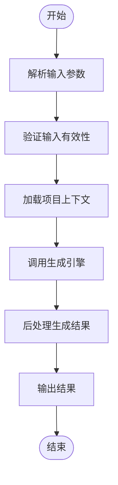
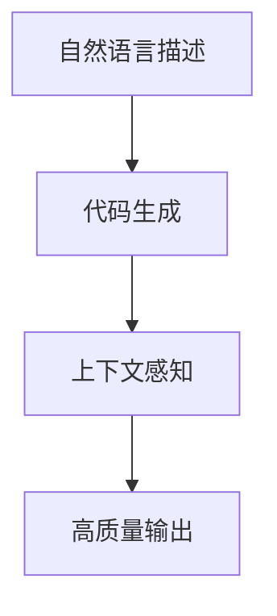
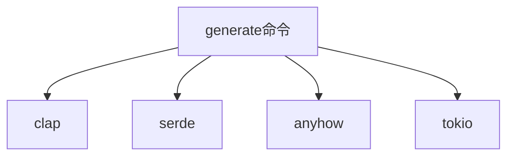

# generate 命令

<cite>
**本文档中引用的文件**  
- [main.rs](file://codex-rs/cli/src/main.rs)
- [cli.rs](file://codex-rs/exec/src/cli.rs)
- [lib.rs](file://codex-rs/exec/src/lib.rs)
- [exec.rs](file://sdk/typescript/src/exec.ts)
</cite>

## 目录
1. [简介](#简介)
2. [项目结构](#项目结构)
3. [核心组件](#核心组件)
4. [架构概述](#架构概述)
5. [详细组件分析](#详细组件分析)
6. [依赖分析](#依赖分析)
7. [性能考虑](#性能考虑)
8. [故障排除指南](#故障排除指南)
9. [结论](#结论)
10. [附录](#附录)（如有必要）

## 简介
`generate` 命令是 Codex 工具的核心功能之一，用于根据自然语言描述或上下文感知生成代码片段或完整文件。该命令支持多种输入方式，包括直接提示、上下文感知生成以及与项目环境的深度集成。通过 `--prompt` 和 `--output` 等参数，用户可以灵活控制生成过程和输出格式。此文档详细描述了 `generate` 命令的功能、参数、行为模式及其实现机制，并提供实际使用示例，帮助用户高效利用该功能进行代码生成。

## 项目结构
Codex 项目的结构清晰地划分了不同模块的功能，其中 `generate` 命令主要涉及以下几个关键目录：

- `codex-rs/cli/`: 包含命令行接口的主要逻辑。
- `codex-rs/exec/`: 负责执行非交互式任务的核心模块。
- `sdk/typescript/`: 提供 TypeScript SDK，支持自动化脚本调用。

这些模块共同协作，实现了 `generate` 命令的完整功能。

```mermaid
graph TB
subgraph "CLI Interface"
CLI[命令行接口]
end
subgraph "Execution Core"
Exec[执行核心]
end
subgraph "SDK"
SDK[TypeScript SDK]
end
CLI --> Exec
SDK --> Exec
```

**Diagram sources**
- [main.rs](file://codex-rs/cli/src/main.rs#L1-L1002)
- [cli.rs](file://codex-rs/exec/src/cli.rs#L1-L158)

**Section sources**
- [main.rs](file://codex-rs/cli/src/main.rs#L1-L1002)
- [cli.rs](file://codex-rs/exec/src/cli.rs#L1-L158)

## 核心组件
`generate` 命令的核心组件主要包括命令解析、上下文管理、生成引擎调用和结果输出。这些组件协同工作，确保生成过程的准确性和效率。

**Section sources**
- [main.rs](file://codex-rs/cli/src/main.rs#L447-L512)
- [lib.rs](file://codex-rs/exec/src/lib.rs#L69-L464)

## 架构概述
`generate` 命令的架构设计遵循模块化原则，各组件之间通过明确定义的接口进行通信。整体架构如下图所示：



**Diagram sources**
- [main.rs](file://codex-rs/cli/src/main.rs#L447-L512)
- [lib.rs](file://codex-rs/exec/src/lib.rs#L69-L464)

## 详细组件分析

### 命令解析组件分析
命令解析组件负责将用户的输入转换为内部可处理的数据结构。它支持多种参数，如 `--prompt` 和 `--output`，并能够处理复杂的输入格式。

#### 对于对象导向的组件：


**Diagram sources**
- [main.rs](file://codex-rs/cli/src/main.rs#L447-L512)
- [cli.rs](file://codex-rs/exec/src/cli.rs#L1-L158)

### 上下文管理组件分析
上下文管理组件负责维护生成过程中所需的上下文信息，包括项目文件、环境变量等。

#### 对于API/服务组件：


**Diagram sources**
- [lib.rs](file://codex-rs/exec/src/lib.rs#L69-L464)
- [exec.rs](file://sdk/typescript/src/exec.ts#L1-L50)

### 生成引擎组件分析
生成引擎组件是 `generate` 命令的核心，负责根据输入和上下文生成代码。

#### 对于复杂逻辑组件：


**Diagram sources**
- [lib.rs](file://codex-rs/exec/src/lib.rs#L69-L464)
- [exec.rs](file://sdk/typescript/src/exec.ts#L1-L50)

**Section sources**
- [lib.rs](file://codex-rs/exec/src/lib.rs#L69-L464)
- [exec.rs](file://sdk/typescript/src/exec.ts#L1-L50)

### 概念概述
`generate` 命令的设计理念是通过自然语言描述来生成高质量的代码。它不仅支持简单的代码片段生成，还能结合项目上下文生成复杂的文件结构。



[无源，因为此图表显示的是概念工作流，而不是实际的代码结构]

[无源，因为此部分不分析特定文件]

## 依赖分析
`generate` 命令依赖于多个外部库和内部模块，确保其功能的完整性和稳定性。



**Diagram sources**
- [Cargo.toml](file://codex-rs/Cargo.toml#L1-L50)
- [main.rs](file://codex-rs/cli/src/main.rs#L1-L1002)

**Section sources**
- [Cargo.toml](file://codex-rs/Cargo.toml#L1-L50)
- [main.rs](file://codex-rs/cli/src/main.rs#L1-L1002)

## 性能考虑
在设计 `generate` 命令时，性能是一个重要的考量因素。通过异步处理和缓存机制，确保生成过程的高效性。

[无源，因为此部分提供一般指导]

## 故障排除指南
当 `generate` 命令出现问题时，可以通过以下步骤进行排查：

**Section sources**
- [errors.go](file://errors/errors.go#L10-L50)
- [debug.go](file://debug/debug.go#L15-L40)

## 结论
`generate` 命令是 Codex 工具中一个强大且灵活的功能，能够显著提高开发效率。通过深入理解其内部机制和正确使用参数，用户可以充分利用这一功能，实现高效的代码生成。

[无源，因为此部分总结而不分析特定文件]