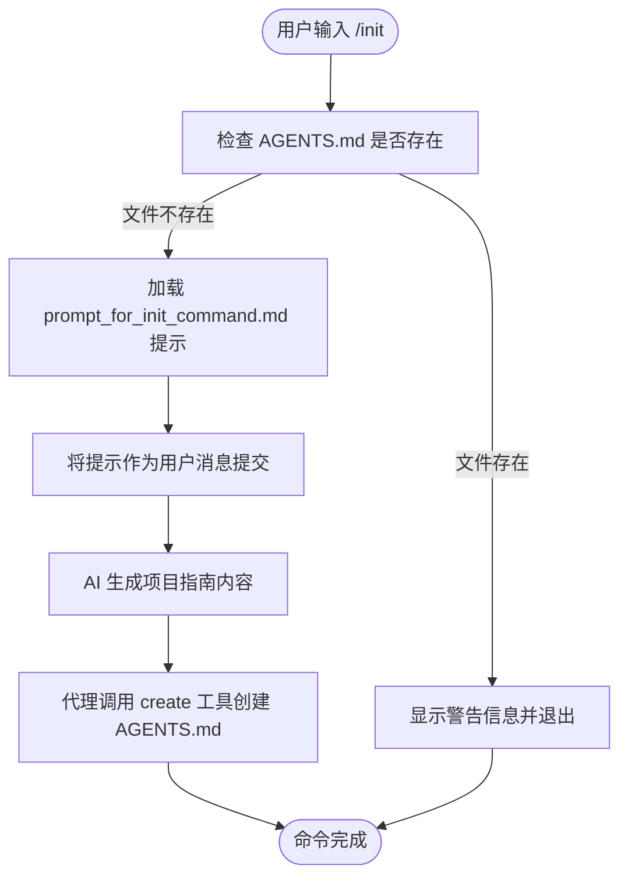
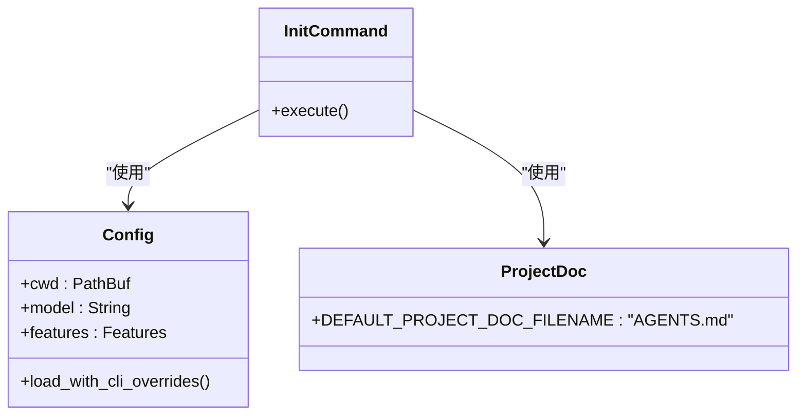

# init 命令

<cite>
**本文档中引用的文件**  
- [main.rs](file://codex-rs/cli/src/main.rs)
- [config.rs](file://codex-rs/core/src/config/mod.rs)
- [chatwidget.rs](file://codex-rs/tui/src/chatwidget.rs)
- [chatwidget.rs](file://codex-rs/tui2/src/chatwidget.rs)
- [slash_command.rs](file://codex-rs/tui/src/slash_command.rs)
- [slash_command.rs](file://codex-rs/tui2/src/slash_command.rs)
- [prompt_for_init_command.md](file://codex-rs/tui/prompt_for_init_command.md)
- [prompt_for_init_command.md](file://codex-rs/tui2/prompt_for_init_command.md)
- [project_doc.rs](file://codex-rs/core/src/project_doc.rs)
</cite>

## 目录
1. [简介](#简介)
2. [命令语法与选项](#命令语法与选项)
3. [核心功能与交互逻辑](#核心功能与交互逻辑)
4. [使用示例](#使用示例)
5. [与配置模块的交互](#与配置模块的交互)

## 简介
`init` 命令是 Codex 工具中的一个核心功能，旨在帮助用户快速为新项目初始化配置和环境设置。该命令通过生成一个名为 `AGENTS.md` 的项目指南文件，为 Codex 代理提供关于项目结构、开发规范和操作流程的详细指导。此功能特别适用于新项目启动阶段，确保 AI 代理能够遵循项目特定的约定和最佳实践。

`init` 命令并非一个独立的 CLI 子命令，而是作为交互式 TUI（文本用户界面）中的一个斜杠命令（`/init`）被调用。当用户在交互式会话中输入 `/init` 时，Codex 会检查当前工作目录下是否已存在 `AGENTS.md` 文件，以避免覆盖现有配置。如果文件不存在，它将自动提交一个预定义的提示（prompt），指示 AI 生成一份结构化的项目指南。

**Section sources**
- [chatwidget.rs](file://codex-rs/tui/src/chatwidget.rs#L1546-L1557)
- [chatwidget.rs](file://codex-rs/tui2/src/chatwidget.rs#L1546-L1557)
- [slash_command.rs](file://codex-rs/tui/src/slash_command.rs#L21)
- [slash_command.rs](file://codex-rs/tui2/src/slash_command.rs#L21)

## 命令语法与选项
`init` 命令在 Codex 的交互式环境中通过斜杠命令语法调用，其基本形式如下：

```
/init
```

该命令目前不接受任何命令行选项（如 `--model` 或 `--config-path`）。其行为完全由当前的运行时环境和配置决定：

- **当前工作目录 (CWD)**: `init` 命令的目标路径由 `config.cwd` 决定，即当前会话的工作目录。
- **配置文件**: 命令的执行逻辑和生成的 `AGENTS.md` 文件内容受全局配置文件 `~/.codex/config.toml` 的影响，但 `init` 命令本身不提供用于覆盖配置的选项。
- **模型选择**: 生成 `AGENTS.md` 文件所使用的模型由当前会话的 `config.model` 决定，该值可能来自配置文件、环境变量或会话启动时的参数。

**Section sources**
- [chatwidget.rs](file://codex-rs/tui/src/chatwidget.rs#L1547)
- [chatwidget.rs](file://codex-rs/tui2/src/chatwidget.rs#L1547)
- [config.rs](file://codex-rs/core/src/config/mod.rs#L177)

## 核心功能与交互逻辑
`init` 命令的实现逻辑简洁而高效，其核心交互流程如下：

1.  **路径解析**: 命令首先通过 `config.cwd` 获取当前工作目录，并使用 `DEFAULT_PROJECT_DOC_FILENAME`（即 `AGENTS.md`）构建目标文件的完整路径。
2.  **存在性检查**: 在执行任何操作前，`init` 命令会检查目标路径 `AGENTS.md` 是否已存在。如果文件存在，命令会立即终止，并向用户显示一条信息性消息，提示“`AGENTS.md` 已存在，跳过 `/init` 以避免覆盖”，从而保护用户的现有配置。
3.  **提交生成请求**: 如果 `AGENTS.md` 文件不存在，`init` 命令会将一个名为 `prompt_for_init_command.md` 的预定义提示作为用户消息提交给 AI 模型。这个提示文件包含了生成项目指南的具体要求，如文档标题、推荐章节（项目结构、构建命令、编码规范等）和格式要求。
4.  **AI 生成**: AI 模型接收到提示后，会分析当前项目环境（如文件结构、Git 仓库状态等），并根据提示中的要求生成一份完整的 `AGENTS.md` 文件内容。
5.  **文件创建**: Codex 代理会使用 `create` 工具调用，在指定的路径下创建 `AGENTS.md` 文件，并将 AI 生成的内容写入其中。

此流程确保了 `init` 命令既能自动化地创建项目文档，又能安全地避免对已有文件造成意外覆盖。



**Diagram sources **
- [chatwidget.rs](file://codex-rs/tui/src/chatwidget.rs#L1547-L1556)
- [prompt_for_init_command.md](file://codex-rs/tui/prompt_for_init_command.md)
- [project_doc.rs](file://codex-rs/core/src/project_doc.rs#L26)

**Section sources**
- [chatwidget.rs](file://codex-rs/tui/src/chatwidget.rs#L1546-L1557)
- [chatwidget.rs](file://codex-rs/tui2/src/chatwidget.rs#L1546-L1557)

## 使用示例
在新项目中使用 `codex init` 进行快速启动的步骤如下：

1.  **启动交互式会话**: 在您的项目根目录下，通过终端启动 Codex 的交互式模式。
    ```bash
    codex
    ```

2.  **调用 init 命令**: 在交互式提示符下，输入 `/init` 并回车。
    ```
    > /init
    ```

3.  **等待生成**: Codex 会自动执行上述流程。您将在会话中看到 AI 代理分析项目并生成 `AGENTS.md` 文件的全过程。

4.  **查看结果**: 命令执行完成后，您可以在项目根目录下找到新生成的 `AGENTS.md` 文件。该文件将包含一个结构化的项目指南，例如：
    ```markdown
    # Repository Guidelines

    ## Project Structure & Module Organization
    - 项目源代码位于 `src/` 目录。
    - 测试文件位于 `tests/` 目录。

    ## Build, Test, and Development Commands
    - 构建项目: `make build`
    - 运行测试: `npm test`
    ```

如果项目中已存在 `AGENTS.md` 文件，您将看到如下提示：
> AGENTS.md already exists here. Skipping /init to avoid overwriting it.

**Section sources**
- [prompt_for_init_command.md](file://codex-rs/tui/prompt_for_init_command.md)
- [chatwidget.rs](file://codex-rs/tui/src/chatwidget.rs#L1549-L1552)

## 与配置模块的交互
`init` 命令与 Codex 的核心配置模块 `codex_core::config` 紧密交互，主要体现在以下几个方面：

- **工作目录 (cwd)**: 命令通过 `self.config.cwd` 获取当前会话的工作目录，这是确定 `AGENTS.md` 文件存放位置的基础。该值由 `Config` 结构体管理，并在会话启动时根据配置文件和命令行参数初始化。
- **配置文件名**: 命令使用 `DEFAULT_PROJECT_DOC_FILENAME` 常量来指定要创建的文件名。此常量在 `project_doc.rs` 模块中定义，是配置系统的一部分。
- **配置加载**: 虽然 `init` 命令本身不直接读取 `config.toml` 文件，但它所依赖的 `config` 对象是通过 `Config::load_with_cli_overrides()` 等方法从配置文件加载并解析后得到的。这意味着 `init` 命令的上下文（如工作目录）完全由配置模块的加载逻辑决定。



**Diagram sources **
- [config.rs](file://codex-rs/core/src/config/mod.rs#L87)
- [project_doc.rs](file://codex-rs/core/src/project_doc.rs#L26)
- [chatwidget.rs](file://codex-rs/tui/src/chatwidget.rs#L1547)

**Section sources**
- [config.rs](file://codex-rs/core/src/config/mod.rs)
- [project_doc.rs](file://codex-rs/core/src/project_doc.rs)