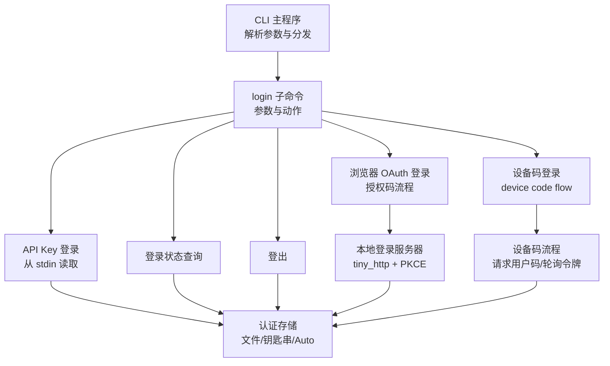
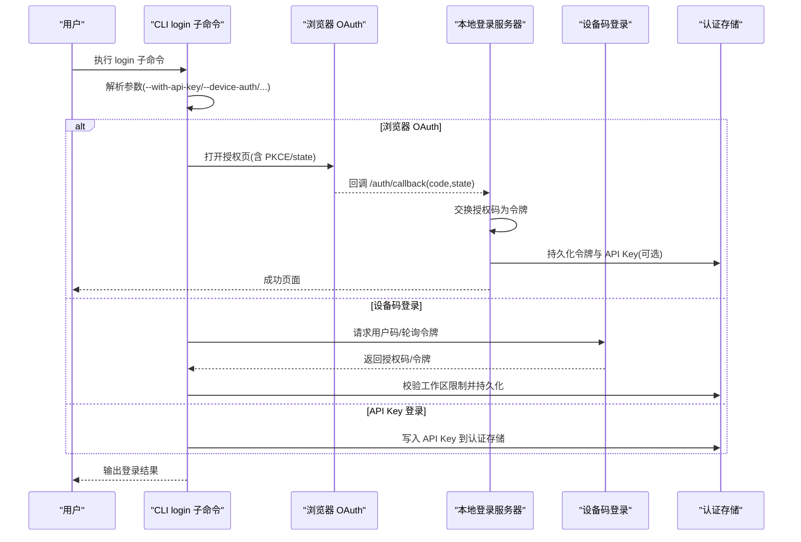
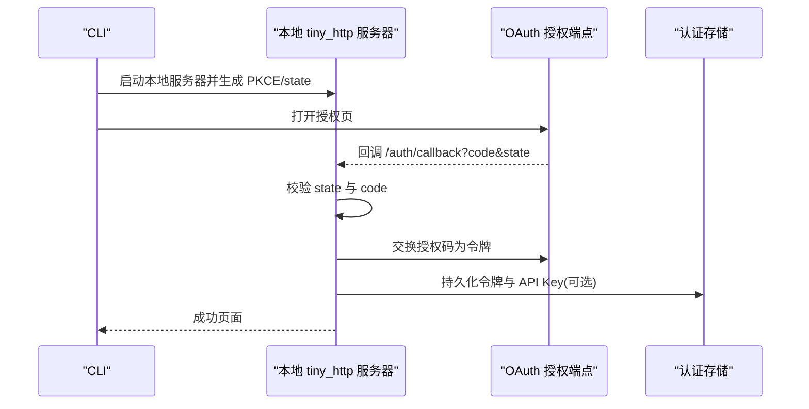
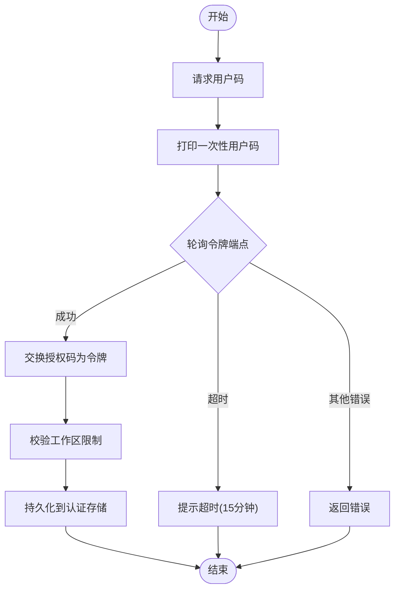
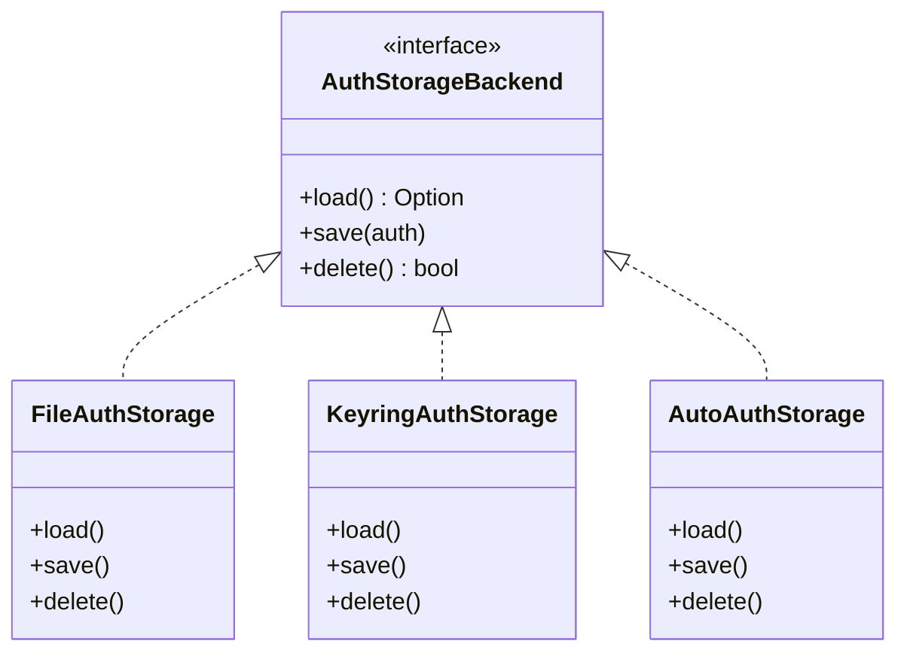
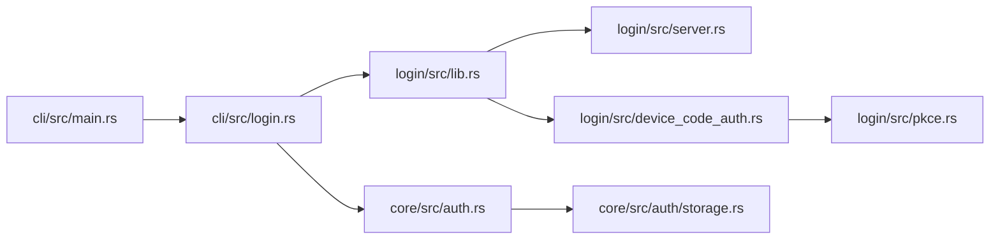

# login 命令

<cite>
**本文引用的文件**
- [cli/src/main.rs](file://codex-rs/cli/src/main.rs)
- [cli/src/login.rs](file://codex-rs/cli/src/login.rs)
- [login/src/lib.rs](file://codex-rs/login/src/lib.rs)
- [login/src/server.rs](file://codex-rs/login/src/server.rs)
- [login/src/device_code_auth.rs](file://codex-rs/login/src/device_code_auth.rs)
- [login/src/pkce.rs](file://codex-rs/login/src/pkce.rs)
- [core/src/auth.rs](file://codex-rs/core/src/auth.rs)
- [core/src/auth/storage.rs](file://codex-rs/core/src/auth/storage.rs)
- [core/src/config/types.rs](file://codex-rs/core/src/config/types.rs)
- [login/tests/suite/device_code_login.rs](file://codex-rs/login/tests/suite/device_code_login.rs)
- [login/tests/suite/login_server_e2e.rs](file://codex-rs/login/tests/suite/login_server_e2e.rs)
</cite>

## 目录
1. [简介](#简介)
2. [项目结构](#项目结构)
3. [核心组件](#核心组件)
4. [架构总览](#架构总览)
5. [详细组件分析](#详细组件分析)
6. [依赖关系分析](#依赖关系分析)
7. [性能考量](#性能考量)
8. [故障排查指南](#故障排查指南)
9. [结论](#结论)
10. [附录：使用示例与最佳实践](#附录使用示例与最佳实践)

## 简介
本文件系统化梳理 codex CLI 中的 login 子命令，重点说明其支持的身份认证与会话管理能力，包括：
- 浏览器 OAuth 登录（授权码流程）
- 设备码认证流程（device code flow）
- 认证状态查询与登出
- 支持的选项与行为（如 --with-api-key、--device-auth、--experimental_issuer、--experimental_client-id）
- 与内部认证存储模块的交互方式（文件/钥匙串/Auto 模式）

同时给出典型使用场景与排障建议，帮助用户在受限环境或无浏览器环境下完成登录。

## 项目结构
login 子命令由 CLI 层负责解析参数与分发，具体登录逻辑分布在 login 包与 core 包中：
- CLI 参数解析与子命令分发：codex-rs/cli/src/main.rs
- 登录入口与状态/登出逻辑：codex-rs/cli/src/login.rs
- OAuth 登录服务器与回调处理：codex-rs/login/src/server.rs
- 设备码登录流程：codex-rs/login/src/device_code_auth.rs
- PKCE 工具：codex-rs/login/src/pkce.rs
- 认证存储与策略：codex-rs/core/src/auth.rs、core/src/auth/storage.rs
- 配置类型定义（含强制登录方法与工作区限制）：codex-rs/core/src/config/types.rs

图表来源
- [cli/src/main.rs](file://codex-rs/cli/src/main.rs#L194-L240)
- [cli/src/login.rs](file://codex-rs/cli/src/login.rs#L1-L248)
- [login/src/server.rs](file://codex-rs/login/src/server.rs#L1-L200)
- [login/src/device_code_auth.rs](file://codex-rs/login/src/device_code_auth.rs#L1-L203)
- [core/src/auth.rs](file://codex-rs/core/src/auth.rs#L309-L345)
- [core/src/auth/storage.rs](file://codex-rs/core/src/auth/storage.rs#L191-L279)

章节来源
- [cli/src/main.rs](file://codex-rs/cli/src/main.rs#L194-L240)
- [cli/src/login.rs](file://codex-rs/cli/src/login.rs#L1-L248)

## 核心组件
- CLI 登录子命令与参数
  - --with-api-key：从标准输入读取 API Key 并进行 API Key 登录
  - --device-auth：启用设备码登录流程
  - --experimental_issuer：覆盖 OAuth Issuer 基础地址（高级用法）
  - --experimental_client-id：覆盖 OAuth Client ID（高级用法）
  - Status 子命令：查询当前登录状态
- 浏览器 OAuth 登录（授权码流程）
  - 启动本地 tiny_http 服务器，生成 PKCE 与 state，打开浏览器访问授权端点
  - 处理 /auth/callback 回调，交换令牌，持久化到认证存储
- 设备码登录（device code flow）
  - 请求用户码与轮询间隔
  - 轮询令牌端点直到授权或超时
  - 交换授权码为令牌，校验工作区限制，持久化
- 认证存储
  - 支持 File/Keyring/Auto 三种模式，自动回退与兼容
  - 保存 API Key 或 OAuth 令牌，以及账户信息与刷新时间

章节来源
- [cli/src/main.rs](file://codex-rs/cli/src/main.rs#L194-L240)
- [cli/src/login.rs](file://codex-rs/cli/src/login.rs#L1-L248)
- [login/src/server.rs](file://codex-rs/login/src/server.rs#L1-L200)
- [login/src/device_code_auth.rs](file://codex-rs/login/src/device_code_auth.rs#L1-L203)
- [core/src/auth/storage.rs](file://codex-rs/core/src/auth/storage.rs#L191-L279)

## 架构总览
下图展示了 login 子命令在 CLI、登录服务器、设备码流程与认证存储之间的交互关系。

图表来源
- [cli/src/main.rs](file://codex-rs/cli/src/main.rs#L511-L541)
- [cli/src/login.rs](file://codex-rs/cli/src/login.rs#L1-L248)
- [login/src/server.rs](file://codex-rs/login/src/server.rs#L1-L200)
- [login/src/device_code_auth.rs](file://codex-rs/login/src/device_code_auth.rs#L1-L203)
- [core/src/auth.rs](file://codex-rs/core/src/auth.rs#L309-L345)

## 详细组件分析

### CLI 登录子命令与参数
- 参数与动作
  - --with-api-key：从 stdin 读取 API Key，调用 API Key 登录流程
  - --device-auth：启用设备码登录流程
  - --experimental_issuer/--experimental_client-id：覆盖 OAuth Issuer 与 Client ID（高级）
  - Status 子命令：查询当前登录状态（API Key 或 ChatGPT）
  - Logout：删除认证存储中的凭据
- 行为约束
  - 若配置强制登录方式为 API，则禁止使用 ChatGPT 登录；反之亦然
  - 可通过配置强制工作区（workspace），登录后会校验账户标识

章节来源
- [cli/src/main.rs](file://codex-rs/cli/src/main.rs#L194-L240)
- [cli/src/main.rs](file://codex-rs/cli/src/main.rs#L511-L541)
- [cli/src/login.rs](file://codex-rs/cli/src/login.rs#L1-L248)
- [core/src/auth.rs](file://codex-rs/core/src/auth.rs#L346-L417)

### 浏览器 OAuth 登录（授权码流程）
- 关键步骤
  - 生成 PKCE 与 state，构建授权 URL 并打开浏览器
  - 本地 tiny_http 服务器监听 /auth/callback，校验 state 与 code
  - 交换授权码为令牌，尝试换取 API Key，持久化到认证存储
  - 根据配置检查工作区限制，必要时拒绝并提示
- 安全要点
  - 使用 PKCE 防止授权码被窃取
  - 校验 state 防止 CSRF
  - 严格校验回调参数完整性

图表来源
- [login/src/server.rs](file://codex-rs/login/src/server.rs#L1-L200)
- [login/src/server.rs](file://codex-rs/login/src/server.rs#L200-L379)
- [login/src/server.rs](file://codex-rs/login/src/server.rs#L380-L620)
- [login/src/pkce.rs](file://codex-rs/login/src/pkce.rs#L1-L28)

章节来源
- [login/src/server.rs](file://codex-rs/login/src/server.rs#L1-L200)
- [login/src/server.rs](file://codex-rs/login/src/server.rs#L200-L379)
- [login/src/server.rs](file://codex-rs/login/src/server.rs#L380-L620)
- [login/src/pkce.rs](file://codex-rs/login/src/pkce.rs#L1-L28)

### 设备码登录（device code flow）
- 关键步骤
  - 请求用户码与轮询间隔
  - 在 15 分钟内按间隔轮询令牌端点，直到授权或超时
  - 交换授权码为令牌，校验工作区限制，持久化到认证存储
- 错误处理
  - 未启用设备码登录时返回明确错误
  - 轮询 FORBIDDEN/NOT_FOUND 且超时则提示超时
  - 其他失败返回相应状态错误

图表来源
- [login/src/device_code_auth.rs](file://codex-rs/login/src/device_code_auth.rs#L1-L203)

章节来源
- [login/src/device_code_auth.rs](file://codex-rs/login/src/device_code_auth.rs#L1-L203)
- [login/tests/suite/device_code_login.rs](file://codex-rs/login/tests/suite/device_code_login.rs#L1-L318)

### 认证存储与持久化
- 存储模式
  - File：直接写入 ~/.codex/auth.json
  - Keyring：使用系统钥匙串存储，失败时保留文件回退
  - Auto：优先钥匙串，失败回退文件
- 持久化内容
  - API Key 或 OAuth 令牌（id_token/access_token/refresh_token）
  - 账户标识与最后刷新时间
- 读取与更新
  - 加载时优先 API Key，否则使用 OAuth 令牌
  - 刷新令牌时更新存储并记录时间戳

图表来源
- [core/src/auth/storage.rs](file://codex-rs/core/src/auth/storage.rs#L191-L279)

章节来源
- [core/src/auth/storage.rs](file://codex-rs/core/src/auth/storage.rs#L191-L279)
- [core/src/auth.rs](file://codex-rs/core/src/auth.rs#L309-L345)

### 强制登录方式与工作区限制
- 强制登录方式
  - 当配置强制 API Key 登录时，若当前为 ChatGPT 登录则拒绝并提示
  - 当配置强制 ChatGPT 登录时，若当前为 API Key 登录则拒绝并提示
- 工作区限制
  - 若配置了强制工作区 ID，登录后会校验账户标识是否匹配
  - 不匹配则登出并提示

章节来源
- [core/src/auth.rs](file://codex-rs/core/src/auth.rs#L346-L417)
- [login/tests/suite/login_server_e2e.rs](file://codex-rs/login/tests/suite/login_server_e2e.rs#L89-L129)

## 依赖关系分析
- CLI 与 login 包
  - CLI 通过 re-export 的 run_* 函数调用 login 包的具体实现
- login 包内部
  - server.rs 提供浏览器 OAuth 登录与回调处理
  - device_code_auth.rs 提供设备码登录流程
  - pkce.rs 提供 PKCE 生成工具
- 认证存储
  - core/src/auth.rs 提供 API Key 登录与存储接口
  - core/src/auth/storage.rs 提供多种存储后端与回退策略

图表来源
- [cli/src/main.rs](file://codex-rs/cli/src/main.rs#L194-L240)
- [cli/src/login.rs](file://codex-rs/cli/src/login.rs#L1-L248)
- [login/src/lib.rs](file://codex-rs/login/src/lib.rs#L1-L23)
- [core/src/auth.rs](file://codex-rs/core/src/auth.rs#L309-L345)

章节来源
- [login/src/lib.rs](file://codex-rs/login/src/lib.rs#L1-L23)
- [core/src/auth.rs](file://codex-rs/core/src/auth.rs#L309-L345)

## 性能考量
- 设备码轮询
  - 默认最大等待 15 分钟，按服务器返回的间隔轮询，避免频繁请求
- 本地服务器
  - tiny_http 简单高效，回调处理完成后立即响应并关闭连接
- 存储写入
  - 文件/钥匙串写入为同步操作，但通过异步运行时执行，避免阻塞主线程

[本节为通用指导，不涉及具体文件分析]

## 故障排查指南
- 设备码登录报错“未启用设备码”
  - 说明：服务器未启用设备码登录，需改用浏览器登录或检查 Issuer 地址
  - 参考：设备码流程对 404 的特殊处理
- 设备码登录超时
  - 说明：超过 15 分钟未授权，需重新发起登录
- 回调校验失败
  - 说明：state 不匹配或缺少授权码，检查浏览器重定向与本地服务器日志
- 工作区限制不满足
  - 说明：当前账户不在强制工作区内，将被拒绝并登出
- 钥匙串不可用
  - 说明：Auto 模式会回退到文件存储；若钥匙串写入失败，会保留文件回退

章节来源
- [login/src/device_code_auth.rs](file://codex-rs/login/src/device_code_auth.rs#L73-L88)
- [login/src/device_code_auth.rs](file://codex-rs/login/src/device_code_auth.rs#L116-L137)
- [login/src/server.rs](file://codex-rs/login/src/server.rs#L238-L260)
- [core/src/auth.rs](file://codex-rs/core/src/auth.rs#L346-L417)
- [core/src/auth/storage.rs](file://codex-rs/core/src/auth/storage.rs#L191-L279)

## 结论
login 子命令提供了灵活的认证路径：既能在有浏览器的环境中使用 OAuth 授权码流程，也能在无浏览器或受限网络环境下使用设备码登录；并通过统一的认证存储模块实现跨平台的安全凭证管理。结合配置层面的强制登录方式与工作区限制，能够满足企业级合规与安全要求。

[本节为总结性内容，不涉及具体文件分析]

## 附录：使用示例与最佳实践

- 使用浏览器 OAuth 登录
  - 正常流程：codex login
  - 强制 API Key 登录：若配置强制 API Key 登录，将被拒绝
  - 强制 ChatGPT 登录：若配置强制 ChatGPT 登录，将被拒绝
  - 参考：CLI 参数解析与登录入口
- 使用设备码登录
  - codex login --device-auth
  - 在终端打印一次性用户码，前往指定页面输入并授权
  - 超时或拒绝会提示相应错误
  - 参考：设备码流程与测试用例
- 使用 API Key 登录
  - codex login --with-api-key
  - 从标准输入读取密钥并写入认证存储
  - 注意：stdin 必须非终端或提供密钥
  - 参考：API Key 登录与存储
- 查询登录状态
  - codex login status
  - 输出当前登录模式与关键信息
- 登出
  - codex logout
  - 删除认证存储中的凭据
- 最佳实践
  - 在 CI/CD 环境中优先使用 API Key 登录
  - 企业环境建议开启强制登录方式与工作区限制
  - 使用 Auto 模式以获得钥匙串优先、文件回退的体验

章节来源
- [cli/src/main.rs](file://codex-rs/cli/src/main.rs#L511-L541)
- [cli/src/login.rs](file://codex-rs/cli/src/login.rs#L1-L248)
- [login/tests/suite/device_code_login.rs](file://codex-rs/login/tests/suite/device_code_login.rs#L1-L318)
- [login/tests/suite/login_server_e2e.rs](file://codex-rs/login/tests/suite/login_server_e2e.rs#L89-L129)