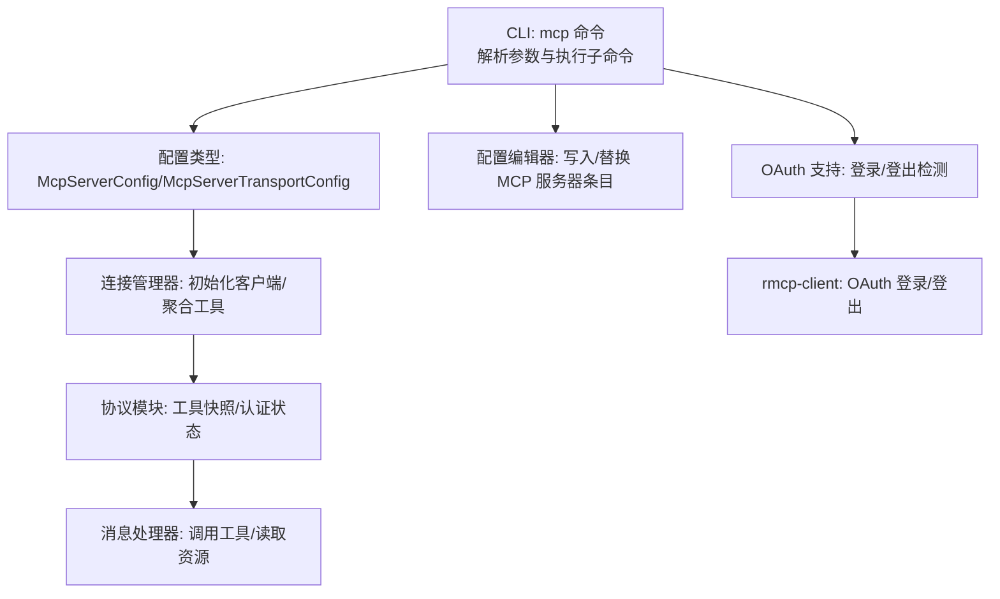
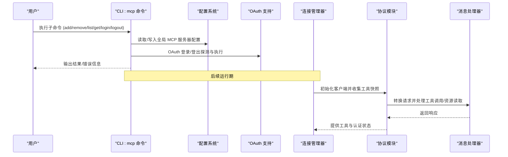
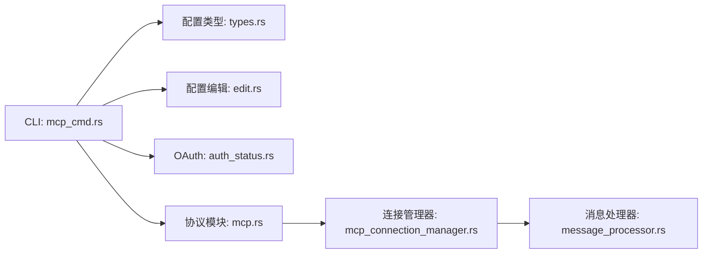

# mcp 命令

<cite>
**本文引用的文件**
- [mcp_cmd.rs](file://codex-rs/cli/src/mcp_cmd.rs)
- [types.rs](file://codex-rs/core/src/config/types.rs)
- [edit.rs](file://codex-rs/core/src/config/edit.rs)
- [mcp_connection_manager.rs](file://codex-rs/core/src/mcp_connection_manager.rs)
- [mcp.rs](file://codex-rs/core/src/mcp/mod.rs)
- [codex.rs](file://codex-rs/core/src/codex.rs)
- [message_processor.rs](file://codex-rs/mcp-server/src/message_processor.rs)
- [auth_status.rs](file://codex-rs/rmcp-client/src/auth_status.rs)
- [codex_message_processor.rs](file://codex-rs/app-server/src/codex_message_processor.rs)
- [mcp_add_remove.rs](file://codex-rs/cli/tests/mcp_add_remove.rs)
- [mcp_list.rs](file://codex-rs/cli/tests/mcp_list.rs)
</cite>

## 目录
1. [简介](#简介)
2. [项目结构](#项目结构)
3. [核心组件](#核心组件)
4. [架构总览](#架构总览)
5. [详细组件分析](#详细组件分析)
6. [依赖关系分析](#依赖关系分析)
7. [性能考虑](#性能考虑)
8. [故障排查指南](#故障排查指南)
9. [结论](#结论)
10. [附录：操作示例与最佳实践](#附录操作示例与最佳实践)

## 简介
本文件为 codex CLI 中的 mcp 命令提供完整、可操作的技术文档。mcp 命令用于管理 MCP（Model Control Protocol）服务器与工具集成，支持添加、移除、列出 MCP 服务器，以及对流式 HTTP 服务器进行 OAuth 登录/登出。它通过读取全局配置文件中的 MCP 服务器条目，将这些条目持久化到用户目录下的配置中，并在需要时与 MCP 协议模块和消息处理器交互，以实现工具发现、调用与资源访问。

## 项目结构
mcp 命令位于 CLI 子系统中，围绕配置类型、配置编辑器、连接管理器、协议模块与消息处理器协同工作：
- CLI 层：解析命令行参数，执行 add/remove/list/get/login/logout 等子命令，更新全局配置。
- 配置层：定义 MCP 服务器配置结构与序列化规则，负责从磁盘加载/写入配置。
- 连接管理层：按配置初始化 MCP 客户端，聚合工具列表与认证状态。
- 协议与消息处理层：将 MCP 请求转换为内部请求，驱动工具调用与资源读取。
- OAuth 支持：检测服务器是否支持 OAuth，执行登录/登出流程。

图表来源
- [mcp_cmd.rs](file://codex-rs/cli/src/mcp_cmd.rs#L1-L120)
- [types.rs](file://codex-rs/core/src/config/types.rs#L20-L196)
- [edit.rs](file://codex-rs/core/src/config/edit.rs#L93-L133)
- [mcp_connection_manager.rs](file://codex-rs/core/src/mcp_connection_manager.rs#L275-L310)
- [mcp.rs](file://codex-rs/core/src/mcp/mod.rs#L20-L65)
- [message_processor.rs](file://codex-rs/mcp-server/src/message_processor.rs#L39-L136)
- [auth_status.rs](file://codex-rs/rmcp-client/src/auth_status.rs#L1-L67)

章节来源
- [mcp_cmd.rs](file://codex-rs/cli/src/mcp_cmd.rs#L1-L120)
- [types.rs](file://codex-rs/core/src/config/types.rs#L20-L196)
- [edit.rs](file://codex-rs/core/src/config/edit.rs#L93-L133)

## 核心组件
- CLI 子命令与参数
  - list：列出已配置的 MCP 服务器，支持 --json 输出。
  - get：显示指定服务器的配置详情，支持 --json 输出。
  - add：添加全局 MCP 服务器条目，支持 stdio 与 streamable_http 两种传输方式。
  - remove：删除指定名称的 MCP 服务器条目。
  - login：对流式 HTTP 服务器发起 OAuth 登录（需启用 rmcp_client 特性）。
  - logout：移除存储的 OAuth 凭据（仅支持 streamable_http）。
- 配置类型
  - McpServerConfig：包含 transport、enabled、startup_timeout_sec、tool_timeout_sec、enabled_tools、disabled_tools 等字段。
  - McpServerTransportConfig：Stdio 或 StreamableHttp 二选一，分别支持命令行启动与 HTTP 流式连接。
- 配置编辑器
  - 将服务器条目序列化为 TOML 并写入全局配置文件。
- 连接管理器
  - 按配置初始化每个 MCP 客户端，聚合工具列表与认证状态，支持取消令牌与异步管理。
- 协议模块
  - 收集 MCP 快照，计算认证状态，构建统一的工具名空间。
- 消息处理器
  - 将 MCP 请求转换为内部请求，处理工具调用、资源读取等。
- OAuth 支持
  - 检测服务器是否支持 OAuth，执行登录/登出流程。

章节来源
- [mcp_cmd.rs](file://codex-rs/cli/src/mcp_cmd.rs#L37-L165)
- [types.rs](file://codex-rs/core/src/config/types.rs#L20-L196)
- [edit.rs](file://codex-rs/core/src/config/edit.rs#L93-L133)
- [mcp_connection_manager.rs](file://codex-rs/core/src/mcp_connection_manager.rs#L275-L310)
- [mcp.rs](file://codex-rs/core/src/mcp/mod.rs#L20-L65)
- [message_processor.rs](file://codex-rs/mcp-server/src/message_processor.rs#L39-L136)
- [auth_status.rs](file://codex-rs/rmcp-client/src/auth_status.rs#L1-L67)

## 架构总览
mcp 命令的控制流如下：
- CLI 解析参数后，根据子命令调用对应函数。
- add/remove/get/list/login/logout 分别读取/修改全局配置，必要时触发 OAuth 探测或登录流程。
- 运行期，连接管理器基于配置初始化客户端，协议模块收集工具快照与认证状态，消息处理器处理工具调用与资源读取。

图表来源
- [mcp_cmd.rs](file://codex-rs/cli/src/mcp_cmd.rs#L166-L195)
- [mcp_connection_manager.rs](file://codex-rs/core/src/mcp_connection_manager.rs#L275-L310)
- [mcp.rs](file://codex-rs/core/src/mcp/mod.rs#L20-L65)
- [message_processor.rs](file://codex-rs/mcp-server/src/message_processor.rs#L72-L136)

## 详细组件分析

### CLI 子命令与参数
- list
  - 功能：列出所有已配置的 MCP 服务器；支持 --json 输出为结构化 JSON。
  - 行为：排序输出，计算并显示每个服务器的认证状态；空状态提示引导用户添加第一个服务器。
- get
  - 功能：显示指定服务器的配置详情；支持 --json 输出。
  - 行为：若服务器禁用则只输出一行；否则输出 transport 类型、命令/URL、环境变量、超时等信息。
- add
  - 功能：添加全局 MCP 服务器条目。
  - 传输方式：
    - stdio：通过 -- 传入命令与参数；支持 --env KEY=VALUE 设置环境变量；支持 env_vars 注入来自环境的变量名列表；支持 cwd 指定工作目录。
    - streamable_http：通过 --url 指定服务器地址；支持 --bearer-token-env-var 指定从环境变量读取的 Bearer Token 名称；支持 http_headers/env_http_headers 注入额外头部。
  - 行为：校验服务器名称合法性；写入配置；对于 HTTP 服务器，自动探测 OAuth 支持并按需触发登录流程。
- remove
  - 功能：删除指定名称的 MCP 服务器条目。
  - 行为：若存在则删除并写回配置，否则提示未找到。
- login
  - 功能：对流式 HTTP 服务器发起 OAuth 登录。
  - 限制：仅支持 streamable_http 传输；需启用 rmcp_client 特性；支持指定 scopes。
- logout
  - 功能：移除存储的 OAuth 凭据。
  - 限制：仅支持 streamable_http 传输。

章节来源
- [mcp_cmd.rs](file://codex-rs/cli/src/mcp_cmd.rs#L37-L165)
- [mcp_cmd.rs](file://codex-rs/cli/src/mcp_cmd.rs#L198-L313)
- [mcp_cmd.rs](file://codex-rs/cli/src/mcp_cmd.rs#L315-L418)
- [mcp_cmd.rs](file://codex-rs/cli/src/mcp_cmd.rs#L420-L674)
- [mcp_cmd.rs](file://codex-rs/cli/src/mcp_cmd.rs#L677-L829)
- [mcp_cmd.rs](file://codex-rs/cli/src/mcp_cmd.rs#L831-L858)

### 配置类型与序列化
- McpServerConfig
  - 字段：transport（Stdio 或 StreamableHttp）、enabled、startup_timeout_sec、tool_timeout_sec、enabled_tools、disabled_tools。
  - 默认值：enabled 默认为 true；时间字段支持秒或毫秒两种输入格式。
- McpServerTransportConfig
  - Stdio：command、args、env、env_vars、cwd。
  - StreamableHttp：url、bearer_token_env_var、http_headers、env_http_headers。
  - 校验：禁止在不支持的传输上设置不兼容字段（例如 http 上不允许 env、headers 等）。
- 序列化/反序列化
  - 编辑器将 McpServerConfig 序列化为 TOML，写入全局配置文件；测试覆盖了多种组合场景。

章节来源
- [types.rs](file://codex-rs/core/src/config/types.rs#L20-L196)
- [types.rs](file://codex-rs/core/src/config/types.rs#L50-L159)
- [types.rs](file://codex-rs/core/src/config/types.rs#L118-L159)
- [edit.rs](file://codex-rs/core/src/config/edit.rs#L93-L133)

### 连接管理器与协议模块
- 连接管理器
  - 为每个启用的服务器创建客户端实例，使用取消令牌与事件通道管理生命周期。
  - 初始化阶段会发出启动更新事件，聚合工具列表并返回统一命名空间。
- 协议模块
  - 收集 MCP 快照：当无服务器时返回空映射；否则计算认证状态，初始化连接管理器并聚合工具与资源信息。
  - 工具名空间：使用前缀与分隔符拼接“server__tool”形式的全限定名，便于跨服务器工具调用。

章节来源
- [mcp_connection_manager.rs](file://codex-rs/core/src/mcp_connection_manager.rs#L275-L310)
- [mcp_connection_manager.rs](file://codex-rs/core/src/mcp_connection_manager.rs#L859-L885)
- [mcp.rs](file://codex-rs/core/src/mcp/mod.rs#L20-L65)
- [mcp.rs](file://codex-rs/core/src/mcp/mod.rs#L67-L79)

### 消息处理器与工具调用
- 消息处理器
  - 将外部 MCP 请求转换为内部请求，处理工具列表、工具调用、资源读取等。
  - 对于工具调用，转发到内部工具处理链路。
- 工具调用入口
  - 在核心模块中，通过连接管理器读取工具并执行调用，支持解析全限定工具名（mcp__server__tool）。

章节来源
- [message_processor.rs](file://codex-rs/mcp-server/src/message_processor.rs#L39-L136)
- [message_processor.rs](file://codex-rs/mcp-server/src/message_processor.rs#L113-L126)
- [codex.rs](file://codex-rs/core/src/codex.rs#L1451-L1498)

### OAuth 登录/登出与认证状态
- 认证状态探测
  - 对于 streamable_http 服务器，优先判断是否使用 Bearer Token；其次检查本地存储的 OAuth 凭据；最后通过 HTTP 发现路径探测是否支持 OAuth。
- 登录/登出
  - login：仅支持 streamable_http，需启用 rmcp_client 特性；支持指定 scopes。
  - logout：移除存储的 OAuth 凭据，失败时返回错误信息。

章节来源
- [auth_status.rs](file://codex-rs/rmcp-client/src/auth_status.rs#L1-L67)
- [mcp_cmd.rs](file://codex-rs/cli/src/mcp_cmd.rs#L348-L418)
- [codex_message_processor.rs](file://codex-rs/app-server/src/codex_message_processor.rs#L1967-L2039)

## 依赖关系分析
- CLI 依赖配置类型与编辑器，用于读取/写入 MCP 服务器配置。
- CLI 依赖 OAuth 支持模块，用于登录/登出与 OAuth 支持探测。
- 运行期依赖连接管理器与协议模块，用于工具发现与认证状态聚合。
- 协议模块依赖连接管理器与认证状态计算。
- 消息处理器依赖工具处理链路与会话管理。

图表来源
- [mcp_cmd.rs](file://codex-rs/cli/src/mcp_cmd.rs#L1-L120)
- [types.rs](file://codex-rs/core/src/config/types.rs#L20-L196)
- [edit.rs](file://codex-rs/core/src/config/edit.rs#L93-L133)
- [mcp.rs](file://codex-rs/core/src/mcp/mod.rs#L20-L65)
- [mcp_connection_manager.rs](file://codex-rs/core/src/mcp_connection_manager.rs#L275-L310)
- [message_processor.rs](file://codex-rs/mcp-server/src/message_processor.rs#L39-L136)

章节来源
- [mcp_cmd.rs](file://codex-rs/cli/src/mcp_cmd.rs#L1-L120)
- [types.rs](file://codex-rs/core/src/config/types.rs#L20-L196)
- [edit.rs](file://codex-rs/core/src/config/edit.rs#L93-L133)
- [mcp.rs](file://codex-rs/core/src/mcp/mod.rs#L20-L65)
- [mcp_connection_manager.rs](file://codex-rs/core/src/mcp_connection_manager.rs#L275-L310)
- [message_processor.rs](file://codex-rs/mcp-server/src/message_processor.rs#L39-L136)

## 性能考虑
- 列表与获取输出：list/get 在 CLI 层进行格式化与认证状态计算，避免重复 IO；JSON 输出适合自动化集成。
- 连接管理器：初始化时为每个启用服务器创建客户端并并发启动，使用取消令牌避免无效启动；工具快照收集在只读沙箱策略下进行，减少潜在阻塞。
- OAuth 探测：HTTP 发现请求设置超时，避免长时间等待；仅在需要时进行登录/登出。

[本节为通用指导，无需特定文件来源]

## 故障排查指南
- 添加服务器失败
  - 检查是否同时提供了 --url 与 --command；两者互斥，必须二选一。
  - 检查服务器名称是否符合字母、数字、连字符、下划线的规则。
  - 对于 streamable_http，确认是否正确设置 --bearer-token-env-var；确保环境变量存在且值有效。
- 登录失败
  - 确认已启用 rmcp_client 特性；仅支持 streamable_http 传输。
  - 检查服务器 URL 是否可达；确认 scopes 参数合法。
- 登出失败
  - 确认服务器为 streamable_http；若无存储的凭据，会提示未找到。
- 列表为空
  - 说明尚未添加任何 MCP 服务器；使用 add 子命令添加第一个服务器。

章节来源
- [mcp_cmd.rs](file://codex-rs/cli/src/mcp_cmd.rs#L831-L858)
- [mcp_cmd.rs](file://codex-rs/cli/src/mcp_cmd.rs#L348-L418)
- [mcp_cmd.rs](file://codex-rs/cli/src/mcp_cmd.rs#L420-L496)

## 结论
mcp 命令为 MCP 服务器与工具集成提供了完整的生命周期管理能力：从配置添加、删除、查看，到 OAuth 登录/登出，再到运行期的工具发现与调用。通过清晰的配置类型、可靠的配置编辑器、稳健的连接管理器与协议模块，以及完善的 OAuth 支持，用户可以安全、高效地集成外部工具服务器并与 MCP 协议模块及消息处理器协同工作。

[本节为总结，无需特定文件来源]

## 附录：操作示例与最佳实践

### 实操示例
- 添加一个本地 stdio 服务器
  - 使用命令：codex mcp add <名称> -- <命令> [参数...]
  - 可选：--env KEY=VALUE 注入环境变量；env_vars 注入环境变量名列表；cwd 指定工作目录。
- 添加一个 streamable_http 服务器
  - 使用命令：codex mcp add <名称> --url <URL> [--bearer-token-env-var <ENV_VAR>]
  - 可选：http_headers/env_http_headers 注入额外头部。
- 列出所有服务器
  - 使用命令：codex mcp list [--json]
- 获取单个服务器详情
  - 使用命令：codex mcp get <名称> [--json]
- 删除服务器
  - 使用命令：codex mcp remove <名称>
- OAuth 登录
  - 使用命令：codex mcp login <名称> [--scopes SCOPE1,SCOPE2]
  - 注意：需启用 rmcp_client 特性且服务器为 streamable_http。
- OAuth 登出
  - 使用命令：codex mcp logout <名称>
  - 注意：仅支持 streamable_http。

章节来源
- [mcp_add_remove.rs](file://codex-rs/cli/tests/mcp_add_remove.rs#L16-L69)
- [mcp_add_remove.rs](file://codex-rs/cli/tests/mcp_add_remove.rs#L107-L177)
- [mcp_list.rs](file://codex-rs/cli/tests/mcp_list.rs#L33-L138)

### 最佳实践
- 服务器命名：使用字母、数字、连字符、下划线，避免特殊字符。
- 环境变量：优先使用 env_vars 注入敏感变量名，再由环境提供实际值，避免在配置中直接写明敏感值。
- 超时设置：为工具调用与启动设置合理的超时，防止长时间阻塞。
- OAuth：在 streamable_http 场景下，优先使用 bearer-token-env-var 与 http_headers/env_http_headers 组合，减少硬编码。
- 工具过滤：通过 enabled_tools/disabled_tools 控制暴露的工具集合，最小权限原则。

[本节为通用指导，无需特定文件来源]