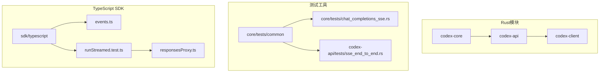
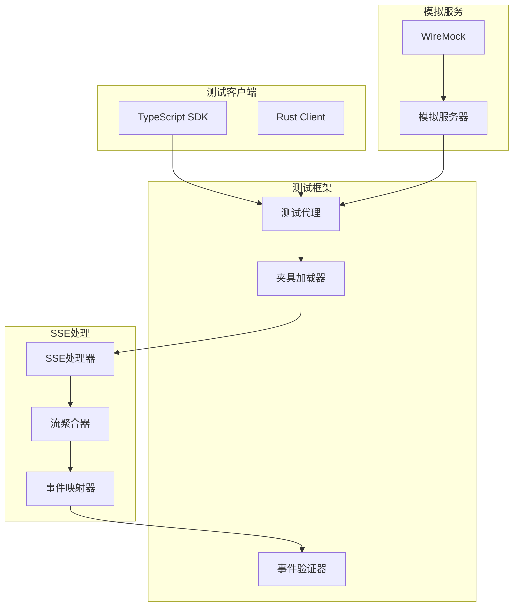
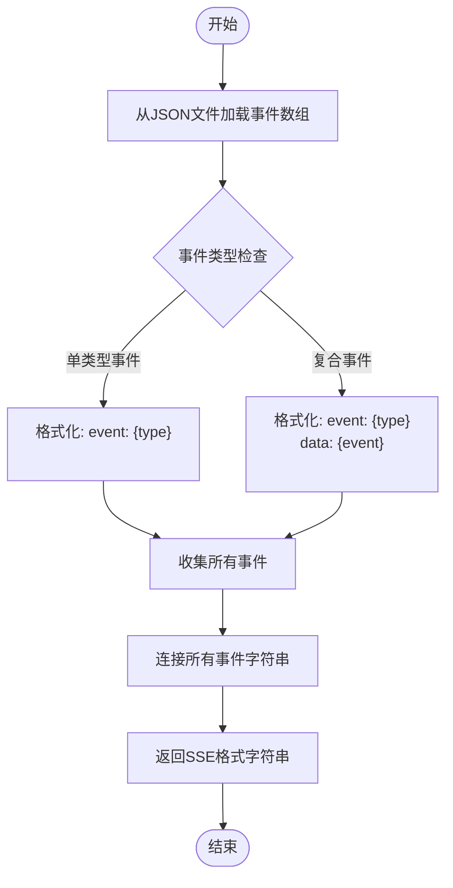
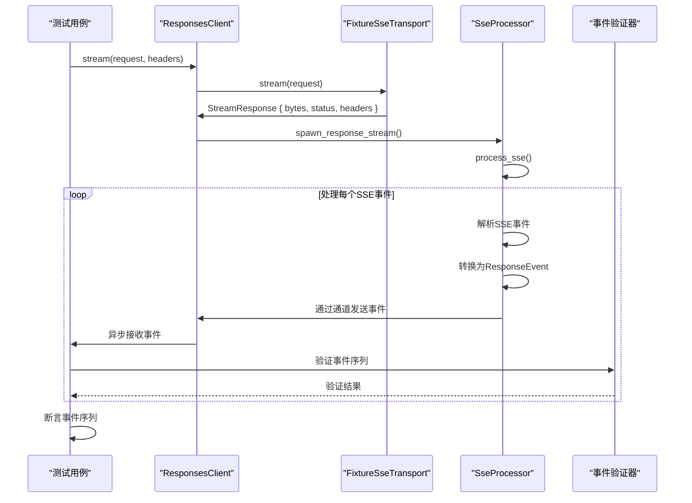

# SSE流式测试框架

<cite>
**本文档引用的文件**   
- [mod.rs](file://codex-rs/codex-api/src/sse/mod.rs)
- [responses.rs](file://codex-rs/codex-api/src/sse/responses.rs)
- [chat.rs](file://codex-rs/codex-api/src/sse/chat.rs)
- [sse.rs](file://codex-rs/codex-client/src/sse.rs)
- [sse_end_to_end.rs](file://codex-rs/codex-api/tests/sse_end_to_end.rs)
- [chat_completions_sse.rs](file://codex-rs/core/tests/chat_completions_sse.rs)
- [lib.rs](file://codex-rs/core/tests/common/lib.rs)
- [events.ts](file://sdk/typescript/src/events.ts)
- [runStreamed.test.ts](file://sdk/typescript/tests/runStreamed.test.ts)
- [responsesProxy.ts](file://sdk/typescript/tests/responsesProxy.ts)
- [cli_responses_fixture.sse](file://codex-rs/core/tests/cli_responses_fixture.sse)
</cite>

## 目录
1. [简介](#简介)
2. [项目结构](#项目结构)
3. [核心组件](#核心组件)
4. [架构概述](#架构概述)
5. [详细组件分析](#详细组件分析)
6. [依赖分析](#依赖分析)
7. [性能考虑](#性能考虑)
8. [故障排除指南](#故障排除指南)
9. [结论](#结论)

## 简介
SSE流式测试框架是一个用于测试服务器发送事件（SSE）流的综合系统，主要针对Codex AI代理的响应流。该框架提供了一套完整的工具和实用程序，用于模拟、验证和测试SSE流的行为，确保客户端能够正确处理各种流式响应场景，包括正常完成、错误处理、超时和部分响应。

## 项目结构
SSE流式测试框架分布在多个Rust和TypeScript模块中，形成了一个分层的测试架构。核心SSE处理逻辑位于`codex-api`包的`sse`模块中，而测试工具和夹具则分布在`core/tests`和`sdk/typescript`目录中。



**Diagram sources**
- [mod.rs](file://codex-rs/codex-api/src/sse/mod.rs)
- [lib.rs](file://codex-rs/core/tests/common/lib.rs)
- [runStreamed.test.ts](file://sdk/typescript/tests/runStreamed.test.ts)

**Section sources**
- [mod.rs](file://codex-rs/codex-api/src/sse/mod.rs)
- [lib.rs](file://codex-rs/core/tests/common/lib.rs)

## 核心组件
SSE流式测试框架的核心组件包括SSE事件处理器、响应流客户端、测试夹具生成器和事件验证工具。这些组件协同工作，创建一个完整的测试环境，用于验证SSE流的正确性和鲁棒性。

**Section sources**
- [responses.rs](file://codex-rs/codex-api/src/sse/responses.rs)
- [chat.rs](file://codex-rs/codex-api/src/sse/chat.rs)
- [sse.rs](file://codex-rs/codex-client/src/sse.rs)

## 架构概述
SSE流式测试框架采用分层架构，将SSE流处理、测试模拟和验证逻辑分离。该架构允许独立测试各个组件，同时提供端到端的测试能力。



**Diagram sources**
- [responses.rs](file://codex-rs/codex-api/src/sse/responses.rs)
- [sse_end_to_end.rs](file://codex-rs/codex-api/tests/sse_end_to_end.rs)
- [runStreamed.test.ts](file://sdk/typescript/tests/runStreamed.test.ts)

## 详细组件分析

### SSE处理器分析
SSE处理器是框架的核心，负责解析和处理SSE流中的事件。它实现了两种主要的处理模式：响应流处理和聊天完成处理。

#### SSE响应处理器
```mermaid
classDiagram
class SseProcessor {
+process_sse(stream : ByteStream, tx : Sender<Result<ResponseEvent, ApiError>>, idle_timeout : Duration, telemetry : Option<Arc<dyn SseTelemetry>>)
+spawn_response_stream(stream_response : StreamResponse, idle_timeout : Duration, telemetry : Option<Arc<dyn SseTelemetry>>)
+stream_from_fixture(path : impl AsRef<Path>, idle_timeout : Duration)
}
class ResponseEvent {
+OutputItemDone(ResponseItem)
+OutputTextDelta(String)
+ReasoningContentDelta{delta : String, content_index : i64}
+Completed{response_id : String, token_usage : Option<TokenUsage>}
+Created{}
+RateLimits(RateLimitSnapshot)
}
class ResponseItem {
+Message{id : Option<String>, role : String, content : Vec<ContentItem>}
+Reasoning{id : String, summary : Vec<ReasoningSummaryPart>, content : Option<Vec<ReasoningItemContent>>, encrypted_content : Option<String>}
+FunctionCall{id : Option<String>, name : String, arguments : String, call_id : String}
+FunctionCallOutput{call_id : String, output : FunctionCallOutputPayload}
+CustomToolCallOutput{call_id : String, output : CustomToolCallOutputPayload}
+WebSearchCall{id : String, query : String, results : Vec<WebSearchResult>}
}
SseProcessor --> ResponseEvent : "生成"
SseProcessor --> ResponseItem : "解析"
ResponseEvent --> ResponseItem : "包含"
```

**Diagram sources**
- [responses.rs](file://codex-rs/codex-api/src/sse/responses.rs)
- [mod.rs](file://codex-rs/codex-api/src/sse/mod.rs)

### 测试夹具系统
测试夹具系统提供了一种标准化的方法来创建和加载SSE流测试数据，支持动态ID替换和多种加载方式。

#### 夹具加载流程


**Diagram sources**
- [lib.rs](file://codex-rs/core/tests/common/lib.rs)
- [cli_responses_fixture.sse](file://codex-rs/core/tests/cli_responses_fixture.sse)

### 端到端测试流程
端到端测试流程展示了如何使用测试框架验证SSE流的完整生命周期，从请求发送到事件验证。

#### 端到端测试序列


**Diagram sources**
- [sse_end_to_end.rs](file://codex-rs/codex-api/tests/sse_end_to_end.rs)
- [responses.rs](file://codex-rs/codex-api/src/sse/responses.rs)

## 依赖分析
SSE流式测试框架依赖于多个Rust和JavaScript/TypeScript库，这些依赖关系支持其核心功能。

```mermaid
graph LR
A[codex-api] --> B[eventsource_stream]
A --> C[futures]
A --> D[serde_json]
A --> E[tokio]
F[codex-client] --> G[bytes]
F --> H[http]
I[core] --> J[wiremock]
I --> K[pretty_assertions]
L[TypeScript SDK] --> M[node:http]
L --> N[@jest/globals]
B --> E
C --> E
D --> E
G --> F
H --> F
J --> I
K --> I
M --> L
N --> L
```

**Diagram sources**
- [Cargo.toml](file://codex-rs/codex-api/Cargo.toml)
- [Cargo.toml](file://codex-rs/codex-client/Cargo.toml)
- [package.json](file://sdk/typescript/package.json)

**Section sources**
- [Cargo.toml](file://codex-rs/codex-api/Cargo.toml)
- [Cargo.toml](file://codex-rs/codex-client/Cargo.toml)
- [package.json](file://sdk/typescript/package.json)

## 性能考虑
SSE流式测试框架在设计时考虑了性能因素，特别是在处理大量事件和高频率流时。

### 性能优化策略
1. **异步处理**：所有SSE处理都在Tokio运行时中异步执行，避免阻塞主线程
2. **通道缓冲**：使用大小为1600的MPSC通道缓冲事件，减少竞争
3. **流聚合**：提供聚合功能，减少事件处理开销
4. **空闲超时**：实现可配置的空闲超时，防止无限等待
5. **内存效率**：使用字节流和迭代器，避免不必要的数据复制

这些策略确保了框架能够高效处理大规模的SSE流测试，同时保持低内存占用和高响应性。

## 故障排除指南
当使用SSE流式测试框架时，可能会遇到各种问题。以下是一些常见问题及其解决方案。

### 常见问题及解决方案
| 问题 | 可能原因 | 解决方案 |
|------|---------|---------|
| 事件序列不匹配 | 夹具数据格式错误 | 验证SSE格式是否符合`event: type\ndata: {...}\n\n`模式 |
| 流提前关闭 | 空闲超时设置过短 | 增加idle_timeout参数值 |
| JSON解析失败 | SSE数据包含无效UTF-8 | 检查数据源的字符编码 |
| 事件丢失 | 通道缓冲区溢出 | 增加MPSC通道容量或优化事件处理速度 |
| 测试挂起 | 缺少[done]事件 | 确保SSE流以`data: [DONE]\n\n`结束 |

**Section sources**
- [chat_completions_sse.rs](file://codex-rs/core/tests/chat_completions_sse.rs)
- [sse_end_to_end.rs](file://codex-rs/codex-api/tests/sse_end_to_end.rs)

## 结论
SSE流式测试框架为Codex AI代理的SSE流提供了全面的测试解决方案。通过组合Rust后端处理和TypeScript前端测试，该框架能够验证各种流式场景，确保客户端的鲁棒性和正确性。其模块化设计和丰富的测试工具使其成为测试复杂SSE流的理想选择。