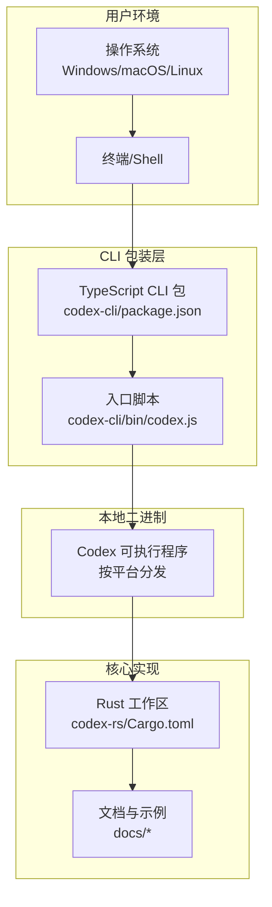
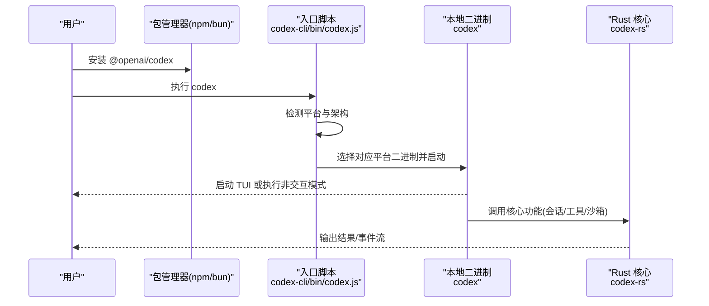
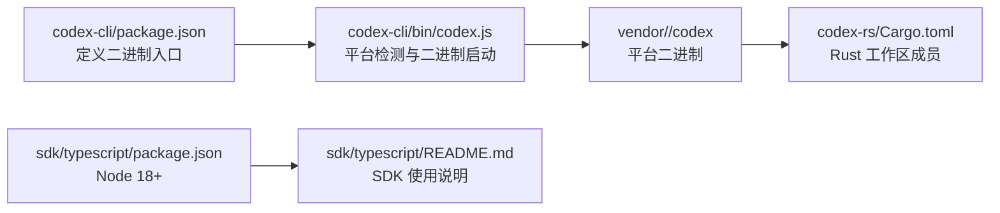

# 快速开始

<cite>
**本文引用的文件**
- [根目录 README](file://README.md)
- [安装与构建指南](file://docs/install.md)
- [入门指南](file://docs/getting-started.md)
- [常见问题 FAQ](file://docs/faq.md)
- [示例配置](file://docs/example-config.md)
- [斜杠命令](file://docs/slash_commands.md)
- [TypeScript SDK 说明](file://sdk/typescript/README.md)
- [TypeScript 包配置](file://sdk/typescript/package.json)
- [CLI 入口脚本](file://codex-cli/bin/codex.js)
- [CLI 包配置](file://codex-cli/package.json)
- [Rust 工作区清单](file://codex-rs/Cargo.toml)
</cite>

## 目录
1. [简介](#简介)
2. [项目结构](#项目结构)
3. [核心组件](#核心组件)
4. [架构总览](#架构总览)
5. [详细组件分析](#详细组件分析)
6. [依赖分析](#依赖分析)
7. [性能考虑](#性能考虑)
8. [故障排除指南](#故障排除指南)
9. [结论](#结论)
10. [附录](#附录)

## 简介
本“快速开始”指南面向首次接触 Codex 的用户，帮助你在几分钟内完成安装、登录与第一次运行。你将学会：
- 在 Windows、macOS、Linux 上安装与运行
- 初始化项目、生成代码与执行任务的基本工作流
- 常见问题排查与升级注意事项

为保证可操作性，文中所有命令均来自仓库内的真实文档与脚本路径，避免凭空假设。

## 项目结构
Codex 是一个多语言、多模块的工程，包含：
- TypeScript CLI 包装器：负责跨平台分发与启动本地二进制
- Rust 核心实现：提供终端交互界面、工具调用、沙箱与策略控制等能力
- 文档与示例：安装、入门、配置、FAQ 等

图表来源
- [CLI 包配置](file://codex-cli/package.json#L1-L22)
- [CLI 入口脚本](file://codex-cli/bin/codex.js#L1-L170)
- [Rust 工作区清单](file://codex-rs/Cargo.toml#L1-L120)
- [安装与构建指南](file://docs/install.md#L1-L49)

章节来源
- [根目录 README](file://README.md#L1-L113)
- [安装与构建指南](file://docs/install.md#L1-L49)
- [Rust 工作区清单](file://codex-rs/Cargo.toml#L1-L120)

## 核心组件
- TypeScript CLI 包装器：提供统一入口，自动选择对应平台的本地二进制并转发参数与信号
- Rust 核心：提供 TUI、工具调用、沙箱、MCP 协议支持、配置与认证等能力
- 文档与示例：安装、入门、配置、斜杠命令、SDK 使用等

章节来源
- [CLI 包配置](file://codex-cli/package.json#L1-L22)
- [CLI 入口脚本](file://codex-cli/bin/codex.js#L1-L170)
- [Rust 工作区清单](file://codex-rs/Cargo.toml#L1-L120)
- [入门指南](file://docs/getting-started.md#L1-L120)

## 架构总览
下图展示了从用户命令到本地二进制再到 Rust 核心的调用链路。

图表来源
- [CLI 入口脚本](file://codex-cli/bin/codex.js#L1-L170)
- [Rust 工作区清单](file://codex-rs/Cargo.toml#L1-L120)

## 详细组件分析

### 安装与运行（Windows/macOS/Linux）
- 推荐方式
  - 使用 npm 全局安装：参考根 README 中的安装命令
  - 使用 Homebrew（macOS）：参考根 README 中的安装命令
  - 直接下载 GitHub Releases 对应平台二进制：参考根 README 的“Latest Release”说明
- 系统要求与构建
  - 系统要求与构建流程参考安装与构建指南
  - 如需从源码构建，指南中提供了 Rust 工具链安装与编译步骤
- 运行
  - 安装后直接运行 codex 即可进入交互式 TUI
  - 支持以初始提示作为参数直接进入对话

章节来源
- [根目录 README](file://README.md#L1-L113)
- [安装与构建指南](file://docs/install.md#L1-L49)
- [入门指南](file://docs/getting-started.md#L1-L120)

### 初始化项目与第一次运行
- 登录与认证
  - 首次运行时选择“使用 ChatGPT 登录”，推荐绑定 Plus/Pro/Team/Edu/Enterprise 计划
  - 若使用 API Key，需额外设置；迁移步骤与方法请参考认证文档
- 基本工作流
  - 交互式 TUI：直接运行 codex
  - 传入初始提示：codex "你的任务描述"
  - 非交互模式：codex exec "你的任务描述"
- 示例提示
  - 文档中提供了多种示例提示，可直接复制使用，如重构、生成迁移、写测试、批量重命名、解释正则、安全审查等

章节来源
- [根目录 README](file://README.md#L1-L113)
- [入门指南](file://docs/getting-started.md#L1-L120)

### 配置与沙箱
- 配置文件位置与示例
  - 配置文件位于 ~/.codex/config.toml，示例配置包含模型、审批策略、沙箱模式、历史持久化、通知、认证、MCP 服务器、模型提供商、特性开关等
- 沙箱与审批
  - 默认读写模式为只读，可通过命令或配置调整
  - 审批策略可在会话中通过斜杠命令动态切换

章节来源
- [根目录 README](file://README.md#L1-L113)
- [示例配置](file://docs/example-config.md#L1-L368)
- [斜杠命令](file://docs/slash_commands.md#L1-L34)
- [常见问题 FAQ](file://docs/faq.md#L1-L56)

### TypeScript SDK（可选）
- 用途：在应用或自动化流程中嵌入 Codex，通过 JSONL 事件流与 CLI 交互
- 安装与最小示例：参考 SDK 说明中的安装与快速开始部分
- 特性：流式响应、结构化输出、图像输入、线程恢复、工作目录控制、环境变量注入

章节来源
- [TypeScript SDK 说明](file://sdk/typescript/README.md#L1-L134)
- [TypeScript 包配置](file://sdk/typescript/package.json#L1-L67)

## 依赖分析
- 平台分发与入口脚本
  - TypeScript CLI 包定义了二进制入口 codex，并在运行时根据平台与架构选择对应的 vendor 目录下的本地二进制
  - 入口脚本处理信号转发、PATH 注入与包管理器检测，确保跨平台一致体验
- Rust 工作区
  - 工作区包含 app-server、tui、core、exec、mcp-server 等模块，文档与示例位于 docs 目录
- Node/TypeScript 生态
  - TypeScript SDK 需要 Node.js 18+，CLI 包装器需要 Node.js 16+

图表来源
- [CLI 包配置](file://codex-cli/package.json#L1-L22)
- [CLI 入口脚本](file://codex-cli/bin/codex.js#L1-L170)
- [Rust 工作区清单](file://codex-rs/Cargo.toml#L1-L120)
- [TypeScript 包配置](file://sdk/typescript/package.json#L1-L67)
- [TypeScript SDK 说明](file://sdk/typescript/README.md#L1-L134)

章节来源
- [CLI 包配置](file://codex-cli/package.json#L1-L22)
- [CLI 入口脚本](file://codex-cli/bin/codex.js#L1-L170)
- [Rust 工作区清单](file://codex-rs/Cargo.toml#L1-L120)
- [TypeScript 包配置](file://sdk/typescript/package.json#L1-L67)

## 性能考虑
- 首次运行建议使用默认配置，避免不必要的网络与工具开销
- 非交互模式（codex exec）适合自动化流水线，注意日志与输出格式的选择
- 沙箱模式与审批策略会影响工具调用频率与等待时间，可根据任务复杂度调整

[本节为通用建议，不直接分析具体文件]

## 故障排除指南
- Homebrew 升级问题
  - 若之前安装的是旧 formula，升级不会生效；需先卸载旧 formula 再安装新 cask，之后可用 brew upgrade --cask 保持更新
- Windows 支持
  - 不建议直接在 Windows 上运行；推荐使用 WSL2
- 登录问题
  - 确认认证流程正确，检查 ~/.codex/auth.json 是否存在有效凭据；远程/无头机器需配置端口转发
- 平台不支持
  - 入口脚本会抛出不支持平台的错误信息，请确认操作系统与架构组合是否受支持
- Node/包管理器版本
  - CLI 包装器要求 Node.js 16+；TypeScript SDK 要求 Node.js 18+

章节来源
- [常见问题 FAQ](file://docs/faq.md#L1-L56)
- [根目录 README](file://README.md#L1-L113)
- [CLI 入口脚本](file://codex-cli/bin/codex.js#L1-L170)
- [CLI 包配置](file://codex-cli/package.json#L1-L22)
- [TypeScript 包配置](file://sdk/typescript/package.json#L1-L67)

## 结论
通过本指南，你可以在几分钟内完成安装、登录与第一次运行。建议先从交互式 TUI 开始熟悉基本工作流，再逐步探索非交互模式、配置与斜杠命令。遇到问题时，优先参考 FAQ 与安装文档。

[本节为总结，不直接分析具体文件]

## 附录

### 快速命令清单
- 安装（npm）
  - 参考：根 README 中的安装命令
- 安装（Homebrew，macOS）
  - 参考：根 README 中的安装命令
- 直接下载二进制（GitHub Releases）
  - 参考：根 README 中的“Latest Release”说明
- 运行
  - 交互式：codex
  - 初始提示：codex "你的任务描述"
  - 非交互：codex exec "你的任务描述"
- 配置
  - 复制示例配置至 ~/.codex/config.toml
- 斜杠命令
  - /model、/approvals、/review、/new、/resume、/init、/compact、/undo、/diff、/mention、/status、/mcp、/skills、/logout、/quit、/exit、/feedback

章节来源
- [根目录 README](file://README.md#L1-L113)
- [入门指南](file://docs/getting-started.md#L1-L120)
- [示例配置](file://docs/example-config.md#L1-L368)
- [斜杠命令](file://docs/slash_commands.md#L1-L34)