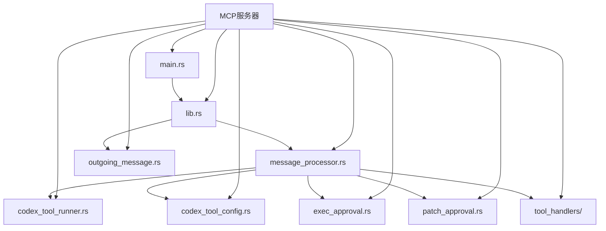
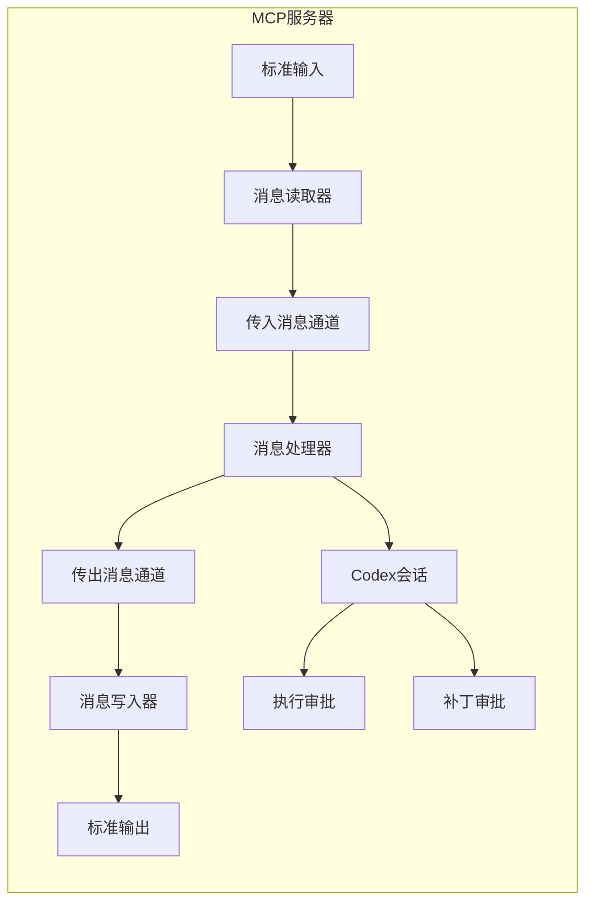
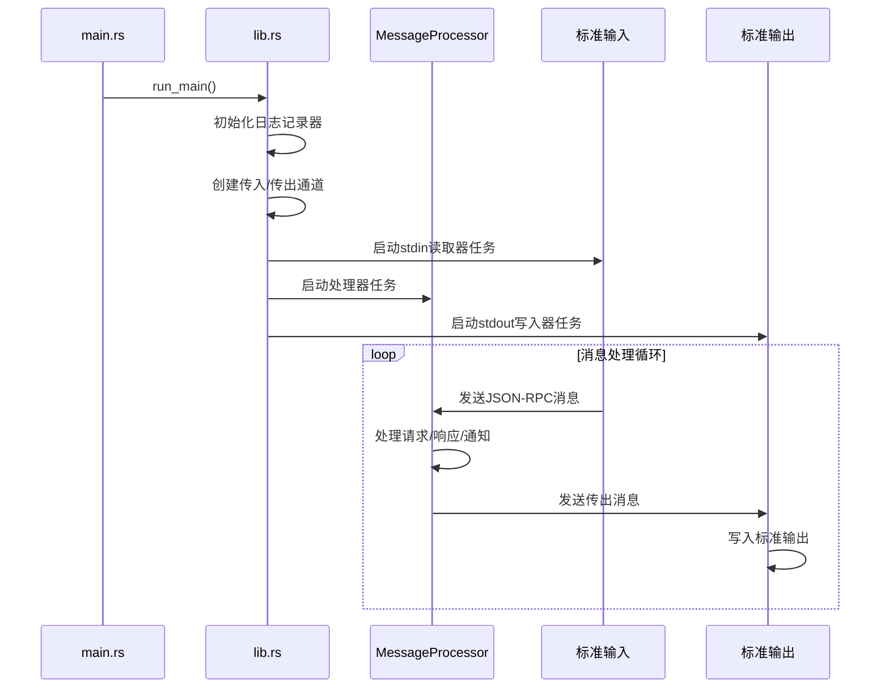
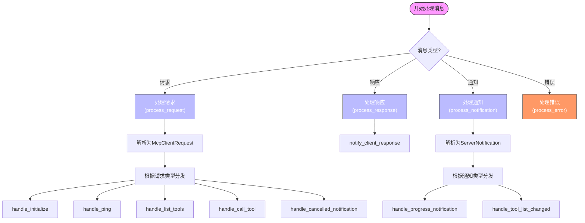
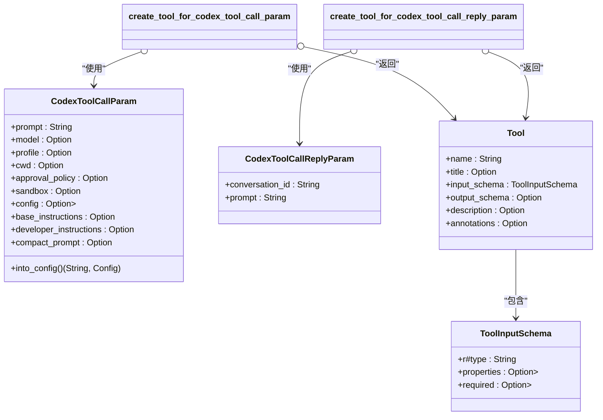
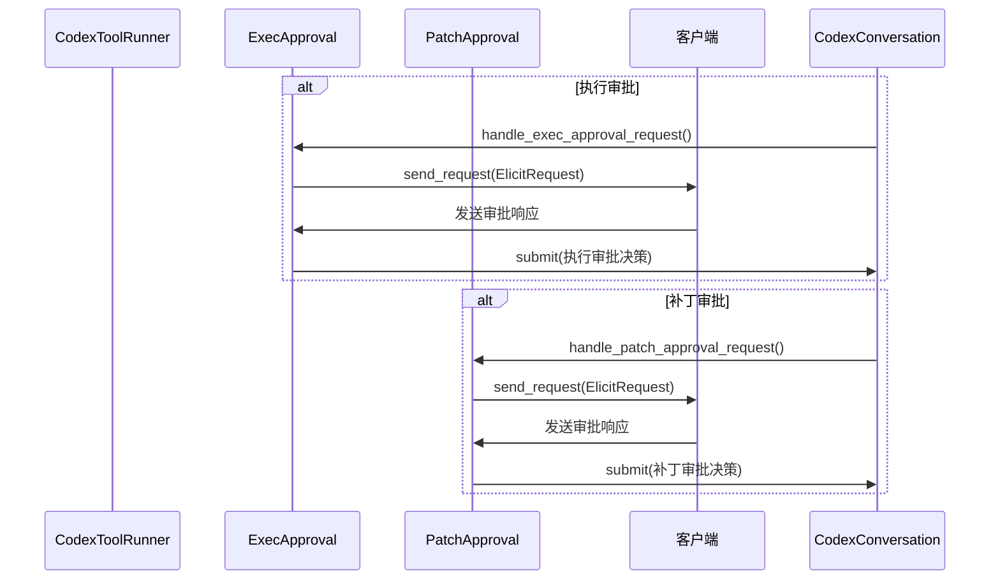
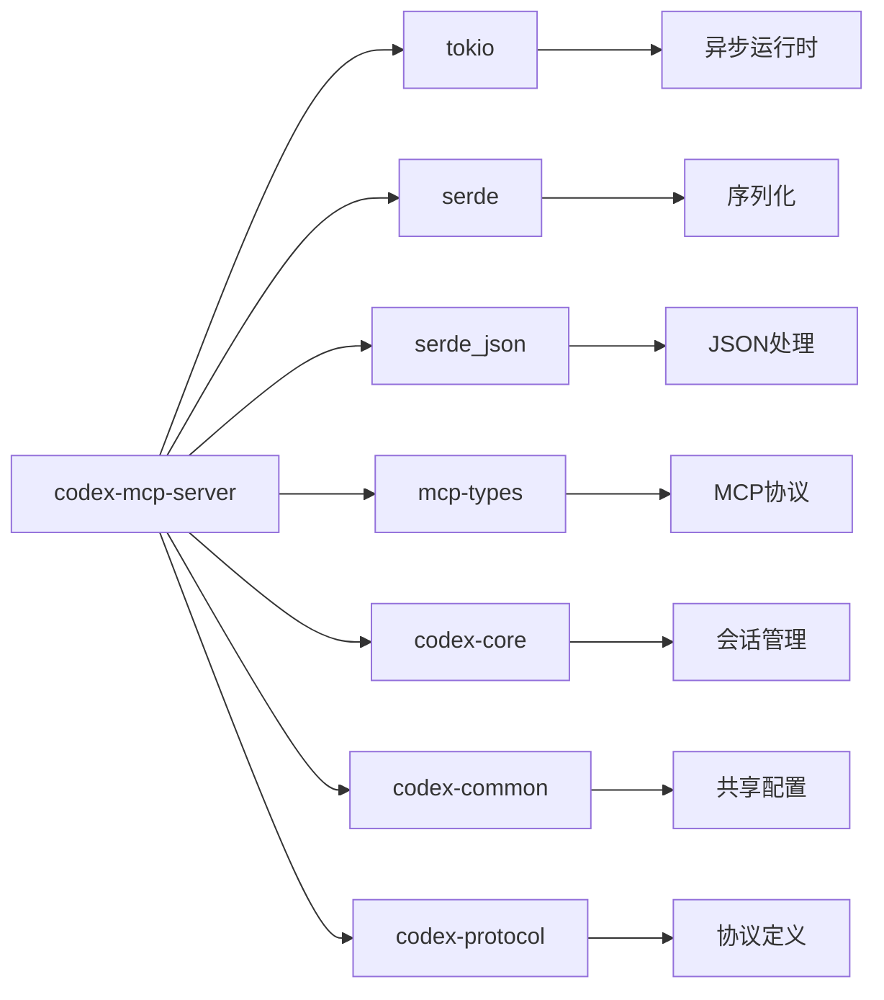

# MCP服务器

<cite>
**本文档中引用的文件**  
- [main.rs](file://codex-rs/mcp-server/src/main.rs)
- [message_processor.rs](file://codex-rs/mcp-server/src/message_processor.rs)
- [codex_tool_runner.rs](file://codex-rs/mcp-server/src/codex_tool_runner.rs)
- [codex_tool_config.rs](file://codex-rs/mcp-server/src/codex_tool_config.rs)
- [exec_approval.rs](file://codex-rs/mcp-server/src/exec_approval.rs)
- [patch_approval.rs](file://codex-rs/mcp-server/src/patch_approval.rs)
- [tool_handlers/mod.rs](file://codex-rs/mcp-server/src/tool_handlers/mod.rs)
- [outgoing_message.rs](file://codex-rs/mcp-server/src/outgoing_message.rs)
- [lib.rs](file://codex-rs/mcp-server/src/lib.rs)
</cite>

## 目录
1. [简介](#简介)
2. [项目结构](#项目结构)
3. [核心组件](#核心组件)
4. [架构概述](#架构概述)
5. [详细组件分析](#详细组件分析)
6. [依赖分析](#依赖分析)
7. [性能考虑](#性能考虑)
8. [故障排除指南](#故障排除指南)
9. [结论](#结论)

## 简介
MCP（Model Control Protocol）服务器是Codex系统中用于集成外部工具和服务的核心机制。它作为模型与外部世界之间的桥梁，通过标准化的JSON-RPC协议处理工具调用、资源管理和会话控制。本文档详细解释了MCP服务器的架构、工作流程和安全机制，重点分析了服务启动流程、消息处理逻辑、工具执行管理以及自定义工具的开发与集成。

## 项目结构
MCP服务器位于`codex-rs/mcp-server`目录下，是一个独立的Rust crate，遵循模块化设计原则。其主要结构包括：
- `src/main.rs`: 服务的入口点，负责初始化和启动主循环
- `src/lib.rs`: 核心功能的公共接口和主运行逻辑
- `src/message_processor.rs`: 处理所有传入的JSON-RPC消息，包括请求、响应和通知
- `src/codex_tool_runner.rs`: 执行和管理Codex工具调用的核心逻辑
- `src/codex_tool_config.rs`: 定义和处理`codex`和`codex-reply`工具调用的配置参数
- `src/tool_handlers/`: 包含自定义工具处理器的模块
- `src/exec_approval.rs` 和 `src/patch_approval.rs`: 实现执行和补丁应用的安全审批机制
- `src/outgoing_message.rs`: 管理向客户端发送消息的通道和序列化



**Diagram sources**
- [main.rs](file://codex-rs/mcp-server/src/main.rs)
- [lib.rs](file://codex-rs/mcp-server/src/lib.rs)
- [message_processor.rs](file://codex-rs/mcp-server/src/message_processor.rs)

**Section sources**
- [main.rs](file://codex-rs/mcp-server/src/main.rs)
- [lib.rs](file://codex-rs/mcp-server/src/lib.rs)

## 核心组件
MCP服务器的核心组件包括消息处理器、工具运行器和安全审批模块。消息处理器负责解析和路由所有JSON-RPC消息，工具运行器管理Codex会话的生命周期，而安全审批模块则确保所有潜在危险操作都经过用户确认。

**Section sources**
- [message_processor.rs](file://codex-rs/mcp-server/src/message_processor.rs)
- [codex_tool_runner.rs](file://codex-rs/mcp-server/src/codex_tool_runner.rs)
- [exec_approval.rs](file://codex-rs/mcp-server/src/exec_approval.rs)
- [patch_approval.rs](file://codex-rs/mcp-server/src/patch_approval.rs)

## 架构概述
MCP服务器采用事件驱动的异步架构，通过三个主要的Tokio任务协同工作：一个从标准输入读取消息，一个处理消息，另一个将响应写入标准输出。这种设计确保了高并发性和响应性。



**Diagram sources**
- [lib.rs](file://codex-rs/mcp-server/src/lib.rs)
- [message_processor.rs](file://codex-rs/mcp-server/src/message_processor.rs)

## 详细组件分析

### 服务启动流程分析
MCP服务器的启动流程始于`main.rs`中的`main`函数，该函数调用`run_main`函数。`run_main`函数初始化日志记录器，设置用于在任务间通信的通道，然后启动三个并发任务：一个用于从标准输入读取消息，一个用于处理消息，另一个用于将消息写入标准输出。



**Diagram sources**
- [main.rs](file://codex-rs/mcp-server/src/main.rs#L1-L11)
- [lib.rs](file://codex-rs/mcp-server/src/lib.rs#L47-L151)

**Section sources**
- [main.rs](file://codex-rs/mcp-server/src/main.rs)
- [lib.rs](file://codex-rs/mcp-server/src/lib.rs)

### 消息处理逻辑分析
`message_processor.rs`文件中的`MessageProcessor`结构体是MCP服务器的核心，负责处理所有传入的JSON-RPC消息。它根据消息类型（请求、响应、通知或错误）将其分发到相应的处理函数。



**Diagram sources**
- [message_processor.rs](file://codex-rs/mcp-server/src/message_processor.rs#L39-L656)

**Section sources**
- [message_processor.rs](file://codex-rs/mcp-server/src/message_processor.rs)

### 工具执行与管理分析
`codex_tool_runner.rs`文件中的`run_codex_tool_session`函数负责执行和管理Codex工具调用。当收到`tools/call`请求时，它会启动一个新的Codex会话，处理初始提示，并在会话期间流式传输事件。

```mermaid
sequenceDiagram
participant MP as MessageProcessor
participant CTR as CodexToolRunner
participant CC as CodexConversation
participant Client as 客户端
MP->>CTR : handle_call_tool("codex")
CTR->>CTR : new_conversation(config)
CTR->>Client : 发送SessionConfigured事件
CTR->>CC : submit(初始提示)
loop 事件流
CC->>CTR : next_event()
CTR->>Client : send_event_as_notification()
alt 需要执行审批
CTR->>CTR : handle_exec_approval_request()
CTR->>Client : 发送ElicitRequest
Client->>CTR : 发送审批响应
CTR->>CC : submit(执行审批决策)
end
alt 需要补丁审批
CTR->>CTR : handle_patch_approval_request()
CTR->>Client : 发送ElicitRequest
Client->>CTR : 发送审批响应
CTR->>CC : submit(补丁审批决策)
end
alt 任务完成
CTR->>Client : 发送TaskComplete响应
break
end
end
```

**Diagram sources**
- [codex_tool_runner.rs](file://codex-rs/mcp-server/src/codex_tool_runner.rs#L39-L339)
- [message_processor.rs](file://codex-rs/mcp-server/src/message_processor.rs#L346-L423)

**Section sources**
- [codex_tool_runner.rs](file://codex-rs/mcp-server/src/codex_tool_runner.rs)
- [message_processor.rs](file://codex-rs/mcp-server/src/message_processor.rs)

### 自定义工具定义与注册分析
MCP服务器通过`tool_handlers`模块定义和注册自定义工具。`codex_tool_config.rs`文件中的`create_tool_for_codex_tool_call_param`和`create_tool_for_codex_tool_call_reply_param`函数使用`JsonSchema`宏自动生成符合MCP规范的工具定义。



**Diagram sources**
- [codex_tool_config.rs](file://codex-rs/mcp-server/src/codex_tool_config.rs#L16-L228)
- [tool_handlers/mod.rs](file://codex-rs/mcp-server/src/tool_handlers/mod.rs)

**Section sources**
- [codex_tool_config.rs](file://codex-rs/mcp-server/src/codex_tool_config.rs)
- [tool_handlers/mod.rs](file://codex-rs/mcp-server/src/tool_handlers/mod.rs)

### 安全机制分析
MCP服务器通过`exec_approval.rs`和`patch_approval.rs`模块实现强大的安全机制。当Codex需要执行shell命令或应用代码补丁时，它会暂停执行并发送一个`ElicitRequest`给客户端，等待用户的明确批准。



**Diagram sources**
- [exec_approval.rs](file://codex-rs/mcp-server/src/exec_approval.rs#L52-L154)
- [patch_approval.rs](file://codex-rs/mcp-server/src/patch_approval.rs#L44-L151)

**Section sources**
- [exec_approval.rs](file://codex-rs/mcp-server/src/exec_approval.rs)
- [patch_approval.rs](file://codex-rs/mcp-server/src/patch_approval.rs)

## 依赖分析
MCP服务器依赖于多个内部和外部crate来实现其功能。主要依赖包括`tokio`用于异步运行时，`serde`和`serde_json`用于序列化，`mcp-types`用于MCP协议类型，以及`codex-core`提供核心会话管理功能。



**Diagram sources**
- [Cargo.toml](file://codex-rs/mcp-server/Cargo.toml)

**Section sources**
- [Cargo.toml](file://codex-rs/mcp-server/Cargo.toml)

## 性能考虑
MCP服务器的设计考虑了性能和资源效率。它使用有界通道来防止内存耗尽，并通过异步任务避免阻塞主线程。对于长时间运行的Codex会话，它使用单独的Tokio任务来处理，确保消息处理循环保持响应。

## 故障排除指南
当MCP服务器出现问题时，应首先检查日志输出。常见的问题包括配置错误、网络连接问题或权限不足。确保`RUST_LOG`环境变量设置为`debug`或`trace`以获取详细的调试信息。

**Section sources**
- [lib.rs](file://codex-rs/mcp-server/src/lib.rs)
- [message_processor.rs](file://codex-rs/mcp-server/src/message_processor.rs)

## 结论
MCP服务器是Codex系统中一个关键的集成组件，它提供了一个安全、灵活且可扩展的框架，用于连接外部工具和服务。通过标准化的JSON-RPC协议和强大的安全审批机制，它确保了模型与外部世界交互的安全性和可控性。开发者可以轻松地创建和集成新的MCP工具，从而扩展Codex的功能。