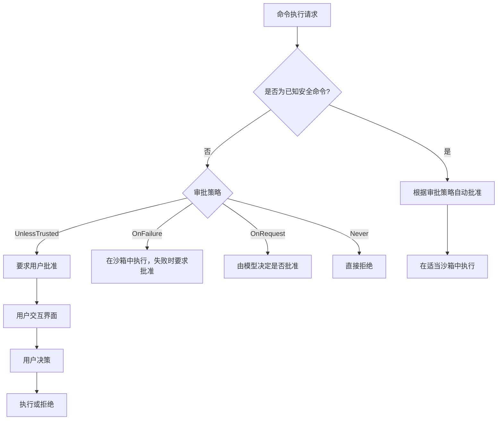
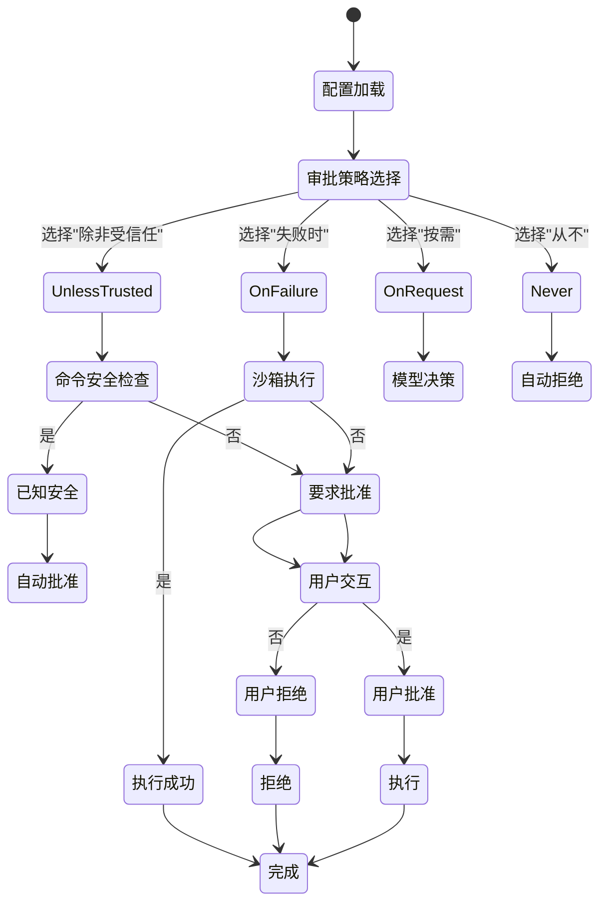

# 安全审批机制

<cite>
**本文档引用的文件**  
- [exec_approval.rs](file://codex-rs/mcp-server/src/exec_approval.rs)
- [patch_approval.rs](file://codex-rs/mcp-server/src/patch_approval.rs)
- [safety.rs](file://codex-rs/core/src/safety.rs)
- [is_dangerous_command.rs](file://codex-rs/core/src/command_safety/is_dangerous_command.rs)
- [is_safe_command.rs](file://codex-rs/core/src/command_safety/is_safe_command.rs)
- [protocol.rs](file://codex-rs/protocol/src/protocol.rs)
- [approval_overlay.rs](file://codex-rs/tui2/src/bottom_pane/approval_overlay.rs)
</cite>

## 目录
1. [简介](#简介)
2. [命令执行审批流程](#命令执行审批流程)
3. [补丁应用审批逻辑](#补丁应用审批逻辑)
4. [权限系统集成](#权限系统集成)
5. [审批级别配置](#审批级别配置)
6. [安全审计日志](#安全审计日志)

## 简介
Codex MCP服务器的安全机制通过严格的审批流程来保护系统免受潜在危险操作的影响。该机制主要由两个核心组件构成：命令执行审批和补丁应用审批。这些审批流程与Codex核心的权限系统深度集成，确保所有敏感操作都经过适当的验证和授权。本文档将详细分析这些安全机制的实现细节，包括审批策略的配置、用户交互方式、决策记录以及如何通过安全审计日志监控潜在风险操作。

## 命令执行审批流程
命令执行审批流程通过`exec_approval.rs`文件中的`handle_exec_approval_request`函数实现。当系统需要执行一个命令时，会创建一个`ExecApprovalElicitRequestParams`结构体，其中包含命令详情、工作目录和用户提示信息。该流程首先将命令参数进行转义处理，然后构建一个用户确认消息，询问是否允许在指定目录中运行该命令。

审批请求通过JSON-RPC协议发送给客户端，使用`ElicitRequest`方法。系统会创建一个独立的任务来监听用户响应，避免阻塞主代理循环。一旦收到响应，`on_exec_approval_response`函数会处理结果，将用户的决策（批准或拒绝）提交给Codex会话。如果无法正确反序列化响应，系统会采取保守策略，默认拒绝该请求以确保安全。

该机制还包含了错误处理逻辑，当序列化请求参数失败时，会向客户端发送错误响应，并记录相关错误信息。整个流程设计为异步非阻塞模式，确保系统的响应性和稳定性。

**Section sources**
- [exec_approval.rs](file://codex-rs/mcp-server/src/exec_approval.rs#L52-L154)

## 补丁应用审批逻辑
补丁应用审批逻辑在`patch_approval.rs`文件中实现，通过`handle_patch_approval_request`函数处理。与命令执行审批类似，该流程首先构建一个包含补丁变更详情的`PatchApprovalElicitRequestParams`结构体。参数中包含了变更的文件路径、变更类型（添加、删除、更新）以及其他元数据。

审批请求的处理流程与命令执行审批基本相同，都采用异步非阻塞的设计模式。系统会发送`ElicitRequest`请求给客户端，并在独立任务中等待用户响应。`on_patch_approval_response`函数负责处理响应结果，将用户的决策提交给Codex会话。特别的是，当请求失败时，系统会自动提交拒绝决策，这是一种保守的安全策略。

补丁审批机制还包含了对补丁完整性和安全性的验证。在`assess_patch_safety`函数中，系统会检查补丁是否仅限于可写路径，确保不会意外修改系统关键文件。如果补丁操作为空，系统会直接拒绝并返回相应原因。

**Section sources**
- [patch_approval.rs](file://codex-rs/mcp-server/src/patch_approval.rs#L44-L151)
- [safety.rs](file://codex-rs/core/src/safety.rs#L65-L120)

## 权限系统集成
安全审批机制与Codex核心的权限系统通过`AskForApproval`枚举类型紧密集成。该枚举定义了四种审批策略：`UnlessTrusted`、`OnFailure`、`OnRequest`和`Never`。这些策略决定了在何种条件下需要用户批准命令执行。

`is_known_safe_command`函数实现了一个安全命令白名单，包含常见的只读命令如`ls`、`cat`、`git status`等。对于这些已知安全的命令，系统可以根据配置自动批准。而对于潜在危险的命令，如`rm -rf`或`git reset`，系统会要求用户明确批准。

平台沙箱机制也与审批系统集成。系统会根据操作系统类型自动选择适当的沙箱技术：macOS使用Seatbelt，Linux使用Seccomp，Windows使用受限令牌。这种集成确保了即使在自动批准的情况下，命令执行也受到适当的限制。

**Diagram sources**
- [is_safe_command.rs](file://codex-rs/core/src/command_safety/is_safe_command.rs#L41-L154)
- [safety.rs](file://codex-rs/core/src/safety.rs#L122-L137)

## 审批级别配置
系统支持通过配置文件设置不同的审批级别，主要通过`AskForApproval`枚举类型实现。`UnlessTrusted`策略仅自动批准已知安全的只读命令，其他所有操作都需要用户批准。`OnFailure`策略允许所有命令在沙箱中自动执行，只有当执行失败时才要求用户批准无沙箱执行。

`Never`策略完全禁用用户批准，任何需要批准的操作都会立即失败。这是最严格的模式，适用于自动化环境。`OnRequest`是默认策略，由模型根据上下文决定何时需要用户批准。

配置还可以通过`SandboxPolicy`类型进一步细化，包括`DangerFullAccess`（无限制）、`ReadOnly`（只读）和`WorkspaceWrite`（工作区可写）等选项。`WorkspaceWrite`策略允许在当前工作目录及其子目录中进行写操作，同时可以指定额外的可写根目录。

**Diagram sources**
- [protocol.rs](file://codex-rs/protocol/src/protocol.rs#L244-L265)
- [safety.rs](file://codex-rs/core/src/safety.rs#L77-L119)

## 安全审计日志
安全审计日志是监控潜在风险操作的重要工具。系统在关键安全决策点都会生成详细的日志记录，包括审批请求的发送、用户响应的处理以及最终决策的提交。这些日志可以帮助管理员追踪所有敏感操作的历史记录。

当审批请求序列化失败时，系统会记录详细的错误信息，包括失败原因。同样，当无法正确反序列化用户响应时，也会记录相应的错误，并说明系统采取了保守的拒绝策略。这些日志条目对于调试和安全审计都非常重要。

用户交互界面通过`approval_overlay.rs`文件中的`ApprovalOverlay`组件实现，该组件会显示不同类型的审批请求，包括命令执行、补丁应用和MCP征询。每种类型都有相应的选项和快捷键，方便用户快速做出决策。所有用户决策都会被记录在审计日志中，形成完整的操作追溯链。

**Section sources**
- [exec_approval.rs](file://codex-rs/mcp-server/src/exec_approval.rs#L87-L99)
- [patch_approval.rs](file://codex-rs/mcp-server/src/patch_approval.rs#L79-L93)
- [approval_overlay.rs](file://codex-rs/tui2/src/bottom_pane/approval_overlay.rs#L74-L543)