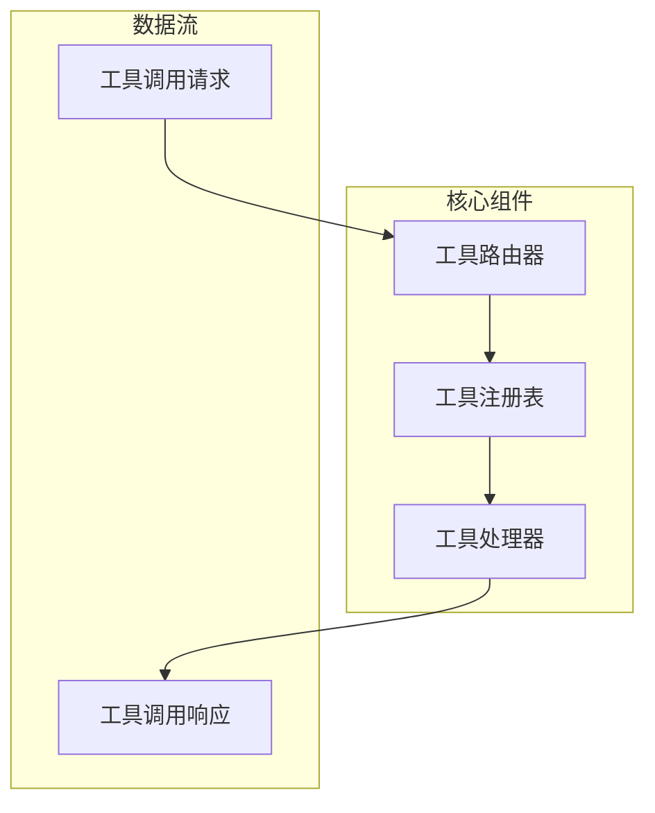
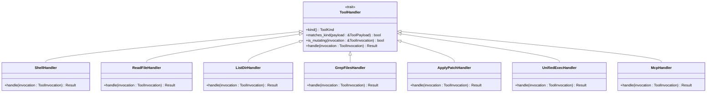
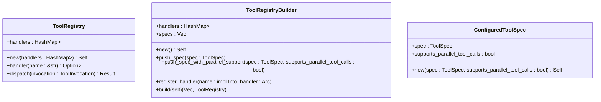
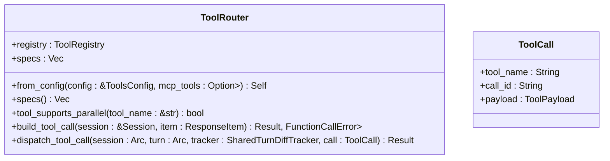
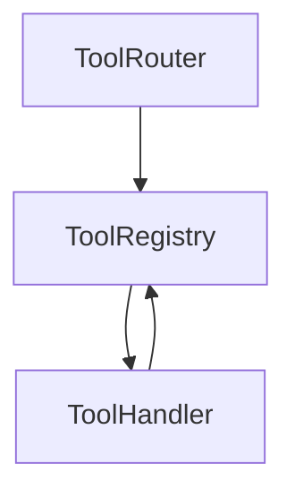

# 工具处理器开发

<cite>
**本文档引用的文件**   
- [tool_handlers/mod.rs](file://codex-rs/core/src/tools/handlers/mod.rs)
- [tool_handlers/shell.rs](file://codex-rs/core/src/tools/handlers/shell.rs)
- [tool_handlers/read_file.rs](file://codex-rs/core/src/tools/handlers/read_file.rs)
- [tool_handlers/list_dir.rs](file://codex-rs/core/src/tools/handlers/list_dir.rs)
- [tool_handlers/grep_files.rs](file://codex-rs/core/src/tools/handlers/grep_files.rs)
- [tool_handlers/apply_patch.rs](file://codex-rs/core/src/tools/handlers/apply_patch.rs)
- [tool_handlers/unified_exec.rs](file://codex-rs/core/src/tools/handlers/unified_exec.rs)
- [tool_handlers/mcp.rs](file://codex-rs/core/src/tools/handlers/mcp.rs)
- [registry.rs](file://codex-rs/core/src/tools/registry.rs)
- [router.rs](file://codex-rs/core/src/tools/router.rs)
- [spec.rs](file://codex-rs/core/src/tools/spec.rs)
</cite>

## 目录
1. [简介](#简介)
2. [架构概览](#架构概览)
3. [核心组件分析](#核心组件分析)
4. [详细组件分析](#详细组件分析)
5. [依赖分析](#依赖分析)
6. [性能考虑](#性能考虑)
7. [故障排除指南](#故障排除指南)
8. [结论](#结论)

## 简介
本文档旨在为MCP（Model Control Protocol）工具处理器的开发提供全面的指南。文档详细阐述了`tool_handlers/mod.rs`模块的架构设计，包括如何注册新的工具处理器、定义工具签名和实现业务逻辑。此外，还提供了创建自定义工具（如文件操作、代码生成、系统查询）的分步教程和完整代码模板，并解释了处理器间的依赖注入和共享状态管理机制。最后，文档列举了开发过程中常见的陷阱，如异步处理不当、资源泄漏等，并提供了最佳实践建议。

## 架构概览
MCP工具处理器的架构基于一个模块化的设计，核心组件包括工具处理器（Tool Handler）、工具注册表（Tool Registry）和工具路由器（Tool Router）。工具处理器负责处理特定工具的业务逻辑，工具注册表用于管理和注册所有可用的工具处理器，而工具路由器则负责将工具调用请求路由到相应的处理器。

**图源**
- [router.rs](file://codex-rs/core/src/tools/router.rs#L28-L31)
- [registry.rs](file://codex-rs/core/src/tools/registry.rs#L40-L42)
- [handlers/mod.rs](file://codex-rs/core/src/tools/handlers/mod.rs#L1-L27)

## 核心组件分析
MCP工具处理器的核心组件包括工具处理器、工具注册表和工具路由器。这些组件共同协作，确保工具调用请求能够被正确地处理和响应。

**组件源**
- [tool_handlers/mod.rs](file://codex-rs/core/src/tools/handlers/mod.rs#L1-L27)
- [registry.rs](file://codex-rs/core/src/tools/registry.rs#L40-L42)
- [router.rs](file://codex-rs/core/src/tools/router.rs#L28-L31)

## 详细组件分析
本节将深入分析MCP工具处理器的各个关键组件，包括工具处理器、工具注册表和工具路由器。

### 工具处理器分析
工具处理器是MCP工具系统的核心，负责处理特定工具的业务逻辑。每个工具处理器都实现了`ToolHandler` trait，该trait定义了处理器的基本行为。

#### 工具处理器接口

**图源**
- [registry.rs](file://codex-rs/core/src/tools/registry.rs#L21-L38)
- [handlers/shell.rs](file://codex-rs/core/src/tools/handlers/shell.rs#L71-L143)
- [handlers/read_file.rs](file://codex-rs/core/src/tools/handlers/read_file.rs#L92-L155)
- [handlers/list_dir.rs](file://codex-rs/core/src/tools/handlers/list_dir.rs#L47-L112)
- [handlers/grep_files.rs](file://codex-rs/core/src/tools/handlers/grep_files.rs#L37-L103)
- [handlers/apply_patch.rs](file://codex-rs/core/src/tools/handlers/apply_patch.rs#L34-L159)
- [handlers/unified_exec.rs](file://codex-rs/core/src/tools/handlers/unified_exec.rs#L73-L252)
- [handlers/mcp.rs](file://codex-rs/core/src/tools/handlers/mcp.rs#L13-L75)

#### 工具处理器实现
工具处理器的实现包括`ShellHandler`、`ReadFileHandler`、`ListDirHandler`、`GrepFilesHandler`、`ApplyPatchHandler`、`UnifiedExecHandler`和`McpHandler`。每个处理器都负责处理特定类型的工具调用请求。

**组件源**
- [handlers/shell.rs](file://codex-rs/core/src/tools/handlers/shell.rs#L71-L143)
- [handlers/read_file.rs](file://codex-rs/core/src/tools/handlers/read_file.rs#L92-L155)
- [handlers/list_dir.rs](file://codex-rs/core/src/tools/handlers/list_dir.rs#L47-L112)
- [handlers/grep_files.rs](file://codex-rs/core/src/tools/handlers/grep_files.rs#L37-L103)
- [handlers/apply_patch.rs](file://codex-rs/core/src/tools/handlers/apply_patch.rs#L34-L159)
- [handlers/unified_exec.rs](file://codex-rs/core/src/tools/handlers/unified_exec.rs#L73-L252)
- [handlers/mcp.rs](file://codex-rs/core/src/tools/handlers/mcp.rs#L13-L75)

### 工具注册表分析
工具注册表负责管理和注册所有可用的工具处理器。它提供了一个接口，用于注册新的工具处理器和获取已注册的处理器。

#### 工具注册表接口

**图源**
- [registry.rs](file://codex-rs/core/src/tools/registry.rs#L40-L219)
- [spec.rs](file://codex-rs/core/src/tools/spec.rs#L974-L1002)

#### 工具注册表实现
工具注册表的实现包括`ToolRegistry`和`ToolRegistryBuilder`。`ToolRegistry`负责存储和管理工具处理器，而`ToolRegistryBuilder`则用于构建和配置工具注册表。

**组件源**
- [registry.rs](file://codex-rs/core/src/tools/registry.rs#L40-L219)
- [spec.rs](file://codex-rs/core/src/tools/spec.rs#L974-L1002)

### 工具路由器分析
工具路由器负责将工具调用请求路由到相应的工具处理器。它通过解析请求中的工具名称，找到对应的处理器并调用其`handle`方法。

#### 工具路由器接口

**图源**
- [router.rs](file://codex-rs/core/src/tools/router.rs#L28-L193)

#### 工具路由器实现
工具路由器的实现包括`ToolRouter`和`ToolCall`。`ToolRouter`负责解析和路由工具调用请求，而`ToolCall`则表示一个工具调用请求。

**组件源**
- [router.rs](file://codex-rs/core/src/tools/router.rs#L28-L193)

## 依赖分析
MCP工具处理器的各个组件之间存在紧密的依赖关系。工具路由器依赖于工具注册表来获取工具处理器，而工具注册表则依赖于工具处理器来处理具体的工具调用请求。

**图源**
- [router.rs](file://codex-rs/core/src/tools/router.rs#L38-L40)
- [registry.rs](file://codex-rs/core/src/tools/registry.rs#L61-L142)
- [handlers/mod.rs](file://codex-rs/core/src/tools/handlers/mod.rs#L1-L27)

## 性能考虑
在开发MCP工具处理器时，需要考虑性能问题。例如，工具处理器的`handle`方法应该是异步的，以避免阻塞主线程。此外，工具注册表和工具路由器的实现应该尽量减少不必要的内存分配和复制操作。

## 故障排除指南
在开发MCP工具处理器时，可能会遇到一些常见的问题，如异步处理不当、资源泄漏等。以下是一些常见的陷阱和最佳实践建议：

- **异步处理不当**：确保工具处理器的`handle`方法是异步的，并且正确处理异步操作的结果。
- **资源泄漏**：确保在工具处理器的`handle`方法中正确释放所有资源，如文件句柄、网络连接等。
- **错误处理**：在工具处理器的`handle`方法中正确处理错误，并返回适当的错误信息。

**组件源**
- [handlers/shell.rs](file://codex-rs/core/src/tools/handlers/shell.rs#L96-L143)
- [handlers/read_file.rs](file://codex-rs/core/src/tools/handlers/read_file.rs#L98-L155)
- [handlers/list_dir.rs](file://codex-rs/core/src/tools/handlers/list_dir.rs#L53-L112)
- [handlers/grep_files.rs](file://codex-rs/core/src/tools/handlers/grep_files.rs#L43-L103)
- [handlers/apply_patch.rs](file://codex-rs/core/src/tools/handlers/apply_patch.rs#L51-L159)
- [handlers/unified_exec.rs](file://codex-rs/core/src/tools/handlers/unified_exec.rs#L100-L252)
- [handlers/mcp.rs](file://codex-rs/core/src/tools/handlers/mcp.rs#L19-L75)

## 结论
本文档详细介绍了MCP工具处理器的架构设计和开发指南。通过理解工具处理器、工具注册表和工具路由器的工作原理，开发者可以创建自定义工具并集成到MCP系统中。此外，文档还提供了最佳实践建议，帮助开发者避免常见的陷阱，确保工具处理器的性能和可靠性。