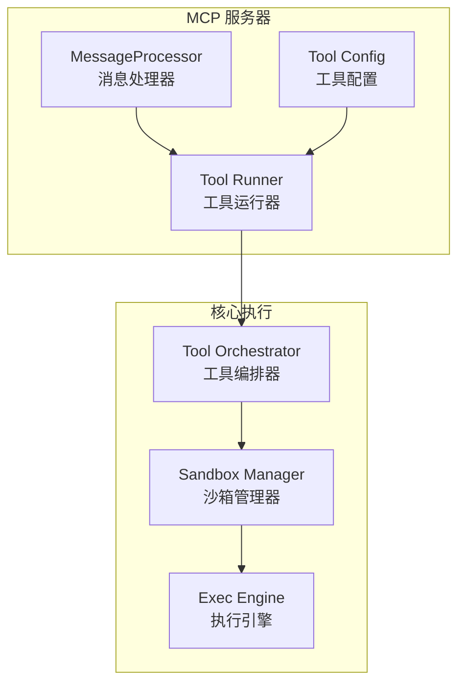
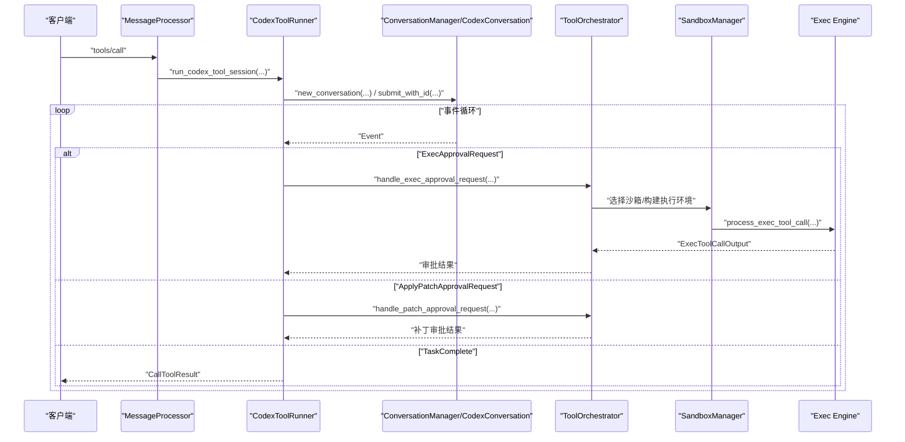
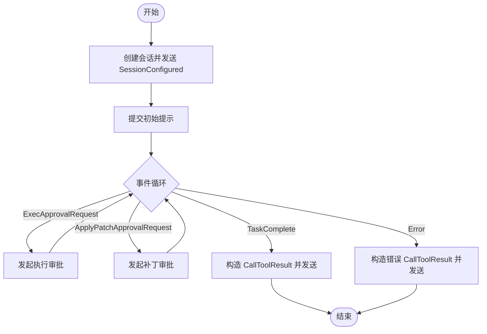
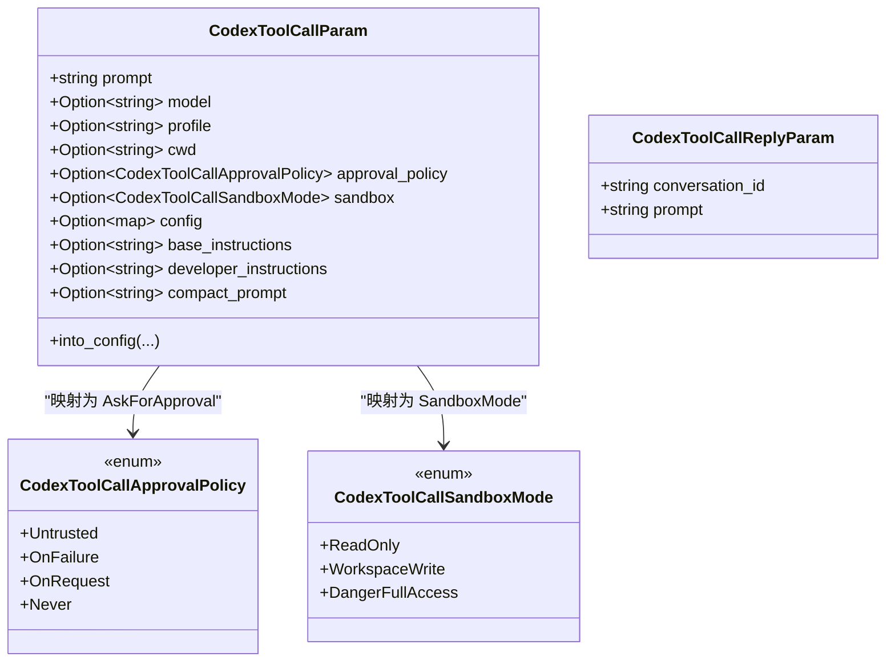
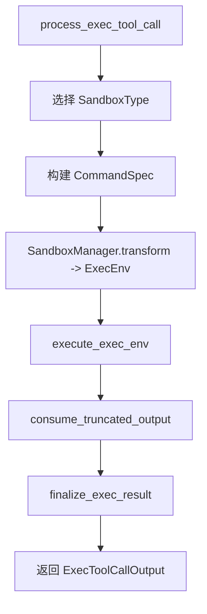
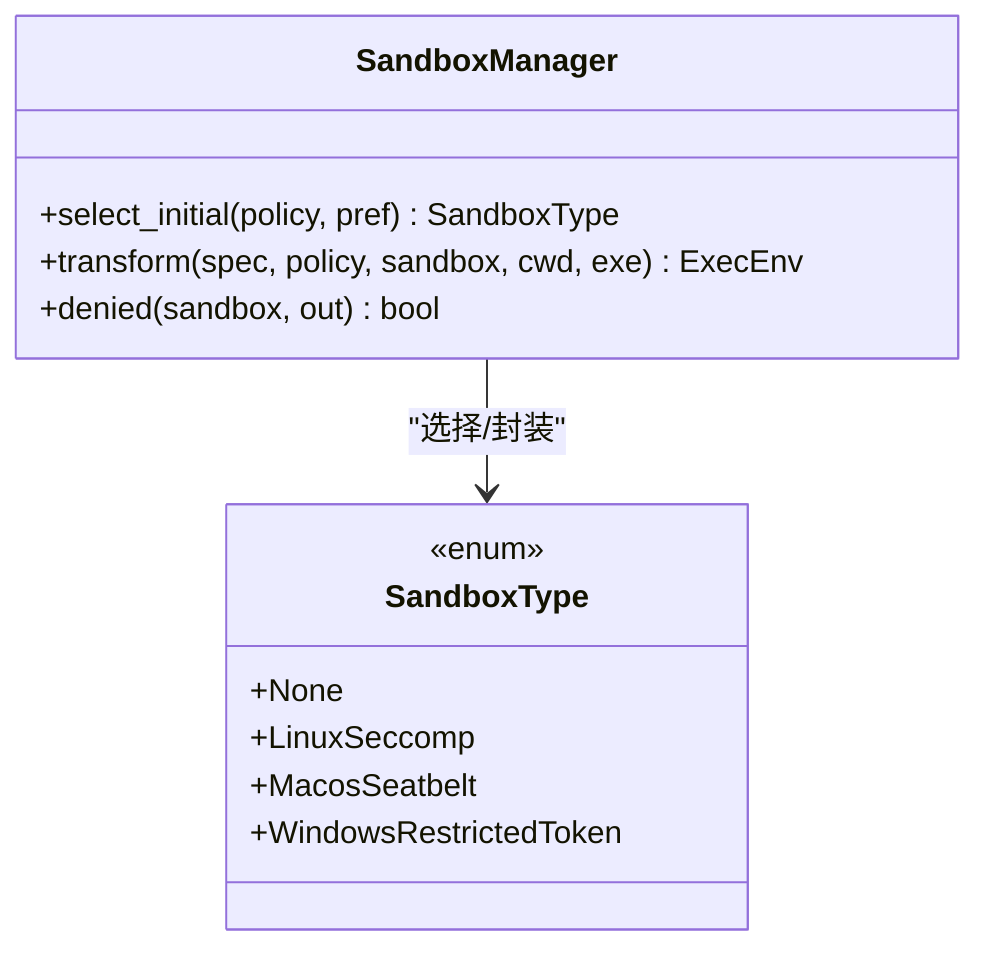
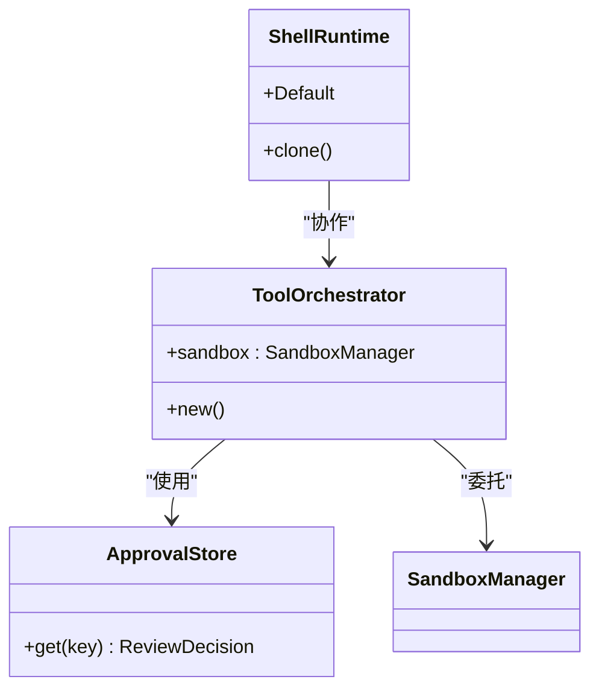
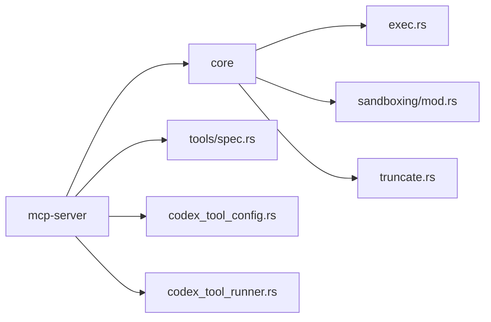

# 工具执行与运行时

<cite>
**本文引用的文件**
- [codex_tool_runner.rs](file://codex-rs/mcp-server/src/codex_tool_runner.rs)
- [codex_tool_config.rs](file://codex-rs/mcp-server/src/codex_tool_config.rs)
- [message_processor.rs](file://codex-rs/mcp-server/src/message_processor.rs)
- [lib.rs](file://codex-rs/mcp-server/src/lib.rs)
- [exec.rs](file://codex-rs/core/src/exec.rs)
- [sandboxing/mod.rs](file://codex-rs/core/src/sandboxing/mod.rs)
- [landlock.rs](file://codex-rs/core/src/landlock.rs)
- [orchestrator.rs](file://codex-rs/core/src/tools/orchestrator.rs)
- [runtimes/shell.rs](file://codex-rs/core/src/tools/runtimes/shell.rs)
- [spec.rs](file://codex-rs/core/src/tools/spec.rs)
- [truncate.rs](file://codex-rs/core/src/truncate.rs)
- [approval_presets.rs](file://codex-rs/common/src/approval_presets.rs)
- [sandbox.md](file://docs/sandbox.md)
- [exec.md](file://docs/exec.md)
</cite>

## 目录
1. [简介](#简介)
2. [项目结构](#项目结构)
3. [核心组件](#核心组件)
4. [架构总览](#架构总览)
5. [详细组件分析](#详细组件分析)
6. [依赖关系分析](#依赖关系分析)
7. [性能考量](#性能考量)
8. [故障排查指南](#故障排查指南)
9. [结论](#结论)
10. [附录：开发自定义工具示例与最佳实践](#附录开发自定义工具示例与最佳实践)

## 简介
本文件围绕 MCP 工具执行引擎，系统性解析以下内容：
- 在 codex_tool_runner.rs 中的工具调用执行流程：参数校验、会话初始化、事件流式分发、审批与补丁请求处理、结果收敛与响应。
- 在 codex_tool_config.rs 中的工具配置结构及其在运行时的作用：参数映射、配置覆盖、JSON Schema 定义、工具输入模式。
- 超时控制、资源限制与安全隔离机制：平台沙箱选择、Linux Landlock/Seatbelt、Windows 受限令牌、超时与信号处理、输出截断策略。
- 开发自定义工具时如何正确使用 Codex 工具运行器；常见执行错误与调试方法。

## 项目结构
MCP 工具执行引擎位于 mcp-server 模块，核心由“消息处理器”驱动“工具运行器”，后者通过核心模块完成会话管理、事件流、沙箱执行与结果聚合。

图表来源
- [message_processor.rs](file://codex-rs/mcp-server/src/message_processor.rs#L1-L120)
- [codex_tool_runner.rs](file://codex-rs/mcp-server/src/codex_tool_runner.rs#L1-L120)
- [codex_tool_config.rs](file://codex-rs/mcp-server/src/codex_tool_config.rs#L1-L120)
- [orchestrator.rs](file://codex-rs/core/src/tools/orchestrator.rs#L1-L32)
- [sandboxing/mod.rs](file://codex-rs/core/src/sandboxing/mod.rs#L1-L120)
- [exec.rs](file://codex-rs/core/src/exec.rs#L1-L120)

章节来源
- [lib.rs](file://codex-rs/mcp-server/src/lib.rs#L1-L151)
- [message_processor.rs](file://codex-rs/mcp-server/src/message_processor.rs#L1-L120)

## 核心组件
- 工具运行器（CodexToolRunner）：负责启动/继续 Codex 会话、提交用户输入、监听事件、处理审批与补丁请求、最终发送工具调用响应。
- 工具配置（CodexToolCallParam/CodexToolCallReplyParam）：定义 MCP 工具输入参数、JSON Schema、配置覆盖与生效逻辑。
- 执行引擎（process_exec_tool_call）：统一的命令执行入口，负责参数校验、沙箱类型选择、命令封装、超时与取消、输出聚合与截断。
- 沙箱管理器（SandboxManager）：根据策略生成平台特定的执行环境（Linux Landlock、macOS Seatbelt、Windows 受限令牌），并注入必要的环境变量与参数。
- 工具编排器（ToolOrchestrator）：统一的审批、沙箱选择与重试语义，驱动具体工具运行时（如 ShellRuntime）。

章节来源
- [codex_tool_runner.rs](file://codex-rs/mcp-server/src/codex_tool_runner.rs#L1-L120)
- [codex_tool_config.rs](file://codex-rs/mcp-server/src/codex_tool_config.rs#L1-L120)
- [exec.rs](file://codex-rs/core/src/exec.rs#L120-L220)
- [sandboxing/mod.rs](file://codex-rs/core/src/sandboxing/mod.rs#L1-L120)
- [orchestrator.rs](file://codex-rs/core/src/tools/orchestrator.rs#L1-L32)

## 架构总览
MCP 请求进入后，消息处理器解析并路由到工具运行器；工具运行器创建或复用会话，提交初始提示，随后持续监听事件并转发审批/补丁请求；执行引擎在需要时进行沙箱包装与执行；最终将结果以 CallToolResult 返回给客户端。

图表来源
- [message_processor.rs](file://codex-rs/mcp-server/src/message_processor.rs#L110-L170)
- [codex_tool_runner.rs](file://codex-rs/mcp-server/src/codex_tool_runner.rs#L35-L120)
- [exec.rs](file://codex-rs/core/src/exec.rs#L130-L220)
- [sandboxing/mod.rs](file://codex-rs/core/src/sandboxing/mod.rs#L90-L170)
- [orchestrator.rs](file://codex-rs/core/src/tools/orchestrator.rs#L1-L32)

## 详细组件分析

### 组件A：工具运行器（CodexToolRunner）
- 参数与会话生命周期
  - 接收 RequestId、初始提示、配置对象、出站消息发送器、会话管理器等。
  - 创建新会话并发送 SessionConfigured 通知；将 RequestId 映射到会话标识以便后续回复。
  - 提交初始用户输入，然后进入事件循环。
- 事件处理与分支
  - ExecApprovalRequest：触发执行审批流程，等待用户决策后再继续。
  - ApplyPatchApprovalRequest：触发补丁审批流程，等待用户决策后再继续。
  - TaskComplete：构造 CallToolResult 并发送响应，清理 RequestId 映射。
  - Error/Warning/Elicitation 等：按需记录或忽略。
- 错误与异常
  - 会话创建失败、提交失败、运行时错误均转换为 CallToolResult 并返回。

图表来源
- [codex_tool_runner.rs](file://codex-rs/mcp-server/src/codex_tool_runner.rs#L35-L220)

章节来源
- [codex_tool_runner.rs](file://codex-rs/mcp-server/src/codex_tool_runner.rs#L1-L220)

### 组件B：工具配置（CodexToolCallParam/CodexToolCallReplyParam）
- 结构与字段
  - prompt：初始用户提示。
  - model/profile/cwd：模型、配置文件档位、工作目录。
  - approval_policy/sandbox：审批策略与沙箱模式枚举。
  - config：键值对形式的配置覆盖，最终转为 TOML。
  - base_instructions/developer_instructions/compact_prompt：指令覆盖与压缩提示。
- 类型映射
  - approval_policy/sandbox 枚举映射到核心协议中的 AskForApproval/SandboxMode。
- JSON Schema
  - 自动生成工具输入 Schema，包含必填项与枚举约束，便于客户端校验与 UI 填写。
- 配置加载
  - into_config 将客户端参数转换为核心 Config，支持覆盖与默认值推导。

图表来源
- [codex_tool_config.rs](file://codex-rs/mcp-server/src/codex_tool_config.rs#L1-L120)
- [codex_tool_config.rs](file://codex-rs/mcp-server/src/codex_tool_config.rs#L120-L220)

章节来源
- [codex_tool_config.rs](file://codex-rs/mcp-server/src/codex_tool_config.rs#L1-L220)

### 组件C：执行引擎与超时控制
- 入口与参数
  - process_exec_tool_call 接收 ExecParams（命令、cwd、expiration、env、权限、理由等），根据策略选择 SandboxType。
  - 参数校验：命令必须非空；否则返回无效输入错误。
- 沙箱封装
  - 构造 CommandSpec，交由 SandboxManager.transform 生成 ExecEnv。
  - Linux 使用 codex-linux-sandbox 包装；macOS 使用 Seatbelt；Windows 使用受限令牌。
- 执行与超时
  - execute_exec_env 启动子进程，消费 stdout/stderr，按策略截断输出。
  - ExecExpiration 支持超时、默认超时与取消令牌三种方式；超时返回约定退出码与标记。
- 输出与状态
  - finalize_exec_result 统一处理超时、信号与退出码，生成 ExecToolCallOutput。

图表来源
- [exec.rs](file://codex-rs/core/src/exec.rs#L130-L220)
- [exec.rs](file://codex-rs/core/src/exec.rs#L539-L581)
- [exec.rs](file://codex-rs/core/src/exec.rs#L316-L352)
- [sandboxing/mod.rs](file://codex-rs/core/src/sandboxing/mod.rs#L90-L170)

章节来源
- [exec.rs](file://codex-rs/core/src/exec.rs#L1-L200)
- [exec.rs](file://codex-rs/core/src/exec.rs#L539-L581)
- [exec.rs](file://codex-rs/core/src/exec.rs#L316-L352)
- [sandboxing/mod.rs](file://codex-rs/core/src/sandboxing/mod.rs#L1-L179)

### 组件D：安全隔离与平台沙箱
- 策略与选择
  - SandboxPolicy 决定是否启用全量网络访问；SandboxManager.select_initial 根据策略与偏好选择平台沙箱。
- Linux Landlock
  - 通过 codex-linux-sandbox 二进制以参数形式传递策略与命令，实现 seccomp 过滤。
- macOS Seatbelt
  - 通过 sandbox-exec 与策略文件限制文件与网络访问。
- Windows 受限令牌
  - 在进程中执行，受受限令牌约束。
- 环境注入
  - 当策略禁用网络时，注入环境变量以指示沙箱状态。

图表来源
- [sandboxing/mod.rs](file://codex-rs/core/src/sandboxing/mod.rs#L1-L120)
- [landlock.rs](file://codex-rs/core/src/landlock.rs#L42-L72)

章节来源
- [sandboxing/mod.rs](file://codex-rs/core/src/sandboxing/mod.rs#L1-L179)
- [landlock.rs](file://codex-rs/core/src/landlock.rs#L42-L72)

### 组件E：工具编排与审批缓存
- 编排职责
  - ToolOrchestrator 负责统一的审批、沙箱选择与重试语义，避免各工具运行时重复实现。
- 审批缓存
  - ApprovalStore 以序列化键缓存审批决策，避免重复弹窗。
- ShellRuntime
  - ShellRequest/ShellRuntime 定义了 Shell 工具的请求与运行时行为，结合编排器完成审批与沙箱执行。

图表来源
- [orchestrator.rs](file://codex-rs/core/src/tools/orchestrator.rs#L1-L32)
- [runtimes/shell.rs](file://codex-rs/core/src/tools/runtimes/shell.rs#L1-L39)

章节来源
- [orchestrator.rs](file://codex-rs/core/src/tools/orchestrator.rs#L1-L32)
- [runtimes/shell.rs](file://codex-rs/core/src/tools/runtimes/shell.rs#L1-L39)

### 组件F：输出截断与令牌预算
- 截断策略
  - TruncationPolicy 支持按字节或令牌数截断；当存在全局 token 预算时优先使用预算。
- 工具输出
  - 工具调用输出经截断后返回，避免过长文本影响传输与显示。

章节来源
- [truncate.rs](file://codex-rs/core/src/truncate.rs#L40-L73)

## 依赖关系分析
- MCP 层依赖核心层的会话管理、事件协议与工具注册。
- 工具运行器依赖消息处理器提供的出站通道与会话管理器。
- 执行引擎依赖沙箱管理器与平台特性（Linux/Mac/Windows）。
- 配置层将 MCP 输入映射为核心配置，贯穿审批策略与沙箱模式。

图表来源
- [lib.rs](file://codex-rs/mcp-server/src/lib.rs#L1-L60)
- [spec.rs](file://codex-rs/core/src/tools/spec.rs#L129-L172)
- [exec.rs](file://codex-rs/core/src/exec.rs#L1-L120)
- [sandboxing/mod.rs](file://codex-rs/core/src/sandboxing/mod.rs#L1-L120)
- [truncate.rs](file://codex-rs/core/src/truncate.rs#L40-L73)
- [codex_tool_config.rs](file://codex-rs/mcp-server/src/codex_tool_config.rs#L1-L120)
- [codex_tool_runner.rs](file://codex-rs/mcp-server/src/codex_tool_runner.rs#L1-L120)

章节来源
- [lib.rs](file://codex-rs/mcp-server/src/lib.rs#L1-L151)
- [spec.rs](file://codex-rs/core/src/tools/spec.rs#L129-L172)

## 性能考量
- 事件流节流：单次执行输出 delta 事件数量上限，避免高频事件导致内存与带宽压力。
- 默认超时：未显式指定时采用统一默认超时，平衡交互体验与安全性。
- 输出截断：按字节或令牌预算截断，减少大输出带来的传输与渲染开销。
- 平台沙箱：仅在非危险模式下启用，避免不必要的系统调用开销。

[本节为通用指导，无需列出章节来源]

## 故障排查指南
- 常见错误类型与定位
  - 参数为空：命令参数为空会直接报错并返回无效输入错误。
  - 会话创建失败：工具运行器在创建会话失败时返回 CallToolResult 并携带错误信息。
  - 执行超时：超时返回约定退出码与标记，必要时可检查日志与事件流。
  - 沙箱拒绝：若执行结果被判定为沙箱拒绝，可调整策略或权限。
- 日志与事件
  - 使用 RUST_LOG 控制日志级别，关注 stderr 的事件流与错误信息。
  - MCP 工具调用结束后，确保 RequestId 映射被清理，避免悬挂状态。
- 调试建议
  - 逐步缩小问题范围：先确认 MCP 输入参数与 JSON Schema 是否匹配；再检查会话初始化与事件流转；最后定位到具体执行阶段。
  - 使用只读/工作区写入沙箱模式进行最小化复现，逐步放宽策略以定位边界条件。

章节来源
- [codex_tool_runner.rs](file://codex-rs/mcp-server/src/codex_tool_runner.rs#L180-L220)
- [exec.rs](file://codex-rs/core/src/exec.rs#L539-L581)
- [sandboxing/mod.rs](file://codex-rs/core/src/sandboxing/mod.rs#L160-L179)

## 结论
MCP 工具执行引擎通过清晰的分层设计实现了从请求到执行再到结果返回的完整闭环：消息处理器负责接入与路由，工具运行器负责会话与事件编排，核心执行引擎负责参数校验、沙箱封装与超时控制，沙箱管理器负责平台隔离，配置层则将 MCP 输入映射为核心策略。该体系兼顾安全性、可观测性与可扩展性，适合在生产环境中稳定运行。

[本节为总结，无需列出章节来源]

## 附录：开发自定义工具示例与最佳实践

### 如何正确使用 CodexToolRunner
- 初始化与会话
  - 使用 MessageProcessor.new 创建处理器实例，传入出站发送器、可选的 Linux 沙箱可执行路径与已加载的 Config。
  - 对于首次调用，调用 run_codex_tool_session；对于后续回复，调用 run_codex_tool_session_reply。
- 参数校验与配置
  - 使用 CodexToolCallParam 的 JSON Schema 进行客户端侧校验；服务端通过 into_config 将参数映射为核心配置。
  - 注意 approval_policy 与 sandbox 的映射关系，确保与期望的安全策略一致。
- 事件处理
  - 在事件循环中区分 ExecApprovalRequest 与 ApplyPatchApprovalRequest，分别调用对应的审批处理函数。
  - 在 TaskComplete 时构造 CallToolResult 并发送响应，清理 RequestId 映射。

章节来源
- [message_processor.rs](file://codex-rs/mcp-server/src/message_processor.rs#L47-L120)
- [codex_tool_runner.rs](file://codex-rs/mcp-server/src/codex_tool_runner.rs#L35-L120)
- [codex_tool_config.rs](file://codex-rs/mcp-server/src/codex_tool_config.rs#L120-L186)

### 自定义工具的输入模式与 JSON Schema
- 工具输入 Schema 由 create_tool_for_codex_tool_call_param 自动生成，包含必填字段与枚举约束，便于客户端 UI 与校验。
- 若需要扩展输入字段，可在 CodexToolCallParam 中添加字段，并确保映射到核心配置与运行时行为。

章节来源
- [codex_tool_config.rs](file://codex-rs/mcp-server/src/codex_tool_config.rs#L104-L134)
- [codex_tool_config.rs](file://codex-rs/mcp-server/src/codex_tool_config.rs#L188-L228)

### 审批策略与沙箱模式预设
- 使用 approval_presets 提供的内置预设，快速在“只读+请求审批”、“工作区写入+请求审批”、“危险全开+无审批”之间切换。
- 在 config.toml 中保存预设档位，或通过 profile 与 CLI 覆盖实现灵活配置。

章节来源
- [approval_presets.rs](file://codex-rs/common/src/approval_presets.rs#L1-L46)
- [sandbox.md](file://docs/sandbox.md#L19-L63)

### 超时与资源限制最佳实践
- 明确设置 timeout_ms 或使用默认超时；对长时间任务考虑取消令牌与阶段性输出。
- 对输出较大的命令启用截断策略，避免传输与渲染瓶颈。
- 在只读或工作区写入模式下运行，必要时再提升到危险全开模式。

章节来源
- [exec.md](file://docs/exec.md#L1-L115)
- [truncate.rs](file://codex-rs/core/src/truncate.rs#L40-L73)