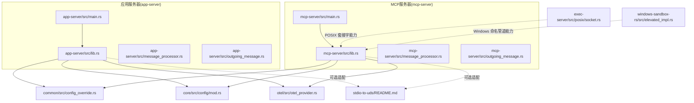
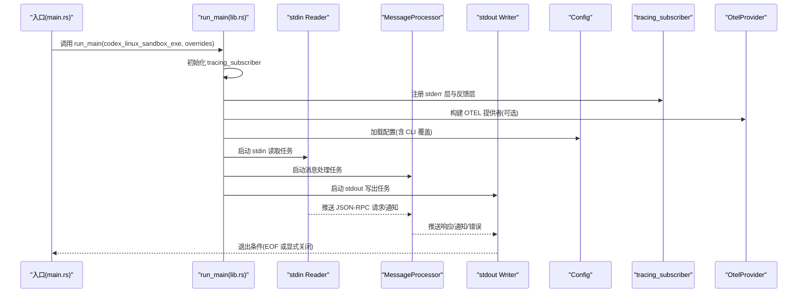
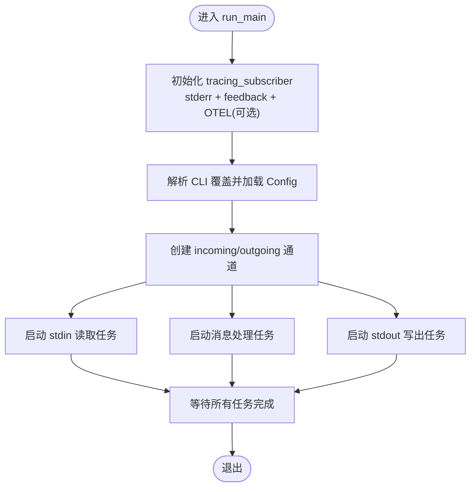
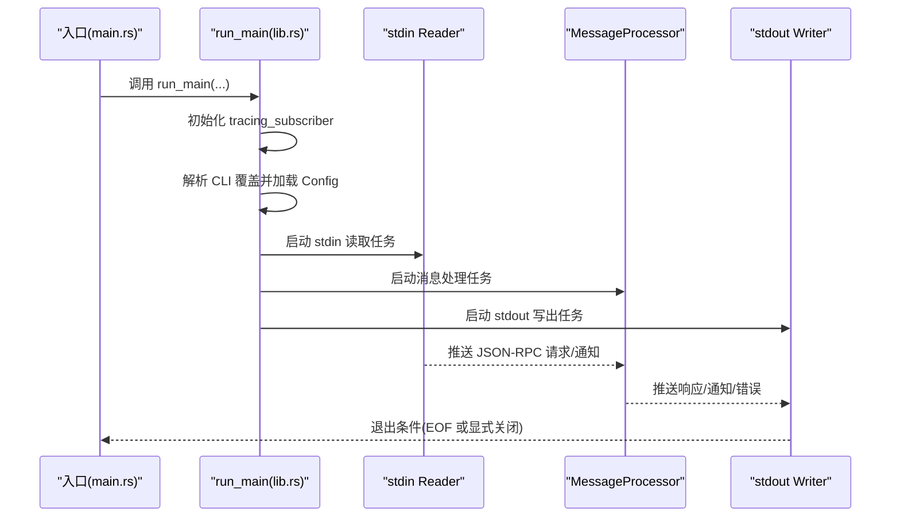
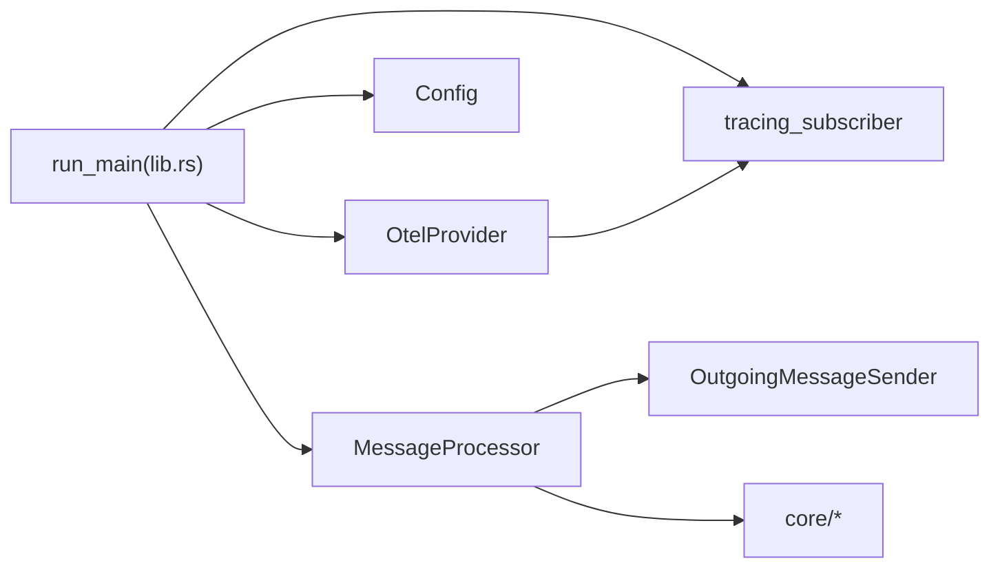

# 服务启动与初始化

<cite>
**本文引用的文件**
- [app-server 主程序入口 main.rs](file://codex-rs/app-server/src/main.rs)
- [app-server 核心库 lib.rs](file://codex-rs/app-server/src/lib.rs)
- [app-server 消息处理器 message_processor.rs](file://codex-rs/app-server/src/message_processor.rs)
- [app-server 出站消息发送器 outgoing_message.rs](file://codex-rs/app-server/src/outgoing_message.rs)
- [mcp-server 主程序入口 main.rs](file://codex-rs/mcp-server/src/main.rs)
- [mcp-server 核心库 lib.rs](file://codex-rs/mcp-server/src/lib.rs)
- [mcp-server 消息处理器 message_processor.rs](file://codex-rs/mcp-server/src/message_processor.rs)
- [mcp-server 出站消息发送器 outgoing_message.rs](file://codex-rs/mcp-server/src/outgoing_message.rs)
- [通用配置覆盖 CliConfigOverrides](file://codex-rs/common/src/config_override.rs)
- [核心配置加载 Config](file://codex-rs/core/src/config/mod.rs)
- [OpenTelemetry 提供者 OtelProvider](file://codex-rs/otel/src/otel_provider.rs)
- [stdio-to-uds 适配器 README](file://codex-rs/stdio-to-uds/README.md)
- [exec-server POSIX 套接字实现](file://codex-rs/exec-server/src/posix/socket.rs)
- [windows-sandbox 命名管道实现](file://codex-rs/windows-sandbox-rs/src/elevated_impl.rs)
</cite>

## 目录
1. [引言](#引言)
2. [项目结构](#项目结构)
3. [核心组件](#核心组件)
4. [架构总览](#架构总览)
5. [详细组件分析](#详细组件分析)
6. [依赖关系分析](#依赖关系分析)
7. [性能考量](#性能考量)
8. [故障排查指南](#故障排查指南)
9. [结论](#结论)
10. [附录](#附录)

## 引言
本文件聚焦于MCP服务器（以及应用服务器）的启动与初始化流程，围绕以下目标展开：
- 解析 app-server 与 mcp-server 的入口与运行主函数，梳理异步事件循环、通道与任务模型
- 说明 Unix 域套接字（UDS）与 Windows 命名管道在传输层的使用现状与替代方案
- 阐述配置加载、日志初始化与可观测性（OTEL）集成
- 总结信号处理与优雅关闭的实现方式
- 提供启动失败的常见原因与排查方法，并给出自定义服务器绑定地址与权限设置的实践建议

## 项目结构
本仓库包含多个子项目，其中与“服务启动与初始化”直接相关的核心模块如下：
- app-server：面向应用客户端的 JSON-RPC 服务，通过标准输入输出进行通信
- mcp-server：面向 MCP 协议的工具调用服务，同样通过标准输入输出进行通信
- common：通用 CLI 配置覆盖解析
- core：配置加载与类型定义
- otel：OpenTelemetry 初始化与日志/追踪桥接
- exec-server：POSIX 环境下的套接字与 FD 传递能力
- stdio-to-uds：将标准输入输出适配为 UNIX 域套接字的桥接工具
- windows-sandbox：Windows 平台命名管道与沙箱安全策略

图表来源
- [app-server 主程序入口 main.rs](file://codex-rs/app-server/src/main.rs#L1-L11)
- [app-server 核心库 lib.rs](file://codex-rs/app-server/src/lib.rs#L45-L179)
- [mcp-server 主程序入口 main.rs](file://codex-rs/mcp-server/src/main.rs#L1-L11)
- [mcp-server 核心库 lib.rs](file://codex-rs/mcp-server/src/lib.rs#L47-L150)
- [通用配置覆盖 CliConfigOverrides](file://codex-rs/common/src/config_override.rs#L1-L94)
- [核心配置加载 Config](file://codex-rs/core/src/config/mod.rs#L300-L360)
- [OpenTelemetry 提供者 OtelProvider](file://codex-rs/otel/src/otel_provider.rs#L57-L189)
- [stdio-to-uds 适配器 README](file://codex-rs/stdio-to-uds/README.md#L1-L21)
- [exec-server POSIX 套接字实现](file://codex-rs/exec-server/src/posix/socket.rs#L246-L394)
- [windows-sandbox 命名管道实现](file://codex-rs/windows-sandbox-rs/src/elevated_impl.rs#L146-L188)

章节来源
- [app-server 主程序入口 main.rs](file://codex-rs/app-server/src/main.rs#L1-L11)
- [mcp-server 主程序入口 main.rs](file://codex-rs/mcp-server/src/main.rs#L1-L11)

## 核心组件
- 入口与事件循环
  - app-server 与 mcp-server 的 main.rs 通过统一的 run_main 入口启动，内部构建 Tokio 事件循环与多任务协作
  - 三个核心任务：stdin 读取、消息处理、stdout 写出，通过有界/无界通道连接
- 配置与日志
  - 通过 CliConfigOverrides 解析命令行覆盖项，合并到 Config 中
  - 初始化 tracing 订阅器，支持 stderr 输出与可选的反馈输出；同时可挂载 OTEL 日志/追踪层
- 传输层
  - 默认均采用标准输入输出（stdio）作为传输
  - 可通过 stdio-to-uds 将 stdio 适配为 UDS；Windows 使用命名管道
  - POSIX 环境下具备 UNIX 套接字与 FD 传递能力，Windows 通过命名管道实现跨进程通信

章节来源
- [app-server 核心库 lib.rs](file://codex-rs/app-server/src/lib.rs#L45-L179)
- [mcp-server 核心库 lib.rs](file://codex-rs/mcp-server/src/lib.rs#L47-L150)
- [通用配置覆盖 CliConfigOverrides](file://codex-rs/common/src/config_override.rs#L1-L94)
- [核心配置加载 Config](file://codex-rs/core/src/config/mod.rs#L300-L360)
- [OpenTelemetry 提供者 OtelProvider](file://codex-rs/otel/src/otel_provider.rs#L57-L189)
- [stdio-to-uds 适配器 README](file://codex-rs/stdio-to-uds/README.md#L1-L21)

## 架构总览
下图展示了两条主线：应用服务器与 MCP 服务器的启动与运行时交互。

图表来源
- [app-server 主程序入口 main.rs](file://codex-rs/app-server/src/main.rs#L1-L11)
- [app-server 核心库 lib.rs](file://codex-rs/app-server/src/lib.rs#L45-L179)
- [mcp-server 主程序入口 main.rs](file://codex-rs/mcp-server/src/main.rs#L1-L11)
- [mcp-server 核心库 lib.rs](file://codex-rs/mcp-server/src/lib.rs#L47-L150)
- [OpenTelemetry 提供者 OtelProvider](file://codex-rs/otel/src/otel_provider.rs#L57-L189)

## 详细组件分析

### 应用服务器启动流程（app-server）
- 入口
  - main.rs 通过 arg0 分发器进入 run_main，传入可选的 codex-linux-sandbox 可执行路径与 CLI 覆盖
- 运行主函数
  - 初始化 tracing_subscriber，注册 stderr 与反馈输出层，可选挂载 OTEL 日志/追踪层
  - 解析 CLI 覆盖项，加载 Config
  - 创建双向通道：incoming/outgoing，容量均为 128
  - 启动三个任务：stdin 读取、消息处理、stdout 写出
  - 通过 tokio::join! 等待所有任务完成，典型退出路径为 stdin EOF
- 消息处理
  - MessageProcessor 在初始化后才处理除 initialize 外的请求
  - 支持配置读写 API 与 Codex 业务逻辑分派
- 出站消息
  - OutgoingMessageSender 维护请求回调映射，支持响应回调、通知与错误

图表来源
- [app-server 核心库 lib.rs](file://codex-rs/app-server/src/lib.rs#L45-L179)
- [app-server 消息处理器 message_processor.rs](file://codex-rs/app-server/src/message_processor.rs#L29-L73)
- [app-server 出站消息发送器 outgoing_message.rs](file://codex-rs/app-server/src/outgoing_message.rs#L22-L126)

章节来源
- [app-server 主程序入口 main.rs](file://codex-rs/app-server/src/main.rs#L1-L11)
- [app-server 核心库 lib.rs](file://codex-rs/app-server/src/lib.rs#L45-L179)
- [app-server 消息处理器 message_processor.rs](file://codex-rs/app-server/src/message_processor.rs#L29-L73)
- [app-server 出站消息发送器 outgoing_message.rs](file://codex-rs/app-server/src/outgoing_message.rs#L22-L126)

### MCP 服务器启动流程（mcp-server）
- 入口
  - main.rs 通过 arg0 分发器进入 run_main，传入可选的 codex-linux-sandbox 可执行路径与 CLI 覆盖
- 运行主函数
  - 初始化 tracing_subscriber，注册 stderr 层
  - 解析 CLI 覆盖项，加载 Config
  - 创建通道：incoming 有界通道，outgoing 无界通道
  - 启动三个任务：stdin 读取、消息处理、stdout 写出
  - 通过 tokio::join! 等待所有任务完成
- 消息处理
  - MessageProcessor 实现 MCP 协议的 initialize/ping/list/resources/tools 等请求处理
  - 对工具调用（如 codex、codex-reply）会派生长任务并回传事件通知
- 出站消息
  - OutgoingMessageSender 将 OutgoingMessage 转换为 JSON-RPC 消息并写出

图表来源
- [mcp-server 主程序入口 main.rs](file://codex-rs/mcp-server/src/main.rs#L1-L11)
- [mcp-server 核心库 lib.rs](file://codex-rs/mcp-server/src/lib.rs#L47-L150)
- [mcp-server 消息处理器 message_processor.rs](file://codex-rs/mcp-server/src/message_processor.rs#L47-L126)
- [mcp-server 出站消息发送器 outgoing_message.rs](file://codex-rs/mcp-server/src/outgoing_message.rs#L138-L179)

章节来源
- [mcp-server 主程序入口 main.rs](file://codex-rs/mcp-server/src/main.rs#L1-L11)
- [mcp-server 核心库 lib.rs](file://codex-rs/mcp-server/src/lib.rs#L47-L150)
- [mcp-server 消息处理器 message_processor.rs](file://codex-rs/mcp-server/src/message_processor.rs#L47-L126)
- [mcp-server 出站消息发送器 outgoing_message.rs](file://codex-rs/mcp-server/src/outgoing_message.rs#L138-L179)

### 配置加载与日志初始化
- 配置加载
  - 通过 CliConfigOverrides.parse_overrides 解析 -c key=value 形式的覆盖
  - Config.load_with_cli_overrides 合并 CLI 覆盖与磁盘配置，生成最终配置
- 日志初始化
  - tracing_subscriber::fmt 层输出到 stderr，支持 RUST_LOG 控制级别
  - 可选注册反馈层与 OTEL 日志/追踪层，实现统一可观测性
- OTEL
  - OtelProvider 根据配置构建日志与追踪提供者，支持 TRACEPARENT 上下文传播

章节来源
- [通用配置覆盖 CliConfigOverrides](file://codex-rs/common/src/config_override.rs#L1-L94)
- [核心配置加载 Config](file://codex-rs/core/src/config/mod.rs#L300-L360)
- [app-server 核心库 lib.rs](file://codex-rs/app-server/src/lib.rs#L101-L123)
- [mcp-server 核心库 lib.rs](file://codex-rs/mcp-server/src/lib.rs#L51-L57)
- [OpenTelemetry 提供者 OtelProvider](file://codex-rs/otel/src/otel_provider.rs#L57-L189)

### 传输层：Unix 域套接字与 Windows 命名管道
- 默认传输
  - 两个服务器均以标准输入输出作为默认传输
- UDS 适配
  - stdio-to-uds 提供将 stdio 适配为 UNIX 域套接字的能力，便于通过文件权限限制访问
  - 可通过配置将 MCP 服务器命令指向该适配器，从而以 UDS 方式暴露服务
- Windows 命名管道
  - Windows 平台可通过命名管道实现与客户端的通信
  - windows-sandbox-rs 提供了创建命名管道并授予访问权限的实现思路
- POSIX 套接字能力
  - exec-server 的 posix/socket.rs 展示了 UNIX 套接字与 FD 传递的实现细节，可用于理解底层传输能力

章节来源
- [stdio-to-uds 适配器 README](file://codex-rs/stdio-to-uds/README.md#L1-L21)
- [windows-sandbox 命名管道实现](file://codex-rs/windows-sandbox-rs/src/elevated_impl.rs#L146-L188)
- [exec-server POSIX 套接字实现](file://codex-rs/exec-server/src/posix/socket.rs#L246-L394)

### 信号处理与优雅关闭
- 当前实现
  - 两个服务器均通过 tokio::join! 等待任务完成，典型退出路径为 stdin EOF
  - 未见显式安装 SIGTERM/SIGINT 处理器
- 建议
  - 在生产环境中建议增加信号监听，收到终止信号后主动关闭通道、清理资源并优雅退出
  - 可参考 tokio::signal::ctrl_c 或 tokio::signal::unix::Signal

章节来源
- [app-server 核心库 lib.rs](file://codex-rs/app-server/src/lib.rs#L173-L179)
- [mcp-server 核心库 lib.rs](file://codex-rs/mcp-server/src/lib.rs#L144-L150)

## 依赖关系分析
- 组件耦合
  - run_main 依赖 tracing_subscriber、Config、MessageProcessor、OutgoingMessageSender
  - MessageProcessor 依赖 Config、ConversationManager、AuthManager 等核心组件
  - OutgoingMessageSender 仅依赖通道与序列化，内聚度高
- 外部依赖
  - OTEL 提供者用于日志与追踪桥接
  - stdio-to-uds 作为可选外部适配器
  - POSIX/Windows 套接字能力由各自平台实现提供

图表来源
- [app-server 核心库 lib.rs](file://codex-rs/app-server/src/lib.rs#L45-L179)
- [mcp-server 核心库 lib.rs](file://codex-rs/mcp-server/src/lib.rs#L47-L150)
- [OpenTelemetry 提供者 OtelProvider](file://codex-rs/otel/src/otel_provider.rs#L57-L189)
- [核心配置加载 Config](file://codex-rs/core/src/config/mod.rs#L300-L360)

## 性能考量
- 通道容量
  - 两个服务器均使用容量为 128 的有界通道，平衡吞吐与内存占用
- 任务模型
  - 三任务模型简单可靠，适合交互式 CLI 场景
- 日志与 OTEL
  - 建议在高负载场景下调低日志级别或减少 OTEL 开销
- 传输层
  - UDS/命名管道相比 HTTP 具备更低的系统开销，但需注意权限与路径管理

章节来源
- [app-server 核心库 lib.rs](file://codex-rs/app-server/src/lib.rs#L40-L46)
- [mcp-server 核心库 lib.rs](file://codex-rs/mcp-server/src/lib.rs#L42-L46)

## 故障排查指南
- 启动失败常见原因
  - 配置解析错误：-c 覆盖项格式不正确或值无法 TOML 解析
  - 配置加载失败：磁盘配置文件损坏或权限不足
  - OTEL 初始化失败：导出器配置无效或网络不可达
  - 传输问题：stdio 无法读写或被上游适配器中断
- 定位步骤
  - 设置 RUST_LOG 提升日志级别，观察 stderr 与反馈输出
  - 检查 -c 覆盖项是否符合 toml::Value 规范
  - 若使用 stdio-to-uds，确认 UDS 文件路径存在且权限允许
  - 若使用 Windows 命名管道，确认管道名称与 ACL 配置正确
- 建议
  - 在开发环境先以 stderr 日志为主，逐步引入 OTEL
  - 对于 MCP 工具调用失败，检查 MessageProcessor 的工具参数与会话状态

章节来源
- [通用配置覆盖 CliConfigOverrides](file://codex-rs/common/src/config_override.rs#L1-L94)
- [核心配置加载 Config](file://codex-rs/core/src/config/mod.rs#L300-L360)
- [OpenTelemetry 提供者 OtelProvider](file://codex-rs/otel/src/otel_provider.rs#L57-L189)
- [stdio-to-uds 适配器 README](file://codex-rs/stdio-to-uds/README.md#L1-L21)
- [windows-sandbox 命名管道实现](file://codex-rs/windows-sandbox-rs/src/elevated_impl.rs#L146-L188)

## 结论
- app-server 与 mcp-server 采用一致的启动模式：入口分发、run_main 初始化、三任务模型与通道编排
- 默认传输为 stdio，可通过 stdio-to-uds 适配为 UDS，Windows 使用命名管道
- 配置与日志初始化完善，支持 CLI 覆盖与 OTEL 集成
- 信号处理与优雅关闭可按需增强，建议在生产环境加入显式信号监听

## 附录

### 自定义服务器绑定地址与权限设置
- 使用 stdio-to-uds 将 MCP 服务器暴露为 UDS
  - 在配置中指定 MCP 服务器命令为 stdio-to-uds，并传入 UDS 路径
  - 通过文件系统权限控制访问
- Windows 命名管道
  - 使用命名管道作为传输，授予合适的 ACL 以便客户端连接
- POSIX 套接字
  - 利用 exec-server 的套接字与 FD 传递能力，实现更灵活的传输模型

章节来源
- [stdio-to-uds 适配器 README](file://codex-rs/stdio-to-uds/README.md#L1-L21)
- [windows-sandbox 命名管道实现](file://codex-rs/windows-sandbox-rs/src/elevated_impl.rs#L146-L188)
- [exec-server POSIX 套接字实现](file://codex-rs/exec-server/src/posix/socket.rs#L246-L394)