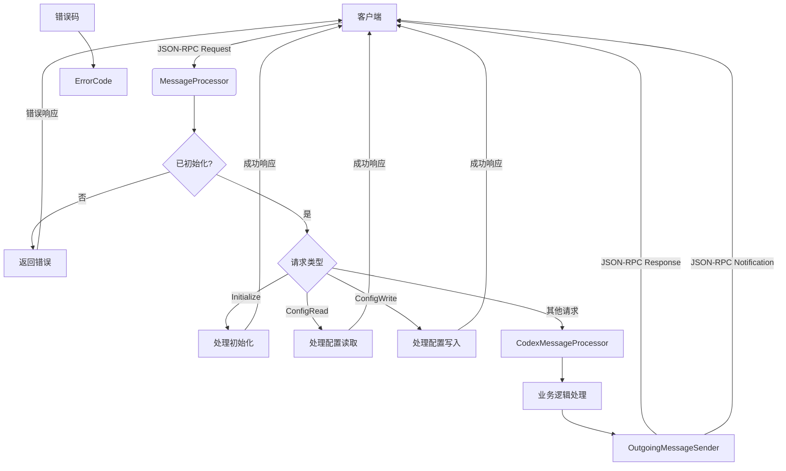

# 消息处理机制

<cite>
**本文档引用的文件**   
- [message_processor.rs](file://codex-rs/app-server/src/message_processor.rs)
- [outgoing_message.rs](file://codex-rs/app-server/src/outgoing_message.rs)
- [error_code.rs](file://codex-rs/app-server/src/error_code.rs)
- [message_processor.rs](file://codex-rs/mcp-server/src/message_processor.rs)
- [outgoing_message.rs](file://codex-rs/mcp-server/src/outgoing_message.rs)
- [error_code.rs](file://codex-rs/mcp-server/src/error_code.rs)
- [codex_tool_runner.rs](file://codex-rs/mcp-server/src/codex_tool_runner.rs)
- [send_message.rs](file://codex-rs/app-server/tests/suite/send_message.rs)
- [responses.rs](file://codex-rs/app-server/tests/common/responses.rs)
</cite>

## 目录
1. [引言](#引言)
2. [消息处理器架构](#消息处理器架构)
3. [JSON-RPC请求解析与路由](#json-rpc请求解析与路由)
4. [响应消息结构与序列化](#响应消息结构与序列化)
5. [错误处理机制](#错误处理机制)
6. [消息处理数据流示例](#消息处理数据流示例)
7. [性能优化建议](#性能优化建议)
8. [结论](#结论)

## 引言
本技术文档深入剖析Codex项目中MCP（Model Context Protocol）消息处理器的核心实现。文档详细阐述了`message_processor.rs`中如何解析来自Codex核心的JSON-RPC请求，执行方法路由，并生成响应。同时，解释了`outgoing_message.rs`中定义的响应消息结构及其序列化过程。结合`error_code.rs`中的错误码体系，说明了不同异常场景下的错误处理策略和返回格式。通过实际请求/响应示例，展示了消息处理的完整数据流，并提供了性能优化建议。

## 消息处理器架构



**图表来源**
- [message_processor.rs](file://codex-rs/app-server/src/message_processor.rs#L75-L161)
- [outgoing_message.rs](file://codex-rs/app-server/src/outgoing_message.rs#L78-L97)
- [error_code.rs](file://codex-rs/app-server/src/error_code.rs#L1-L3)

**章节来源**
- [message_processor.rs](file://codex-rs/app-server/src/message_processor.rs#L29-L211)

## JSON-RPC请求解析与路由

MCP消息处理器的核心功能是解析和路由JSON-RPC请求。`MessageProcessor`结构体负责接收原始的JSON-RPC请求，并将其分发到相应的处理函数。

请求处理流程如下：
1.  **初始化检查**：所有请求在处理前都会检查服务器是否已初始化。如果未初始化，将返回`-32600`错误码。
2.  **请求反序列化**：使用`serde_json`将JSON字符串反序列化为`JSONRPCRequest`结构体。
3.  **客户端请求转换**：将`JSONRPCRequest`转换为项目定义的`ClientRequest`枚举，该枚举包含了所有支持的请求类型，如`Initialize`、`ConfigRead`、`ConfigValueWrite`等。
4.  **方法路由**：通过`match`语句，根据`ClientRequest`的类型将请求路由到不同的处理函数。例如，`ConfigRead`请求会被路由到`handle_config_read`函数。

对于MCP服务器，`MessageProcessor`还实现了`McpClientRequest`的转换，支持`ListTools`、`CallTool`等MCP协议特有的请求。

**章节来源**
- [message_processor.rs](file://codex-rs/app-server/src/message_processor.rs#L75-L161)
- [message_processor.rs](file://codex-rs/mcp-server/src/message_processor.rs#L72-L125)

## 响应消息结构与序列化

响应消息的生成和发送由`OutgoingMessageSender`负责。该组件定义了服务器向客户端发送消息的统一接口。

### 响应消息结构
`OutgoingMessage`是一个枚举，定义了服务器可以发送的所有消息类型：
-   **Request**：向客户端发起一个JSON-RPC请求。
-   **Notification**：向客户端发送一个通知，无需响应。
-   **Response**：对客户端请求的响应。
-   **Error**：对客户端请求的错误响应。

`OutgoingResponse`结构体封装了响应ID和结果，而`OutgoingError`则封装了错误ID和错误详情。

### 序列化过程
当调用`send_response`方法时，会发生以下序列化过程：
1.  **结果序列化**：使用`serde_json::to_value`将泛型`T`的响应结果序列化为`serde_json::Value`。
2.  **构建响应消息**：将序列化后的结果和请求ID封装进`OutgoingResponse`结构体。
3.  **构建最终消息**：将`OutgoingResponse`包装进`OutgoingMessage::Response`变体。
4.  **发送**：通过`mpsc::Sender`通道将`OutgoingMessage`发送给stdout写入器任务。
5.  **最终序列化**：在stdout写入器任务中，`OutgoingMessage`被转换为`JSONRPCMessage`，然后使用`serde_json::to_string`序列化为JSON字符串，并写入标准输出。

**章节来源**
- [outgoing_message.rs](file://codex-rs/app-server/src/outgoing_message.rs#L127-L138)
- [outgoing_message.rs](file://codex-rs/app-server/src/outgoing_message.rs#L78-L97)
- [lib.rs](file://codex-rs/app-server/src/lib.rs#L150-L179)

## 错误处理机制

系统定义了一套清晰的错误码体系，用于在不同异常场景下向客户端返回标准化的错误信息。

### 错误码定义
在`error_code.rs`文件中，定义了两个核心错误码：
-   **INVALID_REQUEST_ERROR_CODE (-32600)**：表示请求无效，例如JSON解析失败或服务器未初始化时收到请求。
-   **INTERNAL_ERROR_CODE (-32603)**：表示服务器内部错误，例如响应序列化失败。

### 错误处理策略
错误处理策略贯穿于整个消息处理流程：
1.  **请求解析阶段**：如果`serde_json::to_value`或`serde_json::from_value`失败，处理器会立即构造一个`JSONRPCErrorError`对象，使用`INVALID_REQUEST_ERROR_CODE`，并调用`outgoing.send_error`发送错误响应。
2.  **业务逻辑阶段**：在处理配置读写等操作时，如果`config_api`返回`Err`，处理器会直接将错误转发给`outgoing.send_error`。
3.  **响应序列化阶段**：在`send_response`方法内部，如果`serde_json::to_value`失败，会捕获此内部错误，并使用`INTERNAL_ERROR_CODE`发送一个更高级别的错误响应。

这种分层的错误处理方式确保了客户端能够获得清晰、一致的错误反馈。

**章节来源**
- [error_code.rs](file://codex-rs/app-server/src/error_code.rs#L1-L3)
- [message_processor.rs](file://codex-rs/app-server/src/message_processor.rs#L79-L86)
- [outgoing_message.rs](file://codex-rs/app-server/src/outgoing_message.rs#L87-L96)

## 消息处理数据流示例

以下是一个完整的`sendUserMessage`请求/响应数据流示例，展示了从客户端请求到服务器响应的全过程。

### 请求示例
```json
{
  "jsonrpc": "2.0",
  "id": 1,
  "method": "sendUserMessage",
  "params": {
    "conversation_id": "c123",
    "items": [
      {
        "type": "text",
        "text": "Hello, Codex!"
      }
    ]
  }
}
```

### 处理流程
1.  `MessageProcessor::process_request`接收到上述JSON。
2.  请求被反序列化为`JSONRPCRequest`，然后转换为`ClientRequest::SendUserMessage`。
3.  由于`SendUserMessage`不是`MessageProcessor`直接处理的请求，它被转发给`codex_message_processor`。
4.  `CodexMessageProcessor`处理用户消息，可能触发一系列内部事件（如`session_configured`, `task_complete`）。
5.  `OutgoingMessageSender`将这些事件作为通知发送回客户端。

### 响应与通知示例
**响应 (Response)**
```json
{
  "jsonrpc": "2.0",
  "id": 1,
  "result": {}
}
```

**通知 (Notification)**
```json
{
  "jsonrpc": "2.0",
  "method": "codex/event",
  "params": {
    "id": "e1",
    "msg": {
      "type": "session_configured",
      "session_id": "c123",
      "model": "gpt-4o"
    }
  }
}
```
```json
{
  "jsonrpc": "2.0",
  "method": "codex/event",
  "params": {
    "id": "e2",
    "msg": {
      "type": "task_complete",
      "conversation_id": "c123"
    }
  }
}
```

**章节来源**
- [send_message.rs](file://codex-rs/app-server/tests/suite/send_message.rs#L88-L103)
- [responses.rs](file://codex-rs/app-server/tests/common/responses.rs#L43-L59)

## 性能优化建议

基于对代码的分析，提出以下性能优化建议：

1.  **减少序列化开销**：`send_response`方法中对响应结果进行了两次序列化（一次在`send_response`内部，一次在stdout写入器）。可以考虑优化`OutgoingMessage`的设计，使其能直接持有`serde_json::Value`，从而避免在`send_response`中的第一次序列化。
2.  **异步处理**：对于耗时较长的业务逻辑（如`handle_call_tool`），代码已使用`tokio::spawn`将其放入独立的异步任务中执行，这有效避免了阻塞主消息处理循环，是良好的实践。
3.  **连接复用**：确保与后端服务（如模型服务器）的HTTP连接被复用，避免为每个请求建立新的TCP连接。这通常由HTTP客户端库（如`reqwest`）自动管理，但需确认配置正确。
4.  **批量处理**：对于频繁的小型请求（如配置读取），可以考虑实现客户端的批量请求功能，减少网络往返次数。

## 结论
Codex的MCP消息处理器通过清晰的分层架构实现了高效、可靠的JSON-RPC通信。`MessageProcessor`负责请求的解析与路由，`OutgoingMessageSender`负责响应的构建与发送，而`error_code.rs`则提供了统一的错误处理标准。整个系统利用Rust的强类型和`serde`库实现了类型安全的序列化/反序列化，并通过异步任务处理长时操作，保证了消息处理的高性能和低延迟。通过遵循本文档的分析和建议，可以进一步优化系统的性能和稳定性。