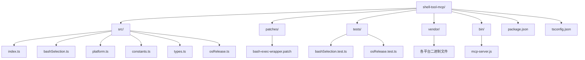
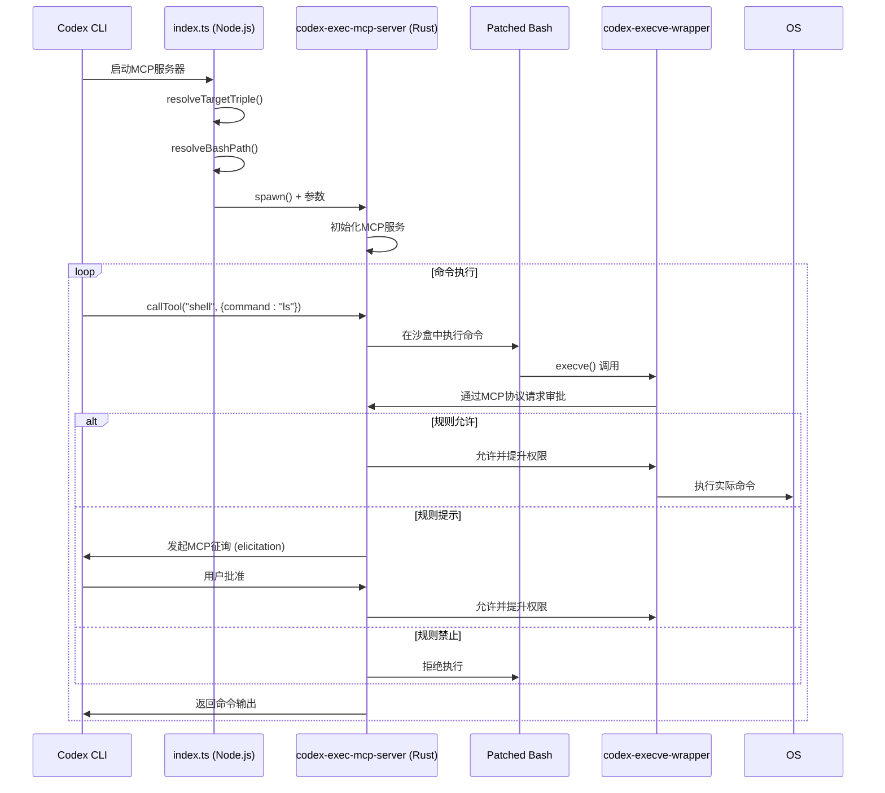
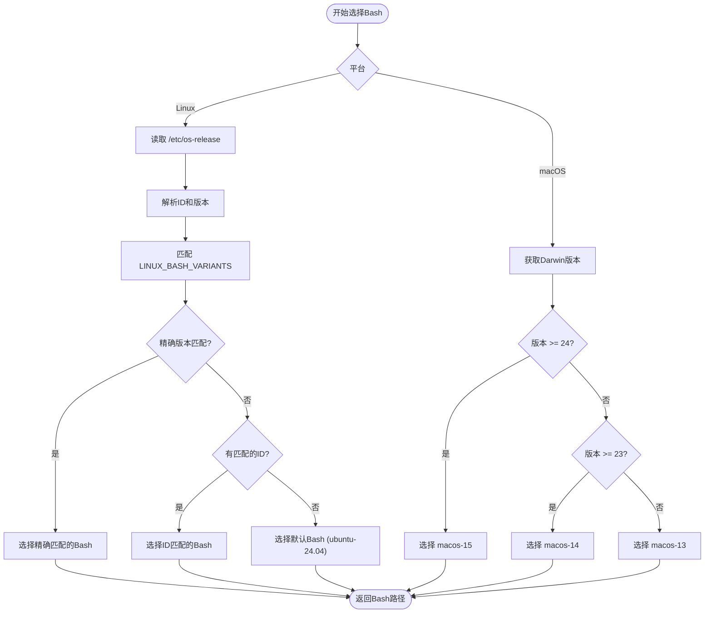
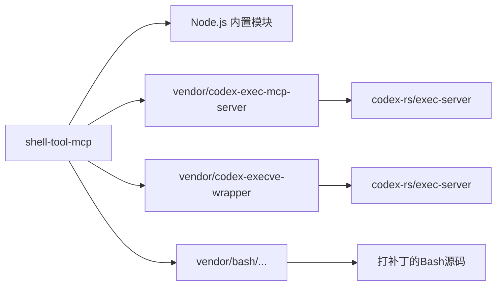

# Shell工具MCP服务器

<cite>
**本文档引用的文件**
- [index.ts](file://shell-tool-mcp/src/index.ts)
- [bashSelection.ts](file://shell-tool-mcp/src/bashSelection.ts)
- [platform.ts](file://shell-tool-mcp/src/platform.ts)
- [bash-exec-wrapper.patch](file://shell-tool-mcp/patches/bash-exec-wrapper.patch)
- [constants.ts](file://shell-tool-mcp/src/constants.ts)
- [types.ts](file://shell-tool-mcp/src/types.ts)
- [osRelease.ts](file://shell-tool-mcp/src/osRelease.ts)
- [package.json](file://shell-tool-mcp/package.json)
- [README.md](file://shell-tool-mcp/README.md)
- [mcp-server.rs](file://codex-rs/mcp-server/src/lib.rs)
- [message_processor.rs](file://codex-rs/mcp-server/src/message_processor.rs)
- [posix.rs](file://codex-rs/exec-server/src/posix.rs)
</cite>

## 目录
1. [简介](#简介)
2. [项目结构](#项目结构)
3. [核心组件](#核心组件)
4. [架构概述](#架构概述)
5. [详细组件分析](#详细组件分析)
6. [依赖分析](#依赖分析)
7. [性能考量](#性能考量)
8. [故障排除指南](#故障排除指南)
9. [结论](#结论)

## 简介
`shell-tool-mcp`是Codex平台的一个MCP（Model Context Protocol）服务器扩展，旨在为AI代理提供安全执行shell命令的能力。该扩展通过一个沙盒化的Bash解释器来拦截和控制进程的创建，确保所有命令执行都符合预定义的安全策略。用户可以通过Codex的`.rules`文件定义命令处理规则，实现对命令执行的精细控制。本文档将深入分析该扩展的实现机制，包括MCP服务入口、工具注册、Bash解释器选择、平台检测以及安全补丁的应用。

## 项目结构
`shell-tool-mcp`目录包含了一个完整的TypeScript项目，其结构清晰地分离了源代码、测试、补丁和构建配置。

**Diagram sources**
- [index.ts](file://shell-tool-mcp/src/index.ts)
- [bashSelection.ts](file://shell-tool-mcp/src/bashSelection.ts)
- [platform.ts](file://shell-tool-mcp/src/platform.ts)
- [constants.ts](file://shell-tool-mcp/src/constants.ts)
- [types.ts](file://shell-tool-mcp/src/types.ts)
- [osRelease.ts](file://shell-tool-mcp/src/osRelease.ts)
- [bash-exec-wrapper.patch](file://shell-tool-mcp/patches/bash-exec-wrapper.patch)

**Section sources**
- [package.json](file://shell-tool-mcp/package.json)
- [README.md](file://shell-tool-mcp/README.md)

## 核心组件
`shell-tool-mcp`的核心功能由几个关键组件协同实现：`index.ts`作为MCP服务的入口点，负责启动底层的Rust二进制服务器；`bashSelection.ts`和`platform.ts`负责在运行时动态选择和配置合适的Bash解释器和平台特定的二进制文件；`patches/bash-exec-wrapper.patch`则通过修改Bash源码，实现了对`execve`系统调用的拦截，这是整个安全机制的基石。

**Section sources**
- [index.ts](file://shell-tool-mcp/src/index.ts#L1-L97)
- [bashSelection.ts](file://shell-tool-mcp/src/bashSelection.ts#L1-L116)
- [platform.ts](file://shell-tool-mcp/src/platform.ts#L1-L22)
- [bash-exec-wrapper.patch](file://shell-tool-mcp/patches/bash-exec-wrapper.patch#L1-L25)

## 架构概述
该MCP服务器采用分层架构。最上层是用TypeScript编写的`index.ts`，它作为一个轻量级的启动器（launcher），负责解析Node.js运行时的平台和架构信息，并从`vendor`目录中选择正确的预编译二进制文件。中间层是用Rust编写的`codex-exec-mcp-server`，它实现了MCP协议，处理来自Codex客户端的请求，并管理沙盒化的Bash会话。最底层是经过特殊补丁的Bash解释器，它通过`BASH_EXEC_WRAPPER`环境变量，将每个`execve`调用重定向回MCP服务器进行审批。

**Diagram sources**
- [index.ts](file://shell-tool-mcp/src/index.ts#L11-L97)
- [posix.rs](file://codex-rs/exec-server/src/posix.rs#L109-L157)
- [bash-exec-wrapper.patch](file://shell-tool-mcp/patches/bash-exec-wrapper.patch#L1-L25)

## 详细组件分析

### MCP服务入口与工具注册
`index.ts`是整个MCP服务器的入口。其`main`函数首先根据Node.js的`process.platform`和`process.arch`确定目标平台三元组（如`x86_64-unknown-linux-musl`），然后定位到`vendor`目录下的相应二进制文件。接着，它调用`resolveBashPath`来选择一个与当前操作系统匹配的Bash解释器。在验证所有必需的二进制文件（MCP服务器、exec包装器和Bash）都存在后，它使用`child_process.spawn`启动`codex-exec-mcp-server`，并将`--execve`和`--bash`参数传递给它，从而完成对底层Rust服务器的配置。这个启动器本身不直接处理MCP协议，而是作为桥梁，将Node.js环境与高性能的Rust后端连接起来。

**Section sources**
- [index.ts](file://shell-tool-mcp/src/index.ts#L11-L97)
- [package.json](file://shell-tool-mcp/package.json#L7-L8)

### Bash解释器选择与平台检测
`bashSelection.ts`和`platform.ts`共同解决了跨平台兼容性问题。`platform.ts`中的`resolveTargetTriple`函数将Node.js的平台和架构映射到Rust的平台三元组，用于选择正确的二进制文件。`bashSelection.ts`则更进一步，它根据操作系统的具体发行版和版本来选择最匹配的Bash构建。对于Linux，它通过读取`/etc/os-release`文件获取`id`和`version_id`，然后与`constants.ts`中定义的`LINUX_BASH_VARIANTS`列表进行匹配，优先选择精确版本匹配的变体，否则回退到第一个可用的变体。对于macOS，它根据Darwin内核版本号来选择对应的`macos-15`、`macos-14`或`macos-13`构建。这种精细化的选择确保了Bash解释器与宿主系统的高度兼容性。

**Diagram sources**
- [platform.ts](file://shell-tool-mcp/src/platform.ts#L1-L22)
- [bashSelection.ts](file://shell-tool-mcp/src/bashSelection.ts#L10-L115)
- [constants.ts](file://shell-tool-mcp/src/constants.ts#L3-L20)
- [osRelease.ts](file://shell-tool-mcp/src/osRelease.ts#L1-L35)

**Section sources**
- [bashSelection.ts](file://shell-tool-mcp/src/bashSelection.ts#L1-L116)
- [platform.ts](file://shell-tool-mcp/src/platform.ts#L1-L22)
- [osRelease.ts](file://shell-tool-mcp/src/osRelease.ts#L1-L35)

### Bash执行包装补丁
`patches/bash-exec-wrapper.patch`是整个安全模型的核心。该补丁修改了Bash源码中的`shell_execve`函数，在调用`execve`系统调用之前，检查是否存在名为`BASH_EXEC_WRAPPER`的环境变量。如果该变量存在且非空，Bash会将原始的`command`和`args`数组向后移动两位，并将`args[0]`和`args[1]`分别设置为包装器程序的路径和原始命令的路径，然后执行包装器程序。在`shell-tool-mcp`的上下文中，这个包装器就是`codex-execve-wrapper`，它会将`execve`调用的详细信息（要执行的程序和参数）通过MCP协议发送回`codex-exec-mcp-server`进行审批。这使得MCP服务器能够在命令实际执行前对其进行拦截和控制，从而实现了强大的安全策略执行能力。

**Section sources**
- [bash-exec-wrapper.patch](file://shell-tool-mcp/patches/bash-exec-wrapper.patch#L1-L25)
- [README.md](file://shell-tool-mcp/README.md#L5-L22)

## 依赖分析
`shell-tool-mcp`的依赖关系清晰且分层。其直接依赖主要是Node.js的内置模块（如`child_process`、`fs`、`os`、`path`），用于实现启动器逻辑。其真正的功能依赖于`vendor`目录中预编译的Rust二进制文件，这些二进制文件是`codex-rs`仓库中`exec-server`等组件的编译产物。`shell-tool-mcp`本身不直接依赖`codex-rs`的Rust代码，而是通过打包和分发这些二进制文件来实现功能。这种设计将复杂的系统级操作与相对简单的启动器逻辑分离，提高了可维护性和安全性。

**Diagram sources**
- [package.json](file://shell-tool-mcp/package.json#L32-L38)
- [README.md](file://shell-tool-mcp/README.md#L89-L93)

**Section sources**
- [index.ts](file://shell-tool-mcp/src/index.ts#L3-L9)
- [README.md](file://shell-tool-mcp/README.md#L89-L93)

## 性能考量
由于`shell-tool-mcp`在每次`execve`调用时都需要与MCP服务器进行通信，这不可避免地引入了性能开销。然而，这种开销是安全性的必要代价。为了最小化影响，底层的Rust服务器使用了异步I/O（通过Tokio运行时），能够高效地处理并发请求。此外，`index.ts`启动器的设计非常轻量，它在启动底层服务器后几乎不消耗额外资源。性能瓶颈主要在于网络或进程间通信的延迟，而不是启动器本身。对于需要频繁执行大量命令的场景，用户应权衡安全性和性能需求。

## 故障排除指南
当`shell-tool-mcp`无法正常工作时，可以按照以下步骤进行排查：
1.  **检查二进制文件**: 确保`vendor`目录下存在对应平台的`codex-exec-mcp-server`、`codex-execve-wrapper`和Bash解释器。`index.ts`在启动时会检查这些文件的存在。
2.  **验证Node.js版本**: 确保Node.js版本为18或更高，这在`package.json`中有明确要求。
3.  **查看日志**: `codex-exec-mcp-server`会将日志输出到stderr，检查是否有初始化错误或通信失败的信息。
4.  **检查`.rules`文件**: 确认`~/.codex/.rules`文件的语法正确，并且规则的`decision`字段（`allow`, `prompt`, `forbidden`）拼写无误。
5.  **确认MCP客户端**: 确保使用的是支持`codex/sandbox-state`能力的Codex客户端（如最新版CLI或VS Code插件）。

**Section sources**
- [index.ts](file://shell-tool-mcp/src/index.ts#L26-L32)
- [README.md](file://shell-tool-mcp/README.md#L26-L37)
- [mcp-server.rs](file://codex-rs/mcp-server/src/lib.rs#L53-L56)

## 结论
`shell-tool-mcp`是一个设计精巧的MCP服务器扩展，它通过结合TypeScript启动器、Rust后端和打补丁的Bash解释器，为Codex提供了一种强大且安全的shell命令执行机制。其核心创新在于利用`BASH_EXEC_WRAPPER`补丁，实现了对`execve`系统调用的精确拦截，从而能够基于完整的可执行路径而非模糊的命令名来执行安全策略。这种架构不仅提高了安全性，还为用户提供了通过`.rules`文件进行细粒度控制的能力。尽管存在一定的性能开销，但其在安全性和功能性之间取得了良好的平衡，是Codex生态系统中一个关键的安全组件。