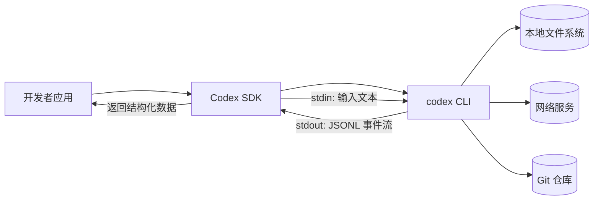
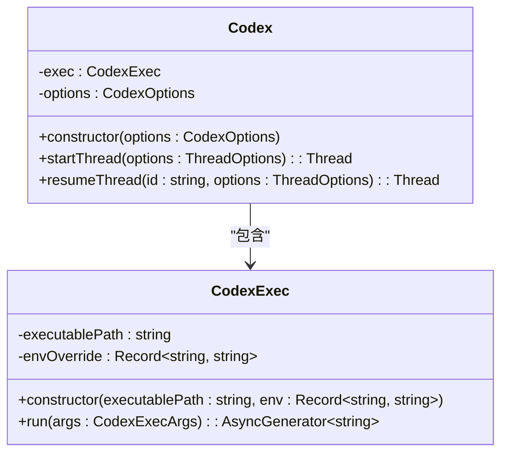
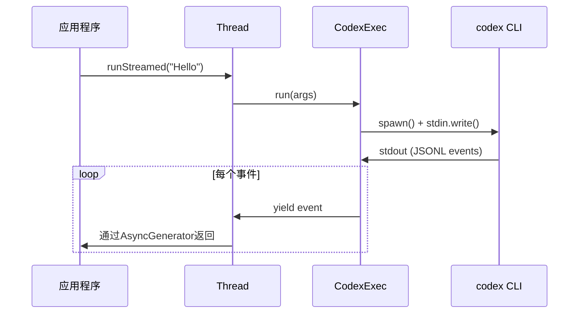
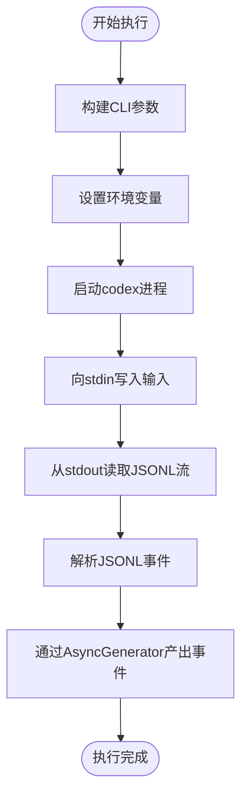
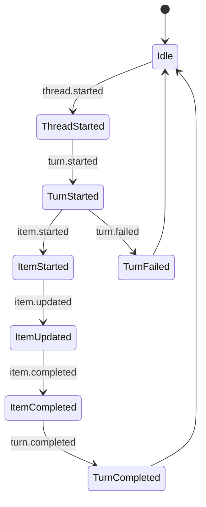

# TypeScript SDK

<cite>
**本文档中引用的文件**  
- [index.ts](file://sdk/typescript/src/index.ts)
- [codex.ts](file://sdk/typescript/src/codex.ts)
- [thread.ts](file://sdk/typescript/src/thread.ts)
- [exec.ts](file://sdk/typescript/src/exec.ts)
- [events.ts](file://sdk/typescript/src/events.ts)
- [threadOptions.ts](file://sdk/typescript/src/threadOptions.ts)
- [turnOptions.ts](file://sdk/typescript/src/turnOptions.ts)
- [items.ts](file://sdk/typescript/src/items.ts)
- [codexOptions.ts](file://sdk/typescript/src/codexOptions.ts)
- [basic_streaming.ts](file://sdk/typescript/samples/basic_streaming.ts)
- [structured_output.ts](file://sdk/typescript/samples/structured_output.ts)
- [structured_output_zod.ts](file://sdk/typescript/samples/structured_output_zod.ts)
- [helpers.ts](file://sdk/typescript/samples/helpers.ts)
- [README.md](file://sdk/typescript/README.md)
</cite>

## 目录
1. [简介](#简介)
2. [项目结构](#项目结构)
3. [核心组件](#核心组件)
4. [架构概述](#架构概述)
5. [详细组件分析](#详细组件分析)
6. [依赖分析](#依赖分析)
7. [性能考虑](#性能考虑)
8. [故障排除指南](#故障排除指南)
9. [结论](#结论)

## 简介
本API文档全面介绍了Codex TypeScript SDK，这是一个用于与Codex智能代理交互的客户端库。SDK通过封装本地`codex`二进制文件，为开发者提供了在Node.js和浏览器环境中与AI代理进行对话、执行命令和处理流式响应的能力。文档详细说明了`CodexClient`类的初始化、会话管理、执行操作以及事件系统，旨在帮助开发者快速集成和使用该SDK进行二次开发。

## 项目结构
Codex TypeScript SDK位于`sdk/typescript/`目录下，其结构清晰，遵循模块化设计原则。核心源代码位于`src/`目录中，包括`codex.ts`、`thread.ts`、`exec.ts`等关键文件。`samples/`目录提供了丰富的使用示例，而`tests/`目录则包含了完整的测试用例。`package.json`文件定义了包的元数据和依赖关系，表明该SDK需要Node.js 18+版本，并通过`tsup`进行打包。

```mermaid
graph TB
subgraph "SDK 核心"
A[src/] --> B[index.ts]
A --> C[codex.ts]
A --> D[thread.ts]
A --> E[exec.ts]
A --> F[events.ts]
end
subgraph "配置与类型"
G[threadOptions.ts]
H[turnOptions.ts]
I[codexOptions.ts]
end
subgraph "示例与测试"
J[samples/]
K[tests/]
end
B --> |导出| C
B --> |导出| D
B --> |导出| F
C --> |使用| D
D --> |使用| E
D --> |监听| F
E --> |执行| "codex CLI"
```

**图源**
- [index.ts](file://sdk/typescript/src/index.ts)
- [codex.ts](file://sdk/typescript/src/codex.ts)
- [thread.ts](file://sdk/typescript/src/thread.ts)
- [exec.ts](file://sdk/typescript/src/exec.ts)
- [events.ts](file://sdk/typescript/src/events.ts)

**本节来源**
- [index.ts](file://sdk/typescript/src/index.ts)
- [package.json](file://sdk/typescript/package.json)

## 核心组件
本节深入分析SDK暴露的公共接口。`index.ts`是SDK的入口点，它导出了`Codex`类、`Thread`类以及各种事件和数据项类型。`Codex`类是主要的客户端入口，用于创建和恢复会话。`Thread`类代表与代理的一次对话会话，支持发送消息和接收响应。`exec.ts`负责与底层`codex` CLI进行交互，而`events.ts`定义了流式响应的事件模型。

**本节来源**
- [index.ts](file://sdk/typescript/src/index.ts)
- [codex.ts](file://sdk/typescript/src/codex.ts)
- [thread.ts](file://sdk/typescript/src/thread.ts)

## 架构概述
Codex TypeScript SDK采用分层架构，上层为开发者提供简洁的API，下层通过`child_process`与本地`codex`二进制文件通信。SDK将高级API调用转换为CLI命令行参数，并通过标准输入/输出流交换JSONL格式的事件。这种设计使得SDK能够利用CLI的所有功能，同时为JavaScript/TypeScript环境提供现代化的异步编程接口。



**图源**
- [exec.ts](file://sdk/typescript/src/exec.ts)
- [thread.ts](file://sdk/typescript/src/thread.ts)

## 详细组件分析

### CodexClient 初始化分析
`Codex`类是SDK的主入口，其构造函数接受`CodexOptions`配置对象。该类负责管理`CodexExec`实例，后者封装了与`codex` CLI的交互逻辑。通过`startThread()`和`resumeThread()`方法，开发者可以创建新的对话会话或恢复之前的会话。



**图源**
- [codex.ts](file://sdk/typescript/src/codex.ts)
- [exec.ts](file://sdk/typescript/src/exec.ts)

### 会话管理分析
`Thread`类代表一个持续的对话会话。它通过`run()`方法执行非流式操作，该方法会等待整个响应完成后返回结果。对于需要实时反馈的场景，`runStreamed()`方法返回一个异步生成器，可以逐个消费从CLI发出的JSONL事件。



**图源**
- [thread.ts](file://sdk/typescript/src/thread.ts)
- [exec.ts](file://sdk/typescript/src/exec.ts)

### 执行操作分析
`CodexExec`类是SDK与CLI之间的桥梁。它将`Thread`类传递的参数转换为CLI命令行参数，并处理进程的启动、输入输出和错误。`findCodexPath()`函数根据运行时的平台和架构自动定位正确的`codex`二进制文件，确保了跨平台的兼容性。



**图源**
- [exec.ts](file://sdk/typescript/src/exec.ts)

**本节来源**
- [exec.ts](file://sdk/typescript/src/exec.ts)

### 事件系统分析
事件系统是SDK实现流式响应的核心。`events.ts`文件定义了`ThreadEvent`联合类型，涵盖了从会话开始到结束的整个生命周期中的所有事件类型。开发者可以通过监听这些事件来实时获取代理的思考过程、命令执行状态和文件变更等信息。



**图源**
- [events.ts](file://sdk/typescript/src/events.ts)

**本节来源**
- [events.ts](file://sdk/typescript/src/events.ts)

## 依赖分析
SDK的主要依赖是Node.js的`child_process`、`path`和`readline`模块，用于进程管理和文件路径操作。开发依赖包括TypeScript、Jest和Prettier等工具。SDK通过`package.json`中的`devDependencies`明确声明了这些依赖，确保了开发环境的一致性。

```mermaid
graph LR
A[Codex SDK] --> B[node:child_process]
A --> C[node:path]
A --> D[node:readline]
A --> E[@modelcontextprotocol/sdk]
A --> F[typescript]
A --> G[jest]
A --> H[prettier]
B --> OS[操作系统]
C --> OS
D --> OS
```

**图源**
- [package.json](file://sdk/typescript/package.json)
- [exec.ts](file://sdk/typescript/src/exec.ts)

**本节来源**
- [package.json](file://sdk/typescript/package.json)

## 性能考虑
SDK的性能主要受底层`codex` CLI的影响。由于每次操作都涉及进程的启动和通信，因此对于频繁的短时操作，建议复用`Thread`实例以减少开销。流式API通过异步生成器避免了缓冲整个响应，从而降低了内存占用，特别适合处理长响应或实时交互场景。

## 故障排除指南
当SDK出现问题时，首先应检查`codex`二进制文件是否正确安装且可执行。环境变量（如`CODEX_API_KEY`）的设置也至关重要。对于流式API，确保正确处理异步生成器的生命周期，避免内存泄漏。错误处理主要通过`turn.failed`事件和`ErrorItem`类型来实现，开发者应监听这些事件以获取详细的错误信息。

**本节来源**
- [exec.ts](file://sdk/typescript/src/exec.ts)
- [events.ts](file://sdk/typescript/src/events.ts)
- [thread.ts](file://sdk/typescript/src/thread.ts)

## 结论
Codex TypeScript SDK为开发者提供了一个强大而灵活的接口，用于与Codex智能代理进行交互。通过清晰的类设计和事件驱动的流式API，SDK使得集成AI功能变得简单高效。结合详细的配置选项和丰富的示例，开发者可以轻松地在各种应用场景中使用该SDK。