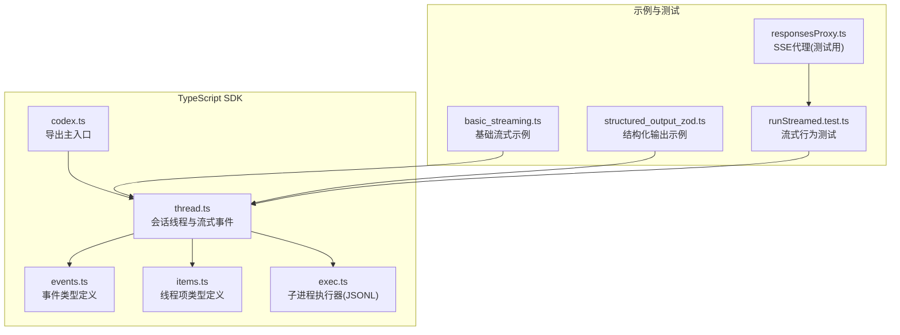
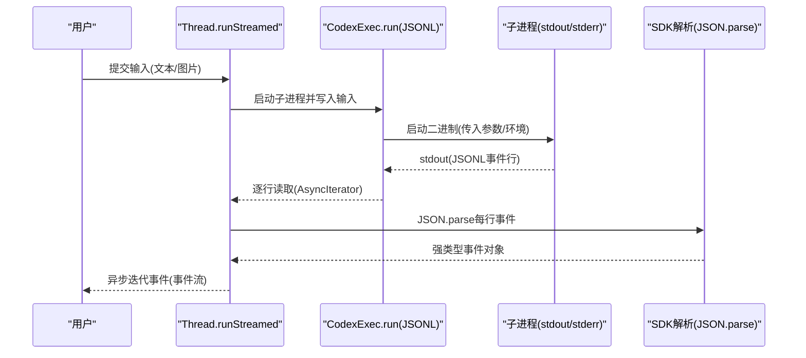
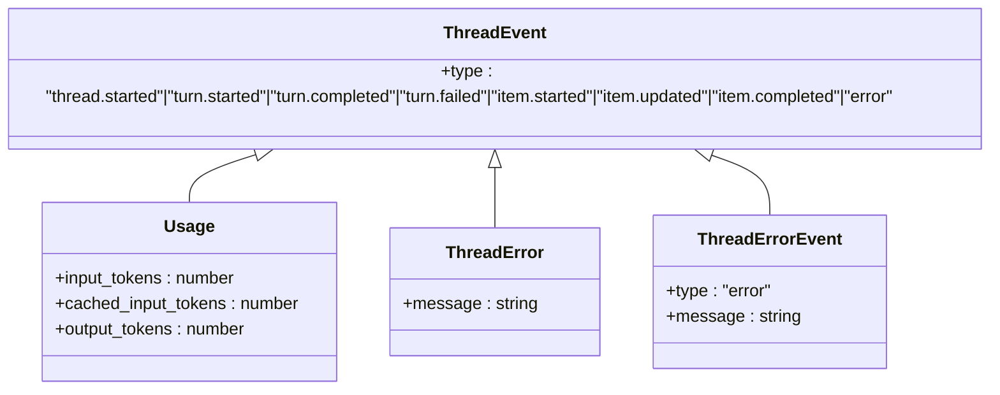
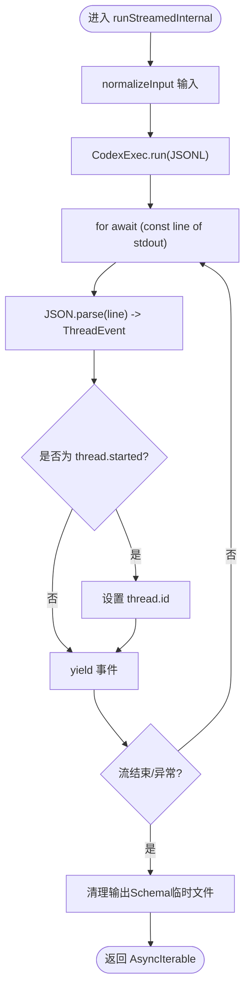
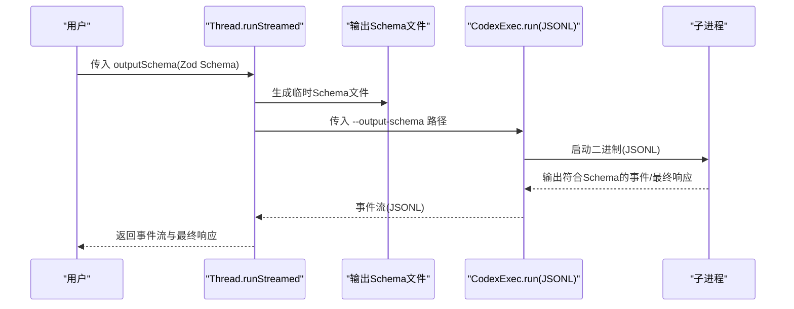
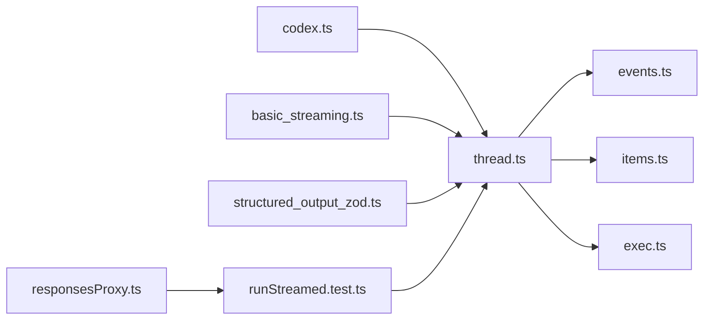

# 事件与流式处理

<cite>
**本文引用的文件**
- [events.ts](file://sdk/typescript/src/events.ts)
- [items.ts](file://sdk/typescript/src/items.ts)
- [thread.ts](file://sdk/typescript/src/thread.ts)
- [exec.ts](file://sdk/typescript/src/exec.ts)
- [codex.ts](file://sdk/typescript/src/codex.ts)
- [basic_streaming.ts](file://sdk/typescript/samples/basic_streaming.ts)
- [structured_output_zod.ts](file://sdk/typescript/samples/structured_output_zod.ts)
- [runStreamed.test.ts](file://sdk/typescript/tests/runStreamed.test.ts)
- [responsesProxy.ts](file://sdk/typescript/tests/responsesProxy.ts)
- [package.json](file://sdk/typescript/package.json)
</cite>

## 目录
1. [简介](#简介)
2. [项目结构](#项目结构)
3. [核心组件](#核心组件)
4. [架构总览](#架构总览)
5. [详细组件分析](#详细组件分析)
6. [依赖关系分析](#依赖关系分析)
7. [性能考量](#性能考量)
8. [故障排查指南](#故障排查指南)
9. [结论](#结论)
10. [附录](#附录)

## 简介
本文件面向 TypeScript SDK 的使用者，系统性阐述事件系统与流式处理机制：包括事件类型定义、事件发射器的监听方式、基于 JSONL 的流式输出解析、以及如何结合 Zod 等库对结构化输出进行约束与校验。同时给出与示例代码的对应关系，并总结性能优化与错误恢复策略。

## 项目结构
TypeScript SDK 的关键模块围绕“会话线程”展开，通过 Thread 将输入转为 JSONL 流事件，再由 SDK 解析为强类型的事件对象；同时提供结构化输出能力，便于在前端或应用侧进行增量渲染与交互。

图表来源
- [codex.ts](file://sdk/typescript/src/codex.ts#L1-L39)
- [thread.ts](file://sdk/typescript/src/thread.ts#L1-L155)
- [events.ts](file://sdk/typescript/src/events.ts#L1-L81)
- [items.ts](file://sdk/typescript/src/items.ts#L1-L128)
- [exec.ts](file://sdk/typescript/src/exec.ts#L1-L254)
- [basic_streaming.ts](file://sdk/typescript/samples/basic_streaming.ts#L1-L91)
- [structured_output_zod.ts](file://sdk/typescript/samples/structured_output_zod.ts#L1-L20)
- [runStreamed.test.ts](file://sdk/typescript/tests/runStreamed.test.ts#L1-L212)
- [responsesProxy.ts](file://sdk/typescript/tests/responsesProxy.ts#L100-L155)

章节来源
- [codex.ts](file://sdk/typescript/src/codex.ts#L1-L39)
- [thread.ts](file://sdk/typescript/src/thread.ts#L1-L155)
- [events.ts](file://sdk/typescript/src/events.ts#L1-L81)
- [items.ts](file://sdk/typescript/src/items.ts#L1-L128)
- [exec.ts](file://sdk/typescript/src/exec.ts#L1-L254)
- [basic_streaming.ts](file://sdk/typescript/samples/basic_streaming.ts#L1-L91)
- [structured_output_zod.ts](file://sdk/typescript/samples/structured_output_zod.ts#L1-L20)
- [runStreamed.test.ts](file://sdk/typescript/tests/runStreamed.test.ts#L1-L212)
- [responsesProxy.ts](file://sdk/typescript/tests/responsesProxy.ts#L100-L155)

## 核心组件
- 事件类型定义：定义了线程启动、回合开始/完成/失败、项的开始/更新/完成、错误等事件，以及令牌用量统计。
- 线程与流式事件：将用户输入转换为 JSONL 事件流，逐条解析为强类型事件对象，支持异步迭代消费。
- 子进程执行器：通过子进程运行二进制，以 JSONL 形式从 stdout 输出事件行，stderr 捕获错误信息。
- 结构化输出：通过输出模式与 JSON Schema，约束模型输出格式，便于前端或应用侧进行增量渲染与校验。

章节来源
- [events.ts](file://sdk/typescript/src/events.ts#L1-L81)
- [thread.ts](file://sdk/typescript/src/thread.ts#L1-L155)
- [exec.ts](file://sdk/typescript/src/exec.ts#L1-L254)
- [items.ts](file://sdk/typescript/src/items.ts#L1-L128)

## 架构总览
下图展示了从用户调用到事件流解析的整体流程，以及与后端/二进制的交互关系。

图表来源
- [thread.ts](file://sdk/typescript/src/thread.ts#L65-L111)
- [exec.ts](file://sdk/typescript/src/exec.ts#L129-L191)
- [events.ts](file://sdk/typescript/src/events.ts#L71-L81)

## 详细组件分析

### 事件类型与事件发射器
- 事件类型覆盖：
  - 线程生命周期：thread.started
  - 回合生命周期：turn.started、turn.completed、turn.failed
  - 项生命周期：item.started、item.updated、item.completed
  - 错误：error（致命错误）
  - 令牌用量：usage（input_tokens、cached_input_tokens、output_tokens）
- 事件发射器使用方式：
  - 使用者通过 Thread.runStreamed 获取 AsyncIterable<ThreadEvent>，逐个消费事件。
  - 在示例中，basic_streaming.ts 展示了如何根据事件类型分支处理不同项类型与统计信息。

图表来源
- [events.ts](file://sdk/typescript/src/events.ts#L1-L81)

章节来源
- [events.ts](file://sdk/typescript/src/events.ts#L1-L81)
- [basic_streaming.ts](file://sdk/typescript/samples/basic_streaming.ts#L48-L66)

### 线程与流式事件处理
- runStreamed：返回包含 AsyncIterable<ThreadEvent> 的对象，内部通过 CodexExec.run 产生 JSONL 行，逐行解析为事件对象。
- run：在流式基础上聚合最终结果（items、finalResponse、usage），并在遇到失败时抛出异常。
- normalizeInput：支持纯文本或混合文本+本地图片输入，分别拼接为 prompt 与 images 列表。

图表来源
- [thread.ts](file://sdk/typescript/src/thread.ts#L65-L111)

章节来源
- [thread.ts](file://sdk/typescript/src/thread.ts#L1-L155)

### 子进程执行器与 JSONL 输出
- CodexExec.run：
  - 组装命令行参数（模型、沙箱、工作目录、附加目录、网络搜索、审批策略、图片、线程ID、输出Schema等）。
  - 通过 Node 子进程启动二进制，向 stdin 写入输入，从 stdout 逐行读取 JSONL 事件行。
  - 从 stderr 收集错误信息，在非零退出码时抛出错误。
  - 自动注入 originator 环境变量，支持自定义 base_url 与 api_key。
- JSONL 规范：
  - 默认仅允许最终消息写入 stdout，其他输出写入 stderr；在 JSONL 模式下，stdout 必须为有效 JSONL，一行一条事件。

章节来源
- [exec.ts](file://sdk/typescript/src/exec.ts#L1-L254)

### 结构化输出与 Zod 集成
- 输出模式：通过 Thread.runStreamed 的 outputSchema 选项，将 JSON Schema 写入临时文件并传递给二进制，确保模型输出符合预期结构。
- 示例：structured_output_zod.ts 展示了如何使用 Zod 定义结构，并将其转换为 OpenAI 兼容的 JSON Schema，作为输出约束。
- 测试验证：runStreamed.test.ts 中断言请求体包含 codex_output_schema 的格式描述，确保服务端正确接收并应用该约束。

图表来源
- [thread.ts](file://sdk/typescript/src/thread.ts#L65-L111)
- [structured_output_zod.ts](file://sdk/typescript/samples/structured_output_zod.ts#L1-L20)
- [runStreamed.test.ts](file://sdk/typescript/tests/runStreamed.test.ts#L161-L203)

章节来源
- [thread.ts](file://sdk/typescript/src/thread.ts#L1-L155)
- [structured_output_zod.ts](file://sdk/typescript/samples/structured_output_zod.ts#L1-L20)
- [runStreamed.test.ts](file://sdk/typescript/tests/runStreamed.test.ts#L161-L203)

### 线程项类型与事件映射
- 线程项涵盖：代理消息、推理摘要、命令执行、文件变更、MCP 工具调用、Web 搜索、待办列表、错误等。
- 事件与项的关系：item.started/updated/completed 对应不同的项类型；最终的代理消息会被提取为 finalResponse；令牌用量在 turn.completed 中提供。

章节来源
- [items.ts](file://sdk/typescript/src/items.ts#L1-L128)
- [thread.ts](file://sdk/typescript/src/thread.ts#L113-L138)

### 基础流式示例与事件监听
- basic_streaming.ts 展示了：
  - 如何创建线程并循环发送用户输入；
  - 如何遍历 events AsyncIterable 并按事件类型分发处理；
  - 如何在 item.completed 时打印不同类型的项内容；
  - 如何在 turn.completed 时打印令牌用量；
  - 如何在 turn.failed 时输出错误信息。

章节来源
- [basic_streaming.ts](file://sdk/typescript/samples/basic_streaming.ts#L1-L91)
- [thread.ts](file://sdk/typescript/src/thread.ts#L65-L111)

## 依赖关系分析
- 主入口导出 Codex 类，内部持有 CodexExec 与全局配置。
- Thread 依赖事件类型与线程项类型，负责将 JSONL 事件解析为强类型事件对象。
- CodexExec 依赖 Node 子进程 API，负责与二进制交互。
- 示例与测试依赖 SDK 导出的类型与方法。

图表来源
- [codex.ts](file://sdk/typescript/src/codex.ts#L1-L39)
- [thread.ts](file://sdk/typescript/src/thread.ts#L1-L155)
- [events.ts](file://sdk/typescript/src/events.ts#L1-L81)
- [items.ts](file://sdk/typescript/src/items.ts#L1-L128)
- [exec.ts](file://sdk/typescript/src/exec.ts#L1-L254)
- [basic_streaming.ts](file://sdk/typescript/samples/basic_streaming.ts#L1-L91)
- [structured_output_zod.ts](file://sdk/typescript/samples/structured_output_zod.ts#L1-L20)
- [runStreamed.test.ts](file://sdk/typescript/tests/runStreamed.test.ts#L1-L212)
- [responsesProxy.ts](file://sdk/typescript/tests/responsesProxy.ts#L100-L155)

章节来源
- [codex.ts](file://sdk/typescript/src/codex.ts#L1-L39)
- [thread.ts](file://sdk/typescript/src/thread.ts#L1-L155)
- [exec.ts](file://sdk/typescript/src/exec.ts#L1-L254)
- [basic_streaming.ts](file://sdk/typescript/samples/basic_streaming.ts#L1-L91)
- [structured_output_zod.ts](file://sdk/typescript/samples/structured_output_zod.ts#L1-L20)
- [runStreamed.test.ts](file://sdk/typescript/tests/runStreamed.test.ts#L1-L212)
- [responsesProxy.ts](file://sdk/typescript/tests/responsesProxy.ts#L100-L155)

## 性能考量
- 流式消费优先：使用 AsyncIterable 逐行消费 JSONL，避免一次性加载全部事件，降低内存峰值。
- 事件粒度控制：合理拆分项（如命令执行、文件变更、工具调用）以便前端增量渲染，减少重绘成本。
- 令牌用量监控：在 turn.completed 中获取 input_tokens、cached_input_tokens、output_tokens，用于成本与性能分析。
- 进程生命周期管理：确保子进程在异常或退出时及时关闭与清理，避免资源泄漏。
- 网络与 I/O：在需要网络访问或大文件操作时，注意超时与背压处理，必要时引入节流/限速策略。

[本节为通用指导，不直接分析具体文件]

## 故障排查指南
- JSONL 解析失败：
  - 现象：解析单行事件时报错。
  - 排查：确认 stdout 是否严格为 JSONL，且每行均为合法 JSON 对象；检查二进制输出是否混入非事件行。
  - 参考：thread.ts 中对每行 JSON.parse 的异常处理。
- 退出码非零：
  - 现象：子进程退出码非 0，抛出包含 stderr 的错误。
  - 排查：查看 stderr 日志定位问题；确认命令行参数与环境变量是否正确。
  - 参考：exec.ts 中对 exit 事件与 stderr 的处理。
- 结构化输出未生效：
  - 现象：模型输出未按 Schema 约束。
  - 排查：确认 outputSchema 是否正确传入并生成临时文件；检查服务端是否接收到了 codex_output_schema 描述。
  - 参考：runStreamed.test.ts 中对请求体格式的断言。
- SSE 代理与测试：
  - 现象：本地测试需要模拟 SSE。
  - 排查：使用 responsesProxy.ts 创建本地 SSE 代理，构造事件序列并验证客户端解析逻辑。
  - 参考：responsesProxy.ts 中对 content-type 与事件写入的实现。

章节来源
- [thread.ts](file://sdk/typescript/src/thread.ts#L65-L111)
- [exec.ts](file://sdk/typescript/src/exec.ts#L129-L191)
- [runStreamed.test.ts](file://sdk/typescript/tests/runStreamed.test.ts#L161-L203)
- [responsesProxy.ts](file://sdk/typescript/tests/responsesProxy.ts#L100-L155)

## 结论
TypeScript SDK 通过 JSONL 事件流实现了对复杂多阶段任务的细粒度可观测与增量反馈。事件类型覆盖线程、回合与项的完整生命周期，配合结构化输出能力，既满足前端交互需求，也便于集成外部校验库（如 Zod）。建议在实际应用中采用流式消费、事件分发与令牌用量监控等策略，以获得更佳的性能与用户体验。

[本节为总结性内容，不直接分析具体文件]

## 附录

### 事件类型一览与用途
- thread.started：首次事件，携带 thread_id，用于后续恢复。
- turn.started：回合开始。
- turn.completed：回合结束，携带 usage。
- turn.failed：回合失败，携带错误信息。
- item.started/updated/completed：项的生命周期事件，项类型丰富，涵盖代理消息、推理、命令执行、文件变更、MCP 工具调用、Web 搜索、待办列表与错误。
- error：致命错误事件。

章节来源
- [events.ts](file://sdk/typescript/src/events.ts#L1-L81)
- [items.ts](file://sdk/typescript/src/items.ts#L1-L128)

### 示例与参考路径
- 基础流式示例：[basic_streaming.ts](file://sdk/typescript/samples/basic_streaming.ts#L1-L91)
- 结构化输出示例：[structured_output_zod.ts](file://sdk/typescript/samples/structured_output_zod.ts#L1-L20)
- 流式行为测试：[runStreamed.test.ts](file://sdk/typescript/tests/runStreamed.test.ts#L1-L212)
- SSE 代理（测试）：[responsesProxy.ts](file://sdk/typescript/tests/responsesProxy.ts#L100-L155)
- 依赖声明（含 zod）：[package.json](file://sdk/typescript/package.json#L47-L66)