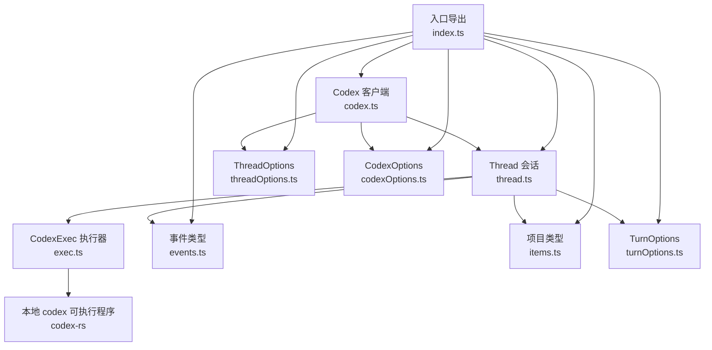
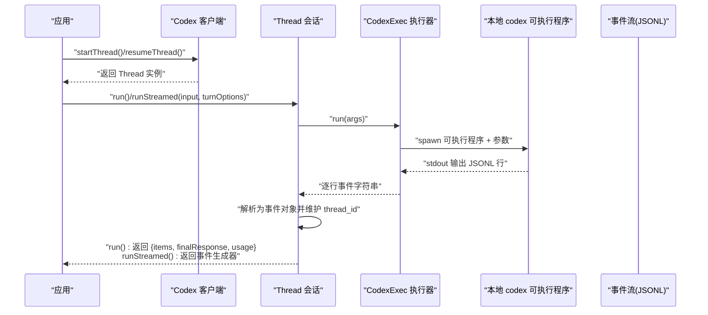
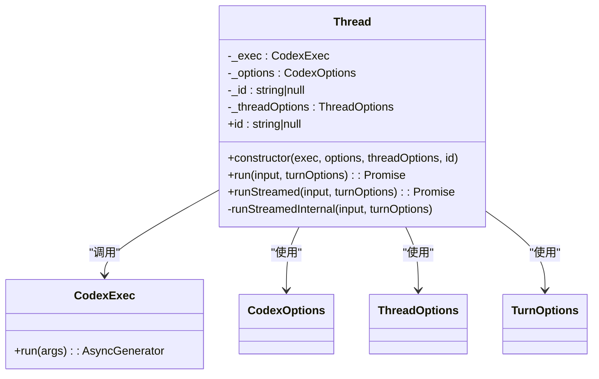
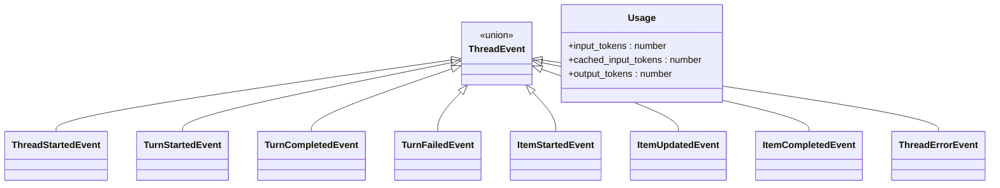
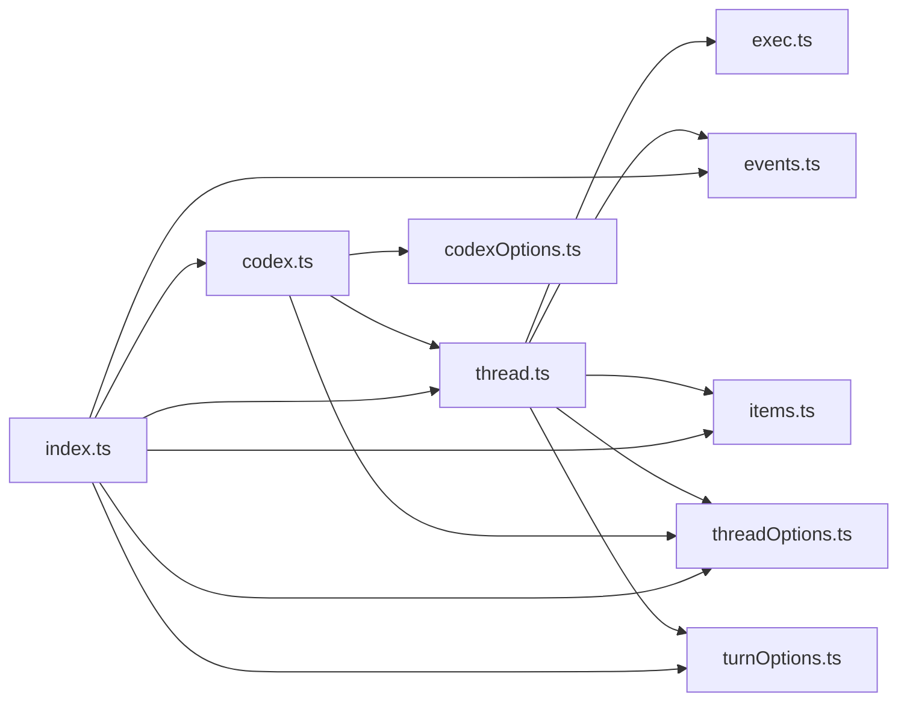

# 会话管理

<cite>
**本文引用的文件列表**
- [thread.ts](file://sdk/typescript/src/thread.ts)
- [threadOptions.ts](file://sdk/typescript/src/threadOptions.ts)
- [items.ts](file://sdk/typescript/src/items.ts)
- [events.ts](file://sdk/typescript/src/events.ts)
- [codex.ts](file://sdk/typescript/src/codex.ts)
- [exec.ts](file://sdk/typescript/src/exec.ts)
- [codexOptions.ts](file://sdk/typescript/src/codexOptions.ts)
- [turnOptions.ts](file://sdk/typescript/src/turnOptions.ts)
- [index.ts](file://sdk/typescript/src/index.ts)
- [README.md](file://sdk/typescript/README.md)
- [basic_streaming.ts](file://sdk/typescript/samples/basic_streaming.ts)
- [helpers.ts](file://sdk/typescript/samples/helpers.ts)
</cite>

## 目录
1. [简介](#简介)
2. [项目结构](#项目结构)
3. [核心组件](#核心组件)
4. [架构总览](#架构总览)
5. [组件详解](#组件详解)
6. [依赖关系分析](#依赖关系分析)
7. [性能与并发特性](#性能与并发特性)
8. [故障排查指南](#故障排查指南)
9. [结论](#结论)
10. [附录：示例与最佳实践](#附录示例与最佳实践)

## 简介
本文件围绕 TypeScript SDK 的会话管理能力进行系统化文档化，重点覆盖：
- Thread 类在创建、恢复与管理对话会话中的职责与实现细节
- ThreadOptions 配置项对会话行为的影响
- 与会话相关的操作：添加消息、获取会话历史（通过事件流）、管理上下文
- 创建新会话与恢复现有会话的完整流程与示例路径
- items.ts 中的项目类型如何支撑会话中的多模态与工具调用等上下文
- 会话状态持久化与最佳实践建议

## 项目结构
TypeScript SDK 的会话管理由一组紧密协作的模块组成：
- 入口导出与对外 API：index.ts 汇总导出 Thread、Codex、ThreadOptions、Items 等类型与类
- 会话主体：thread.ts 定义 Thread 类，负责单次或多次对话回合（turn）的执行与事件流解析
- 会话配置：threadOptions.ts 定义 ThreadOptions，控制模型、沙箱、工作目录、网络搜索、审批策略等
- 事件与项目：events.ts 定义事件类型；items.ts 定义会话中出现的各类“项目”（消息、命令、文件变更、MCP 工具调用、待办等）
- 执行器：exec.ts 封装底层 codex 可执行程序的调用，负责参数拼接、环境变量注入、JSONL 事件流读取
- 客户端入口：codex.ts 提供 startThread/resumeThread 能力，连接到本地可执行程序
- 选项与导出：codexOptions.ts、turnOptions.ts 分别定义客户端与单轮对话的可选参数

图表来源
- [codex.ts](file://sdk/typescript/src/codex.ts#L1-L39)
- [thread.ts](file://sdk/typescript/src/thread.ts#L1-L155)
- [exec.ts](file://sdk/typescript/src/exec.ts#L1-L254)
- [events.ts](file://sdk/typescript/src/events.ts#L1-L81)
- [items.ts](file://sdk/typescript/src/items.ts#L1-L128)
- [threadOptions.ts](file://sdk/typescript/src/threadOptions.ts#L1-L18)
- [codexOptions.ts](file://sdk/typescript/src/codexOptions.ts#L1-L11)
- [turnOptions.ts](file://sdk/typescript/src/turnOptions.ts#L1-L7)
- [index.ts](file://sdk/typescript/src/index.ts#L1-L40)

章节来源
- [index.ts](file://sdk/typescript/src/index.ts#L1-L40)
- [codex.ts](file://sdk/typescript/src/codex.ts#L1-L39)
- [thread.ts](file://sdk/typescript/src/thread.ts#L1-L155)
- [exec.ts](file://sdk/typescript/src/exec.ts#L1-L254)
- [events.ts](file://sdk/typescript/src/events.ts#L1-L81)
- [items.ts](file://sdk/typescript/src/items.ts#L1-L128)
- [threadOptions.ts](file://sdk/typescript/src/threadOptions.ts#L1-L18)
- [codexOptions.ts](file://sdk/typescript/src/codexOptions.ts#L1-L11)
- [turnOptions.ts](file://sdk/typescript/src/turnOptions.ts#L1-L7)

## 核心组件
- Thread：封装一次或多轮对话，提供 run 与 runStreamed 方法，内部通过 CodexExec 与本地可执行程序交互，解析 JSONL 事件流，维护会话 ID 并聚合最终响应与用量信息。
- Codex：SDK 入口，提供 startThread 与 resumeThread，用于创建或恢复会话。
- CodexExec：封装子进程调用，拼接命令行参数（模型、沙箱、工作目录、网络访问、Web 搜索、审批策略、图像输入、输出模式等），读取标准输出的 JSONL 事件流。
- ThreadOptions：会话级配置，影响后续所有回合的行为（模型、沙箱模式、工作目录、跳过 Git 校验、推理强度、网络访问、Web 搜索、审批策略、附加目录）。
- TurnOptions：单回合配置，影响当前回合（输出模式、取消信号）。
- Items：会话中出现的各类“项目”，如代理消息、命令执行、文件变更、MCP 工具调用、待办列表、错误等。
- Events：会话事件流的类型定义，包含线程开始、回合开始/完成/失败、项目开始/更新/完成、错误等。

章节来源
- [thread.ts](file://sdk/typescript/src/thread.ts#L1-L155)
- [codex.ts](file://sdk/typescript/src/codex.ts#L1-L39)
- [exec.ts](file://sdk/typescript/src/exec.ts#L1-L254)
- [threadOptions.ts](file://sdk/typescript/src/threadOptions.ts#L1-L18)
- [turnOptions.ts](file://sdk/typescript/src/turnOptions.ts#L1-L7)
- [items.ts](file://sdk/typescript/src/items.ts#L1-L128)
- [events.ts](file://sdk/typescript/src/events.ts#L1-L81)

## 架构总览
下图展示了从应用层到本地可执行程序的调用链路与事件流：

图表来源
- [codex.ts](file://sdk/typescript/src/codex.ts#L1-L39)
- [thread.ts](file://sdk/typescript/src/thread.ts#L60-L138)
- [exec.ts](file://sdk/typescript/src/exec.ts#L51-L191)
- [events.ts](file://sdk/typescript/src/events.ts#L1-L81)

## 组件详解

### Thread 类：创建、恢复与管理会话
- 角色与职责
  - 维护会话 ID（首次收到线程开始事件时填充）
  - 提供 run 与 runStreamed 两种执行模式
  - 解析事件流，聚合 items、最终响应与用量信息
  - 支持图片输入与结构化输出（通过输出模式文件）
- 关键方法
  - run(input, turnOptions)：阻塞直到回合结束，返回回合结果（items、finalResponse、usage）
  - runStreamed(input, turnOptions)：返回事件生成器，逐条推送事件
  - 内部 runStreamedInternal：拼装参数、调用 CodexExec、解析事件、更新 thread_id、清理临时输出模式文件
- 输入归一化
  - normalizeInput：支持纯文本或混合文本+本地图片输入，将文本拼接为提示词，图片路径收集为数组
- 错误处理
  - 事件解析失败抛出错误
  - 回合失败事件触发异常
  - 子进程退出码非零时抛出错误（包含 stderr）

图表来源
- [thread.ts](file://sdk/typescript/src/thread.ts#L40-L155)
- [exec.ts](file://sdk/typescript/src/exec.ts#L51-L191)
- [codexOptions.ts](file://sdk/typescript/src/codexOptions.ts#L1-L11)
- [threadOptions.ts](file://sdk/typescript/src/threadOptions.ts#L1-L18)
- [turnOptions.ts](file://sdk/typescript/src/turnOptions.ts#L1-L7)

章节来源
- [thread.ts](file://sdk/typescript/src/thread.ts#L40-L155)
- [thread.ts](file://sdk/typescript/src/thread.ts#L140-L155)

### ThreadOptions：会话级配置与行为影响
- 可用字段
  - model：指定模型名称
  - sandboxMode：沙箱模式（只读、工作区写入、全权限）
  - workingDirectory：工作目录
  - skipGitRepoCheck：是否跳过 Git 仓库校验
  - modelReasoningEffort：模型推理强度（最小/低/中/高）
  - networkAccessEnabled：是否允许网络访问（仅在工作区写入沙箱下生效）
  - webSearchEnabled：是否启用 Web 搜索
  - approvalPolicy：审批策略（从不、按请求、失败时、不受信任）
  - additionalDirectories：附加可访问目录
- 影响范围
  - 会话内所有回合均受这些配置影响
  - 通过 CodexExec 参数传递到底层可执行程序
  - 与 TurnOptions 的 outputSchema、signal 协同决定单回合行为

章节来源
- [threadOptions.ts](file://sdk/typescript/src/threadOptions.ts#L1-L18)
- [exec.ts](file://sdk/typescript/src/exec.ts#L51-L128)

### 事件与项目：会话上下文的承载
- 事件类型（ThreadEvent）
  - 线程开始、回合开始/完成/失败、项目开始/更新/完成、错误
  - 使用 Usage 记录输入/缓存/输出 token 数量
- 项目类型（ThreadItem）
  - 代理消息、推理摘要、命令执行、文件变更、MCP 工具调用、Web 搜索、待办列表、错误
  - items.ts 定义了各项目的结构与状态字段，便于在 runStreamed 中增量更新 UI 或日志

图表来源
- [events.ts](file://sdk/typescript/src/events.ts#L1-L81)

章节来源
- [events.ts](file://sdk/typescript/src/events.ts#L1-L81)
- [items.ts](file://sdk/typescript/src/items.ts#L1-L128)

### 执行器：CodexExec
- 职责
  - 将 Thread/Exec 的参数映射为可执行程序的命令行参数
  - 注入必要环境变量（如 OPENAI_BASE_URL、CODEX_API_KEY、originator）
  - 通过 stdin 发送输入，逐行读取 stdout 的 JSONL 事件
  - 处理子进程生命周期与错误
- 关键点
  - 支持 --model、--sandbox、--cd、--add-dir、--skip-git-repo-check、--output-schema、--config 系列参数
  - 支持 --image 列表传入本地图片路径
  - 支持通过 AbortSignal 取消执行
  - 当传入 threadId 时，以 resume 模式继续会话

章节来源
- [exec.ts](file://sdk/typescript/src/exec.ts#L1-L254)

### 客户端入口：Codex
- 提供 startThread 与 resumeThread
  - startThread：创建新的 Thread 实例，未绑定 thread_id
  - resumeThread：基于已知 thread_id 创建 Thread 实例，以便继续之前的会话
- 会话持久化位置
  - README 指明会话持久化于用户目录下的 sessions 文件夹，Thread 在首次事件中获得 thread_id

章节来源
- [codex.ts](file://sdk/typescript/src/codex.ts#L1-L39)
- [README.md](file://sdk/typescript/README.md#L98-L107)

### 输入与回合：normalizeInput 与 TurnOptions
- normalizeInput
  - 将输入归一化为 { prompt, images }：纯字符串转为单一提示词；数组输入中文本拼接，本地图片路径收集
- TurnOptions
  - outputSchema：为当前回合指定输出模式（结构化 JSON Schema）
  - signal：AbortSignal，用于取消当前回合

章节来源
- [thread.ts](file://sdk/typescript/src/thread.ts#L140-L155)
- [turnOptions.ts](file://sdk/typescript/src/turnOptions.ts#L1-L7)

## 依赖关系分析
- 模块耦合
  - Thread 强依赖 CodexExec（执行与事件流）
  - Thread 间接依赖 ThreadOptions/TurnOptions/CodexOptions（配置注入）
  - 事件与项目类型被 Thread 与外部应用共同消费
- 外部集成
  - 通过子进程调用本地 codex 可执行程序，遵循 JSONL 事件协议
- 循环依赖
  - 无直接循环依赖；事件与项目类型作为共享类型存在

图表来源
- [thread.ts](file://sdk/typescript/src/thread.ts#L1-L155)
- [exec.ts](file://sdk/typescript/src/exec.ts#L1-L254)
- [events.ts](file://sdk/typescript/src/events.ts#L1-L81)
- [items.ts](file://sdk/typescript/src/items.ts#L1-L128)
- [threadOptions.ts](file://sdk/typescript/src/threadOptions.ts#L1-L18)
- [turnOptions.ts](file://sdk/typescript/src/turnOptions.ts#L1-L7)
- [codex.ts](file://sdk/typescript/src/codex.ts#L1-L39)
- [codexOptions.ts](file://sdk/typescript/src/codexOptions.ts#L1-L11)
- [index.ts](file://sdk/typescript/src/index.ts#L1-L40)

## 性能与并发特性
- 流式事件处理
  - runStreamed 采用异步生成器，边接收边处理，降低等待时间，适合实时 UI 响应
- 事件解析
  - 每行 JSONL 解析为事件对象，解析失败会抛错，确保数据一致性
- 子进程 I/O
  - 通过 readline 逐行读取 stdout，避免一次性缓冲大块数据
- 取消机制
  - 通过 AbortSignal 支持取消当前回合，减少资源占用
- 并发建议
  - 同一 Thread 实例内串行执行回合；若需并行，建议使用多个 Thread 实例

章节来源
- [thread.ts](file://sdk/typescript/src/thread.ts#L60-L138)
- [exec.ts](file://sdk/typescript/src/exec.ts#L156-L191)

## 故障排查指南
- 事件解析失败
  - 现象：解析单行事件时报错
  - 排查：确认事件流格式正确，检查底层可执行程序输出
- 回合失败事件
  - 现象：收到 turn.failed，抛出包含错误信息的异常
  - 排查：根据错误信息定位模型、网络、权限等问题
- 子进程退出码非零
  - 现象：stderr 包含错误信息
  - 排查：检查模型配置、工作目录、网络访问、审批策略、附加目录等
- 会话无法恢复
  - 现象：resumeThread 后无法继续
  - 排查：确认 thread_id 正确且持久化文件存在；检查沙箱与网络策略是否导致不可恢复状态

章节来源
- [thread.ts](file://sdk/typescript/src/thread.ts#L90-L111)
- [thread.ts](file://sdk/typescript/src/thread.ts#L120-L137)
- [exec.ts](file://sdk/typescript/src/exec.ts#L161-L191)

## 结论
TypeScript SDK 的会话管理以 Thread 为核心，结合事件驱动的 JSONL 流与丰富的 Items 类型，提供了从创建、恢复到多回合推进的完整能力。ThreadOptions 与 TurnOptions 为会话与回合分别提供了细粒度的控制点，既保证了灵活性，也便于在不同场景下进行安全与性能权衡。通过 CodexExec 与本地可执行程序的解耦，SDK 能够稳定地承载复杂任务（命令执行、文件变更、MCP 工具调用、Web 搜索等）并在流式事件中及时反馈。

## 附录：示例与最佳实践

### 创建新会话与恢复现有会话
- 创建新会话
  - 使用 Codex.startThread() 获取 Thread 实例
  - 通过 run 或 runStreamed 发起对话
- 恢复现有会话
  - 使用 Codex.resumeThread(threadId) 获取 Thread 实例
  - 继续发送输入以延续对话

参考路径
- [README.md](file://sdk/typescript/README.md#L18-L33)
- [README.md](file://sdk/typescript/README.md#L98-L107)
- [codex.ts](file://sdk/typescript/src/codex.ts#L20-L37)

### 添加消息与获取会话历史
- 添加消息
  - run(input)：一次性获取回合结果
  - runStreamed(input)：逐条事件处理，适合实时 UI
- 获取历史
  - 通过事件流中的 items 与 Usage 聚合历史与用量
  - items.ts 中的项目类型可用于渲染命令、文件变更、MCP 工具调用等

参考路径
- [thread.ts](file://sdk/typescript/src/thread.ts#L60-L138)
- [items.ts](file://sdk/typescript/src/items.ts#L1-L128)
- [basic_streaming.ts](file://sdk/typescript/samples/basic_streaming.ts#L1-L91)

### ThreadOptions 配置参数说明
- model：模型名称
- sandboxMode：沙箱模式（只读/工作区写入/全权限）
- workingDirectory：工作目录
- skipGitRepoCheck：是否跳过 Git 仓库校验
- modelReasoningEffort：模型推理强度（最小/低/中/高）
- networkAccessEnabled：是否允许网络访问（工作区写入沙箱下）
- webSearchEnabled：是否启用 Web 搜索
- approvalPolicy：审批策略（从不/按请求/失败时/不受信任）
- additionalDirectories：附加可访问目录

参考路径
- [threadOptions.ts](file://sdk/typescript/src/threadOptions.ts#L1-L18)
- [exec.ts](file://sdk/typescript/src/exec.ts#L51-L128)

### TurnOptions 与结构化输出
- outputSchema：为当前回合指定输出模式（结构化 JSON Schema）
- signal：AbortSignal，用于取消当前回合

参考路径
- [turnOptions.ts](file://sdk/typescript/src/turnOptions.ts#L1-L7)
- [thread.ts](file://sdk/typescript/src/thread.ts#L70-L111)

### 项目类型（Items）在会话中的作用
- 代理消息：最终响应文本
- 命令执行：命令行、状态、退出码、聚合输出
- 文件变更：变更集合与整体状态
- MCP 工具调用：服务器、工具名、参数、结果或错误
- 待办列表：步骤清单与完成状态
- 错误：非致命错误项

参考路径
- [items.ts](file://sdk/typescript/src/items.ts#L1-L128)

### 会话状态持久化与最佳实践
- 持久化位置
  - README 指明会话持久化于用户目录下的 sessions 文件夹
- 最佳实践
  - 在首次事件后保存 thread_id，以便断线重连或重启后恢复
  - 对敏感环境变量通过 CodexOptions.env 显式注入，避免继承全局环境
  - 使用 runStreamed 实时处理事件，提升用户体验
  - 合理设置 approvalPolicy 与 sandboxMode，平衡安全性与功能性
  - 使用 TurnOptions.outputSchema 约束输出，便于下游解析与展示

参考路径
- [README.md](file://sdk/typescript/README.md#L98-L107)
- [codexOptions.ts](file://sdk/typescript/src/codexOptions.ts#L1-L11)
- [thread.ts](file://sdk/typescript/src/thread.ts#L60-L138)