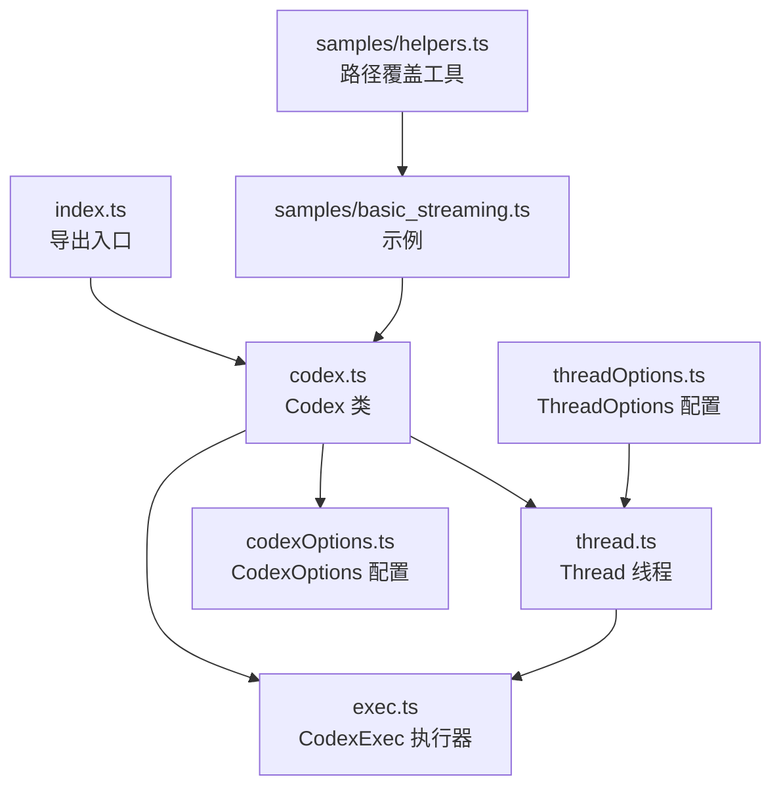
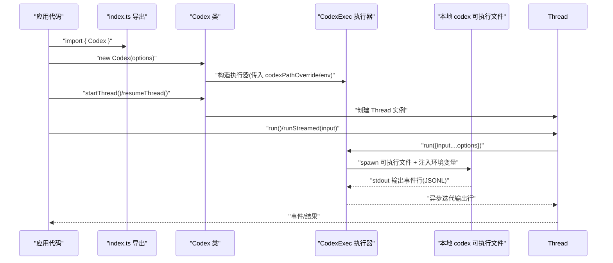
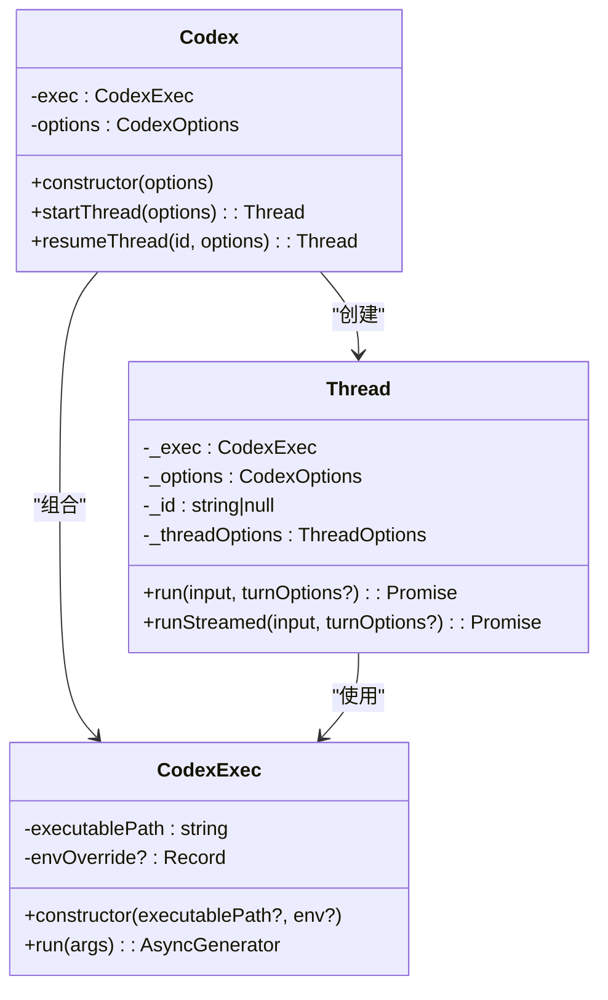
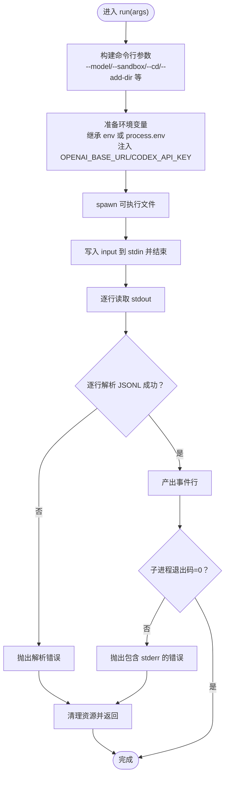
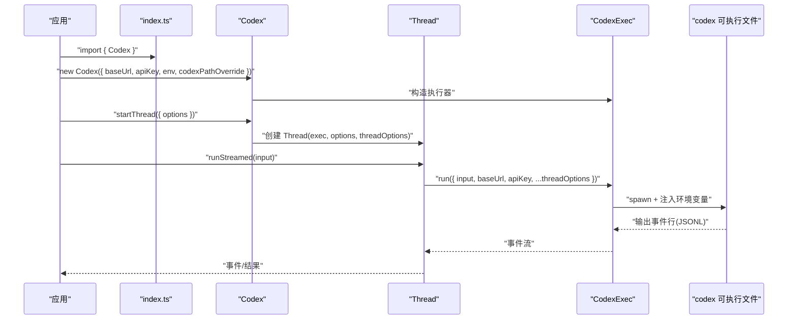
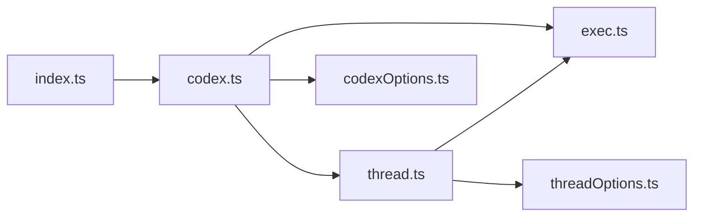

# 客户端初始化

<cite>
**本文引用的文件**
- [sdk/typescript/src/index.ts](file://sdk/typescript/src/index.ts)
- [sdk/typescript/src/codex.ts](file://sdk/typescript/src/codex.ts)
- [sdk/typescript/src/codexOptions.ts](file://sdk/typescript/src/codexOptions.ts)
- [sdk/typescript/src/exec.ts](file://sdk/typescript/src/exec.ts)
- [sdk/typescript/src/thread.ts](file://sdk/typescript/src/thread.ts)
- [sdk/typescript/src/threadOptions.ts](file://sdk/typescript/src/threadOptions.ts)
- [sdk/typescript/README.md](file://sdk/typescript/README.md)
- [sdk/typescript/samples/basic_streaming.ts](file://sdk/typescript/samples/basic_streaming.ts)
- [sdk/typescript/samples/helpers.ts](file://sdk/typescript/samples/helpers.ts)
- [sdk/typescript/package.json](file://sdk/typescript/package.json)
</cite>

## 目录
1. [简介](#简介)
2. [项目结构](#项目结构)
3. [核心组件](#核心组件)
4. [架构总览](#架构总览)
5. [详细组件分析](#详细组件分析)
6. [依赖关系分析](#依赖关系分析)
7. [性能与资源管理](#性能与资源管理)
8. [故障排查指南](#故障排查指南)
9. [结论](#结论)
10. [附录：初始化示例与最佳实践](#附录初始化示例与最佳实践)

## 简介
本章节聚焦于 TypeScript SDK 的客户端初始化流程，围绕 CodexClient 的创建与配置展开，详细说明如何通过入口模块导入与实例化，解释配置项的含义与作用，覆盖 Node.js 与浏览器环境下的差异与注意事项，阐述认证机制与凭证管理策略，给出常见初始化失败场景与解决方案，并讨论客户端实例的生命周期管理。

## 项目结构
TypeScript SDK 的初始化涉及以下关键文件：
- 入口导出：index.ts 暴露核心类型与类，供外部导入使用
- 核心类：Codex 类封装客户端实例，负责线程的启动与恢复
- 配置模型：CodexOptions 定义可选的初始化参数
- 执行器：CodexExec 负责调用底层 codex 可执行文件并传递环境变量与命令行参数
- 线程：Thread 封装一次对话会话，支持同步与流式两种运行模式
- 示例与工具：samples 提供基本使用示例与路径覆盖辅助函数

图表来源
- [sdk/typescript/src/index.ts](file://sdk/typescript/src/index.ts#L1-L40)
- [sdk/typescript/src/codex.ts](file://sdk/typescript/src/codex.ts#L1-L39)
- [sdk/typescript/src/codexOptions.ts](file://sdk/typescript/src/codexOptions.ts#L1-L11)
- [sdk/typescript/src/exec.ts](file://sdk/typescript/src/exec.ts#L1-L254)
- [sdk/typescript/src/thread.ts](file://sdk/typescript/src/thread.ts#L1-L155)
- [sdk/typescript/src/threadOptions.ts](file://sdk/typescript/src/threadOptions.ts#L1-L18)
- [sdk/typescript/samples/basic_streaming.ts](file://sdk/typescript/samples/basic_streaming.ts#L1-L91)
- [sdk/typescript/samples/helpers.ts](file://sdk/typescript/samples/helpers.ts#L1-L9)

章节来源
- [sdk/typescript/src/index.ts](file://sdk/typescript/src/index.ts#L1-L40)
- [sdk/typescript/src/codex.ts](file://sdk/typescript/src/codex.ts#L1-L39)
- [sdk/typescript/src/codexOptions.ts](file://sdk/typescript/src/codexOptions.ts#L1-L11)
- [sdk/typescript/src/exec.ts](file://sdk/typescript/src/exec.ts#L1-L254)
- [sdk/typescript/src/thread.ts](file://sdk/typescript/src/thread.ts#L1-L155)
- [sdk/typescript/src/threadOptions.ts](file://sdk/typescript/src/threadOptions.ts#L1-L18)
- [sdk/typescript/samples/basic_streaming.ts](file://sdk/typescript/samples/basic_streaming.ts#L1-L91)
- [sdk/typescript/samples/helpers.ts](file://sdk/typescript/samples/helpers.ts#L1-L9)

## 核心组件
- 导出入口 index.ts：统一导出事件、线程项、Thread、Codex、CodexOptions、ThreadOptions、TurnOptions 等类型与类，便于外部按需导入
- Codex 类：构造函数接收 CodexOptions，内部持有 CodexExec 实例与配置；提供 startThread/resumeThread 创建或恢复线程
- CodexOptions：定义可选配置项，包括 codexPathOverride、baseUrl、apiKey、env
- CodexExec：封装底层 codex 可执行文件的调用，负责拼接命令行参数、注入环境变量（如 OPENAI_BASE_URL、CODEX_API_KEY），并以异步迭代器形式返回输出行
- Thread：封装一次或多轮对话，支持 run/runStreamed 两种模式；runStreamed 内部将输出逐条解析为结构化事件
- ThreadOptions：控制工作目录、沙箱模式、网络访问、Web 搜索、审批策略、附加目录等线程级行为

章节来源
- [sdk/typescript/src/index.ts](file://sdk/typescript/src/index.ts#L1-L40)
- [sdk/typescript/src/codex.ts](file://sdk/typescript/src/codex.ts#L1-L39)
- [sdk/typescript/src/codexOptions.ts](file://sdk/typescript/src/codexOptions.ts#L1-L11)
- [sdk/typescript/src/exec.ts](file://sdk/typescript/src/exec.ts#L1-L254)
- [sdk/typescript/src/thread.ts](file://sdk/typescript/src/thread.ts#L1-L155)
- [sdk/typescript/src/threadOptions.ts](file://sdk/typescript/src/threadOptions.ts#L1-L18)

## 架构总览
初始化流程从导入 Codex 开始，随后通过 new Codex(options) 构造客户端实例。实例内部创建 CodexExec，并在后续线程操作中复用该执行器。线程运行时，CodexExec 将配置项映射为环境变量与命令行参数，最终调用本地 codex 可执行文件。

图表来源
- [sdk/typescript/src/index.ts](file://sdk/typescript/src/index.ts#L1-L40)
- [sdk/typescript/src/codex.ts](file://sdk/typescript/src/codex.ts#L1-L39)
- [sdk/typescript/src/exec.ts](file://sdk/typescript/src/exec.ts#L1-L254)
- [sdk/typescript/src/thread.ts](file://sdk/typescript/src/thread.ts#L1-L155)

## 详细组件分析

### Codex 类与初始化
- 构造函数：接收 CodexOptions，默认为空对象；内部创建 CodexExec，并保存 options
- startThread/resumeThread：分别用于新建线程与基于线程 ID 恢复线程；两者均将 options 透传给 Thread
- 生命周期：实例持有执行器与配置，建议在应用退出前释放资源（参见“性能与资源管理”）

图表来源
- [sdk/typescript/src/codex.ts](file://sdk/typescript/src/codex.ts#L1-L39)
- [sdk/typescript/src/exec.ts](file://sdk/typescript/src/exec.ts#L1-L254)
- [sdk/typescript/src/thread.ts](file://sdk/typescript/src/thread.ts#L1-L155)

章节来源
- [sdk/typescript/src/codex.ts](file://sdk/typescript/src/codex.ts#L1-L39)

### 配置模型：CodexOptions
- codexPathOverride：可选，覆盖默认的 codex 可执行文件路径
- baseUrl：可选，用于设置基础 API 端点（映射到环境变量）
- apiKey：可选，用于设置 API 凭证（映射到环境变量）
- env：可选，完全替换执行器继承的环境变量（默认继承 process.env）

说明：当传入 baseUrl/apiKey 时，CodexExec 会在运行时将它们写入环境变量，从而影响底层 CLI 的行为。

章节来源
- [sdk/typescript/src/codexOptions.ts](file://sdk/typescript/src/codexOptions.ts#L1-L11)
- [sdk/typescript/src/exec.ts](file://sdk/typescript/src/exec.ts#L109-L132)

### 执行器：CodexExec
- 构造：若未显式指定可执行文件路径，则根据平台与架构自动定位内置二进制；支持通过 codexPathOverride 覆盖
- 运行：将 ThreadOptions 与输入映射为命令行参数与环境变量，spawn 子进程；通过 stdin 写入输入，通过 stdout 逐行读取事件
- 错误处理：对子进程无 stdin/stdout、spawn 失败、非零退出码等情况进行抛错；同时收集 stderr 作为错误上下文
- 资源清理：无论成功与否，都会关闭 readline 接口、移除监听器并尝试杀死子进程

图表来源
- [sdk/typescript/src/exec.ts](file://sdk/typescript/src/exec.ts#L51-L191)

章节来源
- [sdk/typescript/src/exec.ts](file://sdk/typescript/src/exec.ts#L1-L254)

### 线程：Thread
- runStreamed：内部创建输出模式所需的 schema 文件，将输入标准化为文本与图像列表，调用 CodexExec.run 并逐行解析事件；首次出现 thread.started 时记录线程 ID
- run：在 runStreamed 基础上聚合 items、finalResponse、usage，并在 turn.failed 时抛出错误
- 输入归一化：支持字符串或结构化输入（文本与本地图片），自动拼接文本并提取图片路径列表

章节来源
- [sdk/typescript/src/thread.ts](file://sdk/typescript/src/thread.ts#L1-L155)

### 初始化流程与调用链

图表来源
- [sdk/typescript/src/index.ts](file://sdk/typescript/src/index.ts#L1-L40)
- [sdk/typescript/src/codex.ts](file://sdk/typescript/src/codex.ts#L1-L39)
- [sdk/typescript/src/thread.ts](file://sdk/typescript/src/thread.ts#L1-L155)
- [sdk/typescript/src/exec.ts](file://sdk/typescript/src/exec.ts#L1-L254)

## 依赖关系分析
- 导出层：index.ts 统一导出类型与类，降低外部依赖复杂度
- 核心层：Codex 依赖 CodexExec 与 Thread；Thread 依赖 CodexExec
- 执行层：CodexExec 依赖 Node.js child_process、path、readline、fileURLToPath 等原生模块
- 配置层：CodexOptions 与 ThreadOptions 分别影响执行器与线程行为

图表来源
- [sdk/typescript/src/index.ts](file://sdk/typescript/src/index.ts#L1-L40)
- [sdk/typescript/src/codex.ts](file://sdk/typescript/src/codex.ts#L1-L39)
- [sdk/typescript/src/exec.ts](file://sdk/typescript/src/exec.ts#L1-L254)
- [sdk/typescript/src/thread.ts](file://sdk/typescript/src/thread.ts#L1-L155)
- [sdk/typescript/src/codexOptions.ts](file://sdk/typescript/src/codexOptions.ts#L1-L11)
- [sdk/typescript/src/threadOptions.ts](file://sdk/typescript/src/threadOptions.ts#L1-L18)

章节来源
- [sdk/typescript/src/index.ts](file://sdk/typescript/src/index.ts#L1-L40)
- [sdk/typescript/src/codex.ts](file://sdk/typescript/src/codex.ts#L1-L39)
- [sdk/typescript/src/exec.ts](file://sdk/typescript/src/exec.ts#L1-L254)
- [sdk/typescript/src/thread.ts](file://sdk/typescript/src/thread.ts#L1-L155)
- [sdk/typescript/src/codexOptions.ts](file://sdk/typescript/src/codexOptions.ts#L1-L11)
- [sdk/typescript/src/threadOptions.ts](file://sdk/typescript/src/threadOptions.ts#L1-L18)

## 性能与资源管理
- 进程生命周期：CodexExec 在 finally 中确保关闭 readline、移除监听器并尝试杀死子进程，避免僵尸进程与句柄泄漏
- 环境变量注入：仅在必要时注入 OPENAI_BASE_URL 与 CODEX_API_KEY，减少不必要的环境污染
- 平台二进制选择：根据平台与架构自动定位内置二进制，避免手动维护路径成本
- 线程复用：建议在应用生命周期内复用同一个 Codex 实例，减少重复初始化开销

章节来源
- [sdk/typescript/src/exec.ts](file://sdk/typescript/src/exec.ts#L134-L191)

## 故障排查指南
- 平台不支持：当检测不到目标三元组（平台+架构）时，会抛出不支持平台的错误
  - 参考路径：[findCodexPath](file://sdk/typescript/src/exec.ts#L197-L253)
- 子进程无 stdin/stdout：spawn 成功但无法获取标准流时，立即抛错并终止
  - 参考路径：[run](file://sdk/typescript/src/exec.ts#L134-L147)
- 非零退出码：子进程退出码非 0 时，将合并 stderr 作为错误信息抛出
  - 参考路径：[run](file://sdk/typescript/src/exec.ts#L167-L181)
- 解析错误：runStreamed 内部逐行解析 JSONL，解析失败会抛出错误并附带原始行内容
  - 参考路径：[runStreamedInternal](file://sdk/typescript/src/thread.ts#L96-L107)
- 网络/超时：底层 CLI 可能因网络或超时导致失败，建议检查网络连通性与代理设置
- 凭证问题：当 baseUrl/apiKey 未正确设置或不可用时，底层 CLI 会报鉴权相关错误
  - 参考路径：[环境变量注入](file://sdk/typescript/src/exec.ts#L122-L127)

章节来源
- [sdk/typescript/src/exec.ts](file://sdk/typescript/src/exec.ts#L134-L191)
- [sdk/typescript/src/thread.ts](file://sdk/typescript/src/thread.ts#L96-L107)

## 结论
TypeScript SDK 的客户端初始化以 Codex 类为核心，通过 CodexOptions 与 ThreadOptions 精细控制底层 CLI 的行为。CodexExec 负责跨平台二进制选择、环境变量注入与子进程管理，Thread 提供同步与流式两种运行模式。遵循本文提供的初始化步骤、配置要点与故障排查方法，可在 Node.js 环境稳定运行；对于浏览器环境，由于 SDK 依赖 Node.js 原生模块，需采用服务端代理或在 Node.js 后端运行 SDK。

## 附录：初始化示例与最佳实践

### 在 Node.js 中初始化客户端
- 基本初始化：通过 import { Codex } 从包中导入，直接 new Codex() 即可创建实例
  - 参考路径：[快速开始示例](file://sdk/typescript/README.md#L15-L27)
- 使用自定义可执行文件路径：通过 codexPathOverride 指定本地编译产物
  - 参考路径：[示例脚本](file://sdk/typescript/samples/basic_streaming.ts#L1-L20)，[路径覆盖工具](file://sdk/typescript/samples/helpers.ts#L1-L9)
- 设置基础 URL 与 API Key：通过 CodexOptions 的 baseUrl 与 apiKey 注入环境变量
  - 参考路径：[CodexOptions](file://sdk/typescript/src/codexOptions.ts#L1-L11)，[环境变量注入](file://sdk/typescript/src/exec.ts#L122-L127)
- 控制执行环境变量：通过 env 参数完全接管传入给 CLI 的环境变量
  - 参考路径：[README 说明](file://sdk/typescript/README.md#L119-L134)，[CodexExec 构造](file://sdk/typescript/src/exec.ts#L46-L49)

### 在浏览器环境中使用
- 当前 SDK 依赖 Node.js 原生模块（child_process、readline 等），无法直接在浏览器运行
- 推荐方案：
  - 在后端（Node.js）部署 SDK，前端通过 HTTP API 与后端交互
  - 使用服务端代理将浏览器请求转发至后端 SDK，由后端执行 CLI 并返回事件流
- 若必须在浏览器侧运行，请考虑将 SDK 重写为纯浏览器兼容版本（例如通过 WebAssembly 或服务端渲染），或改用官方浏览器 SDK（如有）

### 认证机制与凭证管理
- 凭证注入：SDK 通过环境变量向底层 CLI 注入 CODEX_API_KEY 与 OPENAI_BASE_URL
  - 参考路径：[环境变量注入](file://sdk/typescript/src/exec.ts#L122-L127)
- 安全建议：
  - 不要在代码仓库中硬编码 API Key，优先使用环境变量或密钥管理服务
  - 在 Electron 等受限环境中，使用 env 参数精确控制传入 CLI 的环境变量，避免泄露敏感信息
  - 对外暴露的 API 应在后端统一管理凭据，前端只负责触发请求

### 初始化失败的常见原因与解决
- 平台不支持：确认运行平台与架构是否受支持
  - 参考路径：[findCodexPath](file://sdk/typescript/src/exec.ts#L197-L245)
- 可执行文件缺失：使用 codexPathOverride 指向正确的二进制位置
  - 参考路径：[示例脚本](file://sdk/typescript/samples/basic_streaming.ts#L1-L20)，[路径覆盖工具](file://sdk/typescript/samples/helpers.ts#L1-L9)
- 子进程异常：检查权限、路径与依赖库
  - 参考路径：[run](file://sdk/typescript/src/exec.ts#L134-L147)
- 网络/超时：检查网络连通性、代理与防火墙设置
  - 参考路径：[run](file://sdk/typescript/src/exec.ts#L167-L181)
- 凭证无效：核对 baseUrl 与 apiKey 是否正确
  - 参考路径：[环境变量注入](file://sdk/typescript/src/exec.ts#L122-L127)

### 客户端实例的生命周期管理
- 创建：应用启动时创建单例 Codex 实例
- 使用：通过 startThread/resumeThread 获取线程实例，执行 run/runStreamed
- 清理：在应用退出前确保不再使用已销毁的线程；CodexExec 已在 finally 中清理资源，但仍建议避免长时间持有不再使用的线程对象
- 复用：在同一进程中复用同一 Codex 实例，减少初始化成本

章节来源
- [sdk/typescript/README.md](file://sdk/typescript/README.md#L1-L134)
- [sdk/typescript/samples/basic_streaming.ts](file://sdk/typescript/samples/basic_streaming.ts#L1-L91)
- [sdk/typescript/samples/helpers.ts](file://sdk/typescript/samples/helpers.ts#L1-L9)
- [sdk/typescript/src/exec.ts](file://sdk/typescript/src/exec.ts#L134-L191)
- [sdk/typescript/src/thread.ts](file://sdk/typescript/src/thread.ts#L96-L138)
- [sdk/typescript/package.json](file://sdk/typescript/package.json#L1-L67)