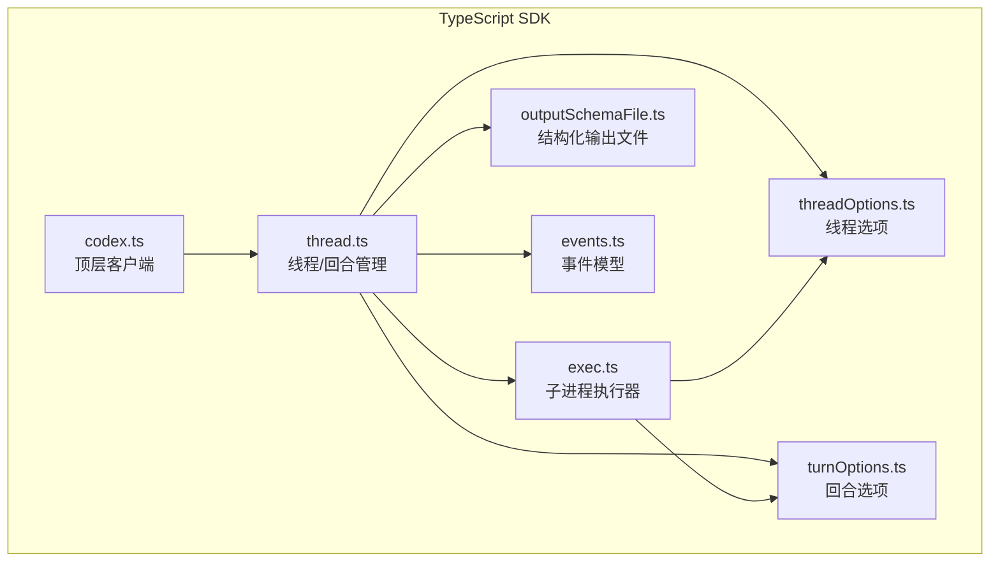
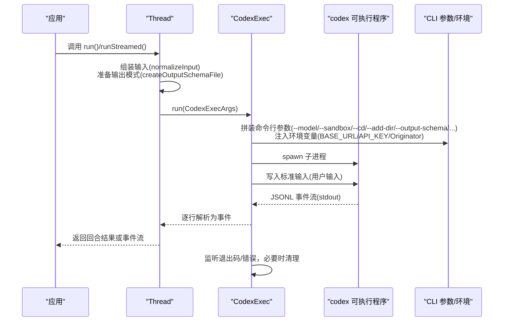
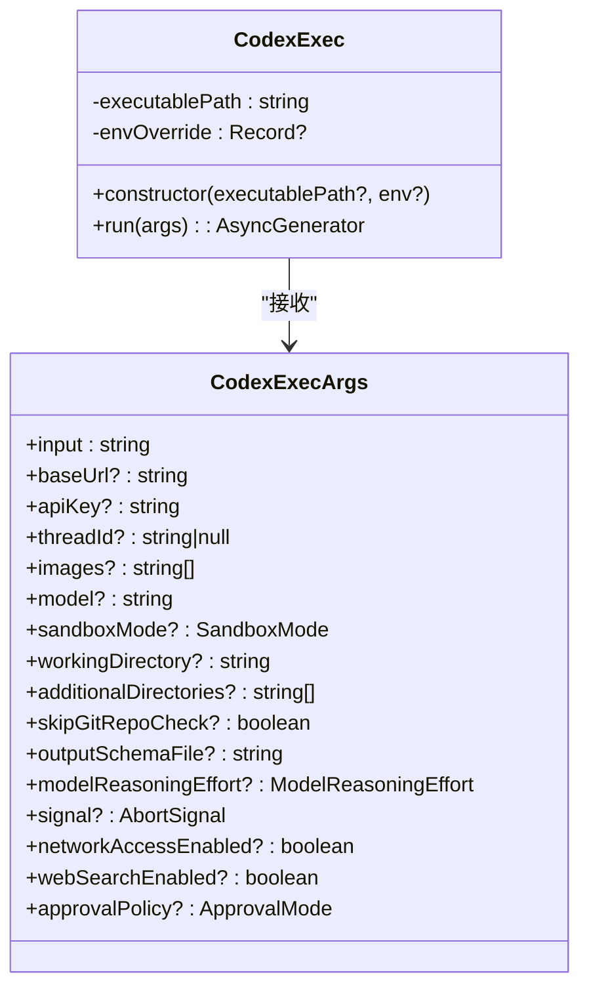
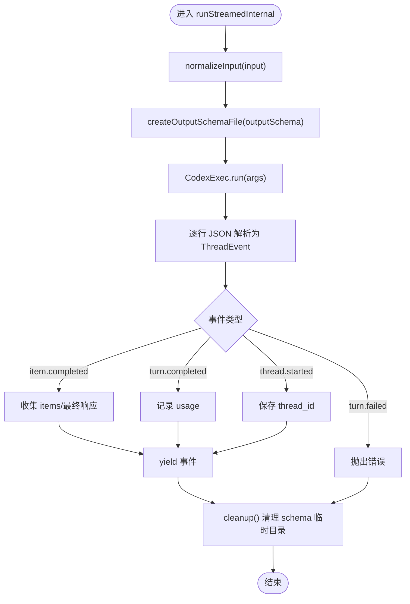
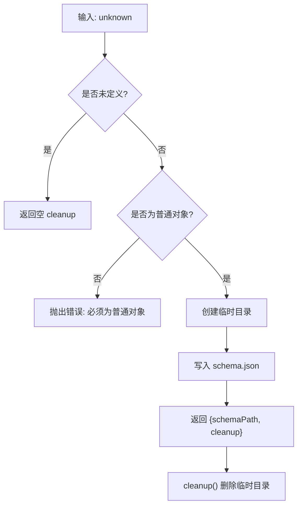
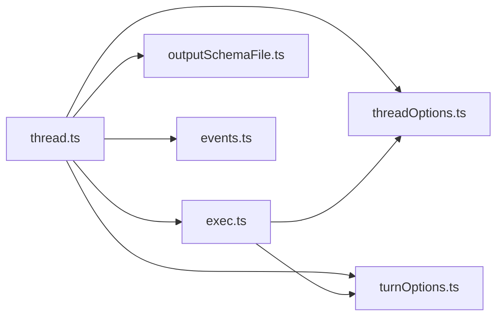

# 执行操作

<cite>
**本文引用的文件列表**
- [exec.ts](file://sdk/typescript/src/exec.ts)
- [threadOptions.ts](file://sdk/typescript/src/threadOptions.ts)
- [turnOptions.ts](file://sdk/typescript/src/turnOptions.ts)
- [outputSchemaFile.ts](file://sdk/typescript/src/outputSchemaFile.ts)
- [thread.ts](file://sdk/typescript/src/thread.ts)
- [codex.ts](file://sdk/typescript/src/codex.ts)
- [events.ts](file://sdk/typescript/src/events.ts)
- [basic_streaming.ts](file://sdk/typescript/samples/basic_streaming.ts)
- [structured_output.ts](file://sdk/typescript/samples/structured_output.ts)
- [helpers.ts](file://sdk/typescript/samples/helpers.ts)
- [run.test.ts](file://sdk/typescript/tests/run.test.ts)
- [runStreamed.test.ts](file://sdk/typescript/tests/runStreamed.test.ts)
</cite>

## 目录
1. [简介](#简介)
2. [项目结构](#项目结构)
3. [核心组件](#核心组件)
4. [架构总览](#架构总览)
5. [详细组件分析](#详细组件分析)
6. [依赖关系分析](#依赖关系分析)
7. [性能与可靠性](#性能与可靠性)
8. [故障排查指南](#故障排查指南)
9. [结论](#结论)
10. [附录：实用示例与最佳实践](#附录实用示例与最佳实践)

## 简介
本文件面向使用 TypeScript SDK 的开发者，系统性说明“执行操作”的实现与用法，重点覆盖：
- 如何通过 exec.ts 发送指令、执行命令与处理任务
- turnOptions.ts 中的选项如何影响执行过程（如审批模式、沙箱设置等）
- 结构化输出能力：outputSchemaFile.ts 在定义与验证输出模式中的作用
- 执行代码生成、文件操作与系统命令的实用示例
- 执行过程中的错误处理与状态监控

## 项目结构
围绕“执行操作”，TypeScript SDK 的关键文件组织如下：
- 执行入口与子进程封装：exec.ts
- 线程与回合控制：thread.ts
- 线程与回合配置：threadOptions.ts、turnOptions.ts
- 结构化输出：outputSchemaFile.ts
- 顶层客户端：codex.ts
- 事件模型：events.ts
- 示例与测试：samples/*、tests/*

图表来源
- [codex.ts](file://sdk/typescript/src/codex.ts#L1-L39)
- [thread.ts](file://sdk/typescript/src/thread.ts#L1-L155)
- [exec.ts](file://sdk/typescript/src/exec.ts#L1-L193)
- [threadOptions.ts](file://sdk/typescript/src/threadOptions.ts#L1-L18)
- [turnOptions.ts](file://sdk/typescript/src/turnOptions.ts#L1-L7)
- [outputSchemaFile.ts](file://sdk/typescript/src/outputSchemaFile.ts#L1-L41)
- [events.ts](file://sdk/typescript/src/events.ts#L1-L81)

章节来源
- [codex.ts](file://sdk/typescript/src/codex.ts#L1-L39)
- [thread.ts](file://sdk/typescript/src/thread.ts#L1-L155)
- [exec.ts](file://sdk/typescript/src/exec.ts#L1-L193)
- [threadOptions.ts](file://sdk/typescript/src/threadOptions.ts#L1-L18)
- [turnOptions.ts](file://sdk/typescript/src/turnOptions.ts#L1-L7)
- [outputSchemaFile.ts](file://sdk/typescript/src/outputSchemaFile.ts#L1-L41)
- [events.ts](file://sdk/typescript/src/events.ts#L1-L81)

## 核心组件
- CodexExec：封装对底层可执行程序的调用，负责参数拼装、环境变量注入、标准输入写入、JSONL 输出流解析与退出码处理。
- Thread：封装一次或多轮对话，支持流式与非流式两种执行路径；在内部将结构化输出模式写入临时文件并通过命令行传递给底层执行器。
- ThreadOptions：线程级配置，如模型、沙箱模式、工作目录、网络访问、Web 搜索、审批策略、附加目录等。
- TurnOptions：回合级配置，当前主要包含输出模式 schema 与取消信号。
- OutputSchemaFile：将 JSON Schema 写入临时文件，并提供清理函数，用于向底层执行器传递结构化输出约束。
- Events：定义线程/回合/条目生命周期事件，便于监控与调试。

章节来源
- [exec.ts](file://sdk/typescript/src/exec.ts#L1-L193)
- [thread.ts](file://sdk/typescript/src/thread.ts#L1-L155)
- [threadOptions.ts](file://sdk/typescript/src/threadOptions.ts#L1-L18)
- [turnOptions.ts](file://sdk/typescript/src/turnOptions.ts#L1-L7)
- [outputSchemaFile.ts](file://sdk/typescript/src/outputSchemaFile.ts#L1-L41)
- [events.ts](file://sdk/typescript/src/events.ts#L1-L81)

## 架构总览
下图展示从应用到底层执行器的调用链路与数据流。

图表来源
- [thread.ts](file://sdk/typescript/src/thread.ts#L66-L111)
- [exec.ts](file://sdk/typescript/src/exec.ts#L51-L191)
- [outputSchemaFile.ts](file://sdk/typescript/src/outputSchemaFile.ts#L10-L36)

## 详细组件分析

### 组件一：CodexExec（执行器）
- 职责
  - 将高层参数映射为底层 CLI 命令行参数与环境变量
  - 启动子进程，写入标准输入，按行读取标准输出的 JSONL 事件
  - 解析退出码与错误信息，统一抛出异常
  - 注入 Originator 标识，便于后端识别来源
- 关键点
  - 平台感知：根据平台与架构自动定位内置二进制路径
  - 取消支持：通过 AbortSignal 支持外部取消
  - 安全边界：可选择性覆盖环境变量，避免泄露宿主环境敏感信息
  - 错误处理：捕获 spawn 错误、非零退出码与 stderr 内容

图表来源
- [exec.ts](file://sdk/typescript/src/exec.ts#L8-L37)
- [exec.ts](file://sdk/typescript/src/exec.ts#L42-L191)

章节来源
- [exec.ts](file://sdk/typescript/src/exec.ts#L1-L193)

### 组件二：Thread（线程/回合）
- 职责
  - runStreamed：以事件流形式返回执行过程，便于实时渲染与监控
  - run：聚合事件，返回回合完成后的最终响应、条目列表与用量统计
  - normalizeInput：将多段输入合并为文本提示与本地图片列表
  - 与输出模式协作：在回合开始前创建临时 schema 文件，并在结束后清理
- 关键点
  - 事件解析：逐行 JSON 解析，识别 thread.started 以记录 thread_id
  - 失败处理：遇到 turn.failed 时抛出错误
  - 环境隔离：通过 CodexOptions.env 控制传给底层的环境变量集合

图表来源
- [thread.ts](file://sdk/typescript/src/thread.ts#L66-L111)
- [thread.ts](file://sdk/typescript/src/thread.ts#L113-L138)
- [outputSchemaFile.ts](file://sdk/typescript/src/outputSchemaFile.ts#L10-L36)

章节来源
- [thread.ts](file://sdk/typescript/src/thread.ts#L1-L155)

### 组件三：结构化输出（OutputSchemaFile）
- 职责
  - 将传入的 JSON Schema 写入临时目录下的 schema.json
  - 提供 cleanup 函数，确保在使用后删除临时文件
  - 对非法输入进行校验（必须是对象）
- 影响范围
  - 通过 --output-schema 传递给底层执行器，驱动模型输出严格遵循指定模式
  - 测试中验证了 schema 写入、flag 传递与临时文件在执行后被清理

图表来源
- [outputSchemaFile.ts](file://sdk/typescript/src/outputSchemaFile.ts#L10-L36)

章节来源
- [outputSchemaFile.ts](file://sdk/typescript/src/outputSchemaFile.ts#L1-L41)
- [run.test.ts](file://sdk/typescript/tests/run.test.ts#L436-L491)
- [runStreamed.test.ts](file://sdk/typescript/tests/runStreamed.test.ts#L161-L203)

### 组件四：选项与执行影响（ThreadOptions 与 TurnOptions）
- ThreadOptions（线程级）
  - 模型：--model
  - 沙箱模式：--sandbox
  - 工作目录：--cd
  - 附加目录：--add-dir（可重复）
  - 跳过 Git 校验：--skip-git-repo-check
  - 模型推理强度：--config model_reasoning_effort="..."
  - 网络访问：--config sandbox_workspace_write.network_access=...
  - Web 搜索：--config features.web_search_request=...
  - 审批策略：--config approval_policy="..."
  - 图片输入：--image（可重复）
- TurnOptions（回合级）
  - outputSchema：结构化输出模式
  - signal：AbortSignal，用于取消回合

章节来源
- [threadOptions.ts](file://sdk/typescript/src/threadOptions.ts#L1-L18)
- [turnOptions.ts](file://sdk/typescript/src/turnOptions.ts#L1-L7)
- [exec.ts](file://sdk/typescript/src/exec.ts#L51-L103)
- [exec.ts](file://sdk/typescript/src/exec.ts#L80-L97)
- [exec.ts](file://sdk/typescript/src/exec.ts#L84-L93)
- [exec.ts](file://sdk/typescript/src/exec.ts#L95-L97)
- [run.test.ts](file://sdk/typescript/tests/run.test.ts#L227-L256)
- [run.test.ts](file://sdk/typescript/tests/run.test.ts#L258-L318)
- [run.test.ts](file://sdk/typescript/tests/run.test.ts#L320-L349)
- [run.test.ts](file://sdk/typescript/tests/run.test.ts#L394-L434)
- [run.test.ts](file://sdk/typescript/tests/run.test.ts#L521-L567)
- [run.test.ts](file://sdk/typescript/tests/run.test.ts#L568-L602)

## 依赖关系分析
- Thread 依赖 CodexExec、ThreadOptions、TurnOptions、OutputSchemaFile、Events
- CodexExec 依赖 ThreadOptions、TurnOptions（通过参数映射）以及 Node 子进程 API
- OutputSchemaFile 仅依赖 Node FS/Os/Path
- Events 为纯类型定义，不依赖其他模块

图表来源
- [thread.ts](file://sdk/typescript/src/thread.ts#L1-L155)
- [exec.ts](file://sdk/typescript/src/exec.ts#L1-L193)
- [threadOptions.ts](file://sdk/typescript/src/threadOptions.ts#L1-L18)
- [turnOptions.ts](file://sdk/typescript/src/turnOptions.ts#L1-L7)
- [outputSchemaFile.ts](file://sdk/typescript/src/outputSchemaFile.ts#L1-L41)
- [events.ts](file://sdk/typescript/src/events.ts#L1-L81)

## 性能与可靠性
- 流式事件：通过 JSONL 逐行解析，避免一次性缓冲大量数据，适合长会话与大输出
- 取消支持：AbortSignal 使长耗时任务可被及时中断
- 平台自适配：自动定位二进制，减少部署成本
- 环境隔离：可显式传入 env，避免泄露宿主敏感变量
- 临时文件清理：结构化输出 schema 使用后自动删除，降低磁盘占用风险

[本节为通用建议，无需列出具体文件来源]

## 故障排查指南
- 子进程无 stdout/stdin
  - 现象：抛出“无 stdout”或“无 stdin”的错误
  - 排查：确认底层可执行程序可用、权限正确
- 非零退出码
  - 现象：抛出包含退出码与 stderr 的错误
  - 排查：查看 stderr 内容，检查模型、沙箱、网络访问、审批策略等配置
- Git 目录校验失败
  - 现象：当工作目录不在受信范围内且未设置跳过校验时触发
  - 排查：设置 skipGitRepoCheck 或将工作目录置于受信范围
- 输出模式无效
  - 现象：创建临时 schema 文件失败或不是普通对象
  - 排查：确保传入的是合法 JSON 对象；检查权限与磁盘空间
- 事件解析失败
  - 现象：无法解析某一行 JSON
  - 排查：确认底层输出格式符合预期；检查编码与换行符

章节来源
- [exec.ts](file://sdk/typescript/src/exec.ts#L134-L191)
- [run.test.ts](file://sdk/typescript/tests/run.test.ts#L604-L633)
- [outputSchemaFile.ts](file://sdk/typescript/src/outputSchemaFile.ts#L10-L36)
- [thread.ts](file://sdk/typescript/src/thread.ts#L96-L111)

## 结论
TypeScript SDK 将“执行操作”抽象为清晰的三层：线程/回合（Thread）、执行器（CodexExec）与结构化输出（OutputSchemaFile）。通过 ThreadOptions 与 TurnOptions，开发者可以灵活控制模型、沙箱、网络、审批策略与输出模式；通过事件流与取消机制，实现可观测、可中断的执行体验。测试覆盖了关键路径与边界条件，保障了稳定性与一致性。

[本节为总结，无需列出具体文件来源]

## 附录：实用示例与最佳实践

### 示例一：基础流式交互
- 功能：启动线程，循环读取用户输入，打印事件与用量统计
- 关键点：使用 runStreamed 获取事件流；根据事件类型打印不同内容
- 参考文件
  - [basic_streaming.ts](file://sdk/typescript/samples/basic_streaming.ts#L1-L91)
  - [helpers.ts](file://sdk/typescript/samples/helpers.ts#L1-L9)

章节来源
- [basic_streaming.ts](file://sdk/typescript/samples/basic_streaming.ts#L1-L91)
- [helpers.ts](file://sdk/typescript/samples/helpers.ts#L1-L9)

### 示例二：结构化输出
- 功能：定义 JSON Schema，要求模型输出固定字段，验证输出严格遵循模式
- 关键点：通过 TurnOptions.outputSchema 传入 schema；底层执行器将该模式写入临时文件并传递给 CLI
- 参考文件
  - [structured_output.ts](file://sdk/typescript/samples/structured_output.ts#L1-L23)
  - [run.test.ts](file://sdk/typescript/tests/run.test.ts#L436-L491)
  - [runStreamed.test.ts](file://sdk/typescript/tests/runStreamed.test.ts#L161-L203)

章节来源
- [structured_output.ts](file://sdk/typescript/samples/structured_output.ts#L1-L23)
- [run.test.ts](file://sdk/typescript/tests/run.test.ts#L436-L491)
- [runStreamed.test.ts](file://sdk/typescript/tests/runStreamed.test.ts#L161-L203)

### 最佳实践清单
- 明确线程级配置：在 startThread 时设置模型、沙箱、网络访问、Web 搜索、审批策略与附加目录
- 使用 TurnOptions.outputSchema：在需要稳定结构化输出时传入 schema，确保模型遵循约束
- 合理使用 AbortSignal：对长耗时任务提供取消能力，提升用户体验
- 控制环境变量：通过 CodexOptions.env 显式传入所需变量，避免泄露宿主敏感信息
- 监控事件流：在 runStreamed 中处理 item.completed/item.updated/turn.completed 等事件，及时反馈进度与用量
- 清理临时资源：依赖 SDK 自动清理 schema 临时目录，避免手动干预

[本节为通用建议，无需列出具体文件来源]