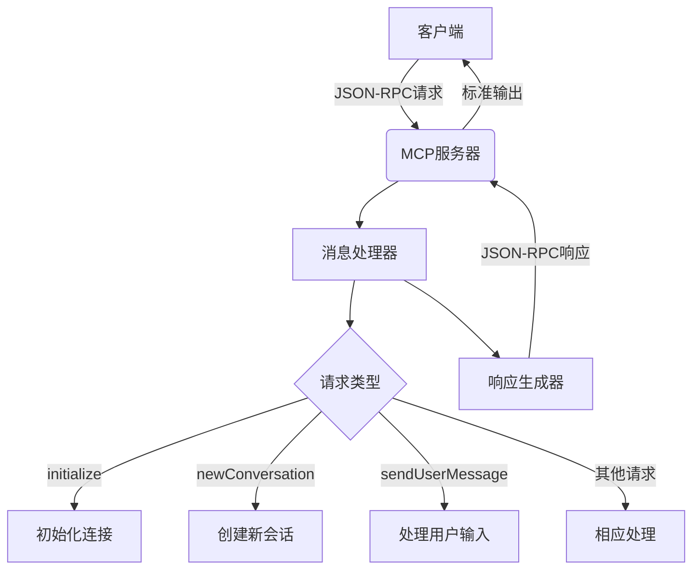
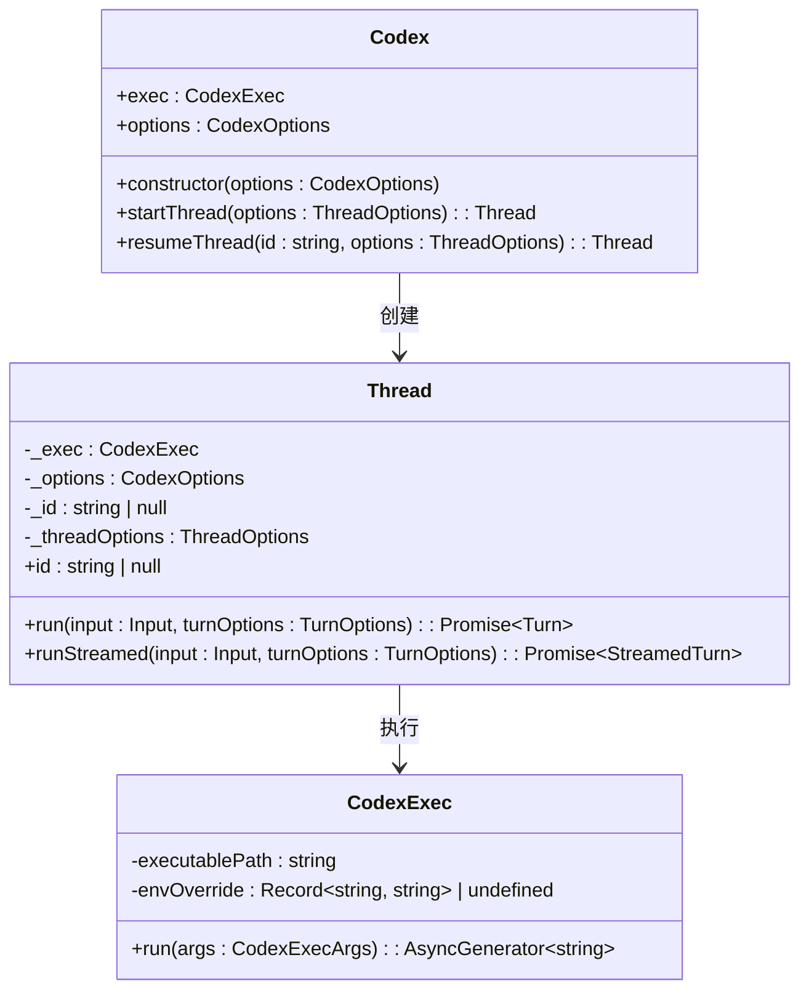
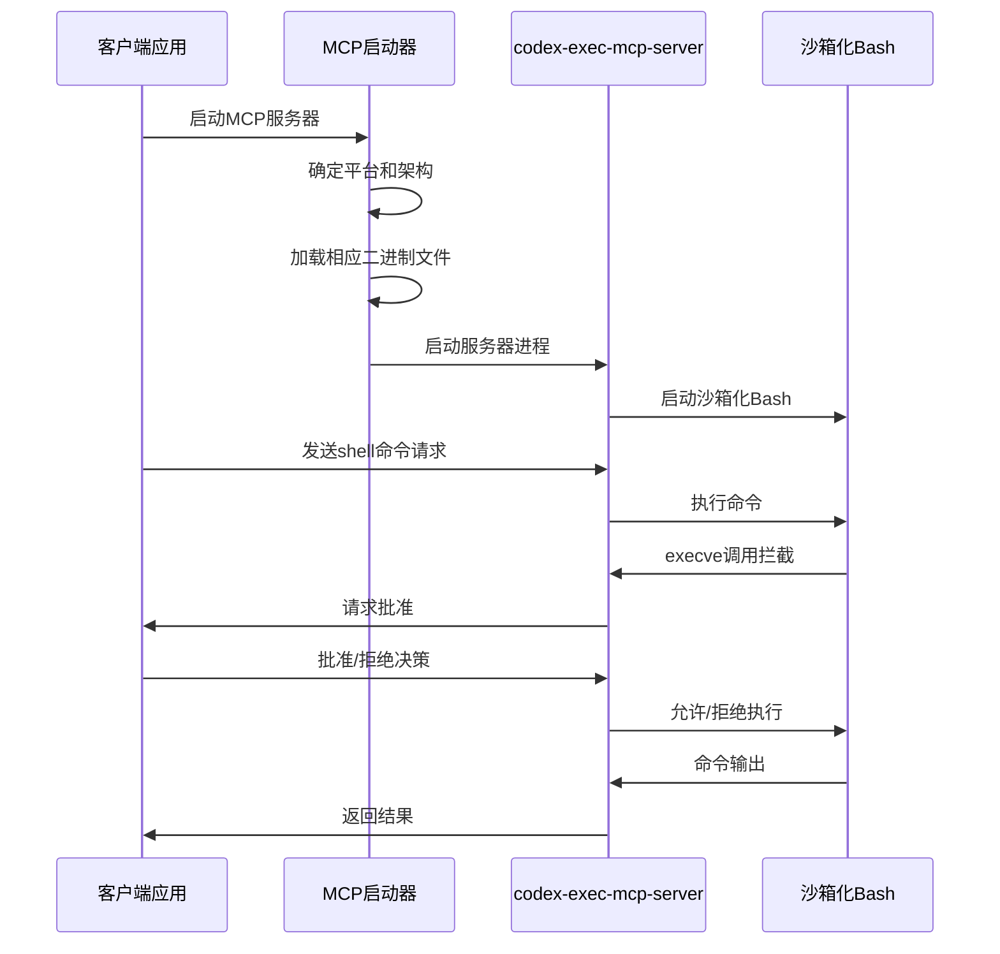

# 扩展机制

<cite>
**本文档中引用的文件**  
- [main.rs](file://codex-rs/mcp-server/src/main.rs)
- [lib.rs](file://codex-rs/mcp-server/src/lib.rs)
- [message_processor.rs](file://codex-rs/mcp-server/src/message_processor.rs)
- [codex_mcp_interface.md](file://codex-rs/docs/codex_mcp_interface.md)
- [protocol_v1.md](file://codex-rs/docs/protocol_v1.md)
- [index.ts](file://sdk/typescript/src/index.ts)
- [codex.ts](file://sdk/typescript/src/codex.ts)
- [thread.ts](file://sdk/typescript/src/thread.ts)
- [exec.ts](file://sdk/typescript/src/exec.ts)
- [mcp-types](file://codex-rs/mcp-types/src/lib.rs)
- [shell-tool-mcp](file://shell-tool-mcp/src/index.ts)
- [README.md](file://shell-tool-mcp/README.md)
</cite>

## 目录
1. [MCP服务器](#mcp服务器)
2. [TypeScript SDK](#typescript-sdk)
3. [shell-tool-mcp扩展实现](#shell-tool-mcp扩展实现)
4. [自定义插件开发指南](#自定义插件开发指南)

## MCP服务器

MCP（Model Control Protocol）服务器是Codex扩展机制的核心组件，它通过JSON-RPC API在标准MCP传输协议上运行，允许外部工具和服务与本地Codex引擎进行交互。该接口目前处于实验阶段，可能会随时变更。

MCP服务器的主要功能包括会话管理、用户输入处理、配置读取和身份验证等。它通过标准输入/输出进行通信，使用换行分隔的JSON格式传输消息。服务器的入口点位于`codex-rs/mcp-server/src/main.rs`，其中`main`函数通过`arg0_dispatch_or_else`调用`run_main`来启动服务器。

服务器的核心逻辑在`lib.rs`中实现，它创建了三个主要的异步任务：
1. 从标准输入读取并解析JSON-RPC消息
2. 处理传入的消息请求
3. 将响应消息写入标准输出

消息处理由`MessageProcessor`结构体负责，它根据不同的请求方法分发到相应的处理函数。例如，`initialize`请求用于初始化连接，`newConversation`用于创建新的对话会话，`sendUserMessage`用于发送用户输入。



**图源**
- [main.rs](file://codex-rs/mcp-server/src/main.rs#L5-L10)
- [lib.rs](file://codex-rs/mcp-server/src/lib.rs#L47-L150)
- [message_processor.rs](file://codex-rs/mcp-server/src/message_processor.rs#L39-L200)

**本节来源**
- [main.rs](file://codex-rs/mcp-server/src/main.rs)
- [lib.rs](file://codex-rs/mcp-server/src/lib.rs)
- [message_processor.rs](file://codex-rs/mcp-server/src/message_processor.rs)

## TypeScript SDK

TypeScript SDK为开发者提供了从其他应用程序中编程式调用Codex功能的接口。SDK的主要入口点是`Codex`类，它位于`sdk/typescript/src/codex.ts`中。通过这个类，开发者可以启动新的对话会话或恢复已有的会话。

SDK的核心功能通过`Thread`类实现，该类代表与代理的一次对话。每个线程可以包含多个连续的回合（turn）。开发者可以通过`run`或`runStreamed`方法向代理提供输入，并获取响应。



**图源**
- [codex.ts](file://sdk/typescript/src/codex.ts#L11-L38)
- [thread.ts](file://sdk/typescript/src/thread.ts#L41-L138)
- [exec.ts](file://sdk/typescript/src/exec.ts#L42-L191)

`CodexExec`类负责实际执行Codex命令行工具。它通过Node.js的`child_process.spawn`方法启动Codex进程，并通过标准输入输出与之通信。SDK将高级API调用转换为相应的命令行参数，例如将`sandboxMode`参数转换为`--sandbox`命令行选项。

**本节来源**
- [index.ts](file://sdk/typescript/src/index.ts)
- [codex.ts](file://sdk/typescript/src/codex.ts)
- [thread.ts](file://sdk/typescript/src/thread.ts)
- [exec.ts](file://sdk/typescript/src/exec.ts)

## shell-tool-mcp扩展实现

`shell-tool-mcp`是一个具体的扩展实现，它提供了一个名为`shell`的工具，可以在沙箱化的Bash实例中运行shell命令。这个特殊的Bash实例会拦截进程创建请求（特别是`execve(2)`调用），并请求MCP服务器决定是否允许执行提议的命令。

该扩展的主要特点包括：
- 拦截`execve(2)`系统调用以精确控制命令执行
- 支持通过Codex `.rules`文件定义命令处理规则
- 提供命令升级（escalation）功能，允许在沙箱外执行命令
- 根据主机操作系统和架构自动选择合适的二进制文件

扩展的实现位于`shell-tool-mcp/src/index.ts`中，其主要逻辑是启动`codex-exec-mcp-server`二进制文件并建立通信。启动器会根据当前平台确定目标三元组（target triple），然后从`vendor`目录中加载相应的二进制文件。



**图源**
- [index.ts](file://shell-tool-mcp/src/index.ts#L11-L97)
- [README.md](file://shell-tool-mcp/README.md#L5-L22)

该扩展要求MCP客户端支持特定的能力声明，特别是`codex/sandbox-state`能力，这使得服务器能够根据沙箱策略更新通知来调整其行为。当与Codex CLI一起使用时，需要禁用默认的shell工具以确保只有一个shell类工具可用。

**本节来源**
- [index.ts](file://shell-tool-mcp/src/index.ts)
- [package.json](file://shell-tool-mcp/package.json)
- [README.md](file://shell-tool-mcp/README.md)

## 自定义插件开发指南

要创建自定义的Codex插件，开发者需要实现一个符合MCP规范的服务器。服务器必须支持基本的JSON-RPC方法，包括`initialize`、`ping`和错误处理。建议从现有的`mcp-server`实现作为起点，因为它已经处理了大部分底层通信细节。

开发自定义插件的关键步骤包括：
1. 定义插件支持的工具和功能
2. 实现相应的JSON-RPC请求处理程序
3. 处理客户端的能力声明和通知
4. 确保与Codex核心系统的正确集成

插件可以通过`config.toml`文件进行配置，使用`mcp_servers`部分来指定启动命令和参数。例如：
```toml
[mcp_servers.my_plugin]
command = "node"
args = ["my-plugin-server.js"]
```

对于需要本地二进制文件的插件，建议使用类似`shell-tool-mcp`的打包方式，将所有必要的二进制文件捆绑在npm包中，并使用JavaScript启动器根据平台选择正确的二进制文件。

**本节来源**
- [codex_mcp_interface.md](file://codex-rs/docs/codex_mcp_interface.md)
- [protocol_v1.md](file://codex-rs/docs/protocol_v1.md)
- [mcp-types](file://codex-rs/mcp-types/src/lib.rs)