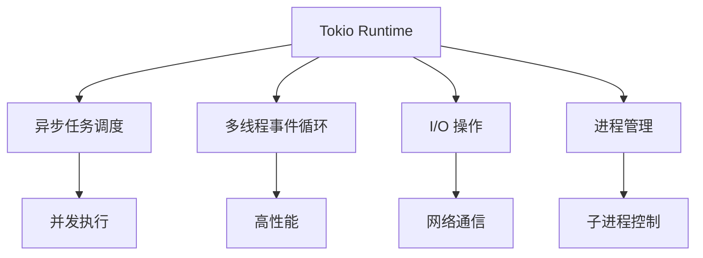
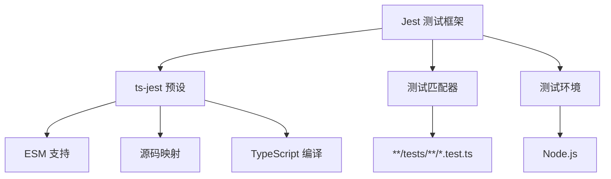
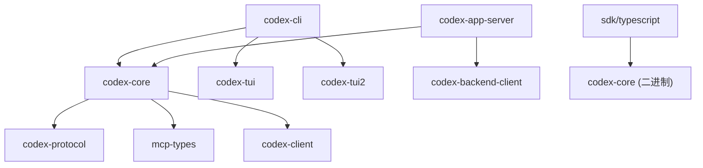

# 技术栈与依赖

<cite>
**本文档中引用的文件**  
- [Cargo.toml](file://codex-rs/Cargo.toml)
- [core/Cargo.toml](file://codex-rs/core/Cargo.toml)
- [app-server/Cargo.toml](file://codex-rs/app-server/Cargo.toml)
- [cli/Cargo.toml](file://codex-rs/cli/Cargo.toml)
- [async-utils/Cargo.toml](file://codex-rs/async-utils/Cargo.toml)
- [utils/readiness/Cargo.toml](file://codex-rs/utils/readiness/Cargo.toml)
- [package.json](file://package.json)
- [pnpm-workspace.yaml](file://pnpm-workspace.yaml)
- [sdk/typescript/package.json](file://sdk/typescript/package.json)
- [sdk/typescript/tsup.config.ts](file://sdk/typescript/tsup.config.ts)
- [sdk/typescript/jest.config.cjs](file://sdk/typescript/jest.config.cjs)
- [codex-cli/package.json](file://codex-cli/package.json)
- [codex-rs/protocol/README.md](file://codex-rs/protocol/README.md)
- [codex-rs/mcp-types/generate_mcp_types.py](file://codex-rs/mcp-types/generate_mcp_types.py)
- [codex-rs/core/src/parse_command.rs](file://codex-rs/core/src/parse_command.rs)
- [codex-rs/execpolicy-legacy/src/valid_exec.rs](file://codex-rs/execpolicy-legacy/src/valid_exec.rs)
- [codex-rs/execpolicy-legacy/src/error.rs](file://codex-rs/execpolicy-legacy/src/error.rs)
- [codex-rs/execpolicy-legacy/src/arg_matcher.rs](file://codex-rs/execpolicy-legacy/src/arg_matcher.rs)
- [codex-rs/execpolicy-legacy/src/program.rs](file://codex-rs/execpolicy-legacy/src/program.rs)
- [sdk/typescript/src/index.ts](file://sdk/typescript/src/index.ts)
- [codex-rs/tui/src/text_formatting.rs](file://codex-rs/tui/src/text_formatting.rs)
- [codex-rs/tui2/src/text_formatting.rs](file://codex-rs/tui2/src/text_formatting.rs)
- [codex-rs/app-server-protocol/src/export.rs](file://codex-rs/app-server-protocol/src/export.rs)
- [codex-rs/rmcp-client/src/find_codex_home.rs](file://codex-rs/rmcp-client/src/find_codex_home.rs)
- [sdk/typescript/src/exec.ts](file://sdk/typescript/src/exec.ts)
</cite>

## 目录
1. [介绍](#介绍)
2. [Rust技术栈](#rust技术栈)
3. [TypeScript技术栈](#typescript技术栈)
4. [主要外部依赖](#主要外部依赖)
5. [内部组件依赖关系](#内部组件依赖关系)
6. [依赖管理策略](#依赖管理策略)
7. [开发环境设置](#开发环境设置)
8. [结论](#结论)

## 介绍

Codex项目是一个复杂的多语言项目，主要使用Rust和TypeScript构建。该项目采用单体仓库（monorepo）结构，包含多个Rust crate和TypeScript包，通过精心设计的依赖管理策略进行组织。本技术文档详细记录了项目的整体技术栈、核心依赖关系以及开发环境的设置方法，为开发者提供全面的参考。

**Section sources**
- [Cargo.toml](file://codex-rs/Cargo.toml)
- [package.json](file://package.json)
- [pnpm-workspace.yaml](file://pnpm-workspace.yaml)

## Rust技术栈

Codex项目的核心功能主要由Rust语言实现，利用其内存安全和高性能特性。项目中的Rust代码库遵循现代Rust开发实践，采用2024版本规范，并通过`Cargo.toml`文件中的`[workspace]`配置进行统一管理。

### 核心异步运行时：Tokio

项目广泛使用`tokio`作为异步运行时，这是Rust生态系统中最流行的异步框架。`tokio`为项目提供了强大的异步I/O、任务调度和并发处理能力。在`codex-core`和`codex-app-server`等核心组件中，`tokio`被配置了`rt-multi-thread`、`macros`和`process`等关键特性，以支持多线程异步执行、宏展开和进程管理。

**Diagram sources**
- [Cargo.toml](file://codex-rs/Cargo.toml)
- [core/Cargo.toml](file://codex-rs/core/Cargo.toml)
- [app-server/Cargo.toml](file://codex-rs/app-server/Cargo.toml)

### 数据序列化与反序列化：Serde

`serde`是项目中用于数据序列化和反序列化的基石库。它与`serde_json`、`serde_yaml`和`toml`等格式化库结合使用，实现了高效、类型安全的数据转换。在`codex-core`中，`serde`被用于处理配置文件、API请求/响应以及内部消息协议，确保了数据在不同系统组件间的一致性和可靠性。

### 命令行接口：Clap

`clap`库被用于构建项目中所有Rust二进制文件的命令行接口（CLI）。它提供了声明式API，使得定义复杂的命令行参数、子命令和选项变得简单直观。`codex-cli`二进制文件利用`clap`的`derive`特性，通过属性宏自动生成解析代码，极大地简化了CLI逻辑的实现。

**Section sources**
- [Cargo.toml](file://codex-rs/Cargo.toml)
- [core/Cargo.toml](file://codex-rs/core/Cargo.toml)
- [cli/Cargo.toml](file://codex-rs/cli/Cargo.toml)

## TypeScript技术栈

Codex项目通过TypeScript SDK为JavaScript/Node.js环境提供接口，使得开发者可以在Web应用或Node.js服务中集成Codex功能。

### 核心工具：Jest

Jest是TypeScript SDK的测试框架，用于编写和运行单元测试与集成测试。`jest.config.cjs`文件配置了项目使用`ts-jest`预设，以支持TypeScript的ES模块（ESM）和源码映射。测试环境被设置为`node`，并使用`ts-jest-mock-import-meta`插件来解决`import.meta.url`在Jest中的兼容性问题。

**Diagram sources**
- [sdk/typescript/jest.config.cjs](file://sdk/typescript/jest.config.cjs)
- [sdk/typescript/package.json](file://sdk/typescript/package.json)

### 构建与打包：Tsup

TypeScript SDK使用`tsup`作为构建工具，它是一个基于`esbuild`的快速打包器。`tsup.config.ts`配置文件定义了将`src/index.ts`作为入口点，生成ES模块（ESM）格式的输出，并启用类型声明（dts）和源码映射（sourcemap）。这种配置确保了SDK可以在现代JavaScript环境中高效地使用。

**Section sources**
- [sdk/typescript/tsup.config.ts](file://sdk/typescript/tsup.config.ts)
- [sdk/typescript/jest.config.cjs](file://sdk/typescript/jest.config.cjs)
- [sdk/typescript/package.json](file://sdk/typescript/package.json)

## 主要外部依赖

### HTTP通信：Reqwest

`reqwest`是项目中用于HTTP客户端通信的核心库。它构建在`tokio`之上，提供了异步、非阻塞的HTTP请求能力。在`codex-core`中，`reqwest`被配置了`json`和`stream`特性，使其能够方便地处理JSON格式的API请求和响应流。该库被用于与Codex后端服务器、认证服务以及其他外部API进行交互。

### 异步实用工具：Async-Utils

`codex-async-utils`是一个内部crate，封装了常用的异步编程模式。它依赖于`tokio`和`async-trait`，为其他组件提供可复用的异步工具函数。这个库的轻量级设计（仅依赖`tokio`的核心特性）使其成为项目中异步逻辑的可靠基础。

### 状态与就绪性管理：Readiness

`codex-utils-readiness`是一个专门用于处理异步就绪性检查的工具库。它利用`tokio`的`sync`和`time`特性，提供了超时和重试机制，确保在执行依赖操作前，相关服务或资源已准备就绪。这对于处理网络延迟或服务启动时间至关重要。

**Section sources**
- [Cargo.toml](file://codex-rs/Cargo.toml)
- [async-utils/Cargo.toml](file://codex-rs/async-utils/Cargo.toml)
- [utils/readiness/Cargo.toml](file://codex-rs/utils/readiness/Cargo.toml)

## 内部组件依赖关系

Codex项目采用分层架构，内部组件通过清晰的依赖关系进行组织。

### 核心依赖：codex-core

`codex-core`是整个Rust代码库的中心，它封装了项目的核心业务逻辑、配置管理、认证和执行策略。其他大多数Rust组件都直接或间接依赖于`codex-core`。例如，`codex-cli`二进制文件直接依赖`codex-core`来执行用户命令，而`codex-app-server`则依赖它来处理来自前端的请求。

### CLI与核心的集成

`codex-cli`是项目的命令行入口点，它依赖于`codex-core`来执行核心功能。`codex-cli`的`Cargo.toml`文件明确列出了对`codex-core`的依赖。此外，`codex-cli`还依赖于`codex-tui`和`codex-tui2`，这两个库提供了基于终端的用户界面（TUI），用于在CLI中展示交互式内容。

### 协议与类型定义

`codex-protocol`和`mcp-types`是项目中定义数据结构和通信协议的关键crate。`codex-protocol`定义了CLI内部组件之间通信的类型，旨在保持最小的依赖。`mcp-types`则通过`generate_mcp_types.py`脚本从JSON Schema生成Rust和TypeScript类型，确保了前后端类型的一致性。

**Diagram sources**
- [cli/Cargo.toml](file://codex-rs/cli/Cargo.toml)
- [core/Cargo.toml](file://codex-rs/core/Cargo.toml)
- [app-server/Cargo.toml](file://codex-rs/app-server/Cargo.toml)
- [mcp-types/generate_mcp_types.py](file://codex-rs/mcp-types/generate_mcp_types.py)
- [sdk/typescript/src/exec.ts](file://sdk/typescript/src/exec.ts)

**Section sources**
- [cli/Cargo.toml](file://codex-rs/cli/Cargo.toml)
- [core/Cargo.toml](file://codex-rs/core/Cargo.toml)
- [app-server/Cargo.toml](file://codex-rs/app-server/Cargo.toml)
- [codex-rs/protocol/README.md](file://codex-rs/protocol/README.md)

## 依赖管理策略

### Rust：Cargo工作区

项目使用Cargo工作区（workspace）来管理所有Rust crate。根目录下的`Cargo.toml`文件定义了`[workspace]`，将`codex-rs`目录下的所有crate统一管理。这种策略带来了诸多优势：
- **版本统一**：所有crate共享相同的版本和许可证信息。
- **依赖集中**：通过`[workspace.dependencies]`，可以集中声明所有crate共享的外部依赖，避免版本冲突。
- **高效构建**：Cargo可以优化整个工作区的依赖解析和编译过程。

### Node.js：PNPM工作区

对于JavaScript/TypeScript部分，项目采用PNPM作为包管理器，并通过`pnpm-workspace.yaml`文件定义了工作区。`sdk/typescript`和`shell-tool-mcp`被包含在工作区中，允许它们之间共享依赖和进行本地链接。根`package.json`文件指定了`pnpm`的最低版本要求，确保了开发环境的一致性。

**Section sources**
- [Cargo.toml](file://codex-rs/Cargo.toml)
- [pnpm-workspace.yaml](file://pnpm-workspace.yaml)
- [package.json](file://package.json)

## 开发环境设置

为开发者提供一个可复现的开发环境是项目成功的关键。

### 环境变量与配置

项目通过`CODEX_HOME`环境变量来指定配置目录。如果未设置，将默认使用`~/.codex`。`find_codex_home`函数在`rmcp-client`中实现，负责解析此路径，确保了配置文件的统一管理。

### 二进制文件定位

TypeScript SDK通过`findCodexPath`函数动态定位Rust编译的`codex`二进制文件。该函数根据运行时的平台（`linux`、`darwin`、`win32`）和架构（`x64`、`arm64`）确定正确的二进制文件路径，并从`vendor`目录中加载，实现了跨平台的无缝集成。

### JSON处理最佳实践

项目在处理JSON时采用了最佳实践。`format_json_compact`函数在`tui`和`tui2`中被使用，它将JSON数据格式化为紧凑的单行格式，以适应Ratatui库的有限换行功能。这避免了因缺少空格而导致的显示问题，同时保持了输出的紧凑性。

**Section sources**
- [codex-rs/rmcp-client/src/find_codex_home.rs](file://codex-rs/rmcp-client/src/find_codex_home.rs)
- [sdk/typescript/src/exec.ts](file://sdk/typescript/src/exec.ts)
- [codex-rs/tui/src/text_formatting.rs](file://codex-rs/tui/src/text_formatting.rs)
- [codex-rs/tui2/src/text_formatting.rs](file://codex-rs/tui2/src/text_formatting.rs)

## 结论

Codex项目构建了一个强大而复杂的多语言技术栈。通过Rust的`tokio`、`serde`和`clap`等库，项目实现了高性能、安全和易用的核心功能。TypeScript SDK则通过`jest`和`tsup`提供了现代化的开发体验。清晰的内部依赖关系和高效的依赖管理策略（Cargo和PNPM工作区）确保了代码库的可维护性和一致性。为开发者提供的详细环境设置指导，使得新成员能够快速上手并贡献代码。整体架构体现了对现代软件工程最佳实践的深刻理解和应用。