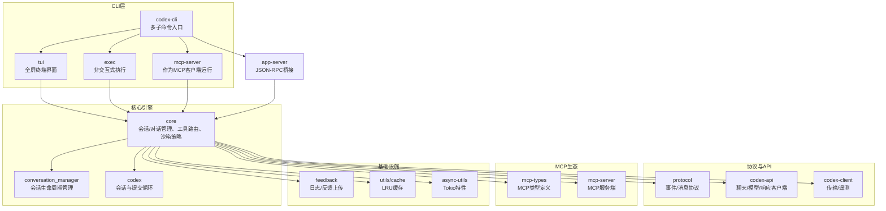
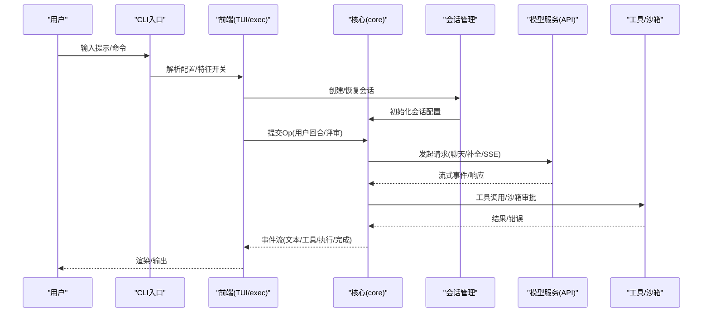
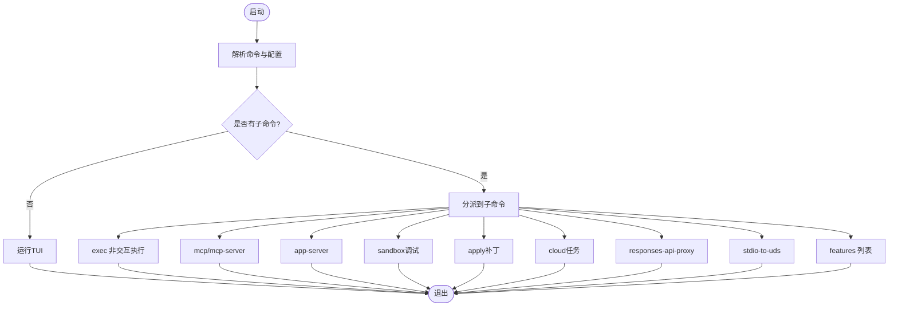
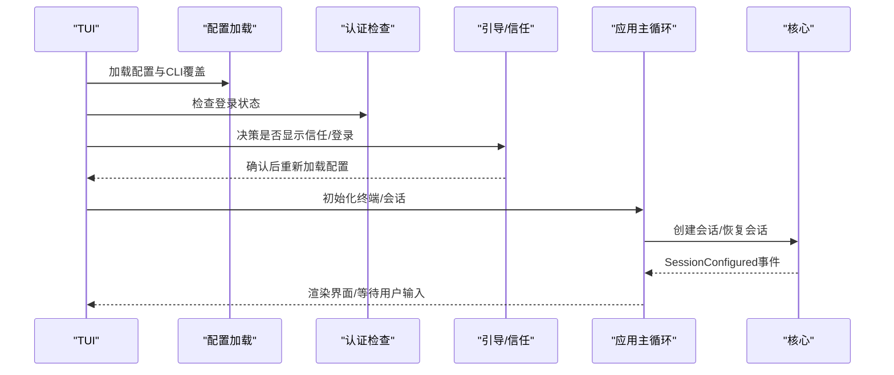
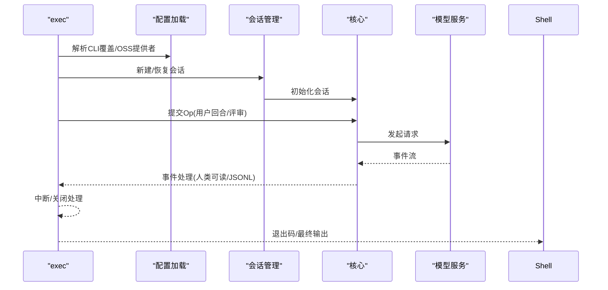
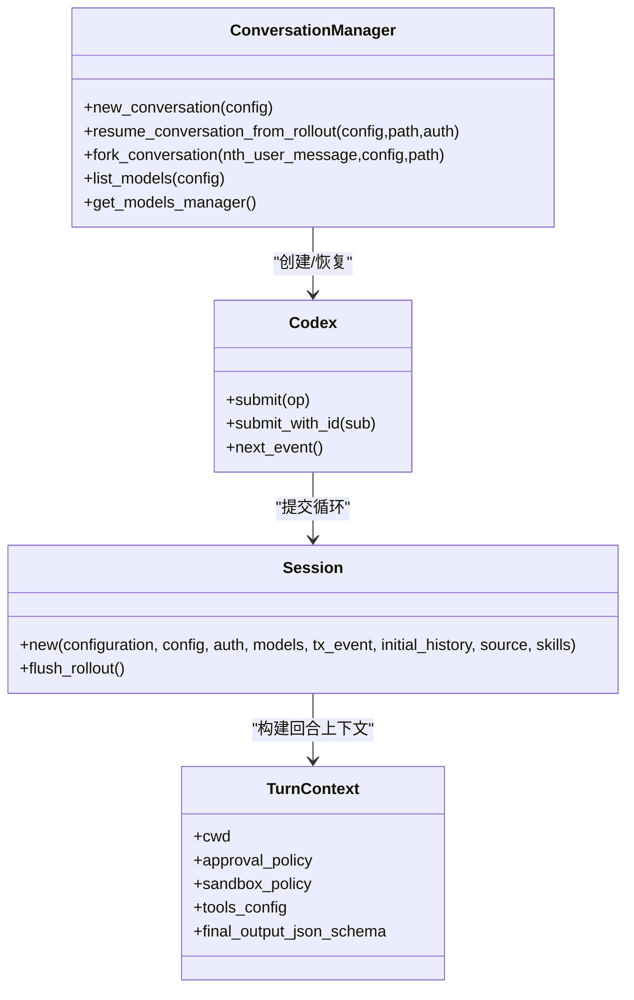
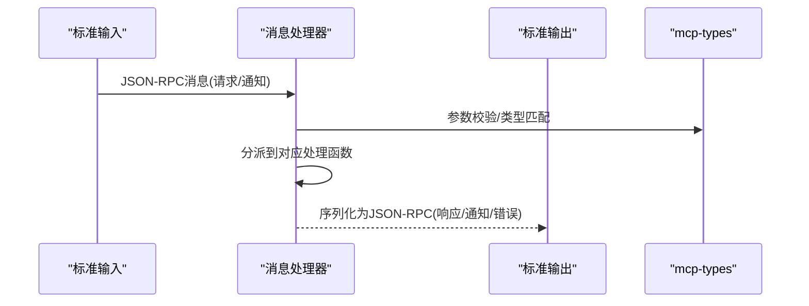
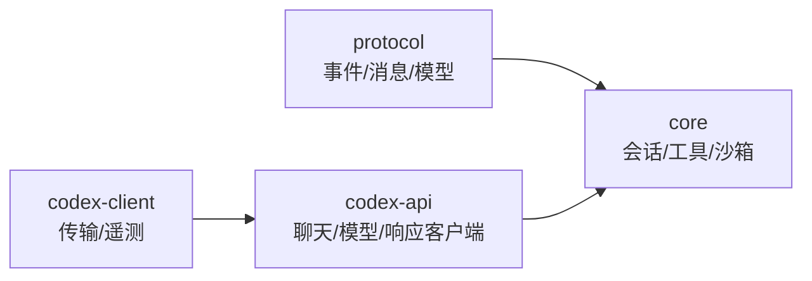
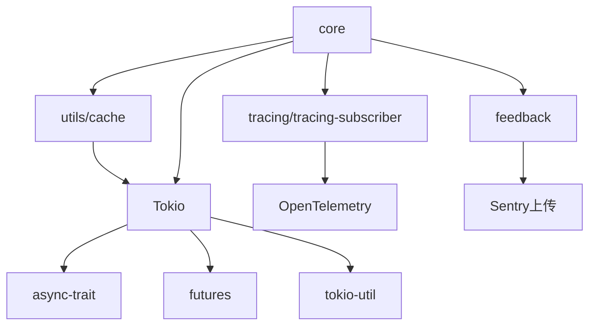

# 架构文档

<cite>
**本文引用的文件**
- [Cargo.toml](file://codex-rs/Cargo.toml)
- [README.md](file://codex-rs/README.md)
- [cli/main.rs](file://codex-rs/cli/src/main.rs)
- [tui/lib.rs](file://codex-rs/tui/src/lib.rs)
- [exec/lib.rs](file://codex-rs/exec/src/lib.rs)
- [app-server/main.rs](file://codex-rs/app-server/src/main.rs)
- [app-server/lib.rs](file://codex-rs/app-server/src/lib.rs)
- [mcp-server/main.rs](file://codex-rs/mcp-server/src/main.rs)
- [core/lib.rs](file://codex-rs/core/src/lib.rs)
- [core/codex.rs](file://codex-rs/core/src/codex.rs)
- [core/conversation_manager.rs](file://codex-rs/core/src/conversation_manager.rs)
- [protocol/lib.rs](file://codex-rs/protocol/src/lib.rs)
- [codex-api/lib.rs](file://codex-rs/codex-api/src/lib.rs)
- [async-utils/Cargo.toml](file://codex-rs/async-utils/Cargo.toml)
- [utils/cache/src/lib.rs](file://codex-rs/utils/cache/src/lib.rs)
- [mcp-types/src/lib.rs](file://codex-rs/mcp-types/src/lib.rs)
- [mcp-server/message_processor.rs](file://codex-rs/mcp-server/src/message_processor.rs)
- [mcp-server/outgoing_message.rs](file://codex-rs/mcp-server/src/outgoing_message.rs)
- [core/client.rs](file://codex-rs/core/src/client.rs)
- [core/tools/registry.rs](file://codex-rs/core/src/tools/registry.rs)
- [core/tools/sandboxing.rs](file://codex-rs/core/src/tools/sandboxing.rs)
- [codex-client/telemetry.rs](file://codex-rs/codex-client/src/telemetry.rs)
- [feedback/src/lib.rs](file://codex-rs/feedback/src/lib.rs)
</cite>

## 目录
1. [引言](#引言)
2. [项目结构](#项目结构)
3. [核心组件](#核心组件)
4. [架构总览](#架构总览)
5. [详细组件分析](#详细组件分析)
6. [依赖关系分析](#依赖关系分析)
7. [性能考量](#性能考量)
8. [故障排查指南](#故障排查指南)
9. [结论](#结论)
10. [附录](#附录)

## 引言
本架构文档面向Codex的Rust实现，聚焦于模块化架构与组件交互（CLI、核心引擎、TUI、执行器、MCP服务器），解释从用户输入到模型服务再到执行结果的数据流，并阐述关键设计决策（如Rust语言带来的安全与性能优势、异步编程模型）。文档同时提供组件图与序列图，帮助读者快速把握系统行为；并讨论跨领域关注点：安全性、错误处理与可扩展性。

## 项目结构
Codex采用Cargo工作区组织，核心业务逻辑集中在core crate，CLI通过多子命令入口分发至不同前端（TUI、headless exec、MCP server等），并通过统一的协议与事件模型连接到模型服务与工具系统。

图表来源
- [Cargo.toml](file://codex-rs/Cargo.toml#L1-L120)
- [cli/main.rs](file://codex-rs/cli/src/main.rs#L428-L646)
- [tui/lib.rs](file://codex-rs/tui/src/lib.rs#L103-L180)
- [exec/lib.rs](file://codex-rs/exec/src/lib.rs#L69-L124)
- [app-server/lib.rs](file://codex-rs/app-server/src/lib.rs#L45-L124)
- [core/lib.rs](file://codex-rs/core/src/lib.rs#L1-L129)
- [protocol/lib.rs](file://codex-rs/protocol/src/lib.rs#L1-L16)
- [codex-api/lib.rs](file://codex-rs/codex-api/src/lib.rs#L1-L37)
- [mcp-types/src/lib.rs](file://codex-rs/mcp-types/src/lib.rs#L1-L34)
- [mcp-server/message_processor.rs](file://codex-rs/mcp-server/src/message_processor.rs#L238-L276)
- [feedback/src/lib.rs](file://codex-rs/feedback/src/lib.rs#L158-L200)
- [utils/cache/src/lib.rs](file://codex-rs/utils/cache/src/lib.rs#L1-L44)
- [async-utils/Cargo.toml](file://codex-rs/async-utils/Cargo.toml#L1-L16)

章节来源
- [Cargo.toml](file://codex-rs/Cargo.toml#L1-L120)
- [README.md](file://codex-rs/README.md#L91-L99)

## 核心组件
- CLI（codex-cli）：多子命令入口，负责解析配置、特征开关、分发到TUI、exec或MCP子系统。
- 核心引擎（core）：会话管理、工具路由、沙箱策略、事件流、模型客户端、MCP连接管理。
- TUI（tui）：基于Ratatui的全屏交互界面，负责渲染、事件处理与用户体验。
- 执行器（exec）：非交互式执行模式，面向自动化场景，输出结构化事件。
- MCP服务器（mcp-server）：以stdio传输运行的MCP服务端，支持资源列表、订阅等。
- 协议与API（protocol、codex-api、codex-client）：统一事件/消息协议与模型服务访问层。
- 基础设施（feedback、utils/cache、async-utils）：遥测与反馈、缓存、异步工具集。

章节来源
- [core/lib.rs](file://codex-rs/core/src/lib.rs#L1-L129)
- [protocol/lib.rs](file://codex-rs/protocol/src/lib.rs#L1-L16)
- [codex-api/lib.rs](file://codex-rs/codex-api/src/lib.rs#L1-L37)

## 架构总览
Codex采用“前端-核心-协议-模型服务”的分层架构：
- 前端（CLI/TUI/exec/MCP）负责用户输入与配置，将操作封装为Op并提交给核心。
- 核心（Codex/ConversationManager）维护会话状态、工具路由、沙箱策略与事件流。
- 协议（protocol）定义事件/消息格式，确保前后端一致。
- 模型服务（codex-api/codex-client）负责与外部模型提供商通信，支持SSE与遥测。

图表来源
- [cli/main.rs](file://codex-rs/cli/src/main.rs#L428-L646)
- [tui/lib.rs](file://codex-rs/tui/src/lib.rs#L103-L180)
- [exec/lib.rs](file://codex-rs/exec/src/lib.rs#L69-L124)
- [core/conversation_manager.rs](file://codex-rs/core/src/conversation_manager.rs#L106-L169)
- [core/codex.rs](file://codex-rs/core/src/codex.rs#L204-L333)
- [codex-api/lib.rs](file://codex-rs/codex-api/src/lib.rs#L1-L37)

## 详细组件分析

### CLI组件分析
- 多子命令入口：包含exec、review、login、logout、mcp、mcp-server、app-server、sandbox、apply、cloud、responses-api-proxy、stdio-to-uds、features等。
- 配置覆盖与特征开关：支持全局配置覆盖与特征开关，按优先级合并到各子命令。
- 交互式与非交互式分流：默认进入TUI，也可通过子命令进入exec或MCP server。

图表来源
- [cli/main.rs](file://codex-rs/cli/src/main.rs#L77-L133)
- [cli/main.rs](file://codex-rs/cli/src/main.rs#L447-L646)

章节来源
- [cli/main.rs](file://codex-rs/cli/src/main.rs#L428-L646)

### TUI组件分析
- 启动流程：解析CLI参数、加载配置、初始化日志与遥测、选择OSS提供者、构建会话配置。
- 信任与登录引导：根据平台与沙箱策略决定是否展示信任屏幕与登录引导。
- 会话恢复：支持显式ID、最近一次或选择器恢复。
- 事件驱动渲染：通过事件处理器将模型输出与工具结果渲染到终端。

图表来源
- [tui/lib.rs](file://codex-rs/tui/src/lib.rs#L103-L180)
- [tui/lib.rs](file://codex-rs/tui/src/lib.rs#L334-L513)

章节来源
- [tui/lib.rs](file://codex-rs/tui/src/lib.rs#L103-L180)
- [tui/lib.rs](file://codex-rs/tui/src/lib.rs#L334-L513)

### 执行器组件分析
- 非交互执行：支持人类可读输出与JSONL两种模式，严格区分stdout/stderr。
- 事件通道：使用Tokio无界通道接收模型事件，支持中断信号。
- 自动化友好：在致命错误时返回非零退出码，便于CI集成。
- 提示与评审：支持自定义提示、图片输入、输出模式与评审目标。

图表来源
- [exec/lib.rs](file://codex-rs/exec/src/lib.rs#L69-L124)
- [exec/lib.rs](file://codex-rs/exec/src/lib.rs#L364-L465)

章节来源
- [exec/lib.rs](file://codex-rs/exec/src/lib.rs#L69-L124)
- [exec/lib.rs](file://codex-rs/exec/src/lib.rs#L364-L465)

### 核心引擎组件分析
- 会话与提交循环：Codex通过bounded/unbounded通道接收Op并产生事件，支持并发工具调用与流式事件。
- 会话管理：ConversationManager负责创建/恢复/分叉会话，确保首个事件为SessionConfigured。
- 工具路由与沙箱：工具注册表按负载类型选择处理器，对写入类工具启用沙箱门控；沙箱策略与审批策略由配置驱动。
- 模型客户端：封装聊天/补全/响应接口，支持SSE与遥测上报。

图表来源
- [core/conversation_manager.rs](file://codex-rs/core/src/conversation_manager.rs#L106-L169)
- [core/codex.rs](file://codex-rs/core/src/codex.rs#L204-L333)
- [core/codex.rs](file://codex-rs/core/src/codex.rs#L335-L537)

章节来源
- [core/conversation_manager.rs](file://codex-rs/core/src/conversation_manager.rs#L1-L264)
- [core/codex.rs](file://codex-rs/core/src/codex.rs#L1-L200)
- [core/codex.rs](file://codex-rs/core/src/codex.rs#L204-L333)

### MCP服务器组件分析
- 运行方式：以stdio传输运行，遵循JSON-RPC 2.0，支持请求/通知/响应/错误。
- 类型系统：基于mcp-types生成的类型，确保与MCP规范一致。
- 消息处理：message_processor根据方法名分派到具体处理函数，outgoing_message负责序列化为JSON-RPC消息。

图表来源
- [app-server/lib.rs](file://codex-rs/app-server/src/lib.rs#L45-L124)
- [mcp-types/src/lib.rs](file://codex-rs/mcp-types/src/lib.rs#L1-L34)
- [mcp-server/message_processor.rs](file://codex-rs/mcp-server/src/message_processor.rs#L238-L276)
- [mcp-server/outgoing_message.rs](file://codex-rs/mcp-server/src/outgoing_message.rs#L189-L231)

章节来源
- [mcp-server/main.rs](file://codex-rs/mcp-server/src/main.rs#L1-L11)
- [mcp-server/message_processor.rs](file://codex-rs/mcp-server/src/message_processor.rs#L238-L276)
- [mcp-server/outgoing_message.rs](file://codex-rs/mcp-server/src/outgoing_message.rs#L189-L231)
- [mcp-types/src/lib.rs](file://codex-rs/mcp-types/src/lib.rs#L1-L34)

### 协议与API组件分析
- 协议（protocol）：定义事件、消息、模型、配置等类型，确保前端与核心的一致性。
- API（codex-api）：封装聊天、模型列表、响应等客户端，支持SSE聚合与遥测。
- 客户端（codex-client）：抽象传输与遥测接口，便于替换底层HTTP实现。

图表来源
- [protocol/lib.rs](file://codex-rs/protocol/src/lib.rs#L1-L16)
- [codex-api/lib.rs](file://codex-rs/codex-api/src/lib.rs#L1-L37)
- [core/client.rs](file://codex-rs/core/src/client.rs#L441-L537)
- [codex-client/telemetry.rs](file://codex-rs/codex-client/src/telemetry.rs#L1-L14)

章节来源
- [protocol/lib.rs](file://codex-rs/protocol/src/lib.rs#L1-L16)
- [codex-api/lib.rs](file://codex-rs/codex-api/src/lib.rs#L1-L37)
- [core/client.rs](file://codex-rs/core/src/client.rs#L441-L537)
- [codex-client/telemetry.rs](file://codex-rs/codex-client/src/telemetry.rs#L1-L14)

## 依赖关系分析
- 异步运行时：Tokio作为主要运行时，配合async-trait、futures、tokio-util等。
- 日志与遥测：tracing/tracing-subscriber用于结构化日志；OpenTelemetry用于API请求与SSE事件统计。
- 缓存与工具：utils/cache提供Tokio保护的LRU缓存；async-utils提供Tokio宏与时间特性。
- 错误与反馈：feedback支持将日志快照上传Sentry，便于问题定位。

图表来源
- [async-utils/Cargo.toml](file://codex-rs/async-utils/Cargo.toml#L1-L16)
- [utils/cache/src/lib.rs](file://codex-rs/utils/cache/src/lib.rs#L1-L44)
- [feedback/src/lib.rs](file://codex-rs/feedback/src/lib.rs#L158-L200)
- [core/client.rs](file://codex-rs/core/src/client.rs#L441-L537)

章节来源
- [async-utils/Cargo.toml](file://codex-rs/async-utils/Cargo.toml#L1-L16)
- [utils/cache/src/lib.rs](file://codex-rs/utils/cache/src/lib.rs#L1-L44)
- [feedback/src/lib.rs](file://codex-rs/feedback/src/lib.rs#L158-L200)

## 性能考量
- 异步与并发：使用Tokio无界通道与任务分发，避免阻塞；工具调用前等待“沙箱门”释放，确保顺序一致性。
- 缓存优化：LRU缓存在Tokio运行时中保护，减少重复计算；仅在运行时有效，避免同步开销。
- 事件流：SSE事件聚合与事件过滤，降低前端渲染压力；exec模式严格区分stdout/stderr，避免额外I/O。
- 启动并行：会话初始化阶段并行加载回放记录、历史元数据与MCP认证状态，缩短冷启动时间。

章节来源
- [core/tools/registry.rs](file://codex-rs/core/src/tools/registry.rs#L88-L131)
- [utils/cache/src/lib.rs](file://codex-rs/utils/cache/src/lib.rs#L1-L44)
- [core/codex.rs](file://codex-rs/core/src/codex.rs#L579-L620)

## 故障排查指南
- 登录与认证：TUI在需要OpenAI认证时引导登录；exec模式强制登录限制检查。
- 沙箱与审批：根据approval_policy与sandbox_policy决定是否需要用户批准；Windows原生环境在未启用实验沙箱时跳过信任提示。
- 错误与遥测：模型请求失败时映射为统一错误并上报OpenTelemetry；Sentry上传可附带日志快照与回放路径。
- 事件处理：exec模式遇到致命错误返回非零退出码；TUI在panic时通过tracing记录并在终端状态行显示。

章节来源
- [tui/lib.rs](file://codex-rs/tui/src/lib.rs#L564-L601)
- [core/tools/sandboxing.rs](file://codex-rs/core/src/tools/sandboxing.rs#L152-L194)
- [core/client.rs](file://codex-rs/core/src/client.rs#L441-L537)
- [feedback/src/lib.rs](file://codex-rs/feedback/src/lib.rs#L158-L200)

## 结论
Codex通过清晰的模块化架构与统一协议，实现了从CLI到核心引擎再到模型服务的高效数据流。Rust提供了内存安全与高性能基础，异步编程模型提升了并发与吞吐能力。安全方面，沙箱策略与审批机制贯穿工具调用链；可观测性通过OpenTelemetry与Sentry完善了错误追踪与性能监控。该架构既满足交互式体验（TUI），也兼顾自动化需求（exec），并支持MCP生态扩展。

## 附录
- 关键设计决策
  - 使用Rust：内存安全、零成本抽象、高性能，适合系统级与并发密集场景。
  - 异步模型：Tokio任务与通道解耦I/O与业务逻辑，提升响应性与吞吐量。
  - 统一协议：protocol crate确保前后端一致的消息契约，简化扩展与测试。
  - 沙箱与审批：在工具执行前进行策略评估与用户确认，保障系统安全。
  - 遥测与反馈：OpenTelemetry与Sentry结合，覆盖API请求、SSE事件与日志快照，便于问题定位与性能分析。