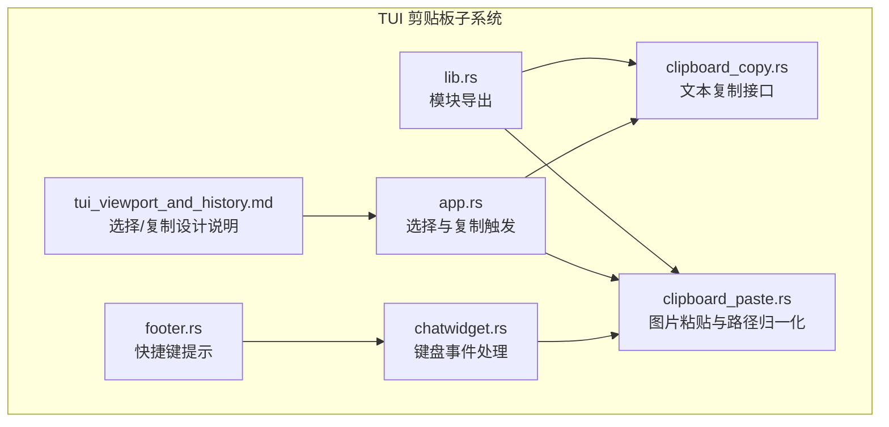
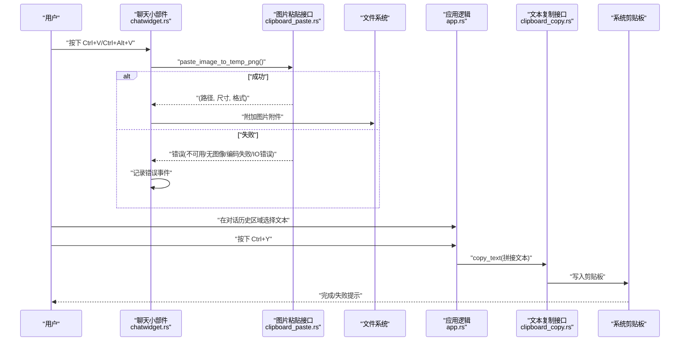
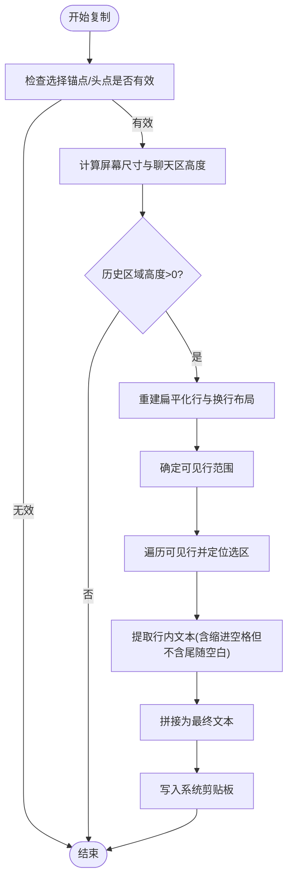
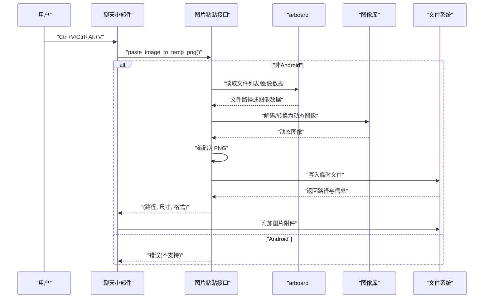
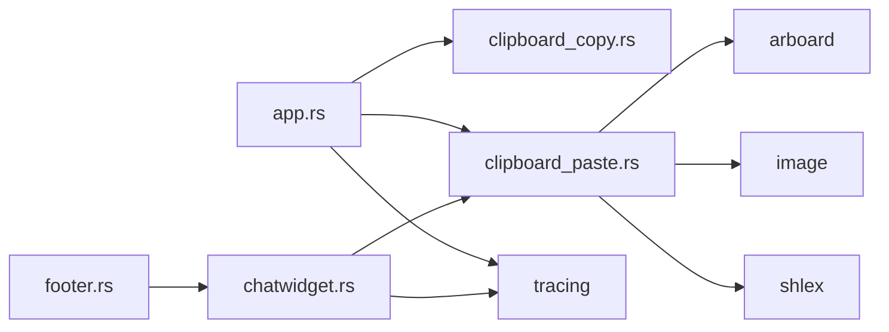

# TUI剪贴板功能

<cite>
**本文引用的文件**
- [clipboard_copy.rs](file://codex-rs/tui2/src/clipboard_copy.rs)
- [clipboard_paste.rs](file://codex-rs/tui2/src/clipboard_paste.rs)
- [app.rs](file://codex-rs/tui2/src/app.rs)
- [chatwidget.rs](file://codex-rs/tui2/src/chatwidget.rs)
- [footer.rs](file://codex-rs/tui2/src/bottom_pane/footer.rs)
- [tui_viewport_and_history.md](file://codex-rs/tui2/docs/tui_viewport_and_history.md)
- [lib.rs](file://codex-rs/tui2/src/lib.rs)
- [clipboard_paste.rs（旧版）](file://codex-rs/tui/src/clipboard_paste.rs)
</cite>

## 目录
1. [简介](#简介)
2. [项目结构](#项目结构)
3. [核心组件](#核心组件)
4. [架构总览](#架构总览)
5. [详细组件分析](#详细组件分析)
6. [依赖关系分析](#依赖关系分析)
7. [性能考量](#性能考量)
8. [故障排查指南](#故障排查指南)
9. [结论](#结论)

## 简介
本文件系统性梳理 Codex TUI 的剪贴板功能，覆盖文本复制与图片粘贴两大能力：
- 文本复制：在对话历史区域进行选择后，按 Ctrl+Y 或通过底部状态栏提示的快捷键复制到系统剪贴板。
- 图片粘贴：支持从系统剪贴板读取图片并保存为临时 PNG 文件，或在 WSL 环境下通过 Windows PowerShell 回写到本地路径，再由 TUI 读取并作为附件插入。

该功能贯穿 TUI 的渲染、输入事件处理、剪贴板访问与跨平台兼容策略，确保在不同终端与操作系统环境下提供一致的用户体验。

## 项目结构
与剪贴板相关的核心模块分布如下：
- 剪贴板文本复制：clipboard_copy.rs 提供统一的文本写入接口，并在 app.rs 中触发复制逻辑。
- 剪贴板图片粘贴：clipboard_paste.rs 提供图片读取、编码与路径归一化；chatwidget.rs 在键盘事件中调用以插入图片附件；footer.rs 展示粘贴图片的快捷键提示。
- 文档说明：tui_viewport_and_history.md 对选择与复制的交互模型进行了设计说明。
- 入口与集成：lib.rs 将 clipboard 模块纳入 TUI crate。

图表来源
- [clipboard_copy.rs](file://codex-rs/tui2/src/clipboard_copy.rs#L1-L80)
- [clipboard_paste.rs](file://codex-rs/tui2/src/clipboard_paste.rs#L1-L200)
- [app.rs](file://codex-rs/tui2/src/app.rs#L1294-L1455)
- [chatwidget.rs](file://codex-rs/tui2/src/chatwidget.rs#L1431-L1472)
- [footer.rs](file://codex-rs/tui2/src/bottom_pane/footer.rs#L357-L436)
- [tui_viewport_and_history.md](file://codex-rs/tui2/docs/tui_viewport_and_history.md#L161-L190)
- [lib.rs](file://codex-rs/tui2/src/lib.rs#L34-L88)

章节来源
- [lib.rs](file://codex-rs/tui2/src/lib.rs#L34-L88)

## 核心组件
- 文本复制接口（clipboard_copy.rs）
  - 定义 ClipboardManager trait 与 ArboardClipboardManager 实现，封装系统剪贴板写入。
  - 提供 copy_text(text) 统一入口，处理 Android 平台不支持的情况。
- 图片粘贴接口（clipboard_paste.rs）
  - paste_image_as_png(): 从 arboard 读取图片或文件列表，优先文件路径，再回退到图像数据；编码为 PNG 并返回尺寸与格式信息。
  - paste_image_to_temp_png(): 将图片写入临时文件并返回路径与信息；Linux 下在失败时尝试 WSL 回退（PowerShell 写图到 Windows 路径，再映射到 WSL）。
  - normalize_pasted_path(): 归一化粘贴的路径字符串，支持 file:// URL、Windows/UNC 路径、shell-escaped 单路径等；Linux 下在 WSL 环境下将 Windows 路径转换为 /mnt/x/...。
  - is_probably_wsl()/convert_windows_path_to_wsl(): 判断与转换 WSL 路径。
- 选择与复制（app.rs）
  - copy_transcript_selection(): 基于当前选择的锚点与头点，重建与屏幕一致的换行布局，遍历选区行与列，拼接文本并写入剪贴板。
  - transcript_point_from_coordinates(): 将鼠标坐标映射为内容相对的选择点。
- 键盘事件与快捷键（chatwidget.rs、footer.rs）
  - Ctrl+Alt+V（WSL）或 Ctrl+V（非 WSL）触发图片粘贴流程。
  - 底部状态栏显示 Ctrl+Y 复制选择的提示；在滚动与选择激活时动态更新。

章节来源
- [clipboard_copy.rs](file://codex-rs/tui2/src/clipboard_copy.rs#L1-L80)
- [clipboard_paste.rs](file://codex-rs/tui2/src/clipboard_paste.rs#L1-L200)
- [app.rs](file://codex-rs/tui2/src/app.rs#L1294-L1455)
- [chatwidget.rs](file://codex-rs/tui2/src/chatwidget.rs#L1431-L1472)
- [footer.rs](file://codex-rs/tui2/src/bottom_pane/footer.rs#L357-L436)

## 架构总览
剪贴板功能的端到端流程如下：

图表来源
- [chatwidget.rs](file://codex-rs/tui2/src/chatwidget.rs#L1431-L1472)
- [clipboard_paste.rs](file://codex-rs/tui2/src/clipboard_paste.rs#L119-L150)
- [app.rs](file://codex-rs/tui2/src/app.rs#L1294-L1455)
- [clipboard_copy.rs](file://codex-rs/tui2/src/clipboard_copy.rs#L76-L80)

## 详细组件分析

### 文本复制：选择-重建-复制
- 选择模型
  - 选择以“扁平化换行后的行索引与列偏移”定义，避免直接使用原始缓冲区坐标，保证滚动时选择随内容移动。
  - 鼠标拖拽更新锚点与头点；键盘 PgUp/PgDn/Home/End 也基于同一模型滚动。
- 复制流程
  - 计算屏幕可用高度与聊天区高度，确定对话历史可视区域。
  - 重建与屏幕一致的换行布局，仅对可见行进行渲染缓冲。
  - 遍历选区内每行，计算起止列，过滤空白字符，拼接为最终文本。
  - 调用 clipboard_copy::copy_text 写入系统剪贴板，失败时记录日志。

图表来源
- [app.rs](file://codex-rs/tui2/src/app.rs#L1294-L1455)
- [clipboard_copy.rs](file://codex-rs/tui2/src/clipboard_copy.rs#L76-L80)

章节来源
- [app.rs](file://codex-rs/tui2/src/app.rs#L1294-L1455)
- [tui_viewport_and_history.md](file://codex-rs/tui2/docs/tui_viewport_and_history.md#L161-L190)

### 图片粘贴：多源读取与跨平台回退
- 多源读取
  - 优先从 arboard 获取文件列表，若存在则打开文件为图像；否则获取图像数据并转为动态图像。
  - 编码为 PNG，返回尺寸与格式信息。
- 临时文件与路径归一化
  - 将 PNG 写入唯一前缀的临时文件，返回路径与信息；Linux 下失败时尝试 WSL 回退。
  - 归一化粘贴路径：支持 file:// URL、Windows/UNC 路径、shell-escaped 单路径；WSL 环境下将 Windows 路径转换为 /mnt/x/...。
- 键盘触发
  - Ctrl+Alt+V（WSL）或 Ctrl+V（非 WSL）触发 paste_image_to_temp_png()，成功则附加图片，失败则记录错误事件。

图表来源
- [chatwidget.rs](file://codex-rs/tui2/src/chatwidget.rs#L1431-L1472)
- [clipboard_paste.rs](file://codex-rs/tui2/src/clipboard_paste.rs#L1-L200)

章节来源
- [clipboard_paste.rs](file://codex-rs/tui2/src/clipboard_paste.rs#L1-L200)
- [clipboard_paste.rs（旧版）](file://codex-rs/tui/src/clipboard_paste.rs#L1-L253)
- [chatwidget.rs](file://codex-rs/tui2/src/chatwidget.rs#L1431-L1472)
- [footer.rs](file://codex-rs/tui2/src/bottom_pane/footer.rs#L357-L436)

### 快捷键与交互提示
- 复制选择：Ctrl+Y（底部状态栏提示）。
- 粘贴图片：Ctrl+V（非 WSL）或 Ctrl+Alt+V（WSL），底部状态栏展示对应提示。
- 底部状态栏根据滚动与选择状态动态更新，提供一致的快捷键提示。

章节来源
- [footer.rs](file://codex-rs/tui2/src/bottom_pane/footer.rs#L357-L436)
- [app.rs](file://codex-rs/tui2/src/app.rs#L1294-L1455)

## 依赖关系分析
- 模块耦合
  - app.rs 依赖 clipboard_copy.rs 进行文本复制；依赖 clipboard_paste.rs 在需要时进行图片粘贴路径解析。
  - chatwidget.rs 依赖 clipboard_paste.rs 执行图片粘贴流程。
  - footer.rs 依赖 key_hint 与系统环境判断（WSL）以决定快捷键显示。
- 外部依赖
  - arboard：系统剪贴板读写（图片与文本）。
  - image：图像解码与编码（PNG）。
  - shlex：shell-escaped 路径解析。
  - tracing：日志记录（错误与调试）。

图表来源
- [app.rs](file://codex-rs/tui2/src/app.rs#L1294-L1455)
- [clipboard_copy.rs](file://codex-rs/tui2/src/clipboard_copy.rs#L1-L80)
- [clipboard_paste.rs](file://codex-rs/tui2/src/clipboard_paste.rs#L1-L200)
- [chatwidget.rs](file://codex-rs/tui2/src/chatwidget.rs#L1431-L1472)
- [footer.rs](file://codex-rs/tui2/src/bottom_pane/footer.rs#L1-L120)

章节来源
- [lib.rs](file://codex-rs/tui2/src/lib.rs#L34-L88)

## 性能考量
- 文本复制
  - 仅对可见行进行离屏重渲染与遍历，避免全量重绘；通过扁平化换行与固定宽度计算，减少复杂度。
  - 选区文本拼接为单次写入剪贴板，降低 IO 次数。
- 图片粘贴
  - 优先从文件路径读取，避免重复解码；编码 PNG 后写入临时文件，避免内存峰值。
  - WSL 回退通过 PowerShell 写图到 Windows 路径再映射，避免在 TUI 内部执行外部命令。
- 跨平台
  - Android 不支持 arboard，直接返回“不支持”错误；WSL 环境下自动切换快捷键与路径转换，提升可用性。

[本节为通用指导，无需特定文件引用]

## 故障排查指南
- 文本复制无效
  - 检查选择是否有效（锚点与头点必须存在且不相等）。
  - 确认屏幕尺寸与聊天区高度合理，历史区域高度应大于 0。
  - 查看日志中是否有写入剪贴板失败的错误。
- 图片粘贴失败
  - 非 Android 平台：确认 arboard 可用；检查是否存在可识别的文件路径或图像数据；查看编码失败或 IO 错误。
  - Linux/WSL：若 arboard 不可用，检查 is_probably_wsl() 判定与 PowerShell 命令可用性；确认 Windows 路径映射成功。
  - Android：不支持图片复制，请改用手动路径粘贴或使用其他方式。
- 快捷键未显示或不正确
  - 底部状态栏会根据是否在 WSL 环境显示 Ctrl+V 或 Ctrl+Alt+V；确认终端是否拦截了 Ctrl+V。

章节来源
- [clipboard_copy.rs](file://codex-rs/tui2/src/clipboard_copy.rs#L1-L80)
- [clipboard_paste.rs](file://codex-rs/tui2/src/clipboard_paste.rs#L1-L200)
- [chatwidget.rs](file://codex-rs/tui2/src/chatwidget.rs#L1431-L1472)
- [footer.rs](file://codex-rs/tui2/src/bottom_pane/footer.rs#L357-L436)

## 结论
Codex TUI 的剪贴板功能在设计上强调一致性与跨平台兼容：
- 文本复制采用扁平化换行与离屏重渲染，确保复制内容与屏幕显示一致。
- 图片粘贴支持多源读取与路径归一化，并在 WSL 环境下提供可靠的回退方案。
- 快捷键提示与交互状态实时更新，帮助用户高效完成复制与粘贴操作。

[本节为总结，无需特定文件引用]