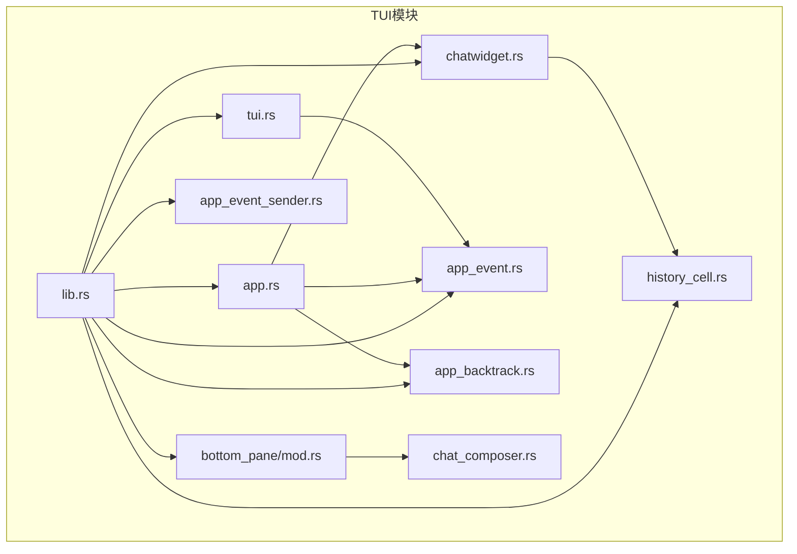
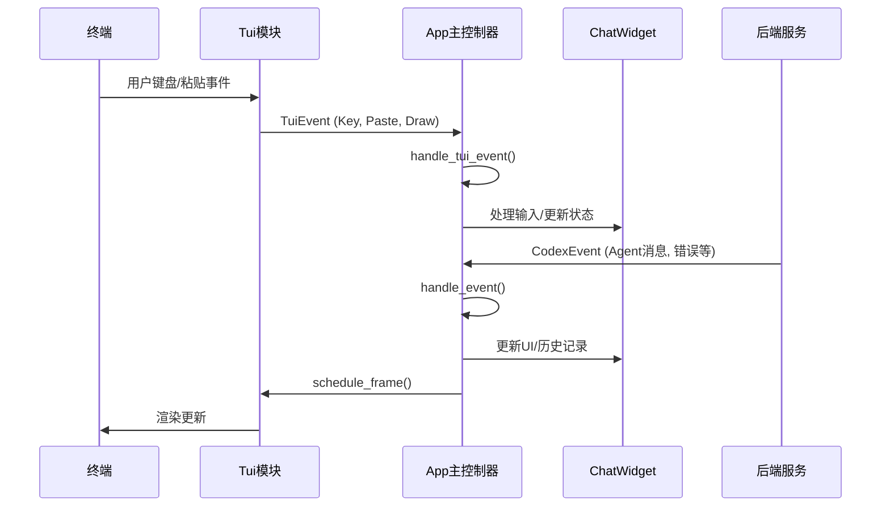
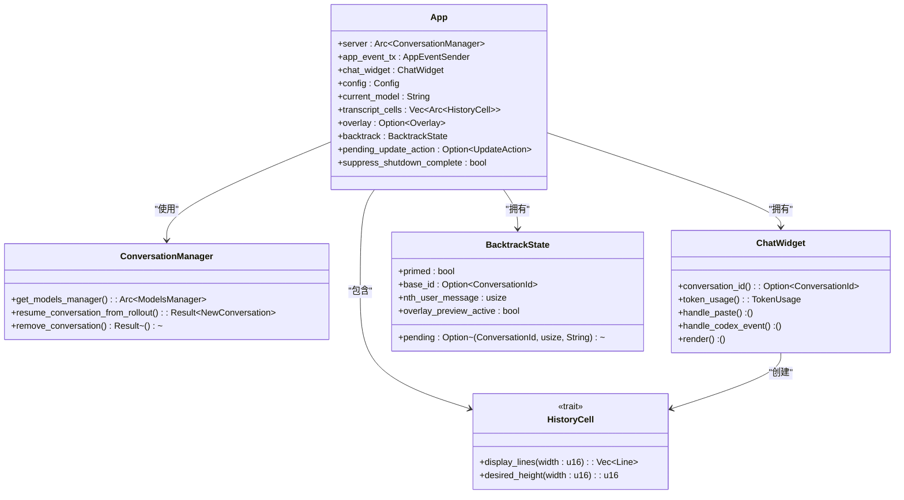
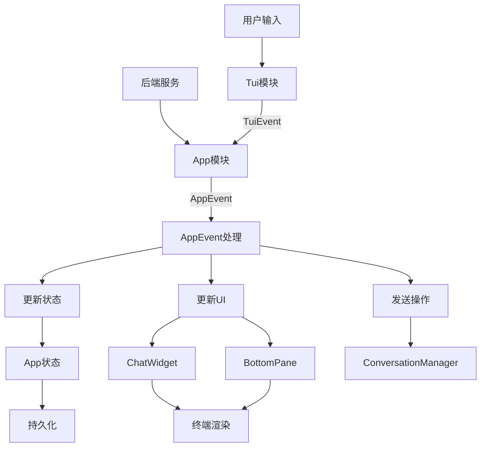
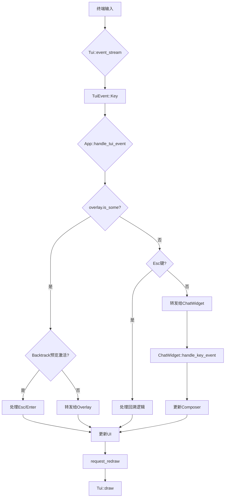
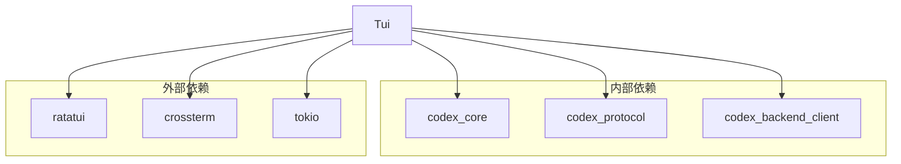

# TUI应用状态与事件处理

<cite>
**本文档引用的文件**   
- [lib.rs](file://codex-rs/tui/src/lib.rs)
- [app.rs](file://codex-rs/tui/src/app.rs)
- [app_event.rs](file://codex-rs/tui/src/app_event.rs)
- [tui.rs](file://codex-rs/tui/src/tui.rs)
- [chatwidget.rs](file://codex-rs/tui/src/chatwidget.rs)
- [app_event_sender.rs](file://codex-rs/tui/src/app_event_sender.rs)
- [history_cell.rs](file://codex-rs/tui/src/history_cell.rs)
- [main.rs](file://codex-rs/tui/src/main.rs)
- [app_backtrack.rs](file://codex-rs/tui/src/app_backtrack.rs)
- [bottom_pane/mod.rs](file://codex-rs/tui/src/bottom_pane/mod.rs)
- [bottom_pane/textarea.rs](file://codex-rs/tui/src/bottom_pane/textarea.rs)
- [session_log.rs](file://codex-rs/tui/src/session_log.rs)
- [oss-story.jsonl](file://codex-rs/tui/tests/fixtures/oss-story.jsonl)
</cite>

## 目录
1. [简介](#简介)
2. [项目结构](#项目结构)
3. [核心组件](#核心组件)
4. [架构概述](#架构概述)
5. [详细组件分析](#详细组件分析)
6. [依赖分析](#依赖分析)
7. [性能考虑](#性能考虑)
8. [故障排除指南](#故障排除指南)
9. [结论](#结论)

## 简介
本文档深入分析了Codex项目中TUI（基于终端的用户界面）应用的状态管理和事件处理机制。该TUI应用是Codex CLI的核心交互界面，负责处理用户输入、管理应用状态、渲染UI以及与后端服务进行通信。文档将重点阐述其事件驱动架构、状态管理策略、核心组件交互以及键盘事件处理流程。

## 项目结构
TUI应用的代码主要位于`codex-rs/tui`目录下，采用模块化设计，各组件职责分明。核心模块包括应用主循环、事件处理、UI渲染和状态管理。

**Diagram sources**
- [lib.rs](file://codex-rs/tui/src/lib.rs#L34-L85)
- [app.rs](file://codex-rs/tui/src/app.rs#L269-L305)
- [tui.rs](file://codex-rs/tui/src/tui.rs#L159-L180)
- [chatwidget.rs](file://codex-rs/tui/src/chatwidget.rs#L119-L125)
- [app_event.rs](file://codex-rs/tui/src/app_event.rs#L19-L178)
- [app_event_sender.rs](file://codex-rs/tui/src/app_event_sender.rs#L7-L9)
- [history_cell.rs](file://codex-rs/tui/src/history_cell.rs#L64-L101)
- [app_backtrack.rs](file://codex-rs/tui/src/app_backtrack.rs#L19-L31)
- [bottom_pane/mod.rs](file://codex-rs/tui/src/bottom_pane/mod.rs#L60-L83)

**Section sources**
- [lib.rs](file://codex-rs/tui/src/lib.rs#L1-L687)
- [app.rs](file://codex-rs/tui/src/app.rs#L1-L800)
- [tui.rs](file://codex-rs/tui/src/tui.rs#L1-L472)
- [chatwidget.rs](file://codex-rs/tui/src/chatwidget.rs#L1-L200)
- [app_event.rs](file://codex-rs/tui/src/app_event.rs#L1-L187)
- [app_event_sender.rs](file://codex-rs/tui/src/app_event_sender.rs#L1-L29)
- [history_cell.rs](file://codex-rs/tui/src/history_cell.rs#L1-L800)
- [app_backtrack.rs](file://codex-rs/tui/src/app_backtrack.rs#L1-L518)
- [bottom_pane/mod.rs](file://codex-rs/tui/src/bottom_pane/mod.rs#L1-L200)

## 核心组件
TUI应用的核心组件包括`App`、`Tui`、`ChatWidget`和`AppEvent`系统。`App`是应用的主控制器，负责协调状态和事件流。`Tui`模块管理底层终端交互和事件循环。`ChatWidget`负责主聊天界面的渲染和用户输入处理。`AppEvent`是一个中心化的事件总线，用于在不同组件间解耦通信。

**Section sources**
- [app.rs](file://codex-rs/tui/src/app.rs#L269-L305)
- [tui.rs](file://codex-rs/tui/src/tui.rs#L159-L180)
- [chatwidget.rs](file://codex-rs/tui/src/chatwidget.rs#L119-L125)
- [app_event.rs](file://codex-rs/tui/src/app_event.rs#L19-L178)

## 架构概述
TUI应用采用事件驱动和状态机模式。其核心架构围绕一个主事件循环，该循环监听来自终端的用户输入事件和来自后端服务的异步事件。所有状态变更都通过`AppEvent`事件进行，确保了状态管理的可预测性和可追溯性。

**Diagram sources**
- [tui.rs](file://codex-rs/tui/src/tui.rs#L264-L337)
- [app.rs](file://codex-rs/tui/src/app.rs#L494-L485)
- [app_event.rs](file://codex-rs/tui/src/app_event.rs#L19-L178)

## 详细组件分析

### App主控制器分析
`App`结构体是整个TUI应用的状态中心，它聚合了所有关键状态，如当前会话、配置、历史记录和UI组件。

#### App状态类图

**Diagram sources**
- [app.rs](file://codex-rs/tui/src/app.rs#L269-L305)
- [app_backtrack.rs](file://codex-rs/tui/src/app_backtrack.rs#L19-L31)
- [history_cell.rs](file://codex-rs/tui/src/history_cell.rs#L64-L101)

**Section sources**
- [app.rs](file://codex-rs/tui/src/app.rs#L269-L800)
- [app_backtrack.rs](file://codex-rs/tui/src/app_backtrack.rs#L1-L518)
- [history_cell.rs](file://codex-rs/tui/src/history_cell.rs#L1-L800)

### 事件处理系统分析
事件处理系统是TUI应用的核心，它通过`AppEvent`枚举和`AppEventSender`通道实现了组件间的松耦合通信。

#### AppEvent事件流图

**Diagram sources**
- [app_event.rs](file://codex-rs/tui/src/app_event.rs#L19-L178)
- [app_event_sender.rs](file://codex-rs/tui/src/app_event_sender.rs#L7-L9)
- [app.rs](file://codex-rs/tui/src/app.rs#L537-L724)

**Section sources**
- [app_event.rs](file://codex-rs/tui/src/app_event.rs#L1-L187)
- [app_event_sender.rs](file://codex-rs/tui/src/app_event_sender.rs#L1-L29)
- [app.rs](file://codex-rs/tui/src/app.rs#L537-L724)

### 键盘事件处理分析
键盘事件处理是用户交互的关键。`Tui`模块负责从终端读取原始事件，而`ChatComposer`和`BottomPane`则负责处理具体的按键逻辑。

#### 键盘事件处理流程图

**Diagram sources**
- [tui.rs](file://codex-rs/tui/src/tui.rs#L264-L337)
- [app.rs](file://codex-rs/tui/src/app.rs#L494-L535)
- [bottom_pane/textarea.rs](file://codex-rs/tui/src/bottom_pane/textarea.rs#L215-L432)

**Section sources**
- [tui.rs](file://codex-rs/tui/src/tui.rs#L159-L472)
- [app.rs](file://codex-rs/tui/src/app.rs#L494-L535)
- [bottom_pane/textarea.rs](file://codex-rs/tui/src/bottom_pane/textarea.rs#L215-L432)

## 依赖分析
TUI应用依赖于多个内部和外部库。内部依赖包括`codex-core`（核心业务逻辑）、`codex-protocol`（数据模型）和`ratatui`（UI渲染）。外部依赖包括`crossterm`（终端控制）和`tokio`（异步运行时）。

**Diagram sources**
- [lib.rs](file://codex-rs/tui/src/lib.rs#L7-L25)
- [Cargo.toml](file://codex-rs/tui/Cargo.toml)

## 性能考虑
TUI应用在性能方面进行了多项优化。首先，它使用`tokio::select!`宏来高效地处理多个异步事件源。其次，`AppEventSender`对事件发送进行了错误处理和日志记录，避免了因通道关闭而导致的崩溃。此外，应用通过`schedule_frame()`机制来批处理UI重绘请求，减少了不必要的渲染开销。

## 故障排除指南
当TUI应用出现问题时，可以参考以下步骤进行排查：
1.  **检查日志**：应用在`~/.codex/log/codex-tui.log`中生成详细的日志，可用于追踪事件流和错误。
2.  **分析会话记录**：启用`session_log`功能可以生成`oss-story.jsonl`格式的会话记录，精确重现用户交互。
3.  **验证事件流**：检查`AppEvent`的发送和处理是否正常，特别是`CodexEvent`和`TuiEvent`的转换。
4.  **检查状态一致性**：确认`App`的内部状态（如`chat_widget`、`config`）在事件处理后是否保持一致。

**Section sources**
- [session_log.rs](file://codex-rs/tui/src/session_log.rs#L165-L210)
- [oss-story.jsonl](file://codex-rs/tui/tests/fixtures/oss-story.jsonl)

## 结论
Codex的TUI应用通过一个精心设计的事件驱动架构，实现了复杂的状态管理和流畅的用户交互。其核心在于`AppEvent`中心化事件总线和`App`状态机的结合，这使得应用逻辑清晰、易于维护和调试。键盘事件处理、回溯功能和UI渲染都围绕这个核心架构展开，共同构成了一个强大且响应迅速的终端界面。