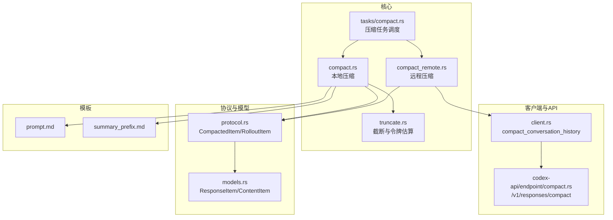
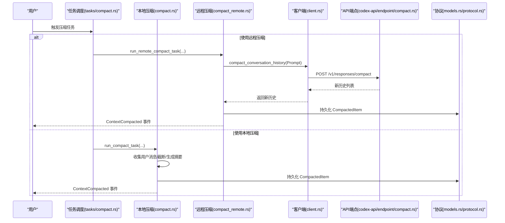
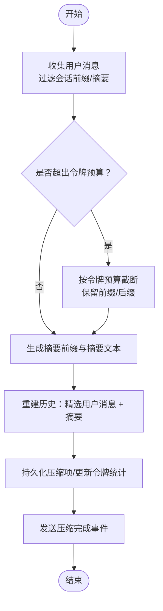
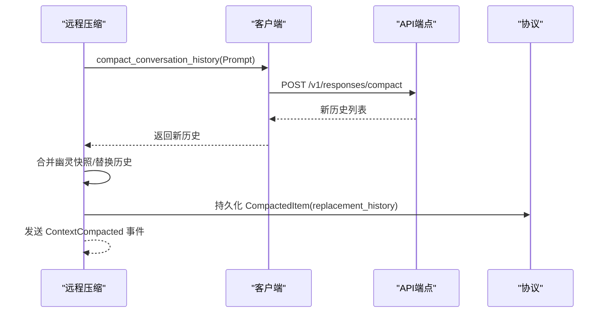
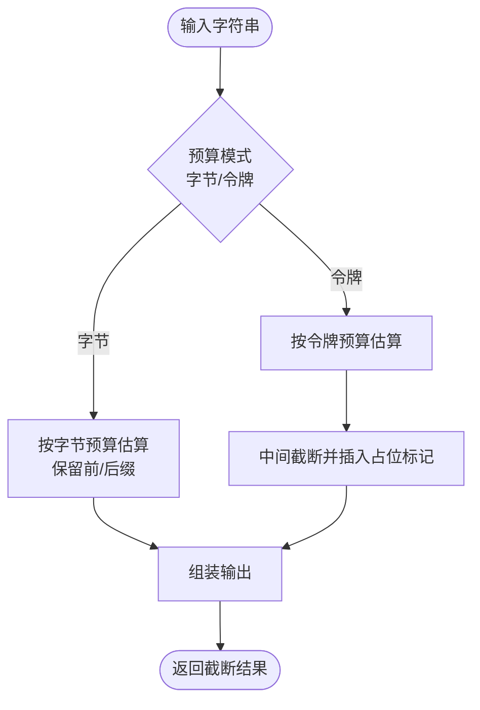
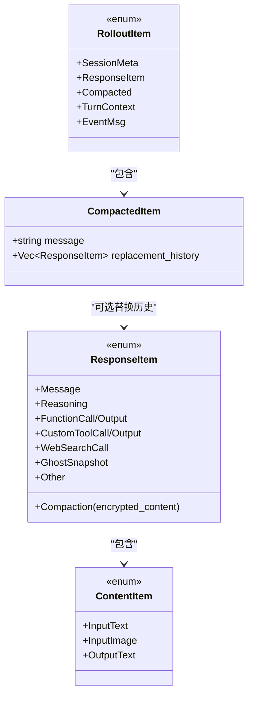
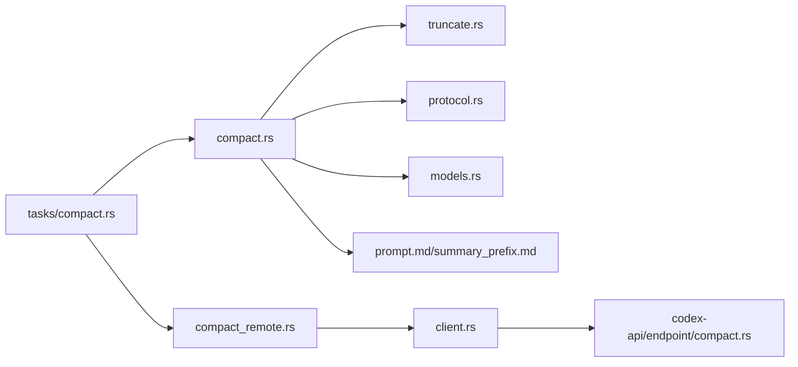

# 代码压缩机制

<cite>
**本文引用的文件**
- [compact.rs](file://codex-rs/core/src/compact.rs)
- [compact_remote.rs](file://codex-rs/core/src/compact_remote.rs)
- [truncate.rs](file://codex-rs/core/src/truncate.rs)
- [compact.rs（任务）](file://codex-rs/core/src/tasks/compact.rs)
- [client.rs](file://codex-rs/core/src/client.rs)
- [compact.rs（API端点）](file://codex-rs/codex-api/src/endpoint/compact.rs)
- [protocol.rs（协议）](file://codex-rs/protocol/src/protocol.rs)
- [models.rs（协议模型）](file://codex-rs/protocol/src/models.rs)
- [prompt.md（压缩提示词）](file://codex-rs/core/templates/compact/prompt.md)
- [summary_prefix.md（摘要前缀）](file://codex-rs/core/templates/compact/summary_prefix.md)
- [compact_remote 测试](file://codex-rs/core/tests/suite/compact_remote.rs)
- [compact 测试](file://codex-rs/core/tests/suite/compact.rs)
</cite>

## 目录
1. [简介](#简介)
2. [项目结构](#项目结构)
3. [核心组件](#核心组件)
4. [架构总览](#架构总览)
5. [详细组件分析](#详细组件分析)
6. [依赖关系分析](#依赖关系分析)
7. [性能考量](#性能考量)
8. [故障排查指南](#故障排查指南)
9. [结论](#结论)
10. [附录](#附录)

## 简介
本文件系统性阐述 Codex 的“代码压缩”能力，重点覆盖以下方面：
- 本地压缩算法：文件选择策略、上下文提取逻辑、数据序列化与历史重建。
- 远程压缩封装：如何将压缩后的数据安全地封装为协议项，并构建远程审查请求。
- 实际调用链路与关键数据结构：从会话触发到压缩完成的完整流程。
- 错误处理与重试：上下文窗口超限、流中断、网络异常等场景的处理策略。
- 传输效率与隐私保护：通过令牌预算估算、截断与摘要生成减少传输体积；通过加密摘要与仅保留必要上下文保护隐私。
- 模型服务兼容性：OpenAI 兼容路径与非 OpenAI 路径的差异。

## 项目结构
围绕压缩功能的核心文件分布如下：
- 核心压缩逻辑：本地压缩与远程压缩分别位于 core 模块的 compact.rs 与 compact_remote.rs。
- 截断与令牌估算：truncate.rs 提供统一的截断策略与近似令牌计数。
- 任务调度：tasks/compact.rs 将压缩任务路由到本地或远程实现。
- 客户端与 API：client.rs 中的 compact_conversation_history 调用 codex-api 的 compact 端点；codex-api 的 endpoint/compact.rs 实现远程压缩请求。
- 协议与数据结构：protocol.rs 与 models.rs 定义了压缩结果在协议层的表示与持久化项类型。
- 模板：templates/compact 下包含压缩提示词与摘要前缀文本。

图表来源
- [compact.rs（任务）](file://codex-rs/core/src/tasks/compact.rs#L1-L39)
- [compact.rs](file://codex-rs/core/src/compact.rs#L1-L120)
- [compact_remote.rs](file://codex-rs/core/src/compact_remote.rs#L1-L82)
- [truncate.rs](file://codex-rs/core/src/truncate.rs#L1-L120)
- [client.rs](file://codex-rs/core/src/client.rs#L317-L347)
- [compact.rs（API端点）](file://codex-rs/codex-api/src/endpoint/compact.rs#L48-L87)
- [protocol.rs（协议）](file://codex-rs/protocol/src/protocol.rs#L1244-L1258)
- [models.rs（协议模型）](file://codex-rs/protocol/src/models.rs#L67-L159)
- [prompt.md（压缩提示词）](file://codex-rs/core/templates/compact/prompt.md#L1-L10)
- [summary_prefix.md（摘要前缀）](file://codex-rs/core/templates/compact/summary_prefix.md#L1-L1)

章节来源
- [compact.rs（任务）](file://codex-rs/core/src/tasks/compact.rs#L1-L39)
- [compact.rs](file://codex-rs/core/src/compact.rs#L1-L120)
- [compact_remote.rs](file://codex-rs/core/src/compact_remote.rs#L1-L82)
- [truncate.rs](file://codex-rs/core/src/truncate.rs#L1-L120)
- [client.rs](file://codex-rs/core/src/client.rs#L317-L347)
- [compact.rs（API端点）](file://codex-rs/codex-api/src/endpoint/compact.rs#L48-L87)
- [protocol.rs（协议）](file://codex-rs/protocol/src/protocol.rs#L1244-L1258)
- [models.rs（协议模型）](file://codex-rs/protocol/src/models.rs#L67-L159)
- [prompt.md（压缩提示词）](file://codex-rs/core/templates/compact/prompt.md#L1-L10)
- [summary_prefix.md（摘要前缀）](file://codex-rs/core/templates/compact/summary_prefix.md#L1-L1)

## 核心组件
- 本地压缩器（compact.rs）
  - 文件选择策略：从历史中收集用户消息，过滤掉会话前缀与已存在的摘要消息，确保只压缩有效上下文。
  - 上下文提取：将用户消息拼接为文本，按令牌预算进行截断，生成摘要前缀与摘要文本。
  - 数据序列化：将摘要与精选用户消息写入新的历史，保留必要的“幽灵快照”以支持撤销操作。
  - 错误处理：上下文窗口超限时移除最早的历史项；网络异常按最大重试次数退避重连；最终发送事件通知。
- 远程压缩器（compact_remote.rs）
  - 封装压缩输入：基于当前历史构造 Prompt，调用 client 的 compact_conversation_history 接口。
  - 构建安全的远程审查请求：将返回的新历史与“幽灵快照”合并，替换当前会话历史，持久化压缩项。
  - 事件与回放：发送压缩完成事件，后续请求可直接复用压缩后的摘要。
- 截断与令牌估算（truncate.rs）
  - 统一的截断策略：支持按字节或令牌两种预算模式，优先保留前缀与后缀，中间部分截断并插入占位标记。
  - 令牌估算：提供近似令牌计数与字节换算，用于预算分配与截断决策。
- 协议与数据结构（protocol.rs、models.rs）
  - CompactedItem：压缩摘要与可选的新历史替换。
  - RolloutItem：压缩项作为回放记录的一部分被持久化。
  - ResponseItem/ContentItem：压缩结果在协议层的表示，支持加密摘要与消息体。

章节来源
- [compact.rs](file://codex-rs/core/src/compact.rs#L185-L286)
- [compact_remote.rs](file://codex-rs/core/src/compact_remote.rs#L39-L81)
- [truncate.rs](file://codex-rs/core/src/truncate.rs#L97-L165)
- [protocol.rs（协议）](file://codex-rs/protocol/src/protocol.rs#L1244-L1258)
- [models.rs（协议模型）](file://codex-rs/protocol/src/models.rs#L67-L159)

## 架构总览
本地压缩与远程压缩两条路径在任务调度层统一入口，随后分别进入不同的执行分支。

图表来源
- [compact.rs（任务）](file://codex-rs/core/src/tasks/compact.rs#L1-L39)
- [compact.rs](file://codex-rs/core/src/compact.rs#L52-L178)
- [compact_remote.rs](file://codex-rs/core/src/compact_remote.rs#L21-L81)
- [client.rs](file://codex-rs/core/src/client.rs#L317-L347)
- [compact.rs（API端点）](file://codex-rs/codex-api/src/endpoint/compact.rs#L48-L87)
- [protocol.rs（协议）](file://codex-rs/protocol/src/protocol.rs#L1244-L1258)
- [models.rs（协议模型）](file://codex-rs/protocol/src/models.rs#L67-L159)

## 详细组件分析

### 本地压缩器（compact.rs）
- 文件选择策略
  - 从历史中解析用户消息，过滤会话前缀与已存在的摘要消息，避免重复压缩。
  - 关键函数：collect_user_messages、is_summary_message。
- 上下文提取与摘要生成
  - 将用户消息拼接为文本，按令牌预算限制截断，必要时对单条消息进行中间截断并插入占位标记。
  - 生成摘要前缀与摘要文本，作为后续历史的总结信息。
  - 关键函数：content_items_to_text、build_compacted_history_with_limit、build_compacted_history。
- 历史重建与序列化
  - 将精选用户消息与摘要文本写入新的历史，保留“幽灵快照”以支持撤销。
  - 更新令牌使用统计，持久化压缩项，发送压缩完成事件。
  - 关键函数：drain_to_completed、run_compact_task_inner。
- 错误处理与重试
  - 上下文窗口超限时移除最早的历史项，循环尝试直到满足预算或达到上限。
  - 其他错误按最大重试次数退避重连，超过上限则上报错误事件。
  - 关键函数：run_compact_task_inner、drain_to_completed。
- 模板与提示词
  - 使用模板 prompt.md 与 summary_prefix.md 生成压缩指令与摘要前缀，保证摘要结构化与可读性。

图表来源
- [compact.rs](file://codex-rs/core/src/compact.rs#L185-L286)
- [truncate.rs](file://codex-rs/core/src/truncate.rs#L97-L165)
- [prompt.md（压缩提示词）](file://codex-rs/core/templates/compact/prompt.md#L1-L10)
- [summary_prefix.md（摘要前缀）](file://codex-rs/core/templates/compact/summary_prefix.md#L1-L1)

章节来源
- [compact.rs](file://codex-rs/core/src/compact.rs#L185-L286)
- [truncate.rs](file://codex-rs/core/src/truncate.rs#L97-L165)
- [prompt.md（压缩提示词）](file://codex-rs/core/templates/compact/prompt.md#L1-L10)
- [summary_prefix.md（摘要前缀）](file://codex-rs/core/templates/compact/summary_prefix.md#L1-L1)

### 远程压缩器（compact_remote.rs）
- 输入封装
  - 基于当前历史构造 Prompt，调用 client 的 compact_conversation_history 接口，该接口会构建 /v1/responses/compact 请求。
- 输出处理
  - 将返回的新历史与“幽灵快照”合并，替换当前会话历史，重新计算令牌使用。
  - 持久化压缩项（包含新历史），发送压缩完成事件。
- 事件与回放
  - 压缩完成后，后续请求可直接复用压缩后的摘要，减少传输体积。

图表来源
- [compact_remote.rs](file://codex-rs/core/src/compact_remote.rs#L39-L81)
- [client.rs](file://codex-rs/core/src/client.rs#L317-L347)
- [compact.rs（API端点）](file://codex-rs/codex-api/src/endpoint/compact.rs#L48-L87)
- [protocol.rs（协议）](file://codex-rs/protocol/src/protocol.rs#L1244-L1258)

章节来源
- [compact_remote.rs](file://codex-rs/core/src/compact_remote.rs#L39-L81)
- [client.rs](file://codex-rs/core/src/client.rs#L317-L347)
- [compact.rs（API端点）](file://codex-rs/codex-api/src/endpoint/compact.rs#L48-L87)

### 截断与令牌估算（truncate.rs）
- 截断策略
  - 支持按字节或令牌两种预算模式，优先保留前缀与后缀，中间部分截断并插入占位标记。
  - 对多段文本进行累计预算，遇超限则截断并汇总省略的文本数量。
- 令牌估算
  - 提供近似令牌计数与字节换算，用于预算分配与截断决策，避免真实分词带来的开销。

图表来源
- [truncate.rs](file://codex-rs/core/src/truncate.rs#L97-L165)
- [truncate.rs](file://codex-rs/core/src/truncate.rs#L167-L228)
- [truncate.rs](file://codex-rs/core/src/truncate.rs#L301-L315)

章节来源
- [truncate.rs](file://codex-rs/core/src/truncate.rs#L97-L165)
- [truncate.rs](file://codex-rs/core/src/truncate.rs#L167-L228)
- [truncate.rs](file://codex-rs/core/src/truncate.rs#L301-L315)

### 协议与数据结构（protocol.rs、models.rs）
- CompactedItem
  - 包含压缩摘要文本与可选的新历史替换，用于回放记录与后续请求。
- RolloutItem
  - 将压缩项作为回放记录的一部分持久化，便于审计与恢复。
- ResponseItem/ContentItem
  - 压缩结果在协议层以消息或加密摘要形式表示，支持跨组件序列化与传输。

图表来源
- [protocol.rs（协议）](file://codex-rs/protocol/src/protocol.rs#L1244-L1258)
- [models.rs（协议模型）](file://codex-rs/protocol/src/models.rs#L67-L159)

章节来源
- [protocol.rs（协议）](file://codex-rs/protocol/src/protocol.rs#L1244-L1258)
- [models.rs（协议模型）](file://codex-rs/protocol/src/models.rs#L67-L159)

### 模板与提示词
- prompt.md：定义压缩任务的指令，要求摘要包含进度、约束、下一步行动与关键参考。
- summary_prefix.md：定义摘要前缀，帮助后续模型理解已有摘要并在此基础上继续工作。

章节来源
- [prompt.md（压缩提示词）](file://codex-rs/core/templates/compact/prompt.md#L1-L10)
- [summary_prefix.md（摘要前缀）](file://codex-rs/core/templates/compact/summary_prefix.md#L1-L1)

## 依赖关系分析
- 任务调度与实现
  - tasks/compact.rs 将压缩任务根据 Provider 类型与特性开关选择本地或远程实现。
- 本地压缩依赖
  - compact.rs 依赖 truncate.rs 进行截断与令牌估算；依赖 protocol.rs 的 CompactedItem/RolloutItem 进行持久化；依赖 models.rs 的 ResponseItem/ContentItem 表达压缩结果。
- 远程压缩依赖
  - compact_remote.rs 依赖 client.rs 的 compact_conversation_history；client.rs 依赖 codex-api 的 endpoint/compact.rs 发起 /v1/responses/compact 请求。
- 模板依赖
  - compact.rs 依赖模板 prompt.md 与 summary_prefix.md 生成压缩指令与摘要前缀。

图表来源
- [compact.rs（任务）](file://codex-rs/core/src/tasks/compact.rs#L1-L39)
- [compact.rs](file://codex-rs/core/src/compact.rs#L1-L120)
- [compact_remote.rs](file://codex-rs/core/src/compact_remote.rs#L1-L82)
- [truncate.rs](file://codex-rs/core/src/truncate.rs#L1-L120)
- [protocol.rs（协议）](file://codex-rs/protocol/src/protocol.rs#L1244-L1258)
- [models.rs（协议模型）](file://codex-rs/protocol/src/models.rs#L67-L159)
- [client.rs](file://codex-rs/core/src/client.rs#L317-L347)
- [compact.rs（API端点）](file://codex-rs/codex-api/src/endpoint/compact.rs#L48-L87)
- [prompt.md（压缩提示词）](file://codex-rs/core/templates/compact/prompt.md#L1-L10)
- [summary_prefix.md（摘要前缀）](file://codex-rs/core/templates/compact/summary_prefix.md#L1-L1)

章节来源
- [compact.rs（任务）](file://codex-rs/core/src/tasks/compact.rs#L1-L39)
- [compact.rs](file://codex-rs/core/src/compact.rs#L1-L120)
- [compact_remote.rs](file://codex-rs/core/src/compact_remote.rs#L1-L82)
- [truncate.rs](file://codex-rs/core/src/truncate.rs#L1-L120)
- [protocol.rs（协议）](file://codex-rs/protocol/src/protocol.rs#L1244-L1258)
- [models.rs（协议模型）](file://codex-rs/protocol/src/models.rs#L67-L159)
- [client.rs](file://codex-rs/core/src/client.rs#L317-L347)
- [compact.rs（API端点）](file://codex-rs/codex-api/src/endpoint/compact.rs#L48-L87)
- [prompt.md（压缩提示词）](file://codex-rs/core/templates/compact/prompt.md#L1-L10)
- [summary_prefix.md（摘要前缀）](file://codex-rs/core/templates/compact/summary_prefix.md#L1-L1)

## 性能考量
- 令牌预算与截断
  - 通过近似令牌计数与预算分配，避免真实分词带来的开销；对超限文本进行中间截断并保留前后缀，兼顾完整性与体积。
- 历史修剪
  - 当上下文窗口超限时，优先移除最早的历史项，保持最近消息的完整性，降低重试成本。
- 传输体积控制
  - 本地压缩将冗长对话压缩为摘要与精选用户消息；远程压缩返回精简的历史列表，显著减少后续请求的数据量。
- 重试与退避
  - 非致命错误按最大重试次数与指数退避策略重连，提升稳定性并减少失败率。

[本节为通用指导，不直接分析具体文件]

## 故障排查指南
- 上下文窗口超限
  - 现象：出现 ContextWindowExceeded 错误。
  - 处理：本地压缩会自动移除最早的历史项并重试；若历史为空仍超限，则设置令牌使用状态并上报错误事件。
  - 参考：run_compact_task_inner 的上下文窗口超限分支。
- 流中断或网络异常
  - 现象：流提前关闭或网络错误。
  - 处理：按最大重试次数与退避策略重连；超过上限后上报错误事件。
  - 参考：drain_to_completed 的错误分支与 backoff 重试。
- 远程压缩失败
  - 现象：远程压缩接口返回错误或 wire API 不匹配。
  - 处理：捕获错误并发送错误事件；检查 Provider 的 wire API 是否为 responses。
  - 参考：compact_remote 的错误处理与 codex-api 端点的 wire API 校验。
- 回放与撤销
  - 现象：压缩后无法撤销。
  - 处理：确保保留“幽灵快照”，以便 /undo 等操作可用。
  - 参考：remote 与本地压缩均保留并合并幽灵快照。

章节来源
- [compact.rs](file://codex-rs/core/src/compact.rs#L100-L149)
- [compact_remote.rs](file://codex-rs/core/src/compact_remote.rs#L30-L81)
- [compact.rs（API端点）](file://codex-rs/codex-api/src/endpoint/compact.rs#L118-L162)

## 结论
Codex 的压缩机制通过“本地压缩 + 远程压缩”的双通道设计，在不同 Provider 与配置下实现高效、稳定且隐私友好的上下文管理：
- 本地压缩适合通用场景，具备完善的截断与摘要生成能力，保障历史完整性与传输效率。
- 远程压缩利用模型侧的专用端点，返回精简的历史列表，进一步降低传输体积并提升一致性。
- 协议层的 CompactedItem 与 RolloutItem 使压缩结果可审计、可回放，配合幽灵快照支持撤销。
- 通过令牌预算估算与重试退避策略，系统在复杂网络环境下仍能保持高成功率与低延迟。

[本节为总结性内容，不直接分析具体文件]

## 附录
- 关键调用链路示例（路径引用）
  - 任务入口：[tasks/compact.rs](file://codex-rs/core/src/tasks/compact.rs#L20-L38)
  - 本地压缩主流程：[compact.rs](file://codex-rs/core/src/compact.rs#L64-L178)
  - 远程压缩主流程：[compact_remote.rs](file://codex-rs/core/src/compact_remote.rs#L21-L81)
  - 截断与令牌估算：[truncate.rs](file://codex-rs/core/src/truncate.rs#L97-L165)
  - 客户端远程压缩调用：[client.rs](file://codex-rs/core/src/client.rs#L317-L347)
  - API 端点实现：[codex-api/endpoint/compact.rs](file://codex-rs/codex-api/src/endpoint/compact.rs#L48-L87)
  - 协议数据结构：[protocol.rs（协议）](file://codex-rs/protocol/src/protocol.rs#L1244-L1258)、[models.rs（协议模型）](file://codex-rs/protocol/src/models.rs#L67-L159)
  - 模板文件：[prompt.md](file://codex-rs/core/templates/compact/prompt.md#L1-L10)、[summary_prefix.md](file://codex-rs/core/templates/compact/summary_prefix.md#L1-L1)
- 测试参考
  - 远程压缩测试：[compact_remote 测试](file://codex-rs/core/tests/suite/compact_remote.rs#L236-L277)
  - 本地压缩测试：[compact 测试](file://codex-rs/core/tests/suite/compact.rs#L1976-L2025)