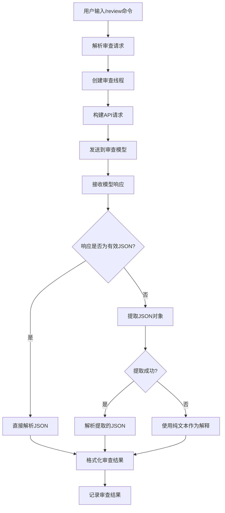
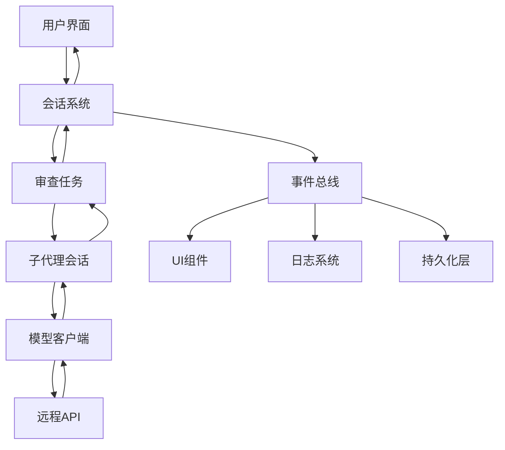

# 代码审查

<cite>
**本文档中引用的文件**  
- [compact.rs](file://codex-rs/core/src/compact.rs)
- [compact_remote.rs](file://codex-rs/core/src/compact_remote.rs)
- [review_format.rs](file://codex-rs/core/src/review_format.rs)
- [review_prompts.rs](file://codex-rs/core/src/review_prompts.rs)
- [review.rs](file://codex-rs/core/src/tasks/review.rs)
- [lib.rs](file://codex-rs/core/src/lib.rs)
- [client_common.rs](file://codex-rs/core/src/client_common.rs)
- [exit_success.xml](file://codex-rs/core/templates/review/exit_success.xml)
- [exit_interrupted.xml](file://codex-rs/core/templates/review/exit_interrupted.xml)
</cite>

## 目录
1. [简介](#简介)
2. [代码压缩机制](#代码压缩机制)
3. [审查格式与提示模板](#审查格式与提示模板)
4. [审查任务执行流程](#审查任务执行流程)
5. [审查请求的生成与处理](#审查请求的生成与处理)
6. [与核心会话系统的集成](#与核心会话系统的集成)
7. [审查结果的呈现与用户反馈](#审查结果的呈现与用户反馈)

## 简介
Codex的代码审查功能提供了一套完整的代码分析与反馈机制。该功能通过`compact.rs`和`compact_remote.rs`模块实现对话历史的压缩，利用`review_format.rs`和`review_prompts.rs`定义标准化的审查格式和提示模板，并通过`tasks/review.rs`中的任务执行流程完成审查操作。整个系统与核心会话系统紧密集成，确保审查结果能够有效地呈现给用户并收集反馈。

## 代码压缩机制
Codex的代码压缩功能通过`compact.rs`和`compact_remote.rs`两个模块实现，分别处理本地和远程的压缩任务。`compact.rs`模块中的`run_inline_auto_compact_task`函数负责执行内联自动压缩任务，当会话历史超出模型上下文窗口时，该函数会自动触发压缩流程。压缩过程首先生成一个总结提示，然后通过模型生成对话摘要，最后重构会话历史，保留用户消息和摘要信息。

对于远程压缩，`compact_remote.rs`模块提供了`run_remote_compact_task`函数，该函数通过调用模型客户端的`compact_conversation_history`方法在远程服务器上执行压缩操作。远程压缩的优势在于可以利用更强大的计算资源，同时保持客户端的轻量化。压缩完成后，新的会话历史会被替换到本地，并触发`ContextCompactedEvent`事件通知相关组件。

**代码压缩机制的实现细节**
- 本地压缩使用`SUMMARIZATION_PROMPT`模板生成摘要
- 远程压缩通过API调用`/v1/responses/compact`端点
- 压缩过程中会保留`GhostSnapshot`类型的快照以支持`/undo`操作
- 压缩后会发送`ContextCompactedEvent`事件通知

**本节来源**
- [compact.rs](file://codex-rs/core/src/compact.rs#L42-L183)
- [compact_remote.rs](file://codex-rs/core/src/compact_remote.rs#L21-L81)

## 审查格式与提示模板
Codex的审查功能使用标准化的格式和提示模板来确保审查结果的一致性和可读性。`review_format.rs`模块定义了审查结果的格式化方法，包括`format_review_findings_block`和`render_review_output_text`函数。这些函数将审查发现转换为用户友好的文本格式，支持带复选框的选择模式和简洁的列表模式。

`review_prompts.rs`模块则定义了不同审查场景下的提示模板，包括对未提交更改、基础分支和特定提交的审查。这些模板通过`resolve_review_request`函数解析为具体的审查请求，其中包含了详细的指令和用户友好的提示信息。例如，对基础分支的审查会指导模型使用`git merge-base`和`git diff`命令来分析代码差异。

**审查格式与模板的关键特性**
- 支持多种审查目标：未提交更改、基础分支、特定提交等
- 提供用户友好的提示信息，如"changes against 'main'"或"commit abc123: fix bug"
- 使用结构化的JSON格式输出审查结果，便于解析和处理
- 包含回退机制，当无法解析JSON输出时使用纯文本解释

**本节来源**
- [review_format.rs](file://codex-rs/core/src/review_format.rs#L7-L82)
- [review_prompts.rs](file://codex-rs/core/src/review_prompts.rs#L13-L83)

## 审查任务执行流程
审查任务的执行流程由`tasks/review.rs`模块中的`ReviewTask`结构体实现。该流程采用异步任务模式，通过`run`方法启动审查会话，并在`abort`方法中处理中断情况。执行流程的核心是`start_review_conversation`函数，它创建一个子代理会话，该会话运行在只读沙箱环境中，确保审查过程的安全性。

审查会话的配置经过特殊定制，禁用了网络搜索和图像查看等可能影响审查专注度的功能。会话使用专门的`REVIEW_PROMPT`作为基础指令，并设置`review_model`作为审查模型。`process_review_events`函数负责处理审查过程中产生的事件流，包括代理消息、工具调用和任务完成事件。

**审查任务执行的关键步骤**
1. 创建子代理会话，配置为只读沙箱模式
2. 设置专门的审查指令和模型配置
3. 启动审查会话并监听事件流
4. 处理审查结果，解析JSON格式的审查输出
5. 退出审查模式，记录审查结果并发送完成事件

**本节来源**
- [review.rs](file://codex-rs/core/src/tasks/review.rs#L28-L243)

## 审查请求的生成与处理
审查请求的生成始于用户触发`/review`命令，该命令通过`Op::Review`操作码提交到系统。系统首先通过`review_prompts.rs`中的`resolve_review_request`函数解析审查请求，确定审查目标和生成相应的提示文本。然后，`spawn_review_thread`函数在`codex.rs`中被调用，创建一个专门的审查线程。

审查请求的处理涉及多个组件的协作。`client_common.rs`中的`Prompt`结构体被用来构建API请求负载，其中包含了会话历史、可用工具和基础指令。审查模型接收到请求后，根据`REVIEW_PROMPT`中的指导原则分析代码并生成结构化的JSON输出。`parse_review_output_event`函数负责解析模型的响应，尝试直接反序列化JSON，或从文本中提取JSON对象。

**审查请求处理流程图**


**本节来源**
- [review.rs](file://codex-rs/core/src/tasks/review.rs#L73-L182)
- [client_common.rs](file://codex-rs/core/src/client_common.rs#L18-L44)
- [codex.rs](file://codex-rs/core/src/codex.rs#L2015-L2049)

## 与核心会话系统的集成
代码审查功能与Codex的核心会话系统深度集成，通过事件驱动的架构实现组件间的通信。当审查任务启动时，系统会发送`EnteredReviewMode`事件，通知UI组件切换到审查模式。审查过程中产生的各种事件，如`ExecApprovalRequest`和`ApplyPatchApprovalRequest`，都会通过会话系统的事件总线进行广播。

会话系统通过`SessionTaskContext`接口为审查任务提供必要的上下文信息，包括认证管理器、模型管理器和会话状态。审查任务完成后，`ExitedReviewMode`事件会被触发，携带审查结果数据。这些结果会被记录到会话历史中，作为特殊的`ResponseItem`类型存储，确保审查记录的持久化和可追溯性。

**集成架构图**


**本节来源**
- [review.rs](file://codex-rs/core/src/tasks/review.rs#L51-L65)
- [codex.rs](file://codex-rs/core/src/codex.rs#L2015-L2049)
- [client_common.rs](file://codex-rs/core/src/client_common.rs#L18-L44)

## 审查结果的呈现与用户反馈
审查结果的呈现通过`review_format.rs`模块中的格式化函数实现，最终以结构化的文本形式展示给用户。成功的审查结果会使用`REVIEW_EXIT_SUCCESS_TMPL`模板包装，其中包含审查发现的详细信息。如果审查被中断，系统会使用`REVIEW_EXIT_INTERRUPTED_TMPL`模板提示用户重新执行审查。

用户反馈机制通过特殊的`user_action`标记实现，这些标记包含了用户操作的上下文和结果。UI组件可以解析这些标记，提供相应的交互选项，如选择要解决的审查评论。审查结果被记录为会话历史中的特殊条目，支持后续的查询和分析。

**审查结果呈现示例**
```xml
<user_action>
  <context>User initiated a review task. Here's the full review output from reviewer model. User may select one or more comments to resolve.</context>
  <action>review</action>
  <results>
  Full review comments:

  - [x] Potential null pointer dereference — src/main.rs:45-48
    This function does not check if the input pointer is null before dereferencing it.
    Consider adding a null check at the beginning of the function.

  - [ ] Unused variable 'temp' — src/utils.rs:120-122
    The variable 'temp' is declared but never used in this function.
    It can be safely removed to improve code clarity.
  </results>
</user_action>
```

**本节来源**
- [review_format.rs](file://codex-rs/core/src/review_format.rs#L64-L82)
- [review.rs](file://codex-rs/core/src/tasks/review.rs#L193-L213)
- [exit_success.xml](file://codex-rs/core/templates/review/exit_success.xml#L1-L7)
- [exit_interrupted.xml](file://codex-rs/core/templates/review/exit_interrupted.xml#L1-L7)