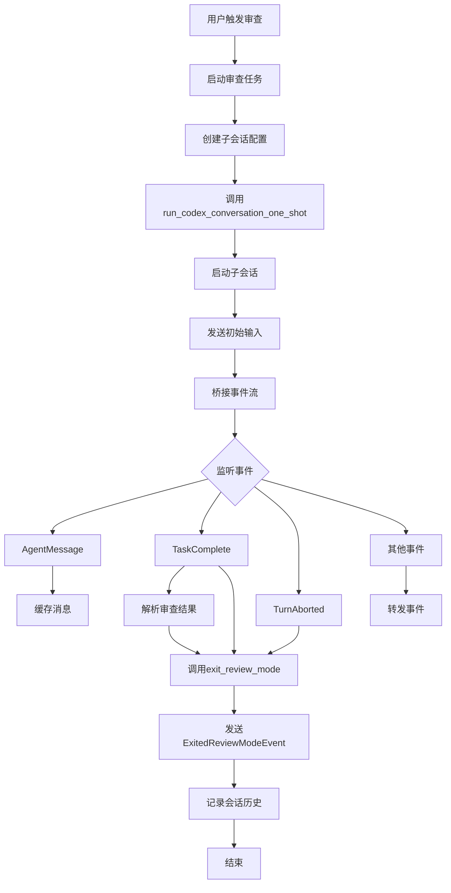

# 审查任务执行流程

<cite>
**本文档引用的文件**
- [review.rs](file://codex-rs/core/src/tasks/review.rs)
- [codex_delegate.rs](file://codex-rs/core/src/codex_delegate.rs)
- [conversation_manager.rs](file://codex-rs/core/src/conversation_manager.rs)
- [protocol.rs](file://codex-rs/protocol/src/protocol.rs)
- [review_format.rs](file://codex-rs/core/src/review_format.rs)
- [review_prompts.rs](file://codex-rs/core/src/review_prompts.rs)
</cite>

## 目录
1. [审查任务生命周期管理](#审查任务生命周期管理)
2. [模型调用协调机制](#模型调用协调机制)
3. [会话上下文维护](#会话上下文维护)
4. [完整调用序列流程图](#完整调用序列流程图)
5. [异常处理与超时控制](#异常处理与超时控制)
6. [重试策略与交互契约](#重试策略与交互契约)

## 审查任务生命周期管理

审查任务的生命周期由 `ReviewTask` 结构体管理，该结构体实现了 `SessionTask` trait。任务的执行流程始于 `run` 方法，该方法通过 `start_review_conversation` 函数启动一个子会话（sub-codex conversation），并获取事件接收器。随后，`process_review_events` 函数处理来自子会话的事件流。

任务初始化时，系统会创建一个只读的沙箱环境，并配置专门的审查提示（review rubric），同时禁用外部工具调用（如网络搜索）。任务状态通过异步通道进行跟踪，关键状态包括：
- **初始化**：创建子会话并发送初始输入
- **执行中**：处理模型生成的事件流
- **完成**：接收到 `TaskComplete` 事件后解析审查结果
- **中止**：接收到 `TurnAborted` 事件或通道关闭

当任务完成或被取消时，`exit_review_mode` 函数会被调用，负责发送 `ExitedReviewModeEvent` 事件，并将审查结果记录到会话历史中。

**Section sources**
- [review.rs](file://codex-rs/core/src/tasks/review.rs#L28-L244)

## 模型调用协调机制

审查任务通过 `codex_delegate.rs` 模块中的 `run_codex_conversation_one_shot` 函数协调模型调用。该函数作为 `run_codex_conversation_interactive` 的便捷封装，用于一次性任务执行。

委托机制的核心是事件转发和操作转发：
- **事件转发**：`forward_events` 函数将子会话产生的事件转发给调用者，同时拦截审批请求（如 `ExecApprovalRequest` 和 `ApplyPatchApprovalRequest`），并将这些请求路由到父会话进行决策
- **操作转发**：`forward_ops` 函数将调用者发送的操作转发给子会话

当任务完成时，系统会自动桥接事件流，观察到 `TaskComplete` 或 `TurnAborted` 事件后，自动发送 `Shutdown` 操作并取消子会话的取消令牌，确保资源被正确清理。

**Section sources**
- [codex_delegate.rs](file://codex-rs/core/src/codex_delegate.rs#L96-L158)

## 会话上下文维护

会话上下文由 `ConversationManager` 负责维护，该组件管理所有活动的会话，并提供会话创建、恢复和查找功能。`ConversationManager` 通过 `spawn_conversation` 和 `finalize_spawn` 方法创建新会话，确保会话初始化事件（`SessionConfigured`）是流中的第一个事件。

会话管理器维护一个 `HashMap`，以 `ConversationId` 为键存储 `CodexConversation` 的 `Arc` 引用。当会话被移除时，`remove_conversation` 方法会从映射中删除该会话。此外，`fork_conversation` 方法允许基于现有会话的历史记录创建新会话，支持会话的分支和重放。

**Section sources**
- [conversation_manager.rs](file://codex-rs/core/src/conversation_manager.rs#L43-L264)

## 完整调用序列流程图

**Diagram sources**
- [review.rs](file://codex-rs/core/src/tasks/review.rs#L43-L65)
- [codex_delegate.rs](file://codex-rs/core/src/codex_delegate.rs#L96-L158)

## 异常处理与超时控制

系统实现了多层次的异常处理和超时控制机制。在 `run_codex_conversation_one_shot` 中，使用子取消令牌（child cancellation token）来控制委托会话的生命周期，避免影响父会话。

当审批请求（approval request）发生时，`await_approval_with_cancel` 函数会同时监听审批结果和取消信号，确保不会因等待审批而无限期挂起。如果父会话被取消，系统会立即返回 `ReviewDecision::Abort`。

在事件转发过程中，`forward_events` 使用 `tokio::select!` 宏同时监听取消信号和事件接收，一旦收到取消信号，立即调用 `shutdown_delegate` 进行清理。

**Section sources**
- [codex_delegate.rs](file://codex-rs/core/src/codex_delegate.rs#L325-L347)

## 重试策略与交互契约

各组件间的交互契约通过清晰的接口定义和事件流来维护。`ReviewTask` 与 `codex_delegate` 之间的契约规定：
- `start_review_conversation` 必须返回一个事件接收器或 `None`
- `process_review_events` 必须处理所有事件类型，并在完成时返回 `ReviewOutputEvent` 或 `None`
- `exit_review_mode` 必须发送 `ExitedReviewModeEvent` 并记录会话历史

系统没有显式的重试策略，而是依赖于会话层的自动重试机制。当流连接中断时，`Stream` 错误会触发会话层的重试逻辑。

**Section sources**
- [review.rs](file://codex-rs/core/src/tasks/review.rs#L1-L244)
- [codex_delegate.rs](file://codex-rs/core/src/codex_delegate.rs#L1-L430)