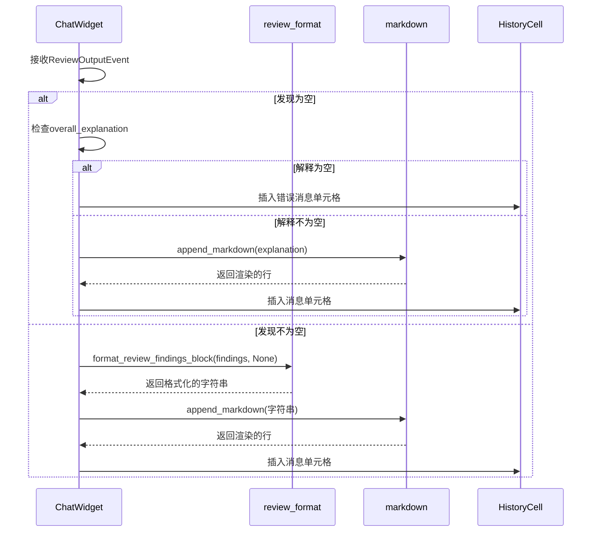

# 审查结果格式化与展示

<cite>
**本文档引用的文件**   
- [review_format.rs](file://codex-rs/core/src/review_format.rs)
- [review_prompts.rs](file://codex-rs/core/src/review_prompts.rs)
- [chatwidget.rs](file://codex-rs/tui/src/chatwidget.rs)
- [protocol.rs](file://codex-rs/protocol/src/protocol.rs)
- [history_message_completed.md](file://codex-rs/core/templates/review/history_message_completed.md)
- [markdown.rs](file://codex-rs/tui/src/markdown.rs)
- [history_cell.rs](file://codex-rs/tui/src/history_cell.rs)
</cite>

## 目录
1. [引言](#引言)
2. [审查结果数据结构](#审查结果数据结构)
3. [审查提示工程](#审查提示工程)
4. [审查结果渲染模板](#审查结果渲染模板)
5. [终端用户界面中的渲染逻辑](#终端用户界面中的渲染逻辑)
6. [样式控制与交互行为](#样式控制与交互行为)
7. [审查场景示例](#审查场景示例)
8. [可访问性与本地化支持](#可访问性与本地化支持)
9. [总结](#总结)

## 引言

Codex系统提供了一套结构化的代码审查功能，允许用户对代码变更进行深入分析。本文件详细阐述了审查结果的生成、格式化和展示机制。核心流程始于用户发起的审查请求，该请求通过`review_prompts.rs`中的提示工程设计被转化为具体的审查任务。审查引擎生成的结构化结果由`review_format.rs`进行格式化，最终通过`tui/src/chatwidget.rs`在终端用户界面中渲染呈现。整个系统旨在提供清晰、可读性强且可操作的审查反馈。

## 审查结果数据结构

审查结果的核心数据结构定义在`protocol.rs`文件中，主要包括`ReviewOutputEvent`、`ReviewFinding`和`ReviewCodeLocation`三个关键结构体。

`ReviewOutputEvent`是审查会话的顶层输出，它包含了所有审查发现的集合以及一个总体评估。该结构体包含以下字段：
- `findings`: 一个`ReviewFinding`对象的向量，代表了所有具体的审查意见。
- `overall_explanation`: 一个字符串，提供对审查结果的总体解释和总结。
- `overall_correctness`: 一个字符串，描述代码的整体正确性评估。
- `overall_confidence_score`: 一个浮点数，表示审查模型对整体结果的置信度。

每个`ReviewFinding`代表一个具体的审查发现，其结构如下：
- `title`: 发现的标题，通常是一个简短的问题描述。
- `body`: 发现的详细描述，包含问题的上下文、影响和建议的解决方案。
- `confidence_score`: 一个浮点数，表示模型对该特定发现的置信度。
- `priority`: 一个整数，表示该发现的优先级。
- `code_location`: 一个`ReviewCodeLocation`对象，精确指明了问题代码的位置。

`ReviewCodeLocation`结构体通过文件路径和行号范围来定位代码：
- `absolute_file_path`: 一个`PathBuf`，表示问题文件的绝对路径。
- `line_range`: 一个`ReviewLineRange`对象，定义了问题代码的起始和结束行号。

这些数据结构共同构成了一个层次化的、机器可读的审查结果，为后续的格式化和展示提供了坚实的基础。

**Section sources**
- [protocol.rs](file://codex-rs/protocol/src/protocol.rs#L1347-L1388)

## 审查提示工程

`review_prompts.rs`模块负责将用户发起的审查请求转化为模型可以理解的提示（prompt）。这一过程是审查功能的核心，它决定了模型将如何分析代码。

`resolve_review_request`函数是该模块的入口点。它接收一个`ReviewRequest`对象和当前工作目录（cwd），并返回一个`ResolvedReviewRequest`。后者包含了最终的提示文本和用户界面提示。

审查请求的目标（`ReviewTarget`）决定了提示的生成方式：
- **未提交的变更 (`UncommittedChanges`)**: 使用一个固定的提示，要求模型审查所有暂存、未暂存和未跟踪的文件变更。
- **基础分支 (`BaseBranch`)**: 提示会动态生成，包含目标分支的名称和一个通过`git merge-base`计算出的合并基点SHA。这指导模型运行`git diff`来比较当前分支与基础分支的差异。
- **特定提交 (`Commit`)**: 提示会包含提交的SHA和可选的提交标题，要求模型审查该提交引入的变更。
- **自定义指令 (`Custom`)**: 用户提供的任意指令将直接作为提示，但不能为空。

这种设计确保了提示的精确性和上下文相关性。例如，当审查基础分支时，提示中包含了具体的`mergeBaseSha`，这使得模型能够精确地执行`git diff`命令，从而获得准确的变更集。`user_facing_hint`函数则为用户提供了一个简洁的界面提示，说明了当前审查的目标。

**Section sources**
- [review_prompts.rs](file://codex-rs/core/src/review_prompts.rs#L6-L93)

## 审查结果渲染模板

审查结果的最终呈现不仅依赖于数据结构和格式化逻辑，还受到渲染模板的约束。`core/templates/review/`目录下的模板文件定义了审查结果在历史记录中的结构。

`history_message_completed.md`是审查成功完成时使用的模板。它是一个XML风格的标记块，包含以下部分：
- `<context>`: 提供上下文信息，说明用户发起了审查任务，并且可以从中选择评论进行处理。
- `<action>`: 标记此事件的类型为`review`。
- `<results>`: 这是关键部分，其中的`{findings}`占位符会被`review_format.rs`模块格式化后的审查发现文本所替换。

这个模板确保了审查结果在会话历史中被一致地标记和组织。当审查被中断时，系统会使用`history_message_interrupted.md`模板，该模板明确指出审查未完成，并指导用户重新发起审查。

**Section sources**
- [history_message_completed.md](file://codex-rs/core/templates/review/history_message_completed.md#L1-L9)

## 终端用户界面中的渲染逻辑

`tui/src/chatwidget.rs`文件中的`ChatWidget`组件负责将格式化的审查结果渲染到终端用户界面。其核心逻辑位于处理`ReviewOutputEvent`的事件处理器中。

当`ChatWidget`接收到一个`ReviewOutputEvent`时，它会执行以下步骤：
1.  **检查发现**: 首先检查`output.findings`向量是否为空。
2.  **处理空结果**: 如果没有发现，系统会检查`overall_explanation`。如果解释也为空，则显示一个错误消息（"Reviewer failed to output a response."）。否则，它会将解释文本作为纯文本消息渲染。
3.  **格式化并渲染发现**: 如果存在发现，系统会调用`codex_core::review_format::format_review_findings_block`函数，传入所有发现和一个`None`的`selection`参数（表示不显示复选框）。这会生成一个格式化的纯文本字符串。
4.  **Markdown渲染**: 生成的纯文本字符串随后被传递给`append_markdown`函数。尽管内容是纯文本，但该函数会将其作为Markdown处理，以确保一致的样式和换行处理。
5.  **创建并插入单元格**: 最后，渲染后的行被用来创建一个`AgentMessageCell`，并通过事件系统插入到聊天历史中。

这个过程将结构化的`ReviewFinding`对象转换为用户友好的、格式化的文本块，并将其无缝地集成到对话流中。



**Diagram sources**
- [chatwidget.rs](file://codex-rs/tui/src/chatwidget.rs#L1940-L1964)
- [review_format.rs](file://codex-rs/core/src/review_format.rs#L23-L57)
- [markdown.rs](file://codex-rs/tui/src/markdown.rs#L2-L8)

**Section sources**
- [chatwidget.rs](file://codex-rs/tui/src/chatwidget.rs#L1940-L1964)

## 样式控制与交互行为

审查结果的视觉呈现由多个组件协同控制。`review_format.rs`负责生成结构化的纯文本，而`tui`模块则负责最终的样式应用。

`format_review_findings_block`函数生成的文本遵循严格的格式：
- **标题**: 使用`- {title} — {path}:{start}-{end}`的格式，其中`{title}`是发现的标题，`{path}`是文件路径，`{start}`和`{end}`是行号范围。
- **正文**: 每个发现的正文行都以两个空格缩进，形成清晰的层级结构。
- **头部**: 根据发现的数量，使用“Review comment:”或“Full review comments:”作为标题。

在`ChatWidget`中，`append_markdown`函数将这些纯文本行转换为`ratatui::text::Line`对象。虽然内容不是真正的Markdown，但该函数确保了文本的正确换行和缩进。最终的`AgentMessageCell`被创建时，其`is_markdown`标志被设置为`true`，这可能会影响其在历史记录中的某些行为或样式。

在交互方面，`format_review_findings_block`函数支持一个`selection`参数。当传入一个布尔值数组时，它会在每个发现前添加一个`[x]`或`[ ]`的复选框标记。这为实现可交互的审查界面（例如，允许用户选择要处理的发现）提供了可能性，尽管在当前的`ChatWidget`实现中，该功能尚未被激活（`selection`参数为`None`）。

**Section sources**
- [review_format.rs](file://codex-rs/core/src/review_format.rs#L7-L57)
- [chatwidget.rs](file://codex-rs/tui/src/chatwidget.rs#L1956-L1960)

## 审查场景示例

以下是不同审查场景下输出格式的示例：

**场景一：审查未提交的变更**
```
Full review comments:

- Inefficient string concatenation — src/utils.rs:45-48
  The current implementation uses repeated string concatenation in a loop, which has O(n²) time complexity.
  Consider using a `StringBuilder` or collecting into a `Vec<String>` and then joining.

- Missing null check — src/api/handler.go:102-105
  The function `processRequest` does not validate if the `user` object is null before accessing its properties.
  This could lead to a `NullPointerException`. Add a null check at the beginning of the function.
```

**场景二：审查单个发现**
```
Review comment:

- Unused variable — main.py:23
  The variable `temp_result` is assigned a value but never used. This is dead code and should be removed to improve code clarity.
```

**场景三：审查失败**
```
Reviewer failed to output a response.
```

这些示例展示了系统如何根据发现的数量调整标题，并始终将问题描述与代码位置清晰地关联起来。

## 可访问性与本地化支持

当前的审查结果呈现机制在可访问性和本地化方面有明确的设计考量。

在可访问性方面，系统通过清晰的文本结构和语义化标记来提升可读性。使用`-`符号作为项目符号，以及通过缩进来区分标题和正文，使得结果易于被屏幕阅读器解析。`append_markdown`函数的使用也确保了文本的换行和格式化是可预测的。

在本地化支持方面，目前的实现主要依赖于硬编码的英文字符串。例如，`REVIEW_FALLBACK_MESSAGE`和`format_review_findings_block`函数中的标题（"Review comment:"）都是英文的。虽然`review_prompts.rs`中的`user_facing_hint`函数生成的提示是基于用户输入的，但其模板（如"changes against '{branch}'"）也是英文的。这意味着系统目前没有内置的多语言支持。要实现本地化，需要将这些硬编码的字符串提取到资源文件中，并根据用户的语言环境进行动态加载。

## 总结

Codex的审查结果呈现系统是一个由数据结构、提示工程、格式化逻辑和UI渲染组成的精密管道。`review_prompts.rs`确保了审查任务的精确性，`review_format.rs`提供了结构化的、UI无关的文本输出，而`tui/src/chatwidget.rs`则负责将这些文本最终渲染为用户友好的界面元素。通过使用模板和Markdown渲染，系统保证了输出的一致性和美观性。未来的工作可以集中在增强交互性（如复选框选择）和实现全面的本地化支持上，以进一步提升用户体验。