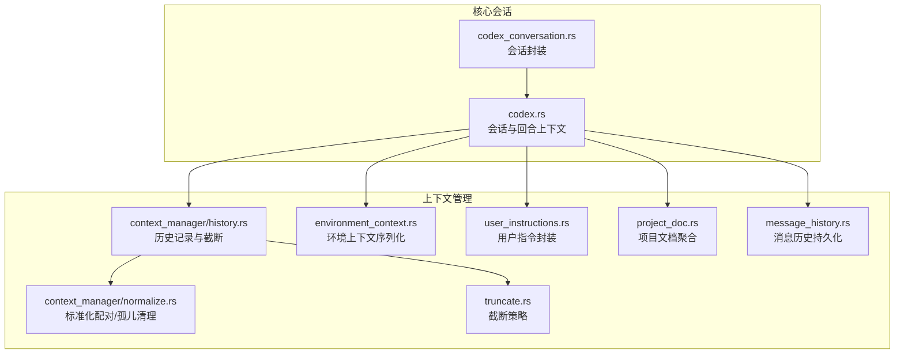
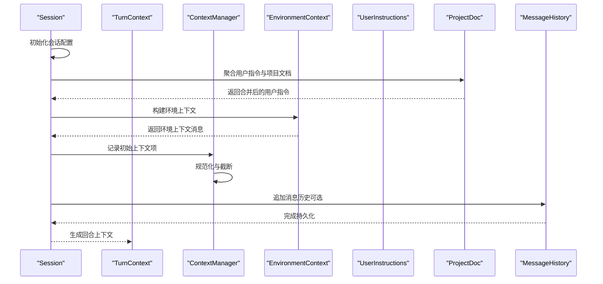
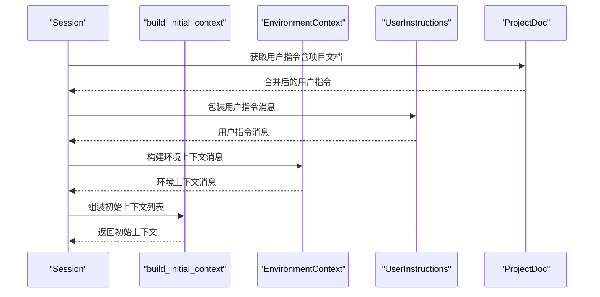
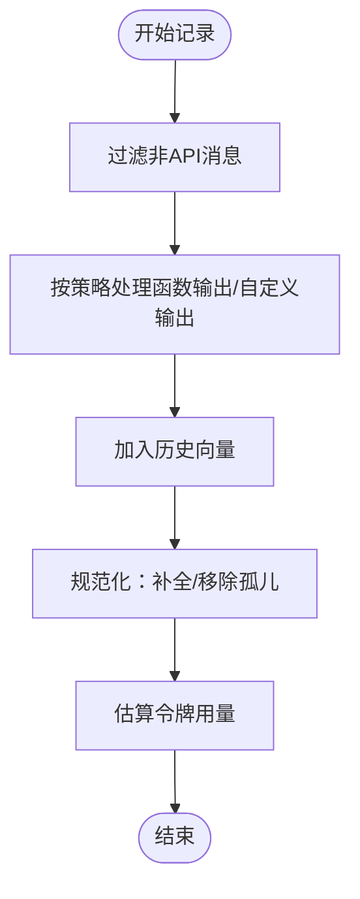
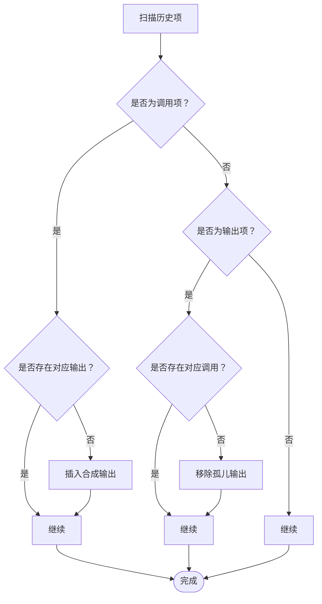
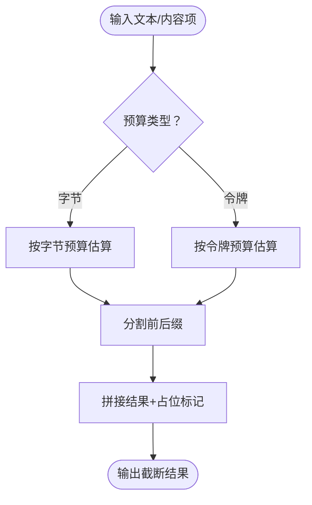
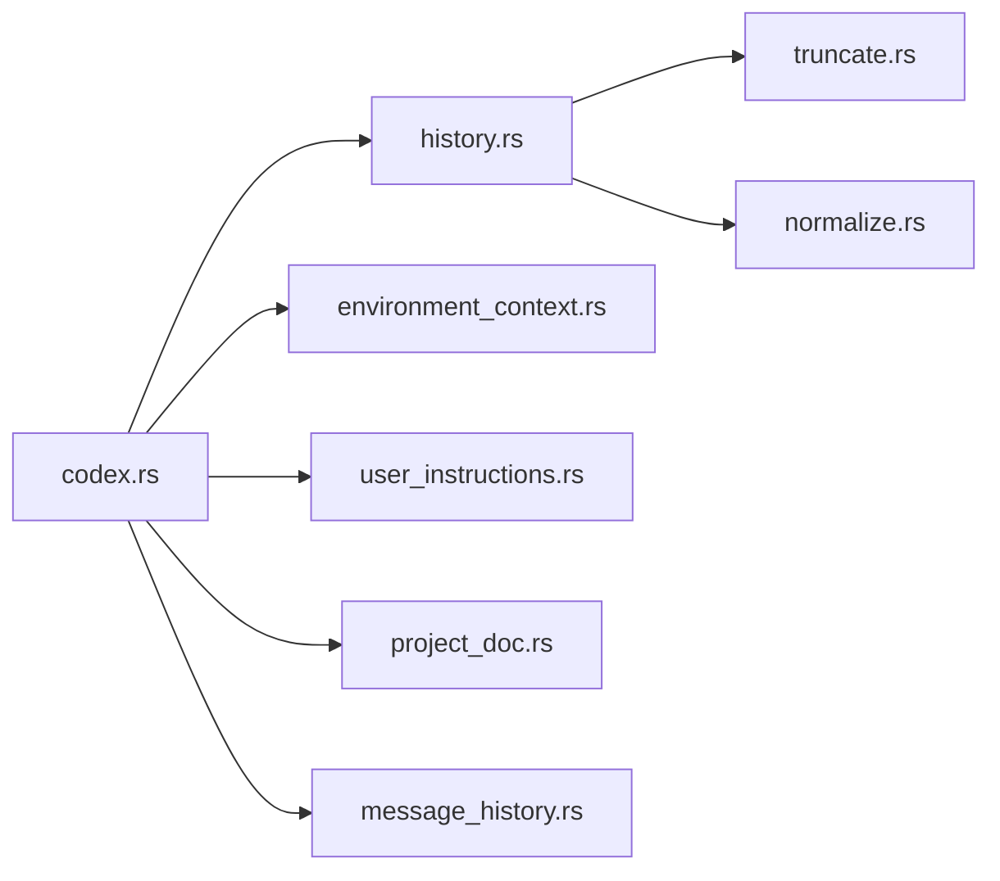

# 上下文处理

<cite>
**本文引用的文件**
- [codex.rs](file://codex-rs/core/src/codex.rs)
- [history.rs](file://codex-rs/core/src/context_manager/history.rs)
- [normalize.rs](file://codex-rs/core/src/context_manager/normalize.rs)
- [truncate.rs](file://codex-rs/core/src/truncate.rs)
- [environment_context.rs](file://codex-rs/core/src/environment_context.rs)
- [message_history.rs](file://codex-rs/core/src/message_history.rs)
- [user_instructions.rs](file://codex-rs/core/src/user_instructions.rs)
- [project_doc.rs](file://codex-rs/core/src/project_doc.rs)
- [codex_conversation.rs](file://codex-rs/core/src/codex_conversation.rs)
</cite>

## 目录
1. [简介](#简介)
2. [项目结构](#项目结构)
3. [核心组件](#核心组件)
4. [架构总览](#架构总览)
5. [详细组件分析](#详细组件分析)
6. [依赖关系分析](#依赖关系分析)
7. [性能考量](#性能考量)
8. [故障排查指南](#故障排查指南)
9. [结论](#结论)
10. [附录：使用示例与最佳实践](#附录使用示例与最佳实践)

## 简介
本文件聚焦于 Codex 的上下文处理机制，围绕以下关键模块展开：
- codex.rs 中的上下文组装流程（初始上下文构建、会话配置、回合上下文生成）
- context_manager/history.rs 中的历史记录管理（历史项记录、规范化、截断策略应用）
- context_manager/normalize.rs 中的上下文标准化（配对校验、孤儿输出清理、移除对应项）
- truncate.rs 中的上下文截断策略（字节/令牌预算、函数输出片段化、标记格式化）

同时，文档说明了如何从文件系统、用户输入和先前对话中收集与整合上下文信息，涵盖上下文窗口管理、敏感信息过滤、代码片段提取与优先级排序算法，并讨论性能优化、内存使用效率与在大型项目中的可扩展性问题。

## 项目结构
与上下文处理直接相关的目录与文件如下：
- 核心会话与回合上下文：codex.rs
- 历史管理与标准化：context_manager/history.rs、context_manager/normalize.rs
- 截断策略：truncate.rs
- 环境上下文序列化：environment_context.rs
- 消息历史持久化：message_history.rs
- 用户指令与项目文档：user_instructions.rs、project_doc.rs
- 会话封装：codex_conversation.rs

图表来源
- [codex.rs](file://codex-rs/core/src/codex.rs#L1200-L1254)
- [history.rs](file://codex-rs/core/src/context_manager/history.rs#L1-L120)
- [normalize.rs](file://codex-rs/core/src/context_manager/normalize.rs#L1-L120)
- [truncate.rs](file://codex-rs/core/src/truncate.rs#L1-L120)
- [environment_context.rs](file://codex-rs/core/src/environment_context.rs#L1-L120)
- [user_instructions.rs](file://codex-rs/core/src/user_instructions.rs#L1-L80)
- [project_doc.rs](file://codex-rs/core/src/project_doc.rs#L1-L80)
- [message_history.rs](file://codex-rs/core/src/message_history.rs#L1-L80)
- [codex_conversation.rs](file://codex-rs/core/src/codex_conversation.rs#L1-L40)

章节来源
- [codex.rs](file://codex-rs/core/src/codex.rs#L1200-L1254)
- [history.rs](file://codex-rs/core/src/context_manager/history.rs#L1-L120)
- [normalize.rs](file://codex-rs/core/src/context_manager/normalize.rs#L1-L120)
- [truncate.rs](file://codex-rs/core/src/truncate.rs#L1-L120)
- [environment_context.rs](file://codex-rs/core/src/environment_context.rs#L1-L120)
- [user_instructions.rs](file://codex-rs/core/src/user_instructions.rs#L1-L80)
- [project_doc.rs](file://codex-rs/core/src/project_doc.rs#L1-L80)
- [message_history.rs](file://codex-rs/core/src/message_history.rs#L1-L80)
- [codex_conversation.rs](file://codex-rs/core/src/codex_conversation.rs#L1-L40)

## 核心组件
- 会话与回合上下文（Session/TurnContext）：负责模型客户端初始化、工具配置、执行策略、截断策略等。
- 历史管理器（ContextManager）：维护对话历史、进行规范化、估算令牌用量、应用截断策略。
- 标准化器（normalize）：确保调用与输出成对存在，清理孤儿输出，保持历史一致性。
- 截断器（truncate）：基于字节或令牌预算进行中间截断，保留前后缀，支持函数输出片段化。
- 环境上下文（EnvironmentContext）：将工作目录、沙箱策略、审批策略、网络访问等序列化为用户消息。
- 用户指令与项目文档（UserInstructions/ProjectDoc）：从配置与项目文档中聚合用户指令，作为上下文的一部分。
- 消息历史（message_history）：将消息写入本地历史文件，带有限流与安全权限控制。

章节来源
- [codex.rs](file://codex-rs/core/src/codex.rs#L335-L560)
- [history.rs](file://codex-rs/core/src/context_manager/history.rs#L1-L120)
- [normalize.rs](file://codex-rs/core/src/context_manager/normalize.rs#L1-L120)
- [truncate.rs](file://codex-rs/core/src/truncate.rs#L1-L120)
- [environment_context.rs](file://codex-rs/core/src/environment_context.rs#L1-L120)
- [user_instructions.rs](file://codex-rs/core/src/user_instructions.rs#L1-L80)
- [project_doc.rs](file://codex-rs/core/src/project_doc.rs#L1-L80)
- [message_history.rs](file://codex-rs/core/src/message_history.rs#L1-L80)

## 架构总览
下面的时序图展示了从会话初始化到构建初始上下文的关键流程，包括用户指令、项目文档、环境上下文与历史记录的整合。

图表来源
- [codex.rs](file://codex-rs/core/src/codex.rs#L1200-L1254)
- [project_doc.rs](file://codex-rs/core/src/project_doc.rs#L34-L74)
- [environment_context.rs](file://codex-rs/core/src/environment_context.rs#L178-L188)
- [history.rs](file://codex-rs/core/src/context_manager/history.rs#L49-L78)
- [message_history.rs](file://codex-rs/core/src/message_history.rs#L67-L155)

## 详细组件分析

### 组件A：上下文组装（codex.rs）
- 初始上下文构建：在新会话或恢复会话时，构建开发者指令、用户指令与环境上下文三项基础内容，作为对话初始输入。
- 回合上下文生成：根据会话配置与模型族信息，构造 TurnContext，包含模型客户端、工具配置、执行策略、沙箱策略、路径解析、最终输出模式、截断策略等。
- 环境更新检测：比较前一轮与当前轮的环境上下文差异，仅在变化时插入差异消息，避免冗余。

图表来源
- [codex.rs](file://codex-rs/core/src/codex.rs#L1220-L1242)
- [user_instructions.rs](file://codex-rs/core/src/user_instructions.rs#L1-L43)
- [environment_context.rs](file://codex-rs/core/src/environment_context.rs#L178-L188)
- [project_doc.rs](file://codex-rs/core/src/project_doc.rs#L34-L74)

章节来源
- [codex.rs](file://codex-rs/core/src/codex.rs#L1200-L1254)
- [codex.rs](file://codex-rs/core/src/codex.rs#L865-L904)

### 组件B：历史记录管理（context_manager/history.rs）
- 历史项记录：仅记录 API 消息（非 system、非 Other），并按截断策略处理函数输出与自定义工具输出。
- 规范化：确保每个调用都有对应输出，每个输出都有对应调用；移除孤儿输出，维持历史一致性。
- 令牌估算：基于近似字节计数与推理内容长度估算，辅助上下文窗口管理。
- 历史裁剪：移除最旧项以维持一致性；支持替换最后轮次图片占位符等操作。

图表来源
- [history.rs](file://codex-rs/core/src/context_manager/history.rs#L49-L120)
- [normalize.rs](file://codex-rs/core/src/context_manager/normalize.rs#L1-L120)

章节来源
- [history.rs](file://codex-rs/core/src/context_manager/history.rs#L1-L120)
- [normalize.rs](file://codex-rs/core/src/context_manager/normalize.rs#L1-L120)

### 组件C：上下文标准化（context_manager/normalize.rs）
- 补全缺失输出：扫描调用项，若无对应输出则插入“已中止”合成输出，保证成对。
- 清理孤儿输出：扫描输出项，若无匹配调用则报错并移除，保持历史完整性。
- 移除对应项：当移除某条调用或输出时，同步移除其配对项，避免不一致。

图表来源
- [normalize.rs](file://codex-rs/core/src/context_manager/normalize.rs#L1-L148)

章节来源
- [normalize.rs](file://codex-rs/core/src/context_manager/normalize.rs#L1-L148)

### 组件D：上下文截断策略（truncate.rs）
- 预算来源：支持按字节或令牌两种模式，结合配置与模型族限制动态生成预算。
- 文本截断：在保留前缀与后缀的前提下进行中间截断，使用占位标记指示被截断数量。
- 函数输出片段化：对内容项进行逐项评估，优先保留图片项，文本项按预算截断并追加省略摘要。
- 令牌估算：提供近似字节到令牌转换与反向估算，便于粗略预算计算。

图表来源
- [truncate.rs](file://codex-rs/core/src/truncate.rs#L88-L166)
- [truncate.rs](file://codex-rs/core/src/truncate.rs#L167-L228)
- [truncate.rs](file://codex-rs/core/src/truncate.rs#L301-L315)

章节来源
- [truncate.rs](file://codex-rs/core/src/truncate.rs#L1-L228)
- [truncate.rs](file://codex-rs/core/src/truncate.rs#L301-L315)

### 组件E：环境上下文序列化（environment_context.rs）
- 将工作目录、审批策略、沙箱模式、网络访问、可写根路径与 Shell 信息序列化为 XML 片段，作为用户消息注入到上下文中。
- 提供差异比较与差分生成，用于在回合切换时仅发送变化部分。

章节来源
- [environment_context.rs](file://codex-rs/core/src/environment_context.rs#L1-L120)
- [environment_context.rs](file://codex-rs/core/src/environment_context.rs#L128-L176)
- [environment_context.rs](file://codex-rs/core/src/environment_context.rs#L178-L188)

### 组件F：用户指令与项目文档（user_instructions.rs、project_doc.rs）
- 用户指令包装：将目录与内容封装为用户消息，便于注入到上下文。
- 项目文档聚合：沿 Git 根路径向上查找 AGENTS.md 或本地覆盖文件，按配置限制字节数进行拼接与合并，支持技能说明附加。

章节来源
- [user_instructions.rs](file://codex-rs/core/src/user_instructions.rs#L1-L80)
- [project_doc.rs](file://codex-rs/core/src/project_doc.rs#L34-L74)
- [project_doc.rs](file://codex-rs/core/src/project_doc.rs#L76-L133)

### 组件G：消息历史持久化（message_history.rs）
- 写入策略：单行 JSONL 追加，使用建议锁与原子写入，确保并发安全。
- 限额与修剪：超过硬上限时重写尾部至软上限，保留最新条目。
- 权限控制：在 Unix 下设置严格权限，Windows 下兼容处理。

章节来源
- [message_history.rs](file://codex-rs/core/src/message_history.rs#L67-L155)
- [message_history.rs](file://codex-rs/core/src/message_history.rs#L157-L234)
- [message_history.rs](file://codex-rs/core/src/message_history.rs#L244-L314)

## 依赖关系分析
- Session/TurnContext 依赖 ModelsManager、AuthManager、OtelManager、Config 等，生成 TruncationPolicy 并传入 ContextManager。
- ContextManager 依赖 truncate.rs 的策略与近似估算，依赖 normalize.rs 的配对与清理逻辑。
- 环境上下文、用户指令与项目文档通过 ResponseItem 注入到历史中，参与后续回合的 Prompt 输入。
- message_history.rs 与历史记录解耦，仅在需要时写入历史文件。

图表来源
- [codex.rs](file://codex-rs/core/src/codex.rs#L482-L537)
- [history.rs](file://codex-rs/core/src/context_manager/history.rs#L1-L120)
- [truncate.rs](file://codex-rs/core/src/truncate.rs#L1-L120)
- [normalize.rs](file://codex-rs/core/src/context_manager/normalize.rs#L1-L120)
- [environment_context.rs](file://codex-rs/core/src/environment_context.rs#L1-L120)
- [user_instructions.rs](file://codex-rs/core/src/user_instructions.rs#L1-L80)
- [project_doc.rs](file://codex-rs/core/src/project_doc.rs#L1-L80)
- [message_history.rs](file://codex-rs/core/src/message_history.rs#L1-L80)

章节来源
- [codex.rs](file://codex-rs/core/src/codex.rs#L482-L537)
- [history.rs](file://codex-rs/core/src/context_manager/history.rs#L1-L120)
- [truncate.rs](file://codex-rs/core/src/truncate.rs#L1-L120)
- [normalize.rs](file://codex-rs/core/src/context_manager/normalize.rs#L1-L120)
- [environment_context.rs](file://codex-rs/core/src/environment_context.rs#L1-L120)
- [user_instructions.rs](file://codex-rs/core/src/user_instructions.rs#L1-L80)
- [project_doc.rs](file://codex-rs/core/src/project_doc.rs#L1-L80)
- [message_history.rs](file://codex-rs/core/src/message_history.rs#L1-L80)

## 性能考量
- 截断策略的近似估算：使用字节到令牌的启发式转换，避免昂贵的分词器开销，适合大规模输出场景。
- 历史规范化与截断：在记录阶段即进行，减少后续回合的重复处理；孤儿输出清理避免历史膨胀。
- 令牌估算与窗口管理：通过 ContextManager 的估算方法与 TruncationPolicy 的乘法预算，提前控制上下文大小。
- 文件 I/O 优化：消息历史采用单行原子写入与建议锁，降低竞争与碎片；修剪策略避免频繁重写。
- 内存使用：历史向量按顺序增长，规范化与截断后及时释放冗余项；环境上下文与用户指令以消息形式注入，避免长期驻留大对象。

[本节为通用指导，无需列出具体文件来源]

## 故障排查指南
- 历史不一致或报错：检查是否存在调用无输出或输出无调用的情况，查看标准化日志与错误提示，必要时启用更严格的日志级别。
- 截断异常或内容丢失：确认 TruncationPolicy 的预算来源（字节/令牌）与模型族限制是否合理；检查函数输出片段化是否正确处理图片与文本混合。
- 环境上下文未更新：确认环境变更检测逻辑，仅在字段发生变化时才插入差异消息。
- 历史文件写入失败：检查权限与磁盘空间，确认建议锁是否被其他进程占用；关注最大重试次数与睡眠间隔。
- 项目文档未生效：核对项目文档发现规则（Git 根路径、候选文件名、本地覆盖文件）、字节限制与合并分隔符。

章节来源
- [normalize.rs](file://codex-rs/core/src/context_manager/normalize.rs#L1-L148)
- [truncate.rs](file://codex-rs/core/src/truncate.rs#L1-L120)
- [environment_context.rs](file://codex-rs/core/src/environment_context.rs#L1-L120)
- [message_history.rs](file://codex-rs/core/src/message_history.rs#L67-L155)

## 结论
Codex 的上下文处理机制通过“会话/回合上下文组装 + 历史管理 + 标准化 + 截断策略”的组合，实现了从文件系统、用户输入与先前对话中高效整合上下文的能力。该机制在保证历史一致性的同时，通过近似估算与预算控制有效管理上下文窗口，兼顾性能与可扩展性。在大型项目中，建议合理配置项目文档字节限制、令牌预算与沙箱策略，以获得稳定且高效的上下文处理体验。

[本节为总结性内容，无需列出具体文件来源]

## 附录：使用示例与最佳实践
- 从文件系统收集项目文档：使用项目文档聚合逻辑，沿 Git 根路径向上查找 AGENTS.md 或本地覆盖文件，按配置限制字节数进行拼接。
- 从用户输入构建上下文：将用户指令包装为用户消息，注入到初始上下文中；对于技能说明，可在启动时加载并合并到用户指令中。
- 从先前对话中整合：使用历史管理器记录 API 消息，进行规范化与截断，确保上下文窗口不超限。
- 敏感信息过滤：在消息历史写入前进行敏感信息检查（参考注释位置），避免将敏感数据持久化。
- 代码片段提取与优先级排序：在工具层面对代码块进行缩进与锚点分析，优先保留最小必要范围，再按预算进行截断与摘要补充。
- 性能优化建议：尽量使用字节预算进行截断以减少分词成本；在回合切换时仅发送环境差异；合理设置项目文档与工具输出的令牌/字节预算。

章节来源
- [project_doc.rs](file://codex-rs/core/src/project_doc.rs#L34-L74)
- [user_instructions.rs](file://codex-rs/core/src/user_instructions.rs#L1-L80)
- [history.rs](file://codex-rs/core/src/context_manager/history.rs#L49-L120)
- [truncate.rs](file://codex-rs/core/src/truncate.rs#L88-L166)
- [message_history.rs](file://codex-rs/core/src/message_history.rs#L67-L155)