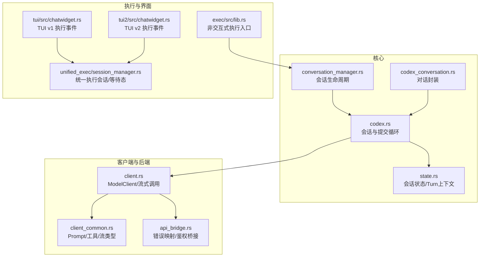
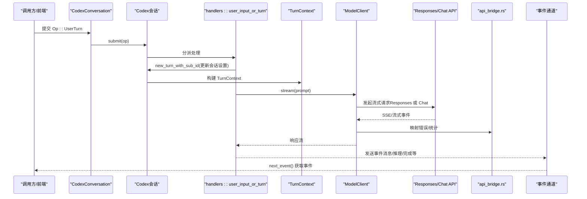
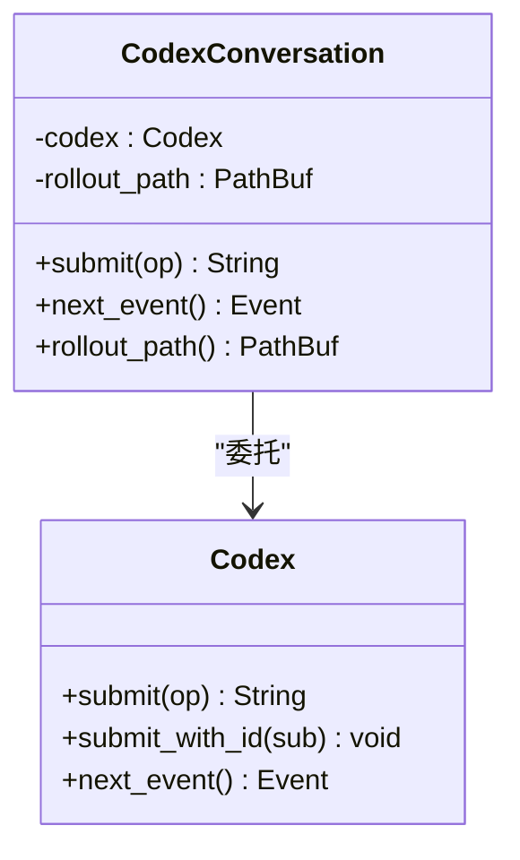
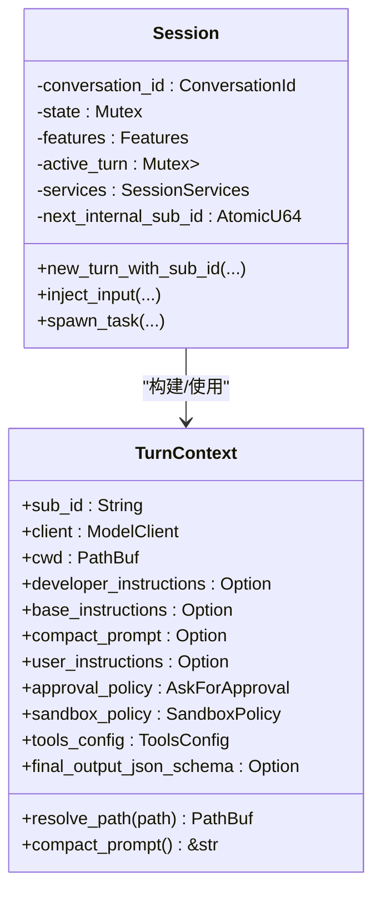
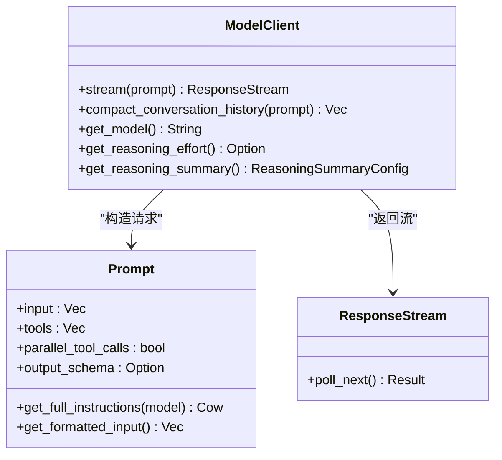
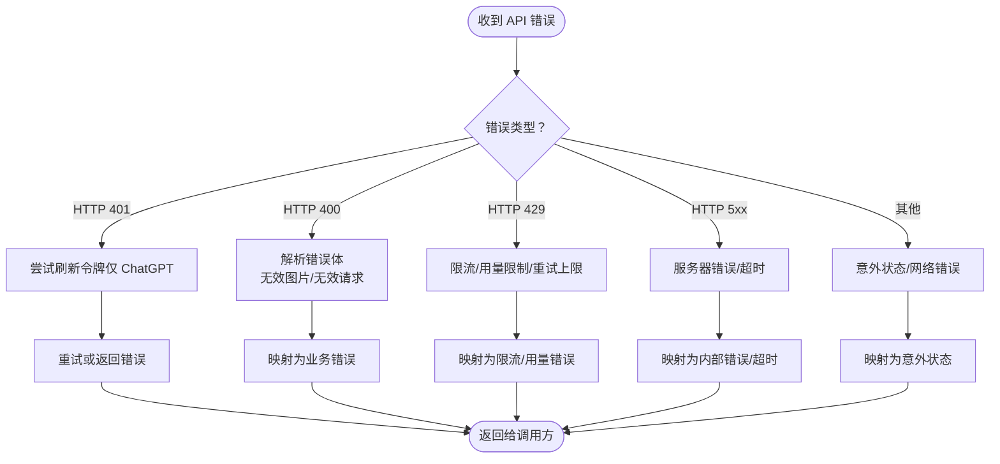
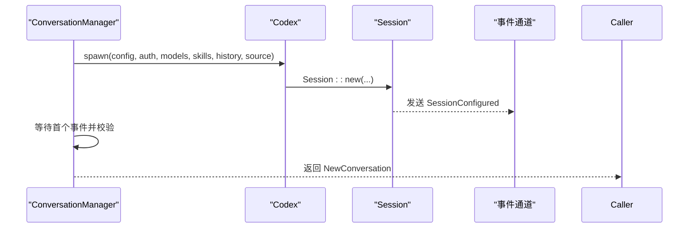
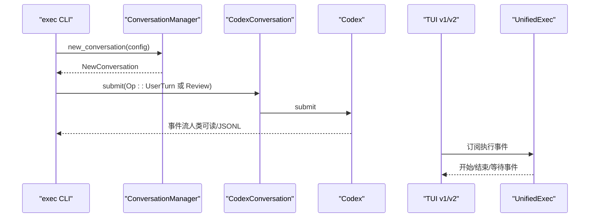
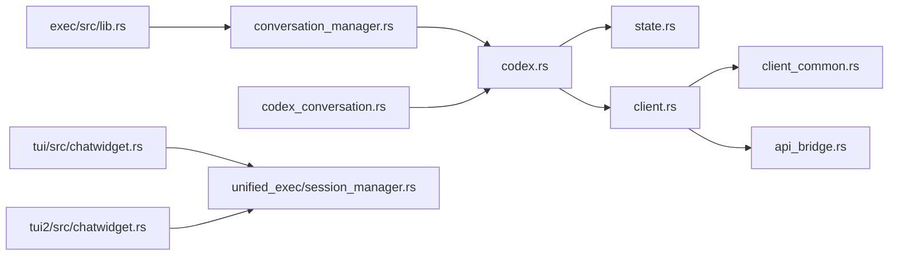

# 代码生成

<cite>
**本文引用的文件**
- [codex.rs](file://codex-rs/core/src/codex.rs)
- [codex_conversation.rs](file://codex-rs/core/src/codex_conversation.rs)
- [client.rs](file://codex-rs/core/src/client.rs)
- [client_common.rs](file://codex-rs/core/src/client_common.rs)
- [api_bridge.rs](file://codex-rs/core/src/api_bridge.rs)
- [conversation_manager.rs](file://codex-rs/core/src/conversation_manager.rs)
- [state.rs](file://codex-rs/core/src/state.rs)
- [lib.rs（exec 非交互式）](file://codex-rs/exec/src/lib.rs)
- [chatwidget.rs（TUI v1）](file://codex-rs/tui/src/chatwidget.rs)
- [chatwidget.rs（TUI v2）](file://codex-rs/tui2/src/chatwidget.rs)
- [session_manager.rs（unified_exec）](file://codex-rs/core/src/unified_exec/session_manager.rs)
</cite>

## 目录
1. [简介](#简介)
2. [项目结构](#项目结构)
3. [核心组件](#核心组件)
4. [架构总览](#架构总览)
5. [详细组件分析](#详细组件分析)
6. [依赖关系分析](#依赖关系分析)
7. [性能考量](#性能考量)
8. [故障排查指南](#故障排查指南)
9. [结论](#结论)
10. [附录](#附录)

## 简介
本节面向希望理解 Codex 代码生成功能的读者，系统阐述如何通过核心模块实现“对话式代码生成”。重点覆盖：
- 会话状态管理与上下文维护
- 客户端逻辑与后端模型服务交互
- 请求转发与错误映射
- 与 TUI 和非交互式执行模块的集成
- 性能优化策略与常见问题解决

## 项目结构
围绕代码生成的关键路径，涉及以下模块：
- 会话与任务调度：codex.rs、state.rs、conversation_manager.rs
- 客户端与模型交互：client.rs、client_common.rs、api_bridge.rs
- 对话封装：codex_conversation.rs
- 非交互式执行：exec/src/lib.rs
- TUI 集成：tui/src/chatwidget.rs、tui2/src/chatwidget.rs
- 统一执行与等待态：core/src/unified_exec/session_manager.rs

图表来源
- [codex.rs](file://codex-rs/core/src/codex.rs#L1-L120)
- [state.rs](file://codex-rs/core/src/state.rs#L1-L120)
- [conversation_manager.rs](file://codex-rs/core/src/conversation_manager.rs#L1-L120)
- [codex_conversation.rs](file://codex-rs/core/src/codex_conversation.rs#L1-L40)
- [client.rs](file://codex-rs/core/src/client.rs#L1-L120)
- [client_common.rs](file://codex-rs/core/src/client_common.rs#L1-L120)
- [api_bridge.rs](file://codex-rs/core/src/api_bridge.rs#L1-L120)
- [lib.rs（exec 非交互式）](file://codex-rs/exec/src/lib.rs#L1-L120)
- [chatwidget.rs（TUI v1）](file://codex-rs/tui/src/chatwidget.rs#L1036-L1191)
- [chatwidget.rs（TUI v2）](file://codex-rs/tui2/src/chatwidget.rs#L1036-L1191)
- [session_manager.rs（unified_exec）](file://codex-rs/core/src/unified_exec/session_manager.rs#L422-L473)

章节来源
- [codex.rs](file://codex-rs/core/src/codex.rs#L1-L120)
- [client.rs](file://codex-rs/core/src/client.rs#L1-L120)
- [conversation_manager.rs](file://codex-rs/core/src/conversation_manager.rs#L1-L120)

## 核心组件
- Codex 会话与提交循环：负责接收用户操作（Op），驱动任务执行与事件分发。
- 会话状态与 Turn 上下文：管理当前轮次的配置、工作目录、工具集、策略等。
- ModelClient：封装对 Responses/Chat Completions 的调用，支持流式与聚合模式、SSE 诊断、输出模式控制。
- Prompt/工具与响应流：标准化输入、工具规格、输出模式（verbosity/schema），并提供统一的响应流抽象。
- API 错误映射与鉴权桥接：将底层传输错误映射为统一错误类型，处理 401 刷新与鉴权来源。
- 会话封装与生命周期：对外暴露提交/事件接收接口，管理会话创建、恢复、分叉等。
- 非交互式执行：以命令行方式运行，按事件驱动消费结果。
- TUI 集成：渲染执行过程、等待态提示、交互输入等。

章节来源
- [codex.rs](file://codex-rs/core/src/codex.rs#L160-L360)
- [state.rs](file://codex-rs/core/src/state.rs#L1-L120)
- [client.rs](file://codex-rs/core/src/client.rs#L90-L220)
- [client_common.rs](file://codex-rs/core/src/client_common.rs#L20-L120)
- [api_bridge.rs](file://codex-rs/core/src/api_bridge.rs#L1-L120)
- [codex_conversation.rs](file://codex-rs/core/src/codex_conversation.rs#L1-L40)
- [lib.rs（exec 非交互式）](file://codex-rs/exec/src/lib.rs#L1-L120)

## 架构总览
下面的序列图展示了从“提交一次对话轮次”到“收到模型响应事件”的完整流程，包括会话状态更新、客户端调用与事件分发。

图表来源
- [codex_conversation.rs](file://codex-rs/core/src/codex_conversation.rs#L20-L40)
- [codex.rs](file://codex-rs/core/src/codex.rs#L1569-L1721)
- [client.rs](file://codex-rs/core/src/client.rs#L110-L220)
- [api_bridge.rs](file://codex-rs/core/src/api_bridge.rs#L1-L120)

章节来源
- [codex_conversation.rs](file://codex-rs/core/src/codex_conversation.rs#L1-L40)
- [codex.rs](file://codex-rs/core/src/codex.rs#L1569-L1721)
- [client.rs](file://codex-rs/core/src/client.rs#L110-L220)
- [api_bridge.rs](file://codex-rs/core/src/api_bridge.rs#L1-L120)

## 详细组件分析

### 会话与对话封装（Codex、CodexConversation）
- Codex：提供提交与事件接收接口；内部启动提交循环，按 Op 分派处理。
- CodexConversation：对外暴露 submit/next_event，封装会话标识与回放路径。

图表来源
- [codex.rs](file://codex-rs/core/src/codex.rs#L304-L333)
- [codex_conversation.rs](file://codex-rs/core/src/codex_conversation.rs#L1-L40)

章节来源
- [codex.rs](file://codex-rs/core/src/codex.rs#L304-L333)
- [codex_conversation.rs](file://codex-rs/core/src/codex_conversation.rs#L1-L40)

### 会话状态与 Turn 上下文（Session/TurnContext）
- Session：持有会话级配置、特性开关、活动轮次、服务集合（MCP、执行、通知等）。
- TurnContext：包含当前轮次的模型客户端、工作目录、指令、工具配置、策略与截断策略等。

图表来源
- [codex.rs](file://codex-rs/core/src/codex.rs#L335-L560)
- [codex.rs](file://codex-rs/core/src/codex.rs#L470-L560)

章节来源
- [codex.rs](file://codex-rs/core/src/codex.rs#L335-L560)

### 客户端与模型交互（ModelClient/Prompt/ResponseStream）
- ModelClient：根据提供商选择 Responses 或 Chat 路径；支持输出模式（verbosity）、推理摘要（reasoning）、文本参数（output_schema）；内置 401 刷新与重试。
- Prompt：标准化输入项、工具规格、是否允许并行工具调用、输出模式（schema/verbosity）。
- ResponseStream：统一的事件流抽象，将底层 API 事件映射为核心事件类型，并记录 OTEL 指标。

图表来源
- [client.rs](file://codex-rs/core/src/client.rs#L90-L220)
- [client.rs](file://codex-rs/core/src/client.rs#L370-L458)
- [client_common.rs](file://codex-rs/core/src/client_common.rs#L20-L120)
- [client_common.rs](file://codex-rs/core/src/client_common.rs#L240-L260)

章节来源
- [client.rs](file://codex-rs/core/src/client.rs#L90-L220)
- [client.rs](file://codex-rs/core/src/client.rs#L370-L458)
- [client_common.rs](file://codex-rs/core/src/client_common.rs#L20-L120)
- [client_common.rs](file://codex-rs/core/src/client_common.rs#L240-L260)

### API 错误映射与鉴权桥接（api_bridge.rs）
- 将底层传输错误映射为统一错误类型，识别配额/限流/无效请求/网络超时等场景。
- 鉴权桥接：优先使用提供商 API Key，其次实验性 Bearer Token，最后使用认证管理器提供的令牌。

图表来源
- [api_bridge.rs](file://codex-rs/core/src/api_bridge.rs#L1-L120)
- [client.rs](file://codex-rs/core/src/client.rs#L459-L497)

章节来源
- [api_bridge.rs](file://codex-rs/core/src/api_bridge.rs#L1-L120)
- [client.rs](file://codex-rs/core/src/client.rs#L459-L497)

### 会话生命周期与对话管理（ConversationManager/Codex）
- ConversationManager：创建/恢复/分叉会话，管理会话注册表，确保首个事件为会话初始化。
- Codex：启动提交循环，按 Op 分派处理（用户输入/轮次/审查/关闭等）。

图表来源
- [conversation_manager.rs](file://codex-rs/core/src/conversation_manager.rs#L106-L169)
- [codex.rs](file://codex-rs/core/src/codex.rs#L205-L302)

章节来源
- [conversation_manager.rs](file://codex-rs/core/src/conversation_manager.rs#L106-L169)
- [codex.rs](file://codex-rs/core/src/codex.rs#L205-L302)

### 非交互式执行（exec）与 TUI 集成
- 非交互式执行：以命令行方式运行，加载配置、解析 CLI 覆盖、决定审批策略与沙箱模式，提交初始操作（用户轮次或审查），按事件驱动输出。
- TUI 集成：在 TUI 中渲染执行开始/结束事件、等待态提示、交互输入预览等，统一执行会话负责在后台维持交互式会话并发出等待事件。

图表来源
- [lib.rs（exec 非交互式）](file://codex-rs/exec/src/lib.rs#L1-L120)
- [lib.rs（exec 非交互式）](file://codex-rs/exec/src/lib.rs#L383-L428)
- [chatwidget.rs（TUI v1）](file://codex-rs/tui/src/chatwidget.rs#L1036-L1191)
- [chatwidget.rs（TUI v2）](file://codex-rs/tui2/src/chatwidget.rs#L1036-L1191)
- [session_manager.rs（unified_exec）](file://codex-rs/core/src/unified_exec/session_manager.rs#L422-L473)

章节来源
- [lib.rs（exec 非交互式）](file://codex-rs/exec/src/lib.rs#L1-L120)
- [lib.rs（exec 非交互式）](file://codex-rs/exec/src/lib.rs#L383-L428)
- [chatwidget.rs（TUI v1）](file://codex-rs/tui/src/chatwidget.rs#L1036-L1191)
- [chatwidget.rs（TUI v2）](file://codex-rs/tui2/src/chatwidget.rs#L1036-L1191)
- [session_manager.rs（unified_exec）](file://codex-rs/core/src/unified_exec/session_manager.rs#L422-L473)

## 依赖关系分析
- 模块耦合
  - Codex 依赖 Session/TurnContext 进行轮次管理与任务调度。
  - ModelClient 依赖 client_common 的 Prompt/工具规格与 api_bridge 的错误映射。
  - ConversationManager 依赖 Codex 与会话历史回放能力。
  - exec 与 TUI 通过事件通道与统一执行会话进行解耦协作。
- 外部依赖
  - Responses/Chat Completions API（由提供商决定 wire API）。
  - 统一执行（UnifiedExec）用于交互式命令执行与等待态提示。
  - OTEL 指标用于请求与 SSE 事件统计。

图表来源
- [codex.rs](file://codex-rs/core/src/codex.rs#L1-L120)
- [state.rs](file://codex-rs/core/src/state.rs#L1-L120)
- [client.rs](file://codex-rs/core/src/client.rs#L1-L120)
- [client_common.rs](file://codex-rs/core/src/client_common.rs#L1-L120)
- [api_bridge.rs](file://codex-rs/core/src/api_bridge.rs#L1-L120)
- [conversation_manager.rs](file://codex-rs/core/src/conversation_manager.rs#L1-L120)
- [codex_conversation.rs](file://codex-rs/core/src/codex_conversation.rs#L1-L40)
- [lib.rs（exec 非交互式）](file://codex-rs/exec/src/lib.rs#L1-L120)
- [chatwidget.rs（TUI v1）](file://codex-rs/tui/src/chatwidget.rs#L1036-L1191)
- [chatwidget.rs（TUI v2）](file://codex-rs/tui2/src/chatwidget.rs#L1036-L1191)
- [session_manager.rs（unified_exec）](file://codex-rs/core/src/unified_exec/session_manager.rs#L422-L473)

章节来源
- [codex.rs](file://codex-rs/core/src/codex.rs#L1-L120)
- [client.rs](file://codex-rs/core/src/client.rs#L1-L120)
- [conversation_manager.rs](file://codex-rs/core/src/conversation_manager.rs#L1-L120)

## 性能考量
- 流式聚合与原始推理显示
  - 当开启原始推理显示时，客户端保留逐事件流，便于调试但可能增加事件数量；关闭则聚合事件，减少开销。
- 输出模式控制
  - 使用 verbosity 控制输出冗余度；使用 output_schema 强制 JSON 结构化输出，有助于下游解析效率。
- 缓存与复用
  - 模型列表缓存与 TTL 控制，避免频繁拉取远程模型列表。
  - 统一执行会话复用进程 ID，减少交互式命令启动成本。
- 事件通道容量
  - 提交通道与事件通道具备合理容量，避免阻塞；在高吞吐场景建议评估容量与背压策略。

章节来源
- [client.rs](file://codex-rs/core/src/client.rs#L110-L160)
- [client.rs](file://codex-rs/core/src/client.rs#L189-L283)
- [openai_models/models_manager.rs](file://codex-rs/core/src/openai_models/models_manager.rs#L163-L191)
- [unified_exec/session_manager.rs](file://codex-rs/core/src/unified_exec/session_manager.rs#L422-L473)

## 故障排查指南
- 常见错误映射
  - 400：无效请求/无效图片等，检查输入格式与附件。
  - 401：未授权，若为 ChatGPT 令牌可尝试刷新；否则检查 API Key/鉴权。
  - 429：限流/用量限制，关注速率限制窗口与重试策略。
  - 5xx：服务器错误或超时，检查网络与上游可用性。
- 会话初始化失败
  - 确认 cwd 为绝对路径；检查会话配置与特征开关。
- 事件缺失
  - 确保首次事件为会话初始化；检查事件通道是否被正确消费。
- 执行等待态
  - TUI 会发送“等待”背景事件；确认统一执行会话已建立并保持活跃。

章节来源
- [api_bridge.rs](file://codex-rs/core/src/api_bridge.rs#L1-L120)
- [codex.rs](file://codex-rs/core/src/codex.rs#L540-L620)
- [chatwidget.rs（TUI v1）](file://codex-rs/tui/src/chatwidget.rs#L1036-L1191)
- [chatwidget.rs（TUI v2）](file://codex-rs/tui2/src/chatwidget.rs#L1036-L1191)
- [session_manager.rs（unified_exec）](file://codex-rs/core/src/unified_exec/session_manager.rs#L422-L473)

## 结论
Codex 的代码生成功能通过“会话—轮次—客户端—后端模型服务”的清晰分层实现，既支持交互式 TUI，也支持非交互式命令行执行。其关键优势在于：
- 会话状态与上下文的细粒度管理，确保多轮对话的一致性与可恢复性。
- 客户端对 Responses/Chat 的统一抽象与丰富的输出控制，满足不同场景需求。
- 事件驱动的错误映射与 OTEL 指标，便于可观测与排障。
- 与 TUI/非交互式执行的解耦设计，便于在不同前端形态间复用核心逻辑。

## 附录
- 实际代码示例（以路径代替具体代码）
  - 会话创建与首个事件获取
    - [会话创建与提交循环](file://codex-rs/core/src/codex.rs#L205-L302)
    - [会话初始化事件校验](file://codex-rs/core/src/conversation_manager.rs#L136-L169)
  - 用户轮次提交与事件消费
    - [提交用户轮次](file://codex-rs/exec/src/lib.rs#L403-L428)
    - [事件消费（人类可读/JSONL）](file://codex-rs/exec/src/lib.rs#L1-L120)
  - 客户端流式调用与错误映射
    - [Responses/Chat 选择与流式调用](file://codex-rs/core/src/client.rs#L110-L220)
    - [错误映射与 401 刷新](file://codex-rs/core/src/client.rs#L459-L497)
    - [API 错误映射](file://codex-rs/core/src/api_bridge.rs#L1-L120)
  - Prompt 构造与输出模式
    - [Prompt 输入与工具格式化](file://codex-rs/core/src/client_common.rs#L20-L120)
    - [ResponseStream 事件映射](file://codex-rs/core/src/client.rs#L370-L458)
  - TUI 执行事件与等待态
    - [TUI v1 执行事件处理](file://codex-rs/tui/src/chatwidget.rs#L1036-L1191)
    - [TUI v2 执行事件处理](file://codex-rs/tui2/src/chatwidget.rs#L1036-L1191)
    - [统一执行等待态提示](file://codex-rs/core/src/unified_exec/session_manager.rs#L422-L473)