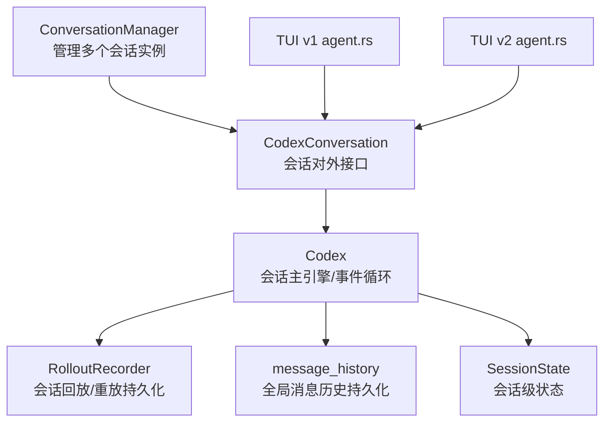
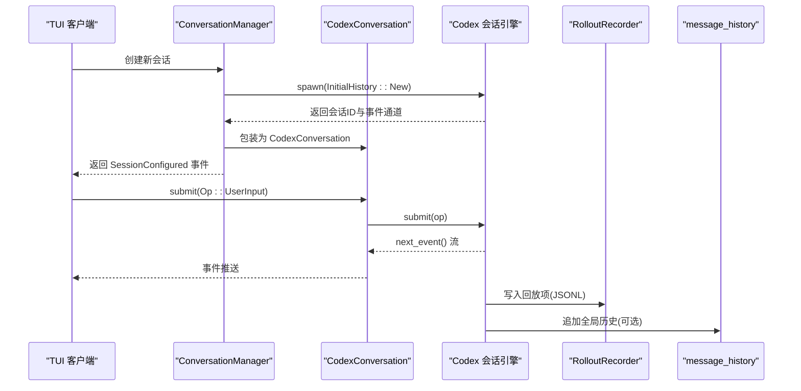
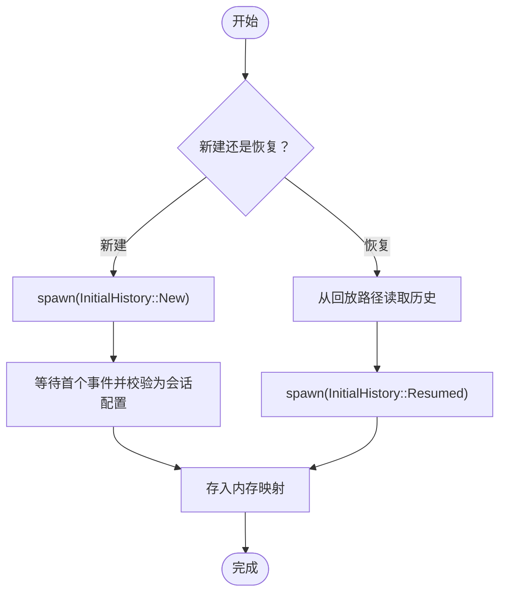
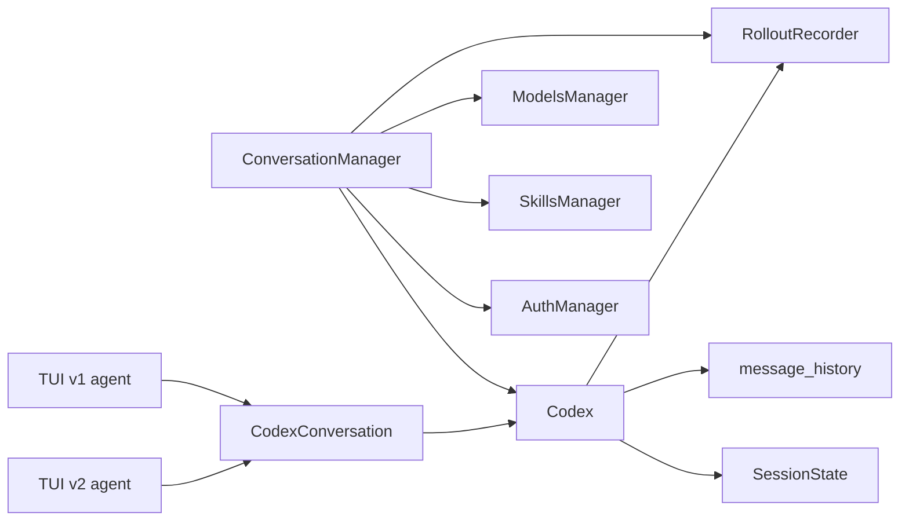

# 会话管理

<cite>
**本文引用的文件**
- [codex_conversation.rs](file://codex-rs/core/src/codex_conversation.rs)
- [conversation_manager.rs](file://codex-rs/core/src/conversation_manager.rs)
- [session.rs](file://codex-rs/core/src/state/session.rs)
- [message_history.rs](file://codex-rs/core/src/message_history.rs)
- [codex.rs](file://codex-rs/core/src/codex.rs)
- [recorder.rs](file://codex-rs/core/src/rollout/recorder.rs)
- [agent.rs（TUI v1）](file://codex-rs/tui/src/chatwidget/agent.rs)
- [agent.rs（TUI v2）](file://codex-rs/tui2/src/chatwidget/agent.rs)
- [client.rs（测试）](file://codex-rs/core/tests/suite/client.rs)
</cite>

## 目录
1. [简介](#简介)
2. [项目结构](#项目结构)
3. [核心组件](#核心组件)
4. [架构总览](#架构总览)
5. [详细组件分析](#详细组件分析)
6. [依赖关系分析](#依赖关系分析)
7. [性能考量](#性能考量)
8. [故障排查指南](#故障排查指南)
9. [结论](#结论)
10. [附录](#附录)

## 简介
本文件系统性阐述 Codex 的会话管理机制，围绕以下目标展开：
- 对话状态维护与会话生命周期管理
- 多轮对话的上下文保持机制
- 会话实例的创建、恢复与终止流程
- 会话数据的持久化策略与内存管理优化
- TUI 与非交互式模式下的差异化处理
- 并发控制、错误恢复与性能瓶颈的解决方案

## 项目结构
围绕会话管理的关键模块分布如下：
- 会话入口与对外接口：CodexConversation、ConversationManager
- 会话内部状态：SessionState（会话级可变状态）
- 历史与持久化：RolloutRecorder（会话回放/重放）、message_history（全局消息历史）
- 会话生命周期与事件循环：Codex（会话主引擎）
- UI 集成：TUI v1/v2 的会话代理（agent.rs）

图表来源
- [conversation_manager.rs](file://codex-rs/core/src/conversation_manager.rs#L1-L264)
- [codex_conversation.rs](file://codex-rs/core/src/codex_conversation.rs#L1-L40)
- [codex.rs](file://codex-rs/core/src/codex.rs#L273-L313)
- [recorder.rs](file://codex-rs/core/src/rollout/recorder.rs#L37-L112)
- [message_history.rs](file://codex-rs/core/src/message_history.rs#L1-L155)
- [session.rs](file://codex-rs/core/src/state/session.rs#L1-L99)
- [agent.rs（TUI v1）](file://codex-rs/tui/src/chatwidget/agent.rs#L25-L90)
- [agent.rs（TUI v2）](file://codex-rs/tui2/src/chatwidget/agent.rs#L25-L90)

章节来源
- [conversation_manager.rs](file://codex-rs/core/src/conversation_manager.rs#L1-L264)
- [codex_conversation.rs](file://codex-rs/core/src/codex_conversation.rs#L1-L40)
- [codex.rs](file://codex-rs/core/src/codex.rs#L273-L313)
- [recorder.rs](file://codex-rs/core/src/rollout/recorder.rs#L37-L112)
- [message_history.rs](file://codex-rs/core/src/message_history.rs#L1-L155)
- [session.rs](file://codex-rs/core/src/state/session.rs#L1-L99)
- [agent.rs（TUI v1）](file://codex-rs/tui/src/chatwidget/agent.rs#L25-L90)
- [agent.rs（TUI v2）](file://codex-rs/tui2/src/chatwidget/agent.rs#L25-L90)

## 核心组件
- 会话对外接口：CodexConversation 提供提交操作与事件流读取，封装底层 Codex 的交互细节。
- 会话管理器：ConversationManager 负责创建、恢复、fork 会话，维护内存中的会话映射，并确保首个事件为会话配置事件。
- 会话状态：SessionState 维护会话级配置、上下文历史、令牌用量与速率限制快照等。
- 回放/重放持久化：RolloutRecorder 将会话响应项写入 JSONL 文件，支持新建、续播与按位置截断 fork。
- 全局消息历史：message_history 提供全局消息历史的追加、元信息查询与基于锁的并发安全写入。
- 会话主引擎：Codex 启动会话、驱动事件循环、处理提交、记录回放与历史、在结束时优雅关闭。

章节来源
- [codex_conversation.rs](file://codex-rs/core/src/codex_conversation.rs#L1-L40)
- [conversation_manager.rs](file://codex-rs/core/src/conversation_manager.rs#L1-L264)
- [session.rs](file://codex-rs/core/src/state/session.rs#L1-L99)
- [recorder.rs](file://codex-rs/core/src/rollout/recorder.rs#L37-L112)
- [message_history.rs](file://codex-rs/core/src/message_history.rs#L1-L155)
- [codex.rs](file://codex-rs/core/src/codex.rs#L273-L313)

## 架构总览
下图展示了从 UI 到会话引擎、再到持久化的端到端调用链路。

图表来源
- [conversation_manager.rs](file://codex-rs/core/src/conversation_manager.rs#L106-L169)
- [codex_conversation.rs](file://codex-rs/core/src/codex_conversation.rs#L23-L38)
- [codex.rs](file://codex-rs/core/src/codex.rs#L273-L313)
- [recorder.rs](file://codex-rs/core/src/rollout/recorder.rs#L349-L369)
- [message_history.rs](file://codex-rs/core/src/message_history.rs#L67-L155)
- [agent.rs（TUI v1）](file://codex-rs/tui/src/chatwidget/agent.rs#L25-L68)
- [agent.rs（TUI v2）](file://codex-rs/tui2/src/chatwidget/agent.rs#L25-L68)

## 详细组件分析

### 会话对外接口：CodexConversation
- 角色定位：封装对底层会话的提交与事件读取，暴露简洁的异步接口。
- 关键能力：
  - submit：包装提交，返回提交 ID
  - submit_with_id：直接提交带 ID 的请求
  - next_event：消费事件流
  - rollout_path：返回当前会话回放路径（用于后续恢复）

章节来源
- [codex_conversation.rs](file://codex-rs/core/src/codex_conversation.rs#L1-L40)

### 会话管理器：ConversationManager
- 角色定位：集中管理多个会话实例，负责生命周期与恢复。
- 关键能力：
  - 新建会话：spawn + finalize_spawn，确保首个事件为会话配置事件
  - 恢复会话：从回放路径加载初始历史，或从 InitialHistory 直接恢复
  - fork 会话：按用户消息位置截断回放，生成新的会话
  - 会话映射：内存中以 RwLock+HashMap 存储会话实例
  - 获取/移除：按会话 ID 查询或移除

图表来源
- [conversation_manager.rs](file://codex-rs/core/src/conversation_manager.rs#L106-L213)

章节来源
- [conversation_manager.rs](file://codex-rs/core/src/conversation_manager.rs#L1-L264)

### 会话状态模型：SessionState
- 角色定位：会话级可变状态容器，承载配置、历史、令牌用量与速率限制。
- 关键能力：
  - 记录响应项到历史
  - 克隆/替换历史
  - 更新令牌用量与上下文窗口
  - 合并速率限制字段（避免缺失字段覆盖）

章节来源
- [session.rs](file://codex-rs/core/src/state/session.rs#L1-L99)

### 回放/重放持久化：RolloutRecorder
- 角色定位：将会话响应项写入 JSONL 文件，支持新建、续播与按位置截断 fork。
- 关键能力：
  - 创建/续播参数：区分 Create 与 Resume
  - 写入线程：独立 writer 任务，首行写入会话元信息
  - 截断 fork：按第 N 个用户消息位置截断，生成新的初始历史

章节来源
- [recorder.rs](file://codex-rs/core/src/rollout/recorder.rs#L37-L112)
- [recorder.rs](file://codex-rs/core/src/rollout/recorder.rs#L349-L369)
- [conversation_manager.rs](file://codex-rs/core/src/conversation_manager.rs#L225-L299)

### 全局消息历史：message_history
- 角色定位：全局 JSONL 历史文件，记录会话文本摘要，支持并发安全追加与裁剪。
- 关键能力：
  - 追加：单行序列化后一次性写入，POSIX 下使用 O_APPEND；Windows 下通过 seek 保证原子性
  - 锁策略：独占锁写入，共享锁读取；失败重试
  - 裁剪策略：超过硬上限时重写尾部至软上限，保留最新条目
  - 权限：Unix 下设置 0600，Windows 下忽略
  - 元信息：统计文件标识与条目数

章节来源
- [message_history.rs](file://codex-rs/core/src/message_history.rs#L1-L155)
- [message_history.rs](file://codex-rs/core/src/message_history.rs#L157-L234)
- [message_history.rs](file://codex-rs/core/src/message_history.rs#L244-L314)
- [message_history.rs](file://codex-rs/core/src/message_history.rs#L315-L382)
- [message_history.rs](file://codex-rs/core/src/message_history.rs#L384-L400)

### 会话主引擎：Codex
- 角色定位：会话生命周期与事件循环的中枢，负责初始化、提交处理、回放记录与优雅关闭。
- 关键能力：
  - 初始化：根据 InitialHistory 决定 RolloutRecorder 参数，启动回放写入器与历史元信息加载
  - 提交处理：提交循环接收 Op 并驱动会话推进
  - 回放记录：将回放项写入 JSONL，必要时刷新
  - 结束流程：优雅关闭回放记录器并发送关闭完成事件

章节来源
- [codex.rs](file://codex-rs/core/src/codex.rs#L273-L313)
- [codex.rs](file://codex-rs/core/src/codex.rs#L561-L819)
- [codex.rs](file://codex-rs/core/src/codex.rs#L1953-L1979)

### UI 集成：TUI 会话代理
- 角色定位：将会话事件推送到 UI，转发用户输入到会话提交。
- 关键行为：
  - 新建会话：创建 NewConversation，立即转发 SessionConfigured 事件
  - 输入提交：将 UI 用户输入转换为 Op 并提交
  - 事件流：持续读取 next_event 并推送 UI

章节来源
- [agent.rs（TUI v1）](file://codex-rs/tui/src/chatwidget/agent.rs#L25-L68)
- [agent.rs（TUI v2）](file://codex-rs/tui2/src/chatwidget/agent.rs#L25-L68)

### 实际代码示例：会话创建、恢复与终止流程
- 创建新会话
  - 步骤：ConversationManager.new_conversation -> Codex::spawn(InitialHistory::New) -> finalize_spawn 等待首个 SessionConfigured 事件 -> 返回 NewConversation
  - 参考路径
    - [conversation_manager.rs](file://codex-rs/core/src/conversation_manager.rs#L106-L169)
    - [codex.rs](file://codex-rs/core/src/codex.rs#L273-L313)
- 恢复会话
  - 步骤：从回放路径读取历史 -> Codex::spawn(InitialHistory::Resumed) -> finalize_spawn
  - 参考路径
    - [conversation_manager.rs](file://codex-rs/core/src/conversation_manager.rs#L182-L213)
    - [client.rs（测试）](file://codex-rs/core/tests/suite/client.rs#L262-L296)
- 终止会话
  - 步骤：会话引擎在结束时优雅关闭回放记录器并发送 ShutdownComplete
  - 参考路径
    - [codex.rs](file://codex-rs/core/src/codex.rs#L1953-L1979)

章节来源
- [conversation_manager.rs](file://codex-rs/core/src/conversation_manager.rs#L106-L213)
- [codex.rs](file://codex-rs/core/src/codex.rs#L273-L313)
- [codex.rs](file://codex-rs/core/src/codex.rs#L1953-L1979)
- [client.rs（测试）](file://codex-rs/core/tests/suite/client.rs#L262-L296)

## 依赖关系分析
- ConversationManager 依赖 Codex、RolloutRecorder、ModelsManager、SkillsManager、AuthManager
- Codex 依赖 RolloutRecorder、message_history、SessionState、事件循环
- TUI 代理依赖 ConversationManager/CodexConversation
- message_history 与 RolloutRecorder 分别承担全局历史与会话回放的持久化职责

图表来源
- [conversation_manager.rs](file://codex-rs/core/src/conversation_manager.rs#L1-L105)
- [codex.rs](file://codex-rs/core/src/codex.rs#L273-L313)
- [message_history.rs](file://codex-rs/core/src/message_history.rs#L1-L155)
- [recorder.rs](file://codex-rs/core/src/rollout/recorder.rs#L37-L112)
- [agent.rs（TUI v1）](file://codex-rs/tui/src/chatwidget/agent.rs#L25-L68)
- [agent.rs（TUI v2）](file://codex-rs/tui2/src/chatwidget/agent.rs#L25-L68)

章节来源
- [conversation_manager.rs](file://codex-rs/core/src/conversation_manager.rs#L1-L105)
- [codex.rs](file://codex-rs/core/src/codex.rs#L273-L313)
- [message_history.rs](file://codex-rs/core/src/message_history.rs#L1-L155)
- [recorder.rs](file://codex-rs/core/src/rollout/recorder.rs#L37-L112)
- [agent.rs（TUI v1）](file://codex-rs/tui/src/chatwidget/agent.rs#L25-L68)
- [agent.rs（TUI v2）](file://codex-rs/tui2/src/chatwidget/agent.rs#L25-L68)

## 性能考量
- 并发写入与锁竞争
  - message_history 使用独占锁与重试策略，避免阻塞时间过长；建议在高并发场景下降低写入频率或合并写入批次
  - RolloutRecorder 采用独立 writer 任务，避免主线程阻塞
- 历史裁剪策略
  - 当超过硬上限时重写尾部至软上限，保留最新条目，减少频繁 IO
- 会话内存管理
  - ConversationManager 使用 Arc<CodexConversation> 与 RwLock 管理会话映射，避免不必要的拷贝
  - fork 会话时仅复制必要的回放片段，降低内存占用
- I/O 优化
  - message_history 单次写入整行，减少系统调用次数
  - RolloutRecorder 首行写入会话元信息，便于快速解析与恢复

章节来源
- [message_history.rs](file://codex-rs/core/src/message_history.rs#L157-L234)
- [recorder.rs](file://codex-rs/core/src/rollout/recorder.rs#L349-L369)
- [conversation_manager.rs](file://codex-rs/core/src/conversation_manager.rs#L1-L105)

## 故障排查指南
- 会话未正确初始化
  - 现象：首个事件不是会话配置事件
  - 排查：检查 ConversationManager.finalize_spawn 中对首个事件的校验逻辑
  - 参考路径
    - [conversation_manager.rs](file://codex-rs/core/src/conversation_manager.rs#L141-L154)
- 历史写入失败
  - 现象：并发写入导致阻塞或锁冲突
  - 排查：确认 message_history 的重试次数与锁策略；检查文件权限与磁盘空间
  - 参考路径
    - [message_history.rs](file://codex-rs/core/src/message_history.rs#L120-L155)
- 回放文件损坏或不完整
  - 现象：恢复时无法解析或历史不完整
  - 排查：检查 RolloutRecorder 的写入顺序与 flush 行为；确认会话结束时是否正确关闭
  - 参考路径
    - [recorder.rs](file://codex-rs/core/src/rollout/recorder.rs#L349-L369)
    - [codex.rs](file://codex-rs/core/src/codex.rs#L1953-L1979)
- UI 无事件更新
  - 现象：TUI 不显示会话事件
  - 排查：确认 agent 是否正确转发 SessionConfigured 事件并持续读取 next_event
  - 参考路径
    - [agent.rs（TUI v1）](file://codex-rs/tui/src/chatwidget/agent.rs#L25-L68)
    - [agent.rs（TUI v2）](file://codex-rs/tui2/src/chatwidget/agent.rs#L25-L68)

章节来源
- [conversation_manager.rs](file://codex-rs/core/src/conversation_manager.rs#L141-L154)
- [message_history.rs](file://codex-rs/core/src/message_history.rs#L120-L155)
- [recorder.rs](file://codex-rs/core/src/rollout/recorder.rs#L349-L369)
- [codex.rs](file://codex-rs/core/src/codex.rs#L1953-L1979)
- [agent.rs（TUI v1）](file://codex-rs/tui/src/chatwidget/agent.rs#L25-L68)
- [agent.rs（TUI v2）](file://codex-rs/tui2/src/chatwidget/agent.rs#L25-L68)

## 结论
Codex 的会话管理通过清晰的分层设计实现了：
- 明确的会话生命周期与事件流
- 上下文与回放的可靠持久化
- 并发安全的历史写入与裁剪策略
- UI 与引擎解耦的接入点

在实际部署中，建议结合业务负载调整历史裁剪阈值、优化 UI 事件推送频率，并在高并发场景下关注锁竞争与 I/O 吞吐。

## 附录
- 会话创建、恢复与终止的参考路径
  - [conversation_manager.rs](file://codex-rs/core/src/conversation_manager.rs#L106-L213)
  - [codex.rs](file://codex-rs/core/src/codex.rs#L273-L313)
  - [codex.rs](file://codex-rs/core/src/codex.rs#L1953-L1979)
  - [client.rs（测试）](file://codex-rs/core/tests/suite/client.rs#L262-L296)
- TUI 集成参考路径
  - [agent.rs（TUI v1）](file://codex-rs/tui/src/chatwidget/agent.rs#L25-L68)
  - [agent.rs（TUI v2）](file://codex-rs/tui2/src/chatwidget/agent.rs#L25-L68)