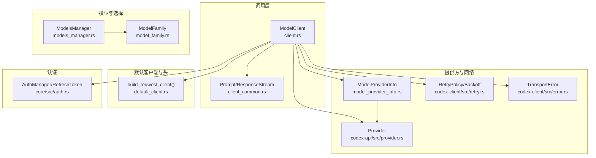
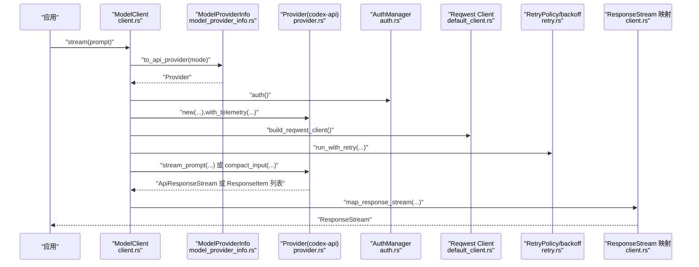
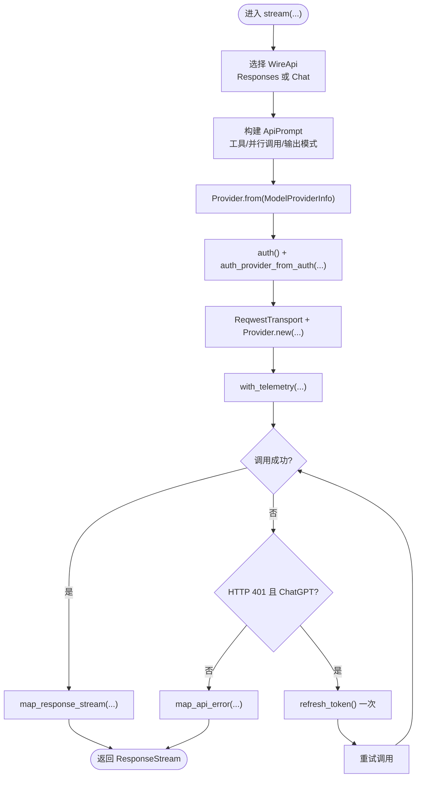
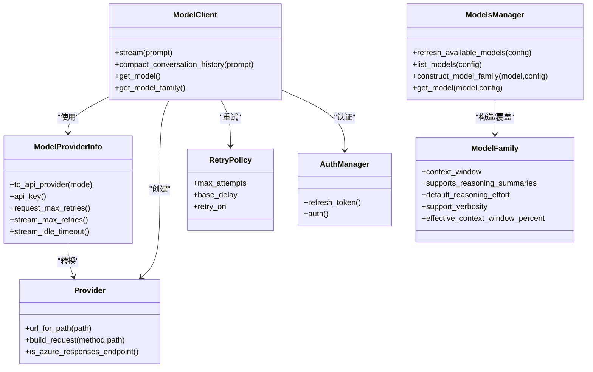

# 模型集成

<cite>
**本文引用的文件**
- [client.rs](file://codex-rs/core/src/client.rs)
- [client_common.rs](file://codex-rs/core/src/client_common.rs)
- [model_provider_info.rs](file://codex-rs/core/src/model_provider_info.rs)
- [provider.rs](file://codex-rs/codex-api/src/provider.rs)
- [default_client.rs](file://codex-rs/core/src/default_client.rs)
- [models_manager.rs](file://codex-rs/core/src/openai_models/models_manager.rs)
- [model_family.rs](file://codex-rs/core/src/openai_models/model_family.rs)
- [retry.rs](file://codex-rs/codex-client/src/retry.rs)
- [error.rs](file://codex-rs/codex-client/src/error.rs)
- [auth.rs](file://codex-rs/core/src/auth.rs)
- [config.md](file://docs/config.md)
</cite>

## 目录
1. [简介](#简介)
2. [项目结构](#项目结构)
3. [核心组件](#核心组件)
4. [架构总览](#架构总览)
5. [详细组件分析](#详细组件分析)
6. [依赖关系分析](#依赖关系分析)
7. [性能考量](#性能考量)
8. [故障排查指南](#故障排查指南)
9. [结论](#结论)
10. [附录](#附录)

## 简介
本文件系统性阐述 Codex 的模型集成机制，重点围绕以下方面：
- 在 client.rs 和 client_common.rs 中的模型调用逻辑：请求构建、认证处理、超时与重试策略、流式事件映射与遥测。
- 在 model_provider_info.rs 中定义的模型提供方元数据结构，以及在 codex-api/src/provider.rs 中的服务提供方抽象。
- 实际配置与调用示例：如何配置不同类型的 AI 模型服务（OpenAI、本地 OSS 提供方等），如何选择模型与提供方。
- 模型选择策略、负载均衡与故障转移方案的现状与建议。
- 与 OpenAI 兼容 API 的集成方式、自定义模型支持与性能监控与调优最佳实践。

## 项目结构
与模型集成直接相关的核心模块分布如下：
- 核心调用层：client.rs、client_common.rs
- 提供方与网络层：model_provider_info.rs、codex-api/src/provider.rs、codex-client/src/retry.rs、codex-client/src/error.rs
- 默认 HTTP 客户端与头信息：default_client.rs
- 模型发现与家族元数据：openai_models/models_manager.rs、openai_models/model_family.rs
- 认证与刷新：core/src/auth.rs
- 配置参考：docs/config.md

图表来源
- [client.rs](file://codex-rs/core/src/client.rs#L110-L283)
- [client_common.rs](file://codex-rs/core/src/client_common.rs#L26-L88)
- [model_provider_info.rs](file://codex-rs/core/src/model_provider_info.rs#L130-L165)
- [provider.rs](file://codex-rs/codex-api/src/provider.rs#L44-L119)
- [default_client.rs](file://codex-rs/core/src/default_client.rs#L136-L152)
- [models_manager.rs](file://codex-rs/core/src/openai_models/models_manager.rs#L1-L120)
- [model_family.rs](file://codex-rs/core/src/openai_models/model_family.rs#L1-L84)
- [retry.rs](file://codex-rs/codex-client/src/retry.rs#L1-L73)
- [error.rs](file://codex-rs/codex-client/src/error.rs#L1-L29)
- [auth.rs](file://codex-rs/core/src/auth.rs#L100-L120)

章节来源
- [client.rs](file://codex-rs/core/src/client.rs#L110-L283)
- [client_common.rs](file://codex-rs/core/src/client_common.rs#L26-L88)
- [model_provider_info.rs](file://codex-rs/core/src/model_provider_info.rs#L130-L165)
- [provider.rs](file://codex-rs/codex-api/src/provider.rs#L44-L119)
- [default_client.rs](file://codex-rs/core/src/default_client.rs#L136-L152)
- [models_manager.rs](file://codex-rs/core/src/openai_models/models_manager.rs#L1-L120)
- [model_family.rs](file://codex-rs/core/src/openai_models/model_family.rs#L1-L84)
- [retry.rs](file://codex-rs/codex-client/src/retry.rs#L1-L73)
- [error.rs](file://codex-rs/codex-client/src/error.rs#L1-L29)
- [auth.rs](file://codex-rs/core/src/auth.rs#L100-L120)

## 核心组件
- ModelClient：统一的模型调用入口，负责根据提供方选择 Responses 或 Chat Completions 接口，封装认证、重试、超时、流式事件映射与遥测。
- Prompt/ResponseStream：标准化的请求载荷与响应流类型，支持工具参数、输出模式与流式事件聚合。
- ModelProviderInfo：提供方元数据与行为配置，包含 wire 协议、重试次数、空闲超时、HTTP 头、查询参数、是否需要 OpenAI 登录等。
- Provider（codex-api）：将 ModelProviderInfo 转换为可执行的 Provider，提供 URL 构造、请求构建、Azure Responses 检测等能力。
- RetryPolicy/backoff：指数退避与抖动，支持 429/5xx/传输错误重试。
- ModelsManager/ModelFamily：模型族元数据与可用模型列表管理，支持远程覆盖与自动平衡模型选择。
- 默认 HTTP 客户端：统一设置 originator、User-Agent、代理策略等。

章节来源
- [client.rs](file://codex-rs/core/src/client.rs#L110-L283)
- [client_common.rs](file://codex-rs/core/src/client_common.rs#L26-L88)
- [model_provider_info.rs](file://codex-rs/core/src/model_provider_info.rs#L130-L213)
- [provider.rs](file://codex-rs/codex-api/src/provider.rs#L44-L119)
- [retry.rs](file://codex-rs/codex-client/src/retry.rs#L1-L73)
- [models_manager.rs](file://codex-rs/core/src/openai_models/models_manager.rs#L1-L120)
- [model_family.rs](file://codex-rs/core/src/openai_models/model_family.rs#L1-L84)
- [default_client.rs](file://codex-rs/core/src/default_client.rs#L136-L152)

## 架构总览
下图展示了从应用到模型提供方的整体调用链路，包括请求构建、认证、重试、流式事件映射与遥测。

图表来源
- [client.rs](file://codex-rs/core/src/client.rs#L136-L283)
- [model_provider_info.rs](file://codex-rs/core/src/model_provider_info.rs#L130-L165)
- [provider.rs](file://codex-rs/codex-api/src/provider.rs#L44-L119)
- [default_client.rs](file://codex-rs/core/src/default_client.rs#L136-L152)
- [retry.rs](file://codex-rs/codex-client/src/retry.rs#L49-L73)
- [auth.rs](file://codex-rs/core/src/auth.rs#L100-L120)

## 详细组件分析

### ModelClient：请求构建、认证、重试与流式映射
- 请求构建
  - 根据 Provider 的 wire_api 决定走 Responses API 还是 Chat Completions。
  - 将 Prompt 转换为 ApiPrompt，注入工具、并行工具调用、输出模式等。
  - 通过 Provider.url_for_path/build_request 组装最终 URL 与头部。
- 认证处理
  - 从 AuthManager 获取当前认证；当返回 401 且为 ChatGPT 模式时，尝试一次令牌刷新后重试。
  - 对于非 ChatGPT 场景，直接映射为未授权错误。
- 超时与重试
  - 使用 codex-client 的 run_with_retry，基于 RetryPolicy 执行指数退避与抖动。
  - 支持对 429、5xx 与传输错误进行重试。
- 流式事件映射与遥测
  - 将底层事件流映射为统一的 ResponseEvent，并在完成时上报 token usage。
  - 通过 ApiTelemetry 上报请求与 SSE 轮询事件，用于性能与可观测性。

图表来源
- [client.rs](file://codex-rs/core/src/client.rs#L136-L283)
- [client_common.rs](file://codex-rs/core/src/client_common.rs#L389-L407)
- [model_provider_info.rs](file://codex-rs/core/src/model_provider_info.rs#L130-L165)
- [retry.rs](file://codex-rs/codex-client/src/retry.rs#L49-L73)

章节来源
- [client.rs](file://codex-rs/core/src/client.rs#L110-L283)
- [client_common.rs](file://codex-rs/core/src/client_common.rs#L389-L407)
- [retry.rs](file://codex-rs/codex-client/src/retry.rs#L1-L73)
- [error.rs](file://codex-rs/codex-client/src/error.rs#L1-L29)
- [auth.rs](file://codex-rs/core/src/auth.rs#L100-L120)

### Prompt/ResponseStream：请求载荷与流式事件
- Prompt
  - 输入上下文、工具集合、并行工具调用开关、基础指令覆盖、输出模式（JSON Schema）。
  - 自动拼接 apply_patch 特殊指令（当模型需要且未显式提供该工具时）。
  - 对特定工具输出进行结构化重写（如 apply_patch 的自由格式输出）。
- ResponseStream
  - 基于 mpsc::channel 的异步流，向上游暴露统一的 ResponseEvent。

章节来源
- [client_common.rs](file://codex-rs/core/src/client_common.rs#L26-L88)
- [client_common.rs](file://codex-rs/core/src/client_common.rs#L90-L181)
- [client_common.rs](file://codex-rs/core/src/client_common.rs#L182-L239)
- [client_common.rs](file://codex-rs/core/src/client_common.rs#L241-L252)

### ModelProviderInfo：提供方元数据与行为
- 关键字段
  - name/base_url/env_key/experimental_bearer_token：提供方标识与凭据来源。
  - wire_api：Responses 或 Chat。
  - query_params/http_headers/env_http_headers：URL 查询参数与 HTTP 头（支持环境变量注入）。
  - request_max_retries/stream_max_retries/stream_idle_timeout_ms：重试次数、流重连次数、空闲超时。
  - requires_openai_auth：是否需要 OpenAI 登录。
- 行为
  - to_api_provider：将 ModelProviderInfo 转换为 Provider，注入重试策略、空闲超时、wire 类型与头部。
  - api_key：从环境变量读取 API Key，支持提示用户配置。
  - 默认值与上限：内置默认重试与空闲超时，限制最大重试次数。

章节来源
- [model_provider_info.rs](file://codex-rs/core/src/model_provider_info.rs#L50-L103)
- [model_provider_info.rs](file://codex-rs/core/src/model_provider_info.rs#L130-L165)
- [model_provider_info.rs](file://codex-rs/core/src/model_provider_info.rs#L193-L213)
- [model_provider_info.rs](file://codex-rs/core/src/model_provider_info.rs#L214-L251)
- [model_provider_info.rs](file://codex-rs/core/src/model_provider_info.rs#L258-L324)

### Provider（codex-api）：提供方抽象与 URL 构建
- WireApi：Responses/Chat/Compact。
- RetryConfig：转换为 RetryPolicy，驱动 codex-client 的重试。
- Provider：封装 base_url/query_params/wire/headers/retry/stream_idle_timeout，并提供 url_for_path/build_request。
- Azure Responses 检测：基于名称或 base_url 标记。

章节来源
- [provider.rs](file://codex-rs/codex-api/src/provider.rs#L9-L16)
- [provider.rs](file://codex-rs/codex-api/src/provider.rs#L17-L42)
- [provider.rs](file://codex-rs/codex-api/src/provider.rs#L44-L93)
- [provider.rs](file://codex-rs/codex-api/src/provider.rs#L94-L119)

### RetryPolicy/backoff：重试策略与退避
- RetryPolicy：max_attempts、base_delay、retry_on（429/5xx/transport）。
- backoff：指数增长并加入 10% 抖动，避免雪崩。
- run_with_retry：循环执行请求，按策略决定是否重试。

章节来源
- [retry.rs](file://codex-rs/codex-client/src/retry.rs#L1-L73)
- [error.rs](file://codex-rs/codex-client/src/error.rs#L1-L29)

### ModelsManager/ModelFamily：模型选择与家族元数据
- ModelsManager
  - 加载/缓存远程模型列表，应用远程覆盖，构建可用模型预设。
  - 自动平衡模型选择：在 ChatGPT 模式且存在 codex-auto-balanced 时优先返回该模型。
- ModelFamily
  - 定义模型家族元数据：上下文窗口、推理摘要支持、并行工具调用、默认推理级别、默认 verbosity、截断策略等。
  - 支持配置与远程覆盖。

章节来源
- [models_manager.rs](file://codex-rs/core/src/openai_models/models_manager.rs#L1-L120)
- [models_manager.rs](file://codex-rs/core/src/openai_models/models_manager.rs#L123-L151)
- [model_family.rs](file://codex-rs/core/src/openai_models/model_family.rs#L1-L84)
- [model_family.rs](file://codex-rs/core/src/openai_models/model_family.rs#L85-L150)

### 认证与令牌刷新
- AuthManager.refresh_token：针对 ChatGPT 模式，向后端发起刷新，区分永久失败（过期/撤销）与瞬时失败（网络/服务器错误）。
- ModelClient.handle_unauthorized：仅在 ChatGPT 模式且未刷新过时尝试一次刷新，随后按错误映射返回。

章节来源
- [auth.rs](file://codex-rs/core/src/auth.rs#L100-L120)
- [client.rs](file://codex-rs/core/src/client.rs#L460-L488)

## 依赖关系分析
- ModelClient 依赖 ModelProviderInfo、Provider（codex-api）、AuthManager、默认 HTTP 客户端、RetryPolicy、ResponseStream 映射与遥测。
- ModelProviderInfo 依赖 codex-api 的 Provider 与 RetryConfig。
- ModelsManager 依赖 ModelFamily 与远程模型接口，用于动态覆盖元数据。
- Provider 提供 URL 构造与 Azure 检测，为 ModelClient 提供统一的网络抽象。

图表来源
- [client.rs](file://codex-rs/core/src/client.rs#L110-L283)
- [model_provider_info.rs](file://codex-rs/core/src/model_provider_info.rs#L130-L165)
- [provider.rs](file://codex-rs/codex-api/src/provider.rs#L44-L119)
- [retry.rs](file://codex-rs/codex-client/src/retry.rs#L1-L73)
- [models_manager.rs](file://codex-rs/core/src/openai_models/models_manager.rs#L1-L120)
- [model_family.rs](file://codex-rs/core/src/openai_models/model_family.rs#L1-L84)
- [auth.rs](file://codex-rs/core/src/auth.rs#L100-L120)

## 性能考量
- 重试与退避
  - 建议根据服务稳定性调整 request_max_retries 与 base_delay，避免过度重试导致资源浪费。
  - 对于高延迟网络，适当提高 stream_idle_timeout_ms，减少误判断开。
- 流式事件映射
  - Responses API 支持聚合与原始事件两种模式，合理选择以平衡可观测性与吞吐。
- 模型选择
  - 在 ChatGPT 模式下优先使用 codex-auto-balanced 可提升体验；否则回退至默认模型。
- 头部与 User-Agent
  - 默认客户端统一设置 originator 与 User-Agent，便于服务端识别来源与版本。

章节来源
- [model_provider_info.rs](file://codex-rs/core/src/model_provider_info.rs#L193-L213)
- [retry.rs](file://codex-rs/codex-client/src/retry.rs#L38-L73)
- [models_manager.rs](file://codex-rs/core/src/openai_models/models_manager.rs#L123-L151)
- [default_client.rs](file://codex-rs/core/src/default_client.rs#L136-L152)

## 故障排查指南
- 401 未授权
  - ChatGPT 模式：尝试一次令牌刷新；若仍失败，检查登录状态与刷新原因（过期/撤销/其他）。
  - 非 ChatGPT 模式：确认 env_key 是否正确设置，或 bearer token 是否有效。
- 重试与超时
  - 若频繁出现 429/5xx，适当增加 request_max_retries 或 base_delay；同时检查服务端配额。
  - 流中断：提高 stream_max_retries 与 stream_idle_timeout_ms。
- Azure Responses 检测
  - Provider.is_azure_responses_endpoint 会基于名称或 base_url 判断，确保 base_url 正确。
- 日志与遥测
  - 通过 ApiTelemetry 记录请求与 SSE 事件，定位延迟与错误。

章节来源
- [client.rs](file://codex-rs/core/src/client.rs#L460-L488)
- [auth.rs](file://codex-rs/core/src/auth.rs#L513-L581)
- [provider.rs](file://codex-rs/codex-api/src/provider.rs#L94-L119)
- [retry.rs](file://codex-rs/codex-client/src/retry.rs#L22-L36)

## 结论
Codex 的模型集成以 ModelClient 为核心，结合 ModelProviderInfo 与 Provider（codex-api）实现对多种提供方与协议的统一抽象。通过 RetryPolicy/backoff、流式事件映射与遥测，系统在易用性与可靠性之间取得平衡。模型选择由 ModelsManager/ModelFamily 驱动，支持远程覆盖与自动平衡。建议在生产环境中合理配置重试与超时参数，关注 Azure Responses 检测与认证刷新策略，以获得稳定高效的模型服务体验。

## 附录

### 配置与调用示例（路径指引）
- 配置提供方与重试参数
  - 参考：docs/config.md 中的 model_providers 与相关节，了解如何添加自定义提供方与调整重试/超时。
  - 示例路径：[docs/config.md](file://docs/config.md#L153-L190)
- 使用 Responses API
  - ModelClient.stream_responses_api：适用于支持 Responses API 的提供方，支持推理摘要、verbosity、输出模式等。
  - 示例路径：[client.rs](file://codex-rs/core/src/client.rs#L190-L283)
- 使用 Chat Completions API
  - ModelClient.stream_chat_completions：适用于 Chat Completions 兼容提供方，不支持 output_schema。
  - 示例路径：[client.rs](file://codex-rs/core/src/client.rs#L136-L187)
- 构建请求与重试
  - Provider.url_for_path/build_request：组装 URL 与请求。
  - RetryPolicy/backoff：指数退避与抖动。
  - 示例路径：
    - [provider.rs](file://codex-rs/codex-api/src/provider.rs#L60-L93)
    - [retry.rs](file://codex-rs/codex-client/src/retry.rs#L38-L73)
- 认证与刷新
  - AuthManager.refresh_token：刷新 ChatGPT 令牌。
  - 示例路径：[auth.rs](file://codex-rs/core/src/auth.rs#L100-L120)
- 模型选择策略
  - ModelsManager.get_model：在 ChatGPT 模式下优先 codex-auto-balanced，否则使用默认模型。
  - 示例路径：[models_manager.rs](file://codex-rs/core/src/openai_models/models_manager.rs#L123-L151)
- 默认 HTTP 客户端
  - build_reqwest_client：统一设置 originator、User-Agent、代理策略。
  - 示例路径：[default_client.rs](file://codex-rs/core/src/default_client.rs#L136-L152)

### 模型选择策略、负载均衡与故障转移
- 当前实现
  - 模型选择：ModelsManager 在 ChatGPT 模式下优先 codex-auto-balanced，否则回退默认模型。
  - 负载均衡：未见内置多提供方轮询或权重分配逻辑。
  - 故障转移：未见内置多提供方自动切换逻辑。
- 建议
  - 多提供方：通过 model_providers 添加多个提供方条目，结合 CLI/配置覆盖选择。
  - 负载均衡：可在应用层维护提供方列表，按策略（随机/轮询/权重）选择。
  - 故障转移：在 ModelClient 层捕获重试耗尽与特定错误，回退到备用提供方。

章节来源
- [models_manager.rs](file://codex-rs/core/src/openai_models/models_manager.rs#L123-L151)
- [model_provider_info.rs](file://codex-rs/core/src/model_provider_info.rs#L264-L324)
- [client.rs](file://codex-rs/core/src/client.rs#L110-L283)

### 与 OpenAI 兼容 API 的集成方式
- Responses API：支持推理摘要、verbosity、输出模式（JSON Schema）等高级特性。
- Chat Completions：兼容 OpenAI Chat 接口，但不支持 output_schema。
- Azure Responses：通过 Provider.is_azure_responses_endpoint 识别，自动启用相应行为。
- 示例路径：
  - [client.rs](file://codex-rs/core/src/client.rs#L136-L283)
  - [provider.rs](file://codex-rs/codex-api/src/provider.rs#L94-L119)

### 自定义模型支持
- 通过 model_providers 添加新提供方，设置 base_url/env_key/wire_api/query_params/http_headers 等。
- 使用 model 覆盖默认模型，确保与提供方一致。
- 示例路径：
  - [docs/config.md](file://docs/config.md#L153-L190)
  - [model_provider_info.rs](file://codex-rs/core/src/model_provider_info.rs#L264-L324)

### 模型性能监控与调优最佳实践
- 遥测：ApiTelemetry 记录请求与 SSE 事件，可用于定位延迟与错误。
- 重试：根据服务稳定性调整 max_attempts 与 base_delay。
- 超时：提高 stream_idle_timeout_ms 以适应长尾延迟。
- 输出模式：在 Responses API 中使用 text 控制 verbosity 与输出模式，平衡精度与速度。
- 示例路径：
  - [client.rs](file://codex-rs/core/src/client.rs#L508-L537)
  - [retry.rs](file://codex-rs/codex-client/src/retry.rs#L22-L36)
  - [client_common.rs](file://codex-rs/core/src/client_common.rs#L241-L252)