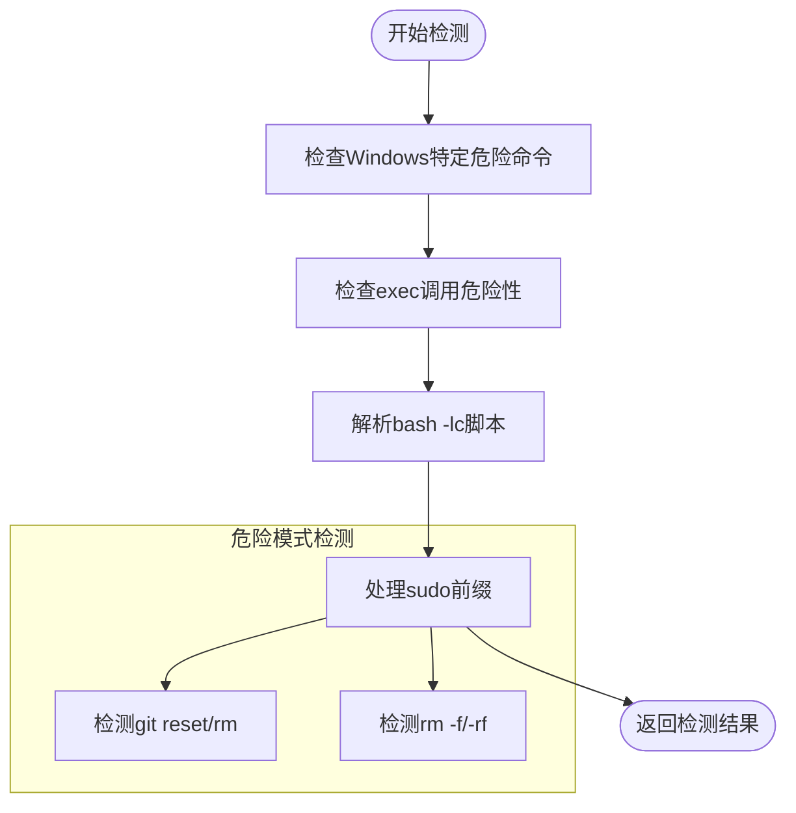
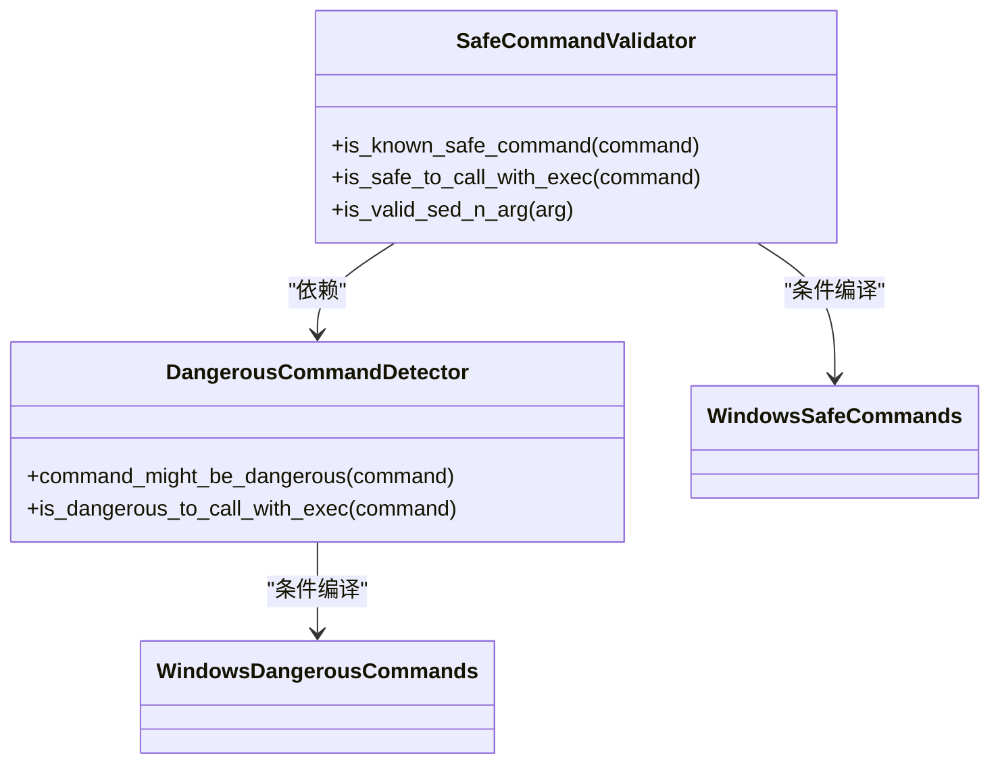
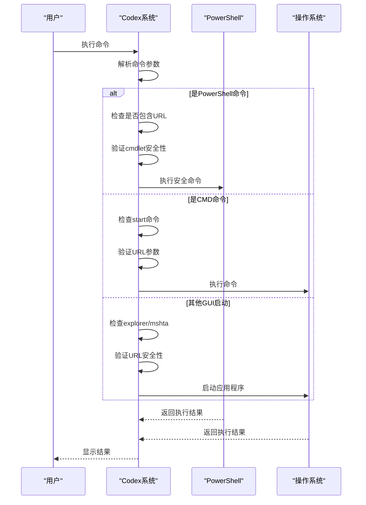
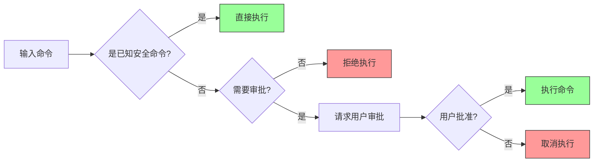
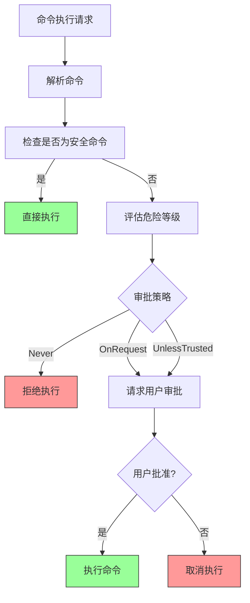
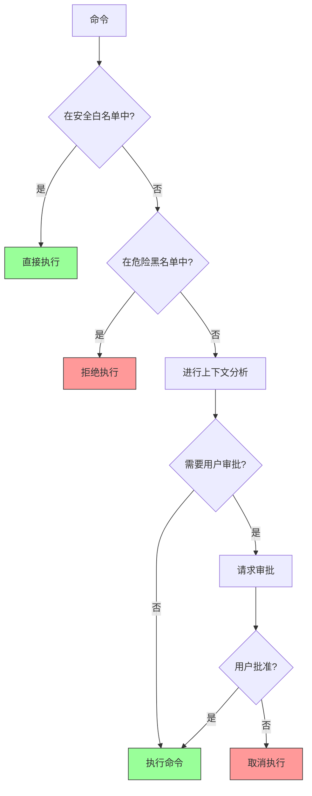

# 命令安全

<cite>
**本文档引用的文件**
- [is_dangerous_command.rs](file://codex-rs/core/src/command_safety/is_dangerous_command.rs)
- [is_safe_command.rs](file://codex-rs/core/src/command_safety/is_safe_command.rs)
- [windows_dangerous_commands.rs](file://codex-rs/core/src/command_safety/windows_dangerous_commands.rs)
- [windows_safe_commands.rs](file://codex-rs/core/src/command_safety/windows_safe_commands.rs)
</cite>

## 目录
1. [命令安全机制概述](#命令安全机制概述)
2. [危险命令检测逻辑](#危险命令检测逻辑)
3. [安全命令验证机制](#安全命令验证机制)
4. [Windows平台安全策略](#windows平台安全策略)
5. [命令安全检查实现示例](#命令安全检查实现示例)
6. [执行引擎集成机制](#执行引擎集成机制)
7. [误报处理与白名单机制](#误报处理与白名单机制)

## 命令安全机制概述

Codex系统通过多层次的安全机制来确保命令执行的安全性。该机制主要由两个核心组件构成：`is_dangerous_command.rs`和`is_safe_command.rs`，它们分别负责检测潜在的危险命令和验证已知的安全命令。系统根据配置的审批策略（AskForApproval）和沙箱策略（SandboxPolicy）来决定是否需要用户审批。

在Windows平台上，系统还定义了特定的安全策略文件`windows_dangerous_commands.rs`和`windows_safe_commands.rs`，以应对Windows特有的安全风险。这些策略文件包含了针对Windows系统命令的详细分类标准，确保在Windows环境下也能提供可靠的安全保护。

**Section sources**
- [is_dangerous_command.rs](file://codex-rs/core/src/command_safety/is_dangerous_command.rs#L1-L154)
- [is_safe_command.rs](file://codex-rs/core/src/command_safety/is_safe_command.rs#L1-L426)

## 危险命令检测逻辑

Codex的危险命令检测机制通过`is_dangerous_command.rs`文件中的`command_might_be_dangerous`函数实现。该函数采用多层检测策略来识别潜在的危险操作。

首先，系统会检查命令是否属于已知的危险模式。例如，对于git命令，系统会特别关注`git reset`和`git rm`这类可能造成数据丢失的操作。对于rm命令，系统会检测是否使用了`-f`或`-rf`等强制删除参数。

**Diagram sources**
- [is_dangerous_command.rs](file://codex-rs/core/src/command_safety/is_dangerous_command.rs#L41-L63)

对于包含`bash -lc`或`zsh -lc`的复合命令，系统会解析其中的脚本内容，并对每个子命令进行危险性检查。这种递归检测机制确保了即使在复杂的脚本环境中也能准确识别危险操作。

此外，系统还实现了对sudo命令的特殊处理。当检测到sudo前缀时，系统会递归检查其后的命令，确保特权提升操作的安全性。

**Section sources**
- [is_dangerous_command.rs](file://codex-rs/core/src/command_safety/is_dangerous_command.rs#L41-L81)

## 安全命令验证机制

与危险命令检测相对应，Codex通过`is_safe_command.rs`文件中的`is_known_safe_command`函数来验证已知的安全命令。该机制采用白名单策略，将一系列明确无害的命令纳入安全范围。

系统首先会将zsh命令标准化为bash，以统一处理不同shell的兼容性问题。然后，通过`is_safe_to_call_with_exec`函数检查命令是否属于安全类别。这些安全命令主要包括：

- 基本文件操作：cat、ls、pwd、cd等
- 文本处理：grep、sed、awk、wc等
- 系统信息：whoami、uname、id等
- 版本控制：git status、git log、git diff等

**Diagram sources**
- [is_safe_command.rs](file://codex-rs/core/src/command_safety/is_safe_command.rs#L4-L39)
- [is_dangerous_command.rs](file://codex-rs/core/src/command_safety/is_dangerous_command.rs#L41-L63)

对于复合命令，如`bash -lc "ls && pwd"`，系统会解析其中的各个子命令，并确保所有子命令都是安全的。系统支持的shell操作符包括`&&`、`||`、`;`和`|`，这些操作符本身不会引入副作用。

特别地，系统对一些可能具有危险性的命令进行了精细化的参数验证。例如，对于base64命令，系统会检查是否使用了`-o`或`--output`等可能写入文件的参数；对于find命令，系统会禁止`-exec`、`-delete`等可能执行任意命令或删除文件的选项。

**Section sources**
- [is_safe_command.rs](file://codex-rs/core/src/command_safety/is_safe_command.rs#L41-L154)

## Windows平台安全策略

Windows平台的安全策略在`windows_dangerous_commands.rs`和`windows_safe_commands.rs`文件中定义，针对Windows特有的安全风险进行了专门的处理。

在危险命令检测方面，系统重点关注以下几种攻击模式：
- PowerShell中的`Start-Process`和`Invoke-Item`命令，特别是当它们与URL参数结合使用时
- CMD中的`start`命令与URL的组合
- 直接通过explorer.exe、mshta.exe或rundll32.exe启动URL
- 浏览器可执行文件（如chrome.exe、msedge.exe）与URL参数的组合

**Diagram sources**
- [windows_dangerous_commands.rs](file://codex-rs/core/src/command_safety/windows_dangerous_commands.rs#L8-L21)
- [windows_safe_commands.rs](file://codex-rs/core/src/command_safety/windows_safe_commands.rs#L12-L20)

在安全命令验证方面，Windows平台采取了更为严格的策略。系统只允许明确的、只读的PowerShell调用，并且必须符合以下条件：
- 必须使用`-Command`或`-c`参数明确指定要执行的脚本
- 禁止使用`-EncodedCommand`、`-File`等可能执行外部脚本的参数
- 禁止使用`-ExecutionPolicy`等可能改变执行策略的参数
- 脚本中不能包含任何可能产生副作用的cmdlet

系统通过调用真实的PowerShell解析器来分析脚本的抽象语法树（AST），确保能够准确识别脚本中的所有命令和参数。这种基于真实解析器的方法比简单的正则表达式匹配更加可靠，能够有效防止绕过检测的攻击。

**Section sources**
- [windows_dangerous_commands.rs](file://codex-rs/core/src/command_safety/windows_dangerous_commands.rs#L8-L217)
- [windows_safe_commands.rs](file://codex-rs/core/src/command_safety/windows_safe_commands.rs#L12-L225)

## 命令安全检查实现示例

以下是命令安全检查的实际应用示例，展示了系统如何处理各种类型的命令：

**Diagram sources**
- [is_dangerous_command.rs](file://codex-rs/core/src/command_safety/is_dangerous_command.rs#L12-L38)
- [is_safe_command.rs](file://codex-rs/core/src/command_safety/is_safe_command.rs#L4-L39)

具体示例包括：
- `git status`：被识别为安全命令，无需审批即可执行
- `git reset --hard`：被识别为危险命令，需要用户审批
- `rm -rf /`：被识别为高危命令，直接拒绝执行
- `bash -lc "git status"`：复合命令中的子命令被识别为安全，整体视为安全
- `bash -lc "rm -rf /"`：复合命令中的子命令被识别为危险，整体视为危险

对于Windows平台的特殊示例：
- `powershell -Command "Start-Process 'https://malicious.com'"`：被识别为危险命令，需要审批
- `cmd /c start https://example.com`：被识别为危险命令，需要审批
- `powershell -Command "Get-ChildItem -Path ."`：被识别为安全命令，直接执行

**Section sources**
- [is_dangerous_command.rs](file://codex-rs/core/src/command_safety/is_dangerous_command.rs#L84-L153)
- [is_safe_command.rs](file://codex-rs/core/src/command_safety/is_safe_command.rs#L198-L425)
- [windows_dangerous_commands.rs](file://codex-rs/core/src/command_safety/windows_dangerous_commands.rs#L256-L316)
- [windows_safe_commands.rs](file://codex-rs/core/src/command_safety/windows_safe_commands.rs#L348-L623)

## 执行引擎集成机制

命令安全机制与执行引擎的集成通过`exec_policy.rs`文件中的`create_exec_approval_requirement_for_command`函数实现。该函数根据命令的安全性评估结果，决定执行策略。

当系统检测到潜在的危险操作时，会根据配置的审批策略采取相应措施：
- `AskForApproval::Never`：从不请求审批，直接拒绝危险命令
- `AskForApproval::OnRequest`：当命令可能危险时请求用户审批
- `AskForApproval::UnlessTrusted`：除非是已知安全命令，否则都需要审批

**Diagram sources**
- [exec_policy.rs](file://codex-rs/core/src/exec_policy.rs#L220-L270)
- [is_dangerous_command.rs](file://codex-rs/core/src/command_safety/is_dangerous_command.rs#L12-L38)

执行引擎还会考虑沙箱权限的要求。如果命令需要提升权限（如网络访问或系统修改），即使命令本身被认为是安全的，也需要用户明确批准。

**Section sources**
- [exec_policy.rs](file://codex-rs/core/src/exec_policy.rs#L220-L270)
- [unified_exec.rs](file://codex-rs/core/src/tools/handlers/unified_exec.rs#L124-L154)

## 误报处理与白名单机制

为了平衡安全性和可用性，Codex系统实现了灵活的误报处理和白名单机制。系统通过`execpolicy`规则系统允许用户自定义命令的安全策略。

白名单机制主要通过以下方式实现：
1. **已知安全命令列表**：系统内置了一系列明确无害的命令，如基本的文件查看和系统信息命令
2. **参数级验证**：对可能具有危险性的命令进行精细化的参数检查，如允许base64命令但禁止其写入文件的选项
3. **复合命令解析**：对`bash -lc`等复合命令进行解析，确保其中的所有子命令都是安全的

对于误报情况，系统提供了以下处理机制：
- **用户审批**：当系统不确定命令的安全性时，会请求用户审批，由用户决定是否执行
- **执行策略规则**：用户可以通过配置execpolicy规则来明确指定某些命令的安全级别
- **安全上下文分析**：系统会考虑命令的执行上下文，如工作目录、环境变量等，以更准确地评估风险

**Diagram sources**
- [is_safe_command.rs](file://codex-rs/core/src/command_safety/is_safe_command.rs#L4-L39)
- [is_dangerous_command.rs](file://codex-rs/core/src/command_safety/is_dangerous_command.rs#L12-L38)
- [exec_policy.rs](file://codex-rs/core/src/exec_policy.rs#L220-L270)

这种多层次的安全机制确保了系统既能有效防止恶意命令的执行，又能避免过度限制合法的开发操作，为用户提供了一个既安全又高效的开发环境。

**Section sources**
- [is_safe_command.rs](file://codex-rs/core/src/command_safety/is_safe_command.rs#L4-L39)
- [is_dangerous_command.rs](file://codex-rs/core/src/command_safety/is_dangerous_command.rs#L12-L38)
- [exec_policy.rs](file://codex-rs/core/src/exec_policy.rs#L177-L207)