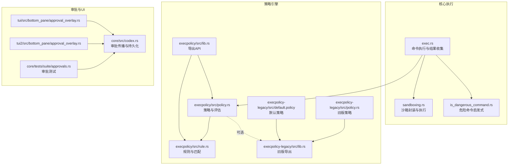
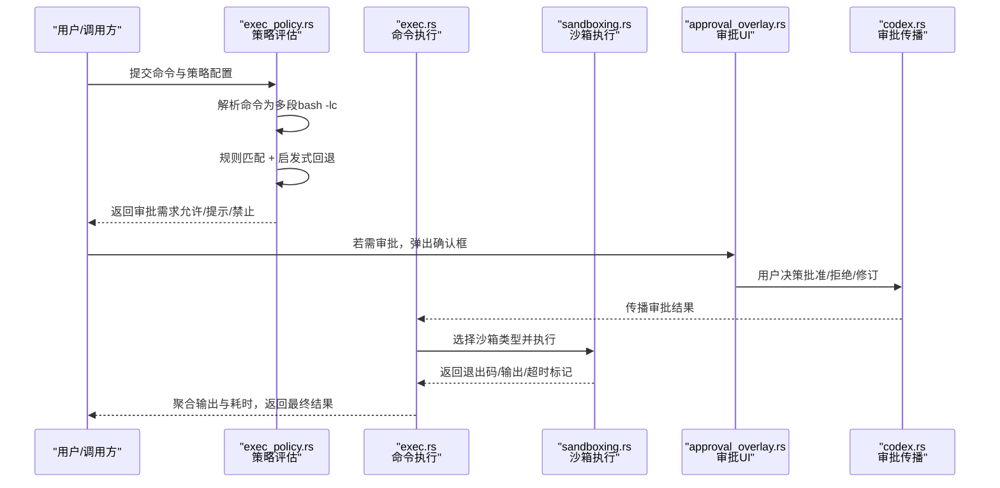
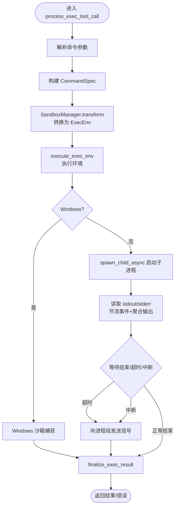
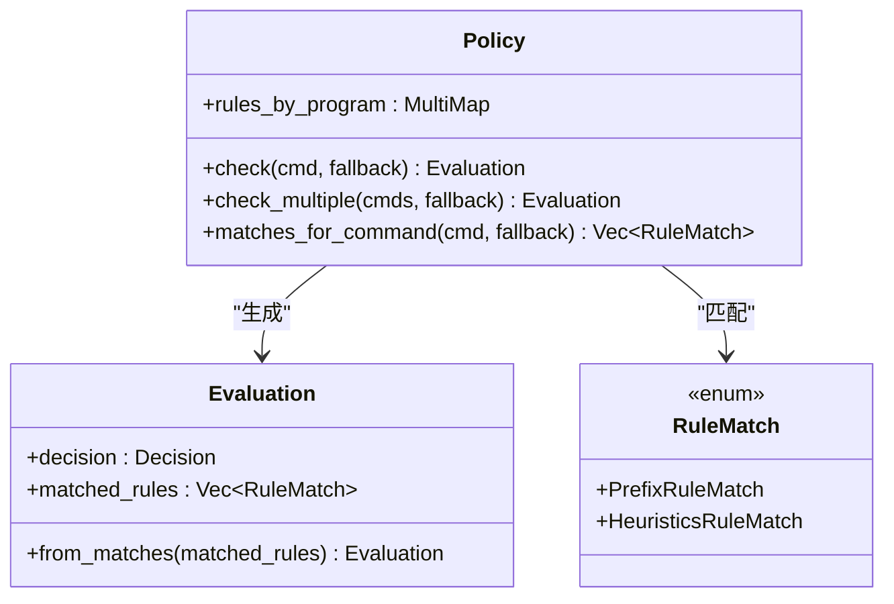
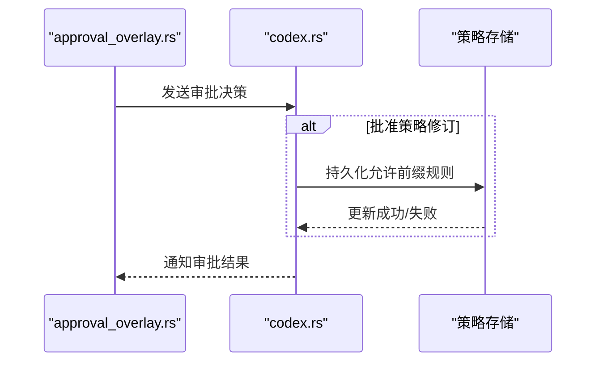
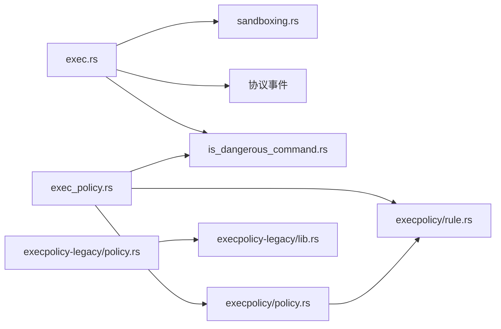

# 执行策略

<cite>
**本文引用的文件**
- [exec.rs](file://codex-rs/core/src/exec.rs)
- [exec_policy.rs](file://codex-rs/core/src/exec_policy.rs)
- [is_dangerous_command.rs](file://codex-rs/core/src/command_safety/is_dangerous_command.rs)
- [policy.rs](file://codex-rs/execpolicy/src/policy.rs)
- [rule.rs](file://codex-rs/execpolicy/src/rule.rs)
- [lib.rs](file://codex-rs/execpolicy/src/lib.rs)
- [policy.rs（旧版）](file://codex-rs/execpolicy-legacy/src/policy.rs)
- [lib.rs（旧版）](file://codex-rs/execpolicy-legacy/src/lib.rs)
- [default.policy（旧版）](file://codex-rs/execpolicy-legacy/src/default.policy)
- [approval_overlay.rs（TUI）](file://codex-rs/tui/src/bottom_pane/approval_overlay.rs)
- [approval_overlay.rs（TUI2）](file://codex-rs/tui2/src/bottom_pane/approval_overlay.rs)
- [codex.rs](file://codex-rs/core/src/codex.rs)
- [approvals.rs（测试）](file://codex-rs/core/tests/suite/approvals.rs)
- [example.codexpolicy](file://codex-rs/execpolicy/examples/example.codexpolicy)
</cite>

## 目录
1. [简介](#简介)
2. [项目结构](#项目结构)
3. [核心组件](#核心组件)
4. [架构总览](#架构总览)
5. [详细组件分析](#详细组件分析)
6. [依赖关系分析](#依赖关系分析)
7. [性能考量](#性能考量)
8. [故障排查指南](#故障排查指南)
9. [结论](#结论)
10. [附录](#附录)

## 简介
本文件围绕 Codex 的“执行策略”展开，系统性梳理命令执行流程与策略决策机制。重点覆盖：
- 命令执行流程：从参数解析、安全检查、沙箱启动到结果收集与超时处理。
- 策略决策机制：execpolicy 模块的规则匹配、权限验证与执行审批流程；与旧版 execpolicy-legacy 的差异与迁移路径。
- 实际应用示例：如何通过策略控制命令运行时行为（超时、资源配额、输出过滤），以及与用户界面的集成（执行确认与审批）。

## 项目结构
围绕执行策略的关键模块分布如下：
- 核心执行与沙箱：core/exec.rs、core/sandboxing.rs（由其调用）
- 策略引擎与规则：execpolicy/src/policy.rs、execpolicy/src/rule.rs、execpolicy/src/lib.rs
- 旧版策略：execpolicy-legacy/src/policy.rs、execpolicy-legacy/src/lib.rs、execpolicy-legacy/src/default.policy
- 安全检查与启发式：core/command_safety/is_dangerous_command.rs
- 审批与UI：tui/tui2 的 approval_overlay.rs，以及 core/codex.rs 中的审批传播逻辑
- 测试与示例：core/tests/suite/approvals.rs、execpolicy/examples/example.codexpolicy

图表来源
- [exec.rs](file://codex-rs/core/src/exec.rs#L1-L200)
- [policy.rs](file://codex-rs/execpolicy/src/policy.rs#L1-L136)
- [rule.rs](file://codex-rs/execpolicy/src/rule.rs#L1-L153)
- [lib.rs](file://codex-rs/execpolicy/src/lib.rs#L1-L21)
- [policy.rs（旧版）](file://codex-rs/execpolicy-legacy/src/policy.rs#L1-L104)
- [lib.rs（旧版）](file://codex-rs/execpolicy-legacy/src/lib.rs#L1-L46)
- [default.policy（旧版）](file://codex-rs/execpolicy-legacy/src/default.policy#L1-L203)
- [approval_overlay.rs（TUI）](file://codex-rs/tui/src/bottom_pane/approval_overlay.rs#L105-L543)
- [approval_overlay.rs（TUI2）](file://codex-rs/tui2/src/bottom_pane/approval_overlay.rs#L105-L543)
- [codex.rs](file://codex-rs/core/src/codex.rs#L1767-L1801)
- [approvals.rs（测试）](file://codex-rs/core/tests/suite/approvals.rs#L1556-L1592)

章节来源
- [exec.rs](file://codex-rs/core/src/exec.rs#L1-L200)
- [exec_policy.rs](file://codex-rs/core/src/exec_policy.rs#L1-L120)
- [policy.rs](file://codex-rs/execpolicy/src/policy.rs#L1-L136)
- [rule.rs](file://codex-rs/execpolicy/src/rule.rs#L1-L153)
- [lib.rs（旧版）](file://codex-rs/execpolicy-legacy/src/lib.rs#L1-L46)

## 核心组件
- 命令执行与结果收集：负责命令参数解析、超时与信号处理、输出截断与聚合、事件流发送等。
- 策略决策：基于 execpolicy 的前缀规则匹配与启发式回退，生成审批需求与可选的策略修订建议。
- 危险命令启发式：在无策略匹配时，依据命令特征判断是否需要审批。
- 沙箱封装：根据策略选择平台沙箱类型，统一执行入口。
- 审批与UI：在需要时弹出确认框，支持用户批准或拒绝，并可持久化策略修订。

章节来源
- [exec.rs](file://codex-rs/core/src/exec.rs#L1-L120)
- [exec_policy.rs](file://codex-rs/core/src/exec_policy.rs#L1-L120)
- [is_dangerous_command.rs](file://codex-rs/core/src/command_safety/is_dangerous_command.rs#L1-L80)

## 架构总览
下图展示了从命令发起到执行完成的端到端流程，包括策略评估、沙箱选择与执行、结果收集与超时处理。

图表来源
- [exec_policy.rs](file://codex-rs/core/src/exec_policy.rs#L220-L271)
- [exec.rs](file://codex-rs/core/src/exec.rs#L130-L183)
- [approval_overlay.rs（TUI）](file://codex-rs/tui/src/bottom_pane/approval_overlay.rs#L105-L543)
- [codex.rs](file://codex-rs/core/src/codex.rs#L1767-L1801)

## 详细组件分析

### 命令执行流程（exec.rs）
- 参数解析与校验
  - 将命令拆分为程序名与参数列表，若为空则报错。
  - 支持自定义工作目录、环境变量、超时/取消令牌、沙箱权限与说明。
- 沙箱类型选择
  - 根据策略与平台选择沙箱类型（macOS Seatbelt、Linux Seccomp、Windows 受限令牌）。
- 统一执行入口
  - 通过沙箱管理器转换为可执行环境，再委托给沙箱执行模块。
- 平台特定执行
  - Windows：使用专用沙箱捕获工具，支持超时与权限提升模式。
  - 非Windows：直接异步启动子进程，重定向标准输入输出。
- 输出与事件流
  - 读取 stdout/stderr，按最大事件数节流发送增量事件，同时聚合完整输出。
  - 使用通道聚合输出，避免阻塞。
- 超时与信号处理
  - 优先等待子进程结束；若超时或收到 Ctrl+C，则尝试向进程组发送信号并终止。
  - 对于 Unix 平台，会尝试向进程组发送信号，确保孤儿子进程被清理。
- 结果收尾与错误分类
  - 将原始退出状态映射为统一的退出码，区分超时与沙箱拒绝。
  - 在可能的沙箱拒绝场景中，通过关键字检测与信号码辅助判断。

图表来源
- [exec.rs](file://codex-rs/core/src/exec.rs#L130-L183)
- [exec.rs](file://codex-rs/core/src/exec.rs#L518-L779)
- [exec.rs](file://codex-rs/core/src/exec.rs#L316-L373)

章节来源
- [exec.rs](file://codex-rs/core/src/exec.rs#L130-L183)
- [exec.rs](file://codex-rs/core/src/exec.rs#L518-L779)
- [exec.rs](file://codex-rs/core/src/exec.rs#L316-L373)

### 策略决策机制（exec_policy.rs + execpolicy 模块）
- 策略加载
  - 仅当特性启用时才加载策略文件；策略文件位于规则目录下，扩展名为 rules。
  - 逐个读取并解析，构建策略对象。
- 规则匹配与评估
  - 将命令解析为多段（如 bash -lc 场景），对每一段进行规则匹配。
  - 若无策略匹配，则回退到启发式判断（结合审批策略、沙箱策略与权限）。
  - 评估决策：禁止、提示、允许；若存在策略提示，原因字符串可反馈给 UI。
- 审批需求与修订建议
  - 当策略要求提示但审批策略设置为 Never 时，判定为禁止。
  - 允许时可选择绕过沙箱（若策略明确允许）。
  - 可生成可应用的策略修订建议（例如将首次未匹配的命令前缀加入 allow 规则），以便未来自动放行。
- 旧版策略兼容
  - 旧版策略采用正则与程序规格定义，支持“应匹配/不应匹配”的验证清单。
  - 新版策略以“前缀规则 + 启发式回退”为主，更易维护与扩展。

图表来源
- [policy.rs](file://codex-rs/execpolicy/src/policy.rs#L1-L136)
- [rule.rs](file://codex-rs/execpolicy/src/rule.rs#L59-L80)

章节来源
- [exec_policy.rs](file://codex-rs/core/src/exec_policy.rs#L83-L124)
- [exec_policy.rs](file://codex-rs/core/src/exec_policy.rs#L126-L218)
- [exec_policy.rs](file://codex-rs/core/src/exec_policy.rs#L220-L271)
- [policy.rs](file://codex-rs/execpolicy/src/policy.rs#L1-L136)
- [rule.rs](file://codex-rs/execpolicy/src/rule.rs#L1-L153)

### 危险命令启发式（is_dangerous_command.rs）
- 已知安全命令直接放行。
- 在不同审批策略与沙箱策略下，决定是否需要审批：
  - Never/OnFailure：通常不提示。
  - OnRequest：在完全放开沙箱时，仅对可疑命令提示；在受限沙箱且请求提升权限时，一律提示。
  - UnlessTrusted：非可信命令均需提示。
- 对 git、rm、sudo 等常见高危命令进行快速识别；支持 bash -lc 场景下的多段命令解析。

章节来源
- [is_dangerous_command.rs](file://codex-rs/core/src/command_safety/is_dangerous_command.rs#L1-L80)
- [is_dangerous_command.rs](file://codex-rs/core/src/command_safety/is_dangerous_command.rs#L83-L154)

### 与用户界面的集成（审批与确认）
- UI 展示
  - TUI/TUI2 的审批覆盖层根据审批变体显示选项，支持执行命令、补丁、MCP 请求等。
- 决策传播
  - 用户批准后，核心逻辑将审批结果传播至会话，必要时持久化策略修订（如允许某前缀）。
- 测试验证
  - 测试场景验证了批准策略修订后，后续同类命令不再提示。

图表来源
- [approval_overlay.rs（TUI）](file://codex-rs/tui/src/bottom_pane/approval_overlay.rs#L105-L543)
- [approval_overlay.rs（TUI2）](file://codex-rs/tui2/src/bottom_pane/approval_overlay.rs#L105-L543)
- [codex.rs](file://codex-rs/core/src/codex.rs#L1767-L1801)
- [approvals.rs（测试）](file://codex-rs/core/tests/suite/approvals.rs#L1556-L1592)

章节来源
- [approval_overlay.rs（TUI）](file://codex-rs/tui/src/bottom_pane/approval_overlay.rs#L105-L543)
- [approval_overlay.rs（TUI2）](file://codex-rs/tui2/src/bottom_pane/approval_overlay.rs#L105-L543)
- [codex.rs](file://codex-rs/core/src/codex.rs#L1767-L1801)
- [approvals.rs（测试）](file://codex-rs/core/tests/suite/approvals.rs#L1556-L1592)

### 与旧版策略的差异与迁移路径
- 规则模型
  - 新版：前缀规则 + 启发式回退，易于维护与扩展。
  - 旧版：基于程序规格与正则表达式，支持“应匹配/不应匹配”的验证清单。
- 默认策略
  - 新版：通过示例文件展示语法与用法。
  - 旧版：包含 ls、cat、cp、head、printenv、rg、sed、which 等常用命令的安全规则。
- 迁移建议
  - 将旧版程序规格转换为新版前缀规则；对“应匹配/不应匹配”清单进行等价映射。
  - 对复杂正则场景，优先以显式前缀规则替代，必要时保留启发式回退。

章节来源
- [policy.rs（旧版）](file://codex-rs/execpolicy-legacy/src/policy.rs#L1-L104)
- [lib.rs（旧版）](file://codex-rs/execpolicy-legacy/src/lib.rs#L1-L46)
- [default.policy（旧版）](file://codex-rs/execpolicy-legacy/src/default.policy#L1-L203)
- [example.codexpolicy](file://codex-rs/execpolicy/examples/example.codexpolicy#L1-L78)

## 依赖关系分析
- 执行链路
  - exec.rs 依赖 sandboxing.rs（沙箱封装）、spawn::spawn_child_async（子进程启动）、协议事件（输出增量）。
  - exec_policy.rs 依赖 execpolicy 库（策略解析与评估）、命令安全模块（启发式）、协议类型（审批需求）。
- 策略引擎
  - policy.rs 依赖 rule.rs（规则与匹配）、serde（序列化）、multimap（按首词索引规则）。
  - rule.rs 定义前缀模式、规则匹配枚举与辅助校验函数。
- 旧版策略
  - policy.rs（旧版）依赖 regex_lite、multimap，提供程序规格与正则匹配。

图表来源
- [exec.rs](file://codex-rs/core/src/exec.rs#L1-L120)
- [exec_policy.rs](file://codex-rs/core/src/exec_policy.rs#L1-L120)
- [policy.rs](file://codex-rs/execpolicy/src/policy.rs#L1-L136)
- [rule.rs](file://codex-rs/execpolicy/src/rule.rs#L1-L153)
- [policy.rs（旧版）](file://codex-rs/execpolicy-legacy/src/policy.rs#L1-L104)
- [lib.rs（旧版）](file://codex-rs/execpolicy-legacy/src/lib.rs#L1-L46)

章节来源
- [exec.rs](file://codex-rs/core/src/exec.rs#L1-L120)
- [exec_policy.rs](file://codex-rs/core/src/exec_policy.rs#L1-L120)
- [policy.rs](file://codex-rs/execpolicy/src/policy.rs#L1-L136)
- [rule.rs](file://codex-rs/execpolicy/src/rule.rs#L1-L153)
- [policy.rs（旧版）](file://codex-rs/execpolicy-legacy/src/policy.rs#L1-L104)
- [lib.rs（旧版）](file://codex-rs/execpolicy-legacy/src/lib.rs#L1-L46)

## 性能考量
- I/O 与事件节流
  - 输出读取采用分块读取与异步任务，限制单位时间内事件数量，避免 UI 卡顿。
- 聚合与内存
  - 使用通道聚合完整输出，避免长时间持有大缓冲区；在超时/中断场景下，对读取任务设置超时并可中止，防止管道泄漏导致的阻塞。
- 沙箱选择
  - 仅在受限策略下启用沙箱，减少不必要的开销；Windows 沙箱捕获工具在受限策略下使用，避免不必要的权限提升。
- 规则匹配
  - 通过首词索引规则，降低匹配成本；在无策略匹配时快速回退到启发式，减少解析与匹配开销。

[本节为通用指导，无需具体文件分析]

## 故障排查指南
- 常见问题
  - 命令为空：参数解析阶段会报错，检查调用方传参。
  - 沙箱拒绝：查看输出中是否包含“operation not permitted”、“permission denied”、“seccomp”、“sandbox”等关键词；Unix 平台可通过信号码辅助判断。
  - 超时：确认超时阈值与命令耗时；必要时调整策略或放宽权限。
  - 审批冲突：当策略要求提示但审批策略为 Never 时会被判定为禁止。
- 排查步骤
  - 查看策略文件是否正确加载（规则目录与扩展名）。
  - 检查策略修订是否已持久化（批准后再次运行应跳过提示）。
  - 在 Windows 上确认沙箱策略与权限提升设置是否符合预期。

章节来源
- [exec.rs](file://codex-rs/core/src/exec.rs#L316-L373)
- [exec_policy.rs](file://codex-rs/core/src/exec_policy.rs#L220-L271)
- [approvals.rs（测试）](file://codex-rs/core/tests/suite/approvals.rs#L1556-L1592)

## 结论
- 执行策略通过“策略规则 + 启发式回退”的组合，在保证安全的前提下提供灵活的审批与绕过能力。
- 新版 execpolicy 以简洁的前缀规则与清晰的评估流程替代旧版复杂的程序规格与正则，便于维护与扩展。
- 与 UI 的紧密集成使得用户可以直观地确认命令、批准策略修订，从而在安全与效率之间取得平衡。

[本节为总结，无需具体文件分析]

## 附录

### 实际代码示例（以路径引用代替代码片段）
- 命令执行与超时控制
  - [命令执行入口与沙箱转换](file://codex-rs/core/src/exec.rs#L130-L183)
  - [平台特定执行与 Windows 沙箱捕获](file://codex-rs/core/src/exec.rs#L218-L314)
  - [输出读取与事件节流](file://codex-rs/core/src/exec.rs#L561-L732)
  - [超时与信号处理](file://codex-rs/core/src/exec.rs#L596-L611)
- 策略决策与审批
  - [策略加载与文件收集](file://codex-rs/core/src/exec_policy.rs#L83-L124)
  - [规则匹配与启发式回退](file://codex-rs/core/src/exec_policy.rs#L220-L271)
  - [审批需求与修订建议生成](file://codex-rs/core/src/exec_policy.rs#L157-L209)
- 旧版策略参考
  - [旧版策略结构与验证清单](file://codex-rs/execpolicy-legacy/src/policy.rs#L1-L104)
  - [默认策略示例](file://codex-rs/execpolicy-legacy/src/default.policy#L1-L203)
- UI 集成
  - [审批覆盖层选项与命令展示](file://codex-rs/tui/src/bottom_pane/approval_overlay.rs#L105-L543)
  - [审批传播与持久化](file://codex-rs/core/src/codex.rs#L1767-L1801)
- 示例策略
  - [策略语法示例](file://codex-rs/execpolicy/examples/example.codexpolicy#L1-L78)