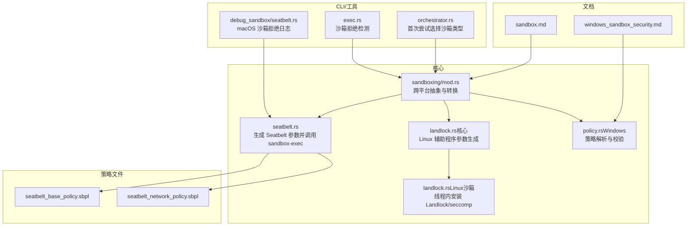
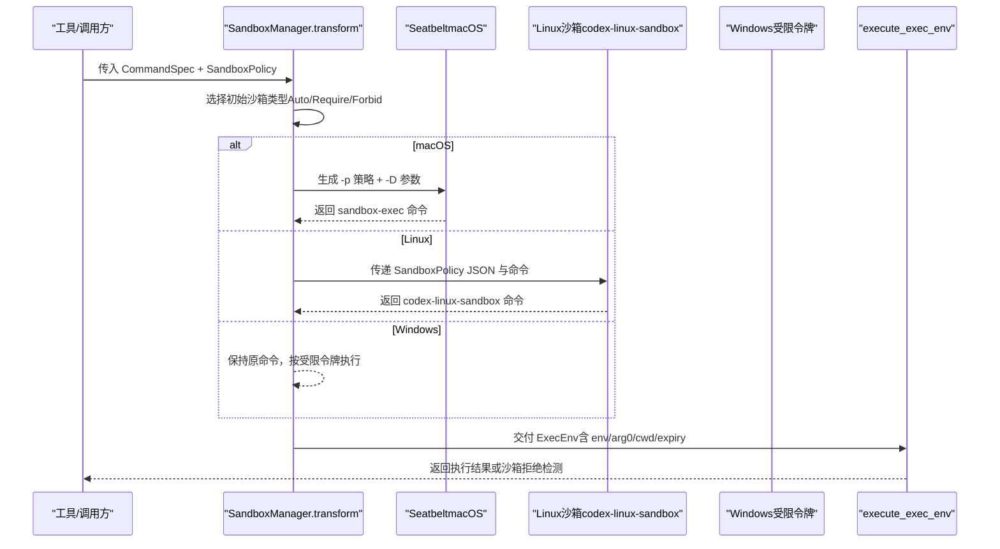
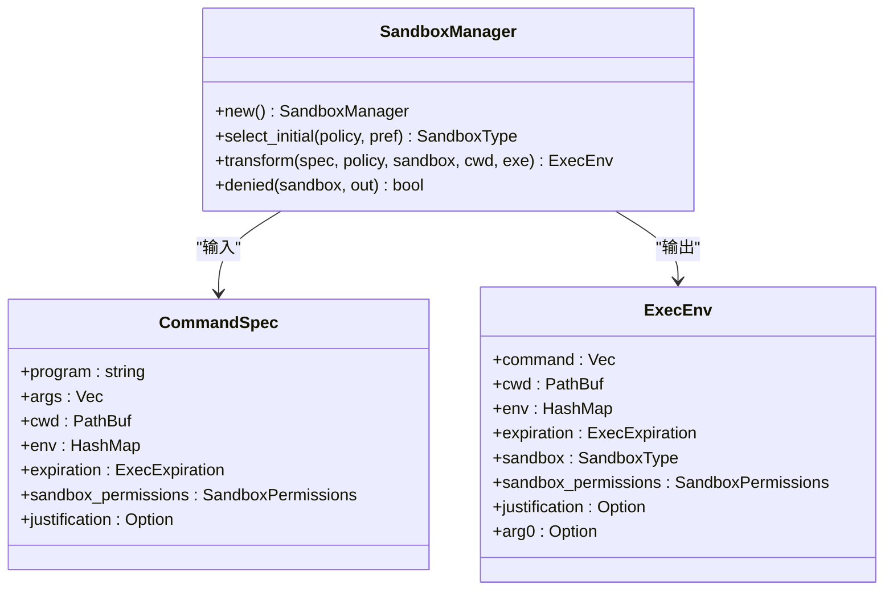
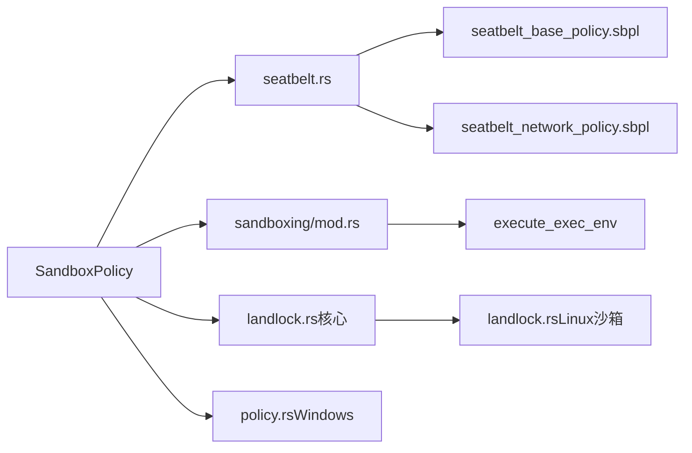

# 沙箱机制

<cite>
**本文引用的文件**
- [seatbelt.rs](file://codex-rs/core/src/seatbelt.rs)
- [sandboxing/mod.rs](file://codex-rs/core/src/sandboxing/mod.rs)
- [seatbelt_base_policy.sbpl](file://codex-rs/core/src/seatbelt_base_policy.sbpl)
- [seatbelt_network_policy.sbpl](file://codex-rs/core/src/seatbelt_network_policy.sbpl)
- [landlock.rs（核心）](file://codex-rs/core/src/landlock.rs)
- [landlock.rs（Linux沙箱）](file://codex-rs/linux-sandbox/src/landlock.rs)
- [policy.rs（Windows）](file://codex-rs/windows-sandbox-rs/src/policy.rs)
- [sandbox.md](file://docs/sandbox.md)
- [windows_sandbox_security.md](file://docs/windows_sandbox_security.md)
- [debug_sandbox/seatbelt.rs](file://codex-rs/cli/src/debug_sandbox/seatbelt.rs)
- [exec.rs（错误检测）](file://codex-rs/core/src/exec.rs)
- [orchestrator.rs](file://codex-rs/core/src/tools/orchestrator.rs)
</cite>

## 目录
1. [简介](#简介)
2. [项目结构](#项目结构)
3. [核心组件](#核心组件)
4. [架构总览](#架构总览)
5. [详细组件分析](#详细组件分析)
6. [依赖关系分析](#依赖关系分析)
7. [性能与安全性权衡](#性能与安全性权衡)
8. [故障排查指南](#故障排查指南)
9. [结论](#结论)
10. [附录](#附录)

## 简介
本文件系统性阐述 Codex 的跨平台沙箱机制，重点覆盖：
- 基于 Apple Seatbelt 的 macOS 沙箱策略与实现；
- 跨平台抽象层的设计思路与实现；
- seatbelt 基础策略与网络策略文件的结构与规则；
- 实际案例：文件读写范围、网络连接限制、系统调用过滤；
- 性能开销与安全性的平衡策略。

## 项目结构
围绕沙箱的核心代码分布在以下模块：
- macOS 沙箱：seatbelt.rs 负责将 SandboxPolicy 转换为 Seatbelt 策略参数并通过 sandbox-exec 执行命令；seatbelt_base_policy.sbpl 与 seatbelt_network_policy.sbpl 提供策略文本。
- 跨平台抽象：sandboxing/mod.rs 定义 CommandSpec/ExecEnv，统一不同平台的沙箱转换逻辑。
- Linux 沙箱：landlock.rs（核心）与 linux-sandbox/src/landlock.rs 分别负责通过 codex-linux-sandbox 辅助程序应用 Landlock+seccomp 规则。
- Windows 沙箱：windows-sandbox-rs 提供受限令牌与能力 SID 策略，配合策略解析与安全限制说明。
- 文档：sandbox.md 与 windows_sandbox_security.md 提供平台差异与已知限制说明。



图表来源
- [seatbelt.rs](file://codex-rs/core/src/seatbelt.rs#L1-L135)
- [sandboxing/mod.rs](file://codex-rs/core/src/sandboxing/mod.rs#L1-L179)
- [landlock.rs（核心）](file://codex-rs/core/src/landlock.rs#L1-L73)
- [landlock.rs（Linux沙箱）](file://codex-rs/linux-sandbox/src/landlock.rs#L1-L146)
- [policy.rs（Windows）](file://codex-rs/windows-sandbox-rs/src/policy.rs#L1-L18)
- [seatbelt_base_policy.sbpl](file://codex-rs/core/src/seatbelt_base_policy.sbpl#L1-L108)
- [seatbelt_network_policy.sbpl](file://codex-rs/core/src/seatbelt_network_policy.sbpl#L1-L31)
- [debug_sandbox/seatbelt.rs](file://codex-rs/cli/src/debug_sandbox/seatbelt.rs#L1-L114)
- [exec.rs（错误检测）](file://codex-rs/core/src/exec.rs#L825-L851)
- [orchestrator.rs](file://codex-rs/core/src/tools/orchestrator.rs#L73-L103)
- [sandbox.md](file://docs/sandbox.md#L57-L81)
- [windows_sandbox_security.md](file://docs/windows_sandbox_security.md#L1-L23)

章节来源
- [sandboxing/mod.rs](file://codex-rs/core/src/sandboxing/mod.rs#L1-L179)
- [sandbox.md](file://docs/sandbox.md#L57-L81)

## 核心组件
- Seatbelt 沙箱（macOS）
  - 将 SandboxPolicy 转换为 -p 策略字符串与 -D 参数列表，拼接至 sandbox-exec 命令行。
  - 文件读写策略：根据是否允许全盘读写、是否允许全盘写入、可写根目录及其只读子路径生成 require-all/require-not 组合。
  - 网络策略：当允许网络时注入网络策略段落。
- 跨平台抽象层（sandboxing/mod.rs）
  - CommandSpec/ExecEnv 描述待执行命令与沙箱上下文。
  - transform 将平台偏好与策略转换为最终可执行命令（含环境变量、arg0 覆盖等）。
  - 在 macOS 上使用 Seatbelt，在 Linux 上调用 codex-linux-sandbox，在 Windows 上按受限令牌策略执行。
- Linux 沙箱（Landlock+seccomp）
  - 通过 codex-linux-sandbox 将 SandboxPolicy 序列化为 JSON 并作为参数传入。
  - 线程内安装 Landlock 规则限制写入范围，同时安装 seccomp 过滤器限制网络相关系统调用。
- Windows 沙箱
  - 使用受限令牌与能力 SID，仅授予工作区根目录写权限，禁用常见网络工具并拦截 PATH。
  - 已知限制：某些路径变体与外部进程启动仍存在绕过风险。

章节来源
- [seatbelt.rs](file://codex-rs/core/src/seatbelt.rs#L23-L135)
- [sandboxing/mod.rs](file://codex-rs/core/src/sandboxing/mod.rs#L29-L171)
- [landlock.rs（核心）](file://codex-rs/core/src/landlock.rs#L1-L73)
- [landlock.rs（Linux沙箱）](file://codex-rs/linux-sandbox/src/landlock.rs#L1-L146)
- [policy.rs（Windows）](file://codex-rs/windows-sandbox-rs/src/policy.rs#L1-L18)

## 架构总览
下图展示了从策略到执行的端到端流程，涵盖 macOS、Linux、Windows 三类实现路径。



图表来源
- [sandboxing/mod.rs](file://codex-rs/core/src/sandboxing/mod.rs#L75-L171)
- [seatbelt.rs](file://codex-rs/core/src/seatbelt.rs#L23-L135)
- [landlock.rs（核心）](file://codex-rs/core/src/landlock.rs#L1-L73)
- [landlock.rs（Linux沙箱）](file://codex-rs/linux-sandbox/src/landlock.rs#L1-L146)

## 详细组件分析

### macOS Seatbelt 沙箱策略与实现
- 策略生成
  - 基础策略：默认拒绝，允许进程派生、信号、部分用户偏好与系统信息查询。
  - 文件读写：默认关闭；若允许全盘写入，则使用更宽松的通配规则；否则根据可写根目录与只读子路径生成 require-all/require-not 组合，确保如 .git 等敏感目录不被覆盖。
  - 文件读取：当允许全盘读取时注入 file-read* 允许段。
  - 网络：当允许网络时注入网络出站/入站与系统套接字允许段，并开放必要的 Mach Lookup 与 sysctl 读取。
  - 参数拼装：将策略文本与 -D 参数（如 WRITABLE_ROOT_*、DARWIN_USER_CACHE_DIR）拼接到 sandbox-exec 命令行。
- 可信执行路径
  - 固定使用 /usr/bin/sandbox-exec，避免 PATH 注入风险。
  - 通过环境变量标记当前沙箱类型，便于上层识别。
- 测试验证
  - 单元测试覆盖了包含 .git 的根目录、默认 CWD 与 TMPDIR 的组合场景，确保只读子路径正确排除。

```mermaid
flowchart TD
Start(["开始：接收 SandboxPolicy"]) --> CheckFullWrite{"是否允许全盘写入？"}
CheckFullWrite --> |是| FullWrite["生成 '(allow file-write* (regex \"^/\"))'"]
CheckFullWrite --> |否| Roots["计算可写根目录与只读子路径"]
Roots --> GenPolicy["为每个根生成 subpath 条件<br/>为只读子路径生成 require-not"]
GenPolicy --> Merge["合并为 '(allow file-write* ...)'"]
CheckFullWrite --> ReadCheck{"是否允许全盘读取？"}
ReadCheck --> |是| AddRead["添加 '(allow file-read*)'"]
ReadCheck --> |否| SkipRead["跳过读取允许段"]
Merge --> NetCheck{"是否允许网络？"}
NetCheck --> |是| AddNet["附加网络策略段"]
NetCheck --> |否| SkipNet["跳过网络策略段"]
AddRead --> Final["拼接基础策略 + 读写 + 网络"]
AddNet --> Final
SkipNet --> Final
SkipRead --> Final
FullWrite --> Final
Final --> Args["生成 '-p 策略' 与 '-D 参数' 列表"]
Args --> End(["结束：返回 sandbox-exec 命令行"])
```

图表来源
- [seatbelt.rs](file://codex-rs/core/src/seatbelt.rs#L46-L135)
- [seatbelt_base_policy.sbpl](file://codex-rs/core/src/seatbelt_base_policy.sbpl#L1-L108)
- [seatbelt_network_policy.sbpl](file://codex-rs/core/src/seatbelt_network_policy.sbpl#L1-L31)

章节来源
- [seatbelt.rs](file://codex-rs/core/src/seatbelt.rs#L23-L135)
- [seatbelt_base_policy.sbpl](file://codex-rs/core/src/seatbelt_base_policy.sbpl#L1-L108)
- [seatbelt_network_policy.sbpl](file://codex-rs/core/src/seatbelt_network_policy.sbpl#L1-L31)

### 跨平台抽象层设计
- 抽象目标
  - 对外暴露一致的 CommandSpec/ExecEnv，屏蔽平台差异。
  - 在 transform 阶段完成策略到平台特定命令的映射与参数拼装。
- 关键点
  - 选择初始沙箱类型：Auto/Require/Forbid，结合策略与平台能力。
  - macOS：注入 CODEX_SANDBOX 环境变量，调用 sandbox-exec。
  - Linux：调用 codex-linux-sandbox，将 SandboxPolicy 以 JSON 形式传入。
  - Windows：在受限令牌下执行，不改变命令，但通过 ACL 与能力 SID 控制权限。
  - 网络禁用：当策略不允许网络时，注入禁用网络的环境变量，便于上层工具感知。



图表来源
- [sandboxing/mod.rs](file://codex-rs/core/src/sandboxing/mod.rs#L29-L171)

章节来源
- [sandboxing/mod.rs](file://codex-rs/core/src/sandboxing/mod.rs#L1-L179)

### Linux 沙箱（Landlock+seccomp）
- 策略转换
  - 将 SandboxPolicy 序列化为 JSON，作为 codex-linux-sandbox 的参数传入。
- 线程内应用
  - Landlock：对整个文件系统设置只读，仅允许写入 /dev/null 与指定可写根目录；设置 no_new_privs。
  - seccomp：阻断网络相关系统调用（connect/bind/listen/socket 等），仅允许 AF_UNIX 套接字；对 ptrace 等高危调用也进行限制。
- 适用性
  - 需要内核支持 Landlock 与 seccomp；容器环境下需确保宿主机/容器配置暴露相应能力。

章节来源
- [landlock.rs（核心）](file://codex-rs/core/src/landlock.rs#L1-L73)
- [landlock.rs（Linux沙箱）](file://codex-rs/linux-sandbox/src/landlock.rs#L1-L146)

### Windows 沙箱策略与限制
- 策略解析
  - 支持 read-only 与 workspace-write 两种模式；DangerFullAccess 不用于沙箱。
- 实现要点
  - 通过受限令牌与能力 SID 授予最小权限，仅允许工作区根目录写入（以及必要临时目录）。
  - 禁用常见网络工具并注入 stub 可执行文件，拦截 PATH 中的危险命令。
- 已知限制
  - 某些路径大小写变体与外部进程启动仍可能绕过；ADS 写入、PATH 替换等场景尚未完全封堵。

章节来源
- [policy.rs（Windows）](file://codex-rs/windows-sandbox-rs/src/policy.rs#L1-L18)
- [windows_sandbox_security.md](file://docs/windows_sandbox_security.md#L1-L23)

### 实际案例：沙箱如何限制副作用
- 文件读写范围
  - 场景：在 read-only 或 workspace-write 模式下，对非可写根目录的写操作会被拒绝，输出中会包含“权限被拒绝”“操作未被允许”“只读文件系统”等提示。
  - 验证：单元测试断言这些关键词出现且退出码非零，同时保留原始工具输出而非沙箱兜底消息。
- 网络连接限制
  - 场景：在禁用网络的策略下，任何网络系统调用（如 connect/bind）将被 seccomp 拒绝；macOS 下网络策略段落也会限制出站/入站。
  - 验证：Linux 下 SIGSYS 退出码与 macOS 下沙箱拒绝日志可用于识别。
- 系统调用过滤
  - 场景：Linux 上对高危系统调用（ptrace、socket 非 AF_UNIX 等）进行过滤；macOS 上对进程派生、信号、部分 Mach Lookup 进行细粒度控制。
  - 验证：CLI 提供 macOS 沙箱拒绝日志收集器，可捕获 deny 事件并定位具体能力名。

章节来源
- [exec.rs（错误检测）](file://codex-rs/core/src/exec.rs#L825-L851)
- [debug_sandbox/seatbelt.rs](file://codex-rs/cli/src/debug_sandbox/seatbelt.rs#L1-L114)
- [sandbox.md](file://docs/sandbox.md#L57-L81)

## 依赖关系分析
- 组件耦合
  - seatbelt.rs 依赖 seatbelt_base_policy.sbpl 与 seatbelt_network_policy.sbpl 的策略文本。
  - sandboxing/mod.rs 依赖平台能力探测（get_platform_sandbox）、spawn 子进程接口与策略模型。
  - Linux 侧通过 landlock.rs（核心）与 linux-sandbox/src/landlock.rs 解耦策略与内核 API。
  - Windows 侧通过 policy.rs 解析策略并在受限令牌下执行。
- 外部依赖
  - macOS：sandbox-exec（固定路径）、日志系统（用于拒绝事件采集）。
  - Linux：内核 Landlock 与 seccomp 支持。
  - Windows：受限令牌、能力 SID、ACL 与 PATH 注入。



图表来源
- [seatbelt.rs](file://codex-rs/core/src/seatbelt.rs#L1-L135)
- [sandboxing/mod.rs](file://codex-rs/core/src/sandboxing/mod.rs#L1-L179)
- [landlock.rs（核心）](file://codex-rs/core/src/landlock.rs#L1-L73)
- [landlock.rs（Linux沙箱）](file://codex-rs/linux-sandbox/src/landlock.rs#L1-L146)
- [policy.rs（Windows）](file://codex-rs/windows-sandbox-rs/src/policy.rs#L1-L18)

章节来源
- [sandboxing/mod.rs](file://codex-rs/core/src/sandboxing/mod.rs#L1-L179)

## 性能与安全性权衡
- 性能开销
  - macOS：sandbox-exec 启动成本较低，主要开销来自策略解析与参数拼装；日志采集仅在调试模式启用。
  - Linux：Landlock 与 seccomp 在内核态生效，通常开销可控；容器环境需确保内核特性可用。
  - Windows：受限令牌与 ACL 检查带来一定开销，但远小于完整虚拟化方案。
- 安全性
  - macOS：通过固定路径 sandbox-exec 与严格的策略段落，有效限制文件系统与网络访问。
  - Linux：Landlock 限制写入范围，seccomp 阻断高危系统调用；仍需关注内核版本与容器配置。
  - Windows：受限令牌与能力 SID 提供强隔离，但存在已知绕过点（如 PATH 替换、外部进程启动），需持续改进。
- 平台差异
  - 文档明确指出 Linux 在容器环境中可能无法启用沙箱，建议在容器内以危险模式运行或自行提供隔离。
  - Windows 沙箱仍处于实验阶段，建议关注 smoketests 的进展。

章节来源
- [sandbox.md](file://docs/sandbox.md#L57-L81)
- [windows_sandbox_security.md](file://docs/windows_sandbox_security.md#L1-L23)

## 故障排查指南
- 如何判断是否被沙箱拒绝
  - Linux：关注 SIGSYS 退出码与“Read-only file system”等输出。
  - macOS：使用 CLI 的沙箱拒绝日志收集器，解析 sandbox 日志中的 deny 事件，定位具体能力名。
  - Windows：检查网络工具是否被 stub 替换、PATH 是否被前置，以及 ACL 是否阻止写入。
- 常见问题
  - Linux 容器内沙箱失效：确认内核支持 Landlock/seccomp，或在容器内以危险模式运行。
  - Windows 绕过风险：关注 smoketests 中的已知失败项，逐步修复。
- 诊断步骤
  - 启用沙箱拒绝日志（macOS）或在 Linux/Windows 下复现并记录输出。
  - 检查 SandboxPolicy 是否与预期一致（读写根目录、网络开关）。
  - 在 CI/本地环境分别验证，确保行为一致。

章节来源
- [exec.rs（错误检测）](file://codex-rs/core/src/exec.rs#L825-L851)
- [debug_sandbox/seatbelt.rs](file://codex-rs/cli/src/debug_sandbox/seatbelt.rs#L1-L114)
- [sandbox.md](file://docs/sandbox.md#L57-L81)
- [windows_sandbox_security.md](file://docs/windows_sandbox_security.md#L1-L23)

## 结论
Codex 的沙箱机制通过跨平台抽象层实现了统一的策略到执行的映射，结合各平台的原生能力（Seatbelt、Landlock/seccomp、受限令牌）提供了可验证的副作用限制。尽管 Linux 与 Windows 在容器与已知绕过方面存在挑战，但通过策略细化与持续改进，整体安全边界显著提升。建议在生产环境中优先采用 read-only/workspace-write 模式，并在 CI 等受控环境中启用 full-auto 以减少交互成本。

## 附录
- 相关文档
  - [sandbox.md](file://docs/sandbox.md#L1-L97)
  - [windows_sandbox_security.md](file://docs/windows_sandbox_security.md#L1-L23)
- 关键实现参考
  - [seatbelt.rs](file://codex-rs/core/src/seatbelt.rs#L23-L135)
  - [sandboxing/mod.rs](file://codex-rs/core/src/sandboxing/mod.rs#L75-L171)
  - [landlock.rs（核心）](file://codex-rs/core/src/landlock.rs#L1-L73)
  - [landlock.rs（Linux沙箱）](file://codex-rs/linux-sandbox/src/landlock.rs#L1-L146)
  - [policy.rs（Windows）](file://codex-rs/windows-sandbox-rs/src/policy.rs#L1-L18)
  - [debug_sandbox/seatbelt.rs](file://codex-rs/cli/src/debug_sandbox/seatbelt.rs#L1-L114)
  - [exec.rs（错误检测）](file://codex-rs/core/src/exec.rs#L825-L851)
  - [orchestrator.rs](file://codex-rs/core/src/tools/orchestrator.rs#L73-L103)