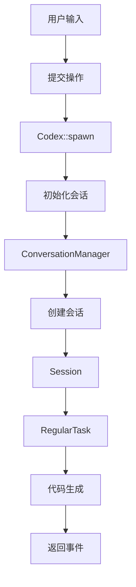
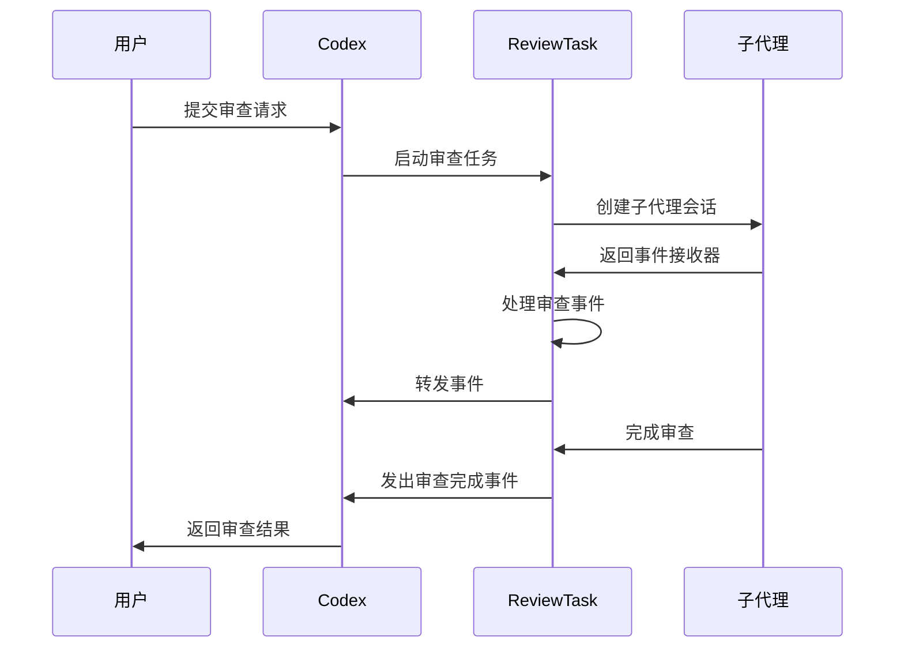
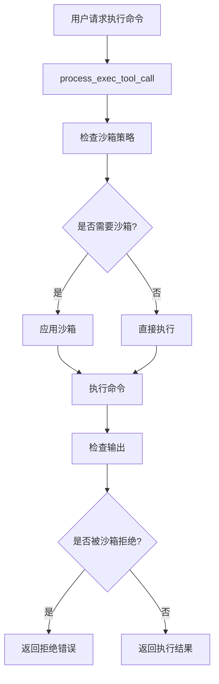
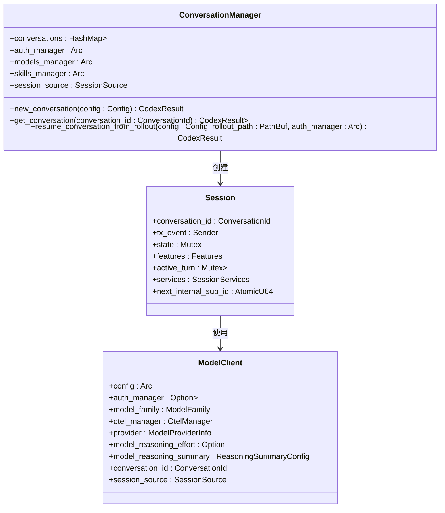
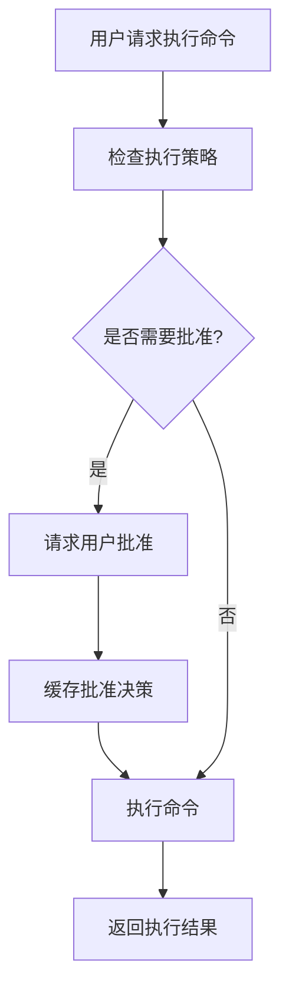
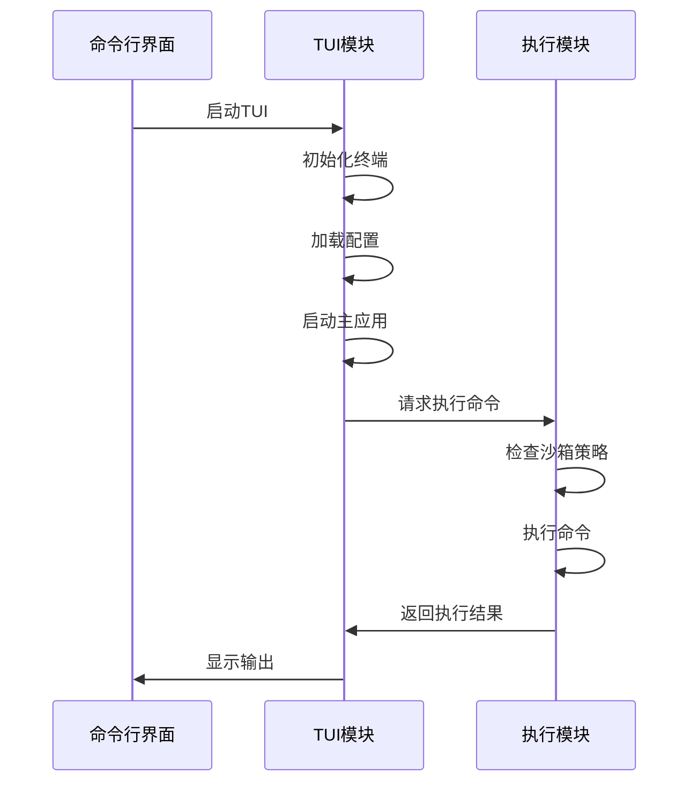

# 核心功能

<cite>
**本文档中引用的文件**  
- [lib.rs](file://codex-rs/core/src/lib.rs)
- [codex.rs](file://codex-rs/core/src/codex.rs)
- [exec.rs](file://codex-rs/core/src/exec.rs)
- [safety.rs](file://codex-rs/core/src/safety.rs)
- [conversation_manager.rs](file://codex-rs/core/src/conversation_manager.rs)
- [tui/src/lib.rs](file://codex-rs/tui/src/lib.rs)
- [tasks/review.rs](file://codex-rs/core/src/tasks/review.rs)
- [apply_patch.rs](file://codex-rs/core/src/apply_patch.rs)
- [unified_exec/mod.rs](file://codex-rs/core/src/unified_exec/mod.rs)
- [command_safety/mod.rs](file://codex-rs/core/src/command_safety/mod.rs)
</cite>

## 目录
1. [引言](#引言)
2. [代码生成](#代码生成)
3. [代码审查](#代码审查)
4. [安全执行](#安全执行)
5. [会话管理与模型调用](#会话管理与模型调用)
6. [执行策略控制](#执行策略控制)
7. [TUI与非交互式执行模块](#tui与非交互式执行模块)

## 引言
Codex 是一个先进的代码辅助系统，其核心功能围绕代码生成、代码审查和安全执行三大支柱构建。这些功能通过 `core` 模块实现，并通过文本用户界面（TUI）和非交互式执行模块向用户暴露。本文档深入探讨这些功能的实现机制，包括会话管理、模型调用和执行策略控制，为不同经验水平的开发者提供全面的技术细节和概念性概述。

## 代码生成
代码生成是 Codex 的核心功能之一，通过 `core` 模块中的 `Codex` 结构体实现。`Codex` 提供了一个高级接口，通过提交操作（`Op`）和接收事件（`Event`）来与系统交互。代码生成过程始于 `Codex::spawn` 方法，该方法初始化一个新的会话，并设置会话配置，包括模型、提供者、用户指令等。

会话的创建和管理由 `ConversationManager` 负责，它维护内存中的会话，并提供创建、获取和恢复会话的方法。`Session` 结构体代表一个初始化的模型代理上下文，包含会话状态、特征集和活动任务。代码生成任务通过 `RegularTask` 实现，该任务在后台 Tokio 任务中执行，驱动会话轮次。

**Diagram sources**
- [codex.rs](file://codex-rs/core/src/codex.rs#L160-L302)
- [conversation_manager.rs](file://codex-rs/core/src/conversation_manager.rs#L43-L264)

**Section sources**
- [codex.rs](file://codex-rs/core/src/codex.rs#L160-L302)
- [conversation_manager.rs](file://codex-rs/core/src/conversation_manager.rs#L43-L264)

## 代码审查
代码审查功能通过 `ReviewTask` 实现，该任务在 `core` 模块中定义。`ReviewTask` 启动一个子代理会话，专门用于代码审查。子代理会话的配置与主会话隔离，确保审查过程的独立性和安全性。审查任务通过 `start_review_conversation` 方法启动，该方法创建一个子代理会话，并获取事件接收器。

审查过程通过 `process_review_events` 方法处理事件，该方法监听子代理会话的事件流，并将相关事件转发给主会话。审查结果通过 `parse_review_output_event` 方法解析，该方法从子代理会话的最终消息中提取审查输出。审查完成后，`exit_review_mode` 方法发出 `ExitedReviewModeEvent` 事件，并记录审查结果。

**Diagram sources**
- [tasks/review.rs](file://codex-rs/core/src/tasks/review.rs#L28-L244)

**Section sources**
- [tasks/review.rs](file://codex-rs/core/src/tasks/review.rs#L28-L244)

## 安全执行
安全执行功能通过 `exec` 模块实现，该模块负责执行命令并确保执行过程的安全性。`exec` 模块提供了 `process_exec_tool_call` 函数，该函数处理执行工具调用，并根据沙箱策略和权限执行命令。执行过程通过 `SandboxManager` 进行沙箱化，确保命令在受限环境中运行。

`SandboxType` 枚举定义了不同平台的沙箱类型，包括 macOS 的 Seatbelt、Linux 的 Seccomp 和 Windows 的 Restricted Token。`exec` 模块还提供了 `is_likely_sandbox_denied` 函数，该函数检查命令输出，判断是否因沙箱限制而被拒绝。

**Diagram sources**
- [exec.rs](file://codex-rs/core/src/exec.rs#L130-L183)
- [safety.rs](file://codex-rs/core/src/safety.rs#L122-L137)

**Section sources**
- [exec.rs](file://codex-rs/core/src/exec.rs#L130-L183)
- [safety.rs](file://codex-rs/core/src/safety.rs#L122-L137)

## 会话管理与模型调用
会话管理由 `ConversationManager` 负责，它维护内存中的会话，并提供创建、获取和恢复会话的方法。`Session` 结构体代表一个初始化的模型代理上下文，包含会话状态、特征集和活动任务。会话的创建通过 `Codex::spawn` 方法完成，该方法初始化会话配置，并启动会话。

模型调用通过 `ModelClient` 实现，该客户端负责与模型提供者通信。`ModelClient` 在 `TurnContext` 中创建，并根据会话配置和模型家族初始化。模型调用过程中，`ModelClient` 发送请求并接收响应，响应通过事件流返回给用户。

**Diagram sources**
- [conversation_manager.rs](file://codex-rs/core/src/conversation_manager.rs#L43-L264)
- [codex.rs](file://codex-rs/core/src/codex.rs#L338-L348)
- [codex.rs](file://codex-rs/core/src/codex.rs#L482-L537)

**Section sources**
- [conversation_manager.rs](file://codex-rs/core/src/conversation_manager.rs#L43-L264)
- [codex.rs](file://codex-rs/core/src/codex.rs#L338-L348)
- [codex.rs](file://codex-rs/core/src/codex.rs#L482-L537)

## 执行策略控制
执行策略控制通过 `exec_policy` 模块实现，该模块负责加载和应用执行策略。`exec_policy` 模块提供了 `load_exec_policy_for_features` 函数，该函数根据特征标志和配置加载执行策略。执行策略通过 `ExecPolicy` 结构体表示，包含策略规则和决策逻辑。

`exec_policy` 模块还提供了 `ApprovalStore`，该存储用于缓存批准决策，避免重复提示用户。执行策略控制确保命令执行符合用户定义的策略，提高系统的安全性和可控性。

**Diagram sources**
- [exec.rs](file://codex-rs/core/src/exec.rs#L241-L244)
- [tools/sandboxing.rs](file://codex-rs/core/src/tools/sandboxing.rs)

**Section sources**
- [exec.rs](file://codex-rs/core/src/exec.rs#L241-L244)
- [tools/sandboxing.rs](file://codex-rs/core/src/tools/sandboxing.rs)

## TUI与非交互式执行模块
TUI（文本用户界面）模块通过 `tui` crate 实现，提供了一个交互式的用户界面。`tui` 模块负责初始化终端、处理用户输入和显示输出。`run_main` 函数是 TUI 的入口点，它解析命令行参数，加载配置，并启动主应用。

非交互式执行模块通过 `exec` 模块实现，该模块支持在非交互模式下执行命令。`exec` 模块提供了 `process_exec_tool_call` 函数，该函数处理执行工具调用，并根据沙箱策略和权限执行命令。非交互式执行模块确保命令在受限环境中安全执行。

**Diagram sources**
- [tui/src/lib.rs](file://codex-rs/tui/src/lib.rs#L103-L332)
- [exec.rs](file://codex-rs/core/src/exec.rs#L130-L183)

**Section sources**
- [tui/src/lib.rs](file://codex-rs/tui/src/lib.rs#L103-L332)
- [exec.rs](file://codex-rs/core/src/exec.rs#L130-L183)