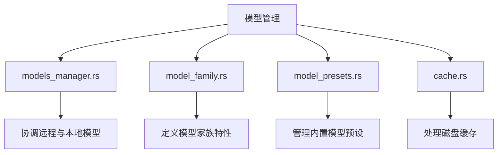
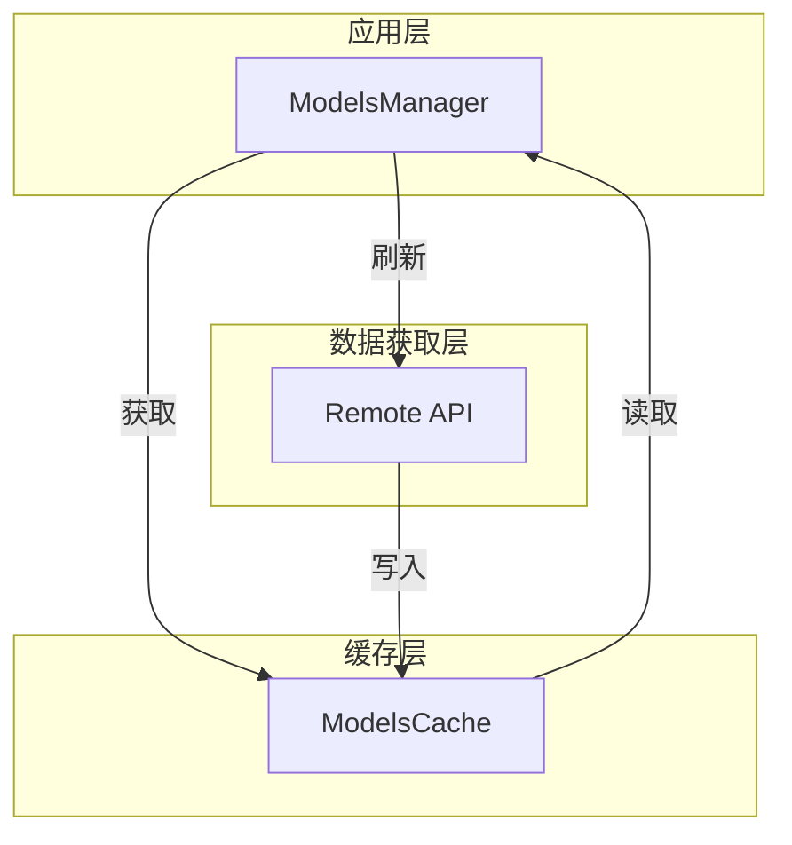
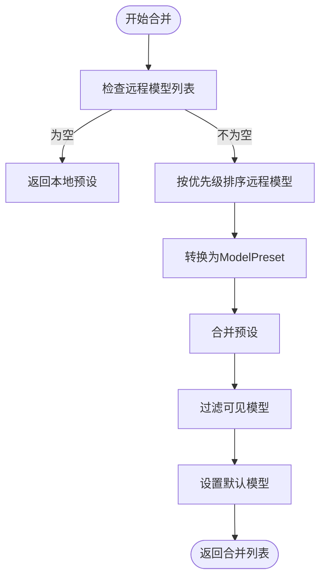
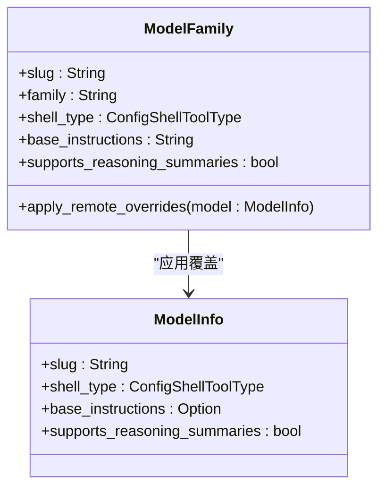
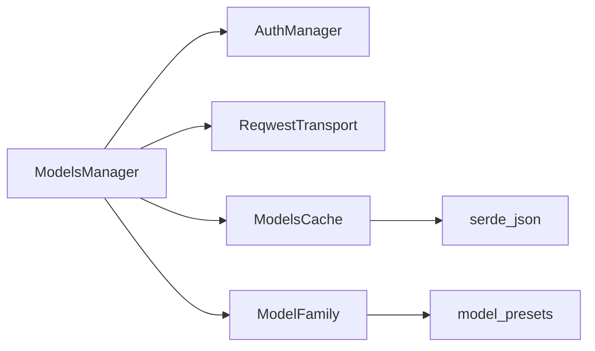

# 模型管理远程模型合并

<cite>
**本文档引用的文件**   
- [models_manager.rs](file://codex-rs/core/src/openai_models/models_manager.rs)
- [model_family.rs](file://codex-rs/core/src/openai_models/model_family.rs)
- [model_presets.rs](file://codex-rs/core/src/openai_models/model_presets.rs)
- [cache.rs](file://codex-rs/core/src/openai_models/cache.rs)
- [remote_models.rs](file://codex-rs/core/tests/suite/remote_models.rs)
</cite>

## 目录
1. [简介](#简介)
2. [项目结构](#项目结构)
3. [核心组件](#核心组件)
4. [架构概述](#架构概述)
5. [详细组件分析](#详细组件分析)
6. [依赖分析](#依赖分析)
7. [性能考虑](#性能考虑)
8. [故障排除指南](#故障排除指南)
9. [结论](#结论)

## 简介
本文档详细介绍了Codex系统中模型管理的远程模型合并功能。该功能允许系统从远程服务器获取最新的模型元数据，并将其与本地预设模型进行智能合并，从而为用户提供最新、最准确的模型选择。系统通过缓存机制优化性能，并支持模型特性的动态更新，如指令集、shell类型和推理能力等。

## 项目结构
Codex项目的模型管理功能主要集中在`codex-rs/core/src/openai_models/`目录下，该目录包含了处理模型发现、缓存和配置的核心模块。

**Diagram sources**
- [models_manager.rs](file://codex-rs/core/src/openai_models/models_manager.rs)
- [model_family.rs](file://codex-rs/core/src/openai_models/model_family.rs)
- [model_presets.rs](file://codex-rs/core/src/openai_models/model_presets.rs)
- [cache.rs](file://codex-rs/core/src/openai_models/cache.rs)

## 核心组件
模型管理的核心是`ModelsManager`结构体，它负责协调远程模型的发现与本地元数据的缓存。它通过`refresh_available_models`方法从远程API获取最新的模型列表，并利用`build_available_models`方法将远程模型与本地预设进行合并。`ModelFamily`结构体则代表了一个模型家族，它包含了模型的特性，如上下文窗口、截断策略和shell工具类型等。

**Section sources**
- [models_manager.rs](file://codex-rs/core/src/openai_models/models_manager.rs)
- [model_family.rs](file://codex-rs/core/src/openai_models/model_family.rs)

## 架构概述
模型管理系统的架构分为三个主要层次：数据获取层、缓存层和应用层。数据获取层负责与远程API通信；缓存层确保在离线或网络延迟时仍能提供快速响应；应用层则将合并后的模型列表提供给上层应用。

**Diagram sources**
- [models_manager.rs](file://codex-rs/core/src/openai_models/models_manager.rs)
- [cache.rs](file://codex-rs/core/src/openai_models/cache.rs)

## 详细组件分析

### ModelsManager 分析
`ModelsManager`是模型管理的核心协调者。它首先检查功能开关`Feature::RemoteModels`是否启用，然后尝试从磁盘缓存加载模型以避免不必要的网络请求。如果缓存已过期或不存在，则会发起网络请求获取最新的模型列表。

#### 模型合并流程

**Diagram sources**
- [models_manager.rs](file://codex-rs/core/src/openai_models/models_manager.rs#L205-L254)

### ModelFamily 分析
`ModelFamily`结构体封装了模型的静态和动态特性。当从远程获取到模型信息时，`apply_remote_overrides`方法会将这些信息应用到现有的模型家族上，从而实现模型特性的动态更新。

#### 远程覆盖应用

**Diagram sources**
- [model_family.rs](file://codex-rs/core/src/openai_models/model_family.rs#L110-L149)

## 依赖分析
模型管理系统依赖于多个外部组件，包括用于HTTP请求的`ReqwestTransport`、用于身份验证的`AuthManager`以及用于序列化/反序列化的`serde`库。其内部模块之间也存在紧密的依赖关系。

**Diagram sources**
- [models_manager.rs](file://codex-rs/core/src/openai_models/models_manager.rs)
- [cache.rs](file://codex-rs/core/src/openai_models/cache.rs)

## 性能考虑
系统通过多种机制优化性能。首先，使用`DEFAULT_MODEL_CACHE_TTL`（300秒）的缓存有效期来减少重复的网络请求。其次，`try_load_cache`方法在缓存有效时直接返回，避免了网络延迟。此外，`list_models`方法在刷新失败时会记录错误但不会中断主流程，保证了系统的健壮性。

## 故障排除指南
当模型列表未按预期更新时，应首先检查`Feature::RemoteModels`功能是否已启用。其次，验证网络连接和API端点的可达性。如果问题依旧，可以检查`models_cache.json`文件的修改时间和内容，确认缓存机制是否正常工作。日志中的`failed to refresh available models`错误是诊断此类问题的关键线索。

**Section sources**
- [models_manager.rs](file://codex-rs/core/src/openai_models/models_manager.rs#L109-L110)
- [cache.rs](file://codex-rs/core/src/openai_models/cache.rs#L175-L176)

## 结论
Codex的模型管理远程模型合并功能是一个健壮且高效的系统，它通过智能的缓存和合并策略，确保了用户始终能够访问到最新、最合适的模型。该设计不仅提升了用户体验，还通过减少不必要的网络请求优化了系统性能。未来可以考虑增加对ETag的支持，以实现更精确的缓存验证。