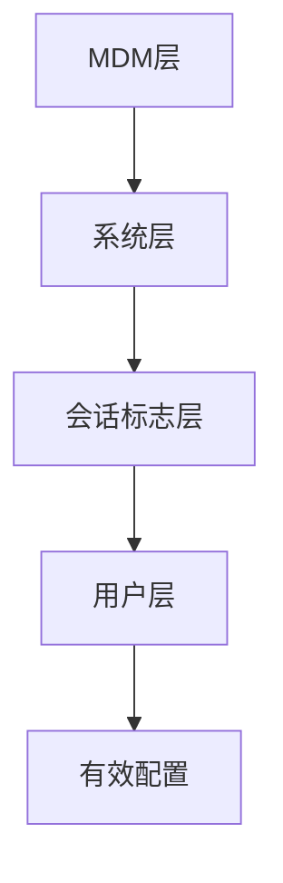
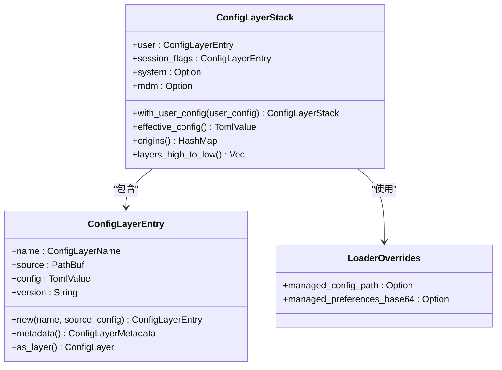

# 配置

<cite>
**本文档中引用的文件**   
- [config.toml](file://codex-rs/core/src/config/mod.rs)
- [config.md](file://docs/config.md)
- [example-config.md](file://docs/example-config.md)
- [types.rs](file://codex-rs/core/src/config/types.rs)
- [state.rs](file://codex-rs/core/src/config_loader/state.rs)
- [layer_io.rs](file://codex-rs/core/src/config_loader/layer_io.rs)
- [overrides.rs](file://codex-rs/core/src/config_loader/overrides.rs)
- [merge.rs](file://codex-rs/core/src/config_loader/merge.rs)
- [ghost_commits.rs](file://codex-rs/utils/git/src/ghost_commits.rs)
</cite>

## 更新摘要
**已更改内容**   
- 在“可用配置选项”部分新增了关于`ghost_snapshot`配置字段的详细说明。
- 在“配置文件模板”部分更新了示例配置，以包含新的`ghost_snapshot`配置选项。
- 添加了与幽灵快照功能相关的源文件引用。

## 目录
1. [简介](#简介)
2. [配置层次结构与合并逻辑](#配置层次结构与合并逻辑)
3. [配置来源](#配置来源)
4. [可用配置选项](#可用配置选项)
5. [配置文件模板](#配置文件模板)
6. [最佳实践建议](#最佳实践建议)
7. [配置加载器模块](#配置加载器模块)

## 简介
Codex的配置系统为用户提供了一套精细的控制机制，用于管理模型选择、执行环境和集成选项。本配置文档详细说明了如何通过配置文件（如`config.toml`）、环境变量和命令行参数来定制Codex的行为。文档涵盖了配置的层次结构、合并逻辑以及`config_loader`模块如何从不同来源加载和合并配置。此外，还列出了所有可用的配置选项，包括会话设置、模型偏好和安全策略，并提供了配置文件模板和最佳实践建议。

**Section sources**
- [config.md](file://docs/config.md#L1-L15)

## 配置层次结构与合并逻辑
Codex的配置系统采用多层配置结构，允许用户通过不同来源设置配置值，这些来源按优先级顺序合并。配置值的设置机制包括：
- **命令行标志**：特定于配置的命令行标志，如`--model o3`，具有最高优先级。
- **通用配置标志**：使用`-c`或`--config`标志，接受`key=value`对，如`--config model="o3"`。
- **配置文件**：`$CODEX_HOME/config.toml`配置文件，其中`CODEX_HOME`环境变量默认为`~/.codex`。

配置的合并逻辑遵循以下层次结构，从高到低优先级：
1. **MDM（移动设备管理）层**：由系统管理员管理的配置，通常用于企业环境。
2. **系统层**：系统范围的配置，适用于所有用户。
3. **会话标志层**：通过命令行传递的配置覆盖。
4. **用户层**：用户的`config.toml`文件中的配置。

合并过程通过递归地将覆盖层的值合并到基础层中，覆盖层的值具有更高的优先级。这种机制确保了配置的灵活性和可管理性。



**Diagram sources**
- [state.rs](file://codex-rs/core/src/config_loader/state.rs#L57-L62)
- [merge.rs](file://codex-rs/core/src/config_loader/merge.rs#L3-L18)

**Section sources**
- [config.md](file://docs/config.md#L15-L26)
- [state.rs](file://codex-rs/core/src/config_loader/state.rs#L78-L87)

## 配置来源
Codex的配置可以从多个来源加载，这些来源包括：
- **用户配置文件**：位于`$CODEX_HOME/config.toml`的文件，是用户自定义配置的主要来源。
- **系统配置文件**：位于`/etc/codex/managed_config.toml`（Unix系统）或`$CODEX_HOME/managed_config.toml`（非Unix系统）的文件，用于系统范围的配置。
- **MDM配置**：在macOS上，通过`managed_preferences`加载的管理配置。
- **命令行覆盖**：通过`--config`标志传递的配置值，用于临时覆盖其他配置。

配置加载器模块负责从这些来源读取配置，并按优先级顺序合并它们，生成最终的有效配置。

**Section sources**
- [layer_io.rs](file://codex-rs/core/src/config_loader/layer_io.rs#L21-L54)
- [config.md](file://docs/config.md#L26-L28)

## 可用配置选项
以下是Codex中可用的主要配置选项，分为几个类别：

### 模型选择
- **model**：指定Codex使用的模型，如`gpt-5.1-codex-max`。
- **model_provider**：指定模型提供商，如`openai`。
- **model_context_window**：指定模型的上下文窗口大小，以token为单位。
- **model_reasoning_effort**：设置推理努力程度，如`minimal`、`low`、`medium`、`high`、`xhigh`。
- **model_reasoning_summary**：设置推理摘要的详细程度，如`auto`、`concise`、`detailed`。
- **model_verbosity**：控制GPT-5系列模型的输出长度/详细程度，如`low`、`medium`、`high`。

### 执行环境
- **approval_policy**：确定何时提示用户批准Codex执行命令，如`untrusted`、`on-failure`、`on-request`、`never`。
- **sandbox_mode**：指定执行模型生成的shell命令时的沙箱模式，如`read-only`、`workspace-write`、`danger-full-access`。
- **shell_environment_policy**：定义在生成子进程时继承的环境变量策略。

### MCP集成
- **mcp_servers**：配置Codex使用的MCP服务器，以访问外部应用程序、资源或服务。

### 观察性与遥测
- **otel**：配置OpenTelemetry日志事件的导出，用于描述每次运行的情况。
- **notify**：指定一个程序，用于接收Codex生成的事件通知。

### 其他配置
- **profiles**：定义多个配置文件，可以在运行时通过`--profile`标志选择。
- **features**：集中管理功能标志，用于功能门控。

### 幽灵快照
- **ghost_snapshot.ignore_large_untracked_files**：排除大于此字节数的未跟踪文件（默认：10 MiB）。设为`0`以禁用。
- **ghost_snapshot.ignore_large_untracked_dirs**：忽略包含至少此数量文件的未跟踪目录（默认：200）。设为`0`以禁用。

**Section sources**
- [config.md](file://docs/config.md#L59-L659)
- [types.rs](file://codex-rs/core/src/config/types.rs#L20-L532)
- [ghost_commits.rs](file://codex-rs/utils/git/src/ghost_commits.rs#L64-L76)

## 配置文件模板
以下是一个示例`config.toml`文件，包含了所有关键配置选项的默认值和解释：

```toml
# Codex示例配置 (config.toml)
#
# 此文件列出了Codex从config.toml读取的所有键、它们的默认值和简明解释。
# 此处的值反映了CLI中编译的默认值。根据需要进行调整。
#
# 注意
# - 根键必须在TOML中出现在表之前。
# - 默认为“未设置”的可选键显示为注释，并附有说明。
# - MCP服务器、配置文件和模型提供商是示例；请删除或编辑。

################################################################################
# 核心模型选择
################################################################################
model = "gpt-5.1-codex-max"
review_model = "gpt-5.1-codex-max"
model_provider = "openai"

################################################################################
# 推理与详细程度 (支持Responses API的模型)
################################################################################
model_reasoning_effort = "medium"
model_reasoning_summary = "auto"
model_verbosity = "medium"
model_supports_reasoning_summaries = false
model_reasoning_summary_format = "none"

################################################################################
# 指令覆盖
################################################################################
# developer_instructions = ""
# instructions = ""
# compact_prompt = ""

################################################################################
# 批准与沙箱
################################################################################
approval_policy = "on-request"
sandbox_mode = "read-only"

[sandbox_workspace_write]
writable_roots = []
network_access = false
exclude_tmpdir_env_var = false
exclude_slash_tmp = false

################################################################################
# Shell环境策略
################################################################################
[shell_environment_policy]
inherit = "all"
ignore_default_excludes = false
exclude = []
set = {}
include_only = []

################################################################################
# 历史记录与文件打开器
################################################################################
[history]
persistence = "save-all"

file_opener = "vscode"

################################################################################
# UI、通知和其他
################################################################################
[tui]
notifications = false
animations = true
hide_agent_reasoning = false
show_raw_agent_reasoning = false
disable_paste_burst = false
windows_wsl_setup_acknowledged = false

# 外部通知程序 (argv数组)。未设置时：禁用。
# notify = ["notify-send", "Codex"]

[notice]
# hide_full_access_warning = true
# hide_rate_limit_model_nudge = true

################################################################################
# 认证与登录
################################################################################
cli_auth_credentials_store = "file"
chatgpt_base_url = "https://chatgpt.com/backend-api/"
mcp_oauth_credentials_store = "auto"

################################################################################
# 项目文档控制
################################################################################
project_doc_max_bytes = 32768
project_doc_fallback_filenames = []

################################################################################
# 工具 (遗留切换，为了兼容性保留)
################################################################################
[tools]
web_search = false
view_image = true

################################################################################
# 集中功能标志 (首选)
################################################################################
[features]
unified_exec = false
rmcp_client = false
apply_patch_freeform = false
view_image_tool = true
web_search_request = false
ghost_commit = false
enable_experimental_windows_sandbox = false
skills = false

################################################################################
# 实验性切换 (遗留；首选[features])
################################################################################
experimental_use_freeform_apply_patch = false

################################################################################
# 模型提供商 (扩展/覆盖内置)
################################################################################
[model_providers]
# [model_providers.openai]
# name = "OpenAI"
# base_url = "https://api.openai.com/v1"
# wire_api = "responses"
# request_max_retries = 4
# stream_max_retries = 5
# stream_idle_timeout_ms = 300000

################################################################################
# 配置文件 (命名预设)
################################################################################
# profile = "default"

[profiles]
# [profiles.default]
# model = "gpt-5.1-codex-max"
# model_provider = "openai"
# approval_policy = "on-request"
# sandbox_mode = "read-only"
# model_reasoning_effort = "medium"
# model_reasoning_summary = "auto"
# model_verbosity = "medium"
# chatgpt_base_url = "https://chatgpt.com/backend-api/"
# experimental_compact_prompt_file = "compact_prompt.txt"
# include_apply_patch_tool = false
# experimental_use_freeform_apply_patch = false
# tools_web_search = false
# tools_view_image = true
# features = { unified_exec = false }

################################################################################
# 项目 (信任级别)
################################################################################
[projects]
# [projects."/absolute/path/to/project"]
# trust_level = "trusted"

################################################################################
# OpenTelemetry (OTEL) – 默认禁用
################################################################################
[otel]
log_user_prompt = false
environment = "dev"
exporter = "none"

# [otel.exporter."otlp-http"]
# endpoint = "https://otel.example.com/v1/logs"
# protocol = "binary"
# [otel.exporter."otlp-http".headers]
# "x-otlp-api-key" = "${OTLP_TOKEN}"

# [otel.exporter."otlp-grpc"]
# endpoint = "https://otel.example.com:4317",
# headers = { "x-otlp-meta" = "abc123" }

################################################################################
# 幽灵快照
################################################################################
[ghost_snapshot]
# 忽略大于此字节数的未跟踪文件（默认：10 MiB）。设为0以禁用。
ignore_large_untracked_files = 10485760
# 忽略包含至少此数量文件的未跟踪目录（默认：200）。设为0以禁用。
ignore_large_untracked_dirs = 200
```

**Section sources**
- [example-config.md](file://docs/example-config.md#L1-L368)

## 最佳实践建议
- **使用配置文件**：对于长期配置，建议使用`config.toml`文件，以便于版本控制和共享。
- **利用配置文件**：通过定义多个配置文件，可以轻松地在不同的项目或环境中切换配置。
- **谨慎使用命令行覆盖**：命令行覆盖适用于临时更改，但不应作为长期配置的替代方案。
- **定期审查配置**：随着Codex的更新，新的配置选项可能会被引入，定期审查和更新配置文件以利用新功能。
- **安全考虑**：避免在配置文件中硬编码敏感信息，如API密钥，应使用环境变量或安全存储。

**Section sources**
- [config.md](file://docs/config.md#L776-L782)

## 配置加载器模块
`config_loader`模块负责从不同来源加载和合并配置。该模块的实现分为几个关注点：
- **state.rs**：定义公共类型（如`ConfigLayerEntry`、`ConfigLayerStack`）和合并/来源便利方法。
- **layer_io.rs**：处理`config.toml`、托管配置和托管首选项输入的读取。
- **overrides.rs**：将CLI点路径覆盖转换为TOML“会话标志”层。
- **merge.rs**：递归合并TOML值。
- **fingerprint.rs**：稳定的每层哈希和每键来源遍历。
- **macos.rs**：托管首选项集成（仅macOS）。

`config_loader`模块通过`load_config_layers_internal`函数从用户、系统、MDM和命令行来源读取配置，并使用`merge_toml_values`函数将它们合并成一个有效的配置。



**Diagram sources**
- [state.rs](file://codex-rs/core/src/config_loader/state.rs#L12-L62)
- [layer_io.rs](file://codex-rs/core/src/config_loader/layer_io.rs#L21-L54)
- [overrides.rs](file://codex-rs/core/src/config_loader/overrides.rs#L7-L12)
- [merge.rs](file://codex-rs/core/src/config_loader/merge.rs#L3-L18)

**Section sources**
- [state.rs](file://codex-rs/core/src/config_loader/state.rs#L1-L129)
- [layer_io.rs](file://codex-rs/core/src/config_loader/layer_io.rs#L1-L101)
- [overrides.rs](file://codex-rs/core/src/config_loader/overrides.rs#L1-L56)
- [merge.rs](file://codex-rs/core/src/config_loader/merge.rs#L1-L19)