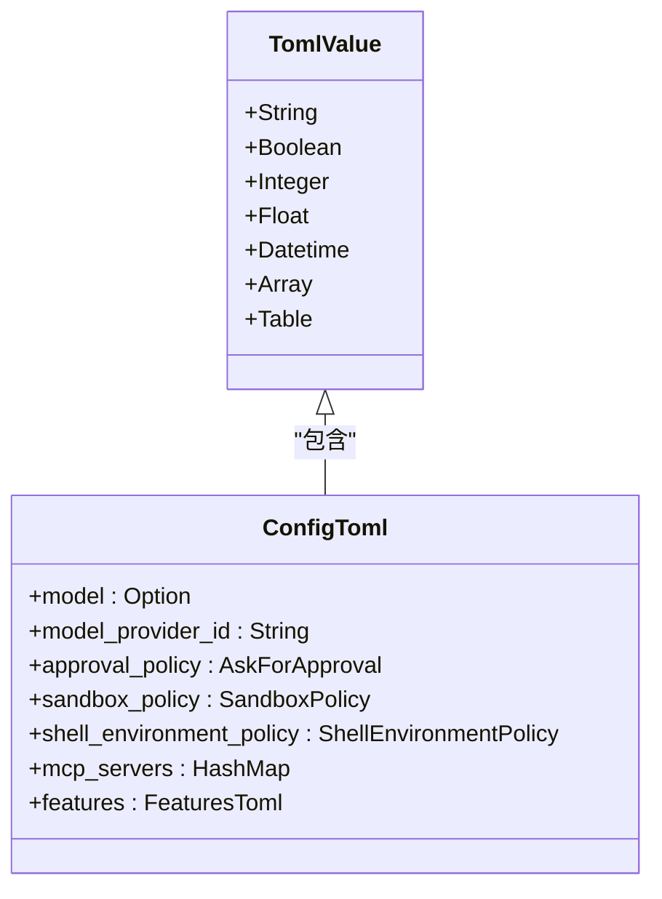
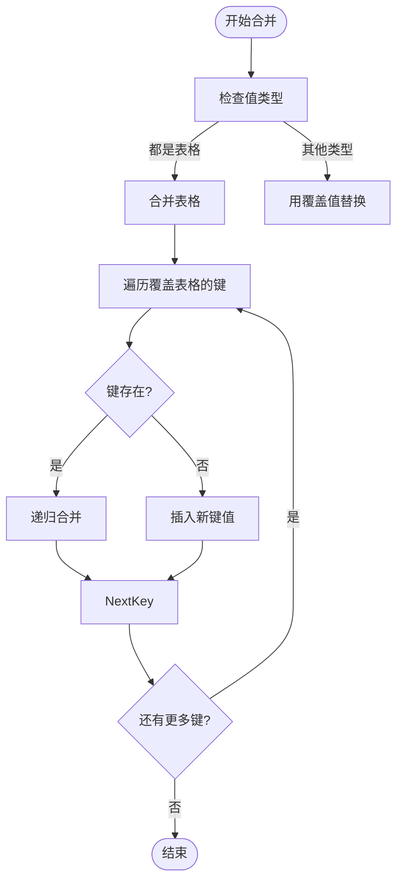
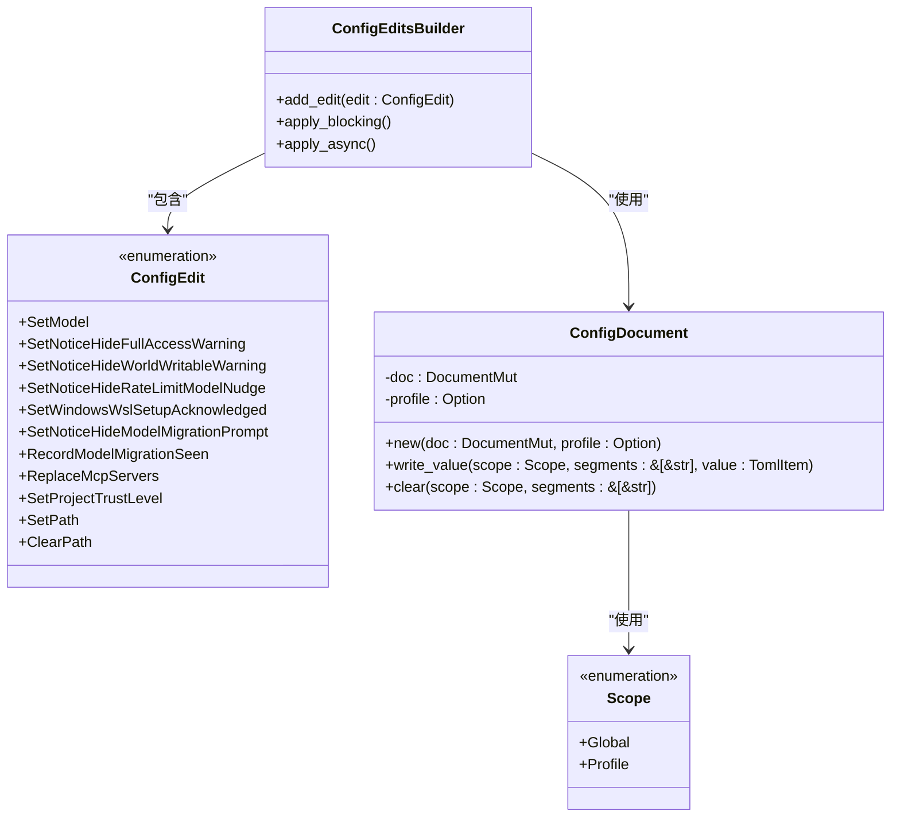
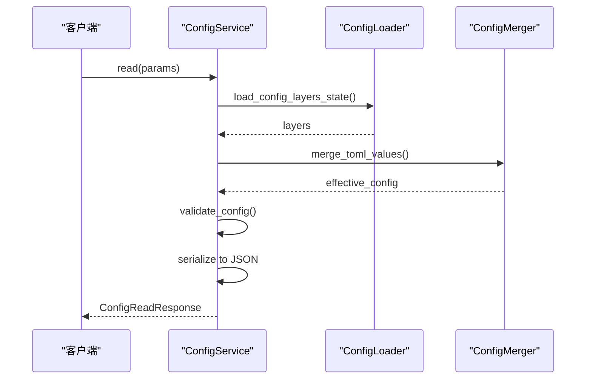
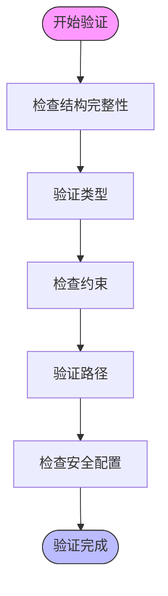
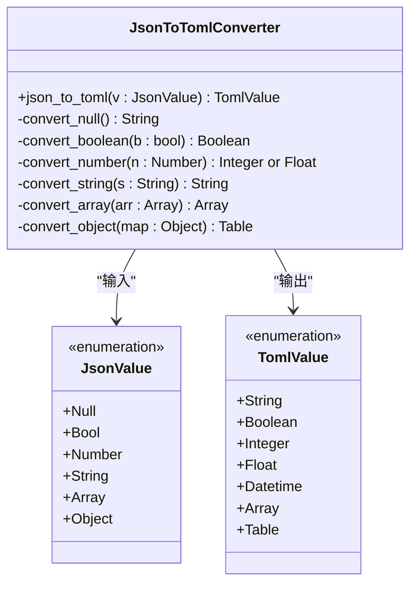

# 配置管理TOML序列化

<cite>
**本文档中引用的文件**  
- [config.md](file://docs/config.md)
- [lib.rs](file://codex-rs/utils/json-to-toml/src/lib.rs)
- [config_override.rs](file://codex-rs/common/src/config_override.rs)
- [merge.rs](file://codex-rs/core/src/config_loader/merge.rs)
- [overrides.rs](file://codex-rs/core/src/config_loader/overrides.rs)
- [edit.rs](file://codex-rs/core/src/config/edit.rs)
- [service.rs](file://codex-rs/core/src/config/service.rs)
- [types.rs](file://codex-rs/core/src/config/types.rs)
- [mod.rs](file://codex-rs/core/src/config/mod.rs)
</cite>

## 目录
1. [简介](#简介)
2. [配置文件结构](#配置文件结构)
3. [TOML序列化机制](#toml序列化机制)
4. [配置覆盖与合并](#配置覆盖与合并)
5. [配置编辑与持久化](#配置编辑与持久化)
6. [配置服务接口](#配置服务接口)
7. [类型定义与验证](#类型定义与验证)
8. [JSON到TOML转换](#json到toml转换)
9. [结论](#结论)

## 简介

Codex系统的配置管理基于TOML格式，提供了一套完整的配置加载、序列化、覆盖和持久化机制。该系统支持多层级配置合并、命令行覆盖、配置文件编辑等功能，确保了配置管理的灵活性和可靠性。

**Section sources**
- [config.md](file://docs/config.md#L1-L20)

## 配置文件结构

Codex的配置系统主要由`config.toml`文件驱动，该文件位于`$CODEX_HOME`目录下（默认为`~/.codex`）。配置文件支持多种配置选项，包括模型选择、执行环境、MCP集成、可观测性等。

配置可以通过多种方式设置：
- 命令行标志（最高优先级）
- 通用的`-c`/`--config`标志，接受`key=value`对
- `config.toml`配置文件

**Section sources**
- [config.md](file://docs/config.md#L15-L26)

## TOML序列化机制

Codex使用`toml`和`toml_edit`库来处理TOML格式的序列化和反序列化。系统定义了`ConfigToml`结构体来表示配置的完整结构，并通过serde进行序列化。

配置值以`toml::Value`类型表示，支持以下基本类型：
- 字符串
- 布尔值
- 整数
- 浮点数
- 数组
- 表格（Table）



**Diagram sources**
- [types.rs](file://codex-rs/core/src/config/types.rs#L20-L200)
- [mod.rs](file://codex-rs/core/src/config/mod.rs#L89-L200)

## 配置覆盖与合并

Codex实现了复杂的配置覆盖和合并机制，支持多层级配置的优先级处理。

### 覆盖机制

配置覆盖通过`CliConfigOverrides`结构体实现，支持点路径语法来指定嵌套配置项：

```toml
# 覆盖模型
-c model="o3"

# 覆盖嵌套配置
-c shell_environment_policy.inherit=all

# 覆盖数组
-c sandbox_permissions=["disk-full-read-access"]
```

覆盖值首先尝试解析为TOML值，如果解析失败则作为字符串处理。

### 合并机制

配置合并通过`merge_toml_values`函数实现，采用覆盖优先策略：



**Diagram sources**
- [overrides.rs](file://codex-rs/core/src/config_loader/overrides.rs#L16-L55)
- [merge.rs](file://codex-rs/core/src/config_loader/merge.rs#L4-L18)

**Section sources**
- [config_override.rs](file://codex-rs/common/src/config_override.rs#L42-L88)
- [overrides.rs](file://codex-rs/core/src/config_loader/overrides.rs#L7-L55)
- [merge.rs](file://codex-rs/core/src/config_loader/merge.rs#L4-L18)

## 配置编辑与持久化

Codex提供了完整的配置编辑和持久化功能，通过`ConfigEditsBuilder`和相关类型实现。

### 编辑操作

系统支持多种配置编辑操作：
- `SetModel`: 设置模型
- `SetNoticeHideFullAccessWarning`: 设置通知隐藏标志
- `ReplaceMcpServers`: 替换MCP服务器配置
- `SetProjectTrustLevel`: 设置项目信任级别
- `SetPath`: 设置路径值
- `ClearPath`: 清除路径值

### 持久化机制

配置持久化通过`ConfigDocument`结构体实现，使用`toml_edit::DocumentMut`来维护文档的修改状态，同时保留原始文档的格式和注释。



**Diagram sources**
- [edit.rs](file://codex-rs/core/src/config/edit.rs#L19-L49)
- [edit.rs](file://codex-rs/core/src/config/edit.rs#L237-L247)

**Section sources**
- [edit.rs](file://codex-rs/core/src/config/edit.rs#L1-L495)

## 配置服务接口

`ConfigService`是配置管理的核心服务，提供配置读取、写入和管理的统一接口。

### 服务功能

- `read`: 读取配置，返回合并后的有效配置
- `write_value`: 写入单个配置值
- `batch_write`: 批量写入配置值
- `load_user_saved_config`: 加载用户保存的配置

### 配置加载流程



**Diagram sources**
- [service.rs](file://codex-rs/core/src/config/service.rs#L98-L150)

**Section sources**
- [service.rs](file://codex-rs/core/src/config/service.rs#L98-L200)

## 类型定义与验证

Codex的配置系统定义了丰富的类型来表示各种配置选项，确保类型安全和配置验证。

### 核心类型

- `McpServerConfig`: MCP服务器配置
- `ShellEnvironmentPolicy`: Shell环境策略
- `SandboxPolicy`: 沙箱策略
- `AskForApproval`: 审批策略
- `FeaturesToml`: 功能标志

### 验证机制

系统在加载配置后会进行验证，确保配置的完整性和正确性：



**Diagram sources**
- [types.rs](file://codex-rs/core/src/config/types.rs#L20-L200)
- [service.rs](file://codex-rs/core/src/config/service.rs#L467-L469)

**Section sources**
- [types.rs](file://codex-rs/core/src/config/types.rs#L1-L200)
- [service.rs](file://codex-rs/core/src/config/service.rs#L467-L469)

## JSON到TOML转换

Codex提供了`json_to_toml`工具函数，用于将`serde_json::Value`转换为`toml::Value`，支持完整的类型映射。

### 转换规则

| JSON类型 | TOML类型 | 说明 |
|---------|---------|------|
| Null | String | 空字符串 |
| Boolean | Boolean | 布尔值 |
| Integer | Integer | 整数 |
| Float | Float | 浮点数 |
| String | String | 字符串 |
| Array | Array | 数组 |
| Object | Table | 表格 |

### 转换实现



**Diagram sources**
- [lib.rs](file://codex-rs/utils/json-to-toml/src/lib.rs#L5-L27)

**Section sources**
- [lib.rs](file://codex-rs/utils/json-to-toml/src/lib.rs#L1-L83)

## 结论

Codex的配置管理TOML序列化系统提供了一套完整、灵活且可靠的配置管理解决方案。系统通过多层级配置合并、命令行覆盖、类型安全的序列化和持久化机制，确保了配置管理的高效性和可靠性。该系统的设计充分考虑了用户体验和安全性，为Codex的稳定运行提供了坚实的基础。