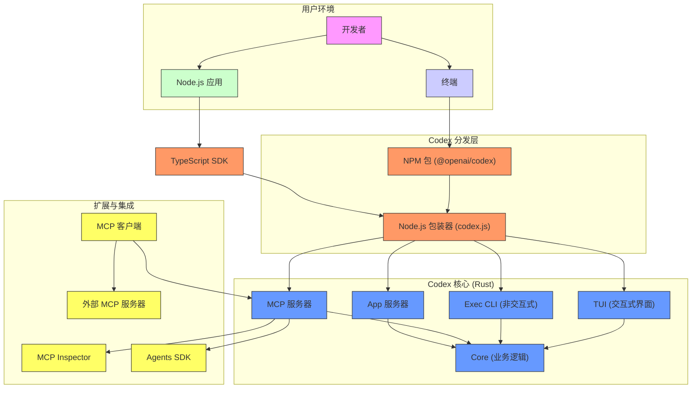

# 项目概述

<cite>
**本文档中引用的文件**   
- [README.md](file://README.md)
- [codex-rs/README.md](file://codex-rs/README.md)
- [sdk/typescript/README.md](file://sdk/typescript/README.md)
- [codex-cli/package.json](file://codex-cli/package.json)
- [codex-rs/Cargo.toml](file://codex-rs/Cargo.toml)
- [codex-rs/core/src/lib.rs](file://codex-rs/core/src/lib.rs)
- [codex-rs/cli/src/main.rs](file://codex-rs/cli/src/main.rs)
- [codex-rs/tui/src/lib.rs](file://codex-rs/tui/src/lib.rs)
- [codex-rs/mcp-server/src/main.rs](file://codex-rs/mcp-server/src/main.rs)
- [codex-rs/app-server/src/main.rs](file://codex-rs/app-server/src/main.rs)
- [sdk/typescript/src/index.ts](file://sdk/typescript/src/index.ts)
- [sdk/typescript/src/codex.ts](file://sdk/typescript/src/codex.ts)
- [docs/getting-started.md](file://docs/getting-started.md)
- [docs/advanced.md](file://docs/advanced.md)
</cite>

## 目录
1. [简介](#简介)
2. [核心功能](#核心功能)
3. [项目架构](#项目架构)
4. [设计理念与优势](#设计理念与优势)
5. [典型用例](#典型用例)
6. [系统上下文图](#系统上下文图)

## 简介

Codex 是一个由 OpenAI 开发的本地编码代理，旨在作为开发者的智能助手，运行在用户的本地计算机上。它能够理解上下文、生成代码、审查代码变更、执行命令，并与开发者进行自然语言交互。Codex CLI 可以通过 npm 或 Homebrew 全局安装，为开发者提供一个零依赖的本地执行环境。

该项目的核心目标是将先进的语言模型能力与本地开发环境无缝集成，使开发者能够利用 AI 的力量来自动化重复性任务、探索技术方案、修复错误以及学习新代码库。Codex 不仅限于代码生成，它还能执行生成的代码、处理文件变更，并在安全的沙箱环境中运行，确保操作的安全性。

Codex 项目采用多语言技术栈，其核心后端使用 Rust 实现，以确保高性能和内存安全；而命令行界面（CLI）则通过 Node.js 包装器提供，方便用户安装和使用；此外，还提供了 TypeScript SDK，允许开发者将 Codex 代理嵌入到自己的应用程序和工作流中。

**Section sources**
- [README.md](file://README.md#L1-L113)
- [codex-rs/README.md](file://codex-rs/README.md#L1-L99)

## 核心功能

Codex 项目提供了一系列强大的核心功能，使其成为一个全面的本地编码代理。

**代码生成与执行**：Codex 能够根据自然语言提示生成高质量的代码。它不仅生成代码，还能在本地环境中执行这些代码，例如运行测试、构建项目或应用数据库迁移。通过 `codex exec` 命令，开发者可以以非交互模式运行 Codex，实现自动化任务处理。

**代码审查**：Codex 可以对代码库进行全面审查，识别潜在的漏洞、性能瓶颈或代码质量问题，并生成详细的审查报告。这使得它成为一个强大的代码质量保证工具。

**本地运行与沙箱**：Codex 的一大特点是其本地运行能力。所有操作都在用户的机器上完成，确保了数据隐私。它集成了平台特定的沙箱技术（如 macOS 的 Seatbelt、Linux 的 Landlock），可以在受限环境中执行命令，防止对系统造成意外损害。用户可以通过 `--sandbox` 标志选择不同的沙箱策略，如只读、工作区写入或完全访问（危险）。

**模型上下文协议 (MCP)**：Codex 支持 MCP（Model Context Protocol），既可以作为 MCP 客户端连接到外部 MCP 服务器以扩展其能力，也可以作为 MCP 服务器运行，为其他代理（如 OpenAI Agents SDK）提供 Codex 的功能作为工具。

**会话管理与记忆**：Codex 会话是持久化的，存储在 `~/.codex/sessions` 目录中。用户可以通过 `codex resume` 命令恢复之前的会话，继续未完成的工作。通过 `AGENTS.md` 文件，用户可以为 Codex 提供持久的指导和指令，实现“记忆”功能。

**多平台支持**：Codex 支持 macOS、Linux 和 Windows 等主流操作系统，并针对每个平台的特性进行了优化。

**Section sources**
- [README.md](file://README.md#L14-L105)
- [codex-rs/README.md](file://codex-rs/README.md#L21-L87)
- [docs/getting-started.md](file://docs/getting-started.md#L1-L120)

## 项目架构

Codex 项目的架构清晰地分离了关注点，主要由三个核心部分组成：Rust 后端、Node.js CLI 包装器和 TypeScript SDK。

Rust 后端（`codex-rs`）是整个项目的核心。它是一个 Cargo 工作区，包含多个 Rust crate。其中，`core` crate 包含了 Codex 的主要业务逻辑，旨在成为一个可重用的库；`tui` crate 提供了一个基于 Ratatui 的全屏终端用户界面（TUI）；`exec` crate 提供了非交互式的命令行接口；`mcp-server` crate 使 Codex 能够作为 MCP 服务器运行；`app-server` crate 则提供了应用服务器功能。这些组件共同构成了一个强大、高效且安全的本地代理。

Node.js CLI 包装器（`codex-cli`）是一个 NPM 包，其主要作用是分发和启动 Rust 编译的原生可执行文件。`package.json` 文件定义了 `codex` 作为全局命令行工具，指向 `bin/codex.js`。这个 JavaScript 脚本负责在用户的系统上找到并执行正确的平台特定的 Rust 二进制文件（如 `codex-x86_64-apple-darwin`），从而实现了跨平台的无缝安装体验。

TypeScript SDK（`sdk/typescript`）为开发者提供了将 Codex 集成到 Node.js 应用程序中的能力。它通过 spawn 子进程来启动 `codex` CLI，并通过 stdin/stdout 以 JSONL 格式交换事件。SDK 提供了 `Codex` 类来管理会话，以及 `Thread` 类来与代理进行交互，支持流式响应和结构化输出，使得在自动化工作流中使用 Codex 变得非常简单。

这三个部分通过清晰的接口进行通信：CLI 包装器调用 Rust 二进制文件，而 TypeScript SDK 则通过标准输入输出与 CLI 进行交互。

**Section sources**
- [codex-cli/package.json](file://codex-cli/package.json#L1-L22)
- [codex-rs/Cargo.toml](file://codex-rs/Cargo.toml#L1-L300)
- [codex-rs/core/src/lib.rs](file://codex-rs/core/src/lib.rs#L1-L129)
- [codex-rs/cli/src/main.rs](file://codex-rs/cli/src/main.rs#L1-L800)
- [sdk/typescript/README.md](file://sdk/typescript/README.md#L1-L134)
- [sdk/typescript/src/index.ts](file://sdk/typescript/src/index.ts#L1-L40)
- [sdk/typescript/src/codex.ts](file://sdk/typescript/src/codex.ts#L1-L39)

## 设计理念与优势

Codex 项目的设计理念围绕着**本地化、安全性、可扩展性和易用性**。

**本地化与隐私**：将代理运行在本地是 Codex 的核心设计原则。这确保了用户的代码、配置和交互数据不会离开其机器，从根本上解决了云服务可能带来的数据泄露风险。这对于处理专有代码库或敏感项目的开发者至关重要。

**安全性**：安全性通过多层机制得到保障。首先是**沙箱**，Codex 利用操作系统的原生安全机制（如 macOS 的 Seatbelt）来限制代理的权限，防止其进行危险操作。其次是**执行策略 (execpolicy)**，这是一个可配置的规则系统，用于决定哪些命令可以被自动执行，哪些需要用户批准。最后是**批准策略 (approval policy)**，在交互式会话中，Codex 会在执行任何 shell 命令前请求用户确认。

**可扩展性**：通过 MCP，Codex 的能力可以被极大地扩展。作为 MCP 客户端，它可以连接到提供特定功能（如数据库查询、API 调用）的 MCP 服务器。作为 MCP 服务器，它本身又可以成为一个强大的工具，供更复杂的多代理系统调用，从而融入更广泛的 AI 工作流。

**易用性**：Codex 提供了多种使用方式以适应不同场景。对于日常开发，交互式 TUI 提供了直观的体验；对于自动化任务，`codex exec` 命令行工具可以轻松集成到脚本和 CI/CD 流程中；对于构建应用，TypeScript SDK 提供了编程接口。这种灵活性使其能够满足从初学者到高级开发者的所有需求。

**主要优势总结**：
- **零数据保留 (ZDR)**：符合严格的隐私要求。
- **高性能**：Rust 实现确保了快速响应和低资源消耗。
- **丰富的配置**：通过 `config.toml` 文件进行深度定制。
- **强大的会话管理**：支持会话恢复和持久化记忆。

**Section sources**
- [README.md](file://README.md#L109-L113)
- [codex-rs/README.md](file://codex-rs/README.md#L1-L99)
- [docs/advanced.md](file://docs/advanced.md#L1-L75)

## 典型用例

Codex 的功能可以通过具体的用例来更好地理解。

**用例 1：交互式代码修复**
开发者在终端中运行 `codex "修复所有 lint 错误"`。Codex 启动 TUI，分析代码库，生成修复 lint 错误的代码变更，执行 `npm test` 来验证修复，并将差异展示给用户。在执行任何写入文件的命令前，它会根据配置的批准策略请求用户确认。

**用例 2：非交互式自动化**
在 CI/CD 脚本中，可以使用 `codex exec "审查最近的提交并报告安全问题"`。Codex 会非交互式地运行，完成任务后直接输出结果，非常适合集成到自动化管道中。

**用例 3：作为 MCP 服务器**
开发者可以运行 `npx @modelcontextprotocol/inspector codex mcp-server`，然后在 MCP Inspector 中调用 `codex` 工具，传入一个提示如“实现一个简单的井字棋游戏”。Codex MCP 服务器将处理请求，生成代码，并通过 MCP 协议返回结果，整个过程可以被外部系统监控和管理。

**用例 4：使用 TypeScript SDK**
一个 Electron 应用可以使用 TypeScript SDK 创建一个 Codex 实例，并在一个沙箱化的环境中运行 `thread.run("解释这个函数的作用")`，从而为用户提供代码解释功能，而无需将代码发送到云端。

这些用例展示了 Codex 如何在不同场景下提升开发效率和安全性。

**Section sources**
- [docs/getting-started.md](file://docs/getting-started.md#L47-L60)
- [docs/advanced.md](file://docs/advanced.md#L66-L75)
- [sdk/typescript/README.md](file://sdk/typescript/README.md#L17-L32)

## 系统上下文图

**Diagram sources**
- [README.md](file://README.md#L1-L113)
- [codex-cli/package.json](file://codex-cli/package.json#L1-L22)
- [codex-rs/Cargo.toml](file://codex-rs/Cargo.toml#L1-L300)
- [sdk/typescript/README.md](file://sdk/typescript/README.md#L1-L134)